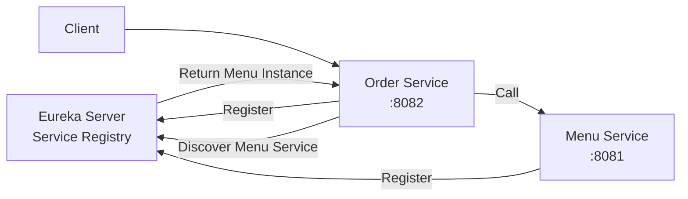
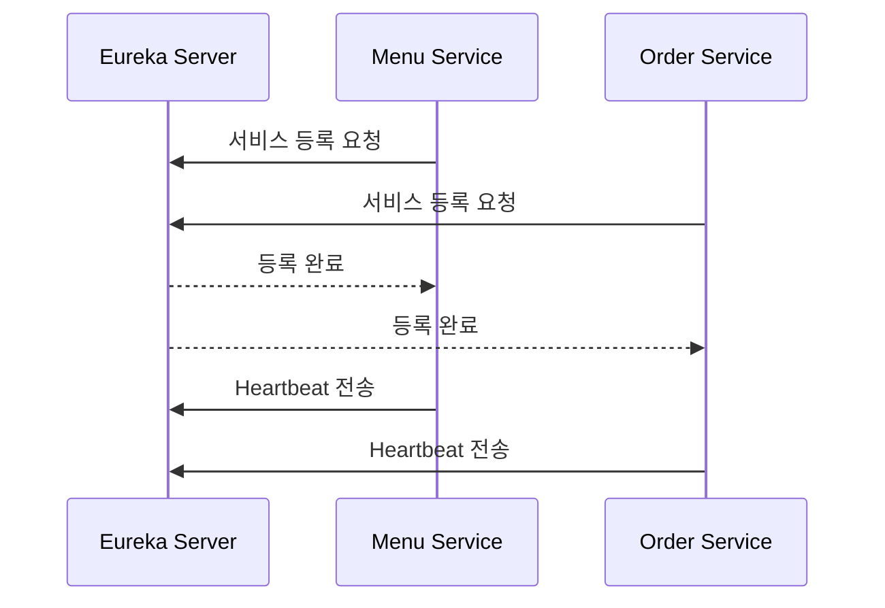
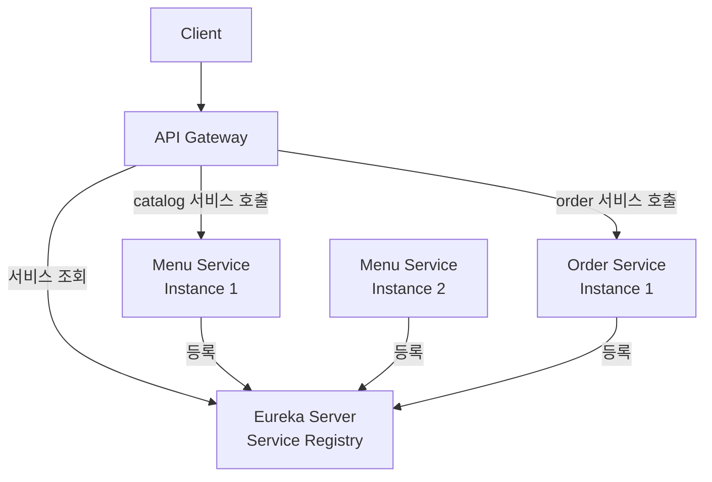

# Eureka 설정 & 서비스 등록 실습 

# Eureka 설정 & 서비스 등록 실습

* toc
{:toc}

---


## Eureka 설정과 서비스 등록 실습

MSA 환경에서는 여러 개의 서비스가 각각 독립적으로 실행된다.
이때 중요한 문제는 **각 서비스의 위치를 어떻게 찾을 것인가**이다.

모놀리식 구조에서는 하나의 애플리케이션 내부에서 메서드를 호출하면 되지만,
MSA에서는 서비스가 서로 다른 프로세스, 서로 다른 포트, 때로는 서로 다른 서버에서 실행된다.

따라서 서비스 간 통신을 위해서는
각 서비스가 어디에 있는지 등록하고 조회할 수 있는 구조가 필요하다.

이 역할을 수행하는 대표적인 도구가 **Eureka**이다.

---

## Eureka란?

Eureka는 Netflix OSS 기반의 Service Registry 도구이다.

Service Registry는 각 마이크로서비스의 위치 정보를 등록하고,
다른 서비스가 필요한 서비스를 찾을 수 있도록 도와주는 저장소 역할을 한다.

즉, Eureka는 다음과 같은 문제를 해결한다.

* 서비스가 어떤 주소에서 실행 중인지 알기 어려움
* 인스턴스가 늘어나거나 줄어들 때 호출 대상 관리가 어려움
* 고정 IP 기반 호출이 확장성에 불리함

MSA 환경에서는 서비스 인스턴스가 동적으로 생성되고 종료될 수 있기 때문에
서비스 위치를 고정하지 않고 등록/조회 방식으로 관리하는 것이 중요하다.

---

## Service Registry와 Service Discovery

Eureka를 이해하려면 두 가지 개념을 먼저 이해해야 한다.

---

### Service Registry

Service Registry는 서비스 목록을 관리하는 저장소이다.

각 서비스는 실행될 때 자신의 정보를 Registry에 등록한다.

예를 들어 다음과 같은 정보가 등록될 수 있다.

* 서비스 이름
* 호스트
* 포트
* 상태
* 인스턴스 ID

---

### Service Discovery

Service Discovery는 필요한 서비스의 위치를 찾는 과정이다.

예를 들어 주문 서비스가 메뉴 서비스를 호출해야 한다면,
주문 서비스는 메뉴 서비스의 고정 주소를 직접 알 필요가 없다.

대신 Service Registry에
“메뉴 서비스가 어디에 있나요?”라고 물어보고
등록된 인스턴스 정보를 받아 호출할 수 있다.

---

## Eureka 기반 서비스 등록 구조

Eureka 기반 구조는 다음과 같이 정리할 수 있다.



이 구조에서 핵심은 다음과 같다.

* Eureka Server는 서비스 목록을 관리한다
* Menu Service와 Order Service는 Eureka Client로 등록된다
* 서비스 간 호출 시 Eureka를 통해 대상 서비스를 찾을 수 있다

---

## Eureka Server 구성

강의 자료에서는 `EurekaServer` 프로젝트를 생성하고,
Eureka Server 의존성을 추가하는 방식으로 실습을 진행한다.

Spring Initializr 설정 예시는 다음과 같다.

```text
Group: orderservice.msa.sample
Artifact: EurekaServer
Name: EurekaServer
Packaging: Jar
Java Version: 17
Build Tool: Maven
```

---

## Eureka Server 의존성 추가

Eureka Server를 사용하려면 Spring Cloud Netflix Eureka Server 의존성을 추가해야 한다.

강의 자료에서는 다음과 같은 의존성 구성을 사용한다.

```xml
<spring.cloud.version>2.2.5.RELEASE</spring.cloud.version>
```

```xml
<dependency>
    <groupId>org.springframework.cloud</groupId>
    <artifactId>spring-cloud-starter-netflix-eureka-server</artifactId>
    <version>${spring.cloud.version}</version>
</dependency>
```

---

## Eureka Server 활성화

Eureka Server 애플리케이션에는 `@EnableEurekaServer`를 추가한다.

```java
@SpringBootApplication
@EnableEurekaServer
public class EurekaServerApplication {
    public static void main(String[] args) {
        SpringApplication.run(EurekaServerApplication.class, args);
    }
}
```

이 설정을 통해 해당 Spring Boot 애플리케이션이
서비스 등록소 역할을 수행하게 된다.

---

## Eureka Server 설정

일반적으로 Eureka Server는 `8761` 포트를 사용한다.

```yaml
server:
  port: 8761

spring:
  application:
    name: eureka-server

eureka:
  client:
    register-with-eureka: false
    fetch-registry: false
```

---

### register-with-eureka 옵션

Eureka Server 자신을 Eureka에 등록할지 여부를 설정한다.

Eureka Server는 Registry 역할을 하기 때문에
일반적으로 자기 자신을 등록하지 않는다.

---

### fetch-registry 옵션

Eureka Server가 다른 서비스 목록을 가져올지 여부를 설정한다.

단일 Eureka Server 구성에서는 보통 `false`로 둔다.

---

## Eureka Client 구성

Eureka에 등록될 서비스는 Eureka Client로 구성한다.

예를 들어 Order Service를 Eureka에 등록하려면
다음 의존성을 추가한다.

강의 자료에서도 Order 서비스에 Eureka Client 의존성을 추가하는 예시를 제공한다.

```xml
<spring.cloud.version>2.2.5.RELEASE</spring.cloud.version>
```

```xml
<dependency>
    <groupId>org.springframework.cloud</groupId>
    <artifactId>spring-cloud-starter-netflix-eureka-client</artifactId>
    <version>${spring.cloud.version}</version>
</dependency>
```

---

## Eureka Client 설정

Order Service는 다음과 같이 설정할 수 있다.

```yaml
server:
  port: 8082

spring:
  application:
    name: order

eureka:
  client:
    service-url:
      defaultZone: http://localhost:8761/eureka
```

Menu Service도 동일하게 Eureka Client로 등록할 수 있다.

```yaml
server:
  port: 8081

spring:
  application:
    name: catalog

eureka:
  client:
    service-url:
      defaultZone: http://localhost:8761/eureka
```

---

## 서비스 등록 확인

Eureka Server를 실행한 뒤
Menu Service와 Order Service를 실행하면
Eureka Dashboard에서 등록된 인스턴스를 확인할 수 있다.

강의 자료의 실행 화면에서도
Eureka Server가 `8761` 포트로 실행되고,
Menus는 `8081`, Orders는 `8082` 포트에서 실행되는 것을 확인할 수 있다.

또한 Eureka Dashboard에는 등록된 서비스 목록이 표시된다.

예시:

```text
CATALOG
ORDER
```

---

## Eureka 등록 흐름

Eureka 등록 과정은 다음과 같이 정리할 수 있다.



서비스는 한 번 등록하고 끝나는 것이 아니라
주기적으로 Heartbeat를 보내 자신의 상태를 알린다.

Eureka Server는 Heartbeat를 통해
서비스가 정상적으로 살아 있는지 판단한다.

---

## Eureka를 사용하는 이유

Eureka를 사용하면 서비스 위치를 코드에 고정하지 않아도 된다.

예를 들어 기존 방식은 다음과 같다.

```text
http://localhost:8081/menus/menuinfo/200
```

하지만 MSA 환경에서는 인스턴스가 여러 개일 수 있고,
포트나 주소가 변경될 수 있다.

Eureka를 사용하면 서비스 이름 기반으로 대상을 찾을 수 있다.

```text
http://catalog/menus/menuinfo/200
```

즉, 물리적인 주소가 아니라
논리적인 서비스 이름을 기반으로 통신할 수 있다.

---

## MSA 관점에서 Eureka의 의미

Eureka는 단순히 서비스를 등록하는 도구가 아니다.

MSA 환경에서 Eureka는 다음 역할을 한다.

* 서비스 위치 추상화
* 동적 서비스 확장 지원
* 인스턴스 상태 관리
* 로드밸런싱 기반 제공
* API Gateway와 연계 가능

API Gateway는 Eureka와 연동하여
요청을 특정 서비스 이름 기준으로 라우팅할 수 있다.

---

## 전체 구조 정리



---

## 정리

Eureka는 MSA 환경에서 서비스 등록과 탐색을 담당하는 핵심 구성 요소이다.

서비스가 많아지고 인스턴스가 동적으로 변경되는 환경에서는
서비스 주소를 직접 관리하는 방식이 한계에 부딪힌다.

Eureka를 사용하면 각 서비스가 자신의 위치를 등록하고,
다른 서비스나 API Gateway가 필요한 서비스를 동적으로 찾을 수 있다.

---

### 한 줄 요약

Eureka는 MSA 환경에서
각 마이크로서비스의 위치 정보를 등록하고 조회할 수 있게 해주는 Service Registry이며,
서비스 간 통신을 고정 주소가 아닌 서비스 이름 기반으로 처리할 수 있게 도와준다.

