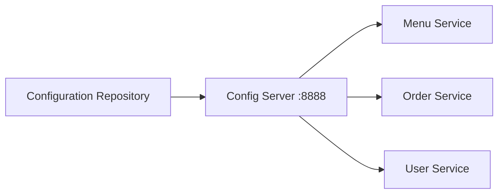
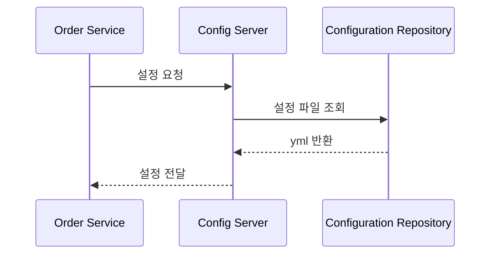
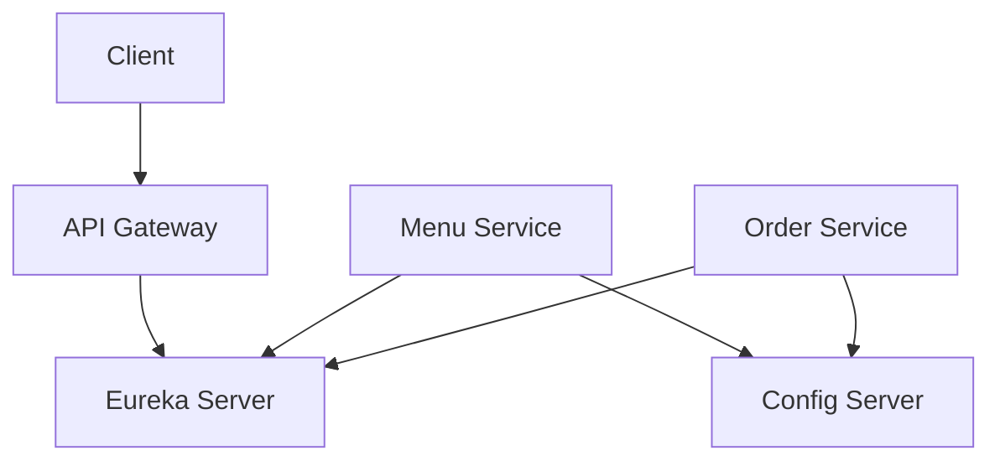

# Config Server 구성 

# Config Server 구성

* toc
{:toc}

---

## Config Server란 무엇인가?

MSA 환경에서는 서비스 개수가 많아질수록 설정 관리가 매우 복잡해진다.

예를 들어 다음과 같은 설정들이 서비스마다 존재할 수 있다.

* DB 연결 정보
* Redis 설정
* Kafka 설정
* 외부 API URL
* 인증 정보
* 환경(dev, stage, prod)별 설정

서비스가 몇 개 없을 때는 `application.yml` 파일을 직접 관리해도 괜찮다.
하지만 서비스가 많아지면 설정 변경과 배포 관리가 매우 어려워진다.

이 문제를 해결하기 위해 사용하는 것이 바로 **Config Server**이다.

강의 자료에서도 Config Server를
MSA 환경에서 설정 정보를 중앙 관리하기 위한 핵심 구성 요소로 설명한다.

---

## Config Server가 필요한 이유

MSA 환경에서는 다음과 같은 문제가 자주 발생한다.

* 서비스마다 설정 파일이 중복됨
* 환경별 설정 관리 어려움
* 설정 변경 시 재배포 필요
* 운영 환경 설정 추적 어려움

예를 들어:

```text
Order Service
User Service
Menu Service
Payment Service
```

각 서비스마다 DB 주소와 포트가 다르고,
운영 환경(dev/prod)에 따라 값도 달라질 수 있다.

이런 설정을 각각의 프로젝트 안에서 관리하면
운영 복잡도가 급격하게 증가한다.

---

## Config Server의 핵심 개념

Config Server는
애플리케이션 설정 정보를 중앙에서 관리하는 서버이다.

각 서비스는 실행 시 Config Server로부터 설정 정보를 가져온다.

즉:

* 설정은 중앙 서버에서 관리
* 서비스는 필요한 설정만 조회

하는 구조이다.

---

## Config Server 구조

전체 흐름은 다음과 같이 구성된다.



이 구조에서 중요한 점은:

* 설정 파일은 중앙 저장소에서 관리된다
* 각 서비스는 실행 시 Config Server에 요청한다
* Config Server가 필요한 설정을 반환한다

---

## Config Server 의존성 추가

강의 자료에서는 Spring Cloud Config Server 의존성을 추가하는 방식으로 구성한다.

```xml
<dependency>
    <groupId>org.springframework.cloud</groupId>
    <artifactId>spring-cloud-config-server</artifactId>
    <version>${spring.cloud.version}</version>
</dependency>
```

Spring Cloud Config Server는
설정 파일을 외부에서 읽고 서비스에 전달하는 역할을 한다.

---

## Config Server 활성화

Config Server 애플리케이션에는
`@EnableConfigServer`를 추가해야 한다.

```java
@SpringBootApplication
@EnableConfigServer
public class ConfigServerApplication {

    public static void main(String[] args) {
        SpringApplication.run(ConfigServerApplication.class, args);
    }
}
```

이 설정을 통해 해당 애플리케이션이 Config Server 역할을 수행한다.

---

## application.yml 설정

강의 자료에서는 Config Server를 `8888` 포트로 실행한다.

```yaml
server:
  port: 8888

spring:
  application:
    name: config-server

  profiles:
    active: native

  cloud:
    config:
      server:
        native:
          search-locations: classpath:configuration-repository/
```

---

## native 프로필

`native` 프로필은
로컬 파일 시스템 또는 classpath 기반 설정 저장소를 사용하는 방식이다.

즉:

```text
configuration-repository/
```

폴더 내부의 yml 파일들을 설정 저장소처럼 사용하는 구조이다.

---

## 설정 파일 구조

강의 자료에서는 다음과 같은 설정 파일 예시를 제공한다.

---

### templateSimple-dev.yml

```yaml
config:
  profile: sht
  message: templateSimple(dev)

Globals:
  DbType: mysql
  DriverClassName: com.mysql.jdbc.Driver
  Url: jdbc:mysql://127.0.0.1:3306/sht
  Username: admin
  Password: admin
```

---

### templatePortal-dev.yml

```yaml
config:
  profile: pst
  message: templatePortal(dev)

Globals:
  DbType: mysql
  DriverClassName: com.mysql.jdbc.Driver
  Url: jdbc:mysql://127.0.0.1:3306/pst
  Username: admin
  Password: admin
```

---

### templateEnterprise-dev.yml

```yaml
config:
  profile: ebt
  message: templateEnterprise(dev)

Globals:
  DbType: mysql
  DriverClassName: com.mysql.jdbc.Driver
  Url: jdbc:mysql://127.0.0.1:3306/ebt
  Username: admin
  Password: admin
```

---

## 설정 파일 명명 규칙

Config Server는 일반적으로 다음 규칙으로 설정 파일을 조회한다.

```text
{application-name}-{profile}.yml
```

예를 들어:

```text
order-dev.yml
catalog-prod.yml
payment-stage.yml
```

---

## Config Server 요청 흐름

서비스는 실행 시 Config Server에 설정 정보를 요청한다.



---

## MSA에서 Config Server가 중요한 이유

MSA 환경에서는 설정이 매우 많아진다.

예를 들어 서비스마다:

* DB 설정
* Redis 설정
* Kafka 주소
* 외부 API URL

등이 모두 다를 수 있다.

Config Server를 사용하면:

* 설정 중앙 관리 가능
* 환경별 설정 분리 가능
* 설정 변경 추적 가능
* 서비스 재배포 최소화 가능

---

## Eureka + Config Server 구조

실제 MSA 환경에서는 Eureka와 Config Server를 함께 사용하는 경우가 많다.

강의 자료에서도
Config Server가 Eureka와 함께 동작하는 구조를 보여준다.

전체 구조는 다음과 같이 정리할 수 있다.



---

## 실행 환경 예시

강의 자료 실행 화면에서는 다음 서비스들이 함께 실행되는 것을 확인할 수 있다.

```text
ConfigServer : 8888
EurekaServer : 8761
Menus : 8081
Orders : 8082
ZuulServer : 8000
```

이 구조는 기본적인 Spring Cloud 기반 MSA 구조에 해당한다.

---

## Actuator 확인

강의 자료에서는 Config Server의 Actuator 엔드포인트 확인 화면도 제공한다.

예시:

```text
http://localhost:8888/actuator
```

Actuator를 통해 다음 정보를 확인할 수 있다.

* health
* info
* metrics
* env

이는 운영 환경에서 상태 모니터링에 매우 중요하다.

---

## Config Server의 장점

정리하면 Config Server는 다음 장점을 가진다.

---

### 설정 중앙화

설정을 한 곳에서 관리 가능

---

### 환경별 설정 분리

dev / stage / prod 설정 분리 가능

---

### 운영 효율성 증가

설정 변경 시 서비스 전체 수정 불필요

---

### 보안 관리 용이

민감한 설정을 중앙에서 관리 가능

---

## 정리

Config Server는 MSA 환경에서
분산된 서비스들의 설정 정보를 중앙에서 관리하기 위한 핵심 구성 요소이다.

서비스는 실행 시 Config Server로부터 필요한 설정을 받아 사용하며,
이를 통해 설정 중복과 운영 복잡도를 줄일 수 있다.

---

### 한 줄 요약

Config Server는
MSA 환경에서 여러 서비스의 설정 정보를 중앙 집중 방식으로 관리하여
환경별 설정 분리, 운영 효율성 향상, 설정 변경 관리 등을 가능하게 해주는 구성 요소이다.
