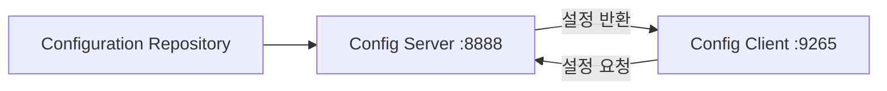
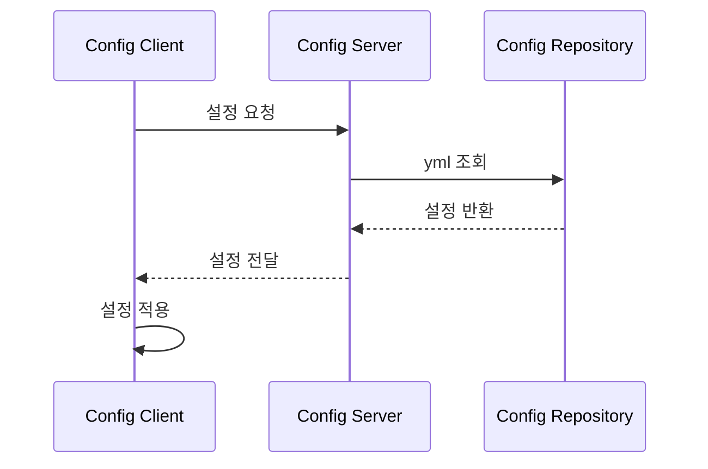
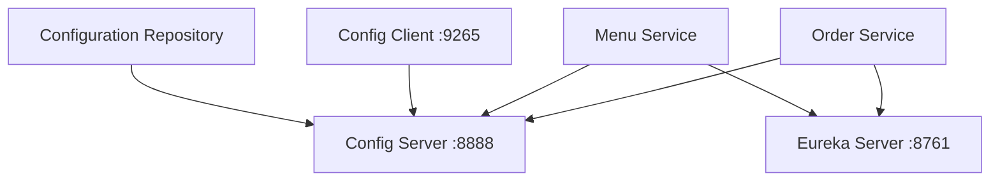

# Config Client 구성

# Config Client 구성

* toc
{:toc}

---

## Config Client란 무엇인가?

Config Server를 구축했다면,
이제 각 마이크로서비스가 Config Server로부터 설정 정보를 가져와야 한다.

이 역할을 수행하는 것이 바로 **Config Client**이다.

Config Client는
애플리케이션 실행 시 Config Server에 접속하여
필요한 설정 값을 가져오는 역할을 한다.

강의 자료에서도 Config Client를 통해
중앙 설정 서버의 값을 실제 애플리케이션에서 사용하는 과정을 설명한다.

---

## Config Client가 필요한 이유

MSA 환경에서는 서비스마다 다양한 설정이 존재한다.

예를 들어:

* DB 연결 정보
* Redis 설정
* Kafka 주소
* 환경(dev/prod) 설정
* 외부 API URL

이러한 설정을 각 서비스 내부에 직접 작성하면:

* 설정 중복 발생
* 환경 변경 어려움
* 운영 관리 복잡도 증가

문제가 발생한다.

Config Client는 이러한 문제를 해결하기 위해
Config Server와 연결되어 중앙 설정을 가져온다.

---

## Config Client 구조

전체 흐름은 다음과 같다.



이 구조에서 중요한 점은:

* Config Client는 설정을 직접 관리하지 않는다
* Config Server로부터 필요한 설정을 조회한다
* 설정 변경 시 중앙에서 관리 가능하다

---

## Config Client 의존성 구성

강의 자료에서는 Config Client 프로젝트에
Spring Cloud Config Client 의존성을 추가한다.

---

### Config Client 의존성

```xml
<dependency>
    <groupId>org.springframework.cloud</groupId>
    <artifactId>spring-cloud-config-client</artifactId>
    <version>${spring.cloud.version}</version>
</dependency>
```

이 의존성을 통해 애플리케이션은
Config Server와 통신할 수 있게 된다.

---

## 추가 의존성 구성

강의 자료에서는 다음 의존성들도 함께 추가한다.

---

### AMQP Bus 의존성

```xml
<dependency>
    <groupId>org.springframework.cloud</groupId>
    <artifactId>spring-cloud-starter-bus-amqp</artifactId>
    <version>${spring.cloud.version}</version>
</dependency>
```

RabbitMQ 기반 메시지 브로커를 사용하여
설정 변경 이벤트를 전달하기 위한 구성이다.

---

### Actuator 의존성

```xml
<dependency>
    <groupId>org.springframework.boot</groupId>
    <artifactId>spring-boot-starter-actuator</artifactId>
</dependency>
```

운영 상태 및 설정 갱신을 위한 엔드포인트를 제공한다.

---

### Spring Web 의존성

```xml
<dependency>
    <groupId>org.springframework.boot</groupId>
    <artifactId>spring-boot-starter-web</artifactId>
</dependency>
```

REST API 구성을 위한 의존성이다.

---

## Config Client 애플리케이션 구성

강의 자료에서는 `ConfigClientApplication` 클래스를 구성한다.

```java
@SpringBootApplication
public class ConfigClientApplication {

    public static void main(String[] args) {

        String profile = System.getProperty("spring.profiles.active");

        if(profile == null) {
            System.setProperty("spring.profiles.active", "dev");
        }

        SpringApplication.run(ConfigClientApplication.class, args);
    }
}
```

---

## profile 설정

애플리케이션 실행 시 profile이 지정되지 않으면
기본적으로 `dev` profile을 사용하도록 설정한다.

즉:

```text
dev
```

환경 기반 설정을 기본값으로 지정하는 구조이다.

---

## bootstrap.yml 설정

Config Client는 `bootstrap.yml`을 사용하여
Config Server 연결 정보를 먼저 읽는다.

강의 자료의 설정 예시는 다음과 같다.

```yaml
server:
  port: 9265

spring:
  application:
    name: templateEnterprise

cloud:
  config:
    uri: http://localhost:8888
```

---

## 왜 bootstrap.yml을 사용하는가?

`application.yml`보다 먼저 로딩되기 때문이다.

즉:

1. bootstrap.yml 로드
2. Config Server 연결
3. 외부 설정 조회
4. application.yml 적용

순서로 동작한다.

---

## application 이름의 의미

```yaml
spring:
  application:
    name: templateEnterprise
```

이 설정은 Config Server에서 조회할 설정 파일 이름과 연결된다.

예를 들어 Config Server 내부에:

```text
templateEnterprise-dev.yml
```

파일이 존재하면
해당 설정 정보를 가져오게 된다.

---

## application.yml 설정

강의 자료에서는 management endpoint와 RabbitMQ 설정도 함께 구성한다.

```yaml
management:
  endpoints:
    web:
      exposure:
        include: ['env', 'refresh']

spring:
  rabbitmq:
    host: localhost
    port: 5672
    username: guest
    password: guest
```

---

## management endpoint

Actuator를 통해 다음 기능을 활성화한다.

* env
* refresh

---

### env endpoint

현재 설정 정보를 확인할 수 있다.

예시:

```text
http://localhost:9265/actuator/env
```

---

### refresh endpoint

Config Server의 변경 사항을 다시 반영할 수 있다.

즉:

* 애플리케이션 재시작 없이
* 설정 재조회 가능

---

## @RefreshScope

강의 자료에서는 Controller에 `@RefreshScope`를 적용한다.

```java
@RestController
@RefreshScope
public class ConfigClientController {
```

---

## @RefreshScope 역할

설정 변경 후 refresh 요청이 들어오면
Bean을 다시 생성하여 최신 설정 값을 반영한다.

즉:

* 설정 변경
* refresh 호출
* 최신 값 반영

구조이다.

---

## 설정 값 주입

Config Client는 `@Value`를 사용하여 설정 값을 주입받는다.

```java
@Value("${config.profile}")
private String profile;

@Value("${config.message}")
private String message;
```

이 값들은 Config Server의 yml 파일에서 가져온다.

---

## API 구성

강의 자료에서는 다음 API를 제공한다.

---

### profile 조회

```java
@GetMapping("/config/profile")
public String profile() {
    return profile;
}
```

---

### message 조회

```java
@GetMapping("/config/message")
public String message() {
    return message;
}
```

---

## 실행 결과

강의 자료 실행 화면에서는
Config Client가 `9265` 포트에서 실행되는 것을 확인할 수 있다.

또한 다음 API 결과도 확인할 수 있다.

---

### message 조회 결과

```text
templateEnterprise(dev)
```

---

### profile 조회 결과

```text
ebt
```

즉, Config Server의 설정 값이 실제 애플리케이션에 적용된 것을 확인할 수 있다.

---

## Actuator env 확인

강의 자료 마지막 화면에서는 `/actuator/env` 결과를 보여준다.

여기서 확인 가능한 정보는 다음과 같다.

* activeProfiles
* config.profile
* config.message
* DB 설정 정보

즉, Config Server의 설정 값이 실제 Environment에 반영된 것을 확인할 수 있다.

---

## Config Client 동작 흐름

전체 흐름은 다음과 같다.



---

## Config Client의 핵심 장점

---

### 설정 중앙 관리

서비스 내부 설정 제거 가능

---

### 환경별 설정 분리

dev / stage / prod 관리 가능

---

### 재배포 최소화

refresh 기반 설정 변경 가능

---

### 운영 효율성 향상

설정 변경 시 중앙에서 관리 가능

---

## Config Server + Config Client 전체 구조



---

## 정리

Config Client는 Config Server로부터 설정 정보를 가져와
애플리케이션에 적용하는 역할을 수행한다.

이를 통해 MSA 환경에서 설정을 중앙 집중 방식으로 관리할 수 있으며,
환경별 설정 분리와 운영 효율성을 크게 향상시킬 수 있다.

---

### 한 줄 요약

Config Client는
MSA 환경에서 Config Server로부터 설정 정보를 조회하여 애플리케이션에 적용하는 구성 요소이며,
중앙 설정 관리와 동적 설정 반영을 가능하게 해주는 핵심 역할을 수행한다.
