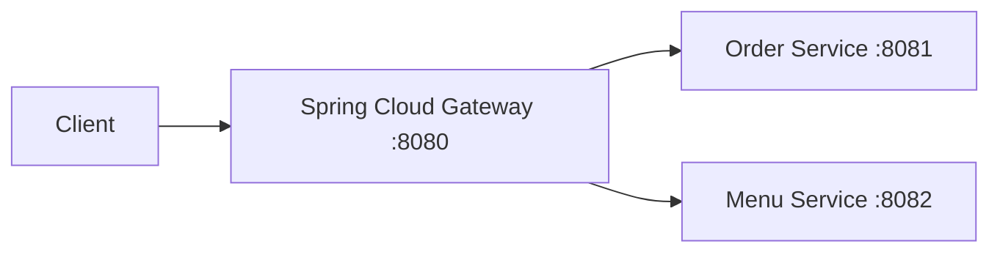
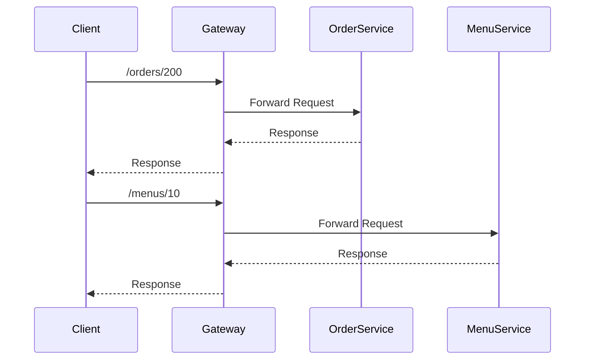
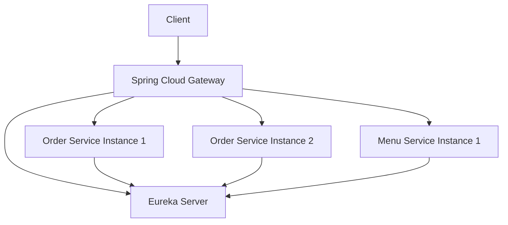

# Spring Cloud Gateway 구현

# Spring Cloud Gateway 구현

* toc
{:toc}

---

## Spring Cloud Gateway란?

MSA 환경에서는 여러 개의 마이크로서비스가 독립적으로 동작한다.
이때 클라이언트가 각 서비스의 주소를 직접 호출하도록 구성하면 다음과 같은 문제가 발생할 수 있다.

* 서비스 주소 변경 시 클라이언트 수정 필요
* 인증 로직 중복
* 공통 처리 로직 분산
* 서비스 구조 외부 노출
* 라우팅 관리 복잡도 증가

이 문제를 해결하기 위해 사용하는 것이 바로 **API Gateway**이다.

강의 자료에서는 Spring Cloud Gateway를 사용하여
클라이언트 요청을 각 마이크로서비스로 라우팅하는 구조를 설명한다.

---

## Spring Cloud Gateway의 역할

Spring Cloud Gateway는
클라이언트 요청의 진입점 역할을 수행한다.

즉:

* 모든 요청은 Gateway를 먼저 통과
* Gateway가 적절한 서비스로 전달
* 공통 로직을 중앙에서 처리

하는 구조이다.

---

## API Gateway가 필요한 이유

MSA 환경에서는 서비스가 계속 증가한다.

예를 들어:

* 주문 서비스
* 메뉴 서비스
* 회원 서비스
* 결제 서비스

각 서비스가 서로 다른 포트와 주소로 실행된다면
클라이언트는 모든 주소를 알아야 한다.

예시:

```text
http://localhost:8081/orders/200
http://localhost:8082/menus/10
http://localhost:8083/users/5
```

이 방식은 서비스 변경에 매우 취약하다.

Gateway를 사용하면:

```text
http://localhost:8080/orders/200
http://localhost:8080/menus/10
```

처럼 단일 진입점으로 통합할 수 있다.

---

## Spring Cloud Gateway 구조

전체 흐름은 다음과 같다.



이 구조에서 핵심은:

* 클라이언트는 Gateway만 호출
* Gateway가 내부 서비스로 라우팅
* 내부 서비스 구조를 외부에 숨김

이라는 점이다.

---

## Spring Cloud Gateway 특징

강의 자료에서도 Spring Cloud Gateway를
고성능 API Gateway 솔루션으로 설명한다.

주요 특징은 다음과 같다.

---

### 요청 라우팅

요청 URL 기반으로 서비스 분기

---

### 필터 처리

공통 로직 처리 가능

예시:

* 인증
* 로깅
* 헤더 추가
* 요청 검증

---

### 비동기 처리

Spring WebFlux 기반의 Reactive 구조 지원

---

### 보안 강화

외부 요청을 Gateway에서 제어 가능

---

## Gateway 라우팅 구조

강의 자료에서는 다음과 같은 routing 설정을 사용한다.

```yaml
server:
  port: 8080

spring:
  cloud:
    gateway:
      routes:
        - id: order-service
          uri: http://localhost:8081
          predicates:
            - Path=/orders/**

        - id: menu-service
          uri: http://localhost:8082
          predicates:
            - Path=/menus/**
```

---

## routes란?

Gateway가 어떤 요청을 어디로 보낼지 정의하는 설정이다.

---

### order-service

```yaml
- id: order-service
```

라우팅 이름이다.

---

### uri

```yaml
uri: http://localhost:8081
```

실제 요청을 전달할 대상 서비스 주소이다.

즉:

```text
/orders/**
```

요청이 들어오면:

```text
http://localhost:8081
```

로 전달된다.

---

### predicates

```yaml
predicates:
  - Path=/orders/**
```

라우팅 조건을 의미한다.

즉:

```text
/orders/**
```

패턴과 일치하는 요청만 해당 서비스로 전달된다.

---

## Gateway 요청 흐름

전체 요청 흐름은 다음과 같다.



---

## 실제 실행 구조

강의 자료 실행 화면에서는 다음 서비스들이 함께 실행되는 것을 확인할 수 있다.

```text
gateway-service : 8080
Menus : 8081
Orders : 8082
ConfigServer : 8888
EurekaServer : 8761
```

즉, Gateway가 가장 앞단에서 요청을 받고
내부 서비스로 전달하는 구조이다.

---

## Gateway를 통한 요청 처리

강의 자료 실행 예시에서는 다음 요청을 확인할 수 있다.

```text
http://localhost:8080/orders/200
```

여기서 중요한 점은:

* 실제 Order Service는 8081 또는 8082에서 실행
* 클라이언트는 내부 포트를 알 필요 없음
* Gateway가 요청을 대신 전달

이라는 점이다.

---

## Gateway와 MSA 관계

Gateway는 단순 프록시 서버가 아니다.

MSA 환경에서 다음 역할을 수행한다.

---

### 단일 진입점 제공

클라이언트는 Gateway만 호출

---

### 내부 구조 은닉

서비스 주소 직접 노출 제거

---

### 공통 기능 중앙화

* 인증
* 로깅
* 요청 검증
* Rate Limiting

---

### 라우팅 관리

서비스별 요청 분기 처리

---

## Gateway + Eureka 구조

실제 운영 환경에서는 Eureka와 함께 사용하는 경우가 많다.

전체 구조는 다음과 같이 확장될 수 있다.



이 구조에서는 Gateway가 Eureka를 통해
동적으로 서비스 위치를 조회할 수 있다.

---

## Spring Cloud Gateway의 장점

정리하면 다음과 같다.

---

### 서비스 주소 추상화

클라이언트가 내부 주소를 몰라도 된다

---

### 중앙 집중 처리

공통 로직을 Gateway에서 처리 가능

---

### 보안 강화

외부 요청 제어 가능

---

### 확장성 향상

서비스 추가 및 변경 유연

---

### MSA 구조 단순화

클라이언트와 내부 서비스를 분리 가능

---

## 정리

Spring Cloud Gateway는
MSA 환경에서 클라이언트 요청을 중앙에서 처리하고
각 마이크로서비스로 라우팅하는 API Gateway 역할을 수행한다.

이를 통해 서비스 구조를 외부에 숨기고,
공통 기능을 중앙화하며,
서비스 간 결합도를 낮출 수 있다.

---

### 한 줄 요약

Spring Cloud Gateway는
MSA 환경에서 클라이언트 요청의 단일 진입점 역할을 수행하며,
라우팅, 공통 필터 처리, 보안, 서비스 추상화를 통해
마이크로서비스 간 통신 구조를 효율적으로 관리하는 API Gateway 솔루션이다.
