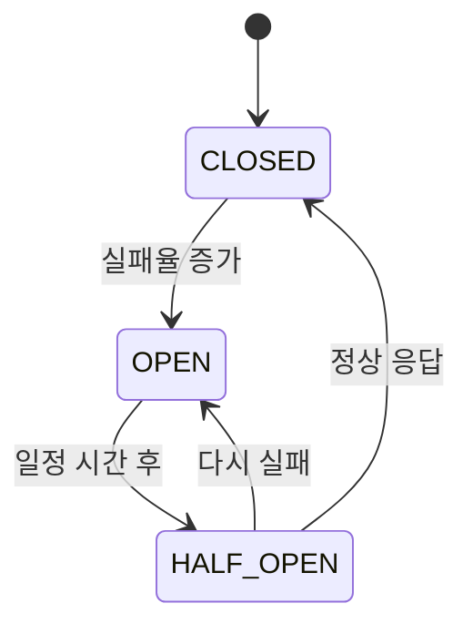
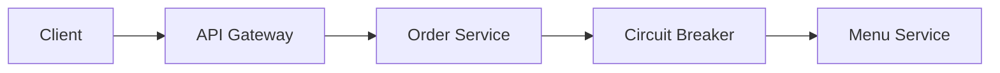
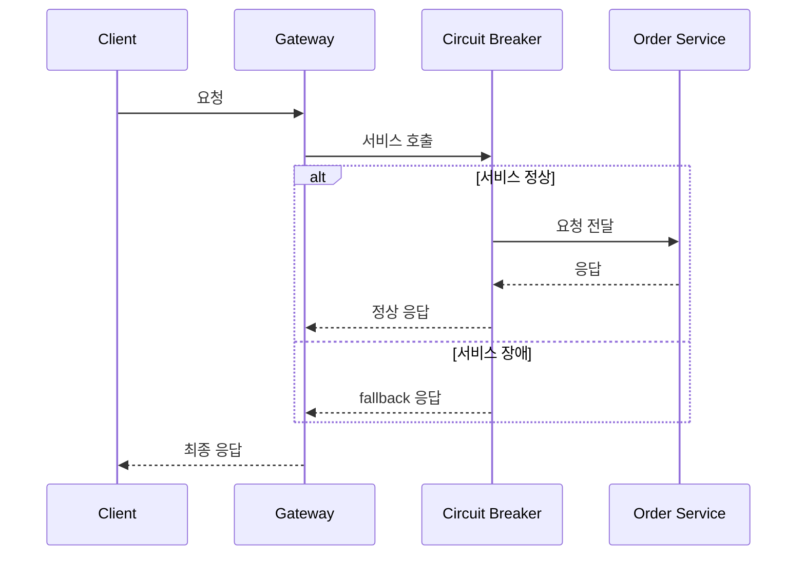
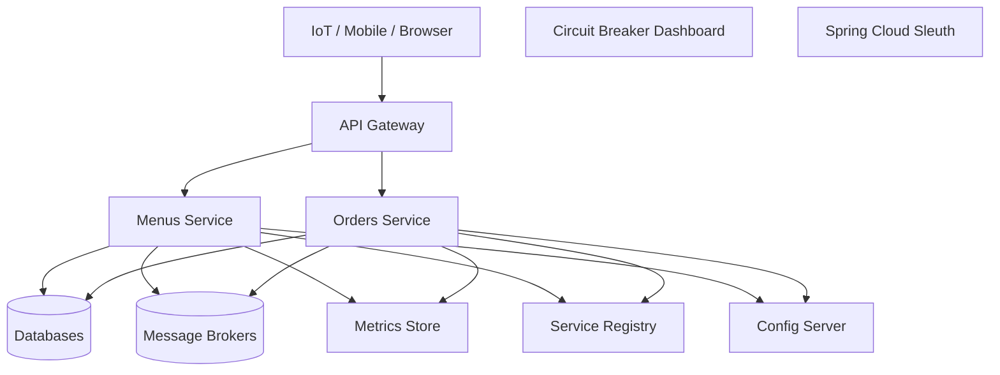

# 서킷 브레이커

# 서킷 브레이커

* toc
{:toc}

---

## 서킷 브레이커(Circuit Breaker)란?

MSA 환경에서는 서비스 간 호출이 매우 빈번하게 발생한다.

예를 들어:

* 주문 서비스 → 결제 서비스 호출
* 주문 서비스 → 메뉴 서비스 호출
* 배송 서비스 → 주문 서비스 호출

이때 특정 서비스가 장애 상태인데도 계속 요청을 보내면
장애가 전체 시스템으로 전파될 수 있다.

이 문제를 해결하기 위해 사용하는 패턴이 바로 **Circuit Breaker(서킷 브레이커)**이다.

---

## 서킷 브레이커가 필요한 이유

MSA 환경에서는 서비스 간 네트워크 호출이 많아진다.

예를 들어 다음과 같은 상황을 생각해보자.

```text
Client → Gateway → Order Service → Menu Service
```

여기서 Menu Service가 장애 상태인데도
Order Service가 계속 요청을 보내면:

* 응답 지연 증가
* 스레드 점유 증가
* 타임아웃 발생
* 전체 서비스 장애 전파

문제가 발생할 수 있다.

즉,

> 하나의 서비스 장애가 전체 시스템 장애로 확산될 수 있다

---

## 서킷 브레이커의 핵심 개념

서킷 브레이커는 전기 차단기와 비슷한 개념이다.

정상 상태에서는 요청을 전달하지만,
장애가 일정 수준 이상 발생하면 회로를 차단(Open)하여
추가 요청을 막는다.

---

## 서킷 브레이커 상태 변화



---

### CLOSED 상태

정상 상태이다.

* 요청 정상 전달
* 서비스 호출 가능

---

### OPEN 상태

장애 상태이다.

* 요청 차단
* fallback 실행
* 대상 서비스 호출 중단

---

### HALF_OPEN 상태

복구 확인 단계이다.

* 일부 요청만 허용
* 정상 여부 테스트

---

## MSA 환경에서 Circuit Breaker 구조



여기서 핵심은:

* 실제 서비스 호출 전에 Circuit Breaker가 중간에서 상태를 관리
* 장애 발생 시 호출 차단 가능

이라는 점이다.

---

## Resilience4j

Resilience4j는 Spring Cloud 환경에서 많이 사용하는 장애 대응 라이브러리이다.

MSA 환경에서:

* Circuit Breaker
* Retry
* Timeout
* Rate Limiter

등을 쉽게 구현할 수 있다.

---

## 의존성 추가

### Resilience4j Circuit Breaker

```xml
<dependency>
    <groupId>org.springframework.cloud</groupId>
    <artifactId>spring-cloud-starter-circuitbreaker-resilience4j</artifactId>
</dependency>
```

---

### Reactor Resilience4j

WebFlux 환경에서 사용하는 의존성이다.

```xml
<dependency>
    <groupId>org.springframework.cloud</groupId>
    <artifactId>spring-cloud-starter-circuitbreaker-reactor-resilience4j</artifactId>
</dependency>
```

---

## Gateway Circuit Breaker 설정

```yaml
server:
  port: 8080

spring:
  cloud:
    gateway:
      routes:
        - id: order-service
          uri: http://localhost:8082
          predicates:
            - Path=/orders/**

        - id: menu-service
          uri: http://localhost:8081
          predicates:
            - Path=/menus/**
```

---

## resilience4j 설정

```yaml
resilience4j:
  circuitbreaker:
    instances:
      myCircuitBreaker:
        register-health-indicator: true
        sliding-window-type: COUNT_BASED
        sliding-window-size: 5
        minimum-number-of-calls: 5
        failure-rate-threshold: 50
        wait-duration-in-open-state: 10s
        permitted-number-of-calls-in-half-open-state: 2
```

---

## 설정 값 의미

### sliding-window-size

```yaml
sliding-window-size: 5
```

최근 5개의 요청을 기준으로 실패율 계산

---

### failure-rate-threshold

```yaml
failure-rate-threshold: 50
```

실패율이 50%를 넘으면 OPEN 상태 전환

---

### wait-duration-in-open-state

```yaml
wait-duration-in-open-state: 10s
```

OPEN 상태 유지 시간

10초 후 HALF_OPEN 상태로 변경

---

### permitted-number-of-calls-in-half-open-state

```yaml
permitted-number-of-calls-in-half-open-state: 2
```

HALF_OPEN 상태에서 테스트 요청 허용 개수

---

## OrderServiceClient 구현

```java
@Service
public class OrderServiceClient {

    private final WebClient webClient;

    public OrderServiceClient(WebClient.Builder webClientBuilder) {
        this.webClient =
            webClientBuilder.baseUrl("http://localhost:8082").build();
    }

    @CircuitBreaker(
        name = "orderServiceCb",
        fallbackMethod = "fallbackOrders"
    )
    public Mono<String> getOrders() {

        return webClient.get()
            .uri("/orders")
            .retrieve()
            .bodyToMono(String.class);
    }

    public Mono<String> fallbackOrders(Throwable t) {

        return Mono.just(
            "Orders Service is currently unavailable."
        );
    }
}
```

---

## @CircuitBreaker 의미

```java
@CircuitBreaker(
    name = "orderServiceCb",
    fallbackMethod = "fallbackOrders"
)
```

해당 메서드 호출에 Circuit Breaker를 적용한다.

---

## fallbackMethod

서비스 장애 발생 시 대신 실행되는 메서드이다.

즉:

* 실제 서비스 호출 실패
* fallback 메서드 실행
* 기본 응답 반환

구조이다.

---

## fallback의 중요성

fallback은 사용자 경험 측면에서 매우 중요하다.

예를 들어 주문 서비스 장애 시:

```text
500 Internal Server Error
```

를 그대로 반환하는 대신:

```text
현재 주문 서비스를 사용할 수 없습니다.
잠시 후 다시 시도해주세요.
```

같은 대체 응답을 제공할 수 있다.

---

## Circuit Breaker 요청 흐름



---

## 테스트 코드

예시:

```java
StepVerifier.create(result)
    .expectNext(mockResponse)
    .verifyComplete();
```

---

## 장애 테스트

```java
.thenReturn(
    Mono.error(
        new RuntimeException("Simulated Error")
    )
);
```

이를 통해 fallback 동작을 검증할 수 있다.

---

## Circuit Breaker의 장점

### 장애 전파 방지

하나의 서비스 장애가 전체로 확산되는 것을 막는다.

---

### 빠른 실패(Fail Fast)

불필요한 대기 시간을 줄인다.

---

### 복원력 향상

서비스 장애 상황에서도 최소 기능 유지 가능

---

### 사용자 경험 개선

fallback 응답 제공 가능

---

## Spring Cloud 기반 MSA 전체 구조



---

## 정리

Circuit Breaker는
MSA 환경에서 장애 전파를 막고 시스템 복원력을 높이기 위한 핵심 패턴이다.

서비스 장애 발생 시 호출을 차단하고 fallback 응답을 제공함으로써
전체 시스템 안정성을 높일 수 있다.

Resilience4j를 활용하면 Spring Cloud 환경에서도 쉽게 Circuit Breaker를 구현할 수 있다.

---

### 한 줄 요약

Circuit Breaker는
MSA 환경에서 특정 서비스 장애가 전체 시스템으로 확산되는 것을 방지하기 위해
실패율 기반으로 서비스 호출을 차단하고 fallback 응답을 제공하는 장애 대응 패턴이다.
