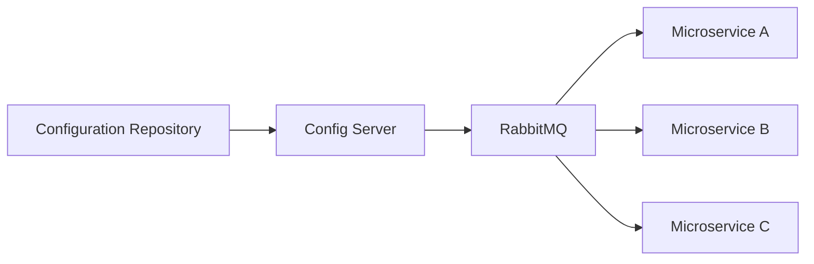
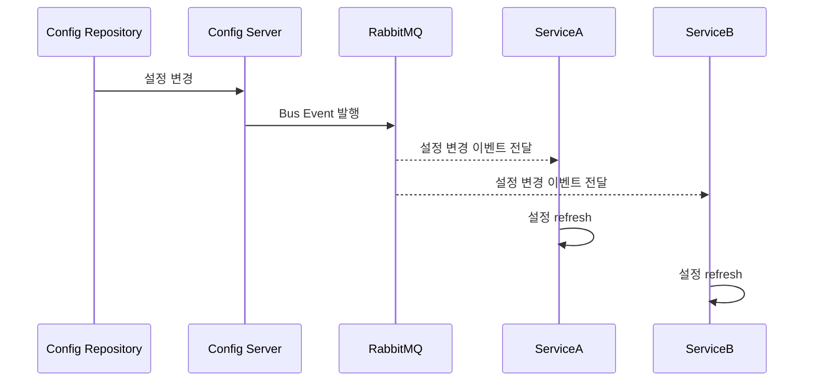
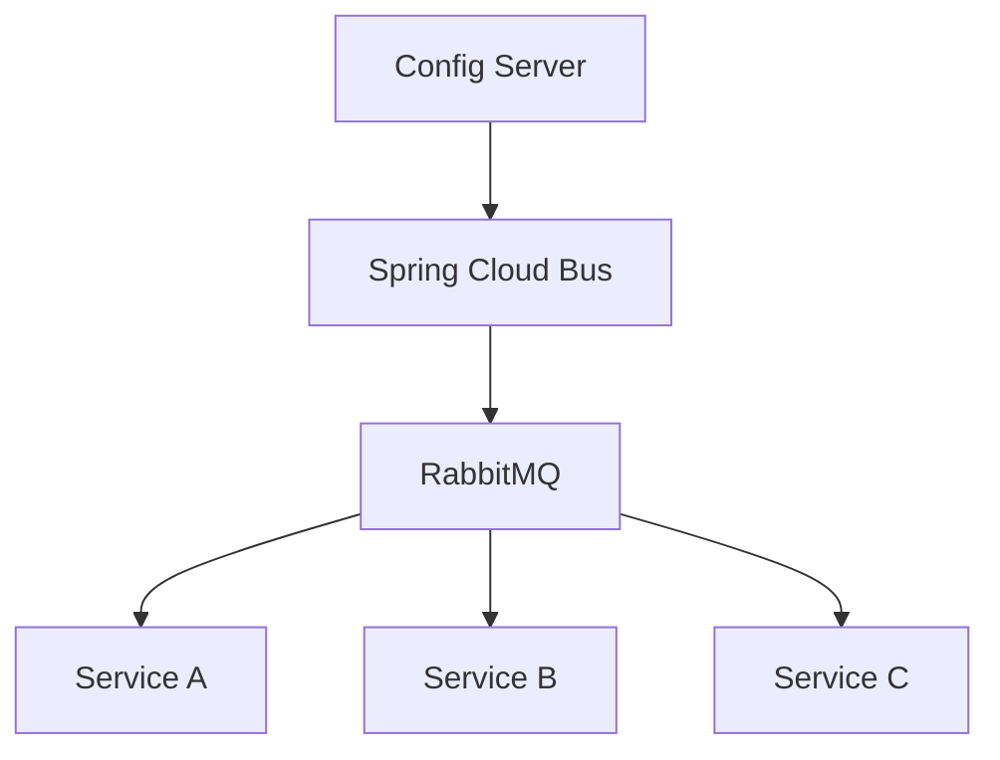
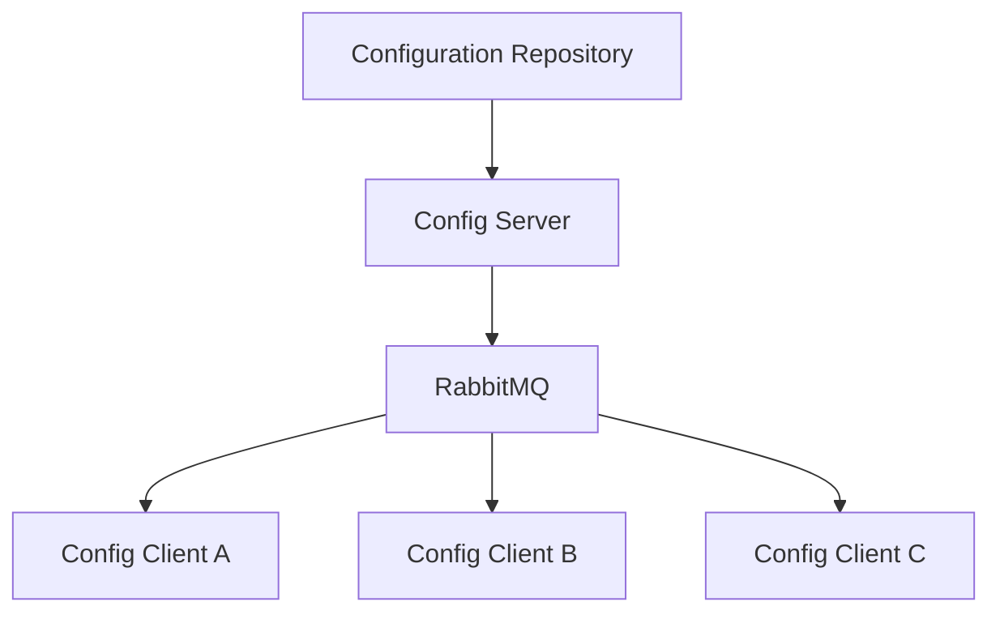

# Spring Cloud Bus (RabbitMQ) 적용

# Spring Cloud Bus (RabbitMQ) 적용

* toc
{:toc}

---

## Spring Cloud Bus란?

MSA 환경에서는 여러 개의 서비스가 동시에 실행된다.
그리고 각 서비스는 Config Server를 통해 설정 정보를 가져와 사용한다.

문제는 설정 파일이 변경되었을 때 발생한다.

예를 들어:

* DB 설정 변경
* 메시지 설정 변경
* 외부 API 주소 변경

등이 발생하면 각 서비스가 최신 설정을 다시 반영해야 한다.

기존 방식에서는:

* `/actuator/refresh` 직접 호출
* 서비스 재시작
* 각 서비스 수동 갱신

같은 작업이 필요했다.

이 문제를 해결하기 위해 사용하는 것이 바로 **Spring Cloud Bus**이다.

Spring Cloud Bus는
설정 변경 이벤트를 여러 마이크로서비스에 자동으로 전파하는 역할을 수행한다.

---

## Spring Cloud Bus가 필요한 이유

MSA 환경에서는 서비스 개수가 많다.

예를 들어:

* 주문 서비스
* 메뉴 서비스
* 회원 서비스
* 결제 서비스

등 여러 서비스가 Config Server와 연결되어 있을 수 있다.

이때 설정이 변경되면:

```text
서비스 A → refresh
서비스 B → refresh
서비스 C → refresh
```

를 모두 직접 호출해야 한다.

서비스 수가 많아질수록 운영 부담이 커진다.

즉,

> 설정 변경 이벤트를 자동으로 전파할 수 있는 구조가 필요하다

---

## Spring Cloud Bus의 핵심 개념

Spring Cloud Bus는
메시지 브로커(RabbitMQ, Kafka)를 이용하여
설정 변경 이벤트를 여러 서비스에 전달한다.

즉:

* 설정 변경 발생
* Bus 이벤트 발행
* 모든 서비스에 이벤트 전파
* 각 서비스 자동 refresh

구조로 동작한다.

---

## Spring Cloud Bus 구조



이 구조에서 핵심은:

* RabbitMQ가 이벤트 전달 역할 수행
* 설정 변경 이벤트를 브로드캐스트
* 각 서비스가 자동 반영

이라는 점이다.

---

## RabbitMQ란?

RabbitMQ는 메시지 브로커(Message Broker)이다.

메시지 브로커는:

* 메시지 전달
* 비동기 이벤트 처리
* 서비스 간 통신

등을 담당한다.

Spring Cloud Bus에서는 RabbitMQ를 이용해
설정 변경 이벤트를 전달한다.

---

## RabbitMQ 설치

RabbitMQ는 공식 사이트에서 다운로드할 수 있다.

관리 콘솔은 기본적으로 다음 주소를 사용한다.

```text
http://localhost:15672/
```

기본 계정:

```text
username: guest
password: guest
```

---

## RabbitMQ 설정

Spring Boot에서는 다음과 같이 RabbitMQ 연결 정보를 설정한다.

```yaml
spring:
  rabbitmq:
    host: localhost
    port: 5672
    username: guest
    password: guest
```

---

## Spring Cloud Bus 의존성 추가

Spring Cloud Bus를 사용하려면 다음 의존성을 추가한다.

```xml
<dependency>
    <groupId>org.springframework.cloud</groupId>
    <artifactId>spring-cloud-starter-bus-amqp</artifactId>
</dependency>
```

---

## Actuator 설정

설정 변경 이벤트를 처리하기 위해
Actuator endpoint를 활성화한다.

```yaml
management:
  endpoints:
    web:
      exposure:
        include: ['env', 'refresh']
```

---

## Spring Cloud Bus 동작 흐름

전체 흐름은 다음과 같다.



---

## Spring Cloud Bus의 핵심 역할

Spring Cloud Bus는
설정 변경 이벤트를 메시지 브로커를 통해 전파한다.

즉:

* 설정 중앙 관리
* 설정 변경 자동 전파
* 서비스 자동 refresh

를 가능하게 만든다.

---

## RabbitMQ 관리 콘솔

RabbitMQ는 웹 콘솔을 제공한다.

```text
http://localhost:15672
```

콘솔에서는 다음 정보를 확인할 수 있다.

* Connections
* Channels
* Exchanges
* Queues

---

## Exchange란?

Exchange는 메시지를 어떤 Queue로 전달할지 결정하는 구성 요소이다.

Spring Cloud Bus를 실행하면 다음과 같은 Exchange가 생성될 수 있다.

```text
springCloudBus
```

RabbitMQ 관리 화면에서도 해당 Exchange를 확인할 수 있다.

---

## Spring Cloud Bus와 RabbitMQ 관계



Spring Cloud Bus는 직접 이벤트를 전달하지 않고,
RabbitMQ 같은 메시지 브로커를 통해 이벤트를 전달한다.

---

## 설정 변경 예시

예를 들어 기존 설정이 다음과 같다고 가정해보자.

```yaml
config:
  profile: ebt
```

설정을 다음처럼 변경한다.

```yaml
config:
  profile: ebt-changed
```

Spring Cloud Bus 이벤트가 발생하면
서비스가 자동으로 최신 설정을 반영할 수 있다.

---

## Spring Cloud Bus의 장점

### 설정 자동 전파

모든 서비스에 설정 변경 자동 반영

---

### 운영 효율성 증가

수동 refresh 제거 가능

---

### 중앙 집중 설정 관리

Config Server와 연계 가능

---

### 확장성 향상

서비스 수 증가에도 효율적 운영 가능

---

## Spring Cloud Bus + Config Server + Config Client 구조

전체 구조를 정리하면 다음과 같다.



---

## Spring Cloud Bus가 중요한 이유

MSA 환경에서는 서비스 개수가 계속 증가한다.

서비스가 많아질수록 설정 변경 관리도 어려워진다.

Spring Cloud Bus는 이러한 문제를 해결하기 위해:

* 이벤트 기반 구조
* 메시지 브로커 기반 통신
* 자동 refresh

를 제공한다.

즉,

> 운영 자동화를 위한 핵심 구성 요소라고 볼 수 있다

---

## 정리

Spring Cloud Bus는
RabbitMQ 같은 메시지 브로커를 이용하여
설정 변경 이벤트를 여러 마이크로서비스에 자동 전파하는 구조이다.

이를 통해 Config Server의 설정 변경 사항을
여러 Config Client가 자동으로 반영할 수 있으며,
MSA 환경의 운영 효율성을 크게 향상시킬 수 있다.

---

### 한 줄 요약

Spring Cloud Bus는
RabbitMQ 기반 메시지 브로커를 통해 설정 변경 이벤트를 여러 마이크로서비스에 자동으로 전달하여
Config Client들의 설정 정보를 동적으로 refresh할 수 있게 해주는 이벤트 기반 구성 요소이다.

