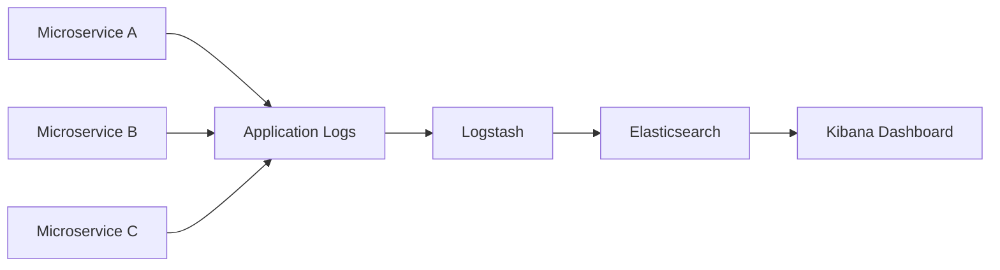
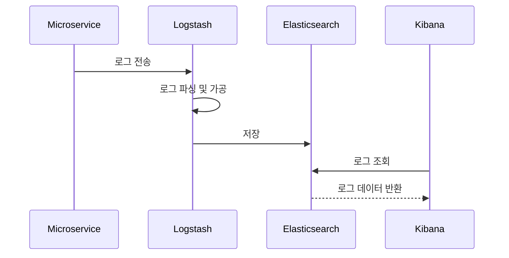
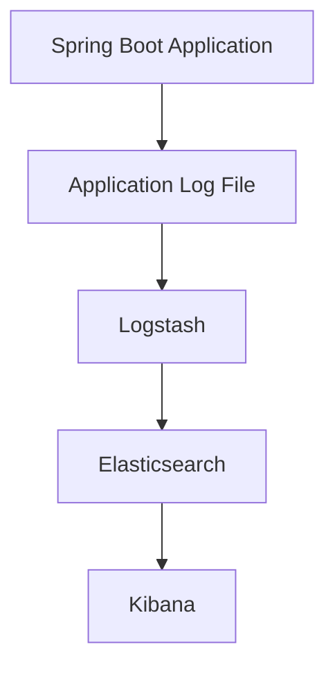
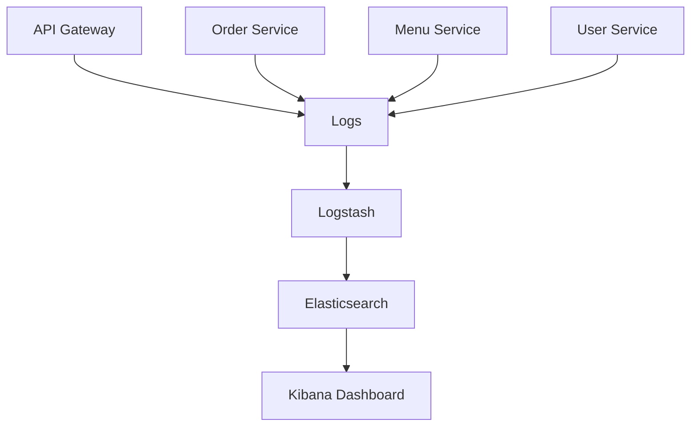

# ELK로 중앙집중식 로깅하기

# ELK로 중앙집중식 로깅하기

* toc
{:toc}

---

## ELK Stack를 활용한 중앙 집중식 로깅

MSA 환경에서는 여러 개의 마이크로서비스가 동시에 실행된다.

예를 들어:

* 주문 서비스
* 메뉴 서비스
* 회원 서비스
* 결제 서비스

각 서비스가 독립적으로 동작하다 보니
로그 역시 각각의 서비스 내부에 분산되어 저장된다.

문제는 장애가 발생했을 때이다.

예를 들어 주문 처리 중 오류가 발생하면:

* Gateway 로그 확인
* 주문 서비스 로그 확인
* 결제 서비스 로그 확인
* DB 로그 확인

등 여러 서버의 로그를 모두 확인해야 한다.

이 문제를 해결하기 위해 사용하는 것이 바로 **중앙 집중식 로깅(Centralized Logging)**이다.

대표적인 중앙 로그 시스템이 바로 **ELK Stack**이다.

ELK Stack은 로그 데이터를 수집하고 저장하며 시각화하여
전체 시스템 상태를 분석할 수 있게 해준다.

---

## ELK Stack이란?

ELK는 다음 세 가지 구성 요소를 의미한다.

* Elasticsearch
* Logstash
* Kibana

각 구성 요소는 서로 다른 역할을 수행한다.

---

## ELK Stack 구조



이 구조에서 핵심은:

* 여러 서비스 로그를 한 곳으로 수집
* 중앙 저장
* 실시간 검색 및 시각화

라는 점이다.

---

## ELK 구성 요소 역할

---

### Elasticsearch

로그 데이터를 저장하고 검색하는 역할을 수행한다.

특징:

* 분산 검색 엔진
* 대용량 로그 저장 가능
* 빠른 검색 지원
* JSON 기반 데이터 저장

즉,

> 로그 데이터 저장소 역할을 수행한다

---

### Logstash

로그 데이터를 수집하고 가공하는 역할을 수행한다.

특징:

* 로그 수집
* 로그 파싱
* 로그 변환
* Elasticsearch 전달

즉,

> 로그 파이프라인 역할을 수행한다

---

### Kibana

저장된 로그 데이터를 시각화하는 역할을 수행한다.

특징:

* 로그 검색
* 대시보드 구성
* 차트 및 그래프 제공
* 실시간 모니터링 가능

즉,

> 로그 분석 UI 역할을 수행한다

---

## 중앙 집중식 로깅이 필요한 이유

MSA 환경에서는 로그가 여러 서버에 분산된다.

예를 들어:

```text
Order Service → order.log
Menu Service → menu.log
Gateway → gateway.log
```

이 상태에서는:

* 장애 추적 어려움
* 로그 분석 복잡
* 실시간 모니터링 어려움

문제가 발생한다.

ELK Stack을 사용하면:

* 모든 로그를 중앙 수집
* 통합 검색 가능
* 실시간 분석 가능

해진다.

---

## ELK 기반 로그 수집 흐름



---

## Elasticsearch 설치

Elasticsearch는 공식 사이트에서 다운로드할 수 있다.

설치 후 기본적으로 다음 포트를 사용한다.

```text
http://localhost:9200
```

실행 후 브라우저에서 접속하면 Elasticsearch 상태 정보를 확인할 수 있다.

---

## Kibana 설치

Kibana는 Elasticsearch 데이터를 시각화하기 위한 도구이다.

기본적으로 다음 포트를 사용한다.

```text
http://localhost:5601
```

Kibana를 통해:

* 로그 검색
* Dashboard 구성
* 시각화 분석

이 가능하다.

---

## Logstash 설치

Logstash는 로그 수집 및 가공 역할을 수행한다.

Logstash는 다음 작업을 수행한다.

* 로그 파일 읽기
* JSON 변환
* 필드 파싱
* Elasticsearch 저장

---

## ELK Stack 동작 흐름



---

## Spring Boot 프로젝트 구성

ELK 연동을 위한 Spring Boot 프로젝트는 일반적으로 다음 의존성을 사용한다.

---

### Spring Web

```xml
<dependency>
    <groupId>org.springframework.boot</groupId>
    <artifactId>spring-boot-starter-web</artifactId>
</dependency>
```

REST API 기반 서비스 개발용 의존성

---

### WebSocket

```xml
<dependency>
    <groupId>org.springframework.boot</groupId>
    <artifactId>spring-boot-starter-websocket</artifactId>
</dependency>
```

실시간 로그 처리 및 이벤트 처리에 활용 가능

---

## ELK Stack의 핵심 가치

ELK Stack의 가장 큰 장점은
분산된 로그를 중앙에서 관리할 수 있다는 점이다.

즉:

* 장애 추적 용이
* 서비스 흐름 분석 가능
* 성능 문제 탐지 가능
* 실시간 운영 모니터링 가능

해진다.

---

## Kibana를 통한 로그 분석

Kibana에서는 다음 기능을 사용할 수 있다.

---

### 로그 검색

특정 키워드 기반 검색 가능

예시:

```text
ERROR
NullPointerException
orderId=100
```

---

### 시간 기반 조회

특정 시간 구간 로그 조회 가능

---

### Dashboard 구성

* 에러 발생률
* API 호출 수
* 응답 시간

등 시각화 가능

---

## MSA 환경에서 ELK 구조



---

## ELK Stack의 장점

### 중앙 집중식 로그 관리

모든 서비스 로그 통합 가능

---

### 빠른 검색

대용량 로그 검색 가능

---

### 실시간 모니터링

로그 흐름 실시간 확인 가능

---

### 시각화 지원

Dashboard 기반 분석 가능

---

### 장애 분석 용이

서비스 간 호출 흐름 추적 가능

---

## ELK와 Observability

MSA 환경에서는 단순 로그 저장만으로는 부족하다.

최근에는 다음 요소를 함께 관리한다.

* Logging
* Metrics
* Tracing

이를 통합하여 **Observability(관찰 가능성)**라고 부른다.

ELK는 이 중 Logging 영역의 핵심 시스템이라고 볼 수 있다.

---

## 정리

ELK Stack은
MSA 환경에서 분산된 로그를 중앙에서 수집, 저장, 분석하기 위한 대표적인 중앙 집중식 로깅 시스템이다.

Logstash가 로그를 수집하고,
Elasticsearch가 저장 및 검색을 수행하며,
Kibana가 이를 시각화하여 운영자가 시스템 상태를 쉽게 분석할 수 있도록 도와준다.

---

### 한 줄 요약

ELK Stack은
Logstash를 통해 로그를 수집하고, Elasticsearch에 저장하며, Kibana를 통해 시각화하여
MSA 환경의 분산 로그를 중앙에서 통합 관리하고 분석할 수 있게 해주는 중앙 집중식 로깅 플랫폼이다.

