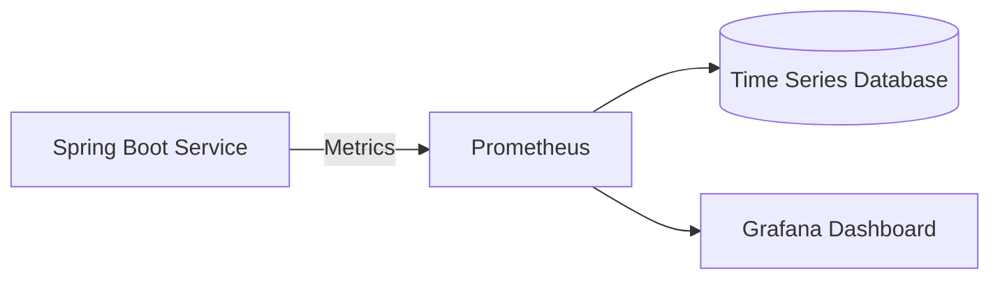
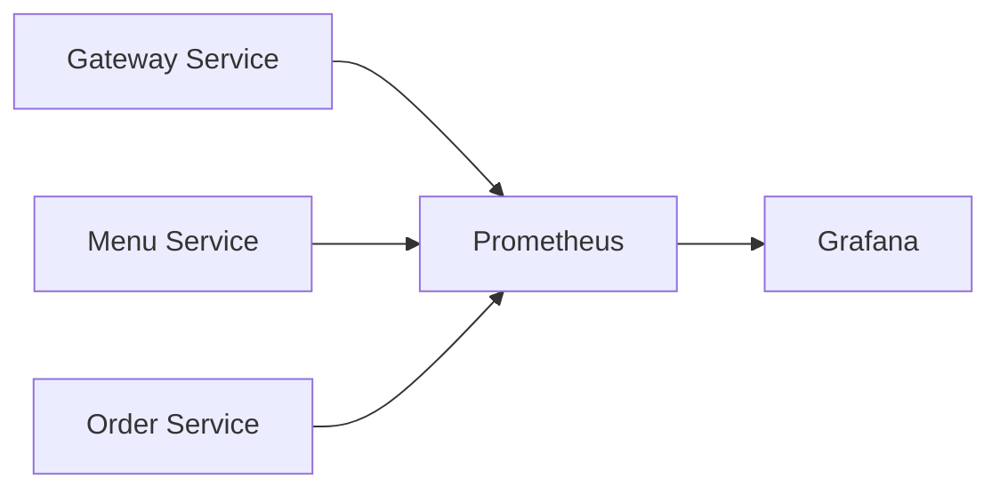
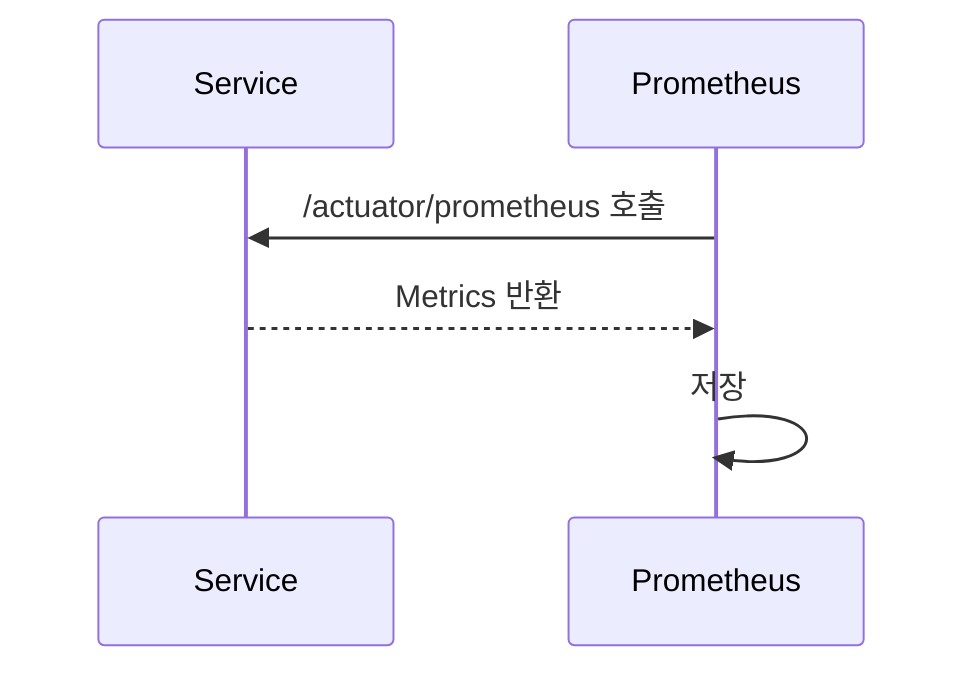
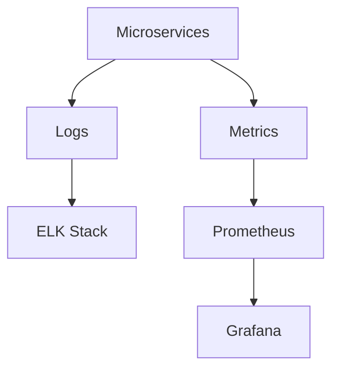

# Prometheus & Grafana 실습

# Prometheus & Grafana 실습

* toc
{:toc}

---

## Prometheus와 Grafana를 활용한 모니터링

MSA 환경에서는 서비스가 여러 개로 분리되어 운영된다.

예를 들어:

* Gateway Service
* Order Service
* Menu Service
* User Service

이러한 서비스들은 각각 독립적으로 동작하기 때문에 운영 중 다음과 같은 정보를 지속적으로 확인해야 한다.

* CPU 사용량
* 메모리 사용량
* 요청 수(Request Count)
* 응답 시간(Response Time)
* 에러 발생률(Error Rate)
* JVM 상태

이러한 정보를 **메트릭(Metrics)** 이라고 하며, 메트릭을 수집하고 시각화하기 위한 대표적인 도구가 **Prometheus** 와 **Grafana** 이다.

---

## 메트릭(Metrics)이란?

메트릭은 애플리케이션이나 시스템 상태를 숫자로 표현한 데이터이다.

예를 들어:

```text
CPU 사용률 : 30%
메모리 사용량 : 1.2GB
요청 수 : 1,200건
응답 시간 : 250ms
```

로그(Log)가 "무슨 일이 발생했는지" 기록하는 데이터라면,

메트릭(Metrics)은

> 현재 시스템 상태를 수치로 보여주는 데이터

라고 볼 수 있다.

---

## Prometheus란?

Prometheus는 오픈소스 기반 모니터링 시스템이다.

주요 역할은 다음과 같다.

* 메트릭 수집
* 시계열 데이터 저장
* 쿼리 제공
* 알림 시스템 연계

Prometheus는 애플리케이션이 제공하는 메트릭 정보를 주기적으로 수집(Scrape)하여 저장한다.

---

## Grafana란?

Grafana는 메트릭 데이터를 시각화하는 도구이다.

Prometheus가 데이터를 저장한다면,

Grafana는

* 차트 생성
* 대시보드 구성
* 실시간 모니터링
* 알림 연동

등을 담당한다.

---

## Prometheus + Grafana 구조



이 구조에서:

* Spring Boot가 메트릭 제공
* Prometheus가 수집
* Grafana가 시각화

를 수행한다.

---

## 전체 모니터링 아키텍처



Prometheus는 각 서비스의 메트릭 정보를 수집하고, Grafana는 이를 대시보드로 표현한다.

---

## Spring Boot에서 Prometheus 연동

Prometheus는 Spring Boot의 Actuator와 Micrometer를 통해 메트릭을 수집한다.

---

### Actuator 의존성

```xml
<dependency>
    <groupId>org.springframework.boot</groupId>
    <artifactId>spring-boot-starter-actuator</artifactId>
</dependency>
```

Actuator는 애플리케이션 상태 정보를 제공한다.

---

### Prometheus Registry 의존성

```xml
<dependency>
    <groupId>io.micrometer</groupId>
    <artifactId>micrometer-registry-prometheus</artifactId>
</dependency>
```

Micrometer가 Prometheus 형식으로 메트릭을 노출한다.

---

## application.yml 설정

```yaml
management:
  endpoints:
    web:
      exposure:
        include: "*"

  prometheus:
    enabled: true

  health:
    show-details: ALWAYS

  metrics:
    tags:
      application: ${spring.application.name}
```

이 설정을 통해 Prometheus가 Actuator 메트릭을 수집할 수 있게 된다.

---

## /actuator/prometheus

설정을 완료하면 다음 URL에서 메트릭을 확인할 수 있다.

```text
http://localhost:8080/actuator/prometheus
```

실제 화면에서는 다음과 같은 메트릭이 출력된다.

```text
jvm_memory_used_bytes
jvm_threads_live_threads
process_cpu_usage
tomcat_sessions_active_current_sessions
```

---

## 주요 메트릭 종류

### JVM 메모리

```text
jvm_memory_used_bytes
```

현재 JVM 메모리 사용량

---

### CPU 사용량

```text
process_cpu_usage
```

애플리케이션 CPU 사용률

---

### 스레드 수

```text
jvm_threads_live_threads
```

현재 활성 스레드 수

---

### 세션 수

```text
tomcat_sessions_active_current_sessions
```

현재 활성 세션 수

---

## Prometheus의 동작 방식

Prometheus는 Push 방식이 아니라 Pull 방식을 사용한다.

즉,

```text
Prometheus → 서비스
```

방향으로 메트릭을 가져간다.

---

## Scrape 과정



이 과정을 일정 주기로 반복한다.

---

## Prometheus 실행

Docker를 사용하면 간단하게 실행할 수 있다.

```bash
docker run -d \
-p 9090:9090 \
-v prometheus.yml:/etc/prometheus/prometheus.yml \
--name my-prometheus \
prom/prometheus
```

Prometheus 기본 포트는 다음과 같다.

```text
http://localhost:9090
```

---

## Prometheus Target 등록

Prometheus는 모니터링 대상 서비스를 등록해야 한다.

예시:

```yaml
scrape_configs:
  - job_name: gateway-service
    metrics_path: /actuator/prometheus

  - job_name: menu-service
    metrics_path: /actuator/prometheus

  - job_name: orders-service
    metrics_path: /actuator/prometheus
```

실행 후 Target 화면에서는 각 서비스 상태를 확인할 수 있다.

---

## PromQL

Prometheus는 PromQL이라는 전용 쿼리 언어를 제공한다.

예시:

```text
jvm_memory_used_bytes
```

현재 JVM 메모리 사용량 조회

---

```text
process_cpu_usage
```

CPU 사용률 조회

---

```text
http_server_requests_seconds_count
```

HTTP 요청 수 조회

---

## Grafana 실행

Grafana 역시 Docker로 쉽게 실행할 수 있다.

```bash
docker run -d \
-p 3000:3000 \
--name my-grafana \
grafana/grafana
```

기본 접속 주소는 다음과 같다.

```text
http://localhost:3000
```

---

## Grafana와 Prometheus 연동

Grafana에서는 Data Source를 등록해야 한다.

Prometheus 주소:

```text
http://host.docker.internal:9090
```

Docker 환경에서는 위 주소를 통해 Prometheus와 연결할 수 있다.

---

## Grafana Dashboard

Grafana에서는 다음과 같은 정보를 시각화할 수 있다.

### JVM Memory

```text
jvm_memory_used_bytes
```

---

### CPU Usage

```text
process_cpu_usage
```

---

### Request Count

```text
http_server_requests_seconds_count
```

---

### Response Time

```text
http_server_requests_seconds
```

---

## ELK와 Prometheus의 차이

많은 사람들이 ELK와 Prometheus를 헷갈려한다.

### ELK

수집 대상

```text
로그(Log)
```

예시

```text
ERROR
WARN
Exception
```

목적

```text
무슨 일이 발생했는가?
```

---

### Prometheus

수집 대상

```text
메트릭(Metrics)
```

예시

```text
CPU
Memory
Response Time
Request Count
```

목적

```text
현재 상태가 어떤가?
```

---

## ELK + Prometheus + Grafana 구조

실제 운영 환경에서는 함께 사용하는 경우가 많다.



---

## 정리

Prometheus는 메트릭 수집 및 저장을 담당하고, Grafana는 이를 시각화하여 운영자가 시스템 상태를 쉽게 파악할 수 있도록 도와준다.

MSA 환경에서는 여러 서비스의 CPU, 메모리, 응답 시간, 요청 수 등을 지속적으로 모니터링해야 하므로 Prometheus와 Grafana는 사실상 필수적인 모니터링 도구로 활용된다.

---

### 한 줄 요약

Prometheus는 애플리케이션의 메트릭 데이터를 수집하고 저장하는 모니터링 시스템이며, Grafana는 이를 시각화하여 CPU, 메모리, 응답 시간, 요청 수 등의 시스템 상태를 실시간으로 분석할 수 있게 해주는 대시보드 도구이다.

