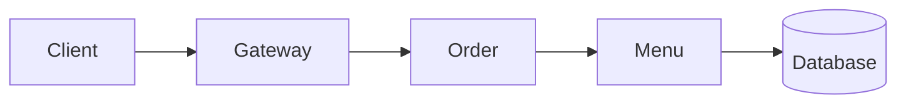
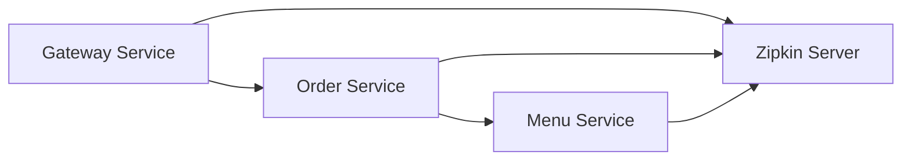
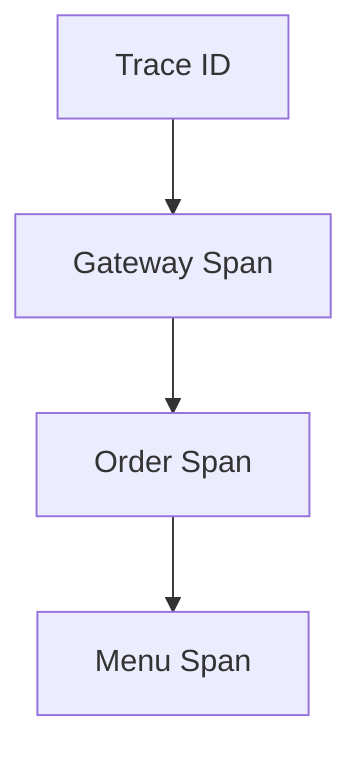
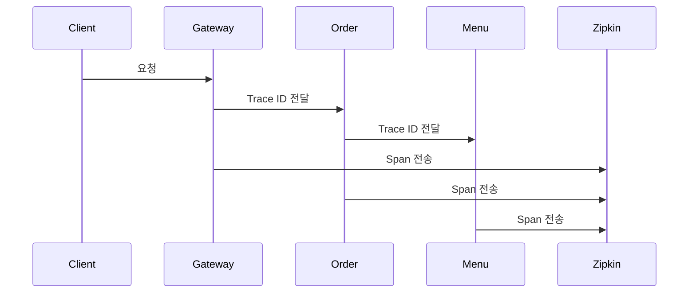
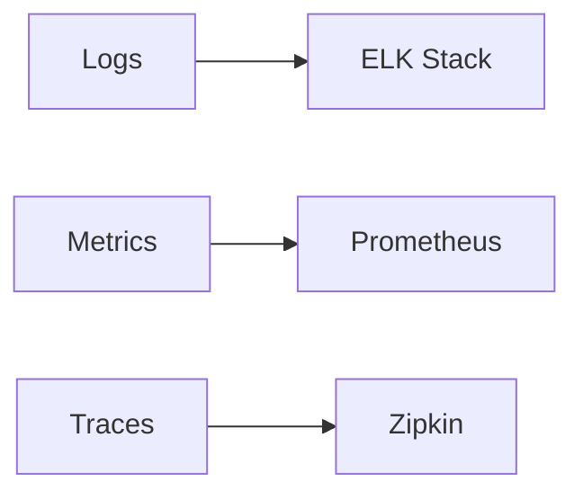

# 분산 추적(Sleuth, Zipkin)

# 분산 추적(Sleuth, Zipkin)

* toc
{:toc}

---

## 분산 추적(Distributed Tracing)이란?

MSA 환경에서는 하나의 요청이 여러 서비스를 거쳐 처리된다.

예를 들어 사용자가 주문 조회 API를 호출하면 다음과 같은 흐름이 발생할 수 있다.

```text
Client
 ↓
Gateway Service
 ↓
Order Service
 ↓
Menu Service
 ↓
Database
```

모놀리식 환경에서는 하나의 애플리케이션 로그만 확인하면 되지만,
MSA 환경에서는 요청이 여러 서비스를 거치므로 문제가 발생했을 때 추적이 매우 어려워진다.

예를 들어:

* 응답 속도가 느림
* 특정 서비스에서 오류 발생
* 일부 요청만 실패

와 같은 상황에서

```text
Gateway 로그
Order 로그
Menu 로그
DB 로그
```

를 각각 확인해야 한다.

이 문제를 해결하기 위해 사용하는 것이 바로 **분산 추적(Distributed Tracing)** 이다.

---

## 분산 추적이 필요한 이유

다음과 같은 서비스 호출 구조를 생각해보자.



사용자가 주문 조회를 요청했는데 응답 시간이 5초가 걸렸다고 가정해보자.

문제는:

* Gateway가 느린 것인지
* Order Service가 느린 것인지
* Menu Service가 느린 것인지
* DB가 느린 것인지

판단하기 어렵다는 것이다.

즉,

> 하나의 요청이 여러 서비스를 거치는 흐름 자체를 추적할 수 있어야 한다.

---

## Spring Cloud Sleuth란?

Spring Cloud Sleuth는 분산 추적을 위한 라이브러리이다.

주요 역할은 다음과 같다.

* Trace ID 생성
* Span ID 생성
* 서비스 간 Trace 전달
* 로그 자동 연동

즉,

하나의 요청이 여러 서비스를 거치더라도

```text
동일한 Trace ID
```

를 유지하여 요청 흐름을 추적할 수 있게 해준다.

---

## Zipkin이란?

Zipkin은 분산 추적 데이터를 수집하고 시각화하는 시스템이다.

Sleuth가 생성한:

* Trace ID
* Span ID
* 요청 시간
* 응답 시간

등을 수집하여 UI로 보여준다.

즉:

* Sleuth → 추적 데이터 생성
* Zipkin → 추적 데이터 저장 및 시각화

역할을 수행한다.

---

## Sleuth + Zipkin 구조



각 서비스는 추적 데이터를 Zipkin으로 전송한다.

---

## Trace와 Span

분산 추적을 이해하려면 Trace와 Span 개념을 알아야 한다.

---

### Trace

사용자 요청 전체를 의미한다.

예시:

```text
사용자 주문 조회 요청
```

---

### Span

서비스 하나의 작업 단위를 의미한다.

예시:

```text
Gateway 처리
Order Service 처리
Menu Service 처리
```

---

## Trace 구조



하나의 Trace 안에 여러 Span이 포함된다.

---

## 의존성 추가

### Spring Cloud Sleuth

```xml
<dependency>
    <groupId>org.springframework.cloud</groupId>
    <artifactId>spring-cloud-starter-sleuth</artifactId>
</dependency>
```

Trace와 Span을 자동 생성한다.

---

### Spring Cloud Zipkin

```xml
<dependency>
    <groupId>org.springframework.cloud</groupId>
    <artifactId>spring-cloud-starter-zipkin</artifactId>
</dependency>
```

Zipkin 서버로 추적 데이터를 전송한다.

---

## application.yml 설정

```yaml
sleuth:
  sampler:
    probability: 1.0

zipkin:
  base-url: http://localhost:9411

logging:
  pattern:
    console: "%d{yyyy-MM-dd HH:mm:ss} [%X{traceId},%X{spanId}]"
```

설정을 통해:

* Trace 생성
* Zipkin 전송
* 로그 연동

이 가능해진다.

---

## sampler.probability

```yaml
probability: 1.0
```

의미:

```text
100% 추적
```

모든 요청을 Trace 대상으로 수집한다.

운영 환경에서는 일반적으로:

```yaml
probability: 0.1
```

처럼 일부 요청만 수집하기도 한다.

---

## 로그에 Trace 정보 추가

Sleuth를 적용하면 로그에 Trace ID와 Span ID가 자동 포함된다.

예시:

```text
2025-01-01 12:00:00
[6f8a4c1f92d1a23b, 4f9d3c21b1aa7f12]
OrderService Started
```

여기서:

```text
6f8a4c1f92d1a23b
```

는 Trace ID

```text
4f9d3c21b1aa7f12
```

는 Span ID이다.

---

## Zipkin 실행

Docker를 이용하면 쉽게 실행할 수 있다.

```bash
docker run -d -p 9411:9411 openzipkin/zipkin
```

기본 접속 주소:

```text
http://localhost:9411
```


---

## 요청 흐름 추적 과정



---

## Zipkin에서 확인 가능한 정보

Zipkin에서는 다음 정보를 확인할 수 있다.

### Trace ID

하나의 요청 식별

---

### Span ID

서비스 작업 단위 식별

---

### Duration

서비스 처리 시간

---

### Service Name

어떤 서비스가 처리했는지 확인

---

### 호출 순서

서비스 간 호출 흐름 확인

---

## Zipkin 화면 예시

Zipkin에서는 다음과 같은 형태로 요청 흐름을 확인할 수 있다.

```text
gateway-service
   ↓
order-service
   ↓
menu-service
```

그리고 각 서비스의 처리 시간도 확인할 수 있다.

예시:

```text
gateway-service : 182ms
order-service : 120ms
menu-service : 60ms
```

---

## 장애 분석 예시

사용자 요청이 느릴 경우:

Zipkin을 보면

```text
Gateway : 30ms
Order : 50ms
Menu : 3500ms
```

처럼 확인할 수 있다.

즉,

> Menu Service가 병목 지점이라는 사실을 빠르게 파악할 수 있다.

---

## ELK와 Zipkin의 차이

많이 헷갈리는 부분 중 하나이다.

### ELK

목적

```text
로그 분석
```

확인 내용

```text
에러 로그
예외 발생
사용자 행동
```

---

### Zipkin

목적

```text
서비스 호출 추적
```

확인 내용

```text
서비스 호출 흐름
응답 시간
병목 구간
```

---

## Prometheus와 Zipkin 차이

### Prometheus

확인 대상

```text
메트릭
```

예시

```text
CPU
Memory
Request Count
```

---

### Zipkin

확인 대상

```text
Trace
```

예시

```text
서비스 호출 흐름
응답 시간
Span
```

---

## Observability 관점에서의 위치

최근 MSA 환경에서는 다음 세 가지를 함께 구성한다.



---

### Logging

ELK

---

### Metrics

Prometheus + Grafana

---

### Tracing

Sleuth + Zipkin

---

## 정리

분산 추적은 MSA 환경에서 하나의 요청이 여러 서비스를 거치는 흐름을 추적하기 위한 기술이다.

Spring Cloud Sleuth는 Trace ID와 Span ID를 생성하고 서비스 간 전달하며, Zipkin은 이를 수집하고 시각화하여 서비스 호출 흐름과 병목 지점을 쉽게 분석할 수 있도록 도와준다.

---

### 한 줄 요약

Spring Cloud Sleuth와 Zipkin은 MSA 환경에서 요청의 Trace ID와 Span 정보를 기반으로 서비스 간 호출 흐름을 추적하고 시각화하여 장애 원인 분석과 성능 병목 구간 파악을 가능하게 해주는 분산 추적 시스템이다. 

