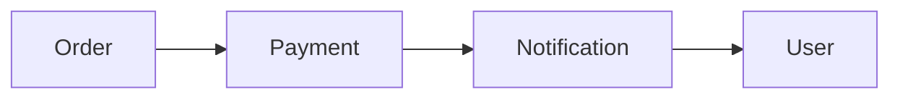
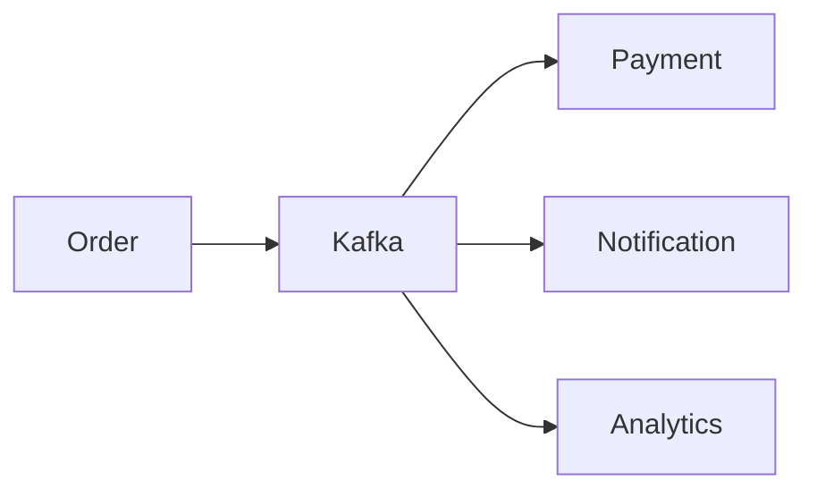
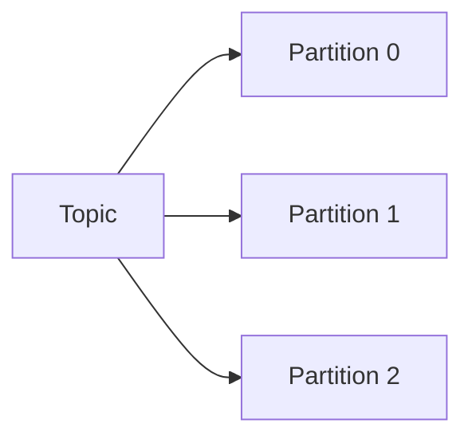
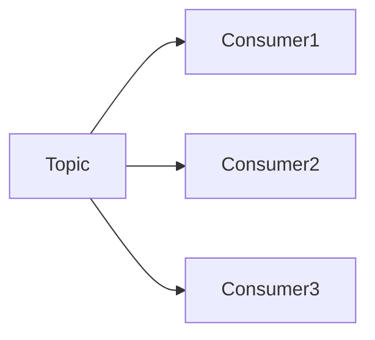
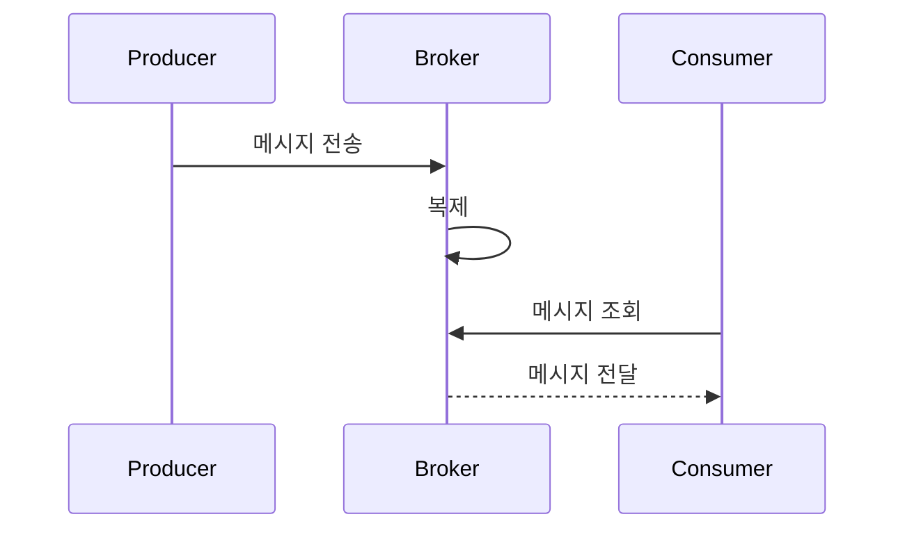
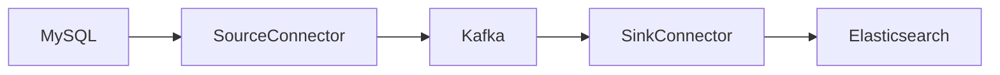
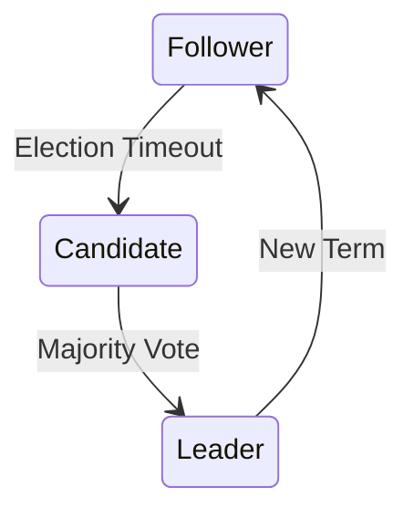

# Kafka는 무엇인가요?

# Kafka는 무엇인가요?

* toc
{:toc}

---

## Kafka란 무엇인가?

현대의 서비스는 수많은 이벤트와 데이터를 실시간으로 처리해야 한다.

예를 들어:

* 사용자 주문 이벤트
* 결제 완료 이벤트
* 배송 상태 변경 이벤트
* 로그 수집 이벤트

이러한 데이터는 지속적으로 발생하며 여러 시스템 간에 전달되어야 한다.

Apache Kafka는 이러한 대규모 데이터 스트림을 안정적이고 효율적으로 처리하기 위해 만들어진 분산 이벤트 스트리밍 플랫폼이다. Kafka는 높은 처리량, 확장성, 내구성을 제공하며 실시간 데이터 처리와 이벤트 기반 아키텍처의 핵심 기술로 자리 잡고 있다.

---

## Kafka의 탄생 배경

Kafka는 2010년 LinkedIn에서 내부 프로젝트로 시작되었다.

당시 LinkedIn은 대규모 사용자 활동 데이터를 실시간으로 처리해야 했으며, 기존 메시징 시스템으로는 증가하는 트래픽을 감당하기 어려웠다.

이 문제를 해결하기 위해 Kafka가 개발되었고, 이후 Apache Software Foundation에 기부되면서 오픈소스 프로젝트로 발전하게 되었다.

---

## Kafka의 발전 과정

Kafka는 지속적으로 발전하며 현재 가장 널리 사용되는 이벤트 스트리밍 플랫폼 중 하나가 되었다.

| 연도   | 주요 변화                              |
| ---- | ---------------------------------- |
| 2011 | Apache Kafka 프로젝트 공개               |
| 2012 | Replication 기능 도입                  |
| 2014 | Kafka Connect 및 신규 Consumer API 추가 |
| 2015 | Kafka Streams API 출시               |
| 2017 | Kafka 1.0 정식 출시                    |
| 2020 | Kafka 2.8, KRaft 모드 지원             |

특히 Kafka 2.8부터는 Zookeeper 없이 동작할 수 있는 KRaft(Kafka Raft)가 도입되면서 운영 복잡성이 크게 감소하였다.

---

## Kafka가 해결하는 문제

전통적인 시스템에서는 서비스 간 직접 통신을 수행하는 경우가 많다.



서비스가 증가할수록 의존성이 복잡해지고 장애 전파 위험도 커진다.

Kafka는 서비스 사이에 이벤트 허브 역할을 수행하여 이러한 문제를 해결한다.



이 구조를 통해 서비스 간 결합도를 낮추고 확장성을 확보할 수 있다.

---

## Kafka의 핵심 구성 요소

Kafka를 이해하기 위해서는 주요 구성 요소를 먼저 알아야 한다.

### Broker

Broker는 Kafka 서버를 의미한다.

역할:

* 메시지 저장
* 메시지 복제
* Producer 요청 처리
* Consumer 요청 처리

Kafka 클러스터는 여러 Broker로 구성된다.

---

### Topic

Topic은 메시지를 분류하는 논리적 단위이다.

예를 들어:

```text
user-created
payment-completed
order-created
```

서비스는 Topic을 기준으로 메시지를 발행하고 구독한다.

---

### Partition

Partition은 Topic을 물리적으로 분할한 단위이다.



Partition을 활용하면:

* 병렬 처리
* 부하 분산
* 확장성 확보

가 가능하다.

---

### Producer

Producer는 Kafka로 메시지를 전송하는 클라이언트이다.

예시:

```java
주문 서비스 → Kafka
```

Producer는 특정 Topic으로 메시지를 발행한다.

---

### Consumer

Consumer는 Kafka에서 메시지를 읽는 클라이언트이다.

예시:

```java
Kafka → 결제 서비스
```

Consumer는 Topic을 구독하여 메시지를 처리한다.

---

### Consumer Group

Consumer는 그룹 단위로 동작할 수 있다.



Consumer Group을 활용하면:

* 메시지 병렬 처리
* 처리량 증가
* 장애 복구

가 가능하다.

---

## Kafka 메시지 구조

Kafka에서 전달되는 데이터는 Message라고 부른다.

Message는 다음 정보로 구성된다.

```text
Key
Value
Header
```

메시지는 Partition에 순서대로 저장되며 Offset을 통해 관리된다.

---

## Kafka 아키텍처 동작 과정

Kafka의 전체 흐름은 비교적 단순하다.



동작 과정은 다음과 같다.

1. Producer가 메시지 전송
2. Broker가 디스크에 저장
3. 복제본 생성
4. Consumer가 메시지 조회
5. Consumer가 비즈니스 로직 수행

---

## Kafka Connect

Kafka Connect는 Kafka와 외부 시스템을 연결하는 도구이다.

예를 들어:



코드 작성 없이 데이터 파이프라인을 구축할 수 있다는 장점이 있다.

---

## Kafka Streams

Kafka Streams는 Kafka 전용 스트림 처리 라이브러리이다.

예시:

```text
주문 이벤트
↓
집계 처리
↓
통계 이벤트 생성
```

실시간 데이터 변환과 이벤트 처리를 수행할 수 있다.

---

## Zookeeper란?

초기 Kafka는 Zookeeper를 사용하여 클러스터 메타데이터를 관리하였다.

주요 역할:

* Broker 상태 관리
* Leader 선출
* Topic 정보 관리
* Partition 정보 관리

하지만 운영 복잡도가 높다는 문제가 있었다.

---

## KRaft란?

Kafka 2.8부터는 KRaft(Kafka Raft)가 도입되었다.

KRaft는 Kafka 내부에서 직접 메타데이터를 관리하는 구조이다.

즉:

```text
기존
Kafka + Zookeeper

현재
Kafka만 사용
```

구조가 되었다.

---

## Zookeeper와 KRaft 비교

| 항목       | Zookeeper         | KRaft       |
| -------- | ----------------- | ----------- |
| 메타데이터 관리 | 외부 관리             | Kafka 내부 관리 |
| 설치 복잡성   | 높음                | 낮음          |
| 장애 복구    | 상대적으로 느림          | 빠름          |
| 성능       | 추가 통신 발생          | 통신 오버헤드 감소  |
| 운영       | Kafka + Zookeeper | Kafka 단독 운영 |

---

## KRaft가 등장한 이유

KRaft는 다음 문제를 해결하기 위해 등장하였다.

* 운영 복잡성 감소
* 장애 복구 속도 향상
* 메타데이터 관리 단순화
* Kafka 내부 통합
* 성능 향상

결과적으로 Kafka 운영이 훨씬 단순해졌다.

---

## Raft 알고리즘

KRaft는 Raft Consensus Algorithm 기반으로 동작한다.

Raft는 분산 시스템에서:

* 리더 선출
* 데이터 일관성 유지
* 장애 복구

를 담당하는 알고리즘이다.



Leader가 메타데이터 변경을 처리하고, Follower는 이를 복제한다.

---

## 정리

Kafka는 대규모 데이터 스트림을 안정적으로 처리하기 위한 분산 이벤트 스트리밍 플랫폼이다.

Producer가 메시지를 발행하고 Broker가 저장하며 Consumer가 이를 처리하는 구조를 기반으로 높은 처리량과 확장성을 제공한다.

최근에는 Zookeeper를 대체하는 KRaft가 도입되면서 Kafka 자체적으로 메타데이터를 관리할 수 있게 되었으며, 운영 복잡성과 장애 복구 측면에서도 큰 개선이 이루어졌다.


