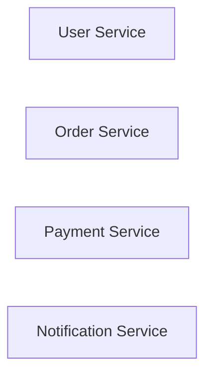
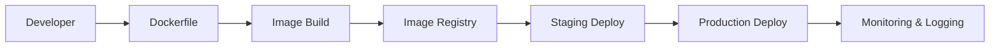
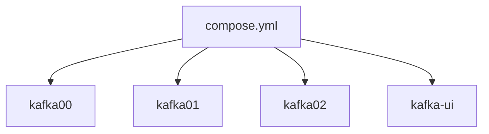
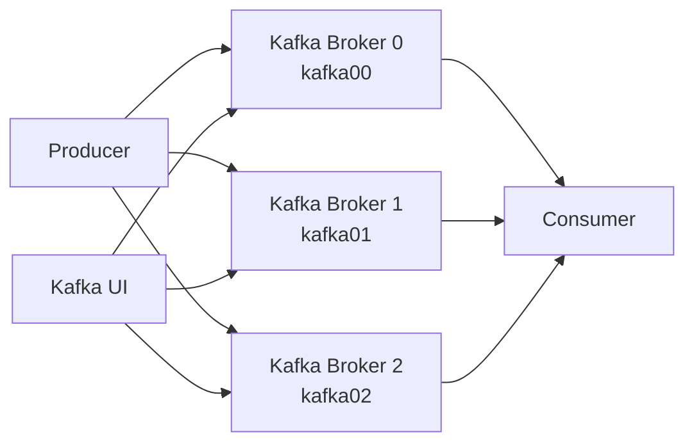
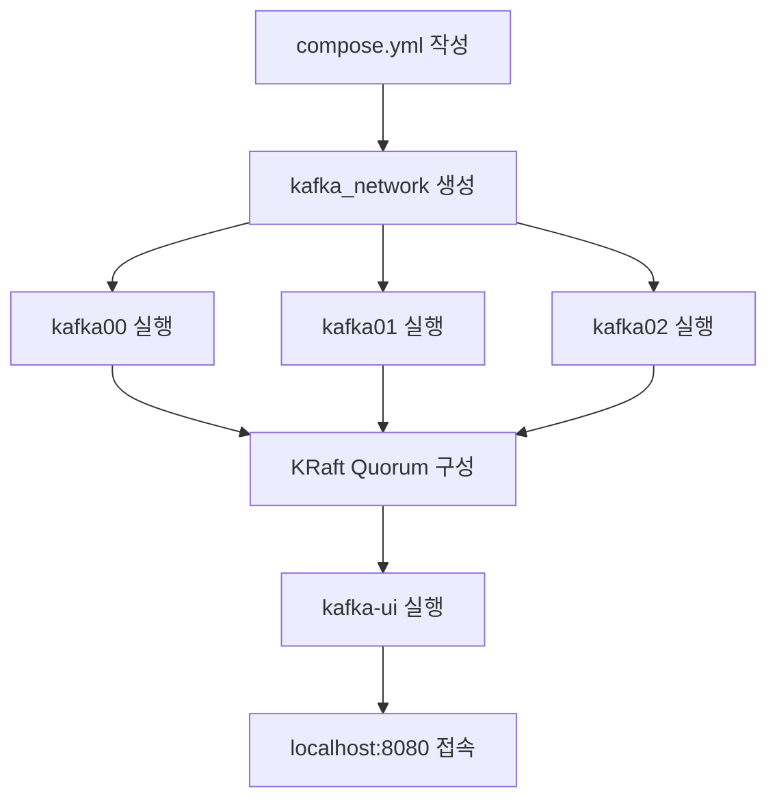

# Docker, Docker Compose 사용해보기

# Docker, Docker Compose 사용해보기

* toc
{:toc}

---

맞아. 아래처럼 **문서 전체 흐름 + Docker Compose 상세 설정까지 포함**해서 한 번에 복사할 수 있게 다시 정리했어.

````markdown
## Docker와 Docker Compose 사용해보기

현대의 애플리케이션은 단순히 소스코드만으로 실행되지 않는다.

애플리케이션을 실행하기 위해서는 다음과 같은 요소들이 함께 필요하다.

- 운영체제
- JDK 또는 Runtime
- 라이브러리
- 설정 파일
- 데이터베이스
- 메시지 브로커

문제는 개발 환경과 운영 환경이 서로 다를 수 있다는 점이다.

개발자의 로컬 환경에서는 정상적으로 동작하지만, 테스트 서버나 운영 서버에서는 오류가 발생하는 경우가 있다.

```text
내 PC에서는 되는데요?
```

개발자라면 한 번쯤 들어봤을 이야기이다.

Docker는 이러한 환경 차이 문제를 해결하기 위해 등장한 컨테이너 기술이다.

---

## Docker란?

Docker는 애플리케이션과 실행에 필요한 의존성을 하나의 컨테이너로 묶어 실행할 수 있게 해주는 플랫폼이다.

Docker를 사용하면 다음 환경에서 동일한 실행 환경을 재현할 수 있다.

- 개발 환경
- 테스트 환경
- 운영 환경

즉, Docker의 핵심 목적은 다음과 같다.

> 어디서 실행하더라도 동일하게 동작하는 애플리케이션 환경을 만드는 것

Docker는 컨테이너화 기술을 통해 애플리케이션 코드, 라이브러리, 의존성, 설정 파일 등을 함께 패키징한다.

이를 통해 개발자, 테스터, 운영자가 동일한 환경에서 작업할 수 있고, 환경 차이로 인한 문제를 줄일 수 있다.

---

## Docker의 역사

Docker 이전에도 컨테이너 기술은 존재했다.

대표적으로 LXC(Linux Containers)가 있었다.

LXC는 리눅스 커널 기능을 활용하여 격리된 실행 환경을 제공했지만 다음과 같은 한계가 있었다.

- 사용이 복잡함
- 관리가 어려움
- 표준화된 사용 방식 부족

Docker는 이러한 문제를 해결하면서 컨테이너 기술을 대중화했다.

---

## Docker의 탄생

Docker는 2013년 Solomon Hykes에 의해 처음 발표되었다.

Docker는 기존 LXC 기술을 기반으로 하면서도 더 쉽게 사용할 수 있는 플랫폼을 제공했다.

특히 컨테이너화를 위한 표준화된 도구를 제공하여 애플리케이션을 운영체제 수준에서 격리된 환경으로 실행할 수 있게 만들었다.

이후 Docker는 빠르게 확산되었고, 클라우드와 DevOps 환경에서 표준 도구로 자리 잡았다.

2014년에는 Docker Hub가 등장하면서 컨테이너 이미지를 공유하고 관리할 수 있는 생태계가 만들어졌다.

이후 Docker Compose, Docker Swarm, Kubernetes 같은 도구들이 등장하면서 컨테이너 관리 방식은 더욱 발전하게 되었다.

---

## Docker를 사용하는 이유

Docker는 단순히 애플리케이션을 실행하는 도구가 아니다.

개발, 테스트, 배포, 운영 과정에서 발생하는 다양한 문제를 해결해준다.

---

### 일관된 실행 환경 제공

Docker 컨테이너는 애플리케이션 실행에 필요한 구성 요소를 모두 포함한다.

- 애플리케이션 코드
- 라이브러리
- 의존성
- 설정 파일
- Runtime

따라서 개발 환경과 운영 환경의 차이를 줄일 수 있다.

```text
개발 환경 = 테스트 환경 = 운영 환경
```

이런 구조를 만들 수 있다는 점이 Docker의 가장 큰 장점이다.

---

### 빠르고 효율적인 배포

Docker 컨테이너는 전통적인 가상 머신보다 가볍다.

가상 머신은 전체 운영체제를 가상화하지만, Docker는 호스트 운영체제의 커널을 공유한다.

```text
Virtual Machine
→ Guest OS 포함

Docker Container
→ Host OS 커널 공유
```

이 차이 때문에 Docker는 다음과 같은 장점을 가진다.

- 실행 속도가 빠름
- 리소스 사용량이 적음
- 배포가 빠름
- 여러 컨테이너를 동시에 실행하기 쉬움

---

### 환경 독립성

Docker 이미지만 있으면 어디서든 동일한 환경을 실행할 수 있다.

예를 들어 다음 환경에서 동일한 컨테이너를 실행할 수 있다.

- 개발자 로컬 PC
- 테스트 서버
- 스테이징 서버
- 운영 서버
- 클라우드 환경
- Kubernetes Cluster

이로 인해 환경 간 불일치 문제를 줄일 수 있다.

---

### 가상 머신보다 적은 리소스 사용

전통적인 가상 머신은 운영체제 전체를 포함하기 때문에 무겁다.

반면 Docker 컨테이너는 호스트 운영체제의 커널을 공유하면서 애플리케이션 실행 환경만 격리한다.

따라서 Docker 컨테이너는 더 가볍고 빠르게 실행된다.

---

### 확장성과 유연성

Docker는 Docker Compose, Kubernetes 같은 컨테이너 오케스트레이션 도구와 함께 사용할 수 있다.

이러한 도구를 사용하면 여러 컨테이너를 하나의 애플리케이션처럼 관리할 수 있다.

또한 컨테이너 단위로 서비스를 확장하거나 배포할 수 있기 때문에 마이크로서비스 아키텍처와 잘 어울린다.

---

## Docker와 MSA

MSA 환경에서는 하나의 큰 애플리케이션을 여러 개의 작은 서비스로 나누어 운영한다.

예를 들어 다음과 같은 서비스들이 각각 독립적으로 존재할 수 있다.



각 서비스를 Docker 컨테이너로 분리하면 다음과 같은 장점이 있다.

- 서비스별 독립 배포 가능
- 서비스별 독립 확장 가능
- 장애 격리 가능
- 실행 환경 표준화 가능

그래서 Docker는 MSA 환경에서 매우 중요한 기반 기술로 사용된다.

---

## Docker의 핵심 개념

Docker를 이해하려면 Image와 Container 개념을 먼저 알아야 한다.

---

### Docker Image

Docker Image는 애플리케이션 실행에 필요한 모든 정보를 담은 패키지이다.

예를 들어 Spring Boot 애플리케이션을 실행하려면 다음 정보가 필요할 수 있다.

```text
Spring Boot Application
JDK
라이브러리
설정 파일
실행 명령어
```

이러한 정보를 하나로 묶은 것이 Docker Image이다.

---

### Docker Container

Docker Container는 Docker Image를 실행한 결과이다.

예를 들어 다음 명령어를 실행하면:

```bash
docker run my-app
```

Docker Image를 기반으로 Container가 생성되고 실행된다.

```text
Docker Image → Docker Container
```

즉, Image는 실행 전 패키지이고, Container는 실행 중인 인스턴스라고 볼 수 있다.

---

## 실무에서 Docker를 사용하는 워크플로우

실무에서는 일반적으로 다음 흐름으로 Docker를 사용한다.



---

### 개발 단계

개발자는 Dockerfile을 작성한다.

Dockerfile은 애플리케이션 실행 환경을 정의하는 파일이다.

예를 들어 다음 내용을 정의할 수 있다.

- Base Image
- 필요한 패키지
- 애플리케이션 파일 복사
- 실행 명령어

---

### 로컬 개발 환경 구성

Docker Compose를 사용하면 여러 컨테이너를 동시에 실행할 수 있다.

예를 들어 로컬 개발 환경에서 다음 컨테이너들을 함께 실행할 수 있다.

- Spring Boot Application
- MySQL
- Redis
- Kafka
- Kafka UI

---

### 이미지 빌드 및 푸시

코드가 변경되면 CI 도구가 Docker Image를 빌드한다.

```bash
docker build -t my-app .
```

빌드된 이미지는 Docker Hub 또는 사내 Registry에 업로드된다.

---

### 테스트 및 배포

스테이징 환경에서는 빌드된 이미지를 사용하여 최종 테스트를 진행한다.

테스트가 완료되면 동일한 이미지를 운영 환경에 배포한다.

이 방식은 개발, 테스트, 운영 환경의 차이를 줄이는 데 효과적이다.

---

### 운영 및 모니터링

운영 환경에서는 컨테이너 상태를 지속적으로 모니터링해야 한다.

대표적으로 다음 도구들을 사용할 수 있다.

- Prometheus
- Grafana
- ELK Stack
- Loki
- OpenTelemetry

컨테이너 로그와 메트릭을 중앙에서 관리하면 장애 분석과 성능 개선이 쉬워진다.

---

## Docker Compose란?

Docker Compose는 여러 개의 Docker 컨테이너를 하나의 설정 파일로 정의하고 실행할 수 있게 해주는 도구이다.

하나의 애플리케이션이 여러 컨테이너로 구성되는 경우가 많다.

예를 들어 Kafka Cluster를 구성하려면 다음 컨테이너가 필요하다.

- Kafka Broker 0
- Kafka Broker 1
- Kafka Broker 2
- Kafka UI

이 컨테이너들을 각각 `docker run` 명령어로 실행하면 매우 번거롭다.

Docker Compose를 사용하면 `compose.yml` 파일 하나로 여러 컨테이너를 한 번에 실행할 수 있다.

---

## Docker Compose 구조



즉, Docker Compose는 여러 컨테이너를 하나의 애플리케이션처럼 관리하는 도구라고 볼 수 있다.

---

## Docker Compose로 Kafka Cluster 만들기

이번 구성에서는 Docker Compose를 사용하여 Kafka KRaft Cluster를 구성한다.

구성 요소는 다음과 같다.

| 구성 요소 | 설명 |
|----------|------|
| kafka00 | Kafka Broker 0 |
| kafka01 | Kafka Broker 1 |
| kafka02 | Kafka Broker 2 |
| kafka-ui | Kafka 관리 UI |

전체 구조는 다음과 같다.



---

## compose.yml 전체 코드

아래는 Kafka 3.7.0 기반 KRaft Cluster를 구성하는 Docker Compose 예시이다.

```yaml
version: '3.8'

networks:
  kafka_network:

services:
  kafka00:
    image: bitnami/kafka:3.7.0
    restart: unless-stopped
    container_name: kafka00
    ports:
      - '10000:9094'
    environment:
      - KAFKA_CFG_AUTO_CREATE_TOPICS_ENABLE=true
      - KAFKA_CFG_BROKER_ID=0
      - KAFKA_CFG_NODE_ID=0
      - KAFKA_KRAFT_CLUSTER_ID=HsDBs9l6UUmQq7Y5E6bNlw
      - KAFKA_CFG_CONTROLLER_QUORUM_VOTERS=0@kafka00:9093,1@kafka01:9093,2@kafka02:9093
      - KAFKA_CFG_PROCESS_ROLES=controller,broker
      - ALLOW_PLAINTEXT_LISTENER=yes
      - KAFKA_CFG_LISTENERS=PLAINTEXT://:9092,CONTROLLER://:9093,EXTERNAL://:9094
      - KAFKA_CFG_ADVERTISED_LISTENERS=PLAINTEXT://kafka00:9092,EXTERNAL://127.0.0.1:10000
      - KAFKA_CFG_LISTENER_SECURITY_PROTOCOL_MAP=CONTROLLER:PLAINTEXT,EXTERNAL:PLAINTEXT,PLAINTEXT:PLAINTEXT
      - KAFKA_CFG_CONTROLLER_LISTENER_NAMES=CONTROLLER
      - KAFKA_CFG_INTER_BROKER_LISTENER_NAME=PLAINTEXT
      - KAFKA_CFG_OFFSETS_TOPIC_REPLICATION_FACTOR=3
      - KAFKA_CFG_TRANSACTION_STATE_LOG_REPLICATION_FACTOR=3
      - KAFKA_CFG_TRANSACTION_STATE_LOG_MIN_ISR=2
    networks:
      - kafka_network
    volumes:
      - "./data/kafka/kafka00:/bitnami/kafka"

  kafka01:
    image: bitnami/kafka:3.7.0
    restart: unless-stopped
    container_name: kafka01
    ports:
      - '10001:9094'
    environment:
      - KAFKA_CFG_AUTO_CREATE_TOPICS_ENABLE=true
      - KAFKA_CFG_BROKER_ID=1
      - KAFKA_CFG_NODE_ID=1
      - KAFKA_KRAFT_CLUSTER_ID=HsDBs9l6UUmQq7Y5E6bNlw
      - KAFKA_CFG_CONTROLLER_QUORUM_VOTERS=0@kafka00:9093,1@kafka01:9093,2@kafka02:9093
      - KAFKA_CFG_PROCESS_ROLES=controller,broker
      - ALLOW_PLAINTEXT_LISTENER=yes
      - KAFKA_CFG_LISTENERS=PLAINTEXT://:9092,CONTROLLER://:9093,EXTERNAL://:9094
      - KAFKA_CFG_ADVERTISED_LISTENERS=PLAINTEXT://kafka01:9092,EXTERNAL://127.0.0.1:10001
      - KAFKA_CFG_LISTENER_SECURITY_PROTOCOL_MAP=CONTROLLER:PLAINTEXT,EXTERNAL:PLAINTEXT,PLAINTEXT:PLAINTEXT
      - KAFKA_CFG_CONTROLLER_LISTENER_NAMES=CONTROLLER
      - KAFKA_CFG_INTER_BROKER_LISTENER_NAME=PLAINTEXT
      - KAFKA_CFG_OFFSETS_TOPIC_REPLICATION_FACTOR=3
      - KAFKA_CFG_TRANSACTION_STATE_LOG_REPLICATION_FACTOR=3
      - KAFKA_CFG_TRANSACTION_STATE_LOG_MIN_ISR=2
    networks:
      - kafka_network
    volumes:
      - "./data/kafka/kafka01:/bitnami/kafka"

  kafka02:
    image: bitnami/kafka:3.7.0
    restart: unless-stopped
    container_name: kafka02
    ports:
      - '10002:9094'
    environment:
      - KAFKA_CFG_AUTO_CREATE_TOPICS_ENABLE=true
      - KAFKA_CFG_BROKER_ID=2
      - KAFKA_CFG_NODE_ID=2
      - KAFKA_KRAFT_CLUSTER_ID=HsDBs9l6UUmQq7Y5E6bNlw
      - KAFKA_CFG_CONTROLLER_QUORUM_VOTERS=0@kafka00:9093,1@kafka01:9093,2@kafka02:9093
      - KAFKA_CFG_PROCESS_ROLES=controller,broker
      - ALLOW_PLAINTEXT_LISTENER=yes
      - KAFKA_CFG_LISTENERS=PLAINTEXT://:9092,CONTROLLER://:9093,EXTERNAL://:9094
      - KAFKA_CFG_ADVERTISED_LISTENERS=PLAINTEXT://kafka02:9092,EXTERNAL://127.0.0.1:10002
      - KAFKA_CFG_LISTENER_SECURITY_PROTOCOL_MAP=CONTROLLER:PLAINTEXT,EXTERNAL:PLAINTEXT,PLAINTEXT:PLAINTEXT
      - KAFKA_CFG_CONTROLLER_LISTENER_NAMES=CONTROLLER
      - KAFKA_CFG_INTER_BROKER_LISTENER_NAME=PLAINTEXT
      - KAFKA_CFG_OFFSETS_TOPIC_REPLICATION_FACTOR=3
      - KAFKA_CFG_TRANSACTION_STATE_LOG_REPLICATION_FACTOR=3
      - KAFKA_CFG_TRANSACTION_STATE_LOG_MIN_ISR=2
    networks:
      - kafka_network
    volumes:
      - "./data/kafka/kafka02:/bitnami/kafka"

  kafka-ui:
    image: provectuslabs/kafka-ui:latest
    restart: unless-stopped
    container_name: kafka-ui
    ports:
      - '8080:8080'
    environment:
      - KAFKA_CLUSTERS_0_NAME=Local-Kraft-Cluster
      - KAFKA_CLUSTERS_0_BOOTSTRAPSERVERS=kafka00:9092,kafka01:9092,kafka02:9092
      - DYNAMIC_CONFIG_ENABLED=true
      - KAFKA_CLUSTERS_0_AUDIT_TOPICAUDITENABLED=true
      - KAFKA_CLUSTERS_0_AUDIT_CONSOLEAUDITENABLED=true
    depends_on:
      - kafka00
      - kafka01
      - kafka02
    networks:
      - kafka_network
```

---

## Docker Network 설정

```yaml
networks:
  kafka_network:
```

Kafka Broker들은 서로 통신해야 한다.

Docker Network를 사용하면 컨테이너끼리 이름 기반으로 통신할 수 있다.

예를 들어 `kafka-ui`는 다음 주소로 Broker에 접근할 수 있다.

```text
kafka00:9092
kafka01:9092
kafka02:9092
```

즉, 컨테이너 내부 통신에서는 IP 주소를 직접 사용할 필요가 없다.

---

## Kafka Broker 설정

Kafka Broker는 총 3개로 구성된다.

```text
kafka00
kafka01
kafka02
```

각 Broker는 고유한 ID를 가진다.

```yaml
KAFKA_CFG_BROKER_ID=0
KAFKA_CFG_NODE_ID=0
```

```yaml
KAFKA_CFG_BROKER_ID=1
KAFKA_CFG_NODE_ID=1
```

```yaml
KAFKA_CFG_BROKER_ID=2
KAFKA_CFG_NODE_ID=2
```

`BROKER_ID`와 `NODE_ID`는 Kafka Cluster 안에서 각 노드를 구분하기 위한 식별자이다.

---

## KRaft 설정

이 구성은 ZooKeeper를 사용하지 않고 KRaft 모드로 Kafka Cluster를 구성한다.

```yaml
KAFKA_CFG_PROCESS_ROLES=controller,broker
```

이 설정은 하나의 Kafka 노드가 다음 두 가지 역할을 모두 수행한다는 의미이다.

- Controller
- Broker

Controller는 클러스터 메타데이터 관리와 리더 선출을 담당한다.

Broker는 메시지 저장과 Producer, Consumer 요청 처리를 담당한다.

---

## Cluster ID 설정

```yaml
KAFKA_KRAFT_CLUSTER_ID=HsDBs9l6UUmQq7Y5E6bNlw
```

Cluster ID는 Kafka Cluster를 식별하기 위한 고유 값이다.

중요한 점은 모든 Broker가 동일한 Cluster ID를 사용해야 한다는 것이다.

---

## Controller Quorum 설정

```yaml
KAFKA_CFG_CONTROLLER_QUORUM_VOTERS=0@kafka00:9093,1@kafka01:9093,2@kafka02:9093
```

이 설정은 KRaft Controller 선출에 참여할 노드 목록을 의미한다.

형식은 다음과 같다.

```text
nodeId@host:port
```

예를 들어:

```text
0@kafka00:9093
```

는 `kafka00` 노드가 Controller 선출에 참여한다는 의미이다.

3개의 노드가 Controller Quorum에 참여하므로 특정 노드 장애 상황에서도 리더 선출과 메타데이터 관리가 가능하다.

---

## Listener 설정

Kafka는 여러 종류의 Listener를 사용한다.

```yaml
KAFKA_CFG_LISTENERS=PLAINTEXT://:9092,CONTROLLER://:9093,EXTERNAL://:9094
```

각 Listener의 의미는 다음과 같다.

| Listener | 포트 | 용도 |
|----------|------|------|
| PLAINTEXT | 9092 | 컨테이너 내부 Broker 통신 |
| CONTROLLER | 9093 | KRaft Controller 통신 |
| EXTERNAL | 9094 | 외부 클라이언트 접속 |

---

## Advertised Listener 설정

```yaml
KAFKA_CFG_ADVERTISED_LISTENERS=PLAINTEXT://kafka00:9092,EXTERNAL://127.0.0.1:10000
```

`ADVERTISED_LISTENERS`는 Kafka가 클라이언트에게 알려주는 접속 주소이다.

내부 컨테이너에서 접근할 때는 다음 주소를 사용한다.

```text
kafka00:9092
```

로컬 PC에서 접근할 때는 다음 주소를 사용한다.

```text
127.0.0.1:10000
```

각 Broker의 외부 포트는 다음과 같다.

| Broker | 내부 포트 | 외부 포트 |
|--------|----------|----------|
| kafka00 | 9094 | 10000 |
| kafka01 | 9094 | 10001 |
| kafka02 | 9094 | 10002 |

---

## Listener Security Protocol Map

```yaml
KAFKA_CFG_LISTENER_SECURITY_PROTOCOL_MAP=CONTROLLER:PLAINTEXT,EXTERNAL:PLAINTEXT,PLAINTEXT:PLAINTEXT
```

각 Listener가 어떤 보안 프로토콜을 사용할지 지정한다.

현재 구성에서는 실습 환경이므로 모두 `PLAINTEXT`를 사용한다.

운영 환경에서는 SSL 또는 SASL 설정을 고려해야 한다.

---

## Controller Listener 설정

```yaml
KAFKA_CFG_CONTROLLER_LISTENER_NAMES=CONTROLLER
```

Controller 역할을 수행할 때 사용할 Listener 이름을 지정한다.

---

## Inter Broker Listener 설정

```yaml
KAFKA_CFG_INTER_BROKER_LISTENER_NAME=PLAINTEXT
```

Broker 간 통신에 사용할 Listener를 지정한다.

이 구성에서는 Broker 간 통신에 `PLAINTEXT://:9092`를 사용한다.

---

## Replication 설정

Kafka는 데이터 안정성을 위해 내부 토픽과 트랜잭션 로그를 복제한다.

```yaml
KAFKA_CFG_OFFSETS_TOPIC_REPLICATION_FACTOR=3
```

Consumer Offset 정보를 저장하는 내부 토픽의 복제 계수를 3으로 설정한다.

```yaml
KAFKA_CFG_TRANSACTION_STATE_LOG_REPLICATION_FACTOR=3
```

Transaction State Log의 복제 계수를 3으로 설정한다.

```yaml
KAFKA_CFG_TRANSACTION_STATE_LOG_MIN_ISR=2
```

트랜잭션 로그를 정상적으로 유지하기 위해 최소 2개의 In-Sync Replica가 필요하다는 의미이다.

이 설정을 통해 Broker 하나에 장애가 발생해도 클러스터가 안정적으로 동작할 수 있다.

---

## Volume 설정

각 Broker는 데이터를 로컬 디렉터리에 저장한다.

```yaml
volumes:
  - "./data/kafka/kafka00:/bitnami/kafka"
```

이 설정은 컨테이너 내부의 Kafka 데이터 디렉터리를 로컬 디렉터리와 연결한다.

따라서 컨테이너가 삭제되어도 Kafka 데이터는 로컬에 남아 있을 수 있다.

Broker별 데이터 저장 경로는 다음과 같다.

| Broker | Local Path |
|--------|------------|
| kafka00 | ./data/kafka/kafka00 |
| kafka01 | ./data/kafka/kafka01 |
| kafka02 | ./data/kafka/kafka02 |

---

## Kafka UI 설정

Kafka UI는 Kafka Cluster를 웹 화면에서 관리하기 위한 도구이다.

```yaml
kafka-ui:
  image: provectuslabs/kafka-ui:latest
  container_name: kafka-ui
  ports:
    - '8080:8080'
```

브라우저에서 다음 주소로 접속할 수 있다.

```text
http://localhost:8080
```

---

## Kafka UI Bootstrap Server 설정

```yaml
KAFKA_CLUSTERS_0_BOOTSTRAPSERVERS=kafka00:9092,kafka01:9092,kafka02:9092
```

Kafka UI가 Kafka Cluster에 접속하기 위한 Broker 목록이다.

Kafka UI는 같은 Docker Network 안에 있기 때문에 내부 주소인 `kafka00:9092`, `kafka01:9092`, `kafka02:9092`를 사용한다.

---

## depends_on 설정

```yaml
depends_on:
  - kafka00
  - kafka01
  - kafka02
```

Kafka UI는 Kafka Broker들이 먼저 실행된 뒤 실행되어야 한다.

`depends_on`은 컨테이너 실행 순서를 지정한다.

다만 `depends_on`은 컨테이너의 실행 순서만 보장하고, Kafka가 완전히 준비되었는지까지 보장하지는 않는다.

---

## Kafka Cluster 실행

`compose.yml` 파일을 작성한 뒤 다음 명령어를 실행한다.

```bash
docker-compose up --build -d
```

각 옵션의 의미는 다음과 같다.

| 옵션 | 설명 |
|------|------|
| up | 컨테이너 생성 및 실행 |
| --build | 이미지 재빌드 |
| -d | 백그라운드 실행 |

---

## 컨테이너 상태 확인

다음 명령어로 실행 중인 컨테이너를 확인할 수 있다.

```bash
docker ps
```

정상 실행되었다면 다음 컨테이너들이 Running 상태여야 한다.

```text
kafka00
kafka01
kafka02
kafka-ui
```

Docker Desktop에서도 컨테이너 상태를 확인할 수 있다.

---

## Kafka UI 접속 확인

Kafka UI에 접속한다.

```text
http://localhost:8080
```

Kafka UI에서는 다음 정보를 확인할 수 있다.

- Broker 목록
- Topic 목록
- Partition 정보
- Consumer Group 정보
- Message 조회
- Cluster 상태

---

## 왜 3개의 Kafka Broker를 사용하는가?

Kafka는 단일 Broker로도 실행할 수 있다.

하지만 단일 Broker 구성은 장애에 취약하다.

Broker가 하나뿐이라면 해당 Broker가 중단되었을 때 Kafka 전체를 사용할 수 없다.

3개의 Broker로 구성하면 다음 장점이 있다.

- 데이터 복제 가능
- Broker 장애 대응 가능
- Controller Quorum 구성 가능
- Leader 재선출 가능
- 고가용성 확보
- 실제 운영 환경과 유사한 구조 학습 가능

Kafka Cluster를 학습할 때 3개의 Broker로 구성하는 이유는 단순히 여러 개를 띄우기 위해서가 아니라, Kafka의 핵심 개념인 복제, 리더 선출, 장애 대응 구조를 이해하기 위해서이다.

---

## Docker Compose 구성 흐름 정리

전체 흐름을 정리하면 다음과 같다.



---

## 정리

Docker는 애플리케이션 실행 환경을 컨테이너로 표준화하여 개발, 테스트, 운영 환경의 차이를 줄여주는 기술이다.

Docker Compose는 여러 컨테이너를 하나의 설정 파일로 정의하고 실행할 수 있게 해주는 도구이다.

이번 구성에서는 Docker Compose를 사용해 Kafka 3.7 기반 KRaft Cluster를 구성했다.

3개의 Kafka Broker와 Kafka UI를 함께 실행함으로써 로컬 환경에서도 실제 Kafka Cluster와 유사한 구조를 실습할 수 있다.

---

### 한 줄 요약

Docker는 애플리케이션 실행 환경을 컨테이너로 표준화하는 기술이고, Docker Compose는 여러 컨테이너를 하나의 설정 파일로 관리하는 도구이다. 이를 활용하면 Kafka KRaft Cluster처럼 여러 컴포넌트로 구성된 인프라도 로컬 환경에서 손쉽게 구축하고 실습할 수 있다.
````


