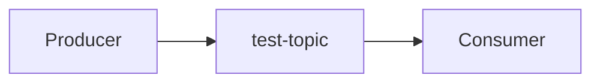
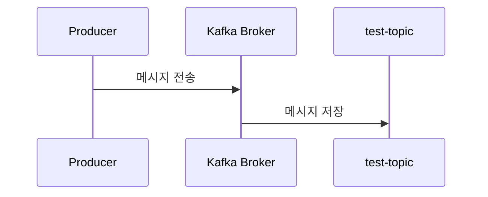
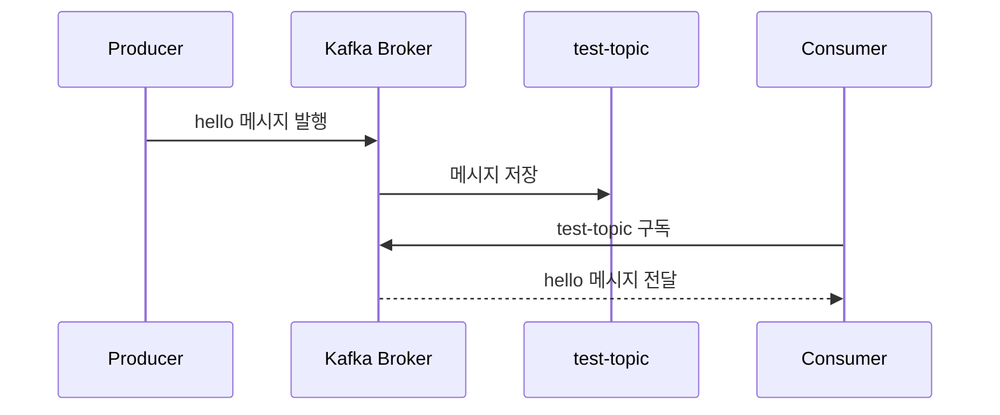

# Topic을 만들고 Producer와 Consumer 사용해보기

# Topic을 만들고 Producer와 Consumer 사용해보기

* toc
{:toc}

---

## Kafka Topic을 만들고 Producer와 Consumer 사용해보기

Kafka Cluster를 Docker Compose로 실행했다면, 이제 실제로 Topic을 만들고 메시지를 발행하고 소비하는 과정을 실습해볼 수 있다.

Kafka에서 메시지는 Topic이라는 단위로 분류되어 저장된다.

Producer는 Topic에 메시지를 보내고, Consumer는 Topic을 구독하여 메시지를 읽는다.

이번 실습의 흐름은 다음과 같다.



---

## Kafka 컨테이너 접속

먼저 실행 중인 Kafka Broker 컨테이너에 접속한다.

```bash
docker exec -it kafka00 bash
```

여기서 `kafka00`은 Docker Compose로 실행한 Kafka Broker 컨테이너 이름이다.

컨테이너에 접속한 뒤 Kafka 명령어가 있는 경로로 이동한다.

```bash
cd /bin
```

이제 Kafka CLI 명령어를 사용할 준비가 되었다.

---

## Kafka Topic 생성하기

Kafka Topic은 메시지가 저장되는 논리적인 단위이다.

예를 들어 주문 이벤트를 저장하려면 `order-topic`, 결제 이벤트를 저장하려면 `payment-topic`처럼 목적에 따라 Topic을 나눌 수 있다.

이번 실습에서는 `test-topic`이라는 Topic을 생성한다.

```bash
kafka-topics.sh --create \
  --bootstrap-server localhost:9092 \
  --replication-factor 3 \
  --partitions 1 \
  --topic test-topic
```

---

## Topic 생성 명령어 구조

위 명령어는 다음 옵션들로 구성된다.

---

### --create

```bash
--create
```

새로운 Topic을 생성하겠다는 의미이다.

---

### --bootstrap-server

```bash
--bootstrap-server localhost:9092
```

Kafka Cluster와 통신할 Broker 주소를 지정한다.

현재 명령어는 `kafka00` 컨테이너 내부에서 실행하고 있기 때문에 `localhost:9092`로 Broker에 접근할 수 있다.

---

### --replication-factor

```bash
--replication-factor 3
```

Topic 데이터의 복제본 개수를 지정한다.

Replication Factor가 3이라는 것은 동일한 Topic 데이터가 3개의 Broker에 복제된다는 의미이다.

이번 구성에서는 Broker가 3개이므로 복제 계수를 3으로 설정할 수 있다.

```text
kafka00
kafka01
kafka02
```

복제본을 여러 Broker에 저장하면 특정 Broker에 장애가 발생해도 데이터를 잃지 않고 서비스를 계속 운영할 수 있다.

다만 Replication Factor는 Kafka Cluster의 Broker 수를 초과할 수 없다.

---

### --partitions

```bash
--partitions 1
```

Topic의 Partition 개수를 지정한다.

Partition은 Topic을 물리적으로 나누어 저장하는 단위이다.

Partition 수가 많으면 Consumer가 병렬로 메시지를 처리하기 유리하다.

하지만 Partition은 한 번 생성하면 줄이기 어렵고, 너무 많이 만들면 관리 복잡도가 증가할 수 있다.

이번 실습에서는 기본 흐름을 이해하기 위해 Partition을 1개로 설정한다.

---

### --topic

```bash
--topic test-topic
```

생성할 Topic 이름을 지정한다.

Topic 이름은 Kafka Cluster 안에서 유일해야 한다.

---

## 생성된 Topic 확인하기

Topic이 정상적으로 생성되었는지 확인하려면 다음 명령어를 실행한다.

```bash
kafka-topics.sh --list --bootstrap-server localhost:9092
```

정상적으로 생성되었다면 다음과 같이 `test-topic`이 출력된다.

```text
test-topic
```

---

## Producer 실행하기

이제 `test-topic`에 메시지를 발행해보자.

Producer는 Kafka Topic에 메시지를 보내는 역할을 한다.

다음 명령어를 실행한다.

```bash
kafka-console-producer.sh --broker-list localhost:9092 --topic test-topic
```

명령어 실행 후 입력 대기 상태가 되면 메시지를 입력할 수 있다.

예를 들어 다음과 같이 입력한다.

```text
hello
```

이 메시지는 `test-topic`으로 발행된다.

---

## Producer 동작 흐름

Producer는 다음과 같은 흐름으로 동작한다.



즉, Producer가 메시지를 보내면 Kafka Broker가 이를 받아 Topic에 저장한다.

---

## Consumer 실행하기

이제 Topic에 발행된 메시지를 읽어보자.

Consumer는 Kafka Topic을 구독하고 메시지를 읽는 역할을 한다.

새 터미널을 열고 다시 Kafka 컨테이너에 접속한다.

```bash
docker exec -it kafka00 bash
```

명령어 경로로 이동한다.

```bash
cd /bin
```

Consumer를 실행한다.

```bash
kafka-console-consumer.sh --bootstrap-server localhost:9092 --topic test-topic --from-beginning
```

---

## --from-beginning 옵션

```bash
--from-beginning
```

이 옵션은 Topic의 처음 메시지부터 읽겠다는 의미이다.

만약 이 옵션을 사용하지 않으면 Consumer 실행 이후 새로 들어오는 메시지만 읽을 수 있다.

실습에서는 이미 Producer가 보낸 메시지까지 확인하기 위해 `--from-beginning` 옵션을 사용하는 것이 좋다.

---

## Consumer 실행 결과

Producer에서 다음 메시지를 보냈다면:

```text
hello
```

Consumer에서는 다음과 같이 메시지를 확인할 수 있다.

```text
hello
```

즉, Producer가 발행한 메시지가 Kafka Topic에 저장되고, Consumer가 이를 정상적으로 읽은 것이다.

---

## Producer와 Consumer 전체 흐름

전체 흐름은 다음과 같이 정리할 수 있다.



---

## 실습 명령어 전체 정리

전체 실습 명령어를 정리하면 다음과 같다.

### Kafka 컨테이너 접속

```bash
docker exec -it kafka00 bash
cd /bin
```

---

### Topic 생성

```bash
kafka-topics.sh --create \
  --bootstrap-server localhost:9092 \
  --replication-factor 3 \
  --partitions 1 \
  --topic test-topic
```

---

### Topic 목록 확인

```bash
kafka-topics.sh --list --bootstrap-server localhost:9092
```

---

### Producer 실행

```bash
kafka-console-producer.sh --broker-list localhost:9092 --topic test-topic
```

---

### Consumer 실행

```bash
kafka-console-consumer.sh --bootstrap-server localhost:9092 --topic test-topic --from-beginning
```

---

## 정리

이번 실습에서는 Kafka Topic을 생성하고, Producer와 Consumer를 사용하여 메시지를 발행하고 소비하는 과정을 확인했다.

Kafka의 기본 흐름은 단순하다.

```text
Producer → Topic → Consumer
```

Producer는 메시지를 Topic에 발행하고, Consumer는 Topic을 구독하여 메시지를 읽는다.

이 구조를 기반으로 Kafka는 대규모 이벤트 처리, 비동기 메시징, 로그 수집, 이벤트 기반 아키텍처 등 다양한 시스템에 활용된다.

---

### 한 줄 요약

Kafka Topic은 메시지가 저장되는 논리적 단위이며, Producer는 Topic에 메시지를 발행하고 Consumer는 Topic을 구독하여 메시지를 읽는다.
