# Consumer Group 알아보기 

# Consumer Group 알아보기

* toc
{:toc}

---

## Kafka Consumer Group 알아보기

Kafka를 처음 접하면 Producer, Topic, Consumer 정도는 쉽게 이해할 수 있다.

하지만 Kafka가 대규모 트래픽을 처리할 수 있는 진짜 이유는 Consumer Group이라는 개념에 있다.

Consumer Group은 여러 Consumer가 협력하여 메시지를 처리할 수 있도록 만들어진 Kafka의 핵심 기능이다. 이를 통해 Kafka는 높은 처리량과 확장성을 제공할 수 있다.

---

## Consumer Group이란?

Consumer Group은 여러 Consumer를 하나의 그룹으로 묶어 메시지를 처리하는 단위이다.

Kafka는 Consumer를 개별적으로 관리하지 않고 Group 단위로 관리한다.

예를 들어 다음과 같은 구조를 생각해볼 수 있다.

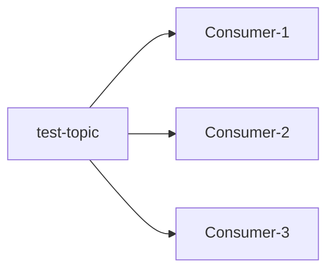

이 Consumer들이 모두 같은 Group ID를 사용한다면 Kafka는 하나의 Consumer Group으로 인식한다.

```text
group-id = order-group
```

---

## Consumer Group이 필요한 이유

Consumer가 하나만 존재한다면 모든 메시지를 혼자 처리해야 한다.

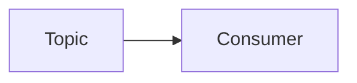

메시지가 적다면 문제가 없지만,

* 주문 이벤트
* 결제 이벤트
* 로그 이벤트
* 알림 이벤트

처럼 초당 수천 건 이상의 메시지가 발생한다면 하나의 Consumer로는 감당하기 어렵다.

그래서 Kafka는 여러 Consumer가 협력해서 처리할 수 있도록 Consumer Group을 제공한다.

---

## Consumer Group의 핵심 특징

Consumer Group은 다음과 같은 특징을 가진다.

### 병렬 처리

Consumer Group 내 Consumer들은 Topic의 Partition을 나누어 처리한다.

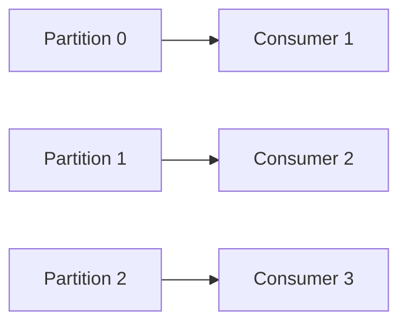

각 Consumer는 서로 다른 Partition을 담당하므로 병렬 처리가 가능하다.

---

### Group ID 기반 관리

Consumer Group은 고유한 Group ID를 가진다.

```text
order-group
payment-group
notification-group
```

Kafka는 Group ID를 기준으로 Consumer들의 상태와 Offset을 관리한다.

---

### 메시지 중복 방지

같은 Group 내에서는 하나의 메시지를 하나의 Consumer만 처리한다.

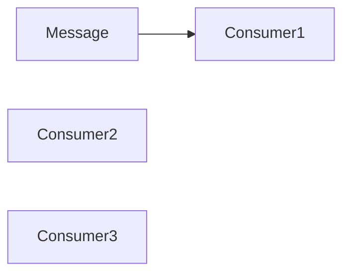

즉,

```text
하나의 메시지
→ 하나의 Consumer
```

원칙으로 동작한다.

---

## Partition과 Consumer Group의 관계

Kafka는 Partition 단위로 메시지를 분배한다.

예를 들어 Topic이 다음과 같이 구성되어 있다고 가정해보자.

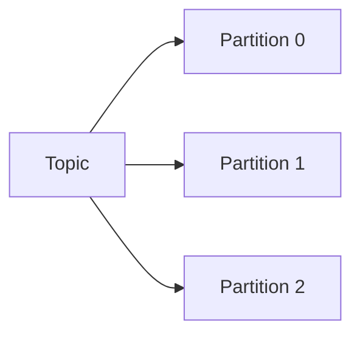

Consumer가 3개라면:

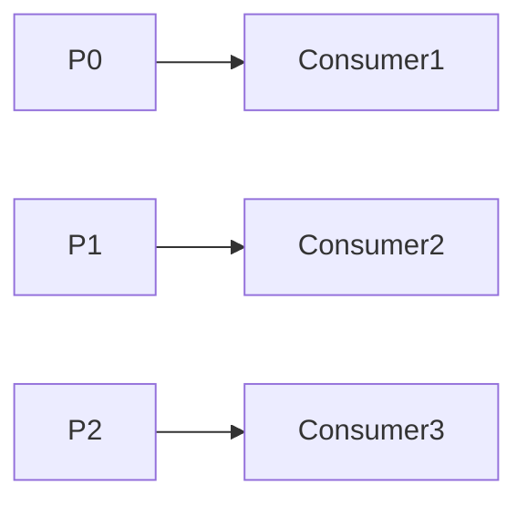

각 Consumer가 하나씩 담당하게 된다.

---

### Consumer 수가 적은 경우

Partition 3개

Consumer 2개

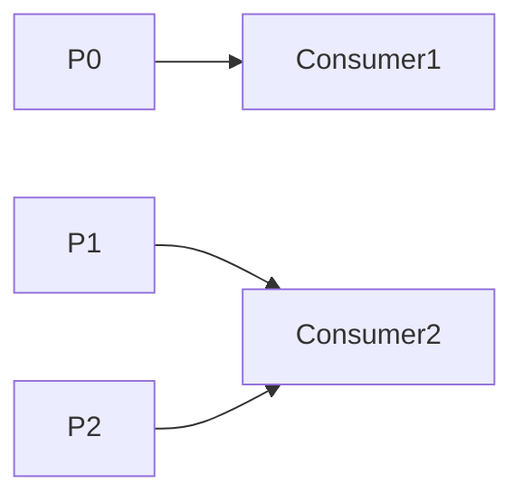

Consumer2는 두 개의 Partition을 처리하게 된다.

---

### Consumer 수가 많은 경우

Partition 3개

Consumer 5개

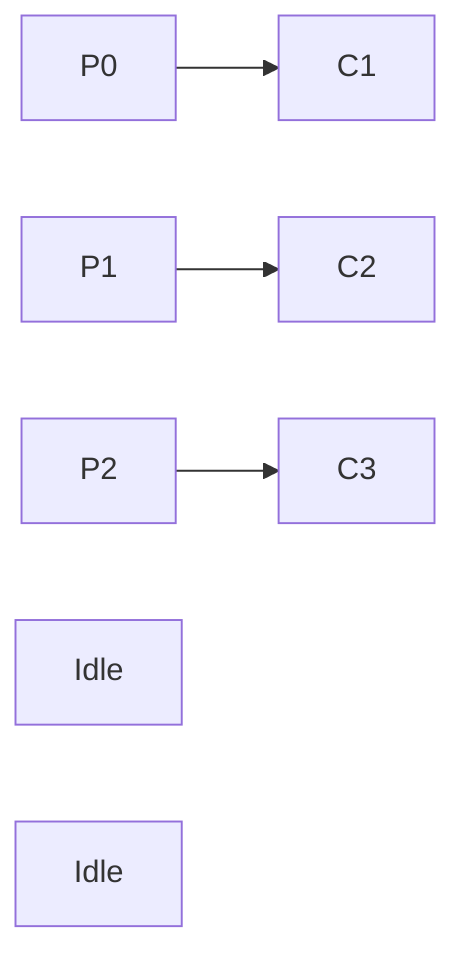

Partition보다 Consumer가 많으면 일부 Consumer는 아무 일도 하지 못한다.

---

## Consumer Group의 동작 방식

Kafka는 Partition을 Consumer에게 자동으로 할당한다.

대표적인 할당 전략은 다음과 같다.

### Range Assignor

Partition 범위를 나누어 할당

```text
Consumer1 → P0, P1
Consumer2 → P2, P3
```

---

### Round Robin Assignor

순서대로 균등 분배

```text
Consumer1 → P0, P2
Consumer2 → P1, P3
```

---

### Cooperative Sticky Assignor

최대한 기존 할당을 유지하면서 재분배

최근 Kafka에서 많이 사용되는 방식이다.

---

## Rebalancing이란?

Consumer Group에서 가장 중요한 개념 중 하나가 Rebalancing이다.

다음 상황이 발생하면 Rebalancing이 수행된다.

* Consumer 추가
* Consumer 제거
* Consumer 장애
* Partition 변경

예를 들어:

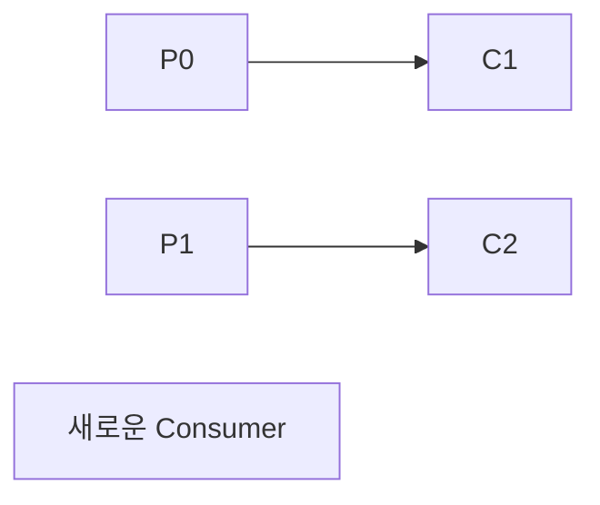

새 Consumer가 추가되면 Kafka는 Partition을 다시 분배한다.

---

## Rebalancing 과정

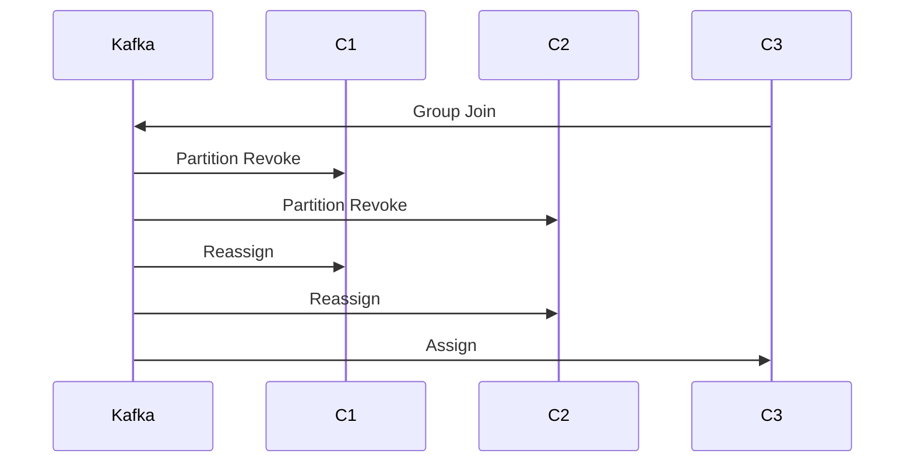

Rebalancing 중에는 잠시 메시지 처리가 멈출 수 있다.

그래서 실무에서는 Rebalancing을 최소화하는 것이 중요하다.

---

## Offset이란?

Kafka는 메시지의 순서를 Offset으로 관리한다.

```text
Offset 0
Offset 1
Offset 2
Offset 3
Offset 4
```

Consumer는 자신이 어디까지 읽었는지 Offset을 저장한다.

---

## Offset 저장 위치

Kafka는 Consumer Offset을 내부 Topic에 저장한다.

```text
__consumer_offsets
```

Kafka Cluster가 Consumer Group의 읽기 위치를 기억할 수 있는 이유가 바로 이 Topic 때문이다.

---

## Offset Commit 방식

### Auto Commit

```properties
enable.auto.commit=true
```

주기적으로 자동 저장

장점

* 사용이 간단

단점

* 메시지 유실 가능

---

### Manual Commit

```java
consumer.commitSync();
```

개발자가 직접 Commit

장점

* 안정성 높음

단점

* 구현 복잡도 증가

실무에서는 중요한 데이터 처리 시 Manual Commit을 사용하는 경우가 많다.

---

## Consumer Group 데이터 처리 모델

### 단일 Consumer Group

하나의 Group이 Topic을 처리한다.

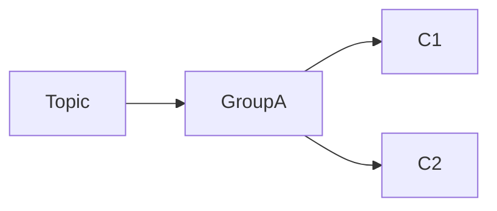

메시지는 그룹 내에서 한 번만 처리된다.

---

### 다중 Consumer Group

여러 Group이 같은 Topic을 구독한다.

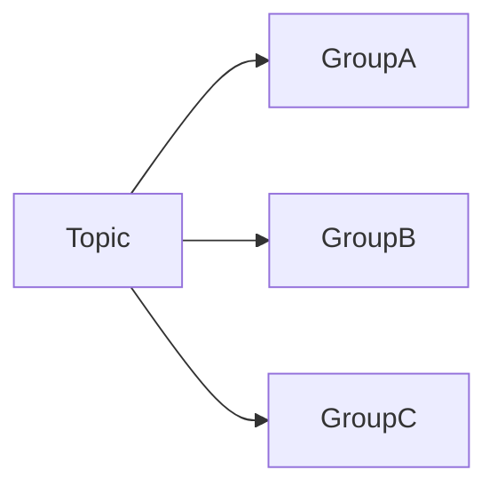

각 Group은 독립적으로 메시지를 읽는다.

즉 동일 메시지가 여러 Group에 전달될 수 있다.

---

## Consumer Group 활용 사례

### 로그 분석 시스템

```text
log-topic
```

* Group A → 실시간 모니터링
* Group B → 통계 분석
* Group C → 장기 저장

---

### 주문 처리 시스템

```text
order-topic
```

* 주문 저장
* 결제 처리
* 알림 전송

각 작업을 별도 Consumer Group이 담당할 수 있다.

---

## Consumer Group 장점

### 확장성

Consumer 수를 늘려 병렬 처리 가능

### 유연성

Group 단위로 비즈니스 로직 분리 가능

### 중복 방지

같은 Group에서는 동일 메시지가 한 번만 처리됨

### 장애 대응

Consumer 장애 시 다른 Consumer가 Partition을 인계받음

---

## Consumer Group 단점

### Rebalancing 비용

Consumer 추가·삭제 시 처리 지연 발생

### Partition 수 제한

Consumer 수는 Partition 수 이상으로 확장할 수 없음

### Offset 관리 필요

Manual Commit 사용 시 관리 복잡도 증가

---

## 정리

Consumer Group은 Kafka의 병렬 처리와 확장성을 가능하게 만드는 핵심 기능이다.

Kafka는 Partition 단위로 메시지를 분배하며, 같은 Group 안에서는 메시지가 한 번만 처리된다.

또한 여러 Consumer Group이 동일 Topic을 구독할 수 있기 때문에 하나의 이벤트를 여러 비즈니스 영역에서 독립적으로 활용할 수 있다.

---

### 한 줄 요약

Consumer Group은 여러 Consumer가 협력하여 Topic의 Partition을 분산 처리하도록 만드는 Kafka의 핵심 기능이며, Kafka의 확장성과 병렬 처리 능력의 중심에 있는 개념이다.

