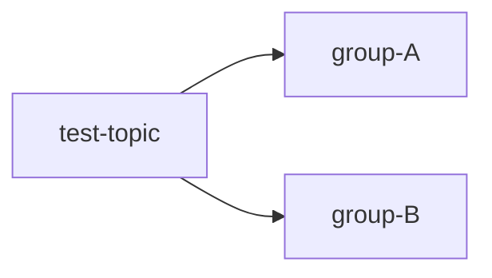
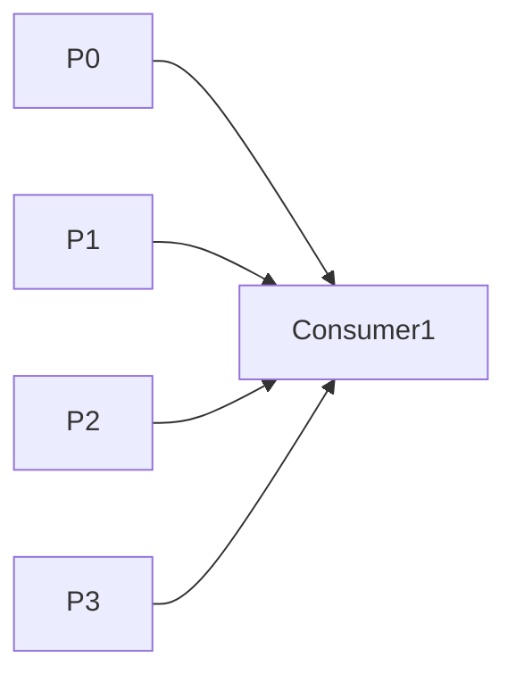
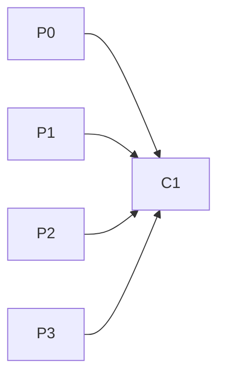
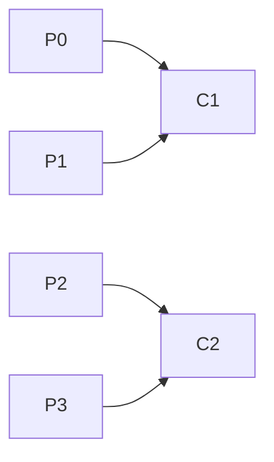

# 컨슈머 그룹 다뤄보기

# 컨슈머 그룹 다뤄보기

* toc
{:toc}

---

## Kafka Consumer Group 다뤄보기

앞서 Consumer Group의 개념과 동작 원리를 살펴보았다.

이번에는 실제 Kafka CLI를 사용하여 Consumer Group을 생성하고, 메시지를 소비하며, 리밸런싱(Rebalancing)이 어떻게 발생하는지 직접 확인해본다. Consumer Group은 Kafka의 병렬 처리와 확장성을 가능하게 만드는 핵심 기능이다.

---

## Kafka Broker 접속

먼저 Kafka Broker 컨테이너에 접속한다.

```bash
docker exec -it kafka00 bash
cd /bin
```

이제 Kafka CLI 명령어를 사용할 수 있다.

---

## 메시지 생성하기

Producer를 실행하여 테스트 메시지를 생성한다.

```bash
kafka-console-producer.sh \
  --bootstrap-server localhost:9092 \
  --topic test-topic
```

메시지를 입력한다.

```text
Message 1
Message 2
Message 3
Message 4
```

입력한 메시지는 `test-topic`에 저장된다.

---

## 단일 Consumer Group 실행

하나의 Consumer Group을 생성하여 메시지를 읽어보자.

```bash
kafka-console-consumer.sh \
  --bootstrap-server localhost:9092 \
  --topic test-topic \
  --group group-A \
  --from-beginning
```

옵션 설명:

| 옵션                 | 설명                |
| ------------------ | ----------------- |
| `--topic`          | 구독할 Topic         |
| `--group`          | Consumer Group 이름 |
| `--from-beginning` | 처음 메시지부터 읽기       |

실행 결과:

```text
Message 1
Message 2
Message 3
Message 4
```

하나의 Consumer가 모든 메시지를 순차적으로 처리하는 것을 확인할 수 있다.

---

## 다중 Consumer Group 구성하기

Kafka의 강력한 기능 중 하나는 동일한 Topic을 여러 Consumer Group이 독립적으로 구독할 수 있다는 점이다.

### Group A 실행

```bash
kafka-console-consumer.sh \
  --bootstrap-server localhost:9092 \
  --topic test-topic \
  --group group-A \
  --from-beginning
```

### Group B 실행

새 터미널에서 실행한다.

```bash
kafka-console-consumer.sh \
  --bootstrap-server localhost:9092 \
  --topic test-topic \
  --group group-B \
  --from-beginning
```

---

## 다중 Consumer Group의 동작 방식



각 Group은 독립적으로 Offset을 관리한다.

따라서 동일한 메시지가 여러 Group에 전달될 수 있다.

예를 들어:

* group-A → 주문 처리
* group-B → 통계 수집
* group-C → 알림 발송

처럼 하나의 이벤트를 여러 서비스에서 활용할 수 있다.

---

## 동일 Group 내 병렬 처리

이번에는 동일한 Consumer Group 안에서 여러 Consumer를 실행해보자.

첫 번째 Consumer 실행:

```bash
kafka-console-consumer.sh \
  --bootstrap-server localhost:9092 \
  --topic test-topic \
  --group group-A \
  --from-beginning
```

두 번째 Consumer 실행:

```bash
kafka-console-consumer.sh \
  --bootstrap-server localhost:9092 \
  --topic test-topic \
  --group group-A \
  --from-beginning
```

---

## 왜 두 번째 Consumer가 메시지를 읽지 않을까?

실습하다 보면 두 번째 Consumer가 아무 메시지도 읽지 않는 경우가 있다.

```text
Processed a total of 0 messages
```

이는 오류가 아니다.

첫 번째 Consumer가 이미 Offset을 Commit했기 때문이다. Kafka는 같은 Group 내에서 이미 처리한 메시지를 다시 전달하지 않는다.

즉,

```text
같은 Group
→ 메시지 한 번만 처리
```

원칙으로 동작한다.

---

## Consumer Group 상태 확인

Kafka는 Consumer Group 상태를 조회하는 기능을 제공한다.

### Group 목록 조회

```bash
kafka-consumer-groups.sh \
  --bootstrap-server localhost:9092 \
  --list
```

예시 결과:

```text
group-A
group-B
```

---

### Group 상세 조회

```bash
kafka-consumer-groups.sh \
  --bootstrap-server localhost:9092 \
  --describe \
  --group group-A
```

---

## Consumer Group 상태 정보 이해하기

조회 결과에는 여러 중요한 정보가 표시된다.

| 항목             | 설명               |
| -------------- | ---------------- |
| CURRENT-OFFSET | 마지막으로 읽은 Offset  |
| LOG-END-OFFSET | 최신 메시지 Offset    |
| LAG            | 아직 처리하지 않은 메시지 수 |

예시:

```text
CURRENT-OFFSET: 35
LOG-END-OFFSET: 40
LAG: 5
```

이는 Consumer가 35번까지 읽었고, 아직 5개의 메시지가 남아있다는 의미이다.

LAG는 Kafka 운영에서 가장 중요한 모니터링 지표 중 하나이다.

---

## 리밸런싱(Rebalancing)이란?

리밸런싱은 Consumer Group 내부 구성이 변경될 때 발생한다.

발생 조건:

* Consumer 추가
* Consumer 제거
* Consumer 장애
* Partition 변경

리밸런싱이 발생하면 Kafka는 Partition을 다시 분배한다.

---

## 리밸런싱 실습

먼저 Consumer 하나만 실행한다.



현재는 Consumer1이 모든 Partition을 담당한다.

---

## Partition 개수 변경

Partition을 4개로 변경한다.

```bash
kafka-topics.sh --alter \
  --bootstrap-server localhost:9092 \
  --topic test-topic \
  --partitions 4
```

주의할 점은 Partition은 증가만 가능하며 감소는 불가능하다.

---

## 두 번째 Consumer 추가

새 터미널에서 동일한 Group으로 Consumer를 실행한다.

```bash
kafka-console-consumer.sh \
  --bootstrap-server localhost:9092 \
  --topic test-topic \
  --group group-A \
  --from-beginning
```

이 순간 Rebalancing이 발생한다.

---

## 리밸런싱 전후 비교

리밸런싱 전:



리밸런싱 후:



Kafka는 Consumer 수가 변경되면 Partition을 균등하게 재분배한다.

---

## 리밸런싱의 장점과 단점

### 장점

* 자동 장애 복구
* 자동 부하 분산
* 수평 확장 가능

### 단점

* 리밸런싱 동안 메시지 처리 중단
* Consumer가 많아질수록 오버헤드 증가

실무에서는 Cooperative Sticky Assignor를 사용하여 리밸런싱 비용을 줄이는 경우가 많다.

---

## 정리

Consumer Group은 Kafka의 병렬 처리와 확장성을 제공하는 핵심 기능이다.

같은 Group 안에서는 메시지가 한 번만 처리되며, 서로 다른 Group은 동일한 메시지를 독립적으로 소비할 수 있다.

또한 Consumer 수나 Partition 구성이 변경되면 Kafka는 자동으로 리밸런싱을 수행하여 Partition을 재분배한다.

이러한 메커니즘 덕분에 Kafka는 대규모 이벤트 기반 시스템에서도 안정적으로 동작할 수 있다.

---

### 한 줄 요약

Consumer Group은 Kafka의 병렬 처리와 장애 대응을 가능하게 하는 핵심 기능이며, 리밸런싱은 Consumer와 Partition의 균형을 자동으로 맞추는 메커니즘이다.
