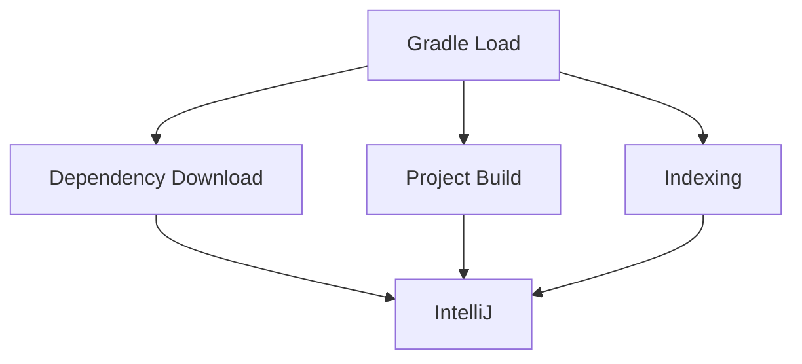

# Spring Boot 프로젝트 설정하기

# Spring Boot 프로젝트 설정하기

* toc
{:toc}

---

## Spring Boot 프로젝트 설정하기

Kafka를 실습하기 위해서는 애플리케이션을 개발할 수 있는 환경이 필요하다.

이번 글에서는 IntelliJ IDEA를 설치하고 Spring Boot 프로젝트를 실행할 수 있는 개발 환경을 구성해본다.

최종 목표는 다음과 같다.

* IntelliJ 설치
* Spring Boot 프로젝트 열기
* Gradle 로드
* JDK 설치
* 애플리케이션 실행

개발 환경 구성이 완료되면 이후 Kafka Producer와 Consumer를 Spring Boot 애플리케이션으로 구현할 수 있다.

---

## 개발 환경 사양

원활한 실습을 위해 다음 사양을 권장한다.

| 항목       | 권장 사양            |
| -------- | ---------------- |
| 운영체제     | Windows 10 이상    |
| 운영체제     | MacOS Big Sur 이상 |
| 메모리      | 16GB 이상          |
| Docker   | 최신 버전            |
| IntelliJ | Ultimate 권장      |

Kafka, Docker, IntelliJ를 동시에 실행하면 메모리 사용량이 높아질 수 있으므로 16GB 이상의 메모리를 권장한다.

---

## IntelliJ IDEA란?

IntelliJ IDEA는 JetBrains에서 개발한 Java 기반 통합 개발 환경(IDE)이다.

특히 Spring Boot 개발에 최적화된 기능들을 제공한다.

대표적인 기능은 다음과 같다.

* 코드 자동 완성
* 디버깅
* Gradle 관리
* Git 연동
* Spring Boot 지원

Java와 Spring Boot 생태계에서는 가장 많이 사용하는 IDE 중 하나이다.

---

## IntelliJ 설치하기

JetBrains 공식 홈페이지에서 IntelliJ IDEA를 다운로드할 수 있다.

설치 과정은 다음과 같다.

1. IntelliJ 다운로드
2. 설치 파일 실행
3. 설치 옵션 선택
4. 라이선스 활성화
5. 프로젝트 실행

설치 용량은 약 1GB 이상 필요하다.

---

## Community와 Ultimate 차이

IntelliJ는 크게 두 가지 버전을 제공한다.

| 버전        | 특징 |
| --------- | -- |
| Community | 무료 |
| Ultimate  | 유료 |

Spring Boot 프로젝트 생성 기능은 Ultimate 버전에서 더욱 강력하게 지원된다. 처음 사용하는 경우 무료 체험판을 사용할 수 있다.

---

## IntelliJ 설치 옵션

설치 과정에서 다음 옵션들을 활성화하는 것을 권장한다.

* Desktop Shortcut 생성
* PATH 변수 등록
* Context Menu 등록
* Java 파일 연결
* Gradle 파일 연결

특히 PATH 등록 옵션을 선택하면 터미널에서 IntelliJ를 쉽게 실행할 수 있다.

---

## 프로젝트 준비하기

Kafka 실습을 위한 Spring Boot 프로젝트를 준비한다.

예를 들어 다음과 같은 구조를 사용할 수 있다.

```text
C:\
 └── myproject
      ├── build.gradle
      ├── settings.gradle
      ├── src
      └── gradle
```

실습용 프로젝트를 다운로드한 뒤 원하는 디렉터리에 압축을 해제한다. 자료에서는 `C:\myproject` 경로를 예시로 사용한다.

---

## IntelliJ에서 프로젝트 열기

IntelliJ를 실행한 뒤 `Open` 메뉴를 선택한다.

이후 프로젝트 폴더를 선택한다.

```text
C:\myproject
```

프로젝트를 열면 IntelliJ는 해당 폴더를 신뢰할 것인지 확인한다.

---

## Trust Project란?

처음 프로젝트를 열면 다음과 같은 메시지가 나타날 수 있다.

```text
Trust Project?
```

이는 프로젝트 내부에 실행 가능한 코드가 존재할 수 있기 때문에 보안 목적으로 제공되는 기능이다. 프로젝트가 신뢰할 수 있는 코드라면 `Trust Project`를 선택하면 된다.

---

## Gradle 프로젝트 로드

프로젝트를 열면 IntelliJ 우측 하단에 Gradle 로드 알림이 나타난다.

```text
Load Gradle Project
```

반드시 해당 버튼을 눌러 Gradle 프로젝트를 로드해야 한다.

---

## Gradle이란?

Gradle은 Java 생태계에서 가장 널리 사용되는 빌드 도구 중 하나이다.

Gradle은 다음 역할을 수행한다.

* 라이브러리 다운로드
* 프로젝트 빌드
* 테스트 실행
* 애플리케이션 패키징

Spring Boot 프로젝트에서는 대부분 Gradle 또는 Maven을 사용한다.

---

## Gradle 로드 시 발생하는 작업

Gradle을 로드하면 다음 작업이 자동으로 수행된다.



이 과정에서 시간이 다소 소요될 수 있다.

---

## JDK 설치

프로젝트를 처음 실행할 때 IntelliJ가 JDK 설치를 요청할 수 있다.

JDK는 Java 프로그램을 실행하기 위한 필수 구성 요소이다.

IntelliJ는 필요한 JDK를 자동 다운로드할 수 있다.

예를 들어 다음 버전을 사용할 수 있다.

```text
Amazon Corretto 21
OpenJDK 21
Temurin 21
```

최근 Spring Boot 환경에서는 Java 17 또는 Java 21을 많이 사용한다.

---

## JDK와 JRE의 차이

많은 개발자가 처음에 헷갈리는 개념이 있다.

### JRE

Java Runtime Environment

```text
Java 프로그램 실행 환경
```

### JDK

Java Development Kit

```text
JRE + 개발 도구
```

개발자는 반드시 JDK를 설치해야 한다.

---

## 프로젝트 실행

모든 설정이 완료되면 IntelliJ 우측 상단에 실행 버튼이 활성화된다.

실행 버튼을 클릭하면 Spring Boot 애플리케이션이 시작된다.

정상 실행되면 콘솔에서 다음과 같은 로그를 확인할 수 있다.

```text
Started Application
```

이 메시지가 출력되면 프로젝트 설정이 완료된 것이다.

---

## Spring Boot 프로젝트 구조 살펴보기

일반적인 Spring Boot 프로젝트 구조는 다음과 같다.

```text
src
 ├── main
 │    ├── java
 │    └── resources
 │
 └── test
      └── java
```

### main/java

애플리케이션 코드 작성

### main/resources

설정 파일 저장

```text
application.yml
application.properties
```

### test/java

테스트 코드 작성

---

## 이후 진행할 내용

개발 환경 구성이 완료되었다면 다음 단계로 넘어갈 수 있다.

* Kafka 의존성 추가
* Producer 구현
* Consumer 구현
* Kafka Template 사용
* Listener 구현

이제부터는 Spring Boot와 Kafka를 실제로 연동하며 이벤트 기반 애플리케이션을 구현하게 된다.

---

## 정리

Kafka 실습을 위해서는 먼저 안정적인 Spring Boot 개발 환경이 필요하다.

IntelliJ를 설치하고, Gradle 프로젝트를 로드하며, JDK를 설치하면 Spring Boot 애플리케이션을 실행할 수 있는 준비가 완료된다.

이후에는 Kafka 라이브러리를 추가하고 Producer와 Consumer를 구현하여 이벤트 기반 시스템을 직접 개발할 수 있다.

---

### 한 줄 요약

Kafka 실습의 첫 단계는 IntelliJ, Gradle, JDK를 활용한 Spring Boot 개발 환경 구성이며, 이는 이후 Producer와 Consumer 구현의 기반이 된다.
