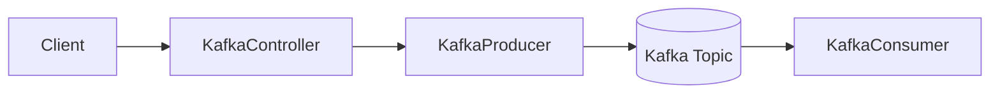
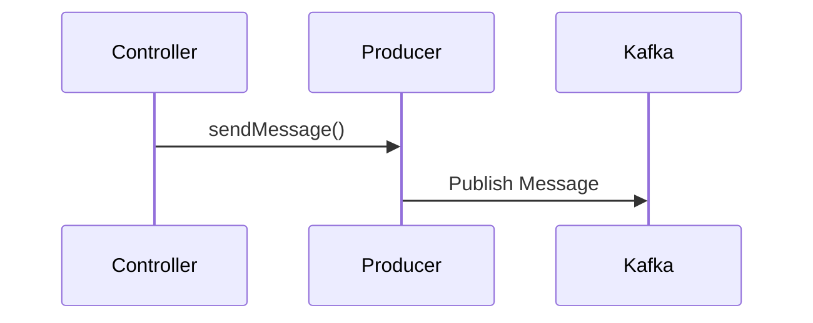
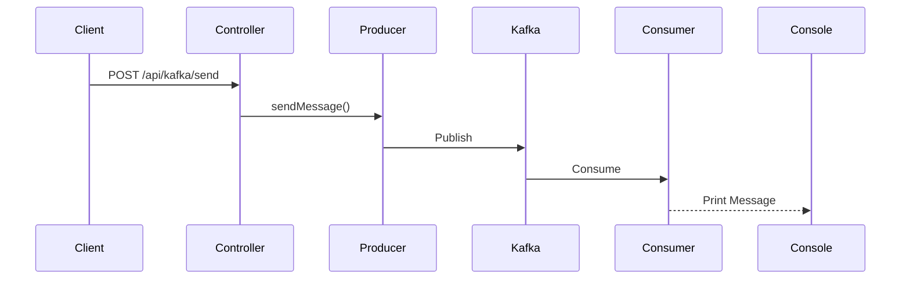

# Spring Boot에 Kafka 설정하기

# Spring Boot에 Kafka 설정하기

* toc
{:toc}

---

## Spring Boot와 Kafka 연동하기

앞서 Kafka Cluster를 Docker Compose로 구성하고 Topic 생성 및 Producer/Consumer를 CLI로 테스트해보았다.

이번에는 Spring Boot 애플리케이션에서 Kafka를 직접 사용해보자.

최종적으로 구현할 구조는 다음과 같다.



사용자가 API를 호출하면 Kafka Producer가 메시지를 발행하고, Kafka Consumer가 해당 메시지를 수신하는 구조이다.

---

## 프로젝트 구조

```text
src
 ├── main
 │    ├── java
 │    │    └── com.example.kafka
 │    │         ├── config
 │    │         │     └── KafkaConfig.java
 │    │         │
 │    │         ├── controller
 │    │         │     └── KafkaController.java
 │    │         │
 │    │         ├── dto
 │    │         │     └── Message.java
 │    │         │
 │    │         ├── KafkaProducer.java
 │    │         ├── KafkaConsumer.java
 │    │         └── KafkaApplication.java
 │    │
 │    └── resources
 │          ├── application.yml
 │          └── avro
 │
 └── build.gradle
```

---

## Gradle 설정

Kafka를 사용하기 위해 Spring Kafka 의존성을 추가한다.

### build.gradle

```gradle
plugins {
    id 'java'
    id 'org.springframework.boot' version '3.4.4'
    id 'io.spring.dependency-management' version '1.1.7'
    id 'com.github.davidmc24.gradle.plugin.avro' version '1.9.1'
}

group = 'com.example'
version = '0.0.1-SNAPSHOT'

java {
    toolchain {
        languageVersion = JavaLanguageVersion.of(21)
    }
}

repositories {
    mavenCentral()

    maven {
        url 'https://packages.confluent.io/maven/'
    }
}

dependencies {

    implementation 'org.springframework.boot:spring-boot-starter-web'

    implementation 'org.springframework.kafka:spring-kafka'

    implementation 'io.confluent:kafka-avro-serializer:7.8.0'

    implementation 'org.apache.avro:avro:1.12.0'

    testImplementation 'org.springframework.boot:spring-boot-starter-test'

    testImplementation 'org.springframework.kafka:spring-kafka-test'
}

bootJar {
    archiveFileName = 'service-kafka.jar'
}

generateAvroJava {
    source("src/main/resources/avro")
    include("**/*.avsc")
}
```

---

## Gradle 설정 설명

### Spring Kafka

```gradle
implementation 'org.springframework.kafka:spring-kafka'
```

Spring Boot에서 Kafka를 쉽게 사용할 수 있도록 지원하는 라이브러리이다.

대표적으로 다음 기능을 제공한다.

* KafkaTemplate
* KafkaListener
* ProducerFactory
* ConsumerFactory

---

### Avro

```gradle
implementation 'io.confluent:kafka-avro-serializer:7.8.0'
implementation 'org.apache.avro:avro:1.12.0'
```

Kafka에서는 JSON 대신 Avro를 사용하는 경우가 많다.

장점:

* 데이터 크기 감소
* 직렬화 성능 향상
* 스키마 관리 가능

이번 실습에서는 String 메시지를 사용하지만 이후 Schema Registry와 함께 사용할 수 있다.

---

## Kafka 연결 설정

### application.yml

```yaml
spring:

  kafka:

    bootstrap-servers:
      - localhost:10000
      - localhost:10001
      - localhost:10002

    consumer:

      group-id: my-group

      auto-offset-reset: earliest

      key-deserializer: org.apache.kafka.common.serialization.StringDeserializer

      value-deserializer: org.apache.kafka.common.serialization.StringDeserializer

    producer:

      key-serializer: org.apache.kafka.common.serialization.StringSerializer

      value-serializer: org.apache.kafka.common.serialization.StringSerializer
```

---

## bootstrap-servers

```yaml
bootstrap-servers:
  - localhost:10000
  - localhost:10001
  - localhost:10002
```

Docker Compose에서 구성했던 Kafka Broker 주소이다.

```text
Kafka00 → localhost:10000
Kafka01 → localhost:10001
Kafka02 → localhost:10002
```

Spring Boot는 이 Broker 중 하나에 접속하여 Cluster 정보를 가져온다.

---

## Consumer 설정

### group-id

```yaml
group-id: my-group
```

Consumer Group 이름이다.

Kafka는 Offset을 Group 단위로 관리한다.

---

### auto-offset-reset

```yaml
auto-offset-reset: earliest
```

Offset 정보가 없을 때 어디서부터 읽을지 결정한다.

| 옵션       | 설명            |
| -------- | ------------- |
| earliest | 처음부터 읽기       |
| latest   | 최신 메시지부터 읽기   |
| none     | Offset 없으면 예외 |

실습에서는 기존 메시지까지 보기 위해 earliest를 사용한다.

---

## KafkaConfig 작성

Kafka 관련 Bean을 등록한다.

### KafkaConfig.java

```java
@Configuration
@EnableKafka
public class KafkaConfig {

    @Bean
    public ProducerFactory<String, String> producerFactory() {

        Map<String, Object> config = new HashMap<>();

        config.put(
                ProducerConfig.BOOTSTRAP_SERVERS_CONFIG,
                "localhost:10000"
        );

        config.put(
                ProducerConfig.KEY_SERIALIZER_CLASS_CONFIG,
                StringSerializer.class
        );

        config.put(
                ProducerConfig.VALUE_SERIALIZER_CLASS_CONFIG,
                StringSerializer.class
        );

        return new DefaultKafkaProducerFactory<>(config);
    }

    @Bean
    public KafkaTemplate<String, String> kafkaTemplate() {

        return new KafkaTemplate<>(producerFactory());
    }

    @Bean
    public NewTopic defaultTopic() {

        return TopicBuilder
                .name("topic")
                .partitions(1)
                .replicas(1)
                .build();
    }
}
```

---

## ProducerFactory

```java
@Bean
public ProducerFactory<String, String> producerFactory()
```

Producer 생성 시 사용할 설정 정보를 담고 있다.

대표 설정:

```java
ProducerConfig.BOOTSTRAP_SERVERS_CONFIG
```

Kafka Broker 주소

```java
ProducerConfig.KEY_SERIALIZER_CLASS_CONFIG
```

Key 직렬화

```java
ProducerConfig.VALUE_SERIALIZER_CLASS_CONFIG
```

Value 직렬화

---

## KafkaTemplate

```java
@Bean
public KafkaTemplate<String, String> kafkaTemplate()
```

Kafka 메시지를 발행하는 핵심 객체이다.

실제 메시지 발행 시 사용한다.

```java
kafkaTemplate.send(...)
```

---

## Topic 자동 생성

```java
@Bean
public NewTopic defaultTopic()
```

애플리케이션 시작 시 Topic을 자동 생성한다.

```java
TopicBuilder
        .name("topic")
        .partitions(1)
        .replicas(1)
```

설정 의미

```text
Topic 이름 : topic
Partition : 1
Replica : 1
```

---

## 메시지 DTO

### Message.java

```java
public class Message {

    private Integer id;

    private String message;

    public Integer getId() {
        return id;
    }

    public void setId(Integer id) {
        this.id = id;
    }

    public String getMessage() {
        return message;
    }

    public void setMessage(String message) {
        this.message = message;
    }
}
```

전송할 메시지 객체이다.

예시:

```json
{
  "id": 1,
  "message": "Hello Kafka"
}
```

---

## Producer 구현

### KafkaProducer.java

```java
@Service
public class KafkaProducer {

    private final KafkaTemplate<String, String> kafkaTemplate;

    public KafkaProducer(
            KafkaTemplate<String, String> kafkaTemplate
    ) {
        this.kafkaTemplate = kafkaTemplate;
    }

    public void sendMessage(
            String topic,
            String message
    ) {

        kafkaTemplate.send(
                topic,
                message
        );
    }
}
```

---

## Producer 동작 과정



Producer는 KafkaTemplate을 사용하여 Topic에 메시지를 발행한다.

---

## Consumer 구현

### KafkaConsumer.java

```java
@Service
public class KafkaConsumer {

    @KafkaListener(
            topics = "topic",
            groupId = "my-group"
    )
    public void listen(
            ConsumerRecord<String, String> record
    ) {

        System.out.println(
                "Received Message : "
                        + record.value()
        );
    }
}
```

---

## KafkaListener

```java
@KafkaListener(
        topics = "topic",
        groupId = "my-group"
)
```

설정 의미

| 항목      | 설명             |
| ------- | -------------- |
| topics  | 구독할 Topic      |
| groupId | Consumer Group |

메시지가 들어오면 자동 실행된다.

---

## Controller 구현

### KafkaController.java

```java
@RestController
@RequestMapping("/api/kafka")
public class KafkaController {

    private final KafkaProducer kafkaProducer;

    private final ObjectMapper objectMapper;

    public KafkaController(
            KafkaProducer kafkaProducer,
            ObjectMapper objectMapper
    ) {
        this.kafkaProducer = kafkaProducer;
        this.objectMapper = objectMapper;
    }

    @PostMapping("/send")
    public String sendMessage(
            @RequestBody Message message
    ) throws Exception {

        String jsonMessage =
                objectMapper.writeValueAsString(
                        message
                );

        kafkaProducer.sendMessage(
                "topic",
                jsonMessage
        );

        return "Message Sent";
    }
}
```

---

## API 호출

```http
POST /api/kafka/send
```

Body

```json
{
  "id": 1,
  "message": "Hello Kafka"
}
```

---

## 전체 동작 흐름



실행 결과

```text
Received Message :
{"id":1,"message":"Hello Kafka"}
```

---

## 정리

Spring Boot에서는 Spring Kafka 라이브러리를 사용하여 Kafka를 매우 쉽게 연동할 수 있다.

KafkaTemplate을 이용해 메시지를 발행하고, KafkaListener를 이용해 메시지를 소비할 수 있다.

이번 예제는 가장 기본적인 Producer-Consumer 구조이며, 이후에는 Avro, Schema Registry, Partition 전략, Consumer Group, Batch Consumer 등을 추가하여 실무 수준의 Kafka 시스템으로 확장할 수 있다.

### 한 줄 요약

Spring Boot와 Kafka를 연동하면 KafkaTemplate으로 메시지를 발행하고 KafkaListener로 메시지를 소비할 수 있으며, 이를 기반으로 이벤트 기반 아키텍처를 구현할 수 있다.
