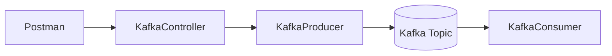
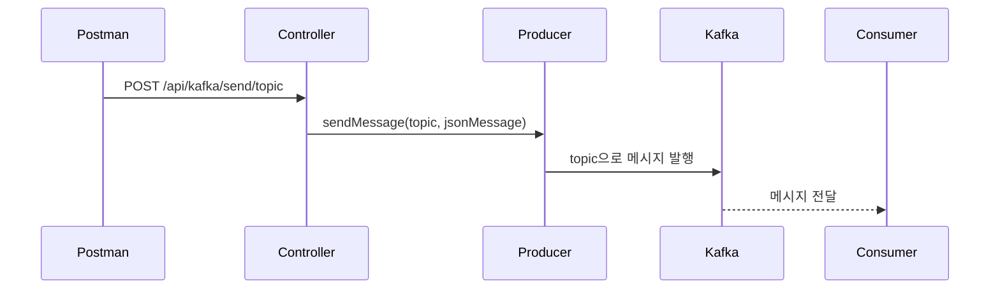
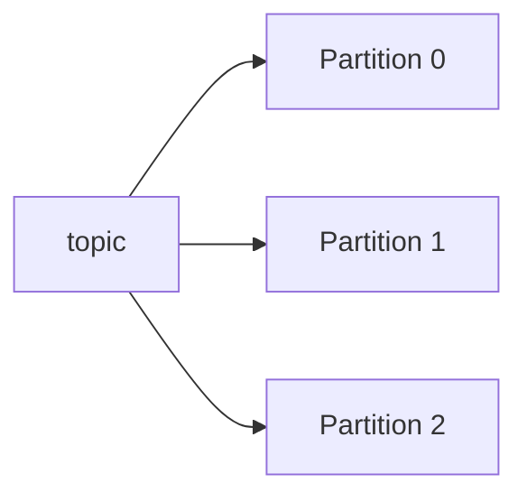
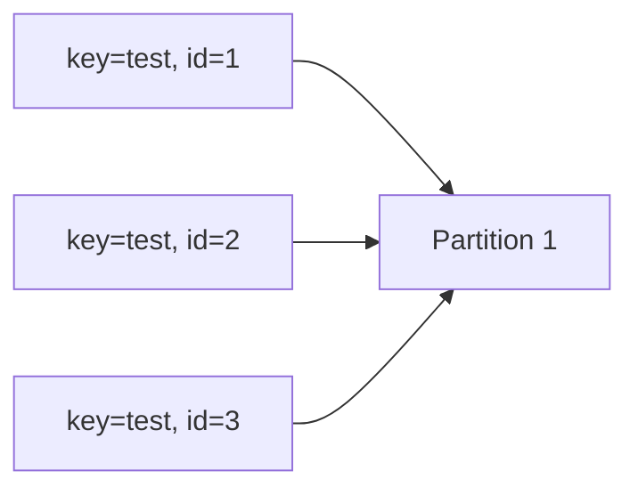
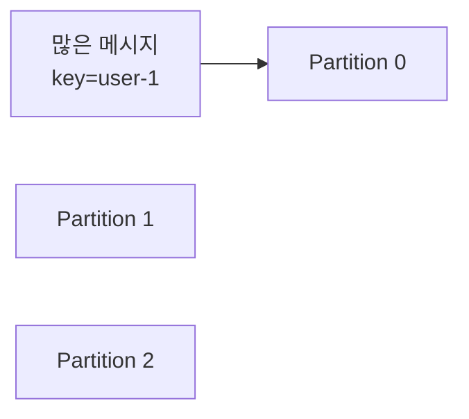
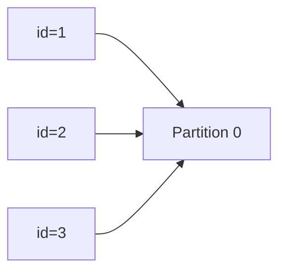
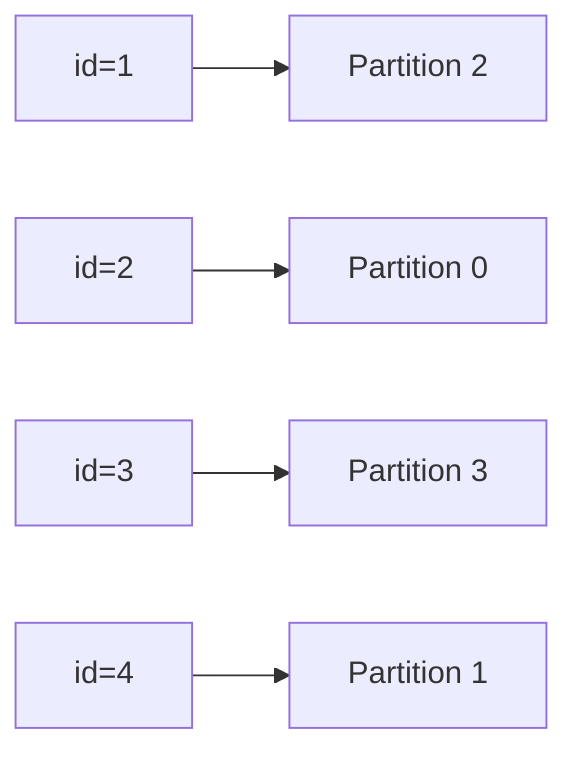
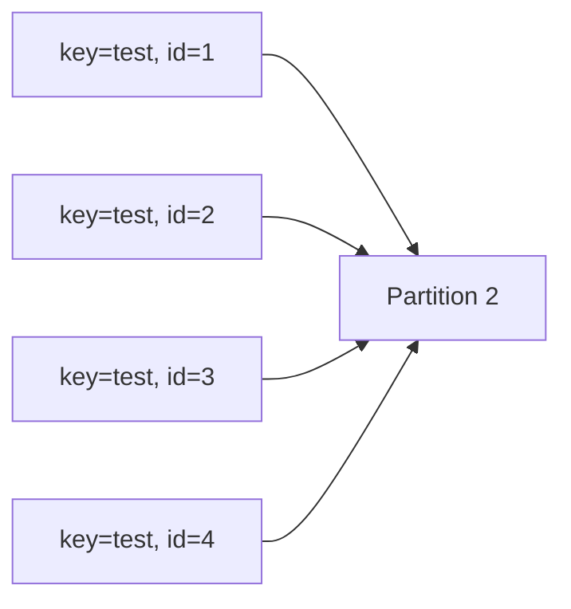

# Producer로 메시지 전송해보기

# Producer로 메시지 전송해보기

* toc
{:toc}

---

## Producer로 메시지 전송해보기

이번에는 Spring Boot 애플리케이션에서 Kafka Producer를 사용해 메시지를 직접 전송해본다.

앞에서 Kafka Topic을 만들고 CLI 기반 Producer/Consumer를 사용해보았다면, 이번에는 API 요청을 통해 Kafka에 메시지를 발행한다.

전체 흐름은 다음과 같다.



사용자는 Postman으로 HTTP 요청을 보내고, Spring Boot Controller는 요청 데이터를 Kafka Producer에 전달한다. Producer는 해당 메시지를 Kafka Topic에 발행하고, Consumer는 메시지를 구독하여 처리한다.

---

## Postman이란?

Postman은 API를 테스트하고 개발할 때 많이 사용하는 도구이다.

브라우저나 프론트엔드 화면이 없어도 HTTP 요청을 직접 만들고 서버에 보낼 수 있다.

Postman을 사용하면 다음 요청을 쉽게 테스트할 수 있다.

* GET
* POST
* PUT
* DELETE
* GraphQL

Kafka Producer API도 HTTP API로 만들어두면 Postman을 통해 쉽게 테스트할 수 있다.

---

## Postman 설치하기

Postman은 공식 웹사이트에서 다운로드할 수 있다.

운영체제별 설치 파일은 다음과 같다.

| 운영체제    | 설치 파일   |
| ------- | ------- |
| Mac     | .dmg    |
| Windows | .exe    |
| Linux   | .tar.gz |

설치 후 Postman을 실행하면 Workspace, Collections, Request, Response 영역을 확인할 수 있다.

---

## Postman 주요 화면 구성

Postman 화면은 크게 다음 영역으로 나눌 수 있다.

### Workspace

내 요청들을 저장하고 관리하는 공간이다.

여러 프로젝트나 서비스별로 요청을 나누어 보관할 수 있다.

---

### Collections

API 요청들을 묶어서 관리하는 공간이다.

예를 들어 Kafka API 테스트용 Collection을 만들고, 그 안에 메시지 전송 API 요청을 저장할 수 있다.

---

### Request 영역

실제 요청을 작성하는 영역이다.

여기서 HTTP Method, URL, Header, Body 등을 설정한다.

---

### Response 영역

서버로부터 받은 응답을 확인하는 영역이다.

Kafka 메시지 전송 API를 호출하면 성공 메시지나 에러 메시지를 이 영역에서 확인할 수 있다.

---

## Kafka 메시지 요청 만들기

먼저 Postman에서 새로운 Collection을 만든다.

1. Create Collection 클릭
2. Add a request 클릭
3. HTTP Method를 POST로 변경
4. URL 입력
5. Body 선택
6. raw 선택
7. JSON 데이터 입력
8. Send 클릭

---

## 기본 메시지 전송 API

먼저 Key 없이 메시지를 전송하는 API를 호출해보자.

요청 URL은 다음과 같다.

```http
POST http://localhost:8080/api/kafka/send/topic
```

Body는 다음과 같이 입력한다.

```json
{
  "id": 1,
  "message": "hello"
}
```

요청이 성공하면 서버에서는 해당 메시지를 Kafka Topic으로 발행한다.

응답 예시는 다음과 같다.

```text
Message sent: {"id":1,"message":"hello"}
```

---

## 기본 메시지 전송 흐름



---

## KafkaController 기본 메시지 전송 코드

```java
@PostMapping("/send/{topic}")
public String sendMessage(
        @PathVariable String topic,
        @RequestBody Message message
) {
    try {
        String jsonMessage = objectMapper.writeValueAsString(message);

        kafkaProducer.sendMessage(topic, jsonMessage);

        return "Message sent: " + jsonMessage;
    } catch (JsonProcessingException e) {
        return "Error sending message: " + e.getMessage();
    }
}
```

이 API는 URL의 `{topic}` 값을 받아 해당 Topic으로 메시지를 전송한다.

예를 들어 다음 요청을 보내면:

```http
POST http://localhost:8080/api/kafka/send/topic
```

`topic`이라는 이름의 Kafka Topic으로 메시지가 발행된다.

---

## KafkaProducer 기본 메시지 전송 코드

```java
public void sendMessage(String topic, String message) {
    kafkaTemplate.send(topic, message);
}
```

`KafkaTemplate`의 `send()` 메서드를 사용하면 Kafka Topic으로 메시지를 발행할 수 있다.

이 방식은 Key 없이 메시지를 보내는 방식이다.

---

## Key를 가지는 메시지란?

Kafka 메시지는 Key와 Value로 구성될 수 있다.

```text
Message
├── Key
└── Value
```

여기서 Value는 실제 메시지 내용이고, Key는 메시지를 어떤 Partition에 보낼지 결정하는 기준으로 사용될 수 있다.

Kafka Producer에서 Key를 포함하여 메시지를 전송하면 Kafka는 같은 Key를 가진 메시지를 같은 Partition으로 보낸다.

즉, 같은 Key를 가진 메시지는 같은 Partition에 저장되므로 순서를 보장받을 수 있다.

---

## Key가 필요한 이유

Kafka는 Topic을 여러 Partition으로 나누어 저장한다.



Key가 없는 메시지는 Kafka Producer의 파티셔닝 전략에 따라 여러 Partition으로 분산될 수 있다.

반면 Key가 있는 메시지는 같은 Key 기준으로 같은 Partition에 저장된다.



이렇게 되면 `test`라는 Key를 가진 메시지는 같은 Partition에 쌓이므로 해당 Key 기준으로 순서를 유지할 수 있다.

---

## Key를 가진 메시지 전송 API 추가

Controller에 Key를 받는 API를 추가한다.

```java
@PostMapping("/send/{topic}/key/{key}")
public String sendKeyMessage(
        @PathVariable String topic,
        @PathVariable String key,
        @RequestBody Message message
) {
    try {
        String jsonMessage = objectMapper.writeValueAsString(message);

        kafkaProducer.sendKeyMessage(topic, key, jsonMessage);

        return "Key = " + key + " Message sent: " + jsonMessage;
    } catch (JsonProcessingException e) {
        return "Error sending message: " + e.getMessage();
    }
}
```

요청 URL에서 Topic과 Key를 함께 받는다.

예를 들어:

```http
POST http://localhost:8080/api/kafka/send/topic/key/test
```

이 요청은 `topic` Topic으로 메시지를 보내고, 메시지 Key는 `test`가 된다.

---

## KafkaProducer에 Key 전송 메서드 추가

```java
public void sendKeyMessage(
        String topic,
        String key,
        String message
) {
    kafkaTemplate.send(topic, key, message);
}
```

`kafkaTemplate.send(topic, key, message)` 형태로 호출하면 Key를 가진 메시지를 전송할 수 있다.

---

## Key 메시지 요청 예시

Postman에서 다음 URL로 요청을 보낸다.

```http
POST http://localhost:8080/api/kafka/send/topic/key/test
```

Body는 다음과 같다.

```json
{
  "id": 1,
  "message": "Hello, key is test."
}
```

요청이 성공하면 응답은 다음과 같이 확인할 수 있다.

```text
Key = test Message sent: {"id":1,"message":"Hello, key is test."}
```

Consumer 로그에서는 Key와 Value를 함께 확인할 수 있다.

```text
Consumed message: key = test, value = {"id":1,"message":"Hello, key is test."}
```

---

## Consumer에서 Key 확인하기

Key를 확인하려면 Consumer 로그를 다음과 같이 출력할 수 있다.

```java
@KafkaListener(
        topics = "topic",
        groupId = "my-group"
)
public void listen(ConsumerRecord<String, String> record) {
    System.out.println(
            "Consumed message: key = "
                    + record.key()
                    + ", value = "
                    + record.value()
    );
}
```

`ConsumerRecord`에는 Kafka 메시지의 다양한 정보가 들어있다.

대표적으로 다음 값을 확인할 수 있다.

| 값         | 설명                 |
| --------- | ------------------ |
| key       | 메시지 Key            |
| value     | 메시지 Value          |
| topic     | 메시지가 발행된 Topic     |
| partition | 메시지가 저장된 Partition |
| offset    | 메시지 Offset         |

---

## Key를 포함한 메시지의 장점

Key를 포함하여 메시지를 발행하면 다음 장점이 있다.

### 파티션 고정

동일한 Key를 가진 메시지는 같은 Partition으로 전송된다.

예를 들어 `user-1`이라는 Key를 사용하면 `user-1` 관련 메시지는 같은 Partition에 저장된다.

---

### 순서 보장

Kafka는 Partition 내부에서는 메시지 순서를 보장한다.

따라서 같은 Key를 가진 메시지가 같은 Partition에 들어가면 해당 Key 기준으로 순서를 보장할 수 있다.

예를 들어 주문 상태 변경 이벤트가 다음 순서로 발생한다고 가정해보자.

```text
주문 생성
결제 완료
배송 준비
배송 완료
```

이 이벤트들이 같은 주문 ID를 Key로 사용하면 같은 Partition에 저장되어 순서가 유지된다.

---

### 데이터 분산 제어

Key를 어떻게 설계하느냐에 따라 데이터 분산 방식을 어느 정도 제어할 수 있다.

예를 들어:

```text
userId
orderId
paymentId
```

같은 값을 Key로 사용할 수 있다.

---

## Key를 사용할 때 주의할 점

Key를 사용하면 순서를 보장할 수 있지만 단점도 있다.

특정 Key에 요청이 몰리면 하나의 Partition에 메시지가 집중될 수 있다.



이 경우 Partition 하나에 부하가 집중되어 병목이 발생할 수 있다.

---

## Key 설계 전략

실무에서는 순서를 보장해야 하는 단위를 기준으로 Key를 설계한다.

예를 들어:

```text
orderId
userId
paymentId
```

다만 특정 Key에 트래픽이 집중될 가능성이 있다면 조합 Key를 고려할 수 있다.

```text
userId + requestId
tenantId + orderId
serviceType + entityId
```

Key 설계의 핵심은 다음 균형을 맞추는 것이다.

```text
순서 보장 범위
+
파티션 분산
```

---

## Key 유무에 따른 요청 비교하기

이제 Key가 없는 요청과 Key가 있는 요청을 대량으로 보내면서 차이를 비교해보자.

Controller에 대량 메시지 전송 API를 추가한다.

---

## Key 없이 대량 메시지 전송 API

```java
@PostMapping("/send/many/{topic}")
public String sendManyMessage(
        @PathVariable String topic,
        @RequestBody Message message
) {
    try {
        String jsonMessage = "";

        for (int i = 0; i < 10000; i++) {
            message.setId(i);

            jsonMessage = objectMapper.writeValueAsString(message);

            kafkaProducer.sendMessage(topic, jsonMessage);
        }

        return "Message sent: " + jsonMessage;
    } catch (JsonProcessingException e) {
        return "Error sending message: " + e.getMessage();
    }
}
```

이 API는 Key 없이 10,000개의 메시지를 전송한다.

---

## Key를 포함한 대량 메시지 전송 API

```java
@PostMapping("/send/many/{topic}/key/{key}")
public String sendKeyWithMessage(
        @PathVariable String topic,
        @PathVariable String key,
        @RequestBody Message message
) {
    try {
        String jsonMessage = "";

        for (int i = 0; i < 10000; i++) {
            message.setId(i);

            jsonMessage = objectMapper.writeValueAsString(message);

            kafkaProducer.sendKeyMessage(topic, key, jsonMessage);
        }

        return "Key = " + key + " Message sent: " + jsonMessage;
    } catch (JsonProcessingException e) {
        return "Error sending message: " + e.getMessage();
    }
}
```

이 API는 동일한 Key로 10,000개의 메시지를 전송한다.

---

## 대량 메시지 요청 URL

Postman에서 각각 다음 요청을 보낸다.

### Key 없는 요청

```http
POST http://localhost:8080/api/kafka/send/many/topic
```

Body:

```json
{
  "id": 1,
  "message": "Hello, many messages."
}
```

---

### Key 있는 요청

```http
POST http://localhost:8080/api/kafka/send/many/topic/key/test
```

Body:

```json
{
  "id": 1,
  "message": "Hello, many messages."
}
```

---

## 처음에는 왜 둘 다 순서가 보장될까?

처음 테스트하면 Key가 없는 요청과 Key가 있는 요청 모두 순서가 보장되는 것처럼 보일 수 있다.

이유는 Topic의 Partition이 1개이기 때문이다.

Kafka는 Partition 내부에서는 순서를 보장한다.

Partition이 하나라면 모든 메시지가 같은 Partition에 들어가므로 Key가 없어도 순서가 유지된다.



---

## Partition을 5개로 늘리기

Key 유무에 따른 차이를 확인하려면 Partition을 여러 개로 늘려야 한다.

다음 명령어로 `topic`의 Partition을 5개로 변경한다.

```bash
docker exec kafka00 kafka-topics.sh \
  --alter \
  --topic topic \
  --partitions 5 \
  --bootstrap-server kafka00:9092
```

Partition이 잘 생성되었는지 확인한다.

```bash
docker exec kafka00 kafka-topics.sh \
  --describe \
  --topic topic \
  --bootstrap-server kafka00:9092
```

정상적으로 변경되었다면 PartitionCount가 5로 표시된다.

```text
Topic: topic
PartitionCount: 5
```

---

## Partition이 여러 개일 때 Key 없는 메시지

Partition이 여러 개일 때 Key 없이 메시지를 보내면 메시지는 여러 Partition으로 분산될 수 있다.



Kafka는 Partition 내부 순서는 보장하지만, 여러 Partition 전체에 대한 전역 순서는 보장하지 않는다.

따라서 Consumer 로그에서 메시지 ID가 순서대로 보이지 않을 수 있다.

---

## Partition이 여러 개일 때 Key 있는 메시지

동일한 Key를 사용하면 같은 Key의 메시지는 같은 Partition으로 전송된다.



따라서 `key=test`인 메시지들은 같은 Partition 안에서 순서가 유지된다.

---

## Key 유무 비교 정리

| 구분           | Key 없음             | Key 있음            |
| ------------ | ------------------ | ----------------- |
| Partition 선택 | Producer 전략에 따라 분산 | Key Hash 기준으로 결정  |
| 순서 보장        | Partition 내부에서만 보장 | 같은 Key 기준으로 보장    |
| 부하 분산        | 상대적으로 유리           | 특정 Key 쏠림 가능      |
| 사용 예         | 로그, 이벤트 수집         | 주문, 결제, 사용자 상태 변경 |

---

## 언제 Key를 사용해야 할까?

Key는 모든 메시지에 반드시 필요한 것은 아니다.

다음과 같은 경우 Key를 사용하는 것이 좋다.

* 같은 사용자 이벤트 순서가 중요할 때
* 같은 주문의 상태 변경 순서가 중요할 때
* 같은 결제 건의 이벤트 순서가 중요할 때
* 특정 Entity 기준으로 이벤트를 묶어야 할 때

반대로 단순 로그 수집이나 순서가 중요하지 않은 이벤트라면 Key 없이 보내도 된다.

---

## 정리

이번 실습에서는 Postman을 사용해 Spring Boot API를 호출하고 Kafka Producer로 메시지를 전송해보았다.

처음에는 Key 없이 메시지를 전송했고, 이후 Key를 포함한 메시지를 전송했다.

Kafka에서 Key는 단순한 식별자가 아니라 Partition 결정에 영향을 주는 중요한 값이다.

같은 Key를 가진 메시지는 같은 Partition으로 전송되기 때문에 순서를 보장할 수 있다.

하지만 특정 Key에 메시지가 몰리면 Partition 병목이 발생할 수 있으므로 Key 설계는 신중하게 해야 한다.

---

### 한 줄 요약

Kafka Producer에서 Key를 포함해 메시지를 전송하면 같은 Key의 메시지가 같은 Partition에 저장되어 순서를 보장할 수 있지만, 특정 Key에 트래픽이 집중되면 Partition 병목이 발생할 수 있다.
