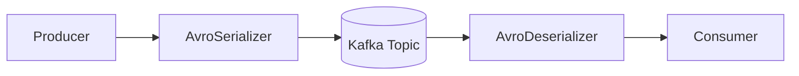

# Apache Avro 스키마는 무엇인가요?

# Apache Avro 스키마는 무엇인가요?

* toc
{:toc}

---

## Apache Avro 스키마란?

Kafka를 공부하다 보면 JSON과 함께 자주 등장하는 기술이 있다.

바로 Apache Avro이다.

Avro는 데이터를 효율적으로 저장하고 전송하기 위한 직렬화(Serialization) 시스템이며, Kafka와 같은 분산 시스템에서 많이 사용된다.

특히 대용량 메시지를 처리하는 환경에서는 JSON보다 훨씬 작은 크기와 빠른 성능을 제공하기 때문에 실무에서도 널리 활용되고 있다.

---

## Apache Avro란?

Apache Avro는 Apache에서 만든 데이터 직렬화 시스템이다.

직렬화란 객체를 네트워크로 전송하거나 파일에 저장할 수 있는 형태로 변환하는 과정을 의미한다.

예를 들어 다음 객체가 있다고 가정해보자.

```java
User user = new User(1, "yunsik");
```

JSON으로 표현하면 다음과 같다.

```json
{
  "id": 1,
  "name": "yunsik"
}
```

Avro는 이 데이터를 바이너리 형태로 직렬화하여 저장하거나 전송한다.

따라서 JSON보다 훨씬 작은 크기로 데이터를 표현할 수 있다.

---

## 왜 Avro를 사용할까?

JSON은 사람이 읽기 쉽다는 장점이 있다.

하지만 대용량 메시지를 처리하는 환경에서는 몇 가지 단점이 존재한다.

* 데이터 크기가 크다.
* 타입 정보가 부족하다.
* 스키마 관리가 어렵다.
* 버전 관리가 어렵다.

Avro는 이러한 문제를 해결하기 위해 등장했다.

대표적인 장점은 다음과 같다.

* 작은 데이터 크기
* 빠른 직렬화 및 역직렬화
* 스키마 관리 가능
* 버전 호환성 지원
* 다양한 언어 지원

Avro는 JSON 기반의 스키마를 먼저 정의하고, 실제 데이터는 바이너리 형태로 저장한다.

---

## Avro의 주요 특징

### 스키마 중심 구조

Avro는 데이터를 저장하기 전에 스키마를 먼저 정의한다.

```json
{
  "type": "record",
  "name": "User",
  "fields": [
    {
      "name": "id",
      "type": "int"
    },
    {
      "name": "name",
      "type": "string"
    }
  ]
}
```

이 스키마를 기준으로 데이터를 직렬화한다.

---

### 바이너리 직렬화

Avro는 데이터를 사람이 읽는 JSON 형태가 아니라 바이너리 형태로 저장한다.

```text
JSON
→ 크기가 큼

Avro
→ 크기가 작음
```

따라서 네트워크 비용과 저장 공간을 절약할 수 있다.

---

### 스키마 진화 지원

Avro는 기존 스키마를 변경하더라도 이전 데이터와의 호환성을 유지할 수 있다.

예를 들어:

기존 스키마

```json
{
  "name": "User",
  "fields": [
    {
      "name": "name",
      "type": "string"
    }
  ]
}
```

새로운 스키마

```json
{
  "name": "User",
  "fields": [
    {
      "name": "name",
      "type": "string"
    },
    {
      "name": "age",
      "type": "int",
      "default": 0
    }
  ]
}
```

기존 Consumer가 깨지지 않는다.

---

## Kafka와 Avro

Kafka에서는 Producer와 Consumer 사이에서 Avro를 많이 사용한다.



Producer는 객체를 Avro 형태로 직렬화하고, Consumer는 이를 다시 객체로 변환한다.

---

## 기본 타입 (Primitive Types)

Avro는 다양한 기본 타입을 제공한다.

| 타입      | 설명         |
| ------- | ---------- |
| null    | 값 없음       |
| boolean | true/false |
| int     | 32비트 정수    |
| long    | 64비트 정수    |
| float   | 실수         |
| double  | 큰 실수       |
| bytes   | 바이너리       |
| string  | 문자열        |

예시:

```json
{
  "name": "string",
  "age": "int"
}
```

---

## Record 타입

Record는 Avro에서 가장 많이 사용하는 타입이다.

Java 객체와 매우 유사하다.

```json
{
  "type": "record",
  "name": "User",
  "fields": [
    {
      "name": "id",
      "type": "int"
    },
    {
      "name": "name",
      "type": "string"
    }
  ]
}
```

Java로 표현하면:

```java
public class User {

    private Integer id;

    private String name;
}
```

---

## Enum 타입

Enum은 미리 정의된 값 중 하나만 사용할 수 있다.

```json
{
  "type": "enum",
  "name": "Color",
  "symbols": [
    "RED",
    "GREEN",
    "BLUE"
  ]
}
```

Java:

```java
public enum Color {
    RED,
    GREEN,
    BLUE
}
```

---

## Array 타입

동일한 타입의 데이터를 여러 개 저장할 수 있다.

```json
{
  "type": "array",
  "items": "string"
}
```

Java:

```java
List<String>
```

---

## Map 타입

Key-Value 형태의 데이터를 저장한다.

```json
{
  "type": "map",
  "values": "string"
}
```

Java:

```java
Map<String, String>
```

---

## Union 타입

Union은 여러 타입 중 하나를 허용한다.

```json
[
  "null",
  "string"
]
```

다음과 같은 의미를 가진다.

```java
String name;
```

값이 없을 수도 있기 때문에 실무에서는 Optional 개념처럼 많이 사용된다.

예:

```json
{
  "name": "age",
  "type": [
    "null",
    "int"
  ]
}
```

---

## Logical Type

Avro는 기본 타입만 제공한다.

하지만 날짜와 시간 같은 데이터는 Logical Type을 사용하여 표현할 수 있다.

---

### date

```json
{
  "type": "int",
  "logicalType": "date"
}
```

Java:

```java
LocalDate
```

---

### timestamp-millis

```json
{
  "type": "long",
  "logicalType": "timestamp-millis"
}
```

Java:

```java
Instant
LocalDateTime
```

---

### decimal

```json
{
  "type": "bytes",
  "logicalType": "decimal",
  "precision": 10,
  "scale": 2
}
```

Java:

```java
BigDecimal
```

금액 데이터를 표현할 때 많이 사용한다.

---

## Record 예제

### User 스키마

```json
{
  "type": "record",
  "name": "User",
  "fields": [
    {
      "name": "id",
      "type": "int"
    },
    {
      "name": "name",
      "type": "string"
    },
    {
      "name": "age",
      "type": [
        "null",
        "int"
      ],
      "default": null
    }
  ]
}
```

age는 없어도 되는 필드이다.

---

## Array와 Map 예제

```json
{
  "type": "record",
  "name": "Product",
  "fields": [
    {
      "name": "tags",
      "type": {
        "type": "array",
        "items": "string"
      }
    },
    {
      "name": "metadata",
      "type": {
        "type": "map",
        "values": "string"
      }
    }
  ]
}
```

이 구조는 상품 태그나 추가 속성을 저장할 때 많이 사용된다.

---

## Logical Type 예제

```json
{
  "type": "record",
  "name": "Event",
  "fields": [
    {
      "name": "timestamp",
      "type": {
        "type": "long",
        "logicalType": "timestamp-millis"
      }
    },
    {
      "name": "price",
      "type": {
        "type": "bytes",
        "logicalType": "decimal",
        "precision": 10,
        "scale": 2
      }
    }
  ]
}
```

시간과 금액을 표현하는 대표적인 예제이다.

---

## JSON과 Avro 비교

| 항목        | JSON | Avro  |
| --------- | ---- | ----- |
| 사람이 읽기 쉬움 | O    | X     |
| 데이터 크기    | 큼    | 작음    |
| 직렬화 속도    | 느림   | 빠름    |
| 스키마 관리    | 어려움  | 가능    |
| 버전 관리     | 어려움  | 쉬움    |
| Kafka 활용  | 보통   | 매우 많음 |

---

## 실무에서 Avro를 사용하는 이유

실무에서는 다음과 같은 이유로 Avro를 많이 사용한다.

* 대용량 메시지 처리
* 네트워크 비용 절감
* 스키마 버전 관리
* Consumer 호환성 유지
* 다중 언어 지원

특히 Kafka와 Schema Registry를 함께 사용하는 환경에서는 거의 표준처럼 사용된다.

---

## 정리

Apache Avro는 스키마 기반의 데이터 직렬화 시스템이다.

JSON보다 작은 크기와 빠른 성능을 제공하며, 스키마 진화를 지원하여 Kafka와 같은 메시징 시스템에서 많이 사용된다.

특히 대규모 이벤트 시스템에서는 데이터 호환성과 성능을 동시에 확보할 수 있기 때문에 실무에서도 매우 많이 활용된다.

---

### 한 줄 요약

Apache Avro는 스키마 기반의 데이터 직렬화 포맷으로, 작은 데이터 크기와 빠른 처리 속도, 그리고 스키마 진화를 지원하여 Kafka 환경에서 널리 사용된다.

