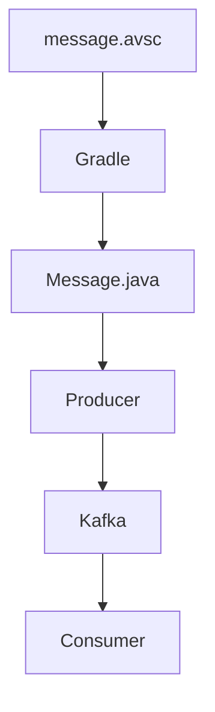

# Spring Boot에서 Avro 설치하기

# Spring Boot에서 Avro 설치하기

* toc
{:toc}

---

## Spring Boot에서 Avro 설치하기

앞서 Apache Avro가 무엇인지 살펴보았다.

이번에는 Spring Boot 프로젝트에서 Avro를 실제로 적용해본다.

최종적으로 다음 과정을 수행하게 된다.

1. Avro 라이브러리 추가
2. Avro Plugin 설정
3. Schema 파일 작성
4. Java 코드 자동 생성

이를 통해 DTO를 직접 작성하지 않고 Avro 스키마로부터 Java 클래스를 생성할 수 있다.

---

## Avro를 사용하는 이유

일반적으로 Kafka 메시지를 전송할 때는 DTO를 직접 작성한다.

```java
public class Message {

    private Integer id;

    private String message;
}
```

하지만 서비스가 커지면 다음과 같은 문제가 발생한다.

* Producer와 Consumer DTO 불일치
* 버전 관리 어려움
* 타입 관리 문제
* 중복 코드 증가

Avro는 스키마를 기준으로 Java 코드를 생성하기 때문에 이러한 문제를 해결할 수 있다.

---

## build.gradle 설정

먼저 Avro Plugin을 추가한다.

```gradle
plugins {
    id 'org.springframework.boot'

    id 'com.github.davidmc24.gradle.plugin.avro'
            version '1.9.1'
}
```

Avro Plugin은 `.avsc` 파일을 읽어 Java 코드를 자동 생성해준다.

---

## Spring Boot 메인 클래스 지정

```gradle
springBoot {
    mainClass.set(
        'com.example.KafkaApplication'
    )
}
```

Spring Boot의 시작 클래스를 지정한다.

---

## bootJar 설정

```gradle
bootJar {
    archiveFileName =
            'service-kafka.jar'
}
```

빌드 결과물 이름을 지정한다.

빌드 후 생성되는 파일:

```text
service-kafka.jar
```

---

## Avro Java 코드 생성 설정

```gradle
generateAvroJava {

    source(
        "src/main/resources/avro"
    )

    include("**/*.avsc")
}
```

이 설정은 다음 의미를 가진다.

```text
resources/avro
↓
.avsc 파일 검색
↓
Java 코드 생성
```

Spring Boot 빌드 시 자동으로 실행된다.

---

## Confluent Repository 추가

Avro Serializer를 사용하기 위해 Confluent Repository를 추가한다.

```gradle
repositories {

    mavenCentral()

    maven {
        url "https://packages.confluent.io/maven/"
    }
}
```

Confluent는 Kafka를 만드는 회사이며, Avro Serializer를 제공한다.

---

## 의존성 추가

```gradle
dependencies {

    implementation 'org.springframework.kafka:spring-kafka'

    implementation 'io.confluent:kafka-avro-serializer:7.8.0'

    implementation 'org.apache.avro:avro:1.12.0'
}
```

---

### Spring Kafka

```gradle
implementation 'org.springframework.kafka:spring-kafka'
```

Kafka 연동을 위한 라이브러리이다.

---

### Kafka Avro Serializer

```gradle
implementation 'io.confluent:kafka-avro-serializer:7.8.0'
```

Avro 객체를 Kafka 메시지로 직렬화한다.

---

### Apache Avro

```gradle
implementation 'org.apache.avro:avro:1.12.0'
```

Avro 스키마를 처리하기 위한 라이브러리이다.

---

## Gradle 동기화

build.gradle을 수정했다면 반드시 Gradle Reload를 수행해야 한다.

IntelliJ에서는 우측 Gradle 탭의 새로고침 버튼을 누른다.

```text
build.gradle 수정
↓
Gradle Reload
↓
Dependency Download
```

이 과정을 수행하지 않으면 Avro Plugin이 동작하지 않는다.

---

## avro 폴더 생성

다음 위치에 avro 디렉터리를 생성한다.

```text
src
 └── main
      └── resources
            └── avro
```

프로젝트 구조:

```text
resources
 ├── application.yml
 └── avro
```

이 폴더에 스키마 파일을 작성한다.

---

## message.avsc 생성

resources/avro 폴더 안에 다음 파일을 만든다.

```text
message.avsc
```

---

## Message 스키마 작성

```json
{
  "type": "record",
  "name": "Message",
  "namespace": "com.example.kafka",
  "fields": [
    {
      "name": "id",
      "type": "int"
    },
    {
      "name": "message",
      "type": "string"
    }
  ]
}
```

이 스키마는 다음 Java 객체를 의미한다.

```java
public class Message {

    private Integer id;

    private String message;
}
```

Avro는 이 스키마를 기준으로 Java 클래스를 자동 생성한다.

---

## namespace란?

```json
"namespace": "com.example.kafka"
```

생성될 Java 클래스의 패키지를 의미한다.

결과:

```text
com.example.kafka.Message
```

---

## fields란?

```json
"fields": [
    {
        "name": "id",
        "type": "int"
    }
]
```

객체의 필드를 정의한다.

Java:

```java
private Integer id;
```

와 동일하다.

---

## IntelliJ Avro Plugin 설치

IntelliJ는 기본적으로 avsc 파일을 지원하지 않는다.

Avro Plugin을 설치하면:

* 문법 강조
* 자동 포맷
* 코드 지원

기능을 사용할 수 있다.

---

## 빌드 실행

이제 프로젝트를 빌드한다.

```bash
./gradlew build
```

또는

```bash
./gradlew generateAvroJava
```

를 실행한다.

---

## Java 코드 자동 생성

빌드가 완료되면 다음 위치에 Java 코드가 생성된다.

```text
build
 └── generated-main-avro-java
      └── com.example.kafka
            └── Message.java
```

이 클래스는 Avro Plugin이 자동 생성한 코드이다.

---

## 생성된 Message 클래스

자동 생성된 클래스는 다음 기능을 포함한다.

* getter
* setter
* builder
* schema 정보
* serialization
* deserialization

직접 DTO를 작성하지 않아도 된다.

---

## 전체 흐름



---

## 왜 Java 클래스를 자동 생성할까?

장점은 매우 많다.

### 타입 안정성

컴파일 시점에 오류 확인 가능

---

### Producer와 Consumer 일치

동일한 스키마 사용

---

### 버전 관리

Schema Evolution 지원

---

### 중복 코드 제거

DTO 직접 작성 불필요

---

## 실무에서 사용하는 구조

실무에서는 다음과 같은 구조를 많이 사용한다.

```text
schema
 ├── user.avsc
 ├── order.avsc
 ├── payment.avsc
 └── notification.avsc
```

각 이벤트별 스키마를 정의한다.

Producer와 Consumer는 동일한 스키마를 사용한다.

---

## 정리

Spring Boot에서는 Avro Plugin을 사용하여 스키마 파일로부터 Java 코드를 자동 생성할 수 있다.

이를 통해 Producer와 Consumer가 동일한 데이터 구조를 사용할 수 있으며, 타입 안정성과 버전 관리 문제를 해결할 수 있다.

Kafka 기반 이벤트 시스템에서는 Avro를 활용하여 더욱 안정적인 메시지 구조를 구성할 수 있다.

---

### 한 줄 요약

Spring Boot에서 Avro를 적용하면 `.avsc` 스키마 파일로부터 Java 클래스를 자동 생성할 수 있으며, 이를 통해 Kafka 메시지의 타입 안정성과 스키마 관리가 가능해진다.


