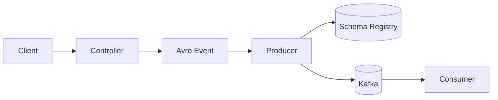
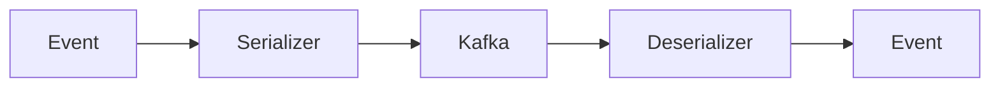

# Kafka에 적용하고 사용해보기

# Kafka에 적용하고 사용해보기

* toc
{:toc}

---


## Kafka에 Avro 적용해보기

앞에서 Avro 스키마를 만들고 Java 클래스를 자동 생성해보았다.

이번에는 실제 Kafka Producer와 Consumer에 Avro를 적용해본다.

지금까지는 String 메시지를 사용했다.

```java
kafkaTemplate.send(topic, jsonMessage);
```

하지만 이번부터는 Avro Event 객체를 직접 Kafka로 전송한다.

최종 구조는 다음과 같다.



---

## 기존 방식과 Avro 방식 비교

### 기존 String 방식

```text
DTO
↓
JSON 변환
↓
String 전송
↓
Consumer JSON 파싱
```

---

### Avro 방식

```text
Event 객체
↓
Avro Serializer
↓
Kafka
↓
Avro Deserializer
↓
Event 객체
```

Producer와 Consumer가 동일한 타입을 사용할 수 있다.

---

## 왜 설정을 변경해야 할까?

기존 설정은 String Serializer를 사용했다.

```java
StringSerializer
StringDeserializer
```

하지만 Avro를 사용하려면 다음으로 변경해야 한다.

```java
KafkaAvroSerializer
KafkaAvroDeserializer
```

즉:

```text
String
↓
Avro Event
```

로 데이터 타입이 바뀌는 것이다.

---

## Consumer 설정 변경

### KafkaConsumerConfig

```java
@EnableKafka
@Configuration
public class KafkaConsumerConfig {

    @Bean
    public ConsumerFactory<String, Event> consumerFactory() {

        Map<String, Object> config = new HashMap<>();

        config.put(
            ConsumerConfig.BOOTSTRAP_SERVERS_CONFIG,
            "localhost:10000"
        );

        config.put(
            ConsumerConfig.KEY_DESERIALIZER_CLASS_CONFIG,
            StringDeserializer.class
        );

        config.put(
            ConsumerConfig.VALUE_DESERIALIZER_CLASS_CONFIG,
            KafkaAvroDeserializer.class
        );

        config.put(
            "schema.registry.url",
            "http://localhost:8081"
        );

        config.put(
            "specific.avro.reader",
            true
        );

        return new DefaultKafkaConsumerFactory<>(config);
    }
}
```

---

## String 대신 Event 사용

가장 중요한 변화는 이것이다.

기존:

```java
ConsumerFactory<String, String>
```

변경:

```java
ConsumerFactory<String, Event>
```

Consumer가 더 이상 String을 받지 않는다.

Avro Event 객체를 직접 받게 된다.

---

## KafkaAvroDeserializer

```java
config.put(
    ConsumerConfig.VALUE_DESERIALIZER_CLASS_CONFIG,
    KafkaAvroDeserializer.class
);
```

Consumer가 Kafka 메시지를 Event 객체로 변환한다.

```text
Binary Data
↓
Deserializer
↓
Event Object
```

---

## Schema Registry 설정

```java
config.put(
    "schema.registry.url",
    "http://localhost:8081"
);
```

Schema Registry는 스키마를 관리한다.

Producer와 Consumer가 동일한 스키마를 사용하도록 도와준다.

---

## specific.avro.reader

```java
config.put(
    "specific.avro.reader",
    true
);
```

설정 의미:

```text
GenericRecord
X

SpecificRecord
O
```

즉 자동 생성된 Event 클래스를 사용하겠다는 의미이다.

---

## Listener Factory 설정

```java
@Bean
public ConcurrentKafkaListenerContainerFactory<
        String,
        Event
        > kafkaListenerContainerFactory() {

    ConcurrentKafkaListenerContainerFactory<
            String,
            Event> factory =
            new ConcurrentKafkaListenerContainerFactory<>();

    factory.setConsumerFactory(
            consumerFactory()
    );

    return factory;
}
```

Listener 역시 Event 타입으로 변경된다.

---

## Producer 설정 변경

### KafkaProducerConfig

```java
@EnableKafka
@Configuration
public class KafkaProducerConfig {

    @Bean
    public ProducerFactory<String, Event> producerFactory() {

        Map<String, Object> config = new HashMap<>();

        config.put(
                ProducerConfig.BOOTSTRAP_SERVERS_CONFIG,
                "localhost:10000"
        );

        config.put(
                ProducerConfig.KEY_SERIALIZER_CLASS_CONFIG,
                StringSerializer.class
        );

        config.put(
                ProducerConfig.VALUE_SERIALIZER_CLASS_CONFIG,
                KafkaAvroSerializer.class
        );

        config.put(
                "schema.registry.url",
                "http://localhost:8081"
        );

        return new DefaultKafkaProducerFactory<>(config);
    }

    @Bean
    public KafkaTemplate<String, Event> kafkaTemplate() {
        return new KafkaTemplate<>(producerFactory());
    }
}
```

---

## KafkaAvroSerializer

```java
KafkaAvroSerializer.class
```

Event 객체를 바이너리 Avro 데이터로 변환한다.

```text
Event
↓
Serializer
↓
Binary Message
```

---

## KafkaTemplate 변경

기존:

```java
KafkaTemplate<String, String>
```

변경:

```java
KafkaTemplate<String, Event>
```

String 대신 Event 객체를 전송한다.

---

## Topic 생성

```java
@Bean
public List<NewTopic> topics() {

    return Arrays.asList(

        new NewTopic(
                "topic",
                1,
                (short) 1
        ),

        new NewTopic(
                "topic-a",
                1,
                (short) 1
        ),

        new NewTopic(
                "topic-b",
                1,
                (short) 1
        )
    );
}
```

애플리케이션 시작 시 여러 Topic을 생성할 수 있다.

---

## Producer 수정

```java
@Service
@Slf4j
public class KafkaProducer {

    private final KafkaTemplate<String, Event>
            kafkaTemplate;

    public KafkaProducer(
            KafkaTemplate<String, Event> kafkaTemplate
    ) {
        this.kafkaTemplate = kafkaTemplate;
    }

    public void sendMessage(
            String topic,
            Event message
    ) {

        CompletableFuture<
                SendResult<String, Event>
                > future =
                kafkaTemplate.send(
                        topic,
                        message
                );

        log.info(
                "Sending kafka message on topic {}",
                topic
        );

        future.whenComplete(
                (result, ex) -> {

                    if (ex == null) {

                        log.info(
                                "Kafka message successfully sent."
                        );

                    } else {

                        log.error(
                                "Kafka message send failed.",
                                ex
                        );
                    }
                }
        );
    }
}
```

---

## CompletableFuture 사용

Spring Kafka는 비동기 전송을 지원한다.

```java
CompletableFuture<SendResult>
```

를 사용하면:

* 전송 성공
* 전송 실패

를 비동기로 확인할 수 있다.

---

## Consumer 수정

```java
@Service
public class KafkaConsumer {

    @KafkaListener(
            topics = "topic",
            groupId = "my-group",
            containerFactory =
                    "kafkaListenerContainerFactory"
    )
    public void listen(
            ConsumerRecord<String, Event> event
    ) {

        System.out.println(
                "Consumed message : "
                        + event.value()
        );
    }
}
```

---

## String → Event

기존:

```java
ConsumerRecord<String, String>
```

변경:

```java
ConsumerRecord<String, Event>
```

이제 Consumer가 Event 객체를 직접 받는다.

---

## Controller 수정

```java
@PostMapping("/send/{topic}")
public String sendMessage(
        @PathVariable String topic,
        @RequestBody Event message
) {

    kafkaProducer.sendMessage(
            topic,
            message
    );

    return "Message sent : "
            + message;
}
```

---

## Event 객체 직접 사용

기존:

```text
JSON
↓
ObjectMapper
↓
String
```

이 과정이 사라진다.

Spring이 Event 객체를 생성한다.

---

## Postman 테스트

요청:

```http
POST http://localhost:8080/api/kafka/send/topic
```

Body:

```json
{
  "id": 1,
  "message": "I'm Avro"
}
```

전송이 완료되면 응답을 확인할 수 있다.

---

## Consumer 로그

```text
Consumed message:

{
    "id": 1,
    "message": "I'm Avro"
}
```

이는 다음 의미를 가진다.

```text
Event 객체
↓
Avro 직렬화
↓
Kafka 저장
↓
Avro 역직렬화
↓
Event 객체
```

정상적으로 동작한 것이다.

---

## 전체 흐름



---

## String 방식과 Avro 방식 비교

| 항목           | String | Avro  |
| ------------ | ------ | ----- |
| 데이터 크기       | 큼      | 작음    |
| 타입 안정성       | 없음     | 있음    |
| 스키마 관리       | 어려움    | 가능    |
| 직렬화 속도       | 보통     | 빠름    |
| Consumer DTO | 직접 생성  | 자동 생성 |
| 실무 사용        | 보통     | 매우 많음 |

---

## 정리

이번에는 Spring Boot Kafka에 Avro를 적용해보았다.

String 기반 메시지 대신 Event 객체를 직접 Producer와 Consumer가 주고받도록 변경했다.

KafkaAvroSerializer와 KafkaAvroDeserializer를 적용하여 직렬화와 역직렬화를 수행했으며, Schema Registry를 통해 스키마를 관리할 수 있는 기반도 마련했다.

이제 Kafka는 단순 문자열 전송 시스템이 아니라 타입 안정성과 버전 관리가 가능한 이벤트 플랫폼으로 발전하게 된다.

---

### 한 줄 요약

Kafka에 Avro를 적용하면 Producer와 Consumer가 Event 객체를 직접 주고받을 수 있으며, 타입 안정성과 스키마 관리가 가능한 이벤트 기반 시스템을 구축할 수 있다.

