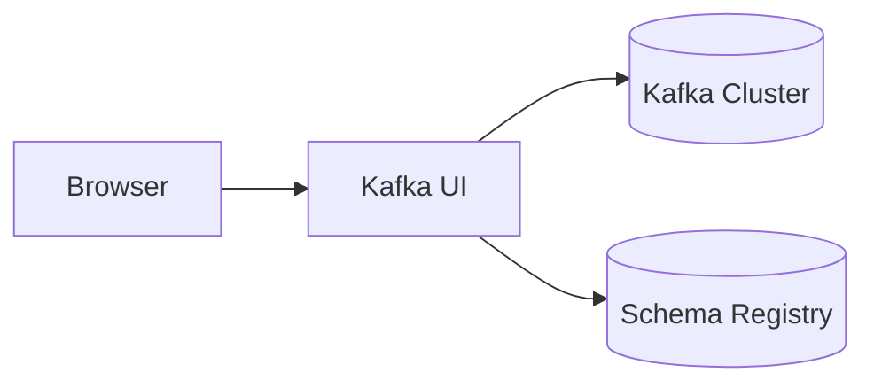
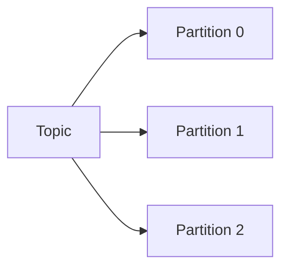
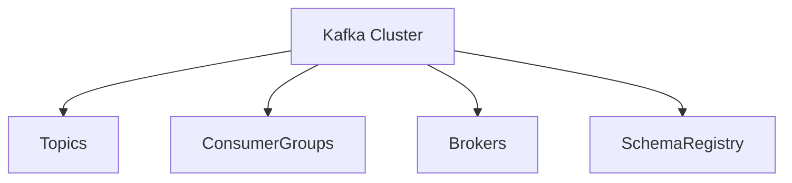

# Kafka UI 설치하기

# Kafka UI 설치하기

* toc
{:toc}

---

## Kafka UI 설치하기

지금까지 Kafka는 CLI(Command Line Interface)를 이용하여 Topic을 생성하고 메시지를 조회하거나 Consumer Group을 확인했다.

CLI는 강력한 기능을 제공하지만 명령어를 모두 기억해야 하고, 현재 클러스터 상태를 한눈에 확인하기 어렵다는 단점이 있다.

이러한 불편함을 해결하기 위해 많이 사용하는 도구가 **Kafka UI**이다.

Kafka UI는 웹 브라우저에서 Kafka Cluster를 관리할 수 있는 오픈소스 도구로, Topic, Consumer Group, Schema Registry 등을 시각적으로 확인하고 관리할 수 있다.

---

## Kafka UI란?

Kafka UI는 Apache Kafka Cluster를 웹 브라우저에서 관리할 수 있도록 제공하는 관리 도구이다.

CLI 대신 웹 화면에서 Kafka의 주요 리소스를 확인할 수 있으며, 운영 환경에서도 많이 활용된다.

기본적으로 다음과 같은 기능을 제공한다.

* Topic 조회 및 관리
* 메시지 조회
* Consumer Group 관리
* Schema Registry 연동
* Cluster 상태 모니터링



Kafka UI는 Kafka Cluster와 Schema Registry 정보를 조회하여 웹 화면으로 보여준다.

---

## Kafka UI를 사용하는 이유

CLI만 사용해도 Kafka를 운영할 수 있지만, 규모가 커질수록 관리가 어려워진다.

예를 들어 Topic 목록을 확인하려면 다음과 같은 명령어를 실행해야 한다.

```bash
kafka-topics.sh \
  --list \
  --bootstrap-server localhost:9092
```

반면 Kafka UI에서는 브라우저에서 Topic 목록을 바로 확인할 수 있다.

또한 메시지 조회, Consumer Lag 확인, Partition 상태 확인 등을 클릭만으로 수행할 수 있어 운영 효율이 크게 향상된다.

---

## Kafka UI의 주요 기능

### Topic 관리

Kafka UI에서는 Topic을 생성, 수정, 삭제할 수 있다.

또한 각 Topic의 Partition 개수와 Replica 상태도 함께 확인할 수 있다.



운영 중인 Topic의 구조를 시각적으로 확인할 수 있다는 것이 큰 장점이다.

---

### 메시지 조회

CLI에서는 Consumer를 실행해야 메시지를 확인할 수 있다.

Kafka UI에서는 Topic을 선택하면 저장된 메시지를 바로 조회할 수 있다.

확인 가능한 정보는 다음과 같다.

* Key
* Value
* Offset
* Partition
* Timestamp

메시지 디버깅이 훨씬 편리해진다.

---

### Consumer Group 관리

Kafka UI는 Consumer Group 상태도 보여준다.

대표적으로 다음 정보를 확인할 수 있다.

* Consumer Group 목록
* Consumer 개수
* Partition 할당 상태
* Lag

Consumer Lag은 아직 처리하지 못한 메시지 수를 의미하며 Kafka 운영에서 가장 중요한 지표 중 하나이다.

---

### Schema Registry 연동

Kafka UI는 Schema Registry와 연동할 수 있다.

이를 통해 다음 작업을 수행할 수 있다.

* Avro Schema 조회
* Schema 등록
* 버전 관리
* 호환성 확인

Avro 기반 이벤트 시스템을 운영할 때 매우 유용하다.

---

### Cluster 상태 확인

Kafka UI에서는 Broker 상태를 실시간으로 확인할 수 있다.

확인 가능한 항목은 다음과 같다.

* Broker 목록
* Leader Partition
* Replica 상태
* Cluster 메타데이터

Cluster 장애를 빠르게 확인할 수 있다.

---

## 대표적인 Kafka UI 도구

Kafka를 관리하기 위한 다양한 UI 도구가 존재한다.

| 도구                   | 특징                    |
| -------------------- | --------------------- |
| Conduktor            | 상용, 다양한 관리 기능 제공      |
| AKHQ                 | 오픈소스, 설치가 간단함         |
| Kafdrop              | 경량화된 UI               |
| Lenses.io            | 데이터 분석 기능 제공          |
| Kafka UI (Provectus) | 오픈소스, 기능이 풍부하고 사용이 쉬움 |

이번 글에서는 **Provectus Kafka UI**를 사용한다.

---

## Kafka UI 설치하기

Kafka UI는 Docker Compose로 매우 쉽게 실행할 수 있다.

```yaml
services:

  kafka-ui:

    image: provectuslabs/kafka-ui:latest

    container_name: kafka-ui

    restart: unless-stopped

    ports:
      - "9000:8080"

    environment:

      - KAFKA_CLUSTERS_0_NAME=Local-Kraft-Cluster

      - KAFKA_CLUSTERS_0_BOOTSTRAPSERVERS=kafka00:9092,kafka01:9092,kafka02:9092

      - KAFKA_CLUSTERS_0_SCHEMAREGISTRY=http://schema-registry:8081

      - DYNAMIC_CONFIG_ENABLED=true

      - KAFKA_CLUSTERS_0_AUDIT_TOPICAUDITENABLED=true

      - KAFKA_CLUSTERS_0_AUDIT_CONSOLEAUDITENABLED=true

    depends_on:

      - kafka00
      - kafka01
      - kafka02
      - schema-registry

    networks:

      - my_network
```

Docker Compose에 위 설정을 추가하면 Kafka UI 컨테이너가 함께 실행된다.

---

## 주요 설정 살펴보기

### Kafka Cluster 연결

```yaml
KAFKA_CLUSTERS_0_BOOTSTRAPSERVERS=
kafka00:9092,
kafka01:9092,
kafka02:9092
```

Kafka UI가 연결할 Kafka Broker 정보를 설정한다.

---

### Schema Registry 연결

```yaml
KAFKA_CLUSTERS_0_SCHEMAREGISTRY=
http://schema-registry:8081
```

Schema Registry를 연결하면 Avro Schema를 UI에서 관리할 수 있다.

---

### Audit 기능

```yaml
KAFKA_CLUSTERS_0_AUDIT_TOPICAUDITENABLED=true
```

Topic 변경 이력을 기록한다.

```yaml
KAFKA_CLUSTERS_0_AUDIT_CONSOLEAUDITENABLED=true
```

Kafka UI 콘솔 이벤트를 기록한다.

운영 환경에서 감사(Audit) 로그를 남길 때 유용하다.

---

## Kafka UI 실행

Docker Compose를 실행한다.

```bash
docker-compose up -d
```

정상적으로 실행되면 Kafka UI 컨테이너가 생성된다.

확인 명령어는 다음과 같다.

```bash
docker ps
```

예시 결과

```text
kafka00

kafka01

kafka02

schema-registry

kafka-ui
```

모든 컨테이너가 Running 상태여야 한다.

---

## Kafka UI 접속

브라우저에서 다음 주소로 접속한다.

```text
http://localhost:9000
```

정상적으로 실행되면 Kafka UI 메인 화면이 나타난다.

---

## Kafka UI에서 확인할 수 있는 정보

Kafka UI 메인 화면에서는 다음 항목을 확인할 수 있다.



각 메뉴를 통해 Kafka Cluster의 주요 리소스를 쉽게 관리할 수 있다.

---

## Topic 확인하기

Topics 메뉴에서는 다음 정보를 확인할 수 있다.

* Topic 이름
* Partition 개수
* Replica 개수
* 메시지 개수

Topic을 선택하면 저장된 메시지까지 조회할 수 있다.

---

## Consumer Group 확인하기

Consumer Groups 메뉴에서는 다음 정보를 확인할 수 있다.

* Group 이름
* Consumer 수
* Partition 할당 상태
* Lag

Lag가 증가한다면 Consumer 처리 속도가 Producer보다 느리다는 의미이다.

---

## Schema 확인하기

Schema Registry가 연결되어 있다면 Schema 메뉴에서 다음 작업을 수행할 수 있다.

* Avro Schema 조회
* 버전 확인
* 호환성 확인
* Schema 등록

---

## Kafka UI의 장점

Kafka UI를 사용하면 CLI보다 훨씬 쉽게 Kafka를 관리할 수 있다.

대표적인 장점은 다음과 같다.

* Topic 관리
* 메시지 조회
* Consumer Group 모니터링
* Lag 확인
* Schema Registry 연동
* Cluster 상태 확인

운영 환경에서도 가장 많이 사용하는 Kafka 관리 도구 중 하나이다.

---

## 정리

Kafka UI는 Kafka Cluster를 웹 브라우저에서 관리할 수 있도록 제공하는 오픈소스 도구이다.

Docker Compose만으로 간단하게 설치할 수 있으며, Topic 관리, 메시지 조회, Consumer Group 모니터링, Schema Registry 연동 등 다양한 기능을 제공한다.

CLI만으로는 확인하기 어려운 Kafka Cluster의 상태를 한눈에 확인할 수 있기 때문에 개발뿐 아니라 운영 환경에서도 매우 유용하게 활용된다.

---

### 한 줄 요약

Kafka UI는 Kafka Cluster를 웹에서 관리할 수 있는 오픈소스 도구로, Topic 관리, 메시지 조회, Consumer Group 모니터링, Schema Registry 연동 등을 손쉽게 수행할 수 있다.
