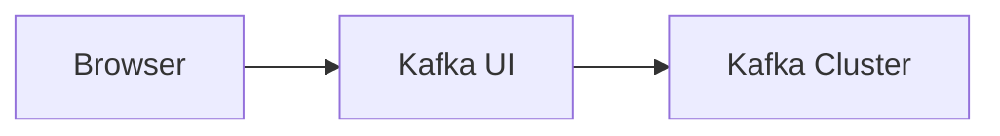
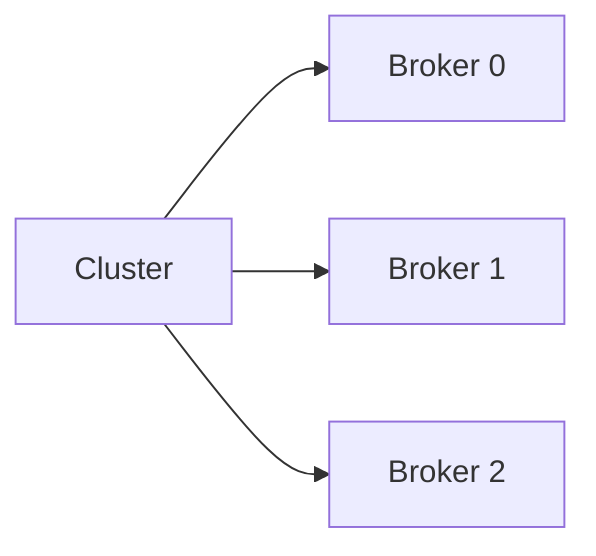
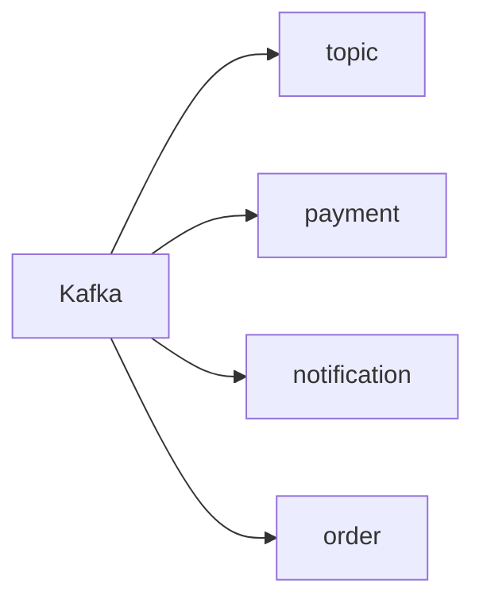
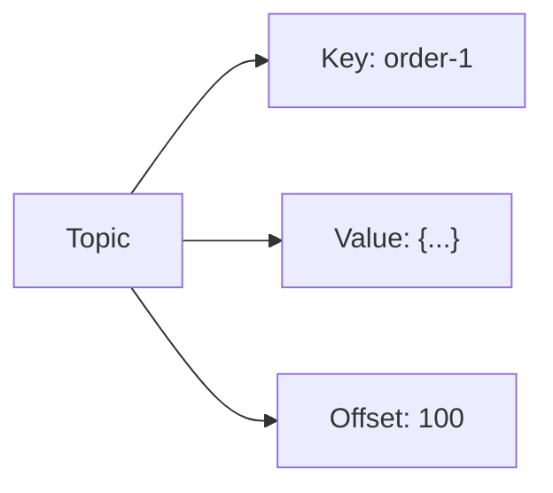
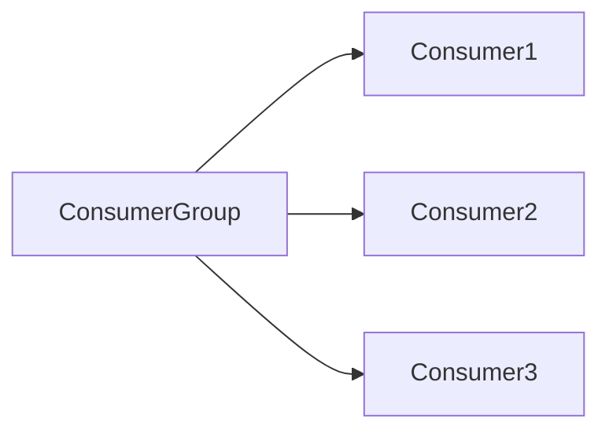
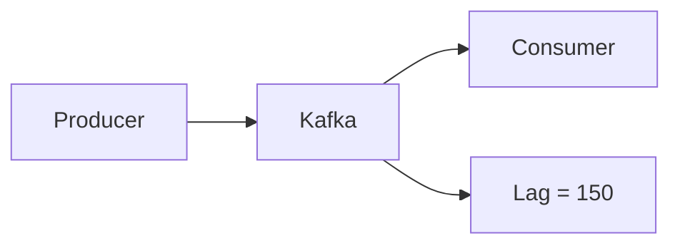

# Kafka UI 사용해보기

# Kafka UI 사용해보기

* toc
{:toc}

---

## Kafka UI 사용해보기

앞에서 Docker Compose를 이용하여 Kafka UI를 설치했다.

이번에는 Kafka UI에 접속하여 Kafka Cluster를 관리하는 방법을 살펴보자.

Kafka UI는 Topic 생성부터 메시지 조회, Consumer Group 상태 확인, Schema Registry 관리까지 다양한 기능을 제공한다.

운영 환경에서는 CLI보다 Kafka UI를 사용하는 경우가 많으며, 장애 분석과 모니터링에도 매우 유용하다.

---

## Kafka UI 접속하기

Docker Compose로 Kafka UI를 실행했다면 브라우저에서 다음 주소로 접속한다.

```text
http://localhost:9000
```

접속이 완료되면 등록된 Kafka Cluster 목록을 확인할 수 있다.



여기서 클러스터를 선택하면 Broker, Topic, Consumer Group, Schema Registry 등 다양한 정보를 확인할 수 있다.

---

## Kafka Cluster 화면

Kafka UI에 접속하면 가장 먼저 Kafka Cluster 화면이 나타난다.

이 화면에서는 현재 연결된 Kafka Cluster의 전체 상태를 확인할 수 있다.

대표적으로 다음 정보를 확인할 수 있다.

* Broker 개수
* Topic 개수
* Consumer Group 개수
* Cluster 상태

Kafka Cluster의 전반적인 상태를 한눈에 파악할 수 있는 메인 화면이다.

---

## Brokers 메뉴

왼쪽 메뉴에서 **Brokers**를 선택하면 Kafka Broker 정보를 확인할 수 있다.



각 Broker의 상태와 역할을 쉽게 확인할 수 있다.

---

## Brokers에서 확인할 수 있는 정보

Broker 화면에서는 다음 정보를 확인할 수 있다.

* Broker ID
* Host
* Partition 개수
* Replica 상태
* Leader Partition

Broker 장애가 발생했을 때 가장 먼저 확인하는 화면이기도 하다.

특히 Leader와 Replica 상태를 통해 특정 Broker에 문제가 있는지 빠르게 파악할 수 있다.

---

## Broker 상세 정보

Broker를 클릭하면 더욱 상세한 정보를 확인할 수 있다.

대표적으로 다음 항목을 조회할 수 있다.

* Broker 설정(Configuration)
* 로그 저장 위치(Log Directory)
* Metrics
* Replica 상태

운영 환경에서는 Metrics 화면을 통해 Broker의 상태를 모니터링하는 경우가 많다.

---

## Topics 메뉴

Kafka에서 가장 많이 사용하는 메뉴가 **Topics**이다.

Topics 메뉴에서는 Kafka Cluster에 생성된 모든 Topic을 확인할 수 있다.



Spring Boot나 Kafka Streams 등이 생성한 Topic도 함께 확인할 수 있다.

---

## Topic 목록 확인

Topics 화면에서는 다음 정보를 확인할 수 있다.

* Topic 이름
* Partition 개수
* Replication Factor
* Message Count

운영 중인 Topic의 상태를 한눈에 확인할 수 있으며, 메시지가 정상적으로 적재되고 있는지도 쉽게 확인할 수 있다.

---

## Topic 상세 화면

특정 Topic을 클릭하면 상세 정보를 확인할 수 있다.

대표적으로 다음 항목을 제공한다.

* Partition 정보
* Replication 정보
* Message Count
* Topic 설정(Configuration)

또한 Topic의 메시지를 직접 조회하거나 테스트 메시지를 발행할 수도 있다.

---

## 메시지 조회

Kafka UI에서는 Topic에 저장된 메시지를 직접 확인할 수 있다.

확인 가능한 정보는 다음과 같다.

* Key
* Value
* Offset
* Partition
* Timestamp



CLI를 사용할 필요 없이 웹 화면에서 메시지를 조회할 수 있어 디버깅이 매우 편리하다.

---

## Statistics 화면

Topic 상세 화면에는 **Statistics** 메뉴도 제공된다.

Statistics에서는 Topic의 주요 통계 정보를 확인할 수 있다.

예를 들어 다음과 같은 정보를 조회할 수 있다.

* 메시지 증가 추이
* Partition 분포
* Replica 상태
* Topic 분석 정보

운영 중인 Topic의 상태를 분석하는 데 유용하다.

---

## Kafka UI에서 메시지 발행하기

Kafka UI는 Producer 역할도 수행할 수 있다.

즉, UI에서 직접 메시지를 Topic으로 전송할 수 있다.

예를 들어 테스트 메시지를 다음과 같이 입력할 수 있다.

```json
{
  "id": 1,
  "message": "Hello Kafka"
}
```

메시지를 전송한 후 Consumer 로그를 확인하면 정상적으로 수신되는 것을 확인할 수 있다.

---

## Consumers 메뉴

Consumers 메뉴에서는 Consumer Group 상태를 확인할 수 있다.



운영 환경에서는 Consumer 상태를 가장 자주 확인하는 메뉴 중 하나이다.

---

## Consumer Group 정보

Consumer Group 화면에서는 다음 정보를 확인할 수 있다.

* Consumer Group 이름
* Consumer 개수
* Offset
* Partition 할당 상태
* Consumer Lag

Consumer가 정상적으로 메시지를 처리하고 있는지 쉽게 확인할 수 있다.

---

## Consumer Lag 확인

Kafka 운영에서 가장 중요한 지표 중 하나가 **Consumer Lag**이다.

Lag는 Producer가 발행한 메시지 중 Consumer가 아직 처리하지 못한 메시지 수를 의미한다.



Lag가 계속 증가한다면 Consumer 처리 속도가 Producer보다 느리다는 의미이다.

이 경우 Consumer 성능 개선이나 인스턴스 확장이 필요할 수 있다.

---

## Schema Registry 메뉴

Kafka UI는 Schema Registry와도 연동할 수 있다.

Schema Registry 메뉴에서는 등록된 Avro Schema를 확인할 수 있다.

대표적으로 다음 작업을 수행할 수 있다.

* Schema 조회
* Schema 버전 확인
* Schema 수정
* 호환성 확인

Avro 기반 이벤트 시스템에서는 자주 사용하는 기능이다.

---

## Kafka UI를 활용한 운영

실무에서는 Kafka UI를 다음과 같은 상황에서 자주 사용한다.

* Topic 생성 여부 확인
* 메시지 조회 및 디버깅
* Consumer Lag 확인
* Broker 장애 확인
* Schema Registry 관리
* Partition 상태 확인

CLI보다 훨씬 직관적이기 때문에 운영 효율을 크게 높일 수 있다.

---

## Kafka UI와 CLI 비교

| 항목                | CLI | Kafka UI |
| ----------------- | --- | -------- |
| Topic 관리          | 가능  | 가능       |
| 메시지 조회            | 가능  | 가능       |
| Consumer Group 확인 | 가능  | 가능       |
| Broker 상태 확인      | 가능  | 가능       |
| 사용 편의성            | 낮음  | 매우 높음    |
| 운영 모니터링           | 불편  | 편리       |

CLI는 세밀한 제어가 가능하지만, Kafka UI는 운영자가 현재 상태를 빠르게 파악하는 데 강점을 가진다.

---

## 정리

Kafka UI는 Kafka Cluster를 웹 브라우저에서 시각적으로 관리할 수 있는 도구이다.

Broker, Topic, Consumer Group, Schema Registry 등의 정보를 손쉽게 조회할 수 있으며, 메시지 조회와 Consumer Lag 모니터링 같은 운영 기능도 제공한다.

Kafka를 운영하는 환경에서는 CLI와 함께 Kafka UI를 활용하면 더욱 효율적으로 클러스터를 관리할 수 있다.

---

### 한 줄 요약

Kafka UI는 Kafka Cluster의 Broker, Topic, Consumer Group, Schema Registry 등을 웹에서 관리하고 모니터링할 수 있는 도구로, 운영과 디버깅을 훨씬 편리하게 만들어준다.

