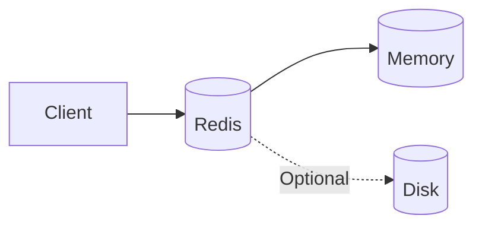
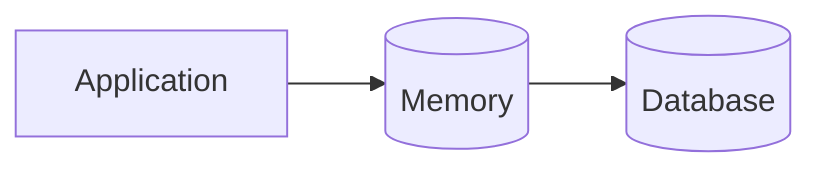
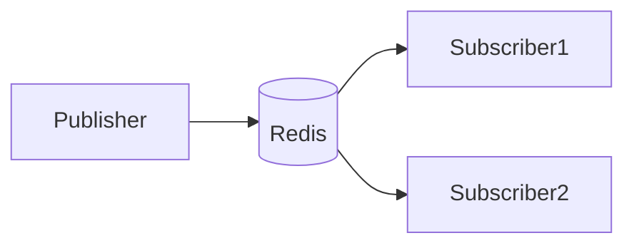
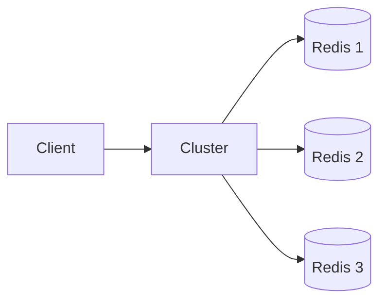
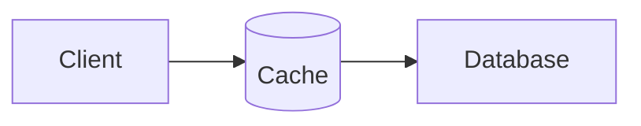

# Redis는 무엇인가요?

# Redis는 무엇인가요?

* toc
{:toc}

---

## Redis란?

애플리케이션을 개발하다 보면 다음과 같은 고민을 자주 하게 된다.

* 자주 조회되는 데이터를 더 빠르게 가져올 수 없을까?
* 로그인 정보를 빠르게 관리할 수 없을까?
* 실시간 순위 기능을 효율적으로 구현할 수 없을까?
* 여러 서버에서 동일한 데이터를 공유할 수 없을까?

이러한 문제를 해결하기 위해 많이 사용하는 기술이 **Redis**이다.

Redis는 메모리를 기반으로 데이터를 저장하는 인메모리(In-Memory) 데이터 저장소로, 매우 빠른 읽기·쓰기 성능을 제공한다. 데이터베이스뿐 아니라 캐시(Cache), 메시지 브로커(Message Broker), 분산 락(Distributed Lock) 등 다양한 용도로 활용된다.

---

## Redis란?

Redis는 **Remote Dictionary Server**의 약자이다.

오픈소스로 개발된 인메모리 데이터 저장소이며, 대부분의 데이터를 메모리에 저장하여 매우 빠르게 처리할 수 있다.

필요한 경우에는 데이터를 디스크에 저장하여 영속성(Persistence)도 지원한다.



일반적인 데이터 조회는 메모리에서 처리하고, 필요에 따라 디스크에도 데이터를 저장할 수 있다.

---

## 왜 Redis를 사용할까?

일반적인 데이터베이스는 디스크를 기반으로 데이터를 저장한다.

디스크는 대용량 데이터를 안정적으로 저장할 수 있지만, 메모리보다 접근 속도가 느리다.

반면 Redis는 데이터를 메모리에 저장하기 때문에 매우 빠른 속도로 데이터를 처리할 수 있다.

```text
Disk Database
↓

수 ms ~ 수십 ms

Redis (Memory)
↓

수 μs ~ 수백 μs
```

자주 조회되는 데이터를 Redis에 저장하면 데이터베이스의 부하를 크게 줄일 수 있다.

---

## Redis의 주요 특징

Redis는 단순한 Key-Value 저장소가 아니다.

다양한 기능을 제공하여 여러 시스템에서 활용되고 있다.

대표적인 특징은 다음과 같다.

* 인메모리 데이터 저장
* 다양한 데이터 구조 지원
* Pub/Sub 기능
* Lua 스크립트 지원
* 클러스터링 지원
* 트랜잭션 지원

---

## 인메모리 데이터 저장

Redis의 가장 큰 특징은 데이터를 메모리에 저장한다는 점이다.



메모리는 디스크보다 훨씬 빠르기 때문에 조회와 저장 속도가 매우 뛰어나다.

이러한 특성 때문에 Redis는 캐시 서버로 가장 많이 사용된다.

---

## 다양한 데이터 구조 지원

Redis는 단순히 문자열(String)만 저장하는 것이 아니라 다양한 자료구조를 지원한다.

| 자료구조       | 설명               |
| ---------- | ---------------- |
| String     | 문자열              |
| List       | 순서가 있는 목록        |
| Set        | 중복 없는 집합         |
| Sorted Set | 정렬 가능한 집합        |
| Hash       | Key-Value 형태의 객체 |

이러한 자료구조를 활용하면 다양한 비즈니스 요구사항을 효율적으로 구현할 수 있다.

---

## String

가장 기본적인 자료구조이다.

```text
Key

↓

"user:1"

↓

Value

↓

"Yunsik"
```

캐시 데이터나 인증 토큰 등을 저장할 때 많이 사용한다.

---

## List

순서가 있는 데이터를 저장하는 자료구조이다.

예를 들어 최근 검색어를 저장할 때 활용할 수 있다.

```text
최근 검색어

↓

Redis

↓

Java
Spring
Redis
Kafka
```

FIFO 또는 LIFO 형태의 큐를 구현할 때도 자주 사용된다.

---

## Set

중복을 허용하지 않는 집합이다.

예를 들어 오늘 로그인한 사용자 목록을 저장한다고 가정해보자.

```text
User A

User B

User C

User A
```

Redis Set에는 User A가 한 번만 저장된다.

---

## Sorted Set

점수(score)를 기준으로 자동 정렬되는 자료구조이다.

게임 랭킹이나 인기 게시글 순위를 구현할 때 자주 사용된다.

```text
1위 Alice

2위 Bob

3위 Charlie
```

Redis가 자동으로 정렬을 관리해준다.

---

## Hash

객체 형태의 데이터를 저장하기 적합한 자료구조이다.

예를 들어 사용자 정보를 저장하면 다음과 같은 구조가 된다.

```text
user:1

name = Yunsik

age = 31

city = Seoul
```

Java 객체와 유사한 형태로 사용할 수 있다.

---

## Pub/Sub 기능

Redis는 Publish / Subscribe 기능도 제공한다.

Publisher가 메시지를 발행하면 Subscriber가 이를 실시간으로 수신할 수 있다.



실시간 알림이나 채팅 시스템을 구현할 때 많이 사용된다.

---

## Lua 스크립트 지원

Redis는 Lua 스크립트를 실행할 수 있다.

여러 명령어를 하나의 스크립트로 실행하여 원자성(Atomicity)을 보장할 수 있다.

예를 들어 다음과 같은 작업을 한 번에 처리할 수 있다.

* 재고 감소
* 재고 확인
* 주문 생성

복잡한 비즈니스 로직을 Redis 내부에서 처리할 수 있다는 장점이 있다.

---

## 분산 처리와 클러스터링

서비스 규모가 커지면 하나의 Redis 서버만으로는 처리하기 어렵다.

Redis Cluster를 사용하면 데이터를 여러 노드에 분산 저장할 수 있다.



이를 통해 확장성과 가용성을 높일 수 있다.

---

## 트랜잭션 지원

Redis도 트랜잭션 기능을 제공한다.

대표적으로 다음 명령어를 사용한다.

```text
MULTI

EXEC
```

`MULTI` 이후의 명령어를 하나의 작업으로 묶고, `EXEC`를 호출하면 순차적으로 실행된다.

이를 통해 여러 명령어를 하나의 트랜잭션처럼 처리할 수 있다.

---

## Redis의 대표적인 활용 사례

Redis는 다양한 분야에서 활용된다.

대표적인 사용 사례는 다음과 같다.

### 캐시(Cache)

가장 많이 사용하는 용도이다.

API 응답이나 자주 조회되는 데이터를 Redis에 저장하여 데이터베이스 조회 횟수를 줄일 수 있다.



---

### 메시지 브로커

Pub/Sub 기능을 활용하여 메시지를 전달할 수 있다.

실시간 알림이나 채팅 시스템에서 많이 사용된다.

---

### 분산 락

여러 서버가 동시에 같은 자원에 접근하지 않도록 제어할 수 있다.

실무에서는 Redisson과 함께 사용하는 경우가 많다.

예를 들어 다음과 같은 상황에서 활용된다.

* 쿠폰 발급
* 재고 차감
* 중복 결제 방지

---

### 리더보드

Sorted Set을 이용하면 게임 순위나 인기 게시글 순위를 쉽게 구현할 수 있다.

```text
1위 Alice

2위 Bob

3위 Charlie
```

점수만 변경하면 Redis가 자동으로 순위를 계산해준다.

---

### 실시간 분석

Redis는 카운팅이나 통계 집계에도 많이 사용된다.

예를 들어 다음과 같은 데이터를 실시간으로 관리할 수 있다.

* 페이지 조회수
* 좋아요 수
* 접속자 수
* API 호출 횟수

메모리 기반이기 때문에 빠른 집계가 가능하다.

---

## Redis를 언제 사용할까?

다음과 같은 상황이라면 Redis를 고려해볼 수 있다.

* 응답 속도를 개선하고 싶을 때
* 데이터베이스 부하를 줄이고 싶을 때
* 실시간 기능이 필요할 때
* 분산 락이 필요할 때
* 순위 기능을 구현해야 할 때

Redis는 단순한 캐시 서버를 넘어 다양한 기능을 제공하는 고성능 데이터 플랫폼으로 활용되고 있다.

---

## 정리

Redis는 메모리를 기반으로 데이터를 저장하는 인메모리 데이터 저장소이다.

빠른 읽기·쓰기 성능을 제공하며, 캐시, 메시지 브로커, 분산 락, 리더보드, 실시간 분석 등 다양한 분야에서 활용된다.

다양한 자료구조와 풍부한 기능을 제공하기 때문에 현대의 백엔드 시스템에서 매우 중요한 역할을 담당하고 있다.

---

### 한 줄 요약

Redis는 메모리를 기반으로 데이터를 저장하는 고성능 인메모리 데이터 저장소로, 캐시, 메시지 브로커, 분산 락, 리더보드 등 다양한 실시간 서비스를 구현하는 데 활용된다.


