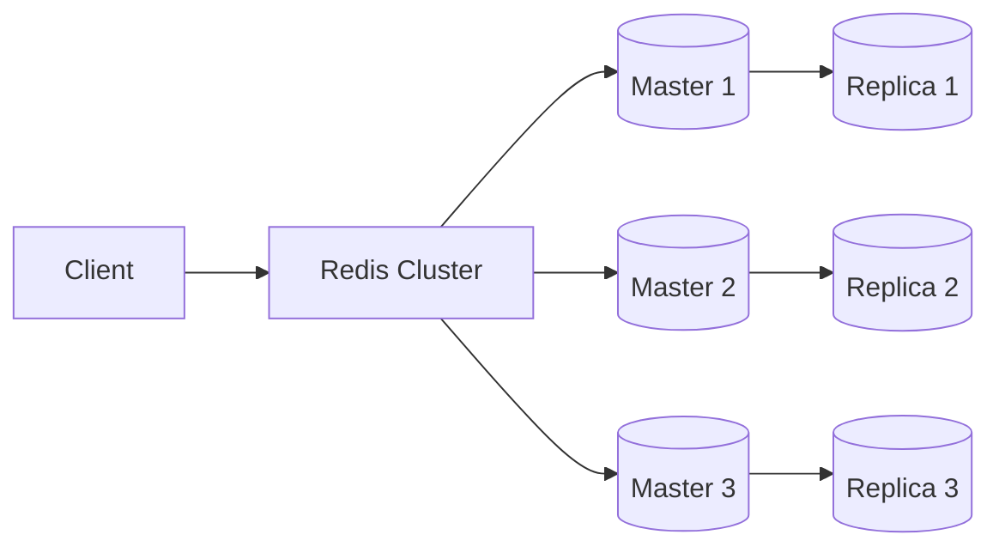
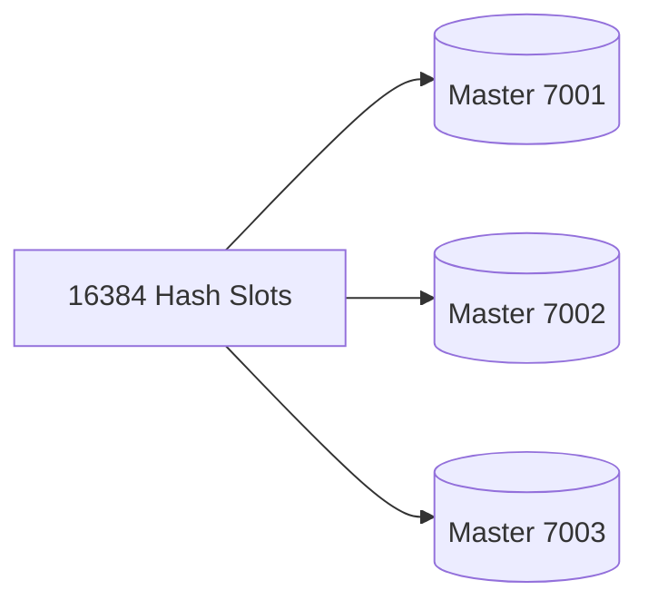

# Redis에 접속해서 명령어 사용해보기

# Redis에 접속해서 명령어 사용해보기

* toc
{:toc}

---


## Redis Cluster 구축 및 기본 명령어 사용하기

앞에서 Redis가 무엇인지와 주요 활용 사례를 살펴보았다.

이번에는 Docker Compose를 이용하여 Redis Cluster를 직접 구축하고, Redis CLI를 통해 서버 상태와 설정을 확인하는 기본 명령어를 실행해본다.

Redis는 단일 서버로도 사용할 수 있지만, 운영 환경에서는 고가용성과 확장성을 위해 Redis Cluster를 구성하는 경우가 많다.

---

## Redis Cluster란?

Redis Cluster는 여러 Redis 노드를 하나의 클러스터로 구성하여 데이터를 분산 저장하는 기능이다.

데이터를 여러 노드에 분산함으로써 처리 성능을 높이고, 일부 노드에 장애가 발생하더라도 서비스를 계속 운영할 수 있다.



이번 실습에서는 **3개의 Master와 3개의 Replica**, 총 6개의 Redis 노드로 Cluster를 구성한다.

---

## Docker Compose 작성하기

Redis Cluster는 Docker Compose를 이용하면 간단하게 실행할 수 있다.

### compose.yml

```yaml
version: "3.9"

services:

  redis-cluster:

    container_name: redis-cluster-6

    image: grokzen/redis-cluster:7.0.15

    environment:
      - IP=0.0.0.0
      - BIND_ADDRESS=0.0.0.0
      - INITIAL_PORT=7001
      - MASTERS=3
      - SLAVES_PER_MASTER=1

    ports:
      - "7001-7006:7001-7006"

    volumes:
      - ./data/redis:/data
      - ./config/redis/0/redis.conf:/redis-conf/7001/redis.conf
      - ./config/redis/1/redis.conf:/redis-conf/7002/redis.conf
      - ./config/redis/2/redis.conf:/redis-conf/7003/redis.conf
      - ./config/redis/3/redis.conf:/redis-conf/7004/redis.conf
      - ./config/redis/4/redis.conf:/redis-conf/7005/redis.conf
      - ./config/redis/5/redis.conf:/redis-conf/7006/redis.conf

networks:

  my_network:

    driver: bridge
```

Docker 이미지는 Cluster 구성을 자동으로 수행하며, 실행과 동시에 6개의 Redis 노드를 생성한다.

---

## 주요 설정 살펴보기

### INITIAL_PORT

```yaml
INITIAL_PORT=7001
```

Redis Cluster가 사용할 첫 번째 포트이다.

이후 노드들은 다음과 같이 생성된다.

```text
7001
7002
7003
7004
7005
7006
```

---

### MASTERS

```yaml
MASTERS=3
```

Master 노드 개수를 의미한다.

이번 실습에서는 Master가 3개 생성된다.

---

### SLAVES_PER_MASTER

```yaml
SLAVES_PER_MASTER=1
```

Master마다 Replica를 하나씩 생성한다.

결과적으로 다음과 같은 구조가 만들어진다.

| Master | Replica |
| ------ | ------- |
| 7001   | 7004    |
| 7002   | 7005    |
| 7003   | 7006    |

---

## redis.conf 작성

각 Redis 노드는 동일한 설정 파일을 사용한다.

```conf
bind 0.0.0.0

port 7001

cluster-enabled yes

cluster-config-file nodes.conf

cluster-node-timeout 5000

appendonly yes

dir /redis-data/7001

protected-mode no
```

주요 설정은 다음과 같다.

| 설정                   | 설명               |
| -------------------- | ---------------- |
| bind                 | 외부 접속 허용         |
| port                 | Redis 실행 포트      |
| cluster-enabled      | Cluster 모드 활성화   |
| cluster-config-file  | Cluster 메타데이터 저장 |
| cluster-node-timeout | 노드 장애 감지 시간      |
| appendonly           | AOF 영속성 사용       |
| dir                  | 데이터 저장 위치        |
| protected-mode       | 보호 모드 비활성화       |

---

## 프로젝트 폴더 구조

Redis 설정 파일은 다음과 같은 구조로 관리한다.

```text
project

├── compose.yml

├── data
│   └── redis

└── config
    └── redis
        ├── 0
        │   └── redis.conf
        ├── 1
        │   └── redis.conf
        ├── 2
        │   └── redis.conf
        ├── 3
        │   └── redis.conf
        ├── 4
        │   └── redis.conf
        └── 5
            └── redis.conf
```

각 노드가 자신의 설정 파일을 사용하도록 Volume을 연결한다.

---

## Redis Cluster 실행

Docker Compose를 실행한다.

```bash
docker-compose up --build -d
```

정상적으로 실행되면 Redis Cluster가 생성된다.

컨테이너 상태를 확인한다.

```bash
docker ps
```

예시

```text
redis-cluster-6
```

Running 상태라면 정상적으로 실행된 것이다.

---

## Redis CLI 접속

Redis CLI를 이용하여 Cluster에 접속한다.

```bash
docker exec -it redis-cluster-6 redis-cli -p 7001
```

또는 특정 호스트와 포트를 직접 지정할 수도 있다.

```bash
redis-cli -h localhost -p 7001
```

Redis 프롬프트가 나타나면 명령어를 입력할 수 있다.

---

## 서버 상태 확인

가장 먼저 Redis 서버가 정상적으로 동작하는지 확인해보자.

```bash
PING
```

정상적으로 실행 중이라면 다음과 같은 결과가 출력된다.

```text
PONG
```

Redis 서버가 정상적으로 응답하고 있다는 의미이다.

---

## 서버 정보 확인

Redis 서버의 다양한 정보를 확인할 수 있다.

```bash
INFO
```

실행하면 다음과 같은 정보가 출력된다.

* Redis 버전
* 실행 시간(Uptime)
* 메모리 사용량
* CPU 사용량
* 연결된 클라이언트 수
* Cluster 정보

INFO 명령어는 Redis 서버를 운영할 때 가장 많이 사용하는 명령어 중 하나이다.

---

## 설정 값 조회

현재 Redis 설정을 조회할 수 있다.

예를 들어 최대 메모리 설정을 확인하려면 다음 명령어를 사용한다.

```bash
CONFIG GET maxmemory
```

출력 예시

```text
1) "maxmemory"

2) "0"
```

`0`은 메모리 제한이 설정되지 않았다는 의미이다.

---

## 설정 값 변경

Redis는 실행 중에도 일부 설정을 변경할 수 있다.

예를 들어 최대 메모리를 512MB로 변경하려면 다음 명령어를 실행한다.

```bash
CONFIG SET maxmemory 512mb
```

변경 후 다시 조회하면 적용된 값을 확인할 수 있다.

```bash
CONFIG GET maxmemory
```

운영 환경에서는 메모리 사용량을 제어하기 위해 자주 사용하는 설정이다.

---

## Cluster 상태 확인

Redis Cluster의 전체 상태를 확인하는 명령어이다.

```bash
CLUSTER INFO
```

출력 예시는 다음과 같다.

```text
cluster_state:ok

cluster_slots_assigned:16384

cluster_known_nodes:6

cluster_size:3
```

각 항목의 의미는 다음과 같다.

| 항목                     | 설명                |
| ---------------------- | ----------------- |
| cluster_state          | Cluster 상태        |
| cluster_slots_assigned | 할당된 Slot 개수       |
| cluster_known_nodes    | Cluster에 등록된 노드 수 |
| cluster_size           | Master 노드 개수      |

정상적인 Cluster라면 `cluster_state:ok`가 출력된다.

---

## Redis Cluster 구조 이해하기

Redis Cluster는 데이터를 **16384개의 Hash Slot**으로 나누어 관리한다.

각 Master 노드가 일부 Slot을 담당하며, 데이터는 Slot 기준으로 저장된다.



Client는 Key를 기준으로 Hash Slot을 계산한 뒤, 해당 Slot을 담당하는 Master 노드에 데이터를 저장한다.

---

## 자주 사용하는 Redis 관리 명령어

| 명령어          | 설명            |
| ------------ | ------------- |
| PING         | 서버 상태 확인      |
| INFO         | 서버 정보 조회      |
| CONFIG GET   | 설정 조회         |
| CONFIG SET   | 설정 변경         |
| CLUSTER INFO | Cluster 상태 조회 |

이 명령어들은 Redis를 운영하거나 장애를 점검할 때 가장 많이 사용된다.

---

## 정리

이번에는 Docker Compose를 이용하여 Redis Cluster를 구성하고, Redis CLI를 사용하여 서버와 Cluster 상태를 확인해보았다.

또한 `PING`, `INFO`, `CONFIG GET`, `CONFIG SET`, `CLUSTER INFO`와 같은 기본 명령어를 통해 Redis 서버의 상태와 설정을 확인하는 방법도 살펴보았다.

Redis를 운영할 때는 이러한 기본 명령어를 익혀두면 서버 상태를 빠르게 점검하고 문제를 진단하는 데 큰 도움이 된다.

---

### 한 줄 요약

Docker Compose를 이용하면 Redis Cluster를 손쉽게 구성할 수 있으며, Redis CLI의 `PING`, `INFO`, `CONFIG`, `CLUSTER INFO` 명령어를 통해 서버와 클러스터의 상태를 효율적으로 관리할 수 있다.
