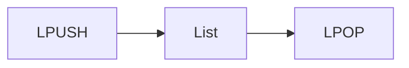
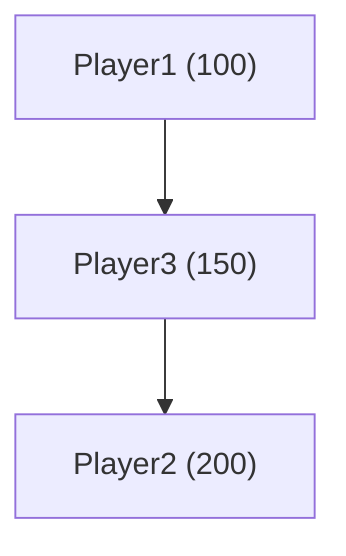
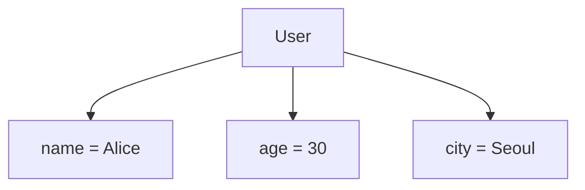

# 자료형을 알아보고 직접 만들어보기

# 자료형을 알아보고 직접 만들어보기

* toc
{:toc}

---

## Redis 자료구조 알아보기

Redis는 단순한 Key-Value 저장소가 아니다.

문자열(String)뿐만 아니라 List, Set, Sorted Set, Hash, Stream, Geospatial, HyperLogLog, Bloom Filter 등 다양한 자료구조를 제공한다.

이러한 자료구조를 활용하면 별도의 복잡한 로직 없이도 캐시, 랭킹 시스템, 메시지 큐, 실시간 이벤트 처리 등 다양한 기능을 효율적으로 구현할 수 있다.

---

## Redis 자료구조 한눈에 보기

Redis에서 제공하는 대표적인 자료구조는 다음과 같다.

| 자료구조         | 주요 활용 사례      |
| ------------ | ------------- |
| String       | 캐시, 카운터       |
| Bitmap       | 로그인 여부, 출석 체크 |
| List         | Queue, 메시지 큐  |
| Set          | 중복 제거         |
| Sorted Set   | 랭킹 시스템        |
| Hash         | 객체 저장         |
| Stream       | 이벤트 로그        |
| Geospatial   | 위치 기반 서비스     |
| HyperLogLog  | 방문자 수 집계      |
| Bloom Filter | 존재 여부 검사      |

각 자료구조는 목적에 따라 최적화되어 있으므로 상황에 맞게 선택하는 것이 중요하다.

---

## String

String은 Redis에서 가장 기본이 되는 자료구조이다.

문자열뿐 아니라 숫자도 저장할 수 있으며, 캐시나 카운터를 구현할 때 가장 많이 사용된다.

### 주요 명령어

| 명령어  | 설명   |
| ---- | ---- |
| SET  | 값 저장 |
| GET  | 값 조회 |
| INCR | 값 증가 |
| DECR | 값 감소 |

---

### 문자열 저장

```bash
SET name "Redis"

GET name
```

결과

```text
"Redis"
```

---

### 숫자 증가

```bash
SET counter 100

INCR counter
```

결과

```text
101
```

방문자 수, 조회 수와 같은 카운터 기능을 구현할 때 많이 사용된다.

---

## Bitmap

Bitmap은 문자열을 비트(Bit) 단위로 저장하는 자료구조이다.

1개의 비트만 사용하기 때문에 메모리 사용량이 매우 적다.

대표적으로 다음과 같은 기능을 구현할 때 활용된다.

* 로그인 여부
* 출석 체크
* 이벤트 참여 여부
* 사용자 활성 상태

---

### 주요 명령어

| 명령어      | 설명          |
| -------- | ----------- |
| SETBIT   | 비트 설정       |
| GETBIT   | 비트 조회       |
| BITCOUNT | 1인 비트 개수 조회 |

---

### 로그인 여부 저장

```bash
SETBIT user:login:20240101 1 1

SETBIT user:login:20240101 5 1

GETBIT user:login:20240101 1
```

결과

```text
1
```

사용자 1번은 로그인한 상태라는 의미이다.

---

### 로그인한 사용자 수 확인

```bash
BITCOUNT user:login:20240101
```

결과

```text
2
```

로그인한 사용자가 2명이라는 의미이다.

---

## List

List는 순서가 있는 문자열 목록을 저장하는 자료구조이다.

삽입과 삭제가 매우 빠르며 Queue나 Stack을 구현할 때 자주 사용된다.



---

### 주요 명령어

| 명령어    | 설명      |
| ------ | ------- |
| LPUSH  | 왼쪽에 추가  |
| RPUSH  | 오른쪽에 추가 |
| LPOP   | 왼쪽 제거   |
| LRANGE | 범위 조회   |

---

### Queue 구현

```bash
LPUSH queue "Task1"

LPUSH queue "Task2"

LRANGE queue 0 -1
```

결과

```text
Task2

Task1
```

---

### 데이터 꺼내기

```bash
LPOP queue
```

결과

```text
Task2
```

대기열이나 작업 큐(Task Queue)를 구현할 때 많이 활용된다.

---

## Set

Set은 중복을 허용하지 않는 집합이다.

같은 데이터를 여러 번 저장해도 한 번만 저장된다.

대표적인 활용 사례는 다음과 같다.

* 중복 회원 제거
* 태그 관리
* 친구 목록
* 좋아요 목록

---

### 주요 명령어

| 명령어      | 설명    |
| -------- | ----- |
| SADD     | 요소 추가 |
| SREM     | 요소 삭제 |
| SMEMBERS | 전체 조회 |
| SUNION   | 합집합   |

---

### 중복 제거

```bash
SADD unique:users "User1"

SADD unique:users "User1"

SMEMBERS unique:users
```

결과

```text
User1
```

동일한 데이터는 한 번만 저장된다.

---

### 요소 삭제

```bash
SREM unique:users "User1"
```

---

### 전체 조회

```bash
SMEMBERS unique:users
```

결과

```text
(empty)
```

Set은 중복을 제거해야 하는 상황에서 매우 유용하다.

---

## Sorted Set

Sorted Set은 점수(Score)를 기준으로 자동 정렬되는 자료구조이다.

게임 랭킹이나 인기 게시글처럼 순위가 필요한 기능을 구현할 때 가장 많이 사용된다.



---

### 주요 명령어

| 명령어     | 설명     |
| ------- | ------ |
| ZADD    | 데이터 추가 |
| ZRANGE  | 순위 조회  |
| ZINCRBY | 점수 증가  |
| ZRANK   | 순위 조회  |

---

### 리더보드 생성

```bash
ZADD leaderboard 100 "player1"

ZADD leaderboard 200 "player2"

ZADD leaderboard 150 "player3"
```

---

### 순위 조회

```bash
ZRANGE leaderboard 0 -1 WITHSCORES
```

결과

```text
player1

player3

player2
```

---

### 점수 증가

```bash
ZINCRBY leaderboard 50 "player1"
```

---

### 순위 확인

```bash
ZRANK leaderboard "player1"
```

실시간 랭킹 시스템 구현 시 가장 많이 사용되는 자료구조이다.

---

## Hash

Hash는 필드(Field)-값(Value) 형태로 데이터를 저장하는 자료구조이다.

객체(Object)를 저장하기에 적합하며 JSON과 유사한 구조를 가진다.



---

### 주요 명령어

| 명령어     | 설명    |
| ------- | ----- |
| HSET    | 필드 저장 |
| HGET    | 필드 조회 |
| HGETALL | 전체 조회 |
| HDEL    | 필드 삭제 |

---

### 사용자 정보 저장

```bash
HSET user:1001 name "Alice" age "30" city "Seoul"
```

---

### 이름 조회

```bash
HGET user:1001 name
```

결과

```text
Alice
```

---

### 필드 삭제

```bash
HDEL user:1001 city
```

---

### 전체 조회

```bash
HGETALL user:1001
```

Hash는 사용자 정보나 상품 정보처럼 하나의 객체를 저장할 때 가장 많이 활용된다.

---

## Stream

Stream은 시간 순서대로 데이터를 저장하는 로그 기반 자료구조이다.

Kafka와 비슷하게 이벤트를 저장하고 소비할 수 있으며, 실시간 이벤트 처리에 적합하다.

---

### 주요 명령어

| 명령어    | 설명     |
| ------ | ------ |
| XADD   | 이벤트 추가 |
| XRANGE | 이벤트 조회 |
| XREAD  | 이벤트 읽기 |

---

### 이벤트 저장

```bash
XADD mystream * sensor 25
```

---

### 이벤트 조회

```bash
XRANGE mystream - +
```

시간순으로 이벤트를 조회할 수 있다.

실시간 로그나 이벤트 저장에 활용된다.

---

## Geospatial

Geospatial은 위도와 경도를 저장하고 위치 기반 검색을 수행하는 자료구조이다.

배달 서비스나 지도 서비스에서 많이 사용된다.

---

### 주요 명령어

| 명령어       | 설명    |
| --------- | ----- |
| GEOADD    | 위치 저장 |
| GEODIST   | 거리 계산 |
| GEORADIUS | 반경 검색 |

---

### 위치 저장

```bash
GEOADD locations 13.361389 38.115556 "Palermo"

GEOADD locations 15.087269 37.502669 "Catania"
```

---

### 거리 계산

```bash
GEODIST locations Palermo Catania km
```

결과

```text
약 166km
```

사용자 주변 매장 검색 등에 활용된다.

---

## HyperLogLog

HyperLogLog는 **중복을 제거한 개수를 매우 적은 메모리로 근사 계산**하는 자료구조이다.

정확한 개수보다 메모리 절약이 중요한 경우 사용된다.

대표적인 활용 사례는 다음과 같다.

* 방문자 수
* 순 방문자(UV)
* 광고 노출 수

---

### 주요 명령어

| 명령어     | 설명     |
| ------- | ------ |
| PFADD   | 데이터 추가 |
| PFCOUNT | 개수 조회  |

---

### 방문자 수 계산

```bash
PFADD visitors user1

PFADD visitors user2

PFCOUNT visitors
```

결과

```text
2
```

수백만 건의 데이터를 매우 적은 메모리로 계산할 수 있다.

---

## Bloom Filter

Bloom Filter는 **데이터가 존재하는지 매우 빠르게 검사**하는 자료구조이다.

100% 정확하지는 않지만 매우 적은 메모리와 빠른 속도를 제공한다.

주로 다음과 같은 상황에서 사용된다.

* 캐시 존재 여부 확인
* 중복 요청 검사
* 회원 존재 여부 검사

---

### 주요 명령어

| 명령어        | 설명              |
| ---------- | --------------- |
| BF.RESERVE | Bloom Filter 생성 |
| BF.ADD     | 데이터 추가          |
| BF.EXISTS  | 존재 여부 확인        |
| BF.MADD    | 여러 데이터 추가       |

---

### Bloom Filter 생성

```bash
BF.RESERVE myfilter 0.01 10000
```

* 오차율 : 1%
* 최대 데이터 : 10,000개

---

### 데이터 추가

```bash
BF.ADD myfilter "item1"
```

---

### 존재 여부 확인

```bash
BF.EXISTS myfilter "item1"
```

결과

```text
1
```

```bash
BF.EXISTS myfilter "item2"
```

결과

```text
0
```

Bloom Filter는 매우 빠르게 존재 여부를 확인할 수 있어 대용량 시스템에서 자주 활용된다.

---

## 어떤 자료구조를 선택해야 할까?

| 자료구조         | 가장 적합한 활용 사례  |
| ------------ | ------------- |
| String       | 캐시, 카운터       |
| Bitmap       | 로그인 여부, 출석 체크 |
| List         | Queue, 작업 대기열 |
| Set          | 중복 제거         |
| Sorted Set   | 랭킹 시스템        |
| Hash         | 객체 저장         |
| Stream       | 이벤트 처리        |
| Geospatial   | 위치 기반 서비스     |
| HyperLogLog  | 순 방문자 집계      |
| Bloom Filter | 존재 여부 검사      |

---

## 정리

Redis는 단순한 Key-Value 저장소를 넘어 다양한 자료구조를 제공하는 인메모리 데이터 저장소이다.

각 자료구조는 특정 목적에 최적화되어 있으며, 캐시, 큐, 랭킹, 객체 저장, 이벤트 처리, 위치 기반 서비스 등 다양한 기능을 효율적으로 구현할 수 있다.

적절한 자료구조를 선택하면 애플리케이션의 성능과 개발 생산성을 크게 향상시킬 수 있다.

---

### 한 줄 요약

Redis는 String, List, Set, Sorted Set, Hash, Stream, Geospatial, HyperLogLog, Bloom Filter 등 다양한 자료구조를 제공하며, 각 자료구조를 활용해 캐시부터 실시간 이벤트 처리까지 다양한 기능을 효율적으로 구현할 수 있다.


