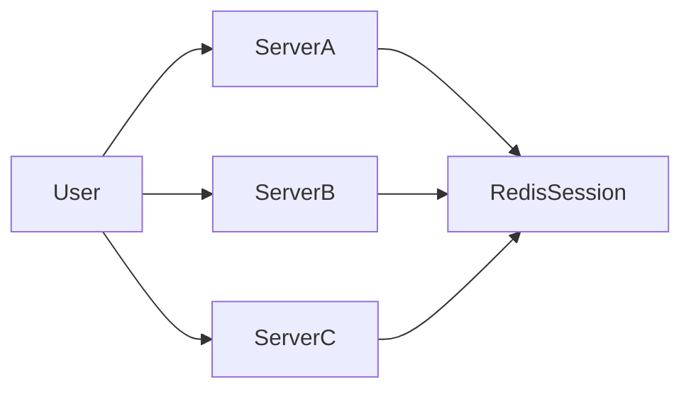
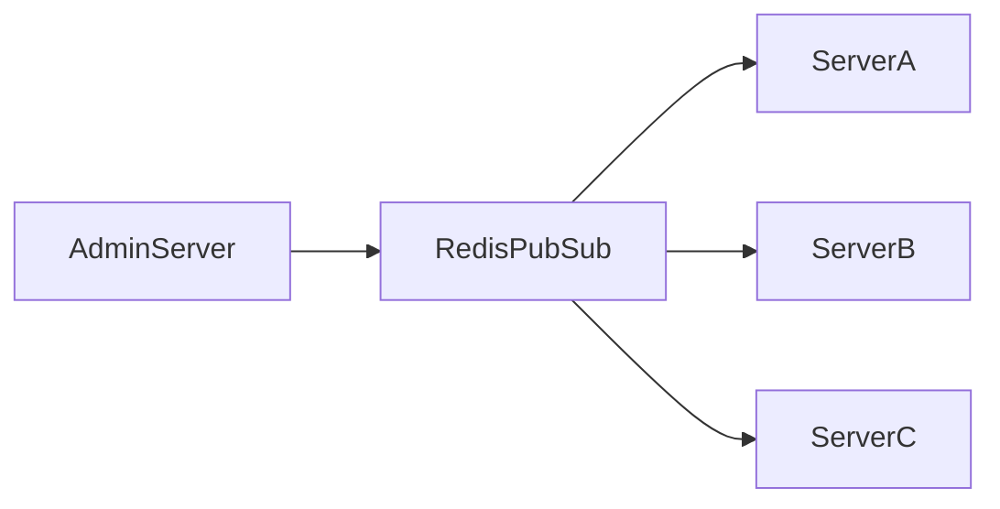
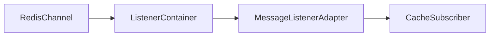
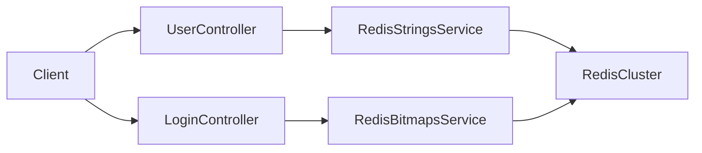
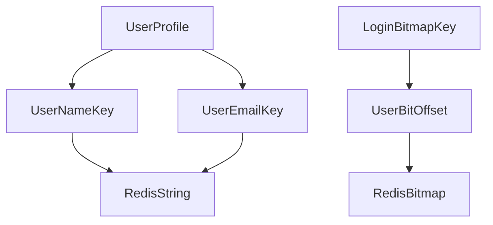

# Strings, Bitmaps 사용해보기

# Strings, Bitmaps 사용해보기

* toc
{:toc}

---

## Redis Strings와 Bitmaps 사용해보기

Redis는 단순한 캐시 저장소가 아니라 다양한 자료구조를 제공하는 인메모리 데이터 저장소이다. 일반적인 Key-Value 저장뿐만 아니라 Strings, Lists, Sets, Hashes, Sorted Sets, Bitmaps 같은 자료구조를 지원한다.

그중 `Strings`는 Redis에서 가장 기본이 되는 자료구조이다. 하나의 Key에 하나의 Value를 저장하는 방식이며, 사용자 이름, 이메일, 인증 코드, 토큰, 캐시 데이터처럼 단순한 값을 저장할 때 많이 사용한다.

`Bitmaps`는 String을 비트 단위로 다루는 기능이다. 로그인 여부, 출석 여부, 이벤트 참여 여부처럼 `true` 또는 `false`로 표현할 수 있는 대량의 상태 데이터를 매우 적은 메모리로 저장할 수 있다.

이번 글에서는 Spring Boot에서 Redis Cluster에 연결하고, `Strings`로 사용자 프로필을 저장하며, `Bitmaps`로 날짜별 로그인 기록을 관리하는 예제를 정리한다.

---

## 개념

Redis `Strings`는 하나의 Key에 하나의 Value를 저장하는 가장 기본적인 자료구조이다.

예를 들어 사용자 정보를 Redis에 저장한다면 다음과 같은 Key를 만들 수 있다.

```text
user:1:name
user:1:email
```

`user:1:name`에는 사용자 이름을 저장하고, `user:1:email`에는 사용자 이메일을 저장한다.

Redis Key는 보통 `:`를 사용해 계층처럼 표현한다. 이렇게 작성하면 Key만 보더라도 어떤 도메인의 어떤 데이터인지 쉽게 파악할 수 있다.

```text
user:{userId}:name
user:{userId}:email
login:{date}
```

Redis `Bitmaps`는 별도의 독립적인 자료구조라기보다는 String 값을 비트 단위로 조작하는 기능이다. 특정 위치의 비트를 `0` 또는 `1`로 저장할 수 있다.

예를 들어 `login:20240101`이라는 Key가 있다고 해보자.

```text
login:20240101
```

여기서 사용자 ID를 비트 위치로 사용하면, 1번 사용자가 로그인했을 때 1번 비트를 `true`로 바꿀 수 있다. 4번 사용자가 로그인했다면 4번 비트를 `true`로 바꾸면 된다.

```text
login:20240101 -> 010010...
```

이 방식은 많은 사용자의 로그인 여부를 하나의 Key 안에 압축해서 저장할 수 있다는 장점이 있다.

---

## 왜 사용하는가?

`Strings`는 가장 단순하고 사용하기 쉬운 Redis 자료구조이다. 단순한 값을 빠르게 저장하고 조회할 수 있기 때문에 Redis를 사용할 때 가장 먼저 접하게 되는 자료구조이기도 하다.

대표적인 사용 사례는 다음과 같다.

| 사용 사례 | 설명 |
|---|---|
| 사용자 정보 저장 | 이름, 이메일, 닉네임 같은 간단한 값 저장 |
| 인증 코드 저장 | 이메일 인증 코드, 휴대폰 인증 코드 저장 |
| 로그인 토큰 저장 | Access Token, Refresh Token 저장 |
| 캐시 데이터 저장 | 자주 조회되는 API 응답 저장 |
| 카운터 관리 | 조회수, 좋아요 수, 요청 횟수 증가 |

예를 들어 사용자 프로필을 매번 데이터베이스에서 조회하면 트래픽이 많아질수록 DB 부하가 커진다. 이때 자주 조회되는 값을 Redis Strings에 저장해두면 응답 속도를 빠르게 만들 수 있다.

`Bitmaps`는 대량의 boolean 상태를 저장할 때 사용한다. 사용자 100만 명의 로그인 여부를 저장한다고 가정해보자. 일반적인 방식으로 사용자마다 boolean 값을 저장하면 많은 Key 또는 데이터 공간이 필요하다.

하지만 Bitmap은 비트 단위로 상태를 저장한다.

```text
100만 bit = 약 125KB
```

즉, 로그인 여부처럼 `했다` 또는 `안 했다`로 표현할 수 있는 데이터는 Bitmap을 사용하면 메모리를 크게 절약할 수 있다.

---

## 주요 특징

`Strings`와 `Bitmaps`는 둘 다 Redis String 기반으로 동작하지만, 사용하는 방식이 다르다.

| 항목 | Strings | Bitmaps |
|---|---|---|
| 저장 단위 | 문자열 값 | 비트 값 |
| 표현 방식 | Key-Value | Key + Offset |
| 대표 데이터 | 이름, 이메일, 토큰, 캐시 | 로그인 여부, 출석 여부, 참여 여부 |
| 주요 명령어 | `SET`, `GET` | `SETBIT`, `GETBIT`, `BITCOUNT` |
| 장점 | 단순하고 범용적이다 | 메모리 효율이 뛰어나다 |
| 단점 | 대량 상태 저장에는 비효율적일 수 있다 | 상세 정보를 함께 저장하기 어렵다 |

Spring Boot에서는 `StringRedisTemplate`을 사용해 Redis Strings를 쉽게 다룰 수 있다.

```java
redisTemplate.opsForValue().set(key, value);
redisTemplate.opsForValue().get(key);
```

Bitmap도 `StringRedisTemplate`의 `opsForValue()`를 통해 사용할 수 있다.

```java
redisTemplate.opsForValue().setBit(key, offset, true);
redisTemplate.opsForValue().getBit(key, offset);
```

여기서 `offset`은 비트 위치이다. 사용자 ID를 offset으로 사용하면 사용자별 상태를 비트 위치에 저장할 수 있다.

전체 로그인 사용자 수처럼 `true`로 설정된 비트 개수를 구하고 싶다면 `BITCOUNT` 명령을 사용한다.

---

## 예제

먼저 Redis와 Spring Boot를 연결하는 설정부터 살펴본다.

```java
package com.example.config;

import com.example.cache.CacheSubscriber;
import org.springframework.context.annotation.Bean;
import org.springframework.context.annotation.Configuration;
import org.springframework.data.redis.connection.RedisClusterConfiguration;
import org.springframework.data.redis.connection.lettuce.LettuceConnectionFactory;
import org.springframework.data.redis.listener.PatternTopic;
import org.springframework.data.redis.listener.RedisMessageListenerContainer;
import org.springframework.data.redis.listener.adapter.MessageListenerAdapter;
import org.springframework.data.redis.core.RedisTemplate;
import org.springframework.session.data.redis.config.annotation.web.http.EnableRedisHttpSession;

@Configuration
@EnableRedisHttpSession
public class RedisConfig {

    @Bean
    public LettuceConnectionFactory redisConnectionFactory() {
        return new LettuceConnectionFactory(new RedisClusterConfiguration()
                .clusterNode("localhost", 7001)
                .clusterNode("localhost", 7002)
                .clusterNode("localhost", 7003)
                .clusterNode("localhost", 7004)
                .clusterNode("localhost", 7005)
                .clusterNode("localhost", 7006));
    }

    @Bean
    public RedisTemplate<String, Object> redisTemplate(
            LettuceConnectionFactory redisConnectionFactory
    ) {
        RedisTemplate<String, Object> redisTemplate = new RedisTemplate<>();
        redisTemplate.setConnectionFactory(redisConnectionFactory);
        return redisTemplate;
    }

    @Bean
    public RedisMessageListenerContainer listenerContainer(
            LettuceConnectionFactory redisConnectionFactory,
            MessageListenerAdapter messageListenerAdapter
    ) {
        RedisMessageListenerContainer container = new RedisMessageListenerContainer();
        container.setConnectionFactory(redisConnectionFactory);
        container.addMessageListener(messageListenerAdapter, new PatternTopic("cache:*"));
        return container;
    }

    @Bean
    public MessageListenerAdapter messageListenerAdapter(CacheSubscriber subscriber) {
        return new MessageListenerAdapter(subscriber);
    }
}
```

이 설정은 Spring Boot 애플리케이션이 Redis와 통신하기 위한 기반을 만든다.

`@Configuration`은 이 클래스가 Spring 설정 클래스라는 의미이다. Spring은 이 클래스를 읽고 내부의 `@Bean` 메서드가 반환하는 객체들을 Spring Bean으로 등록한다.

`@EnableRedisHttpSession`은 HTTP Session을 Redis에 저장할 수 있게 해준다. 일반적으로 세션은 서버 메모리에 저장된다. 하지만 서버가 여러 대로 늘어나면 사용자의 세션이 어느 서버에 저장되어 있는지 문제가 생길 수 있다.

Redis에 세션을 저장하면 여러 서버가 같은 세션 저장소를 공유할 수 있다.



이 구조에서는 사용자가 어떤 서버로 요청을 보내더라도 Redis에서 같은 세션 정보를 조회할 수 있다. 서버를 여러 대 운영하는 환경에서 Redis Session을 사용하는 이유가 여기에 있다.

`LettuceConnectionFactory`는 Spring Boot 애플리케이션과 Redis 사이의 연결을 생성하는 객체이다.

```java
@Bean
public LettuceConnectionFactory redisConnectionFactory() {
    return new LettuceConnectionFactory(new RedisClusterConfiguration()
            .clusterNode("localhost", 7001)
            .clusterNode("localhost", 7002)
            .clusterNode("localhost", 7003)
            .clusterNode("localhost", 7004)
            .clusterNode("localhost", 7005)
            .clusterNode("localhost", 7006));
}
```

Redis 명령을 실행하려면 Redis 서버와 연결을 맺어야 한다. 이 연결 생성과 관리를 담당하는 객체가 `LettuceConnectionFactory`이다.

여기서는 `RedisClusterConfiguration`을 사용한다. Redis Cluster는 데이터를 여러 노드에 나누어 저장하는 구조이기 때문에, 애플리케이션은 클러스터를 구성하는 노드 정보를 알고 있어야 한다.

| 포트 | 역할 예시 |
|---|---|
| 7001 | Master 노드 |
| 7002 | Master 노드 |
| 7003 | Master 노드 |
| 7004 | Replica 노드 |
| 7005 | Replica 노드 |
| 7006 | Replica 노드 |

실제 Redis Cluster에서는 데이터가 hash slot 기준으로 여러 Master 노드에 분산된다. 애플리케이션이 특정 Key를 조회하면 Redis Cluster가 해당 Key가 어느 노드에 있는지 판단하고 요청을 처리한다.

실무에서는 `localhost`를 그대로 쓰지 않는다. Docker Compose 내부 통신이면 서비스 이름을 사용하고, 운영 환경이면 Redis Cluster 엔드포인트나 내부 DNS를 사용한다.

`RedisTemplate`은 Java 코드에서 Redis 명령을 실행할 수 있게 해주는 핵심 도구이다.

```java
@Bean
public RedisTemplate<String, Object> redisTemplate(
        LettuceConnectionFactory redisConnectionFactory
) {
    RedisTemplate<String, Object> redisTemplate = new RedisTemplate<>();
    redisTemplate.setConnectionFactory(redisConnectionFactory);
    return redisTemplate;
}
```

`redisTemplate.setConnectionFactory(redisConnectionFactory)`는 RedisTemplate이 어떤 Redis 연결을 사용할지 지정하는 코드이다. 이 설정이 없으면 RedisTemplate은 Redis 서버에 명령을 보낼 수 없다.

실무에서는 `RedisTemplate<String, Object>`를 사용할 때 직렬화 설정도 함께 지정하는 경우가 많다. 기본 직렬화 방식은 Redis CLI에서 사람이 읽기 어려운 형태로 저장될 수 있기 때문이다.

예를 들어 Key를 문자열로 저장하고 싶다면 `StringRedisSerializer`를 설정하는 방식을 고려할 수 있다.

```java
@Bean
public RedisTemplate<String, Object> redisTemplate(
        LettuceConnectionFactory redisConnectionFactory
) {
    RedisTemplate<String, Object> redisTemplate = new RedisTemplate<>();
    redisTemplate.setConnectionFactory(redisConnectionFactory);

    redisTemplate.setKeySerializer(new StringRedisSerializer());
    redisTemplate.setHashKeySerializer(new StringRedisSerializer());

    redisTemplate.afterPropertiesSet();

    return redisTemplate;
}
```

Key는 운영 중 Redis CLI나 모니터링 도구에서 직접 확인하는 경우가 많기 때문에 문자열 형태로 저장되는 것이 좋다.

문자열 중심 데이터를 다룰 때는 `StringRedisTemplate`을 사용하는 것이 더 단순하다.

| 구분 | RedisTemplate | StringRedisTemplate |
|---|---|---|
| Key 타입 | 주로 String | String |
| Value 타입 | Object 가능 | String |
| 사용 목적 | 객체 저장, 다양한 타입 처리 | 문자열 중심 처리 |
| 설정 난이도 | 직렬화 설정이 필요할 수 있다 | 비교적 간단하다 |

`RedisMessageListenerContainer`는 Redis Pub/Sub 메시지를 수신하기 위한 컨테이너이다.

```java
@Bean
public RedisMessageListenerContainer listenerContainer(
        LettuceConnectionFactory redisConnectionFactory,
        MessageListenerAdapter messageListenerAdapter
) {
    RedisMessageListenerContainer container = new RedisMessageListenerContainer();
    container.setConnectionFactory(redisConnectionFactory);
    container.addMessageListener(messageListenerAdapter, new PatternTopic("cache:*"));
    return container;
}
```

Redis는 데이터를 저장하고 조회하는 기능뿐 아니라 Pub/Sub 기능도 제공한다. 특정 채널에 메시지를 발행하면 해당 채널을 구독하고 있는 애플리케이션이 메시지를 받을 수 있다.

여기서는 `new PatternTopic("cache:*")`를 사용한다. 이 설정은 `cache:`로 시작하는 채널의 메시지를 구독한다는 의미이다.

예를 들어 다음과 같은 채널들이 대상이 될 수 있다.

```text
cache:user
cache:product
cache:order
```

실무에서는 캐시 삭제 이벤트, 설정 변경 이벤트, 간단한 알림 이벤트를 Redis Pub/Sub으로 처리하기도 한다.

예를 들어 상품 정보가 변경되었을 때 여러 서버의 로컬 캐시를 비워야 한다면 `cache:product` 채널로 메시지를 발행하고, 각 서버가 이 메시지를 받아 캐시를 제거할 수 있다.



다만 Redis Pub/Sub은 메시지를 저장하지 않는다. 구독자가 내려가 있는 동안 발행된 메시지는 다시 받을 수 없다. 따라서 캐시 삭제 알림처럼 유실되어도 다시 복구 가능한 이벤트에는 사용할 수 있지만, 주문 생성이나 결제 완료처럼 반드시 처리되어야 하는 이벤트에는 Kafka 같은 메시지 브로커가 더 적합하다.

`MessageListenerAdapter`는 Redis에서 받은 메시지를 실제 처리 객체로 연결해주는 어댑터이다.

```java
@Bean
public MessageListenerAdapter messageListenerAdapter(CacheSubscriber subscriber) {
    return new MessageListenerAdapter(subscriber);
}
```

여기서는 `CacheSubscriber`가 메시지를 처리하는 역할을 한다. Redis Pub/Sub으로 메시지가 들어오면 `MessageListenerAdapter`가 메시지를 `CacheSubscriber`에게 전달한다.



이 구조를 사용하면 Redis 메시지 수신 로직과 실제 비즈니스 처리 로직을 분리할 수 있다.

다음은 사용자 정보를 Redis Strings로 저장하는 서비스이다.

```java
package com.example.redis.services;

import org.springframework.beans.factory.annotation.Autowired;
import org.springframework.data.redis.core.StringRedisTemplate;
import org.springframework.stereotype.Service;

@Service
public class RedisStringsService {

    @Autowired
    private StringRedisTemplate redisTemplate;

    public void saveUserProfile(String userId, String name, String email) {
        redisTemplate.opsForValue().set("user:" + userId + ":name", name);
        redisTemplate.opsForValue().set("user:" + userId + ":email", email);
    }

    public String getUserProfile(String userId) {
        String name = redisTemplate.opsForValue().get("user:" + userId + ":name");
        String email = redisTemplate.opsForValue().get("user:" + userId + ":email");

        return "Name: " + name + ", Email: " + email;
    }
}
```

`saveUserProfile()`은 사용자 ID를 기준으로 이름과 이메일을 각각 다른 Key에 저장한다.

```text
user:1:name
user:1:email
```

이렇게 저장하면 사용자 정보 중 필요한 값을 빠르게 조회할 수 있다.

사용자 정보를 저장하고 조회하는 컨트롤러는 다음과 같다.

```java
package com.example.controllers;

import com.example.redis.services.RedisStringsService;
import org.springframework.beans.factory.annotation.Autowired;
import org.springframework.web.bind.annotation.*;

@RestController
@RequestMapping("/users")
public class UserController {

    @Autowired
    private RedisStringsService redisStringsService;

    @PostMapping("/{id}")
    public String saveUser(
            @PathVariable String id,
            @RequestParam String name,
            @RequestParam String email
    ) {
        redisStringsService.saveUserProfile(id, name, email);
        return "User saved successfully!";
    }

    @GetMapping("/{id}")
    public String getUser(@PathVariable String id) {
        return redisStringsService.getUserProfile(id);
    }
}
```

`POST /users/{id}`는 사용자 ID, 이름, 이메일을 받아 Redis에 저장한다. `GET /users/{id}`는 Redis에서 사용자 이름과 이메일을 조회한다.

로그인 기록을 Redis Bitmaps로 저장하는 서비스는 다음과 같다.

```java
package com.example.redis.services;

import org.springframework.beans.factory.annotation.Autowired;
import org.springframework.data.redis.core.RedisCallback;
import org.springframework.data.redis.core.StringRedisTemplate;
import org.springframework.stereotype.Service;

@Service
public class RedisBitmapsService {

    @Autowired
    private StringRedisTemplate redisTemplate;

    public void setUserLogin(String date, int userId) {
        redisTemplate.opsForValue().setBit("login:" + date, userId, true);
    }

    public boolean isUserLoggedIn(String date, int userId) {
        return Boolean.TRUE.equals(
                redisTemplate.opsForValue().getBit("login:" + date, userId)
        );
    }

    public Long countBits(String key) {
        return redisTemplate.execute((RedisCallback<Long>) connection ->
                connection.stringCommands().bitCount(("login:" + key).getBytes())
        );
    }
}
```

`setUserLogin()`은 특정 날짜에 사용자가 로그인했다는 정보를 저장한다. 예를 들어 `date`가 `20240101`이고 `userId`가 `1`이면 `login:20240101` Key의 1번 비트를 `true`로 바꾼다.

`isUserLoggedIn()`은 특정 사용자가 해당 날짜에 로그인했는지 확인한다.

`countBits()`는 `BITCOUNT` 명령을 실행해 `1`로 설정된 비트 개수를 반환한다. 즉, 해당 날짜에 로그인한 사용자 수를 구할 수 있다.

로그인 API 컨트롤러는 다음과 같다.

```java
package com.example.controllers;

import com.example.redis.services.RedisBitmapsService;
import org.springframework.beans.factory.annotation.Autowired;
import org.springframework.web.bind.annotation.*;

@RestController
@RequestMapping("/logins")
public class LoginController {

    @Autowired
    private RedisBitmapsService redisBitmapsService;

    @PostMapping("/{date}/{userId}")
    public String loginUser(@PathVariable String date, @PathVariable int userId) {
        redisBitmapsService.setUserLogin(date, userId);
        return "User " + userId + " logged in on " + date;
    }

    @GetMapping("/{date}/{userId}")
    public String checkLogin(@PathVariable String date, @PathVariable int userId) {
        boolean loggedIn = redisBitmapsService.isUserLoggedIn(date, userId);
        return "User " + userId + " login status on " + date + ": " + loggedIn;
    }

    @GetMapping("/{date}/total")
    public String getTotalLogins(@PathVariable String date) {
        long totalLogins = redisBitmapsService.countBits(date);
        return "Total logins on " + date + ": " + totalLogins;
    }
}
```

Spring Boot 설정은 다음과 같다.

```yaml
spring:
  datasource:
    url: jdbc:mysql://localhost:3306/test
    username: test
    password: test
    driver-class-name: com.mysql.cj.jdbc.Driver

  jpa:
    hibernate:
      ddl-auto: create-drop
    show-sql: true
    database-platform: org.hibernate.dialect.MySQL8Dialect

  data:
    redis:
      cluster:
        nodes:
          - localhost:7001
          - localhost:7002
          - localhost:7003
          - localhost:7004
          - localhost:7005
          - localhost:7006
      lettuce:
        pool:
          max-active: 8
          max-idle: 8
          min-idle: 0
```

`spring.data.redis.cluster.nodes`는 Redis Cluster 노드 목록이다. 이 값이 있어야 Spring Boot가 Redis Cluster에 연결할 수 있다.

`lettuce.pool.max-active`는 동시에 사용할 수 있는 최대 Redis 커넥션 수이다. 요청이 많은 서비스에서 이 값이 너무 작으면 Redis 요청이 대기할 수 있다.

`lettuce.pool.max-idle`은 사용하지 않는 상태로 풀에 유지할 수 있는 최대 커넥션 수이다. 커넥션을 매번 새로 만들면 비용이 들기 때문에 일정 수의 커넥션을 재사용할 수 있게 유지한다.

`lettuce.pool.min-idle`은 최소 유휴 커넥션 수이다. 트래픽이 갑자기 들어올 때 미리 준비된 커넥션이 있으면 초기 응답 지연을 줄일 수 있다.

| 설정 | 의미 | 실무 관점 |
|---|---|---|
| `cluster.nodes` | Redis Cluster 노드 목록 | 운영에서는 환경별로 분리해야 한다 |
| `max-active` | 최대 활성 커넥션 수 | 트래픽이 많으면 부족하지 않게 조정해야 한다 |
| `max-idle` | 최대 유휴 커넥션 수 | 너무 크면 불필요한 커넥션이 유지된다 |
| `min-idle` | 최소 유휴 커넥션 수 | 갑작스러운 요청에 대비할 수 있다 |

`ddl-auto: create-drop`은 애플리케이션 실행 시 테이블을 만들고 종료 시 삭제할 수 있기 때문에 운영 환경에서는 사용하면 안 된다. 로컬 테스트 환경에서만 사용하는 것이 안전하다.

운영 환경에서는 보통 다음처럼 사용한다.

```yaml
spring:
  jpa:
    hibernate:
      ddl-auto: validate
```

`validate`는 엔티티와 실제 테이블 구조가 맞는지 검증만 수행한다. 운영 데이터가 삭제될 위험이 없기 때문에 더 안전하다.

Gradle 설정은 다음과 같다.

```gradle
springBoot {
    mainClass.set('com.example.RedisApplication')
}

bootJar {
    archiveFileName = 'service-redis.jar'
}

dependencies {
    implementation 'org.springframework.boot:spring-boot-starter-data-jpa'

    runtimeOnly 'com.mysql:mysql-connector-j'

    implementation 'com.github.ben-manes.caffeine:caffeine'

    compileOnly 'org.projectlombok:lombok'
    annotationProcessor 'org.projectlombok:lombok'

    implementation 'org.springframework.boot:spring-boot-starter-data-redis'
    implementation 'io.lettuce:lettuce-core'

    implementation 'org.springframework.session:spring-session-data-redis'

    implementation 'org.redisson:redisson-spring-boot-starter:3.27.0'

    runtimeOnly 'com.h2database:h2'

    developmentOnly 'org.springframework.boot:spring-boot-devtools'

    testImplementation 'org.springframework.boot:spring-boot-starter-test'
}
```

`spring-boot-starter-data-redis`는 Spring Boot에서 Redis를 쉽게 사용할 수 있게 해주는 의존성이다. `lettuce-core`는 Redis 클라이언트이며, Spring Boot에서 Redis와 통신할 때 많이 사용한다.

`spring-session-data-redis`는 HTTP Session을 Redis에 저장할 때 사용한다. 서버가 여러 대인 환경에서 세션을 공유해야 한다면 유용하다.

`redisson-spring-boot-starter`는 Redisson을 사용하기 위한 의존성이다. Redisson은 분산 락, 분산 컬렉션 같은 기능을 제공한다. Redis를 단순 캐시 이상으로 활용할 때 자주 사용한다.

Docker Compose로 Redis Cluster와 MySQL을 실행하는 예시는 다음과 같다.

```yaml
version: '3.9'

services:
  redis-cluster:
    container_name: redis-cluster-6
    image: grokzen/redis-cluster:7.0.15
    environment:
      - IP=0.0.0.0
      - BIND_ADDRESS=0.0.0.0
      - INITIAL_PORT=7001
      - MASTERS=3
      - SLAVES_PER_MASTER=1
    ports:
      - "7001-7006:7001-7006"
    networks:
      - my_network

  mysql:
    image: mysql:8
    container_name: mysql
    ports:
      - "3306:3306"
    environment:
      MYSQL_ROOT_PASSWORD: test
      MYSQL_DATABASE: test
      MYSQL_USER: test
      MYSQL_PASSWORD: test
    volumes:
      - ./volumes/data/mysql:/var/lib/mysql
    networks:
      - my_network

networks:
  my_network:
    driver: bridge
```

`redis-cluster`는 7001번부터 7006번까지 총 6개의 Redis 노드를 실행한다. `MASTERS=3`은 Master 노드를 3개로 구성한다는 의미이고, `SLAVES_PER_MASTER=1`은 Master 하나당 Replica를 1개씩 둔다는 의미이다.

`mysql`은 테스트용 MySQL 컨테이너이다. `MYSQL_DATABASE`, `MYSQL_USER`, `MYSQL_PASSWORD`를 통해 기본 데이터베이스와 계정을 생성한다.

실행 명령어는 다음과 같다.

```bash
docker compose up -d
```

실행 결과는 다음과 비슷하다.

```text
Container redis-cluster-6 Started
Container mysql Started
```

이 명령은 Docker Compose에 정의된 컨테이너를 백그라운드에서 실행한다.

실행 상태는 다음 명령어로 확인할 수 있다.

```bash
docker compose ps
```

실행 결과는 다음과 비슷하다.

```text
NAME              IMAGE                         STATUS
redis-cluster-6   grokzen/redis-cluster:7.0.15  Up
mysql             mysql:8                       Up
```

사용자 저장 API는 다음처럼 호출할 수 있다.

```bash
curl -X POST "http://localhost:8080/users/1?name=John&email=john@example.com"
```

실행 결과는 다음과 같다.

```text
User saved successfully!
```

이 명령은 1번 사용자의 이름과 이메일을 Redis에 저장한다.

사용자 조회 API는 다음과 같다.

```bash
curl "http://localhost:8080/users/1"
```

실행 결과는 다음과 같다.

```text
Name: John, Email: john@example.com
```

로그인 기록 저장 API는 다음과 같다.

```bash
curl -X POST "http://localhost:8080/logins/20240101/1"
```

실행 결과는 다음과 같다.

```text
User 1 logged in on 20240101
```

이 명령은 `login:20240101` Key의 1번 비트를 `true`로 저장한다.

로그인 여부 확인 API는 다음과 같다.

```bash
curl "http://localhost:8080/logins/20240101/1"
```

실행 결과는 다음과 같다.

```text
User 1 login status on 20240101: true
```

전체 로그인 수 확인 API는 다음과 같다.

```bash
curl "http://localhost:8080/logins/20240101/total"
```

실행 결과는 다음과 같다.

```text
Total logins on 20240101: 1
```

---

## 구조

전체 구조는 다음과 같다.



사용자 정보 저장은 `UserController`에서 시작해 `RedisStringsService`를 거쳐 Redis Strings에 저장된다.

로그인 기록 저장은 `LoginController`에서 시작해 `RedisBitmapsService`를 거쳐 Redis Bitmaps에 저장된다.

Key 구조는 다음과 같이 볼 수 있다.



`Strings`는 사용자 정보를 각각의 Key에 저장한다. `Bitmaps`는 날짜별 Key 하나에 여러 사용자의 로그인 상태를 비트 단위로 저장한다.

---

## 실무에서의 활용

실무에서 `Strings`는 Redis를 사용할 때 가장 먼저 고려하는 자료구조이다. 구조가 단순하고 속도가 빠르기 때문에 캐시, 토큰, 인증 코드, 설정값, 임시 데이터 저장에 잘 맞는다.

다만 모든 데이터를 Strings로 저장하는 것은 좋은 설계가 아니다. 사용자 객체 전체를 자주 수정해야 한다면 Redis Hash를 고려할 수 있고, 순위가 필요하다면 Sorted Set을 사용하는 것이 더 적합하다.

`Bitmaps`는 대규모 사용자의 상태를 저장할 때 강력하다.

| 기능 | Bitmap 활용 방식 |
|---|---|
| 일별 로그인 기록 | `login:yyyyMMdd` Key에 사용자 ID를 비트 위치로 저장 |
| 출석 체크 | `attendance:yyyyMMdd` Key에 출석 여부 저장 |
| 이벤트 참여 여부 | `event:{eventId}` Key에 참여 여부 저장 |
| 광고 노출 여부 | `ad:{adId}:view` Key에 노출 여부 저장 |

하지만 Bitmap도 주의할 점이 있다. 사용자 ID가 너무 큰 숫자라면 offset도 커진다. 예를 들어 사용자 ID가 `1000000000`이면 10억 번째 비트를 사용해야 하므로 메모리 낭비가 생길 수 있다.

따라서 Bitmap을 사용할 때는 사용자 ID가 연속적인지, offset으로 사용해도 괜찮은 범위인지 확인해야 한다. 필요한 경우 내부용 순번 ID를 별도로 만들어 사용하는 것도 방법이다.

또한 Bitmap은 `true` 또는 `false` 상태 저장에는 좋지만, 로그인 시간, 접속 IP, 디바이스 정보 같은 상세 데이터를 함께 저장하기에는 적합하지 않다. 이런 정보는 RDB나 로그 저장소에 따로 저장하고, Bitmap은 빠른 여부 확인과 집계용으로 사용하는 것이 좋다.

Redis Pub/Sub을 함께 사용할 때도 목적을 분명히 해야 한다. 캐시 삭제 알림처럼 유실되어도 다시 복구 가능한 이벤트에는 사용할 수 있지만, 결제나 주문처럼 반드시 처리되어야 하는 이벤트에는 Kafka 같은 메시지 브로커를 사용하는 것이 더 안전하다.

---

## 정리

Redis `Strings`는 가장 기본적인 Key-Value 자료구조이다. 사용자 이름, 이메일, 인증 코드, 토큰, 캐시 데이터처럼 단순한 값을 빠르게 저장하고 조회할 때 적합하다.

Redis `Bitmaps`는 String을 비트 단위로 다루는 기능이다. 로그인 여부, 출석 여부, 이벤트 참여 여부처럼 `true` 또는 `false`로 표현할 수 있는 대량의 상태 데이터를 매우 적은 메모리로 저장할 수 있다.

Spring Boot에서는 `StringRedisTemplate`을 사용해 두 기능을 쉽게 구현할 수 있다. `opsForValue().set()`과 `opsForValue().get()`은 Strings를 다룰 때 사용하고, `setBit()`, `getBit()`, `BITCOUNT`는 Bitmaps를 다룰 때 사용한다.

`RedisConfig`는 Redis 연결, 명령 실행, Pub/Sub 수신, 세션 공유의 기반을 만드는 설정이다. `LettuceConnectionFactory`는 Redis Cluster와의 연결을 담당하고, `RedisTemplate`은 Redis 명령 실행을 담당한다. `RedisMessageListenerContainer`와 `MessageListenerAdapter`는 Redis Pub/Sub 메시지를 수신하고 처리 객체로 전달하는 역할을 한다.

실무에서는 사용자 상세 정보나 캐시 데이터는 Strings로 저장하고, 로그인 여부나 출석 여부 같은 상태값은 Bitmaps로 저장하면 성능과 메모리 효율을 함께 확보할 수 있다.

---

### 한 줄 요약

Redis Strings는 단순한 값을 빠르게 저장하는 기본 자료구조이고, Bitmaps는 대규모 사용자의 상태를 적은 메모리로 기록하고 집계하는 기능이다.


