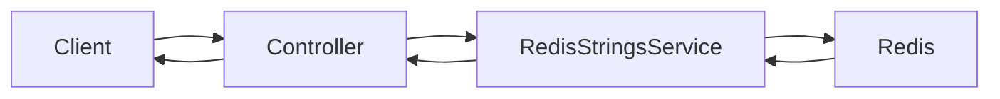
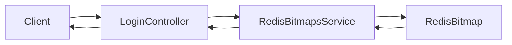

# Strings, Bitmaps 사용해보기

# Strings, Bitmaps 사용해보기

* toc
{:toc}

---

## Redis Strings와 Bitmaps 완벽 가이드 (Spring Boot 예제로 이해하기)

Redis는 다양한 자료구조(Data Structure)를 제공하는 In-Memory 데이터 저장소이다. 단순한 Key-Value 저장소를 넘어 Strings, Lists, Sets, Hashes, Sorted Sets, Bitmaps, Streams 등 여러 자료구조를 지원하기 때문에 상황에 맞는 자료구조를 선택하면 성능과 메모리 효율을 크게 향상시킬 수 있다.

이번 글에서는 Redis에서 가장 많이 사용하는 **Strings**와 많은 사람들이 잘 모르지만 대규모 서비스에서 매우 유용한 **Bitmaps**를 Spring Boot 예제와 함께 알아본다. 또한 각각이 어떤 상황에서 사용되는지와 실무 활용 사례까지 함께 살펴본다.

---

## Redis Strings란?

Strings는 Redis에서 가장 기본이 되는 자료구조이다.

이름은 String이지만 단순히 문자열만 저장하는 것이 아니라 다음과 같은 다양한 데이터도 저장할 수 있다.

| 저장 가능한 데이터 | 예시             |
| ---------- | -------------- |
| 문자열        | 이름, 이메일        |
| 숫자         | 조회수, 좋아요 수     |
| JSON       | 직렬화된 객체        |
| Binary 데이터 | 이미지 일부, 압축 데이터 |

Redis에서는 하나의 Key에 하나의 Value가 저장된다.

예를 들어 사용자 정보를 저장한다면 다음과 같이 Key를 설계할 수 있다.

```text
user:1:name
user:1:email

user:2:name
user:2:email
```

이처럼 `:`를 이용하여 계층 구조처럼 Key를 설계하는 것이 일반적이다.

---

## 왜 Strings를 사용할까?

Strings는 가장 단순하지만 가장 빠른 자료구조이다.

대표적인 활용 사례는 다음과 같다.

* 사용자 정보 저장
* 인증 코드 저장
* 로그인 토큰 저장
* 조회수 증가
* 캐시 데이터 저장
* API 응답 캐싱

특히 조회가 매우 많은 데이터는 데이터베이스 대신 Redis Strings를 사용하면 응답 속도를 크게 향상시킬 수 있다.

예를 들어,

```
DB 조회

↓

100ms
```

Redis에서는

```
Redis 조회

↓

1ms 이하
```

수준으로 응답이 가능하다.

---

## Spring Boot에서 Strings 사용하기

Spring Data Redis에서는 `StringRedisTemplate`을 이용하여 쉽게 문자열을 저장할 수 있다.

서비스에서는 다음과 같이 사용자 이름과 이메일을 저장한다.

```java
@Service
public class RedisStringsService {

    @Autowired
    private StringRedisTemplate redisTemplate;

    public void saveUserProfile(String userId, String name, String email) {
        redisTemplate.opsForValue().set("user:" + userId + ":name", name);
        redisTemplate.opsForValue().set("user:" + userId + ":email", email);
    }

    public String getUserProfile(String userId) {
        String name = redisTemplate.opsForValue().get("user:" + userId + ":name");
        String email = redisTemplate.opsForValue().get("user:" + userId + ":email");

        return "Name: " + name + ", Email: " + email;
    }

}
```

위 코드에서 핵심은 `opsForValue()`이다.

`opsForValue()`는 Redis의 String 자료구조를 다루기 위한 API이며 내부적으로 Redis의 `SET`, `GET` 명령을 사용한다.

| 코드    | Redis 명령 |
| ----- | -------- |
| set() | SET      |
| get() | GET      |

---

## Controller 구현

사용자 정보를 저장하고 조회하는 API는 다음과 같이 구현할 수 있다.

```java
@RestController
@RequestMapping("/users")
public class UserController {

    @Autowired
    private RedisStringsService redisStringsService;

    @PostMapping("/{id}")
    public String saveUser(
            @PathVariable String id,
            @RequestParam String name,
            @RequestParam String email) {

        redisStringsService.saveUserProfile(id, name, email);
        return "User saved successfully!";
    }

    @GetMapping("/{id}")
    public String getUser(@PathVariable String id) {
        return redisStringsService.getUserProfile(id);
    }

}
```

API는 매우 단순하지만 내부적으로는 데이터베이스를 거치지 않고 Redis에서 즉시 조회된다.

---

## Strings 동작 과정



---

## Redis Bitmap이란?

Bitmap은 String 자료구조를 Bit 단위로 사용하는 기능이다.

즉,

```
0000000000000000
```

처럼 0과 1만 저장하는 비트 배열이라고 생각하면 된다.

각 비트는 하나의 상태를 표현한다.

예를 들어

```
0 = 로그인 안함

1 = 로그인함
```

이 된다.

Bitmap은 실제로 별도의 자료구조가 아니라 Redis String을 Bit 단위로 제어하는 기능이다.

---

## 왜 Bitmap을 사용할까?

Bitmap의 가장 큰 장점은 메모리 효율이다.

예를 들어

100만 명의 로그인 여부를 저장한다고 가정하자.

Boolean 배열을 사용하면

```
100만 Byte 이상
```

Bitmap은

```
100만 Bit

=

약 125KB
```

만 필요하다.

즉,

8배 이상의 메모리를 절약할 수 있다.

---

## Bitmap 활용 사례

실무에서는 다음과 같은 기능에 많이 사용된다.

| 활용 분야  | 설명         |
| ------ | ---------- |
| 출석 체크  | 오늘 출석 여부   |
| 로그인 여부 | 특정 날짜 로그인  |
| 이벤트 참여 | 참여 여부      |
| 광고 노출  | 광고를 봤는지 여부 |
| 쿠폰 지급  | 지급 여부      |
| 알림 발송  | 발송 여부      |

특히 "했다 / 안 했다"처럼 True, False만 필요한 경우 최고의 선택이다.

---

## Bitmap 서비스 구현

사용자의 로그인 여부를 기록하는 서비스는 다음과 같이 작성할 수 있다.

```java
@Service
public class RedisBitmapsService {

    @Autowired
    private StringRedisTemplate redisTemplate;

    public void setUserLogin(String date, int userId) {
        redisTemplate.opsForValue().setBit("login:" + date, userId, true);
    }

    public boolean isUserLoggedIn(String date, int userId) {
        return Boolean.TRUE.equals(
                redisTemplate.opsForValue().getBit("login:" + date, userId)
        );
    }

    public Long countBits(String key) {
        return redisTemplate.execute(
                (RedisCallback<Long>) connection ->
                        connection.stringCommands().bitCount(key.getBytes())
        );
    }

}
```

---

## 코드 설명

### setBit()

```java
setBit("login:20240101", 3, true);
```

Redis 내부에는

```
00010000
```

처럼 저장된다.

3번 위치의 Bit가 1이 된다.

---

### getBit()

```java
getBit("login:20240101", 3)
```

결과

```
true
```

해당 사용자가 로그인한 적이 있는지 확인할 수 있다.

---

### bitCount()

Bitmap 전체에서 1의 개수를 세는 명령이다.

예를 들어

```
11100101
```

이라면

```
5
```

를 반환한다.

로그인한 전체 사용자 수를 매우 빠르게 계산할 수 있다.

---

## Controller 구현

Bitmap을 사용하는 API는 다음과 같이 구현한다.

```java
@RestController
@RequestMapping("/logins")
public class LoginController {

    @Autowired
    private RedisBitmapsService redisBitmapsService;

    @PostMapping("/{date}/{userId}")
    public String loginUser(
            @PathVariable String date,
            @PathVariable int userId) {

        redisBitmapsService.setUserLogin(date, userId);

        return "User " + userId + " logged in on " + date;
    }

    @GetMapping("/{date}/{userId}")
    public String checkLogin(
            @PathVariable String date,
            @PathVariable int userId) {

        boolean loggedIn =
                redisBitmapsService.isUserLoggedIn(date, userId);

        return "User " + userId +
                " login status on " +
                date + ": " + loggedIn;
    }

    @GetMapping("/{date}/total")
    public String getTotalLogins(
            @PathVariable String date) {

        long totalLogins =
                redisBitmapsService.countBits("login:" + date);

        return "Total logins on " +
                date + ": " + totalLogins;
    }

}
```

---

## Bitmap 동작 구조



---

## Strings와 Bitmap 비교

| 항목       | Strings  | Bitmap |
| -------- | -------- | ------ |
| 저장 방식    | 문자열      | Bit    |
| 메모리 사용량  | 비교적 큼    | 매우 작음  |
| 조회 속도    | 매우 빠름    | 매우 빠름  |
| 대표 사용 사례 | 사용자 정보   | 로그인 여부 |
| 저장 데이터   | 자유로운 문자열 | 0 또는 1 |
| 대용량 처리   | 보통       | 매우 뛰어남 |

---

## Redis Key 설계 팁

Key는 검색하기 쉽도록 일정한 규칙을 유지하는 것이 좋다.

예를 들어

```text
user:1:name
user:1:email

login:20240101

coupon:100:user:30

attendance:20250101
```

이처럼 도메인 단위로 Prefix를 사용하면 관리와 운영이 훨씬 편리해진다.

---

## 실무에서의 활용

Strings는 거의 모든 Redis 프로젝트에서 가장 많이 사용하는 자료구조이다. 사용자 프로필 캐싱, 인증 토큰 저장, API 응답 캐시, 조회수 관리 등 다양한 영역에서 활용된다.

Bitmap은 대규모 사용자의 상태를 관리해야 하는 서비스에서 강력한 장점을 제공한다. 하루 수백만 명의 로그인 여부, 이벤트 참여 여부, 출석 체크, 광고 노출 여부 등을 메모리를 거의 사용하지 않고 저장할 수 있으며, `BITCOUNT`를 이용해 통계도 빠르게 계산할 수 있다.

실제 서비스에서는 두 자료구조를 함께 사용하는 경우가 많다. 예를 들어 사용자의 상세 정보는 Strings에 저장하고, 로그인 여부나 출석 여부는 Bitmap으로 관리하면 성능과 메모리 효율을 모두 확보할 수 있다.

---

## 정리

Redis의 Strings는 가장 기본적이면서도 가장 많이 사용되는 자료구조로, 문자열뿐 아니라 다양한 형태의 데이터를 빠르게 저장하고 조회할 수 있다.

Bitmap은 String을 비트 단위로 활용하는 기능으로, 대규모 사용자의 상태를 메모리 효율적으로 관리할 때 매우 유용하다. 특히 로그인 기록, 출석 체크, 이벤트 참여 여부처럼 단순한 상태 정보를 저장하는 데 적합하다.

서비스 특성에 맞게 Strings와 Bitmap을 적절히 조합하면 데이터베이스의 부하를 줄이고, 응답 속도를 향상시키며, 메모리 사용량까지 최적화할 수 있다.

---

### 한 줄 요약

**Redis Strings는 범용적인 Key-Value 저장소이고, Bitmap은 대규모 사용자의 상태를 최소한의 메모리로 관리하기 위한 고성능 자료구조이다.**


