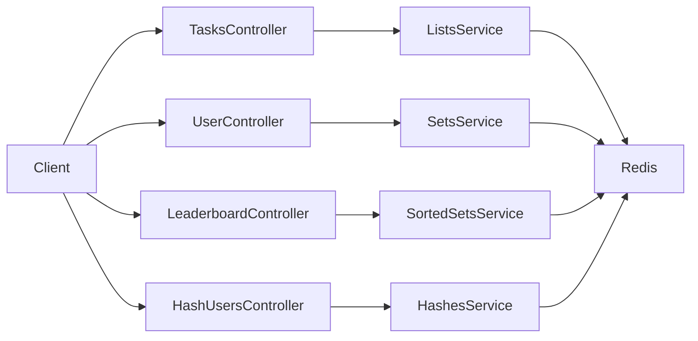
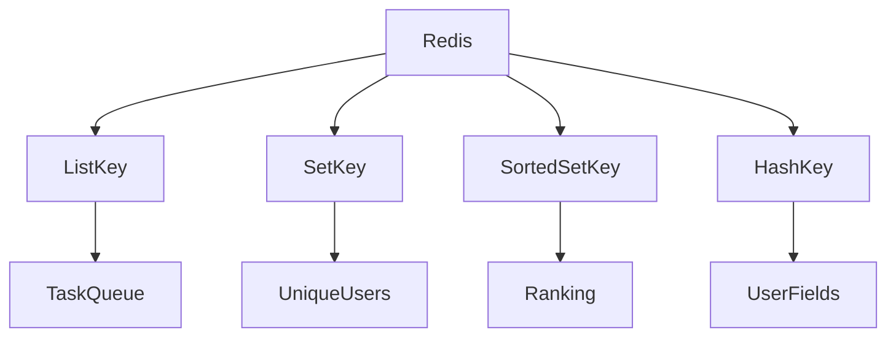

# Lists, Sets, Sorted Sets, Hashes 사용해보기

# Lists, Sets, Sorted Sets, Hashes 사용해보기

* toc
{:toc}

---

## Redis Lists, Sets, Sorted Sets, Hashes 사용해보기

Redis는 단순한 Key-Value 저장소처럼 보이지만, 실제로는 다양한 자료구조를 제공하는 인메모리 데이터 저장소이다. 이전에 살펴본 `Strings`와 `Bitmaps`가 단일 값이나 비트 단위 상태 저장에 적합했다면, 이번에 정리할 `Lists`, `Sets`, `Sorted Sets`, `Hashes`는 여러 값을 묶어서 다룰 때 유용하다.

`Lists`는 순서가 있는 데이터 목록을 저장할 때 사용한다. 작업 큐, 알림 목록, 최근 본 상품 목록처럼 순서가 중요한 데이터에 잘 맞는다.

`Sets`는 중복을 허용하지 않는 집합이다. 특정 그룹에 속한 사용자 목록, 이벤트 참여자 목록, 태그 목록처럼 중복이 없어야 하는 데이터에 적합하다.

`Sorted Sets`는 Set에 점수(score)를 추가한 자료구조이다. 중복을 허용하지 않으면서 점수를 기준으로 정렬할 수 있기 때문에 랭킹, 리더보드, 인기 게시글 목록을 만들 때 자주 사용한다.

`Hashes`는 하나의 Key 안에 여러 field-value를 저장하는 자료구조이다. 사용자 정보, 상품 정보, 설정값처럼 하나의 객체를 Redis에 저장할 때 유용하다.

---

## 개념

Redis의 컬렉션 자료구조는 여러 개의 값을 하나의 Key 아래에서 관리할 수 있게 해준다.

`Lists`는 값의 순서가 유지되는 자료구조이다. 왼쪽이나 오른쪽에 데이터를 추가할 수 있고, 반대편에서 꺼내면 큐처럼 사용할 수 있다.

```text
queue:tasks -> [Task3, Task2, Task1]
```

`Sets`는 중복을 허용하지 않는 자료구조이다. 같은 값을 여러 번 추가해도 하나만 저장된다.

```text
team:A -> {Alice, Bob, Charlie}
```

`Sorted Sets`는 Set과 비슷하지만 각 값에 점수(score)가 함께 저장된다. Redis는 이 점수를 기준으로 데이터를 정렬한다.

```text
leaderboard:game
Player1 -> 100
Player2 -> 90
Player3 -> 80
```

`Hashes`는 하나의 Key 안에 여러 필드를 저장한다. Java의 `Map`이나 객체와 비슷하게 생각할 수 있다.

```text
user:1
name -> Alice
age -> 30
city -> Seoul
```

이 네 가지 자료구조는 모두 여러 값을 다루지만, 사용 목적이 다르다.

| 자료구조 | 핵심 특징 | 대표 사용 사례 |
|---|---|---|
| Lists | 순서를 유지한다 | 작업 큐, 최근 목록 |
| Sets | 중복을 허용하지 않는다 | 참여자 목록, 태그, 그룹 사용자 |
| Sorted Sets | score 기준으로 정렬한다 | 랭킹, 리더보드 |
| Hashes | field-value 구조로 저장한다 | 사용자 정보, 상품 정보 |

---

## 왜 사용하는가?

애플리케이션에서 모든 데이터를 문자열 하나로만 저장하면 관리가 어려워진다. 예를 들어 사용자 정보를 JSON 문자열 하나로 저장할 수도 있지만, 특정 필드만 수정해야 할 때는 전체 값을 다시 읽고 다시 저장해야 한다.

반면 Hashes를 사용하면 사용자 정보 중 `age` 필드만 따로 수정할 수 있다.

작업 큐를 구현할 때도 단순 문자열 Key 여러 개를 사용하는 것보다 Lists를 사용하는 편이 자연스럽다. List는 왼쪽에 작업을 추가하고 오른쪽에서 작업을 꺼내는 방식으로 큐처럼 동작시킬 수 있다.

중복 제거가 필요하다면 Sets가 적합하다. 이벤트 참여자를 저장할 때 같은 사용자가 여러 번 요청하더라도 Set은 중복 값을 하나만 유지한다.

랭킹처럼 점수 기준 정렬이 필요하다면 Sorted Sets가 가장 잘 맞는다. 데이터베이스에서 매번 `ORDER BY score DESC`를 실행하는 대신 Redis Sorted Sets에 점수를 저장하면 상위 N명을 빠르게 조회할 수 있다.

---

## 주요 특징

`Lists`, `Sets`, `Sorted Sets`, `Hashes`를 비교하면 다음과 같다.

| 구분 | 중복 허용 | 순서 | 주요 기준 | 대표 명령 |
|---|---|---|---|---|
| Lists | 허용 | 삽입 순서 | 위치 index | `LPUSH`, `RPOP`, `LRANGE` |
| Sets | 허용하지 않음 | 보장하지 않음 | 값 자체 | `SADD`, `SMEMBERS`, `SREM` |
| Sorted Sets | 허용하지 않음 | score 기준 정렬 | score | `ZADD`, `ZREVRANGE` |
| Hashes | field 중복 불가 | field 기준 | field-value | `HSET`, `HGETALL` |

Spring Boot에서는 `StringRedisTemplate`을 통해 각 자료구조에 접근할 수 있다.

| Redis 자료구조 | Spring API |
|---|---|
| Lists | `opsForList()` |
| Sets | `opsForSet()` |
| Sorted Sets | `opsForZSet()` |
| Hashes | `opsForHash()` |

이 API를 사용하면 Redis 명령어를 직접 문자열로 작성하지 않고도 Java 코드에서 타입에 맞게 Redis를 다룰 수 있다.

---

## 예제

먼저 Lists를 사용해 작업 큐를 구현한다.

```java
package com.example.redis.services;

import org.springframework.beans.factory.annotation.Autowired;
import org.springframework.data.redis.core.StringRedisTemplate;
import org.springframework.stereotype.Service;

import java.util.List;

@Service
public class RedisListsService {

    @Autowired
    private StringRedisTemplate redisTemplate;

    // 작업 추가 (왼쪽에 추가)
    public void addTask(String queueName, String task) {
        redisTemplate.opsForList().leftPush(queueName, task);
    }

    // 작업 가져오기 (오른쪽에서 제거하며 반환)
    public String getTask(String queueName) {
        return redisTemplate.opsForList().rightPop(queueName);
    }

    // 전체 작업 조회
    public List<String> getAllTasks(String queueName) {
        return redisTemplate.opsForList().range(queueName, 0, -1);
    }
}
```

`leftPush()`는 List의 왼쪽에 값을 추가한다. `rightPop()`은 List의 오른쪽에서 값을 제거하면서 반환한다.

이 조합을 사용하면 먼저 들어온 작업이 먼저 처리되는 FIFO 구조를 만들 수 있다.

```text
leftPush(Task1)
leftPush(Task2)
leftPush(Task3)

List 상태: [Task3, Task2, Task1]

rightPop() -> Task1
rightPop() -> Task2
rightPop() -> Task3
```

작업 큐에서는 이 흐름이 중요하다. 먼저 들어온 작업을 먼저 처리해야 한다면 `leftPush`와 `rightPop` 조합이 적합하다. 반대로 가장 최근 작업을 먼저 처리하고 싶다면 `leftPush`와 `leftPop` 조합을 사용할 수 있다.

Tasks 컨트롤러는 다음과 같다.

```java
package com.example.redis.controllers;

import com.example.redis.services.RedisListsService;
import org.springframework.beans.factory.annotation.Autowired;
import org.springframework.web.bind.annotation.*;

import java.util.List;

@RestController
@RequestMapping("/tasks")
public class TasksController {

    @Autowired
    private RedisListsService redisListsService;

    @PostMapping("/{queue}")
    public String addTask(@PathVariable String queue, @RequestParam String task) {
        redisListsService.addTask(queue, task);
        return "Task added to queue: " + task;
    }

    @GetMapping("/{queue}")
    public String getTask(@PathVariable String queue) {
        String task = redisListsService.getTask(queue);
        return task != null ? "Task processed: " + task : "No tasks in queue.";
    }

    @GetMapping("/{queue}/all")
    public List<String> getAllTasks(@PathVariable String queue) {
        return redisListsService.getAllTasks(queue);
    }
}
```

작업 추가 API는 다음과 같이 호출할 수 있다.

```bash
curl -X POST "http://localhost:8080/tasks/work?task=Task1"
```

실행 결과는 다음과 같다.

```text
Task added to queue: Task1
```

작업을 꺼내는 API는 다음과 같다.

```bash
curl "http://localhost:8080/tasks/work"
```

실행 결과는 다음과 같다.

```text
Task processed: Task1
```

남은 작업이 없을 때 다시 호출하면 다음과 같은 결과가 나온다.

```text
No tasks in queue.
```

전체 작업 목록 조회 API는 다음과 같다.

```bash
curl "http://localhost:8080/tasks/work/all"
```

실행 결과는 다음과 같다.

```json
[]
```

작업을 다시 추가한 뒤 조회하면 다음과 같이 확인할 수 있다.

```bash
curl -X POST "http://localhost:8080/tasks/work?task=Task1"
curl "http://localhost:8080/tasks/work/all"
```

실행 결과는 다음과 같다.

```json
["Task1"]
```

Sets 서비스는 다음과 같다.

```java
package com.example.redis.services;

import org.springframework.beans.factory.annotation.Autowired;
import org.springframework.data.redis.core.StringRedisTemplate;
import org.springframework.stereotype.Service;

import java.util.Set;

@Service
public class RedisSetsService {

    @Autowired
    private StringRedisTemplate redisTemplate;

    // 사용자 추가
    public void addUser(String setName, String user) {
        redisTemplate.opsForSet().add(setName, user);
    }

    // 모든 사용자 조회
    public Set<String> getAllUsers(String setName) {
        return redisTemplate.opsForSet().members(setName);
    }

    // 사용자 제거
    public void removeUser(String setName, String user) {
        redisTemplate.opsForSet().remove(setName, user);
    }
}
```

`opsForSet().add()`는 Set에 값을 추가한다. Set은 중복을 허용하지 않기 때문에 같은 사용자를 여러 번 추가해도 하나만 저장된다.

`members()`는 Set에 들어 있는 모든 값을 조회한다. `remove()`는 특정 값을 제거한다.

Sets 컨트롤러는 다음과 같이 구성할 수 있다.

```java
package com.example.controllers;

import com.example.redis.services.RedisSetsService;
import com.example.redis.services.RedisStringsService;
import org.springframework.beans.factory.annotation.Autowired;
import org.springframework.web.bind.annotation.*;

import java.util.Set;

@RestController
@RequestMapping("/users")
public class UserController {

    @Autowired
    private RedisStringsService redisStringsService;

    @PostMapping("/{id}")
    public String saveUser(
            @PathVariable String id,
            @RequestParam String name,
            @RequestParam String email
    ) {
        redisStringsService.saveUserProfile(id, name, email);
        return "User saved successfully!";
    }

    @GetMapping("/{id}")
    public String getUser(@PathVariable String id) {
        return redisStringsService.getUserProfile(id);
    }

    @Autowired
    private RedisSetsService redisSetsService;

    @PostMapping("/set/{set}")
    public String addUser(@PathVariable String set, @RequestParam String user) {
        redisSetsService.addUser(set, user);
        return "User added: " + user;
    }

    @GetMapping("/set/{set}")
    public Set<String> getAllUsers(@PathVariable String set) {
        return redisSetsService.getAllUsers(set);
    }

    @DeleteMapping("/set/{set}")
    public String removeUser(@PathVariable String set, @RequestParam String user) {
        redisSetsService.removeUser(set, user);
        return "User removed: " + user;
    }
}
```

팀에 사용자를 추가하는 API는 다음과 같다.

```bash
curl -X POST "http://localhost:8080/users/set/teamA?user=Alice"
```

실행 결과는 다음과 같다.

```text
User added: Alice
```

팀 전체 사용자를 조회하는 API는 다음과 같다.

```bash
curl "http://localhost:8080/users/set/teamA"
```

실행 결과는 다음과 같다.

```json
["Alice"]
```

사용자를 제거하는 API는 다음과 같다.

```bash
curl -X DELETE "http://localhost:8080/users/set/teamA?user=Alice"
```

실행 결과는 다음과 같다.

```text
User removed: Alice
```

Sets는 중복을 자동으로 제거하기 때문에 이벤트 참여자, 팀 구성원, 팔로워 목록처럼 유일성이 필요한 데이터에 적합하다.

Sorted Sets 서비스는 다음과 같다.

```java
package com.example.redis.services;

import org.springframework.beans.factory.annotation.Autowired;
import org.springframework.data.redis.core.ZSetOperations;
import org.springframework.data.redis.core.StringRedisTemplate;
import org.springframework.stereotype.Service;

import java.util.Set;

@Service
public class RedisSortedSetsService {

    @Autowired
    private StringRedisTemplate redisTemplate;

    // 플레이어 점수 추가
    public void addScore(String leaderboard, String player, double score) {
        redisTemplate.opsForZSet().add(leaderboard, player, score);
    }

    // 상위 N명 가져오기
    public Set<ZSetOperations.TypedTuple<String>> getTopPlayers(
            String leaderboard,
            int count
    ) {
        return redisTemplate.opsForZSet()
                .reverseRangeWithScores(leaderboard, 0, count - 1);
    }
}
```

Sorted Sets는 값과 score를 함께 저장한다.

```text
Player1 -> 100
Player2 -> 90
Player3 -> 80
```

`reverseRangeWithScores()`는 score가 높은 순서대로 데이터를 조회한다. `0`부터 `count - 1`까지 조회하면 상위 N명을 가져올 수 있다.

리더보드 요청에 사용할 DTO는 다음과 같다.

```java
package com.example.redis.dto;

import lombok.Data;

@Data
public class LeaderboardDto {

    String player;

    long score;
}
```

`@Data`는 Lombok 어노테이션이다. getter, setter, toString, equals, hashCode 등을 자동으로 만들어준다. 컨트롤러에서 `leaderboardDto.getPlayer()`와 `leaderboardDto.getScore()`를 사용할 수 있는 이유가 여기에 있다.

Leaderboard 컨트롤러는 다음과 같다.

```java
package com.example.redis.controllers;

import com.example.redis.dto.LeaderboardDto;
import com.example.redis.services.RedisSortedSetsService;
import org.springframework.beans.factory.annotation.Autowired;
import org.springframework.data.redis.core.ZSetOperations;
import org.springframework.web.bind.annotation.*;

import java.util.Set;

@RestController
@RequestMapping("/leaderboard")
public class LeaderboardController {

    @Autowired
    private RedisSortedSetsService redisSortedSetsService;

    @PostMapping("/{board}")
    public String addScore(
            @PathVariable String board,
            @RequestBody LeaderboardDto leaderboardDto
    ) {
        redisSortedSetsService.addScore(
                board,
                leaderboardDto.getPlayer(),
                leaderboardDto.getScore()
        );

        return "Score added for player: " + leaderboardDto.getPlayer();
    }

    @GetMapping("/{board}/top/{count}")
    public Set<ZSetOperations.TypedTuple<String>> getTopPlayers(
            @PathVariable String board,
            @PathVariable int count
    ) {
        return redisSortedSetsService.getTopPlayers(board, count);
    }
}
```

점수를 추가하는 API는 다음과 같이 호출할 수 있다.

```bash
curl -X POST "http://localhost:8080/leaderboard/game" \
  -H "Content-Type: application/json" \
  -d "{\"player\":\"Player1\",\"score\":100}"
```

실행 결과는 다음과 같다.

```text
Score added for player: Player1
```

여러 플레이어의 점수를 추가하려면 다음과 같이 요청할 수 있다.

```bash
curl -X POST "http://localhost:8080/leaderboard/game" \
  -H "Content-Type: application/json" \
  -d "{\"player\":\"Player2\",\"score\":90}"

curl -X POST "http://localhost:8080/leaderboard/game" \
  -H "Content-Type: application/json" \
  -d "{\"player\":\"Player3\",\"score\":80}"
```

상위 3명을 조회하는 API는 다음과 같다.

```bash
curl "http://localhost:8080/leaderboard/game/top/3"
```

실행 결과는 다음과 비슷하다.

```json
[
  {
    "value": "Player1",
    "score": 100.0
  },
  {
    "value": "Player2",
    "score": 90.0
  },
  {
    "value": "Player3",
    "score": 80.0
  }
]
```

Sorted Sets를 사용하면 점수가 높은 순서대로 데이터를 빠르게 가져올 수 있다. 게임 랭킹, 포인트 순위, 인기 게시글, 실시간 검색어 같은 기능에 잘 맞는다.

Hashes 서비스는 다음과 같다.

```java
package com.example.redis.services;

import org.springframework.beans.factory.annotation.Autowired;
import org.springframework.data.redis.core.HashOperations;
import org.springframework.data.redis.core.StringRedisTemplate;
import org.springframework.stereotype.Service;

import java.util.Map;

@Service
public class RedisHashesService {

    @Autowired
    private StringRedisTemplate redisTemplate;

    // 사용자 정보 저장
    public void saveUser(String userId, Map<String, String> userInfo) {
        redisTemplate.opsForHash().putAll("user:" + userId, userInfo);
    }

    // 사용자 정보 조회
    public Map<Object, Object> getUser(String userId) {
        return redisTemplate.opsForHash().entries("user:" + userId);
    }

    // 특정 필드 업데이트
    public void updateUserField(String userId, String field, String value) {
        redisTemplate.opsForHash().put("user:" + userId, field, value);
    }
}
```

Hashes는 하나의 Key 안에 여러 field-value를 저장한다.

```text
user:1
name -> Alice
age -> 30
city -> Seoul
```

`putAll()`은 여러 필드를 한 번에 저장한다. `entries()`는 해당 Hash의 모든 필드를 조회한다. `put()`은 특정 필드만 저장하거나 업데이트한다.

사용자 정보 전체를 JSON 문자열로 저장할 수도 있지만, Hashes를 사용하면 특정 필드만 수정하기 쉽다.

예를 들어 나이만 변경하고 싶다면 전체 사용자 정보를 다시 저장할 필요 없이 `age` 필드만 업데이트하면 된다.

HashUsers 컨트롤러는 다음과 같다.

```java
package com.example.redis.controllers;

import com.example.redis.services.RedisHashesService;
import org.springframework.beans.factory.annotation.Autowired;
import org.springframework.web.bind.annotation.*;

import java.util.Map;

@RestController
@RequestMapping("/hashusers")
public class HashUsersController {

    @Autowired
    private RedisHashesService redisHashesService;

    @PostMapping("/{id}")
    public String saveUser(
            @PathVariable String id,
            @RequestBody Map<String, String> userInfo
    ) {
        redisHashesService.saveUser(id, userInfo);
        return "User info saved: " + id;
    }

    @GetMapping("/{id}")
    public Map<Object, Object> getUser(@PathVariable("id") String id) {
        return redisHashesService.getUser(id);
    }

    @PutMapping("/{id}")
    public String updateUserField(
            @PathVariable String id,
            @RequestParam String field,
            @RequestParam String value
    ) {
        redisHashesService.updateUserField(id, field, value);
        return "Field updated for user: " + id;
    }
}
```

사용자 정보를 저장하는 API는 다음과 같다.

```bash
curl -X POST "http://localhost:8080/hashusers/1" \
  -H "Content-Type: application/json" \
  -d "{\"name\":\"Alice\",\"age\":\"30\",\"city\":\"Seoul\"}"
```

실행 결과는 다음과 같다.

```text
User info saved: 1
```

사용자 정보를 조회하는 API는 다음과 같다.

```bash
curl "http://localhost:8080/hashusers/1"
```

실행 결과는 다음과 같다.

```json
{
  "name": "Alice",
  "age": "30",
  "city": "Seoul"
}
```

특정 필드를 업데이트하는 API는 다음과 같다.

```bash
curl -X PUT "http://localhost:8080/hashusers/1?field=age&value=31"
```

실행 결과는 다음과 같다.

```text
Field updated for user: 1
```

다시 조회하면 `age` 값이 변경된 것을 확인할 수 있다.

```bash
curl "http://localhost:8080/hashusers/1"
```

실행 결과는 다음과 같다.

```json
{
  "name": "Alice",
  "age": "31",
  "city": "Seoul"
}
```

---

## 구조

전체 구조는 다음과 같다.



각 컨트롤러는 Redis 자료구조별 서비스에 요청을 전달한다.

`TasksController`는 Lists를 사용해 작업 큐를 다룬다. `UserController`는 Sets를 사용해 중복 없는 사용자 집합을 관리한다. `LeaderboardController`는 Sorted Sets를 사용해 점수 기반 랭킹을 관리한다. `HashUsersController`는 Hashes를 사용해 사용자 정보를 field-value 형태로 저장한다.

자료구조별 저장 형태는 다음과 같다.



Redis는 같은 저장소 안에서 여러 자료구조를 함께 사용할 수 있다. 중요한 것은 저장하려는 데이터의 성격에 맞는 자료구조를 선택하는 것이다.

---

## 실무에서의 활용

Lists는 작업 큐 형태의 데이터에 적합하다. 예를 들어 이메일 발송 작업, 알림 발송 작업, 비동기 처리 대상 목록을 Redis List에 넣고 하나씩 꺼내 처리할 수 있다.

다만 Redis List만으로 안정적인 메시지 큐를 완전히 대체하기는 어렵다. 장애 상황에서 재처리, 소비자 그룹, 메시지 보관, 처리 보장 같은 기능이 필요하다면 Kafka나 RabbitMQ 같은 메시지 브로커를 사용하는 것이 더 적합하다. Redis List는 가볍고 단순한 큐가 필요할 때 잘 맞는다.

Sets는 중복 제거가 중요한 곳에서 사용한다. 이벤트 참여자 목록, 특정 상품을 좋아요한 사용자 목록, 특정 그룹에 속한 사용자 목록처럼 같은 값이 여러 번 들어가면 안 되는 데이터에 적합하다.

Sorted Sets는 랭킹 기능에 매우 자주 사용된다. 게임 점수 랭킹, 게시글 인기 순위, 상품 조회수 순위처럼 score 기준 정렬이 필요한 기능에서 강력하다. 데이터베이스에서 매번 정렬 쿼리를 실행하지 않아도 Redis에서 상위 N개 데이터를 빠르게 가져올 수 있다.

Hashes는 객체 형태의 데이터를 저장할 때 유용하다. 사용자 정보, 상품 정보, 설정 정보처럼 여러 필드를 가진 데이터를 하나의 Key 안에 저장할 수 있다. 특히 특정 필드만 수정할 수 있다는 점이 장점이다.

다만 Hashes에 너무 많은 필드를 넣거나, 큰 객체를 무분별하게 저장하면 Redis 메모리 사용량이 커질 수 있다. Redis는 인메모리 저장소이기 때문에 저장할 데이터의 크기와 TTL 전략을 함께 고려해야 한다.

| 상황 | 추천 자료구조 |
|---|---|
| 순서 있는 작업 목록 | Lists |
| 중복 없는 사용자 목록 | Sets |
| 점수 기반 랭킹 | Sorted Sets |
| 객체 형태의 사용자 정보 | Hashes |
| 단순 문자열 캐시 | Strings |
| 대량 boolean 상태 | Bitmaps |

Redis를 잘 사용하려면 단순히 빠르다는 이유로 모든 데이터를 넣는 것이 아니라, 데이터의 형태와 조회 패턴에 맞는 자료구조를 선택해야 한다.

---

## 정리

Redis `Lists`는 순서가 있는 데이터 목록을 저장할 때 사용한다. `leftPush`와 `rightPop`을 조합하면 FIFO 방식의 작업 큐처럼 사용할 수 있다.

Redis `Sets`는 중복을 허용하지 않는 집합 자료구조이다. 이벤트 참여자, 팀 구성원, 태그처럼 유일성이 중요한 데이터를 저장할 때 적합하다.

Redis `Sorted Sets`는 값에 score를 함께 저장하고 score 기준으로 정렬할 수 있는 자료구조이다. 랭킹, 리더보드, 인기 게시글 목록처럼 순위가 필요한 기능에 잘 맞는다.

Redis `Hashes`는 하나의 Key 안에 여러 field-value를 저장하는 자료구조이다. 사용자 정보나 상품 정보처럼 객체 형태의 데이터를 저장하고 특정 필드만 수정할 때 유용하다.

Spring Boot에서는 `StringRedisTemplate`의 `opsForList()`, `opsForSet()`, `opsForZSet()`, `opsForHash()`를 사용해 각 자료구조를 쉽게 다룰 수 있다.

실무에서는 Redis 자료구조를 기능별로 나누어 선택하는 것이 중요하다. 작업 큐는 Lists, 중복 제거는 Sets, 랭킹은 Sorted Sets, 객체 저장은 Hashes처럼 목적에 맞게 사용해야 성능과 유지보수성을 함께 확보할 수 있다.

---

### 한 줄 요약

Redis Lists는 순서 있는 큐, Sets는 중복 없는 집합, Sorted Sets는 점수 기반 랭킹, Hashes는 객체 형태의 데이터를 저장할 때 사용하는 자료구조이다.

