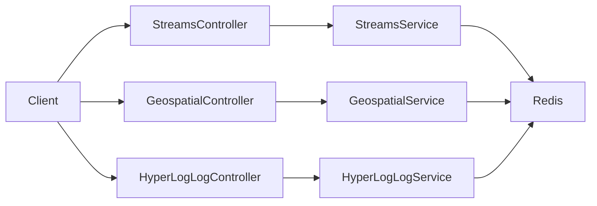
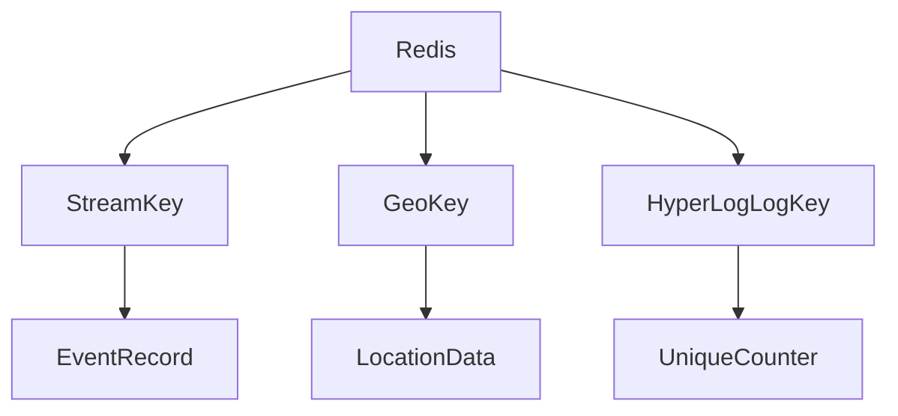

# Streams, Geospatial, HyperLogLog 사용해보기

# Streams, Geospatial, HyperLogLog 사용해보기

* toc
{:toc}

---

## Redis Streams, Geospatial, HyperLogLog 사용해보기

Redis는 단순한 Key-Value 저장소를 넘어 다양한 목적에 맞는 자료구조를 제공한다. `Strings`, `Lists`, `Sets`, `Sorted Sets`, `Hashes`가 일반적인 데이터 저장과 컬렉션 처리에 적합하다면, `Streams`, `Geospatial`, `HyperLogLog`는 조금 더 특수한 문제를 해결할 때 사용한다.

`Streams`는 시간 순서대로 쌓이는 이벤트 데이터를 저장할 때 사용한다. 센서 데이터, 로그 데이터, 주문 이벤트, 알림 이벤트처럼 발생 순서가 중요한 데이터를 다루기에 적합하다.

`Geospatial`은 위도와 경도를 Redis에 저장하고, 위치 간 거리 계산이나 반경 내 장소 검색을 할 때 사용한다. 음식점 찾기, 주변 매장 검색, 근처 사용자 찾기 같은 기능에 활용할 수 있다.

`HyperLogLog`는 중복을 제거한 유일한 값의 개수를 근사적으로 계산하는 자료구조이다. 정확한 목록이 필요하지 않고, 대략적인 고유 방문자 수나 조회자 수가 필요할 때 메모리를 매우 적게 사용하면서 처리할 수 있다.

---

## 개념

Redis `Streams`는 append-only 방식으로 데이터를 계속 추가하는 자료구조이다. 데이터가 추가될 때마다 Redis는 고유한 Record ID를 발급한다.

```text
mystream
1526919030474-0 -> sensor: temp, value: 25
1526919030475-0 -> sensor: humi, value: 60
```

Record ID는 보통 시간 기반으로 만들어진다. 그래서 Streams는 데이터가 언제 어떤 순서로 들어왔는지 추적하기 좋다.

Redis `Geospatial`은 위치 정보를 저장하고 조회하는 기능이다. 내부적으로는 Sorted Set을 기반으로 동작하지만, 개발자는 위도와 경도 값을 사용해 위치를 추가하고 거리 계산, 반경 검색을 할 수 있다.

```text
places
Palermo -> longitude, latitude
Catania -> longitude, latitude
```

Redis `HyperLogLog`는 유일한 값의 개수를 근사적으로 계산하는 자료구조이다. 예를 들어 하루 동안 방문한 사용자 수를 알고 싶을 때 모든 사용자 ID 목록을 저장하지 않고도 대략적인 고유 사용자 수를 구할 수 있다.

```text
daily:visitors:20260722
user-1
user-2
user-3
```

같은 사용자가 여러 번 들어와도 HyperLogLog는 중복을 제거한 개수를 계산한다.

---

## 왜 사용하는가?

`Streams`는 데이터의 흐름을 저장하고 다시 읽어야 할 때 사용한다. 일반적인 List도 큐처럼 사용할 수 있지만, Streams는 각 데이터에 ID가 붙고 시간 순서가 유지되기 때문에 이벤트 로그에 더 적합하다.

예를 들어 센서 데이터가 계속 들어오는 상황을 생각해보자.

```text
sensor=temp, value=25
sensor=temp, value=26
sensor=temp, value=27
```

이런 데이터는 마지막 값만 중요한 것이 아니라 언제 어떤 값이 들어왔는지도 중요하다. Streams를 사용하면 값의 변화 흐름을 그대로 저장할 수 있다.

`Geospatial`은 위치 기반 검색을 쉽게 구현할 수 있게 해준다. 일반적인 데이터베이스에서 위도와 경도를 직접 계산하려면 거리 계산 공식을 사용해야 하고, 반경 검색도 복잡해질 수 있다. Redis Geospatial을 사용하면 특정 위치를 기준으로 몇 km 안에 있는 장소를 쉽게 찾을 수 있다.

`HyperLogLog`는 정확한 목록보다 고유 개수만 필요할 때 사용한다. 예를 들어 오늘 방문한 순 사용자 수를 구하기 위해 모든 사용자 ID를 Set에 저장하면 사용자 수가 많아질수록 메모리 사용량이 커진다. HyperLogLog는 약간의 오차를 허용하는 대신 매우 적은 메모리로 고유 개수를 계산한다.

| 자료구조 | 사용하는 이유 |
|---|---|
| Streams | 시간 순서가 있는 이벤트 데이터를 저장하기 위해 사용한다 |
| Geospatial | 위치 저장, 거리 계산, 반경 검색을 쉽게 하기 위해 사용한다 |
| HyperLogLog | 대량 데이터의 고유 개수를 적은 메모리로 계산하기 위해 사용한다 |

---

## 주요 특징

세 자료구조의 특징을 비교하면 다음과 같다.

| 구분 | Streams | Geospatial | HyperLogLog |
|---|---|---|---|
| 핵심 목적 | 이벤트 데이터 저장 | 위치 기반 검색 | 고유 개수 추정 |
| 데이터 형태 | Record ID + field-value | 이름 + 좌표 | 유일성 판단용 값 |
| 대표 기능 | 추가, 범위 조회 | 위치 추가, 거리 계산, 반경 검색 | 값 추가, 고유 개수 조회 |
| 장점 | 시간 순서 보존 | 위치 검색 구현이 간단함 | 메모리 사용량이 매우 작음 |
| 주의점 | 메시지 처리 정책 설계 필요 | 좌표 순서에 주의 필요 | 정확한 개수가 아니라 근사값 |

Spring Boot에서는 `StringRedisTemplate`을 통해 각 기능을 사용할 수 있다.

| Redis 기능 | Spring API |
|---|---|
| Streams | `opsForStream()` |
| Geospatial | `opsForGeo()` |
| HyperLogLog | `opsForHyperLogLog()` |

`Streams`는 이벤트 로그, `Geospatial`은 위치 검색, `HyperLogLog`는 고유 카운팅에 특화되어 있다. 이 세 기능은 단순 캐시보다는 서비스 기능 자체를 구현하는 데 더 가까운 자료구조라고 볼 수 있다.

---

## 예제

먼저 Streams를 사용하는 서비스이다.

```java
package com.example.redis.services;

import org.springframework.beans.factory.annotation.Autowired;
import org.springframework.data.domain.Range;
import org.springframework.data.redis.connection.stream.MapRecord;
import org.springframework.data.redis.connection.stream.RecordId;
import org.springframework.data.redis.core.StringRedisTemplate;
import org.springframework.stereotype.Service;

import java.util.List;
import java.util.Map;
import java.util.Objects;

@Service
public class RedisStreamsService {

    @Autowired
    private StringRedisTemplate redisTemplate;

    // 스트림에 데이터 추가
    public String addStreamEntry(String streamName, String sensor, String value) {
        Map<String, String> data = Map.of("sensor", sensor, "value", value);
        RecordId recordId = redisTemplate.opsForStream().add(streamName, data);

        return Objects.requireNonNull(recordId).getValue();
    }

    // 스트림 범위 조회
    public List<MapRecord<String, Object, Object>> getStreamEntries(
            String streamName,
            String start,
            String end
    ) {
        Range<String> range = Range.closed(start, end);
        return redisTemplate.opsForStream().range(streamName, range);
    }
}
```

`addStreamEntry()`는 Stream에 데이터를 추가한다. 여기서는 `sensor`와 `value`를 하나의 Map으로 만들어 저장한다.

```java
Map<String, String> data = Map.of("sensor", sensor, "value", value);
```

Redis Stream에 데이터가 추가되면 `RecordId`가 생성된다. 이 ID는 나중에 특정 구간의 데이터를 조회하거나, 이벤트 순서를 추적할 때 사용할 수 있다.

```java
RecordId recordId = redisTemplate.opsForStream().add(streamName, data);
```

`getStreamEntries()`는 Stream에서 특정 범위의 데이터를 조회한다.

```java
Range<String> range = Range.closed(start, end);
return redisTemplate.opsForStream().range(streamName, range);
```

`start`와 `end`는 Stream Record ID 범위를 의미한다. 전체 범위를 조회하고 싶다면 `-`와 `+`를 사용할 수 있다.

Streams 컨트롤러는 다음과 같다.

```java
package com.example.redis.controllers;

import com.example.redis.services.RedisStreamsService;
import org.springframework.beans.factory.annotation.Autowired;
import org.springframework.data.redis.connection.stream.MapRecord;
import org.springframework.web.bind.annotation.*;

import java.util.List;

@RestController
@RequestMapping("/streams")
public class StreamsController {

    @Autowired
    private RedisStreamsService redisStreamsService;

    @PostMapping("/{streamName}")
    public String addStreamEntry(
            @PathVariable String streamName,
            @RequestParam String sensor,
            @RequestParam String value
    ) {
        return "Record added with ID: "
                + redisStreamsService.addStreamEntry(streamName, sensor, value);
    }

    @GetMapping("/{streamName}")
    public List<MapRecord<String, Object, Object>> getStreamEntries(
            @PathVariable String streamName,
            @RequestParam String start,
            @RequestParam String end
    ) {
        return redisStreamsService.getStreamEntries(streamName, start, end);
    }
}
```

Stream에 데이터를 추가하는 명령어는 다음과 같다.

```bash
curl -X POST "http://localhost:8080/streams/mystream?sensor=temp&value=25"
```

실행 결과는 다음과 비슷하다.

```text
Record added with ID: 1721620000000-0
```

이 명령은 `mystream`이라는 Stream에 `sensor=temp`, `value=25` 데이터를 추가한다. Redis는 해당 데이터에 Record ID를 자동으로 부여한다.

Stream 데이터를 조회하는 명령어는 다음과 같다.

```bash
curl "http://localhost:8080/streams/mystream?start=-&end=+"
```

실행 결과는 다음과 비슷하다.

```json
[
  {
    "stream": "mystream",
    "id": "1721620000000-0",
    "value": {
      "sensor": "temp",
      "value": "25"
    }
  }
]
```

`start=-`, `end=+`는 처음부터 끝까지 조회한다는 의미이다. 특정 Record ID 범위만 조회하고 싶다면 시작 ID와 종료 ID를 직접 지정하면 된다.

다음은 Geospatial을 사용하는 서비스이다.

```java
package com.example.redis.services;

import org.springframework.beans.factory.annotation.Autowired;
import org.springframework.data.geo.Circle;
import org.springframework.data.geo.Distance;
import org.springframework.data.geo.GeoResult;
import org.springframework.data.geo.Point;
import org.springframework.data.redis.connection.RedisGeoCommands;
import org.springframework.data.redis.connection.RedisGeoCommands.DistanceUnit;
import org.springframework.data.redis.core.GeoOperations;
import org.springframework.data.redis.core.StringRedisTemplate;
import org.springframework.stereotype.Service;

import java.util.List;
import java.util.Objects;
import java.util.stream.Collectors;

@Service
public class RedisGeospatialService {

    @Autowired
    private StringRedisTemplate redisTemplate;

    // 단위를 DistanceUnit으로 변환
    public DistanceUnit getDistanceUnit(String unit) {
        return switch (unit.toLowerCase()) {
            case "km" -> DistanceUnit.KILOMETERS;
            case "m" -> DistanceUnit.METERS;
            case "mi" -> DistanceUnit.MILES;
            case "ft" -> DistanceUnit.FEET;
            default -> throw new IllegalArgumentException("Unsupported distance unit: " + unit);
        };
    }

    // 위치 추가
    public void addLocation(String key, double longitude, double latitude, String name) {
        redisTemplate.opsForGeo().add(
                key,
                new RedisGeoCommands.GeoLocation<>(name, new Point(longitude, latitude))
        );
    }

    // 두 위치 간 거리 계산
    public Double getDistance(String key, String from, String to, String unit) {
        DistanceUnit distanceUnit = getDistanceUnit(unit);

        return Objects.requireNonNull(
                redisTemplate.opsForGeo().distance(key, from, to, distanceUnit)
        ).getValue();
    }

    // 특정 반경 내 위치 검색
    public List<RedisGeoCommands.GeoLocation<String>> getNearbyLocations(
            String key,
            double longitude,
            double latitude,
            double radius,
            String unit
    ) {
        DistanceUnit distanceUnit = getDistanceUnit(unit);
        GeoOperations<String, String> geoOps = redisTemplate.opsForGeo();

        return Objects.requireNonNull(
                        geoOps.radius(
                                key,
                                new Circle(
                                        new Point(longitude, latitude),
                                        new Distance(radius, distanceUnit)
                                )
                        )
                )
                .getContent()
                .stream()
                .map(GeoResult::getContent)
                .collect(Collectors.toList());
    }
}
```

`getDistanceUnit()`은 문자열로 들어온 단위를 Redis에서 사용하는 `DistanceUnit`으로 변환한다.

```java
case "km" -> DistanceUnit.KILOMETERS;
case "m" -> DistanceUnit.METERS;
case "mi" -> DistanceUnit.MILES;
case "ft" -> DistanceUnit.FEET;
```

API에서는 보통 `km`, `m` 같은 문자열로 단위를 받는 경우가 많다. 하지만 Redis Geospatial API는 `DistanceUnit` 타입을 사용하므로 변환 과정이 필요하다.

`addLocation()`은 특정 Key에 위치를 추가한다.

```java
redisTemplate.opsForGeo().add(
        key,
        new RedisGeoCommands.GeoLocation<>(name, new Point(longitude, latitude))
);
```

여기서 주의할 점은 좌표 순서이다. Redis Geospatial에서는 `longitude`, `latitude` 순서로 값을 넣는다. 일반적으로 위치를 말할 때 위도, 경도 순서로 말하는 경우가 많지만, 코드에서는 경도, 위도 순서를 혼동하지 않아야 한다.

`getDistance()`는 같은 Key 안에 저장된 두 위치 사이의 거리를 계산한다.

```java
redisTemplate.opsForGeo().distance(key, from, to, distanceUnit)
```

`getNearbyLocations()`는 특정 좌표를 기준으로 주어진 반경 안에 있는 위치들을 조회한다.

```java
new Circle(
        new Point(longitude, latitude),
        new Distance(radius, distanceUnit)
)
```

이 구조는 음식점 검색, 가까운 매장 찾기, 주변 사용자 검색 같은 기능에 사용할 수 있다.

Geospatial 컨트롤러는 다음과 같다.

```java
package com.example.redis.controllers;

import com.example.redis.services.RedisGeospatialService;
import org.springframework.beans.factory.annotation.Autowired;
import org.springframework.data.redis.connection.RedisGeoCommands;
import org.springframework.web.bind.annotation.*;

import java.util.List;

@RestController
@RequestMapping("/geospatial")
public class GeospatialController {

    @Autowired
    private RedisGeospatialService redisGeospatialService;

    @PostMapping("/{key}")
    public String addLocation(
            @PathVariable String key,
            @RequestParam double longitude,
            @RequestParam double latitude,
            @RequestParam String name
    ) {
        redisGeospatialService.addLocation(key, longitude, latitude, name);
        return "Location added: " + name;
    }

    @GetMapping("/{key}/distance")
    public String getDistance(
            @PathVariable String key,
            @RequestParam String from,
            @RequestParam String to,
            @RequestParam String unit
    ) {
        return "Distance: "
                + redisGeospatialService.getDistance(key, from, to, unit)
                + " "
                + unit;
    }

    @GetMapping("/{key}/nearby")
    public List<RedisGeoCommands.GeoLocation<String>> getNearbyLocations(
            @PathVariable String key,
            @RequestParam double longitude,
            @RequestParam double latitude,
            @RequestParam double radius,
            @RequestParam String unit
    ) {
        return redisGeospatialService.getNearbyLocations(
                key,
                longitude,
                latitude,
                radius,
                unit
        );
    }
}
```

위치를 추가하는 명령어는 다음과 같다.

```bash
curl -X POST "http://localhost:8080/geospatial/places?longitude=13.361389&latitude=38.115556&name=Palermo"
```

실행 결과는 다음과 같다.

```text
Location added: Palermo
```

다른 위치도 추가한다.

```bash
curl -X POST "http://localhost:8080/geospatial/places?longitude=15.087269&latitude=37.502669&name=Catania"
```

실행 결과는 다음과 같다.

```text
Location added: Catania
```

두 위치 사이의 거리를 조회하는 명령어는 다음과 같다.

```bash
curl "http://localhost:8080/geospatial/places/distance?from=Palermo&to=Catania&unit=km"
```

실행 결과는 다음과 비슷하다.

```text
Distance: 166.2742 km
```

특정 좌표 주변의 위치를 조회하는 명령어는 다음과 같다.

```bash
curl "http://localhost:8080/geospatial/places/nearby?longitude=13.361389&latitude=38.115556&radius=100&unit=km"
```

실행 결과는 다음과 비슷하다.

```json
[
  {
    "name": "Palermo",
    "point": {
      "x": 13.361389,
      "y": 38.115556
    }
  }
]
```

반경을 넓히면 더 많은 위치가 조회될 수 있다.

```bash
curl "http://localhost:8080/geospatial/places/nearby?longitude=13.361389&latitude=38.115556&radius=5000&unit=km"
```

실행 결과는 다음과 비슷하다.

```json
[
  {
    "name": "Palermo"
  },
  {
    "name": "Catania"
  }
]
```

다음은 HyperLogLog를 사용하는 서비스이다.

```java
package com.example.redis.services;

import org.springframework.beans.factory.annotation.Autowired;
import org.springframework.data.redis.core.StringRedisTemplate;
import org.springframework.stereotype.Service;

@Service
public class RedisHyperLogLogService {

    @Autowired
    private StringRedisTemplate redisTemplate;

    // HyperLogLog에 항목 추가
    public void addElement(String key, String value) {
        redisTemplate.opsForHyperLogLog().add(key, value);
    }

    // HyperLogLog에서 유일 항목 개수 반환
    public Long getCount(String key) {
        return redisTemplate.opsForHyperLogLog().size(key);
    }
}
```

`addElement()`는 HyperLogLog에 값을 추가한다.

```java
redisTemplate.opsForHyperLogLog().add(key, value);
```

같은 값을 여러 번 추가하더라도 HyperLogLog는 유일한 값의 개수를 근사적으로 계산한다.

`getCount()`는 HyperLogLog에 저장된 유일 항목 개수를 반환한다.

```java
redisTemplate.opsForHyperLogLog().size(key);
```

여기서 중요한 점은 “정확한 개수”가 아니라 “근사 개수”라는 점이다. HyperLogLog는 메모리를 매우 적게 사용하는 대신 약간의 오차를 허용한다.

HyperLogLog 컨트롤러는 다음과 같다.

```java
package com.example.redis.controllers;

import com.example.redis.services.RedisHyperLogLogService;
import org.springframework.beans.factory.annotation.Autowired;
import org.springframework.web.bind.annotation.*;

@RestController
@RequestMapping("/hyperloglog")
public class HyperLogLogController {

    @Autowired
    private RedisHyperLogLogService redisHyperLogLogService;

    @PostMapping("/{key}")
    public String addElement(@PathVariable String key, @RequestParam String value) {
        redisHyperLogLogService.addElement(key, value);
        return "Element added: " + value;
    }

    @GetMapping("/{key}/count")
    public String getCount(@PathVariable String key) {
        return "Approximate count of unique elements: "
                + redisHyperLogLogService.getCount(key);
    }
}
```

HyperLogLog에 값을 추가하는 명령어는 다음과 같다.

```bash
curl -X POST "http://localhost:8080/hyperloglog/visitors?value=user1"
```

실행 결과는 다음과 같다.

```text
Element added: user1
```

같은 값을 다시 추가한다.

```bash
curl -X POST "http://localhost:8080/hyperloglog/visitors?value=user1"
```

실행 결과는 다음과 같다.

```text
Element added: user1
```

다른 값도 추가한다.

```bash
curl -X POST "http://localhost:8080/hyperloglog/visitors?value=user2"
```

실행 결과는 다음과 같다.

```text
Element added: user2
```

유일 항목 개수를 조회하는 명령어는 다음과 같다.

```bash
curl "http://localhost:8080/hyperloglog/visitors/count"
```

실행 결과는 다음과 같다.

```text
Approximate count of unique elements: 2
```

`user1`을 두 번 추가했지만 유일한 값은 `user1`, `user2` 두 개이므로 결과는 2에 가깝게 나온다.

---

## 구조

전체 구조는 다음과 같다.



Streams는 이벤트 데이터를 시간 순서대로 저장한다. Geospatial은 위치 정보를 저장하고 거리 계산이나 반경 검색을 수행한다. HyperLogLog는 중복을 제거한 고유 개수를 근사적으로 계산한다.

자료구조별 데이터 흐름은 다음과 같다.



Redis 안에서 각각의 Key는 서로 다른 목적의 자료구조로 사용된다. 같은 Redis를 사용하더라도 어떤 자료구조를 선택하느냐에 따라 구현 방식과 성능 특성이 달라진다.

---

## 실무에서의 활용

Streams는 이벤트성 데이터를 저장할 때 유용하다. 센서 데이터, 사용자 행동 로그, 주문 상태 변경 이력, 알림 발송 요청처럼 시간 순서가 중요한 데이터에 사용할 수 있다.

다만 Streams를 단순히 데이터 추가와 조회 용도로만 쓰는 것과, 실제 메시지 처리 시스템으로 쓰는 것은 다르다. 실무에서 Streams를 메시지 큐처럼 사용하려면 Consumer Group, Ack, 재처리 전략, 보관 기간 같은 정책까지 함께 설계해야 한다.

Geospatial은 위치 기반 서비스에 적합하다. 주변 음식점 찾기, 가까운 매장 검색, 배송 기사 위치 조회, 근처 사용자 탐색 같은 기능을 만들 때 사용할 수 있다.

다만 Redis Geospatial은 위치 검색에 강점이 있지만 복잡한 지리 정보 분석을 모두 대체하지는 않는다. 예를 들어 행정구역 경계, 다각형 영역 검색, 복잡한 지도 분석이 필요하다면 전문적인 GIS 데이터베이스나 검색 엔진을 함께 고려해야 한다.

HyperLogLog는 고유 개수를 구할 때 매우 유용하다. 일별 방문자 수, 게시글별 고유 조회자 수, 이벤트 참여 사용자 수처럼 “누가 참여했는지 목록”보다 “몇 명이 참여했는지”가 중요한 경우에 적합하다.

정확한 사용자 목록이 필요하다면 Set을 사용해야 한다. 하지만 목록은 필요 없고 개수만 필요하다면 HyperLogLog가 훨씬 적은 메모리로 처리할 수 있다.

| 상황 | 추천 자료구조 |
|---|---|
| 시간 순서 이벤트 저장 | Streams |
| 위치 저장과 반경 검색 | Geospatial |
| 고유 방문자 수 추정 | HyperLogLog |
| 정확한 사용자 목록 필요 | Sets |
| 객체 형태 정보 저장 | Hashes |

실무에서 중요한 것은 Redis가 빠르다는 이유로 무조건 사용하는 것이 아니라, 데이터의 성격에 맞는 자료구조를 고르는 것이다. 이벤트 흐름은 Streams, 위치 검색은 Geospatial, 고유 개수 추정은 HyperLogLog처럼 목적에 맞게 사용해야 한다.

---

## 정리

Redis `Streams`는 시간 순서대로 데이터를 저장하는 자료구조이다. 각 데이터에는 Record ID가 부여되며, 이벤트 로그나 센서 데이터처럼 발생 순서가 중요한 데이터를 저장할 때 유용하다.

Redis `Geospatial`은 위도와 경도를 저장하고, 두 위치 사이의 거리 계산이나 특정 반경 내 위치 검색을 할 수 있는 기능이다. 주변 장소 검색이나 위치 기반 서비스에 적합하다.

Redis `HyperLogLog`는 중복을 제거한 유일 항목 개수를 근사적으로 계산하는 자료구조이다. 정확한 목록이 필요하지 않고 고유 개수만 필요할 때 적은 메모리로 사용할 수 있다.

Spring Boot에서는 `StringRedisTemplate`의 `opsForStream()`, `opsForGeo()`, `opsForHyperLogLog()`를 사용해 각각의 기능을 구현할 수 있다.

실무에서는 Streams를 이벤트 흐름 저장에, Geospatial을 위치 검색에, HyperLogLog를 고유 방문자 수 같은 통계성 데이터에 활용할 수 있다. 각 자료구조의 장단점을 이해하고 목적에 맞게 선택하는 것이 중요하다.

---

### 한 줄 요약

Redis Streams는 시간 순서 이벤트 저장, Geospatial은 위치 기반 검색, HyperLogLog는 적은 메모리로 고유 개수를 추정할 때 사용하는 자료구조이다.

