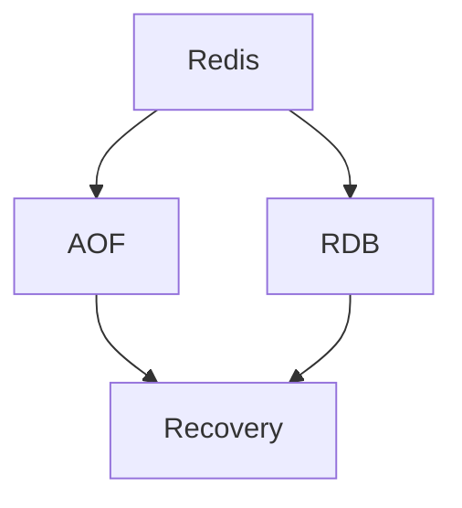

# AOF vs RDB, 영속성 정책 알아보기

# AOF vs RDB, 영속성 정책 알아보기

* toc
{:toc}

---

## Redis AOF와 RDB 영속성 정책 알아보기

Redis는 인메모리 데이터 저장소이다. 즉, 데이터를 디스크가 아니라 메모리에 저장한다. 그래서 읽기와 쓰기 속도가 매우 빠르다. 하지만 메모리에만 데이터가 있다면 Redis 서버가 재시작되거나 장애로 종료되었을 때 데이터가 사라질 수 있다.

이 문제를 해결하기 위해 Redis는 영속성 기능을 제공한다. 영속성이란 메모리에 있는 데이터를 디스크에 저장해서 Redis가 다시 시작되더라도 데이터를 복구할 수 있게 만드는 기능이다.

Redis의 대표적인 영속성 방식은 `AOF`와 `RDB`이다.

`AOF`는 Redis에 실행된 쓰기 명령을 파일에 계속 기록하는 방식이고, `RDB`는 특정 시점의 메모리 상태를 스냅샷 파일로 저장하는 방식이다.

---

## 개념

Redis 영속성은 Redis 메모리에 있는 데이터를 디스크에 저장하는 방식이다.

Redis는 기본적으로 메모리 기반으로 동작한다.

```text
Client -> Redis Memory
```

이 구조에서는 속도가 빠르지만, Redis 프로세스가 종료되면 메모리에 있던 데이터가 사라질 수 있다. 그래서 Redis는 데이터를 디스크에 남기는 두 가지 대표 방식을 제공한다.

| 방식 | 의미 |
|---|---|
| AOF | Redis에 실행된 쓰기 명령을 파일에 순서대로 기록하는 방식 |
| RDB | 특정 시점의 Redis 메모리 상태를 스냅샷 파일로 저장하는 방식 |

AOF는 `Append-Only File`의 약자이다. Redis에서 실행된 `SET`, `HSET`, `LPUSH` 같은 쓰기 명령을 `appendonly.aof` 파일에 계속 추가한다.

예를 들어 다음과 같은 명령이 실행되었다고 해보자.

```redis
SET user:1:name Alice
SET user:1:age 30
```

AOF는 이런 쓰기 명령을 파일에 기록한다. Redis가 재시작되면 이 파일에 기록된 명령을 다시 실행해서 데이터를 복원한다.

RDB는 `Redis Database Dump`의 약자이다. 특정 시점의 Redis 메모리 상태를 `.rdb` 파일로 저장한다.

예를 들어 현재 Redis 메모리에 다음 데이터가 있다면,

```text
user:1:name = Alice
user:1:age = 30
```

RDB는 이 순간의 데이터 상태를 하나의 스냅샷 파일로 저장한다. Redis가 재시작되면 이 스냅샷 파일을 읽어서 데이터를 복구한다.

---

## 왜 사용하는가?

Redis는 빠른 속도를 위해 데이터를 메모리에 저장한다. 하지만 서비스에서는 데이터가 사라지면 안 되는 경우가 많다.

예를 들어 Redis에 다음과 같은 데이터를 저장한다고 해보자.

| 데이터 | Redis 장애 시 영향 |
|---|---|
| 로그인 세션 | 사용자가 로그아웃될 수 있음 |
| 인증 코드 | 인증 진행 중인 사용자가 실패할 수 있음 |
| 캐시 데이터 | DB 부하가 순간적으로 증가할 수 있음 |
| 랭킹 데이터 | 순위 정보가 사라질 수 있음 |
| 작업 큐 | 처리해야 할 작업이 유실될 수 있음 |

물론 Redis에 저장하는 모든 데이터가 반드시 영구 보관되어야 하는 것은 아니다. 단순 캐시는 사라져도 다시 만들 수 있다. 하지만 세션, 큐, 랭킹, 통계처럼 복구가 필요한 데이터라면 영속성 정책을 반드시 고려해야 한다.

AOF와 RDB를 사용하는 이유는 결국 다음과 같다.

| 목적 | 설명 |
|---|---|
| 장애 복구 | Redis가 재시작되어도 데이터를 복구하기 위해 사용한다 |
| 데이터 손실 최소화 | 서버 종료나 장애 상황에서 손실 범위를 줄인다 |
| 백업 | 특정 시점의 데이터를 파일로 보관할 수 있다 |
| 운영 안정성 | 메모리 데이터만 사용하는 위험을 줄인다 |

Redis 영속성은 단순히 설정을 켜는 문제가 아니다. 데이터 안정성, 성능, 복구 속도, 디스크 사용량 사이에서 균형을 잡는 문제이다.

---

## 주요 특징

AOF와 RDB는 모두 Redis 데이터를 디스크에 저장하지만 동작 방식이 다르다.

AOF는 Redis가 실행한 쓰기 명령을 계속 파일에 추가한다.

```text
SET user:1:name Alice
SET user:1:age 30
INCR article:1:view
```

Redis가 재시작되면 AOF 파일을 처음부터 읽으면서 명령을 다시 실행한다. 이 방식은 데이터 손실을 줄이는 데 유리하다. 특히 `appendfsync everysec` 설정을 사용하면 보통 1초 이내의 데이터 손실만 감수하면 된다.

RDB는 특정 시점의 메모리 상태를 파일로 저장한다.

```text
dump.rdb
```

RDB는 명령 로그가 아니라 데이터 스냅샷이다. 그래서 파일 크기가 비교적 작고 복구 속도가 빠르다. 하지만 스냅샷이 생성된 이후 장애가 발생하면, 마지막 스냅샷 이후의 데이터는 손실될 수 있다.

AOF와 RDB를 비교하면 다음과 같다.

| 특징 | AOF | RDB |
|---|---|---|
| 저장 방식 | 쓰기 명령을 계속 기록 | 특정 시점의 메모리 상태 저장 |
| 파일 예시 | `appendonly.aof` | `dump.rdb` |
| 데이터 안정성 | 높음 | 상대적으로 낮음 |
| 데이터 손실 범위 | 설정에 따라 매우 작음 | 마지막 스냅샷 이후 데이터 손실 가능 |
| 복구 방식 | 명령을 재실행 | 스냅샷을 로드 |
| 복구 속도 | 상대적으로 느림 | 빠름 |
| 파일 크기 | 커질 수 있음 | 상대적으로 작음 |
| 성능 영향 | 쓰기 성능에 영향 가능 | 상대적으로 적음 |
| 사람이 읽기 쉬운가 | 비교적 읽기 쉬움 | 바이너리라 읽기 어려움 |
| 적합한 상황 | 데이터 안정성이 중요한 경우 | 빠른 백업과 복구가 중요한 경우 |

---

## 예제

AOF는 `redis.conf`에서 다음과 같이 활성화할 수 있다.

```conf
appendonly yes
appendfsync everysec
```

`appendonly yes`는 AOF 기능을 켜는 설정이다. 이 설정을 켜면 Redis는 쓰기 명령을 AOF 파일에 기록한다.

`appendfsync everysec`는 AOF 파일을 디스크에 동기화하는 주기를 의미한다. `everysec`는 1초마다 디스크에 동기화한다는 뜻이다.

AOF의 `appendfsync` 옵션은 크게 세 가지로 볼 수 있다.

| 설정 | 설명 | 특징 |
|---|---|---|
| `always` | 쓰기 명령마다 디스크에 동기화 | 데이터 안정성은 가장 높지만 성능 부담이 큼 |
| `everysec` | 1초마다 디스크에 동기화 | 안정성과 성능의 균형이 좋음 |
| `no` | 운영체제에 동기화 시점을 맡김 | 성능은 좋지만 장애 시 손실 가능성이 커짐 |

실무에서는 보통 `everysec`를 많이 사용한다. 데이터 손실을 거의 1초 수준으로 제한하면서도 성능 부담이 상대적으로 낮기 때문이다.

AOF 설정 후 Redis를 실행하는 명령어는 다음과 같다.

```bash
redis-server redis.conf
```

실행 결과는 다음과 비슷하다.

```text
Ready to accept connections
```

이 명령은 `redis.conf` 설정을 기반으로 Redis 서버를 실행한다. `appendonly yes`가 설정되어 있다면 Redis는 쓰기 명령을 AOF 파일에 기록하기 시작한다.

AOF가 활성화되면 Redis 데이터 디렉터리에 다음과 같은 파일이 생성될 수 있다.

```text
appendonly.aof
```

이 파일에는 Redis가 실행한 쓰기 명령이 기록된다. Redis가 재시작되면 이 파일을 읽고 명령을 다시 실행해서 데이터를 복구한다.

예를 들어 Redis에 다음 명령을 실행했다고 해보자.

```redis
SET user:1:name Alice
SET user:1:age 30
```

AOF는 이 쓰기 명령을 파일에 남긴다. Redis가 다시 시작되면 이 명령들을 재실행해서 `user:1:name`, `user:1:age` 데이터를 복원한다.

RDB는 `redis.conf`에서 다음과 같이 스냅샷 주기를 설정할 수 있다.

```conf
save 900 1
save 300 10
save 60 10000
```

각 설정의 의미는 다음과 같다.

| 설정 | 의미 |
|---|---|
| `save 900 1` | 900초 동안 1개 이상의 Key가 변경되면 스냅샷 저장 |
| `save 300 10` | 300초 동안 10개 이상의 Key가 변경되면 스냅샷 저장 |
| `save 60 10000` | 60초 동안 10000개 이상의 Key가 변경되면 스냅샷 저장 |

RDB는 설정한 조건이 만족되면 Redis의 현재 메모리 상태를 `.rdb` 파일로 저장한다.

일반적으로 생성되는 파일은 다음과 같다.

```text
dump.rdb
```

RDB는 특정 시점의 데이터 상태를 저장하기 때문에 백업 파일로 활용하기 좋다. 파일 크기도 AOF보다 작은 편이고, 복구할 때도 스냅샷 파일을 로드하면 되므로 빠르다.

Redis 실행 명령어는 AOF와 마찬가지로 다음과 같다.

```bash
redis-server redis.conf
```

실행 결과는 다음과 비슷하다.

```text
Ready to accept connections
```

이 명령은 `redis.conf`에 설정된 RDB 저장 주기를 사용해 Redis를 실행한다.

수동으로 RDB 스냅샷을 만들고 싶다면 Redis CLI에서 다음 명령을 사용할 수 있다.

```redis
BGSAVE
```

실행 결과는 다음과 비슷하다.

```text
Background saving started
```

`BGSAVE`는 백그라운드에서 RDB 스냅샷을 생성하는 명령이다. Redis는 fork를 사용해 자식 프로세스에서 스냅샷을 저장한다. 이 방식은 Redis 메인 프로세스가 계속 요청을 처리할 수 있게 해준다.

다만 데이터 크기가 매우 크면 fork 비용이 발생할 수 있다. 메모리가 큰 Redis 인스턴스에서는 RDB 저장 시점에 CPU와 메모리 사용량이 순간적으로 증가할 수 있다.

---

## 구조

AOF의 동작 흐름은 다음과 같다.


클라이언트가 Redis에 쓰기 명령을 보내면 Redis는 메모리에 데이터를 반영하고, 동시에 AOF 파일에 명령을 기록한다. Redis가 재시작되면 AOF 파일의 명령을 다시 실행해 데이터를 복구한다.

RDB의 동작 흐름은 다음과 같다.


RDB는 특정 시점의 Redis 메모리 상태를 스냅샷으로 저장한다. Redis가 재시작되면 `.rdb` 파일을 읽어 해당 시점의 데이터로 복구한다.

AOF와 RDB를 함께 사용하는 구조는 다음과 같다.



실무에서는 AOF와 RDB를 함께 사용하는 경우도 많다. RDB는 빠른 백업과 복구에 유리하고, AOF는 데이터 손실을 줄이는 데 유리하기 때문이다.

---

## 실무에서의 활용

Redis 영속성 정책은 데이터의 성격에 따라 다르게 선택해야 한다.

단순 캐시 데이터라면 영속성이 반드시 필요하지 않을 수 있다. 캐시는 원본 데이터가 데이터베이스에 있고, Redis 데이터가 사라져도 다시 만들 수 있기 때문이다. 이런 경우에는 성능을 우선해서 영속성을 최소화하거나 끌 수도 있다.

반면 Redis를 세션 저장소, 작업 큐, 랭킹 저장소, 실시간 통계 저장소처럼 사용한다면 영속성을 고려해야 한다. Redis 장애나 재시작으로 데이터가 사라졌을 때 서비스 영향이 크기 때문이다.

AOF는 데이터 안정성이 중요한 경우에 적합하다.

예를 들어 사용자 세션, 결제 전 임시 상태, 처리 대기 작업처럼 최근 데이터 손실이 문제가 되는 경우라면 AOF를 사용하는 것이 좋다. 특히 `appendfsync everysec` 설정은 실무에서 자주 선택되는 균형점이다.

RDB는 백업과 빠른 복구가 중요한 경우에 적합하다.

예를 들어 일정 시점의 Redis 데이터를 보관하거나, 장애 발생 시 빠르게 스냅샷 기준으로 복구해야 하는 경우 RDB가 유용하다. 파일 크기가 비교적 작고 복구 속도가 빠르기 때문이다.

다만 RDB만 사용할 경우 마지막 스냅샷 이후 데이터는 손실될 수 있다. 이 손실 범위를 받아들일 수 있는지 먼저 판단해야 한다.

| 상황 | 추천 정책 |
|---|---|
| 단순 캐시 | 영속성 비활성화 또는 RDB 중심 |
| 세션 저장 | AOF 또는 AOF + RDB |
| 랭킹 데이터 | AOF + RDB |
| 백업 목적 | RDB |
| 데이터 손실 최소화 | AOF |
| 빠른 복구 우선 | RDB |
| 안정성과 복구 모두 고려 | AOF + RDB |

운영 환경에서는 AOF와 RDB를 함께 사용하는 전략도 많이 고려한다.

```conf
appendonly yes
appendfsync everysec

save 900 1
save 300 10
save 60 10000
```

이렇게 설정하면 RDB로 주기적인 스냅샷을 남기면서, AOF로 최근 쓰기 명령까지 보완할 수 있다. Redis가 재시작될 때는 설정과 파일 상태에 따라 더 적합한 영속성 파일을 사용해 복구한다.

디스크 사용량도 함께 고려해야 한다. AOF는 쓰기 명령을 계속 기록하기 때문에 파일이 커질 수 있다. Redis는 AOF rewrite 기능을 통해 불필요한 명령을 정리하고 현재 상태를 재구성한 AOF 파일을 만들 수 있다.

예를 들어 같은 Key에 여러 번 값을 덮어썼다면,

```redis
SET user:1:name Alice
SET user:1:name Bob
SET user:1:name Charlie
```

최종 상태에는 마지막 값만 필요하다.

```redis
SET user:1:name Charlie
```

AOF rewrite는 이런 식으로 현재 데이터를 복구하는 데 필요한 최소 명령 형태로 파일을 다시 구성한다. 그래서 AOF를 운영에서 사용할 때는 rewrite 정책과 디스크 용량 모니터링이 중요하다.

---

## 정리

Redis는 인메모리 데이터 저장소이기 때문에 장애나 재시작 상황에서 데이터를 복구하려면 영속성 정책이 필요하다.

AOF는 Redis에 실행된 쓰기 명령을 `appendonly.aof` 파일에 계속 기록하는 방식이다. 데이터 손실을 줄이는 데 유리하지만, 파일 크기가 커질 수 있고 쓰기 성능에 영향을 줄 수 있다.

RDB는 특정 시점의 Redis 메모리 상태를 `.rdb` 파일로 저장하는 방식이다. 파일 크기가 상대적으로 작고 복구 속도가 빠르지만, 마지막 스냅샷 이후의 데이터는 손실될 수 있다.

실무에서는 데이터의 성격에 따라 영속성 정책을 선택해야 한다. 단순 캐시는 영속성이 없어도 괜찮을 수 있지만, 세션, 작업 큐, 랭킹, 통계처럼 유실되면 문제가 되는 데이터는 AOF 또는 AOF와 RDB를 함께 고려하는 것이 좋다.

Redis 영속성은 단순히 설정을 켜는 문제가 아니라, 데이터 안정성, 성능, 복구 속도, 디스크 사용량 사이에서 균형을 잡는 운영 전략이다.

---

### 한 줄 요약

AOF는 데이터 손실을 줄이기 위해 쓰기 명령을 기록하는 방식이고, RDB는 빠른 백업과 복구를 위해 특정 시점의 Redis 상태를 스냅샷으로 저장하는 방식이다.
