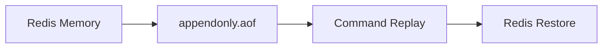
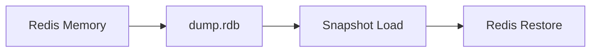
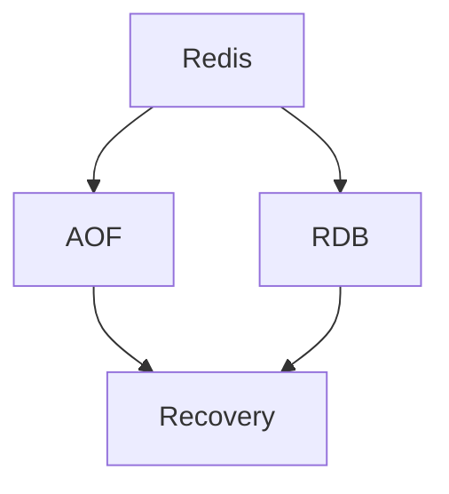

# 각 정책을 적용해보고 상호 보완해보기

# 각 정책을 적용해보고 상호 보완해보기

* toc
{:toc}

---

## Redis AOF와 RDB 정책을 직접 적용하고 함께 사용하기

Redis는 메모리 기반으로 동작하기 때문에 속도가 빠르다. 하지만 메모리에만 데이터가 존재하면 Redis 컨테이너가 내려가거나 서버가 재시작될 때 데이터가 사라질 수 있다.

이 문제를 해결하기 위해 Redis는 영속성 정책을 제공한다. 대표적인 방식은 `AOF`와 `RDB`이다.

`AOF`는 Redis에 실행된 쓰기 명령을 파일에 계속 기록하는 방식이고, `RDB`는 특정 시점의 Redis 메모리 상태를 스냅샷 파일로 저장하는 방식이다.

이번 글에서는 Redis Cluster 환경에서 AOF와 RDB를 설정하고, 두 정책을 함께 사용했을 때 어떤 방식으로 서로 보완되는지 정리한다.

---

## 개념

Redis 영속성은 메모리에 저장된 데이터를 디스크에 남겨 Redis가 다시 시작되더라도 데이터를 복구할 수 있게 하는 기능이다.

Redis는 기본적으로 다음과 같이 동작한다.

```text
Client -> Redis Memory
```

이 구조는 매우 빠르지만 Redis 프로세스가 종료되면 메모리 데이터가 사라질 수 있다. 그래서 Redis는 데이터를 디스크에 저장하는 방식을 제공한다.

대표적인 방식은 다음 두 가지이다.

| 방식 | 의미 |
|---|---|
| AOF | Redis에 실행된 쓰기 명령을 파일에 계속 추가하는 방식 |
| RDB | 특정 시점의 Redis 메모리 상태를 스냅샷 파일로 저장하는 방식 |

AOF는 `appendonly.aof` 파일을 사용한다. Redis에 `SET`, `HSET`, `LPUSH` 같은 쓰기 명령이 실행되면 해당 명령을 파일에 기록한다.

RDB는 `.rdb` 파일을 사용한다. Redis의 현재 메모리 상태를 특정 시점에 저장한다. 명령어 기록이 아니라 데이터 상태 자체를 저장하는 방식이다.

---

## 왜 사용하는가?

Redis를 단순 캐시로만 사용한다면 데이터가 사라져도 원본 데이터베이스에서 다시 만들 수 있다. 하지만 Redis를 세션 저장소, 랭킹 저장소, 작업 큐, 실시간 통계 저장소처럼 사용한다면 데이터 유실이 서비스 장애로 이어질 수 있다.

예를 들어 다음과 같은 데이터는 Redis 재시작 후에도 복구가 필요할 수 있다.

| 데이터 | 유실 시 영향 |
|---|---|
| 사용자 세션 | 사용자가 강제로 로그아웃될 수 있다 |
| 랭킹 데이터 | 점수와 순위가 사라질 수 있다 |
| 작업 큐 | 처리해야 할 작업이 사라질 수 있다 |
| 실시간 통계 | 집계 중이던 값이 초기화될 수 있다 |
| 인증 상태 | 인증 흐름이 중단될 수 있다 |

AOF와 RDB는 각각 장단점이 다르다.

AOF는 최근 데이터 손실을 줄이는 데 유리하다. 쓰기 명령을 계속 기록하기 때문이다.

RDB는 빠른 복구와 백업에 유리하다. 특정 시점의 데이터 상태를 파일로 저장하기 때문에 파일 크기가 비교적 작고 로딩 속도가 빠르다.

실무에서는 둘 중 하나만 고르는 것이 아니라, 데이터 특성에 따라 함께 사용하는 경우도 많다.

---

## 주요 특징

AOF와 RDB의 차이는 다음과 같다.

| 항목 | AOF | RDB |
|---|---|---|
| 저장 방식 | 쓰기 명령을 계속 기록 | 특정 시점의 메모리 상태 저장 |
| 대표 파일 | `appendonly.aof` | `dump.rdb` |
| 데이터 안정성 | 높음 | 상대적으로 낮음 |
| 복구 속도 | 명령 재실행이 필요해 느릴 수 있음 | 스냅샷 로드라 빠름 |
| 파일 크기 | 커질 수 있음 | 상대적으로 작음 |
| 성능 영향 | 쓰기 성능에 영향 가능 | 저장 시점에 부하 발생 가능 |
| 적합한 상황 | 데이터 손실 최소화 | 빠른 백업과 복구 |

AOF의 핵심 설정은 다음과 같다.

```conf
appendonly yes
appendfsync everysec
```

`appendonly yes`는 AOF를 활성화한다.

`appendfsync everysec`는 AOF 파일을 1초마다 디스크에 동기화한다는 의미이다. Redis가 쓰기 명령을 받을 때마다 매번 디스크에 동기화하면 안정성은 높아지지만 성능 부담이 커진다. 그래서 실무에서는 안정성과 성능의 균형을 위해 `everysec`를 많이 사용한다.

RDB의 핵심 설정은 다음과 같다.

```conf
save 60 10000
```

이 설정은 60초 동안 10000개 이상의 변경이 발생하면 RDB 스냅샷을 저장한다는 의미이다.

AOF와 RDB를 함께 사용하려면 두 설정을 모두 활성화하면 된다.

```conf
appendonly yes
appendfsync everysec
save 60 10000
```

이렇게 설정하면 AOF로 최근 쓰기 명령을 기록하면서, RDB로 특정 시점의 스냅샷도 함께 남길 수 있다.

---

## 예제

Redis Cluster에서 AOF와 RDB를 적용하려면 Redis 설정 파일을 컨테이너에 마운트해야 한다.

먼저 Redis Cluster용 설정 템플릿을 만든다.

```conf
bind ${BIND_ADDRESS}
port ${PORT}
cluster-enabled yes
cluster-config-file nodes.conf
cluster-node-timeout 5000
appendonly yes
appendfsync everysec
dir /redis-data/${PORT}
protected-mode no
```

각 옵션의 의미는 다음과 같다.

| 설정 | 의미 |
|---|---|
| `bind ${BIND_ADDRESS}` | Redis가 바인딩할 네트워크 주소 |
| `port ${PORT}` | Redis 노드가 사용할 포트 |
| `cluster-enabled yes` | Redis Cluster 모드 활성화 |
| `cluster-config-file nodes.conf` | Cluster 노드 정보를 저장할 파일 |
| `cluster-node-timeout 5000` | Cluster 노드 장애 판단 timeout |
| `appendonly yes` | AOF 활성화 |
| `appendfsync everysec` | AOF를 1초마다 디스크에 동기화 |
| `dir /redis-data/${PORT}` | Redis 데이터 파일 저장 위치 |
| `protected-mode no` | 로컬 실습 환경에서 외부 접속 허용 |

이 설정에서 중요한 부분은 `appendonly yes`, `appendfsync everysec`, `dir /redis-data/${PORT}`이다.

`appendonly yes`를 설정해야 AOF 파일이 생성된다. `appendfsync everysec`는 성능과 안정성의 균형을 맞추는 설정이다. `dir`은 AOF와 RDB 같은 영속성 파일이 저장될 경로이다.

Docker Compose에서는 Redis 데이터 디렉터리와 설정 파일을 컨테이너에 마운트한다.

```yaml
version: '3.9'

services:
  redis-cluster:
    container_name: redis-cluster-6
    image: grokzen/redis-cluster:7.0.15
    environment:
      - IP=0.0.0.0
      - BIND_ADDRESS=0.0.0.0
      - INITIAL_PORT=7001
      - MASTERS=3
      - SLAVES_PER_MASTER=1
    ports:
      - "7001-7006:7001-7006"
    volumes:
      - "./volumes/data/redis/1:/redis-data/7001"
      - "./volumes/data/redis/2:/redis-data/7002"
      - "./volumes/data/redis/3:/redis-data/7003"
      - "./volumes/data/redis/4:/redis-data/7004"
      - "./volumes/data/redis/5:/redis-data/7005"
      - "./volumes/data/redis/6:/redis-data/7006"
      - "./volumes/config/redis/redis-cluster.tmpl:/redis-conf/redis-cluster.tmpl"
    networks:
      - my_network

  mysql:
    image: mysql:8
    container_name: mysql
    ports:
      - "3306:3306"
    environment:
      MYSQL_ROOT_PASSWORD: test
      MYSQL_DATABASE: test
      MYSQL_USER: test
      MYSQL_PASSWORD: test
    volumes:
      - ./volumes/data/mysql:/var/lib/mysql
    networks:
      - my_network

networks:
  my_network:
    driver: bridge
```

`volumes` 설정이 핵심이다.

```yaml
- "./volumes/data/redis/1:/redis-data/7001"
- "./volumes/data/redis/2:/redis-data/7002"
- "./volumes/data/redis/3:/redis-data/7003"
- "./volumes/data/redis/4:/redis-data/7004"
- "./volumes/data/redis/5:/redis-data/7005"
- "./volumes/data/redis/6:/redis-data/7006"
```

각 Redis 노드의 데이터 저장 경로를 호스트 디렉터리와 연결한다. 이렇게 해야 컨테이너를 재시작해도 AOF와 RDB 파일이 호스트에 남는다.

설정 파일도 컨테이너 내부로 마운트한다.

```yaml
- "./volumes/config/redis/redis-cluster.tmpl:/redis-conf/redis-cluster.tmpl"
```

이 설정을 통해 Redis Cluster가 실행될 때 직접 작성한 `redis-cluster.tmpl` 설정을 사용할 수 있다.

컨테이너를 재시작하는 명령어는 다음과 같다.

```bash
docker-compose down
```

실행 결과는 다음과 비슷하다.

```text
Container redis-cluster-6 Removed
Network my_network Removed
```

이 명령은 실행 중인 컨테이너를 내린다. 데이터 디렉터리를 볼륨으로 마운트해두었다면 컨테이너가 삭제되어도 호스트의 `volumes/data/redis` 하위 데이터는 남는다.

다시 실행한다.

```bash
docker-compose up --build -d
```

실행 결과는 다음과 비슷하다.

```text
Container redis-cluster-6 Started
Container mysql Started
```

이 명령은 Compose 설정을 기반으로 컨테이너를 백그라운드에서 다시 실행한다.

AOF가 제대로 동작하는지 확인하려면 Redis에 쓰기 명령을 실행한다.

```redis
SET user:1 "Alice"
```

실행 결과는 다음과 같다.

```text
OK
```

이 명령은 Redis에 `user:1`이라는 Key를 저장한다. AOF가 활성화되어 있으면 Redis는 이 쓰기 명령을 AOF 파일에 기록한다.

호스트의 Redis 데이터 디렉터리 아래에서 AOF 관련 파일을 확인할 수 있다.

```text
volumes/data/redis/1
```

Redis 버전과 설정에 따라 `appendonly.aof` 또는 AOF 관련 디렉터리와 파일이 생성될 수 있다.

RDB를 활성화하려면 Redis 설정에 `save` 정책을 추가한다.

```conf
save 60 10000
```

그리고 Redis를 다시 시작한다.

```bash
docker-compose down
docker-compose up --build -d
```

60초 동안 여러 데이터를 입력한다.

```redis
SET user:2 "Zed"
```

실행 결과는 다음과 같다.

```text
OK
```

RDB 조건이 충족되면 Redis 데이터 디렉터리에 `.rdb` 파일이 생성된다.

AOF와 RDB를 동시에 사용하려면 다음 설정을 함께 둔다.

```conf
appendonly yes
appendfsync everysec
save 60 10000
```

그리고 다시 컨테이너를 재시작한다.

```bash
docker-compose down
docker-compose up --build -d
```

데이터를 입력한다.

```redis
SET user:2 "Zed"
```

실행 결과는 다음과 같다.

```text
OK
```

이후 Redis 데이터 디렉터리에서 AOF와 RDB 관련 파일이 생성되는지 확인한다.

```text
volumes/data/redis/1
```

AOF는 쓰기 명령을 지속적으로 기록하고, RDB는 조건이 충족되는 시점에 스냅샷을 저장한다.

---

## 구조

AOF만 사용하는 구조는 다음과 같다.



AOF는 Redis에 실행된 쓰기 명령을 파일에 기록한다. Redis가 재시작되면 이 명령들을 다시 실행해서 데이터를 복구한다.

RDB만 사용하는 구조는 다음과 같다.


RDB는 특정 시점의 Redis 메모리 상태를 스냅샷으로 저장한다. Redis가 재시작되면 스냅샷 파일을 읽어 데이터를 복구한다.

AOF와 RDB를 함께 사용하는 구조는 다음과 같다.



두 정책을 함께 사용하면 AOF는 최근 데이터 손실을 줄이고, RDB는 빠른 백업과 복구에 도움을 준다.

---

## 실무에서의 활용

실무에서는 Redis에 어떤 데이터를 저장하느냐에 따라 영속성 정책을 다르게 선택해야 한다.

단순 캐시라면 영속성이 없어도 괜찮을 수 있다. 캐시는 원본 데이터가 데이터베이스에 있고, Redis 데이터가 사라져도 다시 만들 수 있기 때문이다.

하지만 Redis를 세션 저장소, 작업 큐, 랭킹 저장소, 실시간 통계 저장소로 사용한다면 영속성을 고려해야 한다.

| 상황 | 권장 정책 |
|---|---|
| 단순 조회 캐시 | 영속성 비활성화 또는 RDB 중심 |
| 사용자 세션 | AOF 또는 AOF + RDB |
| 랭킹 데이터 | AOF + RDB |
| 작업 큐 | AOF 중심 |
| 백업 목적 | RDB |
| 데이터 손실 최소화 | AOF |
| 빠른 복구 우선 | RDB |

AOF는 데이터 손실을 줄이는 데 유리하다. `appendfsync everysec`를 사용하면 일반적으로 최대 1초 정도의 데이터 손실을 감수하는 대신 성능 부담을 줄일 수 있다.

RDB는 빠른 복구와 백업에 유리하다. 스냅샷 파일을 로드하면 되기 때문에 AOF처럼 명령을 처음부터 다시 재생하는 것보다 빠를 수 있다.

다만 RDB는 마지막 스냅샷 이후의 데이터가 사라질 수 있다. 따라서 실시간성이 중요한 데이터라면 RDB만 사용하는 것은 위험할 수 있다.

AOF와 RDB를 함께 사용하면 두 방식의 단점을 일부 보완할 수 있다.

```conf
appendonly yes
appendfsync everysec
save 60 10000
```

이 설정은 AOF로 최근 쓰기 명령을 보존하고, RDB로 주기적인 스냅샷을 남기는 방식이다.

운영 환경에서는 여기에 디스크 용량 모니터링도 반드시 필요하다. AOF는 쓰기 명령을 계속 기록하기 때문에 파일이 커질 수 있다. Redis는 AOF rewrite를 통해 현재 상태를 복구하는 데 필요한 명령만 다시 구성할 수 있지만, rewrite 중에도 디스크와 CPU 부하가 발생할 수 있다.

컨테이너 환경에서는 볼륨 마운트도 중요하다. Redis 내부 경로에만 AOF와 RDB 파일이 저장되면 컨테이너 삭제 시 데이터가 함께 사라질 수 있다. 그래서 반드시 호스트 디렉터리나 Docker Volume에 Redis 데이터 경로를 연결해야 한다.

```yaml
volumes:
  - "./volumes/data/redis/1:/redis-data/7001"
```

이 설정은 Redis 노드의 데이터 저장 경로를 호스트 디렉터리에 연결한다. 컨테이너가 재생성되어도 호스트에 저장된 영속성 파일을 다시 사용할 수 있다.

---

## 정리

Redis는 인메모리 기반으로 동작하기 때문에 빠르지만, 데이터 복구를 위해서는 영속성 정책을 고려해야 한다.

AOF는 Redis에 실행된 쓰기 명령을 파일에 기록하는 방식이다. 데이터 손실을 줄이는 데 유리하지만, 파일 크기와 쓰기 성능 영향을 고려해야 한다.

RDB는 특정 시점의 Redis 메모리 상태를 스냅샷으로 저장하는 방식이다. 파일 크기가 비교적 작고 복구가 빠르지만, 마지막 스냅샷 이후의 데이터는 손실될 수 있다.

Docker Compose 환경에서는 Redis 데이터 디렉터리를 호스트에 마운트해야 한다. 그래야 컨테이너를 재시작하거나 재생성해도 AOF와 RDB 파일을 유지할 수 있다.

실무에서는 AOF와 RDB를 함께 사용하는 구성이 자주 쓰인다. AOF는 최근 데이터 손실을 줄이고, RDB는 백업과 빠른 복구를 담당한다. Redis 영속성 정책은 단순 설정이 아니라 데이터 안정성, 성능, 복구 속도, 디스크 사용량을 함께 고려하는 운영 전략이다.

---

### 한 줄 요약

AOF는 최근 쓰기 명령을 보존해 데이터 손실을 줄이고, RDB는 스냅샷으로 빠른 복구를 돕기 때문에 두 정책을 함께 사용하면 Redis 영속성을 더 안정적으로 운영할 수 있다.
