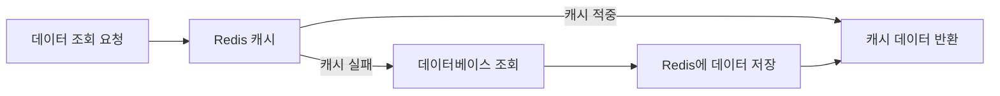
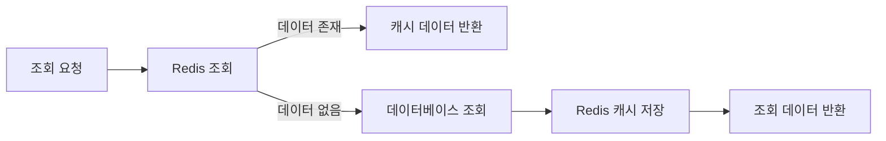
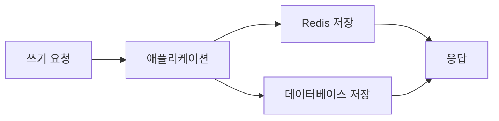
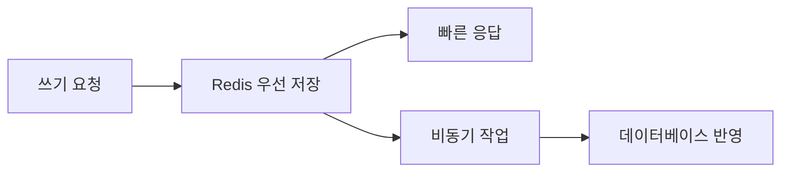
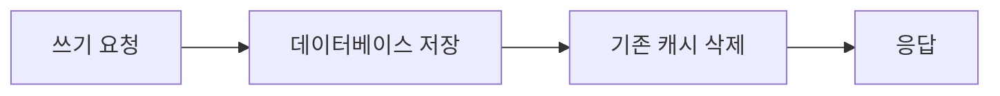
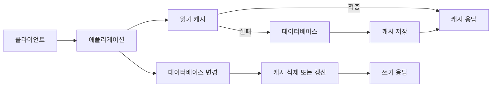

# 읽기, 쓰기 캐싱 전략 알아보기

# 읽기, 쓰기 캐싱 전략 알아보기

* toc
{:toc}

---

## 읽기와 쓰기 캐싱 전략 이해하기

캐싱은 자주 사용하는 데이터를 빠른 저장소에 임시로 저장해 데이터베이스나 외부 시스템에 반복적으로 접근하는 횟수를 줄이는 기술이다.

Redis는 메모리 기반으로 동작하기 때문에 데이터베이스보다 빠르게 값을 조회하고 저장할 수 있다. 이러한 특성을 활용하면 조회 성능을 높이고, 데이터베이스의 부하를 줄이며, 많은 요청을 안정적으로 처리할 수 있다.

하지만 Redis에 데이터를 저장하는 것만으로 캐싱이 완성되는 것은 아니다. 어떤 데이터를 캐시할지, 언제 캐시를 조회할지, 데이터가 변경되었을 때 캐시를 어떻게 처리할지까지 함께 설계해야 한다.

---

## 개념

캐시는 애플리케이션과 데이터베이스 사이에 위치하면서 자주 사용되는 데이터를 임시로 저장한다.

일반적인 조회 흐름은 다음과 같다.



캐시에 데이터가 존재하면 이를 캐시 적중이라고 한다.

```text
Cache Hit
```

반대로 캐시에 데이터가 없으면 캐시 실패라고 한다.

```text
Cache Miss
```

캐시 적중이 발생하면 데이터베이스에 접근하지 않고 Redis의 값을 바로 반환할 수 있다. 캐시 실패가 발생하면 데이터베이스에서 데이터를 조회한 뒤 Redis에 저장하고 사용자에게 반환한다.

---

## 왜 사용하는가?

### 데이터베이스 부하 감소

많은 사용자가 같은 상품 목록을 조회한다고 가정해 보자.

캐시가 없다면 모든 요청이 데이터베이스까지 전달된다.

```text
사용자 요청 1 -> 데이터베이스
사용자 요청 2 -> 데이터베이스
사용자 요청 3 -> 데이터베이스
사용자 요청 4 -> 데이터베이스
```

상품 목록처럼 자주 조회되지만 변경 빈도가 낮은 데이터라면 매번 데이터베이스에서 조회할 필요가 없다.

Redis에 한 번 저장한 뒤 이후 요청은 Redis에서 처리할 수 있다.

```text
첫 번째 요청 -> 데이터베이스 조회 -> Redis 저장
두 번째 요청 -> Redis 조회
세 번째 요청 -> Redis 조회
네 번째 요청 -> Redis 조회
```

이렇게 하면 데이터베이스에 전달되는 요청 수를 줄일 수 있다.

---

### 응답 시간 단축

Redis는 메모리 기반 저장소이므로 디스크 기반 데이터베이스보다 빠르게 데이터를 제공할 수 있다.

물론 실제 응답 시간은 네트워크, 직렬화 방식, 데이터 크기, Redis 구성 등에 따라 달라질 수 있다. 하지만 자주 조회되는 데이터를 Redis에서 바로 반환하면 데이터베이스 조회와 복잡한 조회 연산을 줄일 수 있다.

---

### 외부 시스템 호출 감소

캐싱은 내부 데이터베이스뿐만 아니라 외부 API 호출을 줄이는 데도 사용할 수 있다.

환율, 날씨, 주소 정보, 상품 추천 결과처럼 짧은 시간 동안 동일한 응답이 반복되는 데이터는 Redis에 저장할 수 있다.

```text
첫 번째 요청 -> 외부 API 호출 -> Redis 저장
두 번째 요청 -> Redis 조회
세 번째 요청 -> Redis 조회
```

외부 API는 호출 횟수 제한이나 비용이 있을 수 있기 때문에 응답 캐싱이 특히 유용하다.

---

## 주요 특징

## 읽기 캐싱

읽기 캐싱은 데이터베이스에서 자주 조회되는 데이터를 Redis에 저장하고, 이후 조회 요청을 Redis에서 처리하는 방식이다.

대표적인 사용 사례는 다음과 같다.

- 인기 상품 목록
- 상품 상세 정보
- 사용자 프로필
- 자주 조회되는 게시글
- 외부 API 응답
- 공지사항
- 설정 정보

가장 많이 사용하는 방식은 Cache Aside 패턴이다.

### Cache Aside 패턴

Cache Aside는 애플리케이션이 직접 캐시와 데이터베이스를 모두 제어하는 방식이다.

조회 순서는 다음과 같다.

1. Redis에서 데이터를 조회한다.
2. Redis에 데이터가 있으면 바로 반환한다.
3. Redis에 데이터가 없으면 데이터베이스에서 조회한다.
4. 데이터베이스에서 조회한 결과를 Redis에 저장한다.
5. 사용자에게 데이터를 반환한다.



Redis 명령어로 표현하면 다음과 같다.

```redis
GET product:1001
```

캐시에 데이터가 있는 경우 실행 결과는 다음과 같다.

```text
"{\"id\":1001,\"name\":\"Keyboard\",\"price\":30000}"
```

이 경우 데이터베이스에 접근하지 않고 Redis의 값을 사용한다.

캐시에 데이터가 없는 경우 실행 결과는 다음과 같다.

```text
(nil)
```

이 경우 애플리케이션은 데이터베이스에서 상품을 조회한 뒤 다음 명령어로 Redis에 저장한다.

```redis
SET product:1001 '{"id":1001,"name":"Keyboard","price":30000}' EX 600
```

실행 결과는 다음과 같다.

```text
OK
```

`EX 600`은 600초 후 해당 캐시를 자동으로 삭제한다는 의미이다.

### Cache Aside의 장점

Cache Aside는 애플리케이션이 캐시 사용 여부를 직접 결정할 수 있다는 장점이 있다.

- 자주 조회되는 데이터만 캐싱할 수 있다.
- 캐시가 장애를 일으켜도 데이터베이스 조회로 처리할 수 있다.
- 데이터의 만료 시간과 갱신 시점을 세밀하게 조정할 수 있다.
- Redis에 저장하지 않을 데이터와 저장할 데이터를 구분할 수 있다.

### Cache Aside의 주의점

Cache Aside는 애플리케이션에서 캐시 조회, 데이터베이스 조회, 캐시 저장 로직을 모두 구현해야 한다.

또한 여러 요청이 동시에 캐시 실패를 경험하면 같은 데이터를 데이터베이스에서 여러 번 조회할 수 있다.

```text
요청 1 -> Redis 조회 실패 -> 데이터베이스 조회
요청 2 -> Redis 조회 실패 -> 데이터베이스 조회
요청 3 -> Redis 조회 실패 -> 데이터베이스 조회
```

이러한 상황을 캐시 스탬피드라고 한다. 요청이 집중되는 데이터라면 락, 요청 병합, 사전 캐싱 등의 방법을 함께 고려할 수 있다.

---

## 쓰기 캐싱

쓰기 캐싱은 데이터를 변경할 때 Redis를 활용하는 방식이다.

읽기 캐싱은 주로 데이터베이스에서 가져온 값을 Redis에 복사하는 데 초점이 있다. 반면 쓰기 캐싱은 데이터가 변경되는 순간 Redis와 데이터베이스를 어떤 순서로 갱신할지 결정하는 것이 중요하다.

대표적인 쓰기 방식은 다음과 같다.

| 전략 | 데이터 저장 순서 | 특징 |
|---|---|---|
| Write Through | 캐시와 데이터베이스에 동기 저장 | 일관성이 높지만 쓰기 지연이 발생할 수 있음 |
| Write Back | 캐시에 먼저 저장 후 데이터베이스에 비동기 반영 | 빠르지만 데이터 유실 위험이 있음 |
| Write Around | 데이터베이스에 직접 저장 | 불필요한 캐시 저장을 줄일 수 있음 |
| Cache Invalidation | 데이터베이스 저장 후 캐시 삭제 또는 갱신 | 조회 시 최신 데이터를 다시 캐싱함 |

---

### Write Through

Write Through는 데이터를 변경할 때 Redis와 데이터베이스를 함께 갱신하는 방식이다.



예를 들어 게시글을 작성하면 Redis와 데이터베이스에 모두 저장한다.

```text
게시글 작성 요청
    -> Redis 저장
    -> 데이터베이스 저장
    -> 성공 응답
```

두 저장 작업이 모두 완료된 후 성공을 반환하면 데이터 일관성을 높일 수 있다.

다만 Redis 저장과 데이터베이스 저장을 모두 수행해야 하므로 단일 저장보다 처리 시간이 길어질 수 있다. 두 저장소 중 하나만 성공했을 때 어떻게 보정할지도 함께 설계해야 한다.

---

### Write Back

Write Back은 Redis에 먼저 저장한 뒤 데이터베이스에는 나중에 비동기로 반영하는 방식이다.



이 방식에서는 사용자의 요청에 대해 Redis 저장이 완료되면 빠르게 응답할 수 있다.

```text
쓰기 요청
    -> Redis 저장
    -> 사용자 응답
    -> 백그라운드에서 데이터베이스 반영
```

주문 처리, 조회수 증가, 실시간 카운터처럼 빠른 쓰기가 중요한 경우 사용할 수 있다.

하지만 Redis에 저장한 뒤 데이터베이스에 반영되기 전에 Redis 장애가 발생하면 데이터가 유실될 수 있다. 따라서 Write Back을 사용하려면 다음 요소를 함께 고려해야 한다.

- 데이터베이스 반영 실패 처리
- 재시도 정책
- 반영 대기 중인 데이터 추적
- Redis 장애 시 복구 방법
- 중복 반영 방지
- 데이터베이스 반영 완료 여부 확인

Redis에 저장하는 것만으로 데이터베이스까지 자동으로 동기화되는 것은 아니다. 애플리케이션이나 별도의 작업 프로세스가 데이터베이스 반영을 담당해야 한다.

---

### Write Around

Write Around는 변경 데이터를 Redis에 저장하지 않고 데이터베이스에 직접 저장하는 방식이다.



쓰기 직후 바로 조회되지 않을 가능성이 높은 데이터라면 캐시에 저장하지 않는 것이 효율적일 수 있다.

예를 들어 게시글을 작성한 뒤 한동안 다시 조회되지 않는다면, 작성 시점에 Redis까지 저장하는 것은 불필요한 캐시 사용이 될 수 있다. 이 경우 데이터베이스에 저장하고 기존 캐시만 삭제한 뒤, 다음 조회 요청에서 캐시를 생성한다.

---

### 캐시 삭제와 갱신

데이터베이스의 값을 변경한 뒤 Redis에 이전 값이 남아 있으면 오래된 데이터가 반환될 수 있다.

이를 해결하는 방법은 크게 두 가지이다.

#### 캐시 갱신

데이터베이스 변경 후 Redis에도 새로운 값을 저장한다.

```redis
SET product:1001 '{"id":1001,"name":"Keyboard","price":35000}' EX 600
```

캐시 갱신 방식은 다음 조회 요청에서 바로 최신 값을 제공할 수 있다.

#### 캐시 삭제

데이터베이스 변경 후 기존 캐시를 삭제한다.

```redis
DEL product:1001
```

실행 결과는 다음과 같다.

```text
(integer) 1
```

이후 다음 조회 요청이 들어오면 Cache Aside 흐름에 따라 데이터베이스에서 최신 값을 조회하고 Redis에 다시 저장한다.

캐시 삭제 방식은 갱신할 데이터의 구조가 복잡하거나 여러 캐시 키를 함께 관리해야 할 때 상대적으로 단순하게 적용할 수 있다.

---

## 예제

상품 상세 정보를 Cache Aside 방식으로 조회하는 흐름은 다음과 같다.

```text
1. Redis에서 product:1001 조회
2. 값이 있으면 캐시 데이터 반환
3. 값이 없으면 데이터베이스 조회
4. 데이터베이스 결과를 Redis에 저장
5. 사용자에게 상품 정보 반환
```

Redis 명령어로 확인하면 다음과 같다.

```redis
GET product:1001
```

캐시 실패 결과:

```text
(nil)
```

데이터베이스 조회 후 캐시 저장:

```redis
SET product:1001 '{"id":1001,"name":"Keyboard","price":30000,"stock":50}' EX 600
```

다시 조회:

```redis
GET product:1001
```

실행 결과:

```text
"{\"id\":1001,\"name\":\"Keyboard\",\"price\":30000,\"stock\":50}"
```

캐시 만료 시간은 다음과 같이 확인할 수 있다.

```redis
TTL product:1001
```

실행 결과는 다음과 같다.

```text
(integer) 580
```

캐시를 강제로 삭제하려면 다음 명령어를 사용한다.

```redis
DEL product:1001
```

실행 결과는 다음과 같다.

```text
(integer) 1
```

`DEL`의 결과가 1이면 해당 키가 삭제된 것이고, 0이면 삭제할 키가 존재하지 않았다는 의미이다.

---

## 구조

읽기 캐싱과 쓰기 캐싱을 하나의 서비스에서 함께 사용하는 경우 다음과 같은 흐름으로 구성할 수 있다.



조회 요청은 Redis를 먼저 확인하고, 캐시 실패가 발생했을 때만 데이터베이스를 조회한다.

쓰기 요청은 데이터베이스를 변경한 뒤 캐시를 삭제하거나 새로운 값으로 갱신한다. 중요한 점은 데이터 변경 작업과 캐시 처리의 순서를 일관되게 유지하는 것이다.

---

## 실무에서의 활용

### TTL을 반드시 고려한다

캐시 데이터에는 유효 시간이 필요하다.

```redis
SET notice:latest '{"title":"System maintenance","content":"Maintenance at 02:00"}' EX 300
```

공지사항처럼 짧은 시간 동안만 최신 상태를 유지하면 되는 데이터는 300초 동안만 캐시하도록 설정할 수 있다.

TTL이 너무 짧으면 캐시 실패가 자주 발생해 데이터베이스 조회가 증가한다. 반대로 TTL이 너무 길면 오래된 데이터가 사용자에게 제공될 수 있다.

| TTL 설정 | 장점 | 주의점 |
|---|---|---|
| 짧은 TTL | 최신 데이터에 가까움 | 캐시 실패와 데이터베이스 조회 증가 |
| 긴 TTL | 캐시 적중률 증가 | 오래된 데이터가 남을 가능성 |
| TTL 없음 | 만료에 따른 재조회 없음 | 메모리 증가와 오래된 데이터 문제 |

---

### 캐시 적중률을 확인한다

캐시 적중률은 전체 요청 중 캐시에서 데이터를 반환한 비율이다.

```text
캐시 적중률 = 캐시 적중 횟수 / 전체 조회 횟수 * 100
```

예를 들어 전체 조회 요청이 10,000건이고 그중 8,500건이 Redis에서 처리되었다면 캐시 적중률은 85%이다.

```text
8,500 / 10,000 * 100 = 85%
```

캐시 적중률이 낮다면 다음 내용을 확인해야 한다.

- 캐시 TTL이 지나치게 짧은지
- 조회 요청마다 키가 다르게 생성되는지
- 실제로 반복 조회되는 데이터인지
- 캐시가 너무 자주 삭제되는지
- 캐시 저장이 실패하고 있는지
- 데이터 크기가 너무 커서 저장을 피하고 있는지

캐시를 적용했다고 해서 항상 성능이 향상되는 것은 아니다. 조회 패턴과 데이터 변경 빈도를 기준으로 캐시 효과를 확인해야 한다.

---

### 오래된 데이터 문제를 관리한다

데이터베이스와 Redis의 값이 달라지는 상황을 캐시 불일치라고 한다.

```text
데이터베이스 = price: 35000
Redis       = price: 30000
```

이 상태에서 Redis의 값이 반환되면 사용자는 오래된 가격을 보게 된다.

이를 줄이기 위한 대표적인 방법은 다음과 같다.

- 데이터 변경 직후 캐시 갱신
- 데이터 변경 직후 캐시 삭제
- TTL 설정
- 변경 이벤트를 이용한 캐시 무효화
- 중요한 데이터에 대한 원본 데이터베이스 재검증

모든 데이터에 동일한 전략을 적용할 필요는 없다. 가격, 재고, 결제 상태처럼 정확성이 중요한 데이터는 캐시의 역할과 만료 시간을 더 신중하게 결정해야 한다.

---

### 여러 캐시 키를 함께 관리한다

하나의 상품 정보가 여러 캐시 키에 저장될 수 있다.

```text
product:1001
product:list:popular
product:list:category:keyboard
```

상품 가격이 변경되었는데 상세 정보 캐시만 삭제하고 인기 상품 목록 캐시를 삭제하지 않으면 서로 다른 화면에서 다른 가격이 표시될 수 있다.

따라서 데이터 변경 시 어떤 캐시 키가 영향을 받는지 정리해야 한다.

| 변경 데이터 | 삭제 또는 갱신해야 할 캐시 |
|---|---|
| 상품명 변경 | 상품 상세, 상품 검색 결과 |
| 상품 가격 변경 | 상품 상세, 인기 상품 목록, 장바구니 관련 캐시 |
| 카테고리 변경 | 상품 상세, 카테고리 목록 |
| 게시글 수정 | 게시글 상세, 게시글 목록 |

캐시 키를 설계할 때부터 연관된 키를 추적할 수 있도록 규칙을 정해두는 것이 좋다.

---

### 캐시 장애를 고려한다

Redis를 캐시로 사용하는 경우 Redis에 문제가 발생해도 원본 데이터베이스를 통해 서비스를 계속 처리할 수 있도록 설계하는 것이 일반적이다.

다만 Redis 장애가 발생하면 모든 요청이 데이터베이스로 몰릴 수 있다. 이 상황에서는 데이터베이스에도 추가 부하가 발생할 수 있으므로 다음과 같은 대응을 고려해야 한다.

- 캐시 연결 실패 시 데이터베이스 조회로 전환
- 데이터베이스 조회 timeout 설정
- 요청 수 제한
- 중요하지 않은 기능의 임시 차단
- 자주 사용하는 데이터의 사전 저장
- Redis 복제와 장애 조치 구성

Redis 캐시를 추가하는 것은 단순히 저장소 하나를 추가하는 작업이 아니다. 캐시가 정상일 때와 장애가 발생했을 때의 요청 흐름을 모두 설계해야 한다.

---

## 정리

읽기 캐싱은 자주 조회되는 데이터를 Redis에 저장해 데이터베이스 접근을 줄이는 전략이다. 가장 일반적인 Cache Aside 방식은 Redis를 먼저 조회하고, 캐시 실패가 발생했을 때 데이터베이스에서 조회한 뒤 Redis에 저장한다.

쓰기 캐싱은 데이터 변경 시 Redis와 데이터베이스를 어떤 순서로 갱신할지 결정하는 전략이다. Write Through는 캐시와 데이터베이스를 함께 갱신하고, Write Back은 Redis에 먼저 저장한 뒤 데이터베이스에 비동기로 반영한다. Write Around는 데이터베이스에 직접 저장하고 필요할 때 캐시를 생성한다.

캐싱을 사용할 때는 데이터 일관성, TTL, 캐시 적중률, 캐시 키 관리, Redis 장애 상황을 함께 고려해야 한다.

특히 Redis에 값을 저장하는 것보다 중요한 것은 데이터가 변경되었을 때 오래된 캐시를 어떻게 삭제하거나 갱신할지 결정하는 것이다. 캐시는 데이터베이스를 대체하는 저장소가 아니라 데이터베이스 접근을 줄이기 위한 보조 저장소라는 점도 기억해야 한다.

---

### 한 줄 요약

읽기 캐싱은 Redis에서 먼저 조회하고 쓰기 캐싱은 데이터 변경 후 캐시를 관리하며, TTL과 캐시 무효화 정책까지 함께 설계해야 안정적으로 사용할 수 있다.
