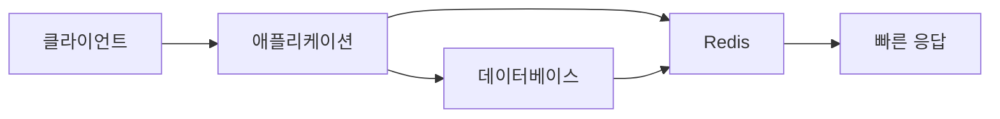
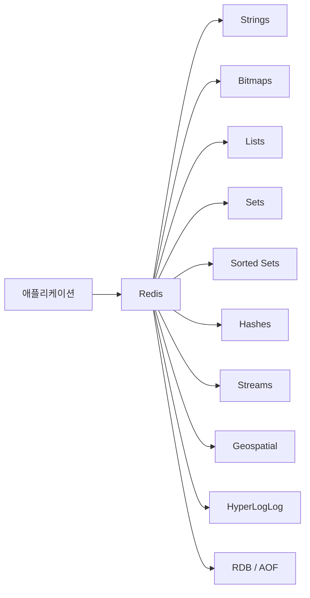
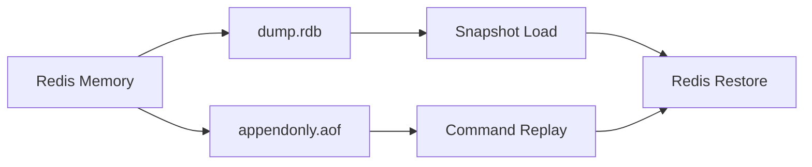

# 맛있게 복습하고 정리하기

# 맛있게 복습하고 정리하기

* toc
{:toc}

---

## Redis의 핵심 자료형과 영속성 정책 복습하기

Redis는 단순히 문자열을 저장하는 캐시가 아니다. 문자열, 리스트, 집합, 정렬된 집합, 해시, 스트림 등 다양한 자료형을 제공하며, 각각의 자료형은 특정 문제를 해결하는 데 적합하다.

또한 메모리 기반 데이터 저장소이지만 RDB와 AOF를 통해 데이터를 디스크에 저장할 수 있다. 따라서 캐시뿐만 아니라 세션 저장소, 대기열, 실시간 순위표, 이벤트 처리 시스템 등 다양한 용도로 활용할 수 있다.

---

## 개념

Redis의 핵심은 데이터를 키와 값의 형태로 저장하는 것이다.

```text
Key   = user:1001
Value = Alice
```

가장 기본적인 문자열 저장은 다음과 같이 사용할 수 있다.

```redis
SET user:1001:name "Alice"
GET user:1001:name
```

실행 결과는 다음과 같다.

```text
OK
"Alice"
```

`SET`은 키에 값을 저장하고, `GET`은 저장된 값을 조회한다.

Redis는 값의 자료형에 따라 내부적으로 다른 자료구조를 사용한다. 따라서 데이터의 성격에 맞는 자료형을 선택해야 명령어를 효율적으로 사용할 수 있다.

| 자료형 | 적합한 데이터 |
|---|---|
| Strings | 문자열, 숫자, JSON, 토큰, 카운터 |
| Bitmaps | 출석 여부, 기능 활성화 여부, 로그인 여부 |
| Lists | 큐, 스택, 최근 조회 목록 |
| Sets | 중복 없는 집합, 태그, 관계 데이터 |
| Sorted Sets | 순위표, 우선순위 큐, 점수 기반 정렬 |
| Hashes | 사용자, 상품과 같은 객체의 필드 |
| Streams | 이벤트 로그, 메시지 스트림 |
| Geospatial | 위치 좌표와 주변 검색 |
| HyperLogLog | 고유 방문자 수 추정 |

---

## 왜 사용하는가?

Redis를 사용하는 가장 큰 이유는 메모리 기반으로 동작하기 때문에 빠른 응답이 가능하다는 점이다.

데이터베이스에서 매번 동일한 데이터를 조회하면 데이터베이스에 반복적인 부하가 발생한다. 이때 자주 조회되는 데이터를 Redis에 저장하면 데이터베이스에 접근하지 않고 Redis에서 바로 응답할 수 있다.



Redis는 캐시 외에도 다음과 같은 문제를 해결하는 데 사용한다.

- 로그인 세션 저장
- 인증 토큰 관리
- API 호출 횟수 제한
- 실시간 인기 검색어
- 작업 대기열
- 이벤트 스트림 처리
- 사용자별 중복 데이터 제거
- 주변 매장 검색
- 일일 방문자 수 추정

다만 모든 데이터를 Redis에 저장하는 것은 적절하지 않다. Redis는 메모리를 사용하므로 저장할 데이터의 크기와 만료 정책을 함께 설계해야 한다.

---

## 주요 특징

### Strings

Strings는 Redis에서 가장 기본이 되는 자료형이다.

문자열뿐만 아니라 숫자와 JSON 형태의 데이터도 저장할 수 있다.

```redis
SET user:1001:name "Alice"
GET user:1001:name
```

실행 결과는 다음과 같다.

```text
OK
"Alice"
```

숫자를 저장하면 카운터처럼 사용할 수 있다.

```redis
SET page:view:count 100
INCR page:view:count
GET page:view:count
```

실행 결과는 다음과 같다.

```text
OK
(integer) 101
"101"
```

`INCR`은 값을 1 증가시키는 명령어이다. 방문자 수, 좋아요 수, 재고 수량과 같은 숫자 데이터를 처리할 때 사용할 수 있다.

만료 시간을 지정한 캐시도 Strings로 저장할 수 있다.

```redis
SET product:1001 '{"name":"Keyboard","price":30000}' EX 3600
GET product:1001
TTL product:1001
```

실행 결과는 다음과 같다.

```text
OK
"{\"name\":\"Keyboard\",\"price\":30000}"
(integer) 3599
```

`EX 3600`은 3,600초 후 키가 자동으로 삭제되도록 설정한다. `TTL`은 키가 만료될 때까지 남은 시간을 초 단위로 확인한다.

---

### Bitmaps

Bitmap은 문자열의 각 비트를 이용해 0 또는 1 상태를 저장하는 자료형이다.

사용자의 출석 여부, 특정 기능의 활성화 여부, 로그인 여부처럼 참과 거짓으로 표현할 수 있는 데이터를 저장할 때 적합하다.

```redis
SETBIT attendance:2026-07-15 1001 1
GETBIT attendance:2026-07-15 1001
```

실행 결과는 다음과 같다.

```text
(integer) 0
(integer) 1
```

`1001`은 비트의 위치이며, 마지막 값인 `1`은 해당 사용자가 출석했다는 의미이다.

다른 사용자의 출석 여부는 같은 키에서 다른 위치에 저장할 수 있다.

```redis
SETBIT attendance:2026-07-15 1002 1
SETBIT attendance:2026-07-15 1003 0
BITCOUNT attendance:2026-07-15
```

실행 결과는 다음과 같다.

```text
(integer) 0
(integer) 1
(integer) 2
```

`BITCOUNT`는 1로 설정된 비트의 개수를 계산한다. 날짜별 출석 인원이나 특정 기능을 활성화한 사용자 수를 빠르게 계산할 수 있다.

---

### Lists

List는 입력된 순서가 유지되는 자료형이다. 왼쪽 또는 오른쪽에서 데이터를 넣고 꺼낼 수 있기 때문에 큐와 스택을 구현할 때 사용할 수 있다.

```redis
LPUSH task:queue "task-1"
LPUSH task:queue "task-2"
RPUSH task:queue "task-3"
LRANGE task:queue 0 -1
```

실행 결과는 다음과 같다.

```text
(integer) 1
(integer) 2
(integer) 3
1) "task-2"
2) "task-1"
3) "task-3"
```

`LPUSH`는 리스트의 왼쪽에 데이터를 추가하고, `RPUSH`는 오른쪽에 데이터를 추가한다. `LRANGE 0 -1`은 리스트의 전체 데이터를 조회한다.

큐처럼 사용하려면 한쪽에서 넣고 반대쪽에서 꺼내면 된다.

```redis
RPUSH task:queue "task-1"
RPUSH task:queue "task-2"
LPOP task:queue
```

실행 결과는 다음과 같다.

```text
(integer) 1
(integer) 2
"task-1"
```

List는 간단한 작업 대기열에는 적합하지만, 메시지 처리 이력이나 소비자별 처리 상태를 관리해야 한다면 Streams를 사용하는 것이 더 적합하다.

---

### Sets

Set은 중복을 허용하지 않는 집합 자료형이다.

```redis
SADD user:1001:tags "redis"
SADD user:1001:tags "database"
SADD user:1001:tags "redis"
SMEMBERS user:1001:tags
```

실행 결과는 다음과 같다.

```text
(integer) 1
(integer) 1
(integer) 0
1) "database"
2) "redis"
```

같은 `redis` 값을 두 번 추가했지만 두 번째 추가 결과는 0이다. 이미 존재하는 값이기 때문에 중복으로 저장되지 않는다.

Set은 다음과 같은 기능에 사용할 수 있다.

- 사용자별 관심 태그
- 특정 그룹에 속한 사용자
- 중복 제거
- 팔로워와 팔로잉 관계
- 두 집합의 교집합과 차집합 계산

```redis
SADD group:a user:1 user:2 user:3
SADD group:b user:2 user:3 user:4
SINTER group:a group:b
SUNION group:a group:b
SDIFF group:a group:b
```

실행 결과는 다음과 같다.

```text
1) "user:2"
2) "user:3"

1) "user:1"
2) "user:2"
3) "user:3"
4) "user:4"

1) "user:1"
```

`SINTER`는 교집합, `SUNION`은 합집합, `SDIFF`는 차집합을 반환한다.

---

### Sorted Sets

Sorted Set은 각 값에 점수를 함께 저장하고 점수 기준으로 정렬하는 자료형이다.

```redis
ZADD ranking 100 user:1001
ZADD ranking 250 user:1002
ZADD ranking 180 user:1003
ZRANGE ranking 0 -1 WITHSCORES
```

실행 결과는 다음과 같다.

```text
(integer) 1
(integer) 1
(integer) 1
1) "user:1001"
2) "100"
3) "user:1003"
4) "180"
5) "user:1002"
6) "250"
```

점수가 낮은 순서로 조회되며, 높은 순위부터 조회하려면 `ZREVRANGE`를 사용한다.

```redis
ZREVRANGE ranking 0 2 WITHSCORES
```

실행 결과는 다음과 같다.

```text
1) "user:1002"
2) "250"
3) "user:1003"
4) "180"
5) "user:1001"
6) "100"
```

Sorted Set은 실시간 순위표, 인기 검색어, 우선순위가 있는 작업 목록에 적합하다.

Set과 Sorted Set의 차이는 점수의 유무이다.

| 구분 | Set | Sorted Set |
|---|---|---|
| 중복 허용 | 허용하지 않음 | 멤버 중복은 허용하지 않음 |
| 점수 저장 | 저장하지 않음 | 멤버별 점수 저장 |
| 정렬 | 기본 정렬 없음 | 점수 기준 정렬 |
| 주요 용도 | 태그, 관계, 중복 제거 | 순위, 우선순위, 점수 정렬 |

---

### Hashes

Hash는 하나의 키 안에 여러 필드와 값을 저장하는 자료형이다.

사용자나 상품처럼 여러 속성을 가진 객체를 저장할 때 적합하다.

```redis
HSET user:1001 name "Alice" email "alice@example.com" age 30
HGET user:1001 name
HGETALL user:1001
```

실행 결과는 다음과 같다.

```text
(integer) 3
"Alice"
1) "name"
2) "Alice"
3) "email"
4) "alice@example.com"
5) "age"
6) "30"
```

Hash를 사용하면 사용자 정보를 하나의 키로 관리할 수 있다.

```text
user:1001
  name  = Alice
  email = alice@example.com
  age   = 30
```

필드 하나만 수정할 때도 전체 객체를 다시 저장할 필요가 없다.

```redis
HINCRBY user:1001 age 1
HSET user:1001 email "alice@new-example.com"
```

다만 Hash에 너무 많은 필드를 저장하거나 객체의 변경 단위가 복잡해지면 관리가 어려워질 수 있다. 자주 함께 조회되고 변경되는 필드 중심으로 구성하는 것이 좋다.

---

### Streams

Streams는 시간 순서에 따라 이벤트를 저장하는 자료형이다.

```redis
XADD order-events * userId 1001 productId 2001 status CREATED
```

실행 결과는 다음과 같다.

```text
"1721040000000-0"
```

`*`는 Redis가 이벤트 ID를 자동으로 생성하도록 한다.

저장된 이벤트를 조회할 수 있다.

```redis
XREAD COUNT 10 STREAMS order-events 0-0
```

실행 결과는 다음과 같은 형태이다.

```text
1) 1) "order-events"
   2) 1) 1) "1721040000000-0"
         2) 1) "userId"
            2) "1001"
            3) "productId"
            4) "2001"
            5) "status"
            6) "CREATED"
```

Streams는 단순한 큐와 달리 이벤트가 기록으로 남는다. 따라서 여러 소비자가 같은 이벤트를 읽거나, 특정 시점 이후의 이벤트를 다시 처리하는 구조를 만들 수 있다.

List와 Streams는 모두 대기열처럼 사용할 수 있지만 목적이 다르다.

| 구분 | Lists | Streams |
|---|---|---|
| 데이터 구조 | 단순한 순서 목록 | 이벤트 로그 |
| 메시지 ID | 별도 관리 필요 | 자동 생성 |
| 처리 이력 | 직접 구현해야 함 | 이벤트 자체가 남음 |
| 소비자 그룹 | 지원하지 않음 | 지원 |
| 적합한 용도 | 단순 작업 큐 | 이벤트 처리와 메시징 |

---

### Geospatial

Geospatial은 경도와 위도 정보를 저장하고 거리 기반 검색을 수행하는 자료형이다.

```redis
GEOADD stores 126.9780 37.5665 store:1001
GEOADD stores 127.0276 37.4979 store:1002
```

실행 결과는 다음과 같다.

```text
(integer) 1
(integer) 1
```

저장된 위치의 좌표는 `GEOPOS`로 확인할 수 있다.

```redis
GEOPOS stores store:1001
```

실행 결과는 다음과 같다.

```text
1) 1) "126.9780"
   2) "37.5665"
```

특정 위치에서 일정 거리 안에 있는 매장을 검색할 수도 있다.

```redis
GEOSEARCH stores FROMLONLAT 126.9780 37.5665 BYRADIUS 5 km WITHDIST
```

실행 결과는 다음과 같은 형태이다.

```text
1) 1) "store:1001"
   2) "0.0000"
```

경도와 위도는 순서를 바꾸면 안 된다. Redis의 위치 명령어는 항상 경도, 위도 순서로 값을 입력한다.

---

### HyperLogLog

HyperLogLog는 정확한 목록을 저장하지 않고 고유한 값의 개수를 메모리 효율적으로 추정하는 자료형이다.

```redis
PFADD visitors:2026-07-15 user:1001
PFADD visitors:2026-07-15 user:1002
PFADD visitors:2026-07-15 user:1001
PFCOUNT visitors:2026-07-15
```

실행 결과는 다음과 같다.

```text
(integer) 1
(integer) 1
(integer) 0
(integer) 2
```

`PFADD`는 값을 추가하고, 이미 추가된 값이면 0을 반환한다. `PFCOUNT`는 고유한 값의 개수를 추정한다.

HyperLogLog는 정확한 사용자 목록이 필요한 경우에는 적합하지 않다. 고유 방문자 수나 이벤트 참여자 수처럼 개수만 필요하고 약간의 오차를 허용할 수 있는 경우에 사용한다.

---

## 예제

다음은 여러 Redis 자료형을 활용해 방문자와 상품 정보를 관리하는 예제이다.

```redis
SET product:1001:name "Keyboard"
SET product:1001:price 30000
EXPIRE product:1001:name 3600
EXPIRE product:1001:price 3600

HSET product:1001 name "Keyboard" price 30000 stock 50

SETBIT attendance:2026-07-15 1001 1

SADD product:1001:tags "computer"
SADD product:1001:tags "input-device"

ZADD product:1001:views 150 user:1001
ZADD product:1001:views 200 user:1002

XADD product-events * productId 1001 event VIEWED userId 1001

PFADD product:1001:visitors user:1001
PFADD product:1001:visitors user:1002
PFCOUNT product:1001:visitors
```

각 데이터는 목적에 따라 다른 자료형으로 저장된다.

- 상품명과 가격은 Strings로 저장한다.
- 상품의 여러 속성은 Hashes로 관리한다.
- 출석 여부는 Bitmap으로 저장한다.
- 상품 태그는 Set으로 저장한다.
- 사용자별 조회 점수는 Sorted Set으로 저장한다.
- 상품 조회 이벤트는 Streams에 기록한다.
- 고유 방문자 수는 HyperLogLog로 추정한다.

하나의 시스템에서도 데이터의 성격에 따라 여러 자료형을 함께 사용하는 것이 일반적이다.

---

## 구조

Redis에서 애플리케이션 요청이 자료형과 영속성 정책으로 연결되는 구조는 다음과 같다.



Redis의 메모리 데이터는 설정된 영속성 정책에 따라 디스크에 저장된다.



RDB는 특정 시점의 메모리 상태를 저장하고, AOF는 Redis에서 실행된 명령을 기록한다.

### RDB

RDB는 일정 조건이 충족되면 메모리의 전체 상태를 하나의 스냅샷 파일로 저장한다.

```conf
save 60 10000
```

위 설정은 60초 동안 10,000개 이상의 변경이 발생하면 RDB 스냅샷을 생성한다는 의미이다.

RDB의 특징은 다음과 같다.

- 스냅샷 형태로 저장한다.
- 복구 시 파일을 읽어 빠르게 로드할 수 있다.
- 파일 크기가 상대적으로 작다.
- 마지막 스냅샷 이후의 데이터는 손실될 수 있다.
- 스냅샷 생성 시 디스크에 저장하는 작업이 발생한다.

### AOF

AOF는 Redis에서 실행된 변경 명령을 파일에 기록한다.

```conf
appendonly yes
appendfsync everysec
```

`appendonly yes`는 AOF 기능을 활성화한다.

`appendfsync everysec`는 변경 명령을 최대 1초 단위로 디스크에 반영한다. 일반적으로 성능과 데이터 보호 수준 사이의 균형을 맞추기 위해 사용할 수 있다.

AOF의 특징은 다음과 같다.

- 변경 명령을 기록한다.
- Redis 재시작 시 기록된 명령을 다시 실행해 데이터를 복구한다.
- RDB보다 최근 데이터까지 복구할 수 있다.
- 명령 기록이 계속 누적될 수 있다.
- AOF 재작성으로 파일 크기를 줄일 수 있다.

### RDB와 AOF 비교

| 구분 | RDB | AOF |
|---|---|---|
| 저장 방식 | 메모리 스냅샷 | 변경 명령 기록 |
| 파일 | `dump.rdb` | `appendonly.aof` |
| 복구 방식 | 스냅샷 로드 | 명령 재실행 |
| 복구 속도 | 빠른 편 | 기록량에 따라 달라짐 |
| 데이터 손실 가능성 | 마지막 스냅샷 이후 손실 가능 | 설정된 동기화 주기에 따라 손실 가능 |
| 파일 크기 | 상대적으로 작음 | 상대적으로 커질 수 있음 |
| 적합한 용도 | 빠른 전체 복구 | 최근 변경 데이터 보호 |

두 정책은 서로 대체 관계라기보다 보완 관계로 사용할 수 있다.

```conf
appendonly yes
appendfsync everysec
save 60 10000
```

이렇게 설정하면 RDB로 빠른 전체 복구 지점을 확보하고, AOF로 최근 변경 내역을 보완할 수 있다.

---

## 실무에서의 활용

### 캐시 키에는 만료 시간을 설정한다

캐시는 영구 데이터가 아니므로 만료 시간을 함께 설정하는 것이 좋다.

```redis
SET cache:user:1001 '{"name":"Alice"}' EX 1800
TTL cache:user:1001
```

실행 결과는 다음과 같다.

```text
OK
(integer) 1799
```

만료 시간이 없는 캐시는 계속 메모리를 점유할 수 있다. 특히 사용자별 조회 결과나 외부 API 응답을 저장할 때는 데이터의 유효 시간을 기준으로 TTL을 설정해야 한다.

---

### 키 이름은 일관된 규칙을 사용한다

다음처럼 콜론을 기준으로 계층적인 키 이름을 구성하면 관리하기 쉽다.

```text
user:1001
user:1001:profile
user:1001:session
product:1001
product:1001:tags
order:202607150001
```

키 이름에 도메인과 식별자를 포함하면 운영 중 특정 데이터만 조회하거나 삭제하기 편리하다.

---

### 자료형의 목적을 섞지 않는다

순위 데이터를 Strings로 저장하고 애플리케이션에서 직접 정렬하면 불필요한 네트워크 전송과 애플리케이션 연산이 발생한다.

이런 경우에는 Sorted Set을 사용하는 것이 더 적합하다.

반대로 정확한 고유 사용자 목록이 필요한데 HyperLogLog를 사용하면 원본 목록을 확인할 수 없다. HyperLogLog는 개수 추정만 필요할 때 사용해야 한다.

---

### List와 Streams를 구분한다

단순히 작업을 하나씩 꺼내 처리하는 구조라면 List를 사용할 수 있다.

반면 다음 요구사항이 있다면 Streams가 더 적합하다.

- 이벤트를 여러 소비자가 읽어야 하는 경우
- 처리되지 않은 메시지를 추적해야 하는 경우
- 특정 시점 이후의 이벤트를 다시 읽어야 하는 경우
- 소비자 그룹별 처리 상태가 필요한 경우

자료형을 선택할 때는 명령어의 편리함보다 데이터의 생명주기와 처리 방식을 먼저 확인해야 한다.

---

### RDB와 AOF의 조합을 고려한다

Redis가 단순 캐시라면 데이터가 삭제되어도 원본 데이터베이스에서 다시 생성할 수 있기 때문에 영속성 설정이 중요하지 않을 수 있다.

하지만 세션, 작업 큐, 이벤트 로그처럼 유실되면 안 되는 데이터가 저장된다면 RDB와 AOF를 함께 사용하는 방식을 고려해야 한다.

다만 Redis를 데이터베이스의 완전한 대체재로 사용하는 것은 별도의 검토가 필요하다. 영속성 정책을 활성화하더라도 장애 시점, 디스크 상태, 복제 구성에 따라 복구 결과가 달라질 수 있기 때문이다.

---

## 정리

Redis는 하나의 자료형만 사용하는 저장소가 아니라 데이터의 특성에 맞는 자료구조를 선택할 수 있는 메모리 기반 데이터 저장소이다.

Strings는 캐시와 카운터에 적합하고, Bitmaps는 0과 1 상태를 메모리 효율적으로 관리할 때 사용할 수 있다. Lists는 단순한 큐와 스택에 적합하며, Sets는 중복 제거와 집합 연산에 사용한다.

Sorted Sets는 점수 기반 순위와 우선순위 처리에 적합하고, Hashes는 객체 형태의 데이터를 저장할 때 유용하다. Streams는 이벤트 로그와 메시지 처리에 사용할 수 있으며, Geospatial은 위치 검색, HyperLogLog는 고유 개수 추정에 사용할 수 있다.

영속성 측면에서는 RDB가 특정 시점의 스냅샷을 저장하고, AOF가 변경 명령을 기록한다. 빠른 복구와 최근 데이터 보호를 함께 고려해야 한다면 두 정책을 조합할 수 있다.

결국 Redis를 잘 사용하기 위해서는 단순히 명령어를 외우는 것보다 데이터의 특성과 처리 목적에 맞는 자료형과 저장 정책을 선택하는 것이 중요하다.

---

### 한 줄 요약

Redis는 데이터의 성격에 맞는 자료형을 선택하고 RDB와 AOF를 적절히 조합해 캐시, 큐, 순위, 이벤트, 위치 검색까지 처리할 수 있는 메모리 기반 데이터 저장소이다.
