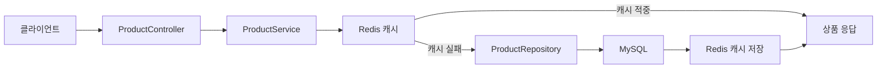
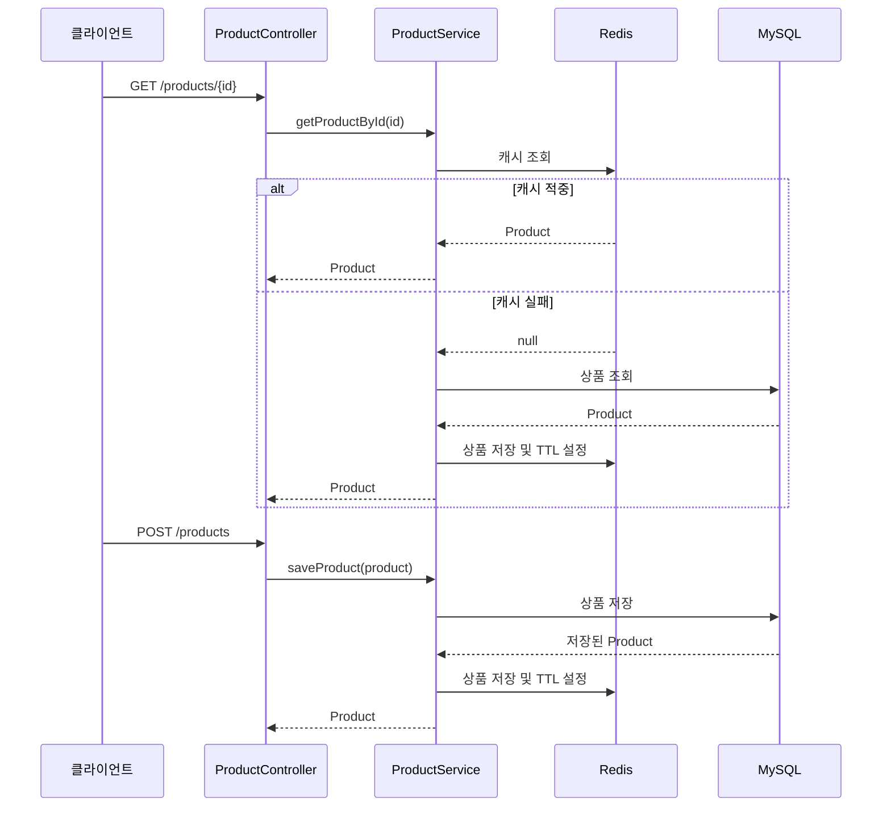

# 읽기, 쓰기 캐싱 전략 적용해보기

# 읽기, 쓰기 캐싱 전략 적용해보기

* toc
{:toc}

---

## Spring Boot와 Redis로 읽기, 쓰기 캐싱 적용하기

Redis를 캐시로 사용하는 가장 기본적인 방법은 데이터베이스에서 조회한 데이터를 Redis에 저장하고, 이후 요청부터 Redis의 값을 먼저 확인하는 것이다.

상품 조회를 예로 들면 다음과 같은 구조가 된다.

```text
상품 조회 요청
    -> Redis 조회
    -> 캐시가 있으면 Redis 데이터 반환
    -> 캐시가 없으면 MySQL 조회
    -> 조회 결과를 Redis에 저장
    -> 상품 데이터 반환
```

상품을 저장할 때는 먼저 MySQL에 저장하고, 저장에 성공한 상품을 Redis에도 저장한다.

---

## 개념

이번 구현에서는 다음과 같은 기술을 사용한다.

| 구성 요소 | 역할 |
|---|---|
| Spring Boot | 애플리케이션 실행 |
| Spring Data JPA | MySQL 데이터 저장과 조회 |
| MySQL | 상품 원본 데이터 저장 |
| Redis Cluster | 상품 캐시 저장 |
| RedisTemplate | Spring Boot에서 Redis 명령어 실행 |
| Lombok | 반복적인 Java 코드 감소 |
| Docker Compose | MySQL과 Redis 실행 |

캐시의 원본 데이터는 MySQL에 저장하고, 빠른 조회를 위한 복사본을 Redis에 저장한다.



Redis는 원본 데이터를 보관하는 데이터베이스가 아니라 조회 성능을 높이기 위한 캐시로 사용한다. 따라서 Redis에 데이터가 없더라도 MySQL에서 다시 조회할 수 있어야 한다.

---

## 왜 사용하는가?

### 데이터베이스 조회 횟수 감소

상품 상세 조회가 반복적으로 발생하면 모든 요청이 MySQL까지 전달될 수 있다.

```text
요청 1 -> MySQL
요청 2 -> MySQL
요청 3 -> MySQL
요청 4 -> MySQL
```

Redis 캐시를 적용하면 최초 조회 이후의 요청은 Redis에서 처리할 수 있다.

```text
요청 1 -> Redis 실패 -> MySQL 조회 -> Redis 저장
요청 2 -> Redis 적중
요청 3 -> Redis 적중
요청 4 -> Redis 적중
```

상품 상세 정보처럼 자주 조회되고 변경 빈도가 낮은 데이터는 캐시 적용 효과가 크다.

---

### 응답 속도 향상

Redis는 메모리에서 데이터를 조회하기 때문에 MySQL에 복잡한 조회를 수행하는 것보다 빠르게 응답할 수 있다.

특히 다음과 같은 데이터에 캐시를 적용할 수 있다.

- 상품 상세 정보
- 인기 상품 목록
- 사용자 프로필
- 게시글 상세 정보
- 공지사항
- 외부 API 응답

다만 데이터가 자주 변경되거나 요청마다 값이 달라지는 데이터는 캐시 효율이 낮을 수 있다.

---

### 쓰기 이후 즉시 캐시 활용

상품을 저장한 직후 해당 상품을 다시 조회하는 요청이 들어올 수 있다.

이때 MySQL에 저장한 상품을 Redis에도 함께 저장하면 다음 조회에서 다시 MySQL을 조회하지 않아도 된다.

```text
상품 저장 요청
    -> MySQL 저장
    -> 저장된 상품을 Redis에 저장
    -> 저장 결과 반환
```

---

## 주요 특징

### Spring Data JPA 의존성

Spring Data JPA는 `Product` 엔티티를 MySQL에 저장하고 조회하는 역할을 한다.

```gradle
implementation 'org.springframework.boot:spring-boot-starter-data-jpa'
runtimeOnly 'com.mysql:mysql-connector-j'
```

`spring-boot-starter-data-jpa`는 JPA와 Hibernate를 포함한다. `mysql-connector-j`는 MySQL에 연결하기 위한 JDBC 드라이버이다.

---

### Spring Data Redis 의존성

Spring Boot에서 Redis를 사용하려면 Spring Data Redis가 필요하다.

```gradle
implementation 'org.springframework.boot:spring-boot-starter-data-redis'
implementation 'io.lettuce:lettuce-core'
```

Spring Boot의 Redis Starter는 기본적으로 Lettuce 클라이언트를 사용할 수 있도록 구성된다.

Lettuce는 비동기와 반응형 처리를 지원하며, Redis Cluster와도 함께 사용할 수 있다.

---

### RedisTemplate

`RedisTemplate`은 Spring 애플리케이션에서 Redis 명령어를 실행할 수 있도록 도와주는 객체이다.

```java
redisTemplate.opsForValue().get(redisKey);
```

위 코드는 Redis의 String 자료형에 저장된 값을 조회한다.

```java
redisTemplate.opsForValue().set(redisKey, product, 1, TimeUnit.HOURS);
```

위 코드는 상품 데이터를 Redis에 저장하고 1시간의 만료 시간을 설정한다.

---

### TTL 설정

캐시에 저장되는 데이터에는 만료 시간을 설정하는 것이 좋다.

```java
redisTemplate.opsForValue().set(
    redisKey,
    product,
    1,
    TimeUnit.HOURS
);
```

위 설정은 Redis 키가 1시간 뒤 자동으로 삭제되도록 한다.

TTL을 설정하면 다음과 같은 문제를 줄일 수 있다.

- 오래된 데이터가 계속 남아 있는 문제
- 캐시 메모리가 계속 증가하는 문제
- 데이터 변경 이후 이전 값이 반환되는 문제

TTL이 만료되면 다음 조회 요청은 다시 MySQL에서 데이터를 조회하고 Redis 캐시를 새로 생성한다.

---

### 객체 직렬화

`RedisTemplate<String, Object>`를 사용할 때는 Java 객체를 Redis에 저장하기 위한 직렬화 설정이 필요하다.

Redis는 기본적으로 문자열이나 바이트 형태의 데이터를 저장하므로 `Product` 객체를 그대로 저장하려면 객체를 JSON이나 바이트 배열로 변환해야 한다.

실무에서는 JSON 직렬화를 사용하는 방식이 확인하기 쉽고 다른 언어와의 호환성도 좋다.

```java
package com.example.config;

import org.springframework.context.annotation.Bean;
import org.springframework.context.annotation.Configuration;
import org.springframework.data.redis.connection.RedisConnectionFactory;
import org.springframework.data.redis.core.RedisTemplate;
import org.springframework.data.redis.serializer.GenericJackson2JsonRedisSerializer;
import org.springframework.data.redis.serializer.StringRedisSerializer;

@Configuration
public class RedisConfig {

    @Bean
    public RedisTemplate<String, Object> redisTemplate(
            RedisConnectionFactory redisConnectionFactory
    ) {
        RedisTemplate<String, Object> redisTemplate = new RedisTemplate<>();

        StringRedisSerializer keySerializer = new StringRedisSerializer();
        GenericJackson2JsonRedisSerializer valueSerializer =
                new GenericJackson2JsonRedisSerializer();

        redisTemplate.setConnectionFactory(redisConnectionFactory);
        redisTemplate.setKeySerializer(keySerializer);
        redisTemplate.setHashKeySerializer(keySerializer);
        redisTemplate.setValueSerializer(valueSerializer);
        redisTemplate.setHashValueSerializer(valueSerializer);
        redisTemplate.afterPropertiesSet();

        return redisTemplate;
    }
}
```

키는 문자열로 저장하고 값은 JSON 형태로 저장하도록 설정한다.

```text
Redis Key   -> String
Redis Value -> JSON
```

직렬화 설정이 없으면 객체 저장 과정에서 직렬화 오류가 발생하거나, Redis CLI에서 사람이 읽기 어려운 형태로 값이 저장될 수 있다.

---

## 예제

### build.gradle

다음은 JPA, MySQL, Redis, Lettuce, Caffeine, Redis Session, Redisson을 함께 사용하는 Gradle 설정이다.

```gradle
plugins {
    id 'java'
    id 'org.springframework.boot' version '3.3.0'
    id 'io.spring.dependency-management' version '1.1.5'
}

group = 'com.example'
version = '0.0.1-SNAPSHOT'

java {
    toolchain {
        languageVersion = JavaLanguageVersion.of(17)
    }
}

springBoot {
    mainClass.set('com.example.RedisApplication')
}

bootJar {
    archiveFileName = 'service-redis.jar'
}

repositories {
    mavenCentral()
}

dependencies {
    // Spring Data JPA
    implementation 'org.springframework.boot:spring-boot-starter-data-jpa'

    // MySQL Driver
    runtimeOnly 'com.mysql:mysql-connector-j'

    // Caffeine Cache
    implementation 'com.github.ben-manes.caffeine:caffeine'

    // Lombok
    compileOnly 'org.projectlombok:lombok'
    annotationProcessor 'org.projectlombok:lombok'

    // Spring Data Redis
    implementation 'org.springframework.boot:spring-boot-starter-data-redis'
    implementation 'io.lettuce:lettuce-core'

    // Spring Session Data Redis
    implementation 'org.springframework.session:spring-session-data-redis'

    // Redisson
    implementation 'org.redisson:redisson-spring-boot-starter:3.27.0'

    // H2 Database
    runtimeOnly 'com.h2database:h2'

    // Spring Boot DevTools
    developmentOnly 'org.springframework.boot:spring-boot-devtools'

    // Test
    testImplementation 'org.springframework.boot:spring-boot-starter-test'
}
```

각 라이브러리의 역할은 다음과 같다.

| 의존성 | 역할 |
|---|---|
| `spring-boot-starter-data-jpa` | JPA 기반 데이터베이스 연동 |
| `mysql-connector-j` | MySQL JDBC 연결 |
| `caffeine` | 애플리케이션 로컬 캐시 |
| `spring-boot-starter-data-redis` | Spring Redis 연동 |
| `lettuce-core` | Redis 클라이언트 |
| `spring-session-data-redis` | Redis 기반 세션 저장 |
| `redisson-spring-boot-starter` | 분산 락과 고급 Redis 기능 |
| `h2` | 테스트용 인메모리 데이터베이스 |
| `lombok` | Getter, Setter, 생성자 코드 자동 생성 |

Caffeine은 애플리케이션 내부에서 사용하는 로컬 캐시이고, Redis는 여러 애플리케이션 인스턴스가 공유할 수 있는 분산 캐시이다.

---

### compose.yml

다음은 Kafka, Kafka UI, Schema Registry, Redis Cluster, MySQL을 함께 실행하는 Docker Compose 구성이다.

```yaml
version: '3.9'

services:
  kafka00:
    image: bitnami/kafka:3.7.0
    restart: unless-stopped
    container_name: kafka00
    ports:
      - '10000:9094'
    environment:
      - KAFKA_CFG_AUTO_CREATE_TOPICS_ENABLE=true
      - KAFKA_CFG_BROKER_ID=0
      - KAFKA_CFG_NODE_ID=0
      - KAFKA_KRAFT_CLUSTER_ID=HsDBs9l6UUmQq7Y5E6bNlw
      - KAFKA_CFG_CONTROLLER_QUORUM_VOTERS=0@kafka00:9093,1@kafka01:9093,2@kafka02:9093
      - KAFKA_CFG_PROCESS_ROLES=controller,broker
      - ALLOW_PLAINTEXT_LISTENER=yes
      - KAFKA_CFG_LISTENERS=PLAINTEXT://:9092,CONTROLLER://:9093,EXTERNAL://:9094
      - KAFKA_CFG_ADVERTISED_LISTENERS=PLAINTEXT://kafka00:9092,EXTERNAL://localhost:10000
      - KAFKA_CFG_LISTENER_SECURITY_PROTOCOL_MAP=CONTROLLER:PLAINTEXT,EXTERNAL:PLAINTEXT,PLAINTEXT:PLAINTEXT
      - KAFKA_CFG_CONTROLLER_LISTENER_NAMES=CONTROLLER
      - KAFKA_CFG_INTER_BROKER_LISTENER_NAME=PLAINTEXT
      - KAFKA_CFG_OFFSETS_TOPIC_REPLICATION_FACTOR=3
      - KAFKA_CFG_TRANSACTION_STATE_LOG_REPLICATION_FACTOR=3
      - KAFKA_CFG_TRANSACTION_STATE_LOG_MIN_ISR=2
    networks:
      - my_network
    volumes:
      - ./volumes/data/kafka/kafka00:/bitnami/kafka

  kafka01:
    image: bitnami/kafka:3.7.0
    restart: unless-stopped
    container_name: kafka01
    ports:
      - '10001:9094'
    environment:
      - KAFKA_CFG_AUTO_CREATE_TOPICS_ENABLE=true
      - KAFKA_CFG_BROKER_ID=1
      - KAFKA_CFG_NODE_ID=1
      - KAFKA_KRAFT_CLUSTER_ID=HsDBs9l6UUmQq7Y5E6bNlw
      - KAFKA_CFG_CONTROLLER_QUORUM_VOTERS=0@kafka00:9093,1@kafka01:9093,2@kafka02:9093
      - KAFKA_CFG_PROCESS_ROLES=controller,broker
      - ALLOW_PLAINTEXT_LISTENER=yes
      - KAFKA_CFG_LISTENERS=PLAINTEXT://:9092,CONTROLLER://:9093,EXTERNAL://:9094
      - KAFKA_CFG_ADVERTISED_LISTENERS=PLAINTEXT://kafka01:9092,EXTERNAL://localhost:10001
      - KAFKA_CFG_LISTENER_SECURITY_PROTOCOL_MAP=CONTROLLER:PLAINTEXT,EXTERNAL:PLAINTEXT,PLAINTEXT:PLAINTEXT
      - KAFKA_CFG_CONTROLLER_LISTENER_NAMES=CONTROLLER
      - KAFKA_CFG_INTER_BROKER_LISTENER_NAME=PLAINTEXT
      - KAFKA_CFG_OFFSETS_TOPIC_REPLICATION_FACTOR=3
      - KAFKA_CFG_TRANSACTION_STATE_LOG_REPLICATION_FACTOR=3
      - KAFKA_CFG_TRANSACTION_STATE_LOG_MIN_ISR=2
    networks:
      - my_network
    volumes:
      - ./volumes/data/kafka/kafka01:/bitnami/kafka

  kafka02:
    image: bitnami/kafka:3.7.0
    restart: unless-stopped
    container_name: kafka02
    ports:
      - '10002:9094'
    environment:
      - KAFKA_CFG_AUTO_CREATE_TOPICS_ENABLE=true
      - KAFKA_CFG_BROKER_ID=2
      - KAFKA_CFG_NODE_ID=2
      - KAFKA_KRAFT_CLUSTER_ID=HsDBs9l6UUmQq7Y5E6bNlw
      - KAFKA_CFG_CONTROLLER_QUORUM_VOTERS=0@kafka00:9093,1@kafka01:9093,2@kafka02:9093
      - KAFKA_CFG_PROCESS_ROLES=controller,broker
      - ALLOW_PLAINTEXT_LISTENER=yes
      - KAFKA_CFG_LISTENERS=PLAINTEXT://:9092,CONTROLLER://:9093,EXTERNAL://:9094
      - KAFKA_CFG_ADVERTISED_LISTENERS=PLAINTEXT://kafka02:9092,EXTERNAL://localhost:10002
      - KAFKA_CFG_LISTENER_SECURITY_PROTOCOL_MAP=CONTROLLER:PLAINTEXT,EXTERNAL:PLAINTEXT,PLAINTEXT:PLAINTEXT
      - KAFKA_CFG_CONTROLLER_LISTENER_NAMES=CONTROLLER
      - KAFKA_CFG_INTER_BROKER_LISTENER_NAME=PLAINTEXT
      - KAFKA_CFG_OFFSETS_TOPIC_REPLICATION_FACTOR=3
      - KAFKA_CFG_TRANSACTION_STATE_LOG_REPLICATION_FACTOR=3
      - KAFKA_CFG_TRANSACTION_STATE_LOG_MIN_ISR=2
    networks:
      - my_network
    volumes:
      - ./volumes/data/kafka/kafka02:/bitnami/kafka

  kafka-ui:
    image: provectuslabs/kafka-ui:latest
    restart: unless-stopped
    container_name: kafka-ui
    ports:
      - '9000:8080'
    environment:
      - KAFKA_CLUSTERS_0_NAME=Local-Kraft-Cluster
      - KAFKA_CLUSTERS_0_BOOTSTRAPSERVERS=kafka00:9092,kafka01:9092,kafka02:9092
      - DYNAMIC_CONFIG_ENABLED=true
      - KAFKA_CLUSTERS_0_AUDIT_TOPICAUDITENABLED=true
      - KAFKA_CLUSTERS_0_AUDIT_CONSOLEAUDITENABLED=true
      - KAFKA_CLUSTERS_0_SCHEMAREGISTRY=http://schema-registry:8081
    depends_on:
      - kafka00
      - kafka01
      - kafka02
      - schema-registry
    networks:
      - my_network

  schema-registry:
    image: confluentinc/cp-schema-registry:7.5.0
    container_name: schema-registry
    restart: unless-stopped
    ports:
      - '9001:8081'
    environment:
      SCHEMA_REGISTRY_KAFKASTORE_BOOTSTRAP_SERVERS: PLAINTEXT://kafka00:9092,PLAINTEXT://kafka01:9092,PLAINTEXT://kafka02:9092
      SCHEMA_REGISTRY_HOST_NAME: schema-registry
      SCHEMA_REGISTRY_LISTENERS: http://0.0.0.0:8081
      SCHEMA_REGISTRY_KAFKASTORE_REPLICATION_FACTOR: 3
      SCHEMA_REGISTRY_KAFKASTORE_TOPIC_CONFIGS: cleanup.policy=compact
      SCHEMA_REGISTRY_CONFIG_DELETE_ENABLE: "true"
    depends_on:
      - kafka00
      - kafka01
      - kafka02
    networks:
      - my_network

  redis-cluster:
    container_name: redis-cluster-6
    image: grokzen/redis-cluster:7.0.15
    environment:
      - IP=0.0.0.0
      - BIND_ADDRESS=0.0.0.0
      - INITIAL_PORT=7001
      - MASTERS=3
      - SLAVES_PER_MASTER=1
    ports:
      - "7001-7006:7001-7006"
    volumes:
      - "./volumes/data/redis/1:/redis-data/7001"
      - "./volumes/data/redis/2:/redis-data/7002"
      - "./volumes/data/redis/3:/redis-data/7003"
      - "./volumes/data/redis/4:/redis-data/7004"
      - "./volumes/data/redis/5:/redis-data/7005"
      - "./volumes/data/redis/6:/redis-data/7006"
      - "./volumes/config/redis/redis-cluster.tmpl:/redis-conf/redis-cluster.tmpl"
    networks:
      - my_network

  mysql:
    image: mysql:8
    container_name: mysql
    ports:
      - "3306:3306"
    environment:
      MYSQL_ROOT_PASSWORD: test
      MYSQL_DATABASE: test
      MYSQL_USER: test
      MYSQL_PASSWORD: test
    volumes:
      - ./volumes/data/mysql:/var/lib/mysql
    networks:
      - my_network

networks:
  my_network:
    driver: bridge
```

#### 주요 옵션

`redis-cluster`는 3개의 Master와 각 Master에 1개의 Replica를 구성한다.

```yaml
- MASTERS=3
- SLAVES_PER_MASTER=1
```

총 6개의 Redis 노드가 실행된다.

```yaml
ports:
  - "7001-7006:7001-7006"
```

호스트의 7001번부터 7006번 포트를 컨테이너의 같은 포트에 연결한다.

Redis 데이터는 다음 경로에 저장된다.

```yaml
volumes:
  - "./volumes/data/redis/1:/redis-data/7001"
```

컨테이너가 삭제되더라도 호스트의 `volumes/data/redis` 디렉터리에 데이터가 남도록 설정한다.

MySQL은 다음 환경 변수로 초기 데이터베이스와 계정을 생성한다.

```yaml
environment:
  MYSQL_ROOT_PASSWORD: test
  MYSQL_DATABASE: test
  MYSQL_USER: test
  MYSQL_PASSWORD: test
```

두 컨테이너가 같은 `my_network`에 연결되어 있기 때문에 컨테이너 내부에서는 서비스 이름으로 서로 접근할 수 있다.

---

### 실행 방법

Docker Compose 파일이 있는 디렉터리에서 다음 명령어를 실행한다.

```bash
docker compose up -d
```

실행 결과는 다음과 같은 형태이다.

```text
[+] Running 10/10
 ✔ Network my_network Created
 ✔ Container mysql Started
 ✔ Container redis-cluster-6 Started
 ✔ Container kafka00 Started
 ✔ Container kafka01 Started
 ✔ Container kafka02 Started
 ✔ Container schema-registry Started
 ✔ Container kafka-ui Started
```

실행 중인 컨테이너는 다음 명령어로 확인한다.

```bash
docker compose ps
```

실행 결과 예시는 다음과 같다.

```text
NAME              IMAGE                         STATUS
mysql             mysql:8                       Up
redis-cluster-6   grokzen/redis-cluster:7.0.15 Up
kafka00           bitnami/kafka:3.7.0           Up
kafka01           bitnami/kafka:3.7.0           Up
kafka02           bitnami/kafka:3.7.0           Up
```

캐싱만 확인할 때는 Redis와 MySQL만 실행해도 된다.

```bash
docker compose up -d redis-cluster mysql
```

Redis 연결 상태는 다음 명령어로 확인할 수 있다.

```bash
docker exec -it redis-cluster-6 redis-cli -p 7001 cluster nodes
```

실행 결과는 Master와 Replica 노드 목록이 출력되는 형태이다.

```text
7001 ... master
7002 ... master
7003 ... master
7004 ... slave
7005 ... slave
7006 ... slave
```

---

### application.yml

로컬에서 Spring Boot 애플리케이션을 실행한다면 Docker 컨테이너에 매핑된 호스트 포트를 사용한다.

```yaml
spring:
  datasource:
    url: jdbc:mysql://localhost:3306/test
    username: test
    password: test
    driver-class-name: com.mysql.cj.jdbc.Driver

  jpa:
    hibernate:
      ddl-auto: update
    show-sql: true

  data:
    redis:
      cluster:
        nodes:
          - localhost:7001
          - localhost:7002
          - localhost:7003
          - localhost:7004
          - localhost:7005
          - localhost:7006
```

Spring Boot가 Docker Compose 내부에서 실행된다면 `localhost`가 아니라 서비스 이름을 사용해야 한다.

```yaml
spring:
  datasource:
    url: jdbc:mysql://mysql:3306/test
    username: test
    password: test

  data:
    redis:
      cluster:
        nodes:
          - redis-cluster:7001
          - redis-cluster:7002
          - redis-cluster:7003
```

`localhost`는 현재 실행 중인 애플리케이션 컨테이너 자신을 의미한다. 따라서 애플리케이션과 MySQL 또는 Redis가 서로 다른 컨테이너에서 실행된다면 `mysql`, `redis-cluster`와 같은 Compose 서비스 이름을 사용해야 한다.

---

### Product.java

```java
package com.example.products;

import jakarta.persistence.Entity;
import jakarta.persistence.GeneratedValue;
import jakarta.persistence.GenerationType;
import jakarta.persistence.Id;
import lombok.AllArgsConstructor;
import lombok.Data;
import lombok.NoArgsConstructor;

@Entity
@Data
@NoArgsConstructor
@AllArgsConstructor
public class Product {

    @Id
    @GeneratedValue(strategy = GenerationType.IDENTITY)
    private Long id;

    private String name;

    private double price;
}
```

`Product`는 MySQL에 저장되는 엔티티이다.

- `@Entity`는 JPA 엔티티임을 나타낸다.
- `@Id`는 기본 키를 나타낸다.
- `@GeneratedValue`는 기본 키를 자동으로 생성한다.
- `@Data`는 Getter, Setter, `toString` 등을 생성한다.
- `@NoArgsConstructor`는 기본 생성자를 생성한다.
- `@AllArgsConstructor`는 모든 필드를 받는 생성자를 생성한다.

---

### ProductController.java

```java
package com.example.products;

import lombok.RequiredArgsConstructor;
import org.springframework.http.ResponseEntity;
import org.springframework.web.bind.annotation.*;

@RestController
@RequestMapping("/products")
@RequiredArgsConstructor
public class ProductController {

    private final ProductService productService;

    // 상품 조회
    @GetMapping("/{id}")
    public ResponseEntity<Product> getProductById(
            @PathVariable Long id
    ) {
        Product product = productService.getProductById(id);
        return ResponseEntity.ok(product);
    }

    // 상품 저장
    @PostMapping
    public ResponseEntity<Product> saveProduct(
            @RequestBody Product product
    ) {
        Product savedProduct = productService.saveProduct(product);
        return ResponseEntity.ok(savedProduct);
    }
}
```

컨트롤러는 HTTP 요청을 받고 `ProductService`에 작업을 위임한다.

캐시 조회와 데이터베이스 조회를 컨트롤러에서 직접 처리하지 않고 서비스 계층에 배치하면 캐싱 정책을 한 곳에서 관리할 수 있다.

---

### ProductRepository.java

```java
package com.example.products;

import org.springframework.data.jpa.repository.JpaRepository;
import org.springframework.stereotype.Repository;

@Repository
public interface ProductRepository extends JpaRepository<Product, Long> {
}
```

`JpaRepository<Product, Long>`을 상속하면 기본적인 저장, 조회, 수정, 삭제 기능을 사용할 수 있다.

```java
productRepository.findById(productId);
productRepository.save(product);
```

`findById`는 상품 ID로 데이터를 조회하고, `save`는 상품을 저장하거나 수정한다.

---

### ProductService.java

```java
package com.example.products;

import lombok.RequiredArgsConstructor;
import org.springframework.data.redis.core.RedisTemplate;
import org.springframework.stereotype.Service;

import java.util.concurrent.TimeUnit;

@Service
@RequiredArgsConstructor
public class ProductService {

    private final ProductRepository productRepository;
    private final RedisTemplate<String, Object> redisTemplate;

    private static final String PRODUCT_KEY_PREFIX = "product:";

    public Product getProductById(Long productId) {
        String redisKey = PRODUCT_KEY_PREFIX + productId;

        // 1. Redis에서 데이터 조회
        Product cachedProduct =
                (Product) redisTemplate.opsForValue().get(redisKey);

        if (cachedProduct != null) {
            System.out.println("Cache hit");
            return cachedProduct;
        }

        // 2. 캐시가 없으면 DB에서 조회
        System.out.println("Cache miss, fetching from DB");

        Product product = productRepository.findById(productId)
                .orElseThrow(() -> new RuntimeException("Product not found"));

        // 3. Redis에 캐싱
        redisTemplate.opsForValue().set(
                redisKey,
                product,
                1,
                TimeUnit.HOURS
        );

        return product;
    }

    public Product saveProduct(Product product) {
        // 1. DB 저장
        Product savedProduct = productRepository.save(product);

        // 2. Redis에 캐싱
        String redisKey =
                PRODUCT_KEY_PREFIX + savedProduct.getId();

        redisTemplate.opsForValue().set(
                redisKey,
                savedProduct,
                1,
                TimeUnit.HOURS
        );

        System.out.println("Product cached in Redis");

        return savedProduct;
    }
}
```

#### 상품 조회 흐름

`getProductById` 메서드는 다음 순서로 동작한다.

```text
1. product:{id} 키로 Redis 조회
2. 캐시 데이터가 있으면 Cache hit 로그 출력
3. 캐시 데이터를 즉시 반환
4. 캐시 데이터가 없으면 MySQL 조회
5. MySQL 조회 결과를 Redis에 1시간 동안 저장
6. 상품 데이터 반환
```

캐시가 적중한 경우에는 `productRepository.findById`가 실행되지 않는다.

```java
if (cachedProduct != null) {
    System.out.println("Cache hit");
    return cachedProduct;
}
```

캐시가 없을 때만 데이터베이스를 조회한다.

```java
Product product = productRepository.findById(productId)
        .orElseThrow(() -> new RuntimeException("Product not found"));
```

#### 상품 저장 흐름

`saveProduct` 메서드는 먼저 MySQL에 상품을 저장한다.

```java
Product savedProduct = productRepository.save(product);
```

MySQL에서 생성된 ID를 이용해 Redis 키를 만든다.

```java
String redisKey = PRODUCT_KEY_PREFIX + savedProduct.getId();
```

이후 저장된 상품을 Redis에도 저장한다.

```java
redisTemplate.opsForValue().set(
        redisKey,
        savedProduct,
        1,
        TimeUnit.HOURS
);
```

데이터베이스 저장이 실패하면 Redis 저장도 실행되지 않는다. 따라서 이 구현은 데이터베이스 저장 성공 후 Redis를 갱신하는 Write Through에 가까운 구조이다.

---

## 구조

전체 요청 흐름은 다음과 같다.



읽기 요청에서는 Redis가 먼저 실행되고, 쓰기 요청에서는 MySQL 저장 이후 Redis 동기화가 실행된다.

---

## 실무에서의 활용

### 첫 번째 조회는 캐시 실패가 발생한다

아직 Redis에 상품이 저장되지 않았다면 첫 번째 조회에서는 캐시 실패가 발생한다.

```text
GET /products/1
```

상품이 MySQL에도 없다면 다음과 같은 예외가 발생한다.

```text
Product not found
```

이때 애플리케이션 로그에는 다음과 같은 메시지가 출력된다.

```text
Cache miss, fetching from DB
```

캐시와 MySQL 모두에 상품이 없기 때문에 정상적인 결과이다.

---

### 상품을 저장하면 Redis에도 데이터가 생성된다

다음과 같이 상품을 저장한다.

```bash
curl -X POST "http://localhost:8080/products" `
  -H "Content-Type: application/json" `
  -d '{"name":"Keyboard","price":30000}'
```

실행 결과는 다음과 같은 형태이다.

```json
{
  "id": 1,
  "name": "Keyboard",
  "price": 30000.0
}
```

이때 애플리케이션 로그에는 다음 메시지가 출력된다.

```text
Product cached in Redis
```

상품은 MySQL에 저장되고, `product:1`이라는 Redis 키에도 저장된다.

---

### 상품 조회 요청 확인

상품을 다시 조회한다.

```bash
curl "http://localhost:8080/products/1"
```

실행 결과는 다음과 같다.

```json
{
  "id": 1,
  "name": "Keyboard",
  "price": 30000.0
}
```

최초 조회 시에는 다음과 같은 로그가 출력될 수 있다.

```text
Cache hit
```

캐시가 적중했기 때문에 MySQL을 조회하지 않고 Redis에 저장된 상품을 반환한다.

Redis CLI에서는 다음과 같이 키를 확인할 수 있다.

```bash
docker exec -it redis-cluster-6 redis-cli -c -p 7001 GET product:1
```

`-c` 옵션은 Redis Cluster 모드로 접속하기 위한 옵션이다.

실행 결과는 JSON 직렬화 설정에 따라 다음과 같은 형태가 된다.

```text
"{\"id\":1,\"name\":\"Keyboard\",\"price\":30000.0}"
```

TTL은 다음 명령어로 확인할 수 있다.

```bash
docker exec -it redis-cluster-6 redis-cli -c -p 7001 TTL product:1
```

실행 결과는 다음과 같다.

```text
(integer) 3590
```

상품이 저장된 후 약 10초가 지난 상태라면 3,590초 정도가 남아 있을 수 있다.

---

### 캐시 만료 이후의 동작

1시간이 지나 `product:1` 키가 삭제되면 다음 조회 요청에서 다시 캐시 실패가 발생한다.

```text
GET /products/1
    -> Redis 캐시 실패
    -> MySQL 조회
    -> Redis에 다시 저장
    -> 응답 반환
```

이 방식은 데이터가 변경되지 않아도 TTL이 만료되면 원본 데이터베이스에서 최신 값을 다시 가져온다는 장점이 있다.

하지만 TTL이 짧으면 MySQL 조회가 자주 발생할 수 있으므로 데이터 변경 빈도와 조회 빈도를 기준으로 만료 시간을 정해야 한다.

---

### 캐시 불일치 처리

상품 수정 기능이 추가된다면 MySQL과 Redis를 함께 갱신해야 한다.

```java
public Product updateProduct(Product product) {
    Product updatedProduct = productRepository.save(product);

    String redisKey =
            PRODUCT_KEY_PREFIX + updatedProduct.getId();

    redisTemplate.opsForValue().set(
            redisKey,
            updatedProduct,
            1,
            TimeUnit.HOURS
    );

    return updatedProduct;
}
```

또는 기존 캐시를 삭제한 뒤 다음 조회에서 다시 생성할 수도 있다.

```java
public Product updateProduct(Product product) {
    Product updatedProduct = productRepository.save(product);

    String redisKey =
            PRODUCT_KEY_PREFIX + updatedProduct.getId();

    redisTemplate.delete(redisKey);

    return updatedProduct;
}
```

캐시를 갱신하는 방식은 다음 조회 요청에서 데이터베이스 접근 없이 최신 데이터를 반환할 수 있다.

캐시를 삭제하는 방식은 여러 캐시 키를 함께 갱신해야 하거나 객체 구조가 복잡할 때 단순하게 적용할 수 있다.

---

### 캐시 적중 여부를 로그로 확인한다

개발 단계에서는 캐시 적중과 실패 로그를 출력하면 동작을 쉽게 확인할 수 있다.

```java
if (cachedProduct != null) {
    System.out.println("Cache hit");
    return cachedProduct;
}

System.out.println("Cache miss, fetching from DB");
```

운영 환경에서는 `System.out.println` 대신 로깅 프레임워크를 사용하는 것이 좋다.

```java
log.info("Cache hit. key={}", redisKey);
log.info("Cache miss. key={}", redisKey);
```

캐시 적중률을 확인하려면 다음 항목을 기록할 수 있다.

- 전체 상품 조회 수
- Redis 캐시 적중 수
- Redis 캐시 실패 수
- MySQL 조회 수
- 캐시 저장 성공 수
- Redis 연결 실패 수

캐시 적중률은 다음과 같이 계산한다.

```text
캐시 적중률 = 캐시 적중 횟수 / 전체 조회 횟수 * 100
```

---

## 정리

Spring Boot에서 Redis 기반 캐싱을 적용할 때는 서비스 계층에서 Redis와 MySQL의 조회 순서를 관리한다.

상품 조회는 Redis를 먼저 확인하고, 캐시가 없을 때만 MySQL에서 데이터를 조회한다. MySQL에서 조회한 상품은 Redis에 저장하며, TTL을 설정해 일정 시간이 지나면 자동으로 삭제되도록 한다.

상품 저장은 MySQL에 먼저 저장하고, 저장이 성공하면 생성된 상품 ID를 이용해 Redis에도 저장한다. 이렇게 하면 저장 직후의 조회 요청도 Redis에서 처리할 수 있다.

실제 구현에서는 다음 요소를 함께 확인해야 한다.

- Redis와 MySQL 연결 설정
- Redis Cluster 접속 노드
- 객체 직렬화 방식
- 캐시 키 규칙
- TTL 설정
- 캐시 적중과 실패 로그
- 캐시 갱신 또는 삭제 정책
- Redis 장애 시 데이터베이스 전환 여부

RedisTemplate으로 객체를 저장할 때는 직렬화 설정이 필요하며, Redis Cluster를 사용할 때는 애플리케이션이 여러 Redis 노드를 인식하도록 설정해야 한다.

캐싱은 Redis 명령어 몇 개를 추가하는 작업이 아니라, 원본 데이터베이스와 캐시 사이의 조회·저장·갱신 흐름을 설계하는 작업이다.

---

### 한 줄 요약

Spring Boot에서는 Redis를 먼저 조회하고 캐시 실패 시 MySQL을 조회한 뒤 TTL과 함께 Redis에 저장하며, 쓰기 작업은 MySQL 저장 성공 후 Redis를 동기화하는 방식으로 구현할 수 있다.
