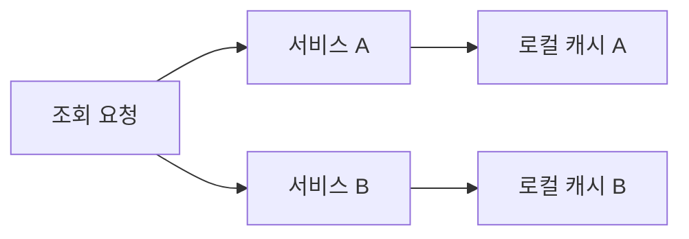
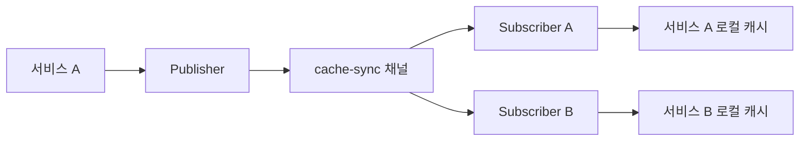
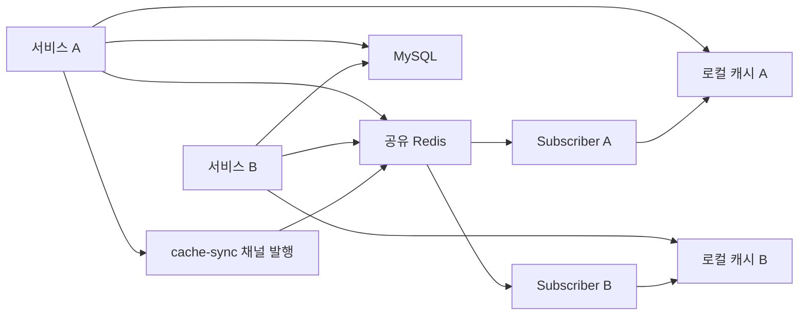
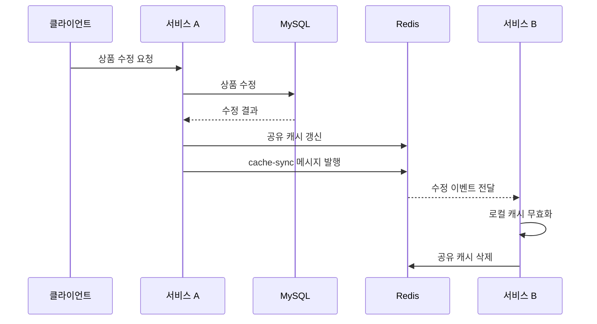

# Pub Sub을 활용한 캐시 동기화 해보기

# Pub Sub을 활용한 캐시 동기화 해보기

* toc
{:toc}

---

## Redis Pub/Sub을 활용한 캐시 동기화 구현하기

애플리케이션 인스턴스가 하나일 때는 로컬 캐시만 사용해도 큰 문제가 없을 수 있다. 하지만 여러 인스턴스가 동시에 실행되면 각 인스턴스가 서로 다른 로컬 캐시를 가지고 있기 때문에 데이터 불일치가 발생할 수 있다.

예를 들어 서비스 A에서 상품 가격을 수정했는데 서비스 B의 로컬 캐시에 이전 가격이 남아 있다면, 같은 상품을 조회해도 요청이 전달된 서버에 따라 서로 다른 결과가 반환될 수 있다.

이 문제를 해결하기 위해 Redis Pub/Sub을 사용한다. 한 인스턴스에서 상품이 수정되거나 삭제되면 Redis 채널에 이벤트를 발행하고, 다른 인스턴스들은 해당 메시지를 수신해 자신의 로컬 캐시를 삭제한다.

---

## 개념

### 로컬 캐시

로컬 캐시는 애플리케이션 프로세스 내부의 메모리에 데이터를 저장하는 방식이다.

Spring Boot 애플리케이션에서 Caffeine을 사용하면 다음과 같이 JVM 내부에 캐시를 구성할 수 있다.

```text
서비스 A JVM
  └── 로컬 캐시 A

서비스 B JVM
  └── 로컬 캐시 B
```

로컬 캐시는 네트워크를 거치지 않기 때문에 매우 빠르게 데이터를 조회할 수 있다. 하지만 서비스 인스턴스마다 별도의 메모리를 사용한다는 특징이 있다.



서비스 A의 로컬 캐시와 서비스 B의 로컬 캐시는 서로 다른 공간이다. 따라서 한쪽의 캐시가 변경되거나 삭제되어도 다른 쪽의 캐시는 자동으로 변경되지 않는다.

---

### Redis 캐시

Redis는 여러 애플리케이션 인스턴스가 함께 사용하는 공유 캐시로 사용할 수 있다.

```text
서비스 A ─┐
          ├── Redis
서비스 B ─┘
```

모든 서비스가 같은 Redis를 사용하면 데이터 공유는 쉬워진다. 하지만 모든 조회 요청이 Redis까지 네트워크를 거쳐야 하므로 JVM 내부 로컬 캐시보다는 상대적으로 느릴 수 있다.

---

### Pub/Sub

Pub/Sub은 Publisher와 Subscriber가 메시지를 주고받는 구조이다.

- Publisher는 특정 채널에 메시지를 발행한다.
- Subscriber는 특정 채널을 구독한다.
- 구독 중인 모든 Subscriber가 메시지를 전달받는다.



서비스 A에서 상품을 수정하면 다음과 같은 메시지를 발행한다.

```text
Updated product-product:1
```

서비스 B는 메시지를 수신한 뒤 `product:1`에 해당하는 로컬 캐시를 삭제한다. 이후 상품 조회 요청이 들어오면 Redis 또는 데이터베이스에서 최신 상품을 다시 가져온다.

---

## 왜 사용하는가?

### 로컬 캐시의 빠른 조회 성능을 유지하기 위해 사용한다

로컬 캐시는 애플리케이션 메모리에서 바로 조회하므로 빠르다.

```text
요청 -> 애플리케이션 메모리 조회
```

하지만 로컬 캐시는 인스턴스마다 분리되어 있다. 여러 서버가 실행되는 환경에서는 한 서버의 변경 사항을 다른 서버가 알 수 없다.

Pub/Sub을 적용하면 로컬 캐시의 빠른 조회 성능을 유지하면서 캐시 변경 이벤트를 다른 서비스에 전달할 수 있다.

---

### 여러 인스턴스의 캐시를 동기화하기 위해 사용한다

다음과 같은 상황을 가정해 보자.

```text
서비스 A 로컬 캐시: product:1 = 800원
서비스 B 로컬 캐시: product:1 = 800원
```

서비스 A에서 상품 가격을 900원으로 변경하면 데이터베이스는 최신 상태가 되지만 서비스 B의 로컬 캐시는 여전히 800원을 가지고 있을 수 있다.

서비스 A가 다음 메시지를 발행한다.

```text
Updated product-product:1
```

서비스 B가 메시지를 수신하면 자신의 로컬 캐시에서 `product:1`을 삭제한다.

```text
서비스 A 상품 수정
    -> Redis Pub/Sub 메시지 발행
    -> 서비스 B 메시지 수신
    -> 서비스 B 로컬 캐시 삭제
    -> 다음 조회 시 최신 데이터 조회
```

---

### Redis 부하를 줄이기 위해 사용한다

모든 요청이 Redis까지 전달되면 Redis에도 많은 조회 요청이 발생할 수 있다.

로컬 캐시를 함께 사용하면 조회 순서를 다음과 같이 구성할 수 있다.

```text
로컬 캐시 -> Redis -> 데이터베이스
```

가장 가까운 로컬 캐시에서 데이터를 찾으면 Redis와 데이터베이스에 접근하지 않는다.

---

## 주요 특징

### 로컬 캐시와 Redis의 차이

| 구분 | 로컬 캐시 | Redis |
|---|---|---|
| 저장 위치 | 애플리케이션 JVM 메모리 | 별도의 Redis 서버 |
| 조회 속도 | 매우 빠름 | 네트워크 통신 필요 |
| 공유 여부 | 인스턴스별로 분리 | 여러 인스턴스가 공유 |
| 메모리 사용 | 애플리케이션 메모리 사용 | Redis 메모리 사용 |
| 장애 영향 | 해당 인스턴스에 한정 | 여러 서비스에 영향 가능 |
| 데이터 동기화 | 별도 동기화 필요 | 공유 데이터 사용 가능 |
| 대표 구현 | Caffeine | Redis |

두 캐시를 함께 사용하는 경우 일반적으로 다음 순서로 조회한다.

```text
1. 로컬 캐시 조회
2. 로컬 캐시에 없으면 Redis 조회
3. Redis에도 없으면 데이터베이스 조회
4. 조회 결과를 Redis와 로컬 캐시에 저장
```

---

### Caffeine 로컬 캐시 설정

```java
package com.example.config;

import com.github.benmanes.caffeine.cache.Cache;
import com.github.benmanes.caffeine.cache.Caffeine;
import org.springframework.context.annotation.Bean;
import org.springframework.context.annotation.Configuration;

import java.util.concurrent.TimeUnit;

@Configuration
public class LocalCacheConfig {

    @Bean
    public Cache<String, Object> localCache() {
        return Caffeine.newBuilder()
                .expireAfterWrite(10, TimeUnit.MINUTES)
                .maximumSize(1000)
                .build();
    }
}
```

각 설정의 의미는 다음과 같다.

```java
.expireAfterWrite(10, TimeUnit.MINUTES)
```

캐시에 저장된 시점부터 10분이 지나면 해당 데이터를 삭제한다.

```java
.maximumSize(1000)
```

로컬 캐시에 최대 1,000개의 항목만 저장한다. 캐시가 최대 크기에 도달하면 Caffeine의 정책에 따라 일부 항목이 제거된다.

로컬 캐시에도 만료 시간을 설정해야 하는 이유는 Pub/Sub 메시지를 놓치는 상황에 대비하기 위해서이다. 메시지를 받지 못하더라도 TTL이 지나면 오래된 데이터가 계속 남지 않는다.

---

### Redis Cluster 연결 설정

```java
package com.example.config;

import com.example.cache.CacheSubscriber;
import org.springframework.context.annotation.Bean;
import org.springframework.context.annotation.Configuration;
import org.springframework.data.redis.connection.RedisClusterConfiguration;
import org.springframework.data.redis.connection.RedisClusterNode;
import org.springframework.data.redis.connection.lettuce.LettuceConnectionFactory;
import org.springframework.data.redis.core.RedisTemplate;
import org.springframework.data.redis.listener.PatternTopic;
import org.springframework.data.redis.listener.RedisMessageListenerContainer;
import org.springframework.data.redis.listener.adapter.MessageListenerAdapter;
import org.springframework.session.data.redis.config.annotation.web.http.EnableRedisHttpSession;

@Configuration
@EnableRedisHttpSession
public class RedisConfig {

    @Bean
    public LettuceConnectionFactory redisConnectionFactory() {
        RedisClusterConfiguration clusterConfiguration =
                new RedisClusterConfiguration();

        clusterConfiguration.addClusterNode(
                new RedisClusterNode("localhost", 7001)
        );
        clusterConfiguration.addClusterNode(
                new RedisClusterNode("localhost", 7002)
        );
        clusterConfiguration.addClusterNode(
                new RedisClusterNode("localhost", 7003)
        );
        clusterConfiguration.addClusterNode(
                new RedisClusterNode("localhost", 7004)
        );
        clusterConfiguration.addClusterNode(
                new RedisClusterNode("localhost", 7005)
        );
        clusterConfiguration.addClusterNode(
                new RedisClusterNode("localhost", 7006)
        );

        return new LettuceConnectionFactory(clusterConfiguration);
    }

    @Bean
    public RedisTemplate<String, Object> redisTemplate(
            LettuceConnectionFactory redisConnectionFactory
    ) {
        RedisTemplate<String, Object> redisTemplate =
                new RedisTemplate<>();

        redisTemplate.setConnectionFactory(redisConnectionFactory);

        return redisTemplate;
    }

    @Bean
    public RedisMessageListenerContainer listenerContainer(
            LettuceConnectionFactory redisConnectionFactory,
            MessageListenerAdapter messageListenerAdapter
    ) {
        RedisMessageListenerContainer container =
                new RedisMessageListenerContainer();

        container.setConnectionFactory(redisConnectionFactory);

        container.addMessageListener(
                messageListenerAdapter,
                new PatternTopic("cache-sync")
        );

        return container;
    }

    @Bean
    public MessageListenerAdapter messageListenerAdapter(
            CacheSubscriber subscriber
    ) {
        return new MessageListenerAdapter(subscriber);
    }
}
```

#### RedisClusterConfiguration

Redis Cluster에 접속할 노드 목록을 등록한다.

```java
RedisClusterConfiguration clusterConfiguration =
        new RedisClusterConfiguration();
```

클러스터에서는 하나의 Redis 노드만 지정하는 것이 아니라 여러 노드를 시작점으로 등록하는 것이 좋다.

```java
clusterConfiguration.addClusterNode(
        new RedisClusterNode("localhost", 7001)
);
```

등록된 노드 중 하나에 연결되면 Redis 클라이언트가 클러스터의 슬롯 정보를 확인하고 필요한 노드로 요청을 전달한다.

---

#### RedisMessageListenerContainer

`RedisMessageListenerContainer`는 Redis 채널을 구독하고 메시지가 도착했을 때 Listener를 실행하는 역할을 한다.

```java
container.addMessageListener(
        messageListenerAdapter,
        new PatternTopic("cache-sync")
);
```

위 설정은 `cache-sync` 채널을 구독한다는 의미이다.

---

### Pub/Sub 메시지 발행

```java
package com.example.cache;

import lombok.RequiredArgsConstructor;
import org.springframework.data.redis.core.RedisTemplate;
import org.springframework.stereotype.Component;

@Component
@RequiredArgsConstructor
public class CachePublisher {

    private final RedisTemplate<String, Object> redisTemplate;

    public void publish(String channel, String message) {
        redisTemplate.convertAndSend(channel, message);

        System.out.println("Published message: " + message);
    }
}
```

`convertAndSend`는 지정한 채널에 메시지를 발행한다.

```java
redisTemplate.convertAndSend(channel, message);
```

다음과 같이 사용할 수 있다.

```java
cachePublisher.publish(
        "cache-sync",
        "Updated product-product:1"
);
```

실행 결과는 다음과 같다.

```text
Published message: Updated product-product:1
```

---

### Pub/Sub 메시지 수신

```java
package com.example.cache;

import com.github.benmanes.caffeine.cache.Cache;
import lombok.RequiredArgsConstructor;
import org.springframework.data.redis.connection.Message;
import org.springframework.data.redis.connection.MessageListener;
import org.springframework.data.redis.core.RedisTemplate;
import org.springframework.data.redis.serializer.StringRedisSerializer;
import org.springframework.stereotype.Component;

@Component
@RequiredArgsConstructor
public class CacheSubscriber implements MessageListener {

    private final Cache<String, Object> localCache;
    private final RedisTemplate<String, Object> redisTemplate;

    @Override
    public void onMessage(Message message, byte[] pattern) {
        StringRedisSerializer serializer =
                new StringRedisSerializer();

        String body = serializer.deserialize(message.getBody());

        System.out.println("Received message: " + body);

        if (body == null || body.isBlank()) {
            return;
        }

        if (body.contains("Updated product-")
                || body.contains("Deleted product-")) {

            String cachedKey = body.split("-", 2)[1];

            System.out.println(cachedKey);

            localCache.invalidate(cachedKey);
            redisTemplate.delete(cachedKey);

            System.out.println(
                    "Invalidated local cache for product: "
                            + cachedKey
            );
        }
    }
}
```

메시지가 다음과 같다고 가정한다.

```text
Updated product-product:1
```

`body.split("-", 2)[1]`의 결과는 다음과 같다.

```text
product:1
```

이 키를 이용해 로컬 캐시와 Redis 캐시를 삭제한다.

```java
localCache.invalidate(cachedKey);
redisTemplate.delete(cachedKey);
```

로컬 캐시는 각 애플리케이션 인스턴스마다 존재하므로 모든 서비스가 메시지를 수신해 각자의 로컬 캐시를 삭제해야 한다.

---

### 메시지 발행 명령어

Redis CLI에서도 Pub/Sub을 직접 확인할 수 있다.

먼저 하나의 터미널에서 채널을 구독한다.

```redis
SUBSCRIBE cache-sync
```

실행 결과는 다음과 같다.

```text
1) "subscribe"
2) "cache-sync"
3) (integer) 1
```

다른 터미널에서 메시지를 발행한다.

```redis
PUBLISH cache-sync "Updated product-product:1"
```

실행 결과는 다음과 같다.

```text
(integer) 1
```

`1`은 현재 해당 채널을 구독하고 있는 Subscriber가 1개라는 의미이다.

구독 중인 터미널에는 다음 메시지가 출력된다.

```text
1) "message"
2) "cache-sync"
3) "Updated product-product:1"
```

Redis Pub/Sub 메시지는 데이터베이스처럼 저장되는 것이 아니다. Subscriber가 연결되어 있지 않은 순간에 발행된 메시지는 나중에 다시 전달되지 않는다.

따라서 Pub/Sub은 캐시 무효화 알림처럼 유실되어도 TTL이나 다음 조회로 복구할 수 있는 작업에 적합하다. 반드시 처리되어야 하는 이벤트나 재처리가 필요한 메시지에는 Redis Streams나 Kafka와 같은 별도의 메시징 방식을 고려해야 한다.

---

## 예제

### application.yml

두 개의 Spring Boot 인스턴스를 동시에 실행하려면 서로 다른 포트를 사용해야 한다.

```yaml
server:
  port: 8080

spring:
  datasource:
    url: jdbc:mysql://localhost:3306/test
    username: test
    password: test
    driver-class-name: com.mysql.cj.jdbc.Driver

  jpa:
    hibernate:
      ddl-auto: update
    show-sql: true
    database-platform: org.hibernate.dialect.MySQL8Dialect

  data:
    redis:
      cluster:
        nodes:
          - localhost:7001
          - localhost:7002
          - localhost:7003
          - localhost:7004
          - localhost:7005
          - localhost:7006
      lettuce:
        pool:
          max-active: 8
          max-idle: 8
          min-idle: 0
```

`server.port`는 첫 번째 서비스가 사용할 포트이다.

```yaml
server:
  port: 8080
```

두 인스턴스가 같은 MySQL 테이블을 사용하므로 `ddl-auto`는 `update`로 설정한다. 한 인스턴스에서 테이블을 생성하거나 삭제하는 설정을 사용하면 다른 인스턴스 실행 시 테이블이 다시 생성되거나 데이터가 삭제될 수 있다.

---

### application-b.yml

두 번째 서비스는 8081 포트를 사용한다.

```yaml
server:
  port: 8081

spring:
  datasource:
    url: jdbc:mysql://localhost:3306/test
    username: test
    password: test
    driver-class-name: com.mysql.cj.jdbc.Driver

  jpa:
    hibernate:
      ddl-auto: update
    show-sql: true
    database-platform: org.hibernate.dialect.MySQL8Dialect

  data:
    redis:
      cluster:
        nodes:
          - localhost:7001
          - localhost:7002
          - localhost:7003
          - localhost:7004
          - localhost:7005
          - localhost:7006
      lettuce:
        pool:
          max-active: 8
          max-idle: 8
          min-idle: 0
```

`application-b.yml`은 파일 이름이 다르기 때문에 Spring Boot가 자동으로 읽지 않을 수 있다. 두 번째 애플리케이션을 실행할 때 다음과 같은 프로그램 인자를 설정한다.

```text
--spring.config.name=application-b
```

또는 다음과 같이 설정 파일 위치를 직접 지정할 수 있다.

```text
--spring.config.location=classpath:/application-b.yml
```

---

### build.gradle

```gradle
dependencies {
    implementation project(':module-common')

    // Spring Boot Starter for Web
    implementation 'org.springframework.boot:spring-boot-starter-web'

    // Spring Data JPA
    implementation 'org.springframework.boot:spring-boot-starter-data-jpa'

    // MySQL Driver
    runtimeOnly 'com.mysql:mysql-connector-j'

    // Caffeine Cache
    implementation 'com.github.ben-manes.caffeine:caffeine'

    // Lombok
    compileOnly 'org.projectlombok:lombok'
    annotationProcessor 'org.projectlombok:lombok'

    // Spring Data Redis
    implementation 'org.springframework.boot:spring-boot-starter-data-redis'
    implementation 'io.lettuce:lettuce-core'

    // Spring Session Data Redis
    implementation 'org.springframework.session:spring-session-data-redis'

    // Test
    testImplementation 'org.springframework.boot:spring-boot-starter-test'
}

springBoot {
    mainClass.set('com.example.RedisApplication')
}

bootJar {
    archiveFileName = 'service-redis.jar'
}
```

`module-common`은 공통 모듈을 사용하기 위한 의존성이다.

Caffeine은 로컬 캐시를 구성하기 위해 필요하고, Spring Data Redis와 Lettuce는 Redis Cluster 연결과 Pub/Sub 처리를 위해 필요하다.

---

### Product.java

```java
package com.example.products;

import jakarta.persistence.Entity;
import jakarta.persistence.GeneratedValue;
import jakarta.persistence.GenerationType;
import jakarta.persistence.Id;
import lombok.AllArgsConstructor;
import lombok.Data;
import lombok.NoArgsConstructor;

@Entity
@Data
@NoArgsConstructor
@AllArgsConstructor
public class Product {

    @Id
    @GeneratedValue(strategy = GenerationType.IDENTITY)
    private Long id;

    private String name;

    private double price;
}
```

---

### ProductRepository.java

```java
package com.example.products;

import org.springframework.data.jpa.repository.JpaRepository;
import org.springframework.stereotype.Repository;

@Repository
public interface ProductRepository extends JpaRepository<Product, Long> {
}
```

---

### ProductController.java

```java
package com.example.products;

import lombok.RequiredArgsConstructor;
import org.springframework.web.bind.annotation.*;

import java.util.Optional;

@RestController
@RequestMapping("/products")
@RequiredArgsConstructor
public class ProductController {

    private final ProductService productService;

    @PostMapping
    public Product saveProduct(
            @RequestBody Product product
    ) {
        return productService.saveProduct(product);
    }

    @GetMapping("/{id}")
    public Optional<Product> getProduct(
            @PathVariable Long id
    ) {
        return productService.getProduct(id);
    }

    @PutMapping("/{id}")
    public Product updateProduct(
            @PathVariable Long id,
            @RequestBody Product product
    ) {
        return productService.updateProduct(id, product);
    }

    @DeleteMapping("/{id}")
    public void deleteProduct(
            @PathVariable Long id
    ) {
        productService.deleteProduct(id);
    }
}
```

컨트롤러는 상품의 생성, 조회, 수정, 삭제 요청을 서비스 계층으로 전달한다.

캐시 조회와 Pub/Sub 메시지 발행은 `ProductService`에서 처리한다.

---

### ProductService.java

```java
package com.example.products;

import com.github.benmanes.caffeine.cache.Cache;
import lombok.RequiredArgsConstructor;
import org.slf4j.Logger;
import org.slf4j.LoggerFactory;
import org.springframework.data.redis.core.RedisTemplate;
import org.springframework.stereotype.Service;

import java.util.Optional;
import java.util.concurrent.TimeUnit;

@Service
@RequiredArgsConstructor
public class ProductService {

    private static final Logger log =
            LoggerFactory.getLogger(ProductService.class);

    private final Cache<String, Object> localCache;
    private final RedisTemplate<String, Object> redisTemplate;
    private final ProductRepository productRepository;

    private static final String PRODUCT_KEY_PREFIX = "product:";

    public Product saveProduct(Product product) {
        Product savedProduct = productRepository.save(product);

        String redisKey =
                PRODUCT_KEY_PREFIX + savedProduct.getId();

        redisTemplate.opsForValue().set(
                redisKey,
                savedProduct,
                1,
                TimeUnit.HOURS
        );

        localCache.put(redisKey, savedProduct);

        System.out.println("Saved product: " + redisKey);

        return savedProduct;
    }

    public Optional<Product> getProduct(Long id) {
        String redisKey = PRODUCT_KEY_PREFIX + id;

        Product product =
                (Product) localCache.getIfPresent(redisKey);

        if (product != null) {
            System.out.println(
                    "Local Cache hit for product: " + redisKey
            );

            return Optional.of(product);
        }

        product =
                (Product) redisTemplate.opsForValue().get(redisKey);

        if (product != null) {
            localCache.put(redisKey, product);

            System.out.println("Cache hit");

            return Optional.of(product);
        }

        Optional<Product> dbProduct =
                productRepository.findById(id);

        dbProduct.ifPresent(p -> {
            log.info("Loaded product from DB: {}", p.getId());

            localCache.put(redisKey, p);

            redisTemplate.opsForValue().set(
                    redisKey,
                    p,
                    1,
                    TimeUnit.HOURS
            );
        });

        return dbProduct;
    }

    public Product updateProduct(
            Long id,
            Product updatedProduct
    ) {
        if (!productRepository.existsById(id)) {
            throw new IllegalArgumentException(
                    "Product not found for id: " + id
            );
        }

        updatedProduct.setId(id);

        Product savedProduct =
                productRepository.save(updatedProduct);

        String redisKey =
                PRODUCT_KEY_PREFIX + savedProduct.getId();

        redisTemplate.opsForValue().set(
                redisKey,
                savedProduct,
                1,
                TimeUnit.HOURS
        );

        redisTemplate.convertAndSend(
                "cache-sync",
                "Updated product-" + redisKey
        );

        return savedProduct;
    }

    public void deleteProduct(Long id) {
        if (!productRepository.existsById(id)) {
            throw new IllegalArgumentException(
                    "Product not found for id: " + id
            );
        }

        productRepository.deleteById(id);

        String productId = id.toString();
        String redisKey = PRODUCT_KEY_PREFIX + productId;

        redisTemplate.convertAndSend(
                "cache-sync",
                "Deleted product-" + redisKey
        );
    }
}
```

### 상품 저장

상품 저장은 다음 순서로 진행된다.

```text
1. MySQL에 상품 저장
2. 저장된 상품 ID로 Redis 키 생성
3. Redis에 상품 저장
4. 로컬 캐시에 상품 저장
5. 저장 결과 반환
```

```java
Product savedProduct = productRepository.save(product);
```

먼저 데이터베이스에 저장해야 자동 생성된 상품 ID를 얻을 수 있다.

```java
String redisKey =
        PRODUCT_KEY_PREFIX + savedProduct.getId();
```

상품 ID가 1이라면 Redis 키는 다음과 같다.

```text
product:1
```

이후 Redis와 로컬 캐시에 모두 저장한다.

```java
redisTemplate.opsForValue().set(
        redisKey,
        savedProduct,
        1,
        TimeUnit.HOURS
);

localCache.put(redisKey, savedProduct);
```

---

### 상품 조회

상품 조회는 로컬 캐시부터 확인한다.

```java
Product product =
        (Product) localCache.getIfPresent(redisKey);
```

로컬 캐시에 값이 있으면 바로 반환한다.

```java
if (product != null) {
    return Optional.of(product);
}
```

로컬 캐시에 없으면 Redis를 조회한다.

```java
product =
        (Product) redisTemplate.opsForValue().get(redisKey);
```

Redis에 값이 있으면 로컬 캐시에도 저장한다.

```java
if (product != null) {
    localCache.put(redisKey, product);
    return Optional.of(product);
}
```

Redis에도 값이 없을 때만 데이터베이스를 조회한다.

```java
Optional<Product> dbProduct =
        productRepository.findById(id);
```

데이터베이스에서 상품을 찾으면 Redis와 로컬 캐시에 모두 저장한다.

```java
dbProduct.ifPresent(p -> {
    localCache.put(redisKey, p);

    redisTemplate.opsForValue().set(
            redisKey,
            p,
            1,
            TimeUnit.HOURS
    );
});
```

전체 조회 우선순위는 다음과 같다.

```text
로컬 캐시
    -> Redis
        -> MySQL
```

---

### 상품 수정

상품 수정은 MySQL과 Redis의 값을 갱신한 뒤 Pub/Sub 메시지를 발행한다.

```java
Product savedProduct =
        productRepository.save(updatedProduct);
```

데이터베이스 저장 후 Redis도 갱신한다.

```java
redisTemplate.opsForValue().set(
        redisKey,
        savedProduct,
        1,
        TimeUnit.HOURS
);
```

다른 인스턴스의 로컬 캐시를 무효화하기 위해 메시지를 발행한다.

```java
redisTemplate.convertAndSend(
        "cache-sync",
        "Updated product-" + redisKey
);
```

Subscriber는 해당 메시지를 수신하고 각 인스턴스의 로컬 캐시에서 `product:1`을 삭제한다.

---

### 상품 삭제

상품 삭제 시에는 데이터베이스에서 상품을 삭제한 뒤 삭제 이벤트를 발행한다.

```java
productRepository.deleteById(id);
```

이후 삭제 메시지를 발행한다.

```java
redisTemplate.convertAndSend(
        "cache-sync",
        "Deleted product-" + redisKey
);
```

Subscriber는 메시지를 수신하고 로컬 캐시와 Redis 키를 삭제한다.

```java
localCache.invalidate(cachedKey);
redisTemplate.delete(cachedKey);
```

삭제된 상품이 다시 조회되더라도 캐시에서 이전 데이터가 반환되지 않고, 데이터베이스 조회 결과가 비어 있게 된다.

---

## 구조

두 개의 Spring Boot 인스턴스가 각각 로컬 캐시를 가지고 Redis Pub/Sub으로 동기화하는 구조는 다음과 같다.



상품 수정 요청의 흐름은 다음과 같다.



이후 서비스 B로 같은 상품을 조회하면 다음 순서로 동작한다.

```text
1. 서비스 B 로컬 캐시 조회
2. 로컬 캐시 없음
3. Redis 조회
4. Redis에도 없으면 MySQL 조회
5. 최신 상품을 로컬 캐시와 Redis에 저장
6. 응답 반환
```

---

## 실무에서의 활용

### 두 개의 서비스 실행

IntelliJ에서 같은 Spring Boot 애플리케이션을 두 번 실행할 수 있다.

첫 번째 실행 설정은 기본 `application.yml`을 사용한다.

```text
RedisApplication
포트: 8080
```

두 번째 실행 설정은 `application-b.yml`을 사용한다.

```text
RedisApplication-b
포트: 8081
프로그램 인자: --spring.config.name=application-b
```

두 애플리케이션은 같은 MySQL과 Redis Cluster를 사용하지만 서로 다른 포트에서 실행된다.

---

### 상품 생성 테스트

서비스 A를 통해 상품을 생성한다.

```http
POST http://localhost:8080/products
Content-Type: application/json
```

요청 본문은 다음과 같다.

```json
{
  "name": "Smartphone",
  "price": 800
}
```

실행 결과는 다음과 같은 형태이다.

```json
{
  "id": 1,
  "name": "Smartphone",
  "price": 800.0
}
```

상품 저장 시 다음 작업이 실행된다.

```text
MySQL 저장
Redis 저장
서비스 A 로컬 캐시 저장
```

---

### 서비스 B에서 상품 조회

서비스 B로 상품을 조회한다.

```http
GET http://localhost:8081/products/1
```

서비스 B의 로컬 캐시에 데이터가 없다면 Redis에서 상품을 조회한다.

```text
Local Cache miss
Redis Cache hit
```

Redis에도 데이터가 없다면 MySQL을 조회한 뒤 두 캐시에 저장한다.

```text
Local Cache miss
Redis Cache miss
MySQL 조회
Redis 저장
Local Cache 저장
```

---

### 상품 수정과 캐시 무효화 확인

서비스 A에서 상품 가격을 수정한다.

```http
PUT http://localhost:8080/products/1
Content-Type: application/json
```

요청 본문은 다음과 같다.

```json
{
  "name": "Smartphone",
  "price": 900
}
```

서비스 A는 다음 메시지를 발행한다.

```text
Updated product-product:1
```

서비스 B는 메시지를 수신한 뒤 다음 작업을 실행한다.

```text
Received message: Updated product-product:1
Invalidated local cache for product: product:1
```

이후 서비스 B에서 상품을 조회하면 이전 가격인 800원이 아니라 900원이 반환된다.

```http
GET http://localhost:8081/products/1
```

실행 결과:

```json
{
  "id": 1,
  "name": "Smartphone",
  "price": 900.0
}
```

---

### 상품 삭제와 캐시 무효화 확인

서비스 A에서 상품을 삭제한다.

```http
DELETE http://localhost:8080/products/1
```

서비스 A는 MySQL에서 상품을 삭제하고 다음 메시지를 발행한다.

```text
Deleted product-product:1
```

서비스 B가 메시지를 수신하면 로컬 캐시와 Redis의 `product:1` 키가 삭제된다.

이후 서비스 B에서 다시 조회하면 캐시에 이전 상품이 남아 있지 않기 때문에 삭제된 상품을 반환하지 않는다.

---

### Pub/Sub 메시지 형식을 구조화한다

문자열을 `split`해서 메시지를 처리하는 방식은 간단한 예제에서는 사용할 수 있다.

```text
Updated product-product:1
Deleted product-product:1
```

하지만 실제 서비스에서는 JSON 형식으로 메시지를 발행하는 편이 안전하다.

```json
{
  "eventType": "UPDATED",
  "entityType": "PRODUCT",
  "cacheKey": "product:1"
}
```

삭제 이벤트는 다음과 같이 표현할 수 있다.

```json
{
  "eventType": "DELETED",
  "entityType": "PRODUCT",
  "cacheKey": "product:1"
}
```

문자열 분리 방식은 상품 키에 `-`가 포함되거나 새로운 이벤트 타입이 추가될 때 처리 오류가 발생할 수 있다. 메시지의 종류와 캐시 키를 명확히 구분하려면 JSON 직렬화를 사용하는 것이 좋다.

---

### Pub/Sub의 유실 가능성을 고려한다

Redis Pub/Sub은 메시지를 저장하지 않는다.

Subscriber가 잠시 중단된 상태에서 메시지가 발행되면 해당 Subscriber는 메시지를 받을 수 없다.

```text
서비스 B 중단
    -> 서비스 A 상품 수정
    -> 캐시 무효화 메시지 발행
    -> 서비스 B는 메시지를 받지 못함
    -> 서비스 B의 로컬 캐시에 이전 데이터가 남을 수 있음
```

이를 완화하기 위해 다음 방법을 함께 사용할 수 있다.

- 로컬 캐시에 짧은 TTL 설정
- 조회 시 데이터 버전 비교
- 서비스 시작 시 캐시 초기화
- 중요한 이벤트는 Redis Streams나 Kafka 사용
- 캐시 무효화 이벤트를 별도의 로그로 저장
- 수정 시 로컬 캐시를 직접 갱신하고 Pub/Sub은 다른 인스턴스에만 사용

Pub/Sub은 실시간 알림에는 적합하지만, 반드시 처리되어야 하는 메시지 큐로 사용하기에는 부족하다.

---

### 캐시 삭제와 갱신 중 선택한다

상품 수정 시 캐시를 삭제하는 방식과 새로운 값으로 갱신하는 방식은 각각 장단점이 있다.

| 방식 | 처리 방법 | 장점 | 주의점 |
|---|---|---|---|
| 캐시 갱신 | 수정된 값을 Redis와 로컬 캐시에 저장 | 다음 조회가 빠름 | 모든 캐시 복사본을 정확히 갱신해야 함 |
| 캐시 삭제 | 기존 캐시를 제거하고 다음 조회에서 재생성 | 구현이 단순함 | 다음 조회에서 데이터베이스 접근 발생 |
| Pub/Sub 무효화 | 변경 이벤트를 모든 인스턴스에 전달 | 로컬 캐시 동기화 가능 | 메시지 유실 가능성 존재 |

현재 구조는 상품을 수정한 뒤 Redis 값을 저장하고, Pub/Sub 메시지를 발행해 각 서비스의 로컬 캐시를 무효화하는 방식이다.

---

## 정리

로컬 캐시는 애플리케이션 메모리에서 동작하기 때문에 빠른 조회가 가능하지만, 인스턴스마다 별도로 존재한다는 단점이 있다.

여러 서비스 인스턴스가 실행되는 환경에서 한 인스턴스의 상품 정보가 변경되면 다른 인스턴스의 로컬 캐시는 이전 데이터를 가지고 있을 수 있다.

Redis Pub/Sub을 사용하면 다음과 같은 흐름으로 캐시를 동기화할 수 있다.

```text
상품 수정 또는 삭제
    -> Redis 채널에 이벤트 발행
    -> 모든 Subscriber가 이벤트 수신
    -> 각 인스턴스의 로컬 캐시 삭제
    -> 다음 조회에서 최신 데이터 저장
```

조회 순서는 로컬 캐시, Redis, 데이터베이스 순서로 구성할 수 있다.

```text
Local Cache
    -> Redis
        -> Database
```

Caffeine은 로컬 캐시의 TTL과 최대 크기를 관리하고, Redis는 여러 인스턴스가 공유하는 캐시와 Pub/Sub 채널을 제공한다.

다만 Redis Pub/Sub은 메시지를 저장하지 않기 때문에 Subscriber가 중단된 동안 발행된 메시지는 유실될 수 있다. 따라서 캐시 무효화처럼 TTL이나 재조회로 복구할 수 있는 작업에 적합하며, 메시지의 재처리와 순서 보장이 필요한 경우에는 Redis Streams나 Kafka를 사용하는 것이 더 적절하다.

---

### 한 줄 요약

로컬 캐시를 빠르게 사용하면서도 여러 서비스의 데이터를 일치시키려면 Redis Pub/Sub으로 캐시 변경 이벤트를 전달하고 각 인스턴스의 로컬 캐시를 무효화해야 한다.
