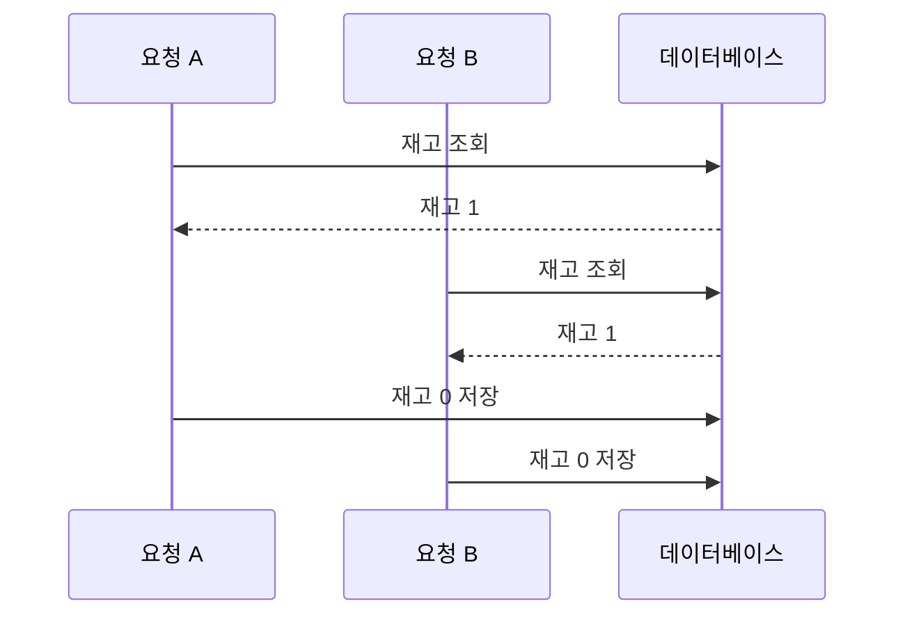
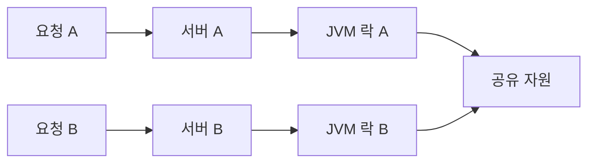
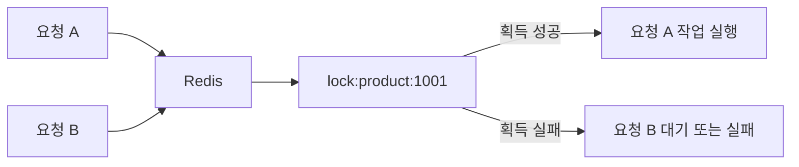
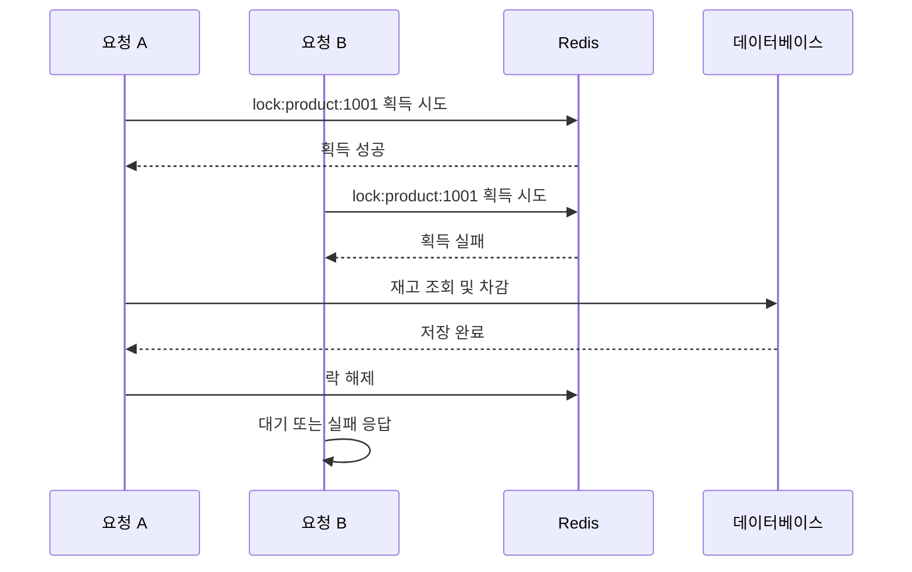
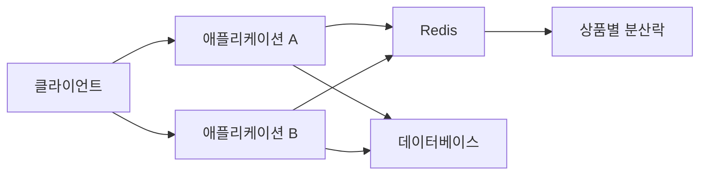

# 동시성 문제와 분산락 알아보기

# 동시성 문제와 분산락 알아보기

* toc
{:toc}

---

## 동시성 문제와 Redis 분산락 이해하기

여러 요청이 동시에 같은 데이터를 변경하면 데이터가 예상하지 못한 상태로 변경될 수 있다.

특히 재고 차감, 좌석 예약, 쿠폰 발급, 포인트 차감처럼 수량이나 상태를 변경하는 기능에서 동시성 문제가 자주 발생한다.

예를 들어 상품 재고가 1개 남아 있는 상황에서 두 사용자가 동시에 주문하면 다음과 같은 문제가 발생할 수 있다.

```text
현재 재고: 1

요청 A: 재고 조회 -> 1
요청 B: 재고 조회 -> 1

요청 A: 재고 차감 -> 0
요청 B: 재고 차감 -> 0
```

두 요청 모두 재고가 있다고 판단했지만 실제로는 상품이 하나뿐이다. 이처럼 여러 실행 흐름이 같은 자원에 동시에 접근하면서 결과가 꼬이는 문제를 동시성 문제라고 한다.

---

## 개념

### 동시성 문제란?

동시성 문제는 여러 스레드, 프로세스 또는 서버가 동일한 데이터에 동시에 접근할 때 발생한다.

다음은 재고 차감 코드의 단순한 예제이다.

```java
public void decreaseStock(Product product) {
    if (product.getStock() <= 0) {
        throw new IllegalArgumentException("재고가 없습니다.");
    }

    product.setStock(product.getStock() - 1);
    productRepository.save(product);
}
```

재고가 1개일 때 두 요청이 동시에 실행되면 다음과 같은 순서가 될 수 있다.

```text
요청 A: stock = 1 조회
요청 B: stock = 1 조회
요청 A: stock = 0 저장
요청 B: stock = 0 저장
```

최종 재고는 0으로 보이지만 실제로는 두 건의 주문이 모두 성공했을 수 있다. 데이터베이스에 저장된 값만 보면 문제를 발견하기 어려울 수 있기 때문에 주문 이력이나 결제 상태와 함께 확인해야 한다.

---

### 경쟁 조건

경쟁 조건은 여러 실행 흐름이 공유 자원을 사용하는 순서에 따라 결과가 달라지는 상황이다.



두 요청이 모두 같은 재고를 읽고 각자 차감하면 한 건의 재고로 두 건의 주문이 처리될 수 있다.

---

### 고전적인 락

Java에서는 `synchronized`나 `ReentrantLock`을 사용해 하나의 프로세스 안에서 동시에 실행되는 코드를 제어할 수 있다.

```java
import java.util.concurrent.locks.ReentrantLock;

public class OrderService {

    private final ReentrantLock lock =
            new ReentrantLock();

    public void processOrder() {
        lock.lock();

        try {
            // 자원에 접근하고 수정하는 작업
        } finally {
            lock.unlock();
        }
    }
}
```

`lock.lock()`이 실행되면 다른 스레드는 락이 해제될 때까지 임계 영역에 진입할 수 없다.

`finally`에서 반드시 `unlock()`을 실행해야 한다. 예외가 발생했을 때 락을 해제하지 않으면 이후 요청이 계속 대기하는 문제가 발생할 수 있다.

---

### 고전적인 락의 한계

`ReentrantLock`은 현재 실행 중인 JVM의 메모리 안에서만 동작한다.

```text
서버 A JVM
    └── Lock A

서버 B JVM
    └── Lock B
```

서버 A와 서버 B가 각각 다른 락 객체를 사용하기 때문에 서로의 락 상태를 알 수 없다.



여러 애플리케이션 인스턴스가 실행되는 분산 환경에서는 JVM 내부 락만으로 공유 자원을 보호할 수 없다.

---

## 왜 사용하는가?

### 여러 서버에서 하나의 자원을 보호하기 위해 사용한다

분산락은 여러 서버나 프로세스가 동일한 자원에 동시에 접근하지 못하도록 제어한다.

```text
서버 A ─┐
서버 B ─┼── 분산락 저장소
서버 C ─┘
```

모든 서버가 같은 Redis를 바라보면 Redis에 저장된 락을 기준으로 접근 순서를 조정할 수 있다.

```text
서버 A: 락 획득 성공 -> 작업 실행
서버 B: 락 획득 실패 -> 대기 또는 실패 처리
서버 C: 락 획득 실패 -> 대기 또는 실패 처리
```

---

### 재고 차감과 좌석 예약을 보호하기 위해 사용한다

다음과 같은 기능은 동시에 여러 요청이 들어올 수 있다.

- 상품 재고 차감
- 좌석 예약
- 쿠폰 선착순 발급
- 포인트 차감
- 주문 상태 변경
- 동일한 작업의 중복 실행 방지

이런 기능은 단순히 메서드에 `synchronized`를 붙이는 것만으로는 충분하지 않다. 여러 애플리케이션 인스턴스가 실행될 수 있기 때문이다.

---

## 주요 특징

### Redis 기반 분산락

Redis 분산락은 Redis의 키를 락처럼 사용하는 방식이다.

```text
lock:product:1001
```

락을 획득한 서버만 해당 상품에 대한 작업을 실행한다.



Redis에서 키를 저장할 때 `SETNX`를 사용하면 키가 존재하지 않을 때만 값을 저장할 수 있다.

Redis CLI 명령어로는 다음과 같다.

```redis
SET lock:product:1001 LOCK NX EX 5
```

실행 결과는 다음과 같다.

```text
OK
```

`NX`는 키가 존재하지 않을 때만 저장한다는 의미이다.

`EX 5`는 5초 후 키가 자동으로 만료된다는 의미이다.

이미 락이 존재하는 상태에서 다시 실행하면 다음 결과가 반환된다.

```text
(nil)
```

이는 다른 요청이 이미 락을 획득했다는 의미이다.

---

### `setIfAbsent`

Spring Data Redis에서는 `setIfAbsent` 메서드로 Redis의 `SETNX` 동작을 사용할 수 있다.

```java
public boolean acquireLock(String lockKey) {
    Boolean success =
            redisTemplate.opsForValue().setIfAbsent(
                    lockKey,
                    "LOCK",
                    5,
                    TimeUnit.SECONDS
            );

    return Boolean.TRUE.equals(success);
}
```

각 인자의 의미는 다음과 같다.

```java
setIfAbsent(
        lockKey,
        "LOCK",
        5,
        TimeUnit.SECONDS
);
```

| 인자 | 의미 |
|---|---|
| `lockKey` | 락을 저장할 Redis 키 |
| `"LOCK"` | 락의 값 |
| `5` | 만료 시간 |
| `TimeUnit.SECONDS` | 만료 시간의 단위 |

락 획득에 성공하면 `true`, 이미 락이 존재하면 `false`가 반환된다.

---

### TTL이 필요한 이유

락을 획득한 서버가 작업 중에 장애가 발생하면 락을 해제하는 코드가 실행되지 않을 수 있다.

```text
1. 서버 A가 락 획득
2. 서버 A에서 작업 실행
3. 서버 A 장애 발생
4. 락 해제 코드 실행 실패
5. 이후 요청이 계속 락을 획득하지 못함
```

이 문제를 방지하기 위해 락을 저장할 때 TTL을 설정한다.

```java
redisTemplate.opsForValue().setIfAbsent(
        lockKey,
        "LOCK",
        5,
        TimeUnit.SECONDS
);
```

5초가 지나면 Redis가 락을 자동으로 삭제한다.

단, 작업 시간이 5초보다 길어질 수 있다면 락이 자동으로 만료된 뒤 다른 요청이 같은 자원에 접근할 수 있다. 임계 영역의 최대 실행 시간을 고려해 TTL을 설정해야 한다.

---

### 락 해제

기본적인 락 해제는 다음과 같이 구현할 수 있다.

```java
public void releaseLock(String lockKey) {
    redisTemplate.delete(lockKey);
}
```

락을 획득한 뒤에는 `finally`에서 해제해야 한다.

```java
public void processOrder(String lockKey) {
    if (!acquireLock(lockKey)) {
        throw new IllegalStateException(
                "다른 요청이 작업을 처리하고 있습니다."
        );
    }

    try {
        // 공유 자원에 접근하는 작업
    } finally {
        releaseLock(lockKey);
    }
}
```

락 획득 이후 예외가 발생하더라도 `finally` 블록이 실행되어 락을 해제한다.

---

### 락 소유자 확인

단순히 락 키만 삭제하는 방식에는 문제가 있다.

```text
1. 요청 A가 락 획득
2. 요청 A의 작업이 오래 걸림
3. 락 TTL 만료
4. 요청 B가 같은 락 획득
5. 요청 A의 작업이 끝나 락 삭제
6. 요청 B가 가지고 있던 락까지 삭제됨
```

따라서 락을 획득할 때 고유한 값을 저장하고, 락을 해제할 때 해당 값이 본인이 획득한 값인지 확인해야 한다.

```java
import java.util.UUID;
import java.util.concurrent.TimeUnit;

public String acquireLock(String lockKey) {
    String lockValue = UUID.randomUUID().toString();

    Boolean success =
            redisTemplate.opsForValue().setIfAbsent(
                    lockKey,
                    lockValue,
                    5,
                    TimeUnit.SECONDS
            );

    if (Boolean.TRUE.equals(success)) {
        return lockValue;
    }

    return null;
}
```

락을 해제할 때는 키의 값과 현재 요청이 가진 값을 비교해야 한다.

비교와 삭제를 별도의 명령어로 실행하면 그 사이에 다른 요청이 락을 획득할 수 있으므로 Redis Lua Script를 이용해 원자적으로 처리한다.

```java
import org.springframework.data.redis.core.StringRedisTemplate;
import org.springframework.data.redis.core.script.DefaultRedisScript;
import org.springframework.stereotype.Service;

import java.util.Collections;
import java.util.UUID;
import java.util.concurrent.TimeUnit;

@Service
public class RedisLockService {

    private final StringRedisTemplate redisTemplate;

    private static final DefaultRedisScript<Long> UNLOCK_SCRIPT =
            new DefaultRedisScript<>(
                    "if redis.call('get', KEYS[1]) == ARGV[1] "
                            + "then "
                            + "return redis.call('del', KEYS[1]) "
                            + "else "
                            + "return 0 "
                            + "end",
                    Long.class
            );

    public RedisLockService(
            StringRedisTemplate redisTemplate
    ) {
        this.redisTemplate = redisTemplate;
    }

    public String acquireLock(String lockKey) {
        String lockValue = UUID.randomUUID().toString();

        Boolean success =
                redisTemplate.opsForValue().setIfAbsent(
                        lockKey,
                        lockValue,
                        5,
                        TimeUnit.SECONDS
                );

        if (Boolean.TRUE.equals(success)) {
            return lockValue;
        }

        return null;
    }

    public boolean releaseLock(
            String lockKey,
            String lockValue
    ) {
        Long result = redisTemplate.execute(
                UNLOCK_SCRIPT,
                Collections.singletonList(lockKey),
                lockValue
        );

        return Long.valueOf(1L).equals(result);
    }
}
```

Lua Script는 다음 순서로 실행된다.

```text
1. lockKey의 현재 값 조회
2. 현재 값과 요청의 lockValue 비교
3. 값이 같으면 락 삭제
4. 값이 다르면 아무 작업도 하지 않음
```

이렇게 하면 락이 만료된 뒤 다른 요청이 획득한 락을 이전 요청이 삭제하는 문제를 줄일 수 있다.

---

## 예제

### 주문 처리 서비스

재고 차감 작업에 Redis 분산락을 적용하는 예제이다.

```java
package com.example.order;

import com.example.product.Product;
import com.example.product.ProductRepository;
import com.example.lock.RedisLockService;
import org.springframework.stereotype.Service;
import org.springframework.transaction.annotation.Transactional;

@Service
public class OrderService {

    private final ProductRepository productRepository;
    private final RedisLockService redisLockService;

    public OrderService(
            ProductRepository productRepository,
            RedisLockService redisLockService
    ) {
        this.productRepository = productRepository;
        this.redisLockService = redisLockService;
    }

    @Transactional
    public void processOrder(Long productId) {
        String lockKey = "lock:product:" + productId;
        String lockValue =
                redisLockService.acquireLock(lockKey);

        if (lockValue == null) {
            throw new IllegalStateException(
                    "상품 주문이 처리 중입니다."
            );
        }

        try {
            Product product =
                    productRepository.findById(productId)
                            .orElseThrow(() ->
                                    new IllegalArgumentException(
                                            "상품을 찾을 수 없습니다."
                                    )
                            );

            if (product.getStock() <= 0) {
                throw new IllegalStateException(
                        "재고가 없습니다."
                );
            }

            product.setStock(product.getStock() - 1);

            productRepository.save(product);
        } finally {
            redisLockService.releaseLock(
                    lockKey,
                    lockValue
            );
        }
    }
}
```

주문 요청이 들어오면 다음 순서로 동작한다.

```text
1. 상품별 락 키 생성
2. Redis에서 락 획득 시도
3. 락 획득 성공 시 상품 조회
4. 재고 확인
5. 재고 차감
6. 데이터베이스 저장
7. finally에서 락 해제
```

상품별로 다른 락 키를 사용하기 때문에 상품 A의 주문이 상품 B의 주문을 막지는 않는다.

```text
lock:product:1001
lock:product:1002
```

상품 ID가 다르면 서로 다른 락을 사용한다.

---

### 기본 방식의 실행 흐름

두 요청이 동시에 같은 상품을 주문한다고 가정한다.



요청 B는 요청 A가 락을 해제할 때까지 작업을 실행하지 못한다.

락 획득 실패 시 무조건 예외를 반환하는 대신 짧은 시간 동안 재시도할 수도 있다.

```java
public String acquireWithRetry(
        String lockKey,
        int maxRetryCount,
        long retryDelayMillis
) throws InterruptedException {
    for (int i = 0; i < maxRetryCount; i++) {
        String lockValue =
                acquireLock(lockKey);

        if (lockValue != null) {
            return lockValue;
        }

        Thread.sleep(retryDelayMillis);
    }

    return null;
}
```

다만 재시도 횟수와 대기 시간이 너무 크면 요청이 오래 대기할 수 있다. 사용자 요청에서 직접 기다리기보다 실패 응답을 반환하고 별도의 재처리 방식으로 처리하는 것이 더 적절한 경우도 있다.

---

## 구조

분산락을 사용하는 전체 구조는 다음과 같다.



각 서버는 동일한 Redis를 이용해 락 획득 여부를 확인한다.

```text
서비스 A -> SET lock:product:1001 NX EX 5 -> 성공
서비스 B -> SET lock:product:1001 NX EX 5 -> 실패
```

분산락은 데이터베이스의 트랜잭션을 대신하는 기능이 아니다. Redis에서 락을 획득한 뒤 데이터베이스 작업을 수행하는 구조이므로 락의 범위와 데이터베이스 트랜잭션의 범위를 함께 설계해야 한다.

---

## 실무에서의 활용

### 고전적인 락과 분산락 비교

| 항목 | 고전적인 락 | Redis 분산락 |
|---|---|---|
| 동작 범위 | 하나의 JVM | 여러 서버와 프로세스 |
| 저장 위치 | JVM 메모리 | Redis |
| 구현 난이도 | 낮음 | 상대적으로 높음 |
| 네트워크 통신 | 없음 | 필요 |
| 자동 해제 | 직접 처리 | TTL 설정 가능 |
| 장애 대응 | 프로세스에 종속 | Redis 장애 대응 필요 |
| 대표 기술 | `synchronized`, `ReentrantLock` | Redis, ZooKeeper, Etcd |

단일 애플리케이션에서만 공유되는 자원을 보호한다면 Java 락이 더 단순하고 효율적이다.

반대로 여러 애플리케이션 인스턴스가 같은 자원을 처리한다면 Redis와 같은 외부 저장소를 이용한 분산락이 필요하다.

---

### 데이터베이스 락과 분산락 비교

데이터베이스에서도 행 잠금이나 비관적 락을 사용할 수 있다.

```text
데이터베이스 락
    -> 특정 행을 데이터베이스 수준에서 잠금

Redis 분산락
    -> 애플리케이션 작업 진입 자체를 제어
```

| 구분 | 데이터베이스 락 | Redis 분산락 |
|---|---|---|
| 제어 위치 | 데이터베이스 | Redis |
| 보호 대상 | 데이터베이스 행 중심 | 여러 외부 작업 포함 가능 |
| 일관성 | 트랜잭션과 함께 관리하기 쉬움 | 락과 DB 작업의 조합 필요 |
| 적용 범위 | DB 작업 | DB, 외부 API, 파일 등 |
| 주요 주의점 | 락 대기와 데드락 | TTL, 네트워크, 락 유실 |

데이터베이스의 한 행을 안전하게 수정하는 목적이라면 데이터베이스 락이 더 적합할 수 있다. 반면 데이터베이스 저장뿐만 아니라 외부 API 호출이나 파일 생성처럼 데이터베이스 밖의 작업까지 하나의 임계 영역으로 제어해야 한다면 분산락을 고려할 수 있다.

---

### 락 키를 세분화한다

다음처럼 전체 주문에 하나의 락을 사용하면 모든 상품 주문이 서로 대기하게 된다.

```text
lock:order
```

상품별로 락을 나누면 서로 다른 상품의 주문은 동시에 처리할 수 있다.

```text
lock:product:1001
lock:product:1002
```

락 키는 보호하려는 자원의 단위에 맞게 구성해야 한다.

| 락 키 | 보호 범위 |
|---|---|
| `lock:order` | 모든 주문 |
| `lock:product:1001` | 상품 1001 |
| `lock:user:1001:coupon` | 사용자 1001의 쿠폰 발급 |
| `lock:seat:A-10` | 좌석 A-10 |

락 범위가 너무 넓으면 처리량이 떨어지고, 너무 좁으면 필요한 동시성 제어가 이루어지지 않을 수 있다.

---

### 락 획득 시간을 제한한다

락을 무한정 기다리도록 구현하면 요청 스레드가 계속 점유될 수 있다.

```text
락 획득 시도
    -> 일정 시간 대기
    -> 획득 실패
    -> 사용자에게 재시도 응답
```

사용자 요청에서 처리할 수 있는 시간과 비즈니스 요구사항을 기준으로 timeout을 설정해야 한다.

---

### 락 TTL을 작업 시간보다 길게 설정한다

작업이 평균 2초 걸리는데 TTL을 1초로 설정하면 작업 중 락이 만료될 수 있다.

```text
작업 시간: 2초
락 TTL: 1초
```

이 경우 다른 요청이 락을 획득해 동일한 자원에 접근할 가능성이 있다.

반대로 TTL을 지나치게 길게 설정하면 장애 발생 시 락이 오래 남아 새로운 요청이 처리되지 않을 수 있다.

작업 시간이 변동될 수 있다면 다음 방법을 고려할 수 있다.

- 작업 예상 시간보다 충분히 긴 TTL 설정
- 락 갱신 기능 추가
- 작업을 짧은 단위로 분리
- Redisson과 같은 락 라이브러리 사용
- 장시간 작업을 비동기 큐로 전환

---

### Redis 장애를 고려한다

Redis 분산락은 Redis가 정상적으로 동작한다는 전제에서 사용할 수 있다.

Redis에 연결할 수 없을 때는 다음 정책 중 하나를 정해야 한다.

```text
Redis 연결 실패
    -> 요청 실패 처리
    -> 데이터베이스 락으로 전환
    -> 작업을 대기열에 저장
```

재고 차감이나 결제처럼 중복 처리가 치명적인 기능은 Redis 연결 실패를 단순히 무시해서는 안 된다. 락을 획득하지 못한 상태에서 작업을 진행하면 동시성 문제가 다시 발생할 수 있다.

---

## 정리

동시성 문제는 여러 요청이 같은 자원에 동시에 접근하면서 데이터가 잘못 변경되는 문제이다. 재고 차감, 좌석 예약, 쿠폰 발급, 포인트 차감처럼 수량과 상태를 변경하는 기능에서 특히 주의해야 한다.

`ReentrantLock`이나 `synchronized`는 하나의 JVM 안에서 실행되는 스레드만 제어할 수 있다. 여러 서버와 프로세스가 실행되는 분산 환경에서는 모든 서버가 공유할 수 있는 외부 저장소가 필요하다.

Redis 분산락은 Redis 키를 락처럼 사용하고 `SETNX` 또는 `setIfAbsent`를 이용해 키를 먼저 획득한 요청만 작업을 실행하도록 만든다.

```java
Boolean success =
        redisTemplate.opsForValue().setIfAbsent(
                lockKey,
                "LOCK",
                5,
                TimeUnit.SECONDS
        );
```

락에는 TTL을 설정해 장애가 발생해도 일정 시간 후 자동으로 해제되도록 해야 한다. 또한 락을 해제할 때는 락을 획득한 요청인지 확인하는 것이 안전하다.

분산락을 적용할 때는 다음 항목을 함께 설계해야 한다.

- 락의 범위
- 락 키 규칙
- TTL
- 락 획득 실패 처리
- 재시도 횟수
- 락 소유자 확인
- Redis 장애 대응
- 데이터베이스 트랜잭션 범위

분산락은 동시성 문제를 해결하는 유용한 방법이지만, 무조건 Redis 락을 사용해야 하는 것은 아니다. 하나의 데이터베이스 행을 수정하는 문제라면 데이터베이스 락이 더 적합할 수 있고, 여러 서버에서 외부 작업까지 함께 보호해야 한다면 Redis 분산락이 적합할 수 있다.

---

### 한 줄 요약

분산 환경에서 동일한 자원에 대한 동시 접근을 제어하려면 Redis의 `SETNX`와 TTL을 이용해 분산락을 구현하고, 락 소유권과 장애 상황까지 함께 관리해야 한다.
