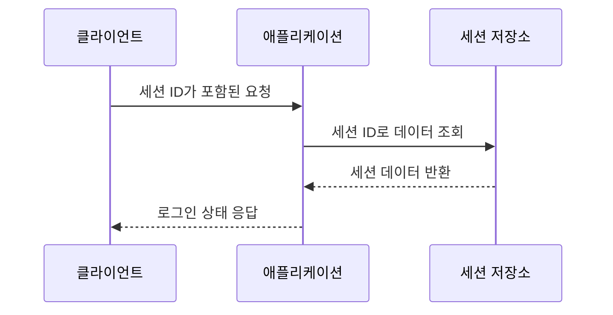
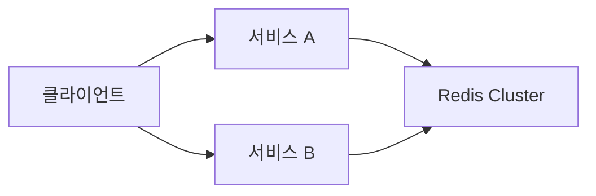
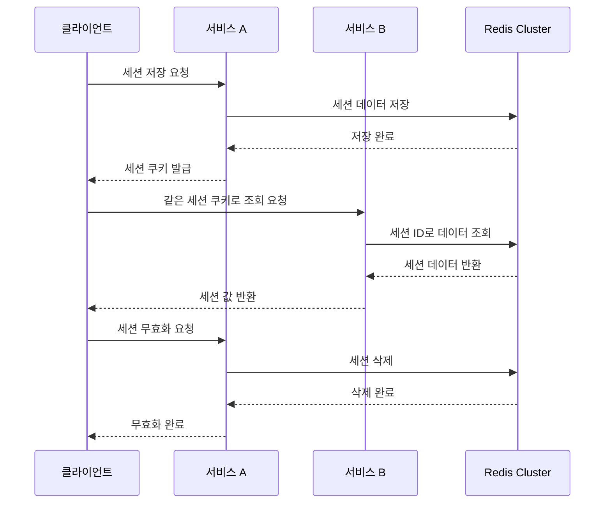

# Redis Session으로 글로벌 세션 구현하기

# Redis Session으로 글로벌 세션 구현하기

* toc
{:toc}

---

## Redis Session으로 글로벌 세션 구현하기

분산 환경에서는 애플리케이션 인스턴스마다 세션을 따로 저장하면 문제가 발생한다.

예를 들어 서비스 A에서 로그인한 뒤 다음 요청이 서비스 B로 전달되면, 서비스 B는 해당 사용자의 세션을 찾지 못할 수 있다.

```text
서비스 A에서 로그인
    -> 서비스 A 메모리에 세션 저장

다음 요청이 서비스 B로 전달
    -> 서비스 B 메모리에는 세션이 없음
    -> 로그인 상태가 사라진 것처럼 보임
```

Redis Session을 사용하면 세션 데이터를 Redis에 저장할 수 있다. 여러 서비스가 같은 Redis Cluster를 사용하면 어떤 서비스로 요청이 전달되더라도 동일한 세션 데이터를 조회할 수 있다.

---

## 개념

### 세션이란?

세션은 사용자의 상태를 서버 측에 저장하는 기능이다.

로그인한 사용자의 정보를 예로 들면 다음과 같다.

```text
sessionId = abc123
userId    = 1001
userName  = Alice
```

클라이언트는 세션 ID를 쿠키로 가지고 있고, 서버는 세션 ID를 기준으로 사용자의 데이터를 조회한다.



일반적인 Spring Boot 애플리케이션에서는 세션이 애플리케이션 서버의 메모리에 저장될 수 있다.

이 방식은 단일 서버에서는 간단하지만, 여러 서버를 사용하는 환경에서는 각 서버의 세션이 서로 분리된다.

---

### 글로벌 세션이란?

글로벌 세션은 여러 애플리케이션 인스턴스가 하나의 세션 저장소를 공유하는 구조이다.



서비스 A와 서비스 B가 같은 Redis Cluster를 사용하면 다음과 같은 흐름이 가능하다.

```text
서비스 A에서 세션 저장
    -> Redis에 세션 데이터 저장

서비스 B에서 세션 조회
    -> 같은 Redis에서 세션 데이터 조회
```

이렇게 하면 요청이 어느 서비스로 전달되더라도 동일한 세션 데이터를 사용할 수 있다.

---

### Redis Session

Spring Session Data Redis를 사용하면 Spring의 `HttpSession` 구현체를 Redis 기반으로 변경할 수 있다.

애플리케이션 코드에서는 기존과 같이 `HttpSession`을 사용한다.

```java
session.setAttribute("userName", "Alice");
```

하지만 실제 데이터는 애플리케이션 메모리가 아니라 Redis에 저장된다.

```text
HttpSession
    -> Spring Session
        -> Redis
```

따라서 컨트롤러에서 Redis 명령어를 직접 작성하지 않아도 세션 데이터를 Redis에 저장하고 조회할 수 있다.

---

## 왜 사용하는가?

### 여러 서비스에서 로그인 상태를 공유하기 위해 사용한다

서비스가 여러 개로 나뉘어 있거나 애플리케이션 인스턴스가 여러 개 실행되면 모든 서비스가 동일한 사용자 상태를 확인해야 한다.

Redis Session을 사용하면 다음과 같은 구조를 만들 수 있다.

```text
서비스 A
서비스 B
서비스 C
    -> Redis Session
```

사용자가 서비스 A에서 로그인해도 서비스 B와 서비스 C에서 같은 세션을 조회할 수 있다.

---

### 로드밸런싱 환경에서 세션 문제를 줄이기 위해 사용한다

로드밸런서는 요청을 여러 서버로 분산한다.

```text
첫 번째 요청 -> 서비스 A
두 번째 요청 -> 서비스 B
세 번째 요청 -> 서비스 C
```

세션이 각 서버의 메모리에 저장되어 있다면 요청이 다른 서버로 전달될 때 세션을 찾지 못할 수 있다.

Redis를 공용 세션 저장소로 사용하면 요청이 어느 서버로 전달되더라도 같은 세션을 조회할 수 있다.

---

### 서버가 추가되어도 동일한 세션 저장소를 사용할 수 있다

서비스가 추가되더라도 새 서비스가 기존 Redis Cluster를 바라보도록 설정하면 별도의 세션 동기화 로직을 만들 필요가 없다.

```text
서비스 A ─┐
서비스 B ─┼── Redis Cluster
서비스 C ─┘
```

애플리케이션 인스턴스가 늘어나도 세션 데이터는 중앙 저장소에서 관리된다.

---

## 주요 특징

### 로컬 세션과 Redis Session 비교

| 구분 | 로컬 세션 | Redis Session |
|---|---|---|
| 저장 위치 | 애플리케이션 메모리 | Redis |
| 여러 서버 공유 | 어려움 | 가능 |
| 서버 재시작 시 | 세션 손실 가능 | Redis가 유지되면 유지 가능 |
| 조회 속도 | 빠름 | 네트워크 통신 필요 |
| 확장성 | 서버 수가 늘면 동기화 필요 | 공용 저장소 사용 |
| 장애 대응 | 특정 서버에 종속 | Redis 구성에 따라 대응 |
| 적합한 환경 | 단일 서버 | 분산 서버, MSA |

로컬 세션은 빠르지만 서버 인스턴스마다 데이터가 분리된다. Redis Session은 Redis 조회 과정이 필요하지만 여러 서비스가 동일한 세션을 사용할 수 있다.

---

### `@EnableRedisHttpSession`

```java
@Configuration
@EnableRedisHttpSession
public class RedisConfig {
}
```

`@EnableRedisHttpSession`은 Spring Session을 활성화하고 Redis를 세션 저장소로 사용하도록 구성한다.

이 어노테이션이 적용되면 `HttpSession`에 저장하는 값이 Redis에 기록된다.

```java
session.setAttribute("key", "value");
```

애플리케이션 코드에서는 일반적인 세션 API를 사용하지만 실제 저장 위치는 Redis가 된다.

세션 만료 시간을 직접 설정할 수도 있다.

```java
@Configuration
@EnableRedisHttpSession(
        maxInactiveIntervalInSeconds = 1800
)
public class RedisConfig {
}
```

위 설정은 세션이 30분 동안 사용되지 않으면 만료되도록 한다.

---

### 세션 쿠키

클라이언트는 세션 ID를 쿠키에 저장한다.

Spring Session에서는 일반적으로 `SESSION`이라는 쿠키 이름을 사용할 수 있다.

```text
SESSION=세션ID
```

서비스 A에서 세션을 생성한 뒤 서비스 B에 같은 쿠키를 전달해야 동일한 세션을 조회할 수 있다.

```text
서비스 A 요청
    -> SESSION 쿠키 발급

서비스 B 요청
    -> 같은 SESSION 쿠키 전달
    -> Redis에서 같은 세션 조회
```

세션 ID가 다르면 Redis에 저장된 세션도 다른 세션으로 인식된다.

---

## 예제

### build.gradle

```gradle
dependencies {
    // Spring Web
    implementation 'org.springframework.boot:spring-boot-starter-web'

    // Spring Session Data Redis
    implementation 'org.springframework.session:spring-session-data-redis'

    // Redis 클라이언트
    implementation 'org.springframework.boot:spring-boot-starter-data-redis'

    // Spring Boot DevTools
    developmentOnly 'org.springframework.boot:spring-boot-devtools'
}
```

각 의존성의 역할은 다음과 같다.

| 의존성 | 역할 |
|---|---|
| `spring-boot-starter-web` | REST Controller와 웹 기능 제공 |
| `spring-session-data-redis` | 세션을 Redis에 저장 |
| `spring-boot-starter-data-redis` | Redis 연결과 RedisTemplate 제공 |
| `spring-boot-devtools` | 개발 중 자동 재시작 지원 |

`spring-session-data-redis`가 실제로 Spring Session과 Redis를 연결하는 핵심 의존성이다.

---

### application.yml

첫 번째 서비스는 8080 포트를 사용한다.

```yaml
server:
  port: 8080

spring:
  session:
    store-type: redis
    timeout: 30m
    cookie:
      name: SESSION
      http-only: true
      secure: false
```

`store-type: redis`는 세션 저장소로 Redis를 사용하도록 설정한다.

`timeout: 30m`은 세션이 30분 동안 사용되지 않으면 만료되도록 설정한다.

`http-only: true`는 JavaScript에서 세션 쿠키에 직접 접근하지 못하도록 한다. 서버 세션 쿠키를 이용한 기본적인 세션 탈취 위험을 줄이는 데 도움이 된다.

`secure: false`는 로컬 HTTP 환경에서 테스트하기 위한 설정이다. HTTPS 환경에서는 `true`로 설정하는 것이 적절하다.

---

### application-b.yml

두 번째 서비스는 다른 포트를 사용해야 한다.

```yaml
server:
  port: 8081

spring:
  session:
    store-type: redis
    timeout: 30m
    cookie:
      name: SESSION
      http-only: true
      secure: false
```

두 서비스의 포트는 달라도 세션 쿠키 이름과 Redis Cluster 연결 설정은 동일해야 한다.

```text
서비스 A: 8080
서비스 B: 8081
세션 저장소: 같은 Redis Cluster
쿠키 이름: SESSION
```

---

### RedisConfig.java

Redis Cluster를 세션 저장소로 사용하는 설정이다.

```java
package com.example.config;

import org.springframework.context.annotation.Bean;
import org.springframework.context.annotation.Configuration;
import org.springframework.data.redis.connection.RedisClusterConfiguration;
import org.springframework.data.redis.connection.RedisClusterNode;
import org.springframework.data.redis.connection.lettuce.LettuceConnectionFactory;
import org.springframework.data.redis.core.RedisTemplate;
import org.springframework.session.data.redis.config.annotation.web.http.EnableRedisHttpSession;

@Configuration
@EnableRedisHttpSession
public class RedisConfig {

    @Bean
    public LettuceConnectionFactory redisConnectionFactory() {
        RedisClusterConfiguration clusterConfiguration =
                new RedisClusterConfiguration();

        clusterConfiguration.addClusterNode(
                new RedisClusterNode("localhost", 7001)
        );
        clusterConfiguration.addClusterNode(
                new RedisClusterNode("localhost", 7002)
        );
        clusterConfiguration.addClusterNode(
                new RedisClusterNode("localhost", 7003)
        );
        clusterConfiguration.addClusterNode(
                new RedisClusterNode("localhost", 7004)
        );
        clusterConfiguration.addClusterNode(
                new RedisClusterNode("localhost", 7005)
        );
        clusterConfiguration.addClusterNode(
                new RedisClusterNode("localhost", 7006)
        );

        return new LettuceConnectionFactory(clusterConfiguration);
    }

    @Bean
    public RedisTemplate<String, Object> redisTemplate(
            LettuceConnectionFactory redisConnectionFactory
    ) {
        RedisTemplate<String, Object> redisTemplate =
                new RedisTemplate<>();

        redisTemplate.setConnectionFactory(redisConnectionFactory);

        return redisTemplate;
    }
}
```

#### RedisClusterConfiguration

Redis Cluster에 연결할 노드 목록을 설정한다.

```java
RedisClusterConfiguration clusterConfiguration =
        new RedisClusterConfiguration();
```

이후 클러스터의 여러 노드를 등록한다.

```java
clusterConfiguration.addClusterNode(
        new RedisClusterNode("localhost", 7001)
);
```

일부 노드가 일시적으로 응답하지 않더라도 다른 노드를 통해 클러스터 정보를 확인할 수 있도록 여러 노드를 등록하는 것이 좋다.

단, 실제 Redis Cluster가 사용하는 포트와 애플리케이션 설정의 포트는 반드시 일치해야 한다.

---

#### LettuceConnectionFactory

```java
return new LettuceConnectionFactory(clusterConfiguration);
```

Lettuce를 사용해 Redis Cluster 연결을 생성한다.

Spring Session은 이 연결을 이용해 세션 데이터를 Redis에 저장하고 조회한다.

---

#### RedisTemplate

```java
RedisTemplate<String, Object> redisTemplate =
        new RedisTemplate<>();
```

`RedisTemplate`은 일반적인 Redis 명령어를 실행하기 위한 객체이다.

Redis Session 자체는 Spring Session이 관리하지만, 세션 상태를 직접 확인하거나 다른 Redis 데이터를 다뤄야 할 때 사용할 수 있다.

---

### SessionController.java

```java
package com.example.session;

import jakarta.servlet.http.HttpSession;
import org.springframework.web.bind.annotation.GetMapping;
import org.springframework.web.bind.annotation.PathVariable;
import org.springframework.web.bind.annotation.PostMapping;
import org.springframework.web.bind.annotation.RequestMapping;
import org.springframework.web.bind.annotation.RequestParam;
import org.springframework.web.bind.annotation.RestController;

@RestController
@RequestMapping("/session")
public class SessionController {

    @PostMapping("/save")
    public String saveSessionData(
            HttpSession session,
            @RequestParam String key,
            @RequestParam String value
    ) {
        session.setAttribute(key, value);

        return "Saved key: " + key
                + ", value: " + value
                + " in session.";
    }

    @GetMapping("/get")
    public String getSessionData(
            HttpSession session,
            @RequestParam String key
    ) {
        Object value = session.getAttribute(key);

        return value != null
                ? "Key: " + key + ", Value: " + value
                : "Key not found.";
    }

    @PostMapping("/invalidate")
    public String invalidateSession(
            HttpSession session
    ) {
        session.invalidate();

        return "Session invalidated.";
    }
}
```

#### 세션 저장

```java
session.setAttribute(key, value);
```

세션에 키와 값을 저장한다.

예를 들어 다음 요청이 들어오면:

```text
POST /session/save?key=userName&value=Alice
```

다음 데이터가 세션에 저장된다.

```text
key   = userName
value = Alice
```

`@EnableRedisHttpSession`이 활성화되어 있기 때문에 이 값은 Redis에 저장된다.

---

#### 세션 조회

```java
Object value = session.getAttribute(key);
```

세션에 저장된 값을 조회한다.

값이 존재하면 다음 문자열을 반환한다.

```text
Key: userName, Value: Alice
```

값이 없으면 다음 문자열을 반환한다.

```text
Key not found.
```

---

#### 세션 무효화

```java
session.invalidate();
```

현재 세션을 무효화한다.

로그아웃과 같은 기능을 구현할 때 사용할 수 있다. 세션이 무효화되면 해당 세션 ID로 더 이상 이전 데이터를 조회할 수 없다.

---

## 구조

Redis Session의 전체 동작 과정은 다음과 같다.



세션 데이터는 다음과 같은 형태로 Redis에 저장될 수 있다.

```text
spring:session:sessions:{session-id}
```

실제 저장 형태는 직렬화 방식과 Spring Session 버전에 따라 달라질 수 있다. Redis CLI에서 조회했을 때 값이 사람이 읽기 어려운 형태로 보일 수 있는데, 이는 세션 객체가 직렬화되어 저장되기 때문이다.

---

## 실무에서의 활용

### Postman으로 세션 저장하기

서비스 A에 세션 저장 요청을 보낸다.

```http
POST http://localhost:8080/session/save?key=userName&value=Alice
```

실행 결과는 다음과 같다.

```text
Saved key: userName, value: Alice in session.
```

이 응답과 함께 세션 쿠키가 발급된다.

```text
SESSION=세션ID
```

Postman에서는 응답의 쿠키를 저장한 상태로 다음 요청을 보내야 한다.

---

### 서비스 B에서 같은 세션 조회하기

서비스 B에 같은 세션 쿠키를 포함해 요청한다.

```http
GET http://localhost:8081/session/get?key=userName
Cookie: SESSION=세션ID
```

실행 결과는 다음과 같다.

```text
Key: userName, Value: Alice
```

서비스 A에서 생성한 세션을 서비스 B에서 조회할 수 있다는 것은 두 서비스가 같은 Redis Session을 사용하고 있다는 의미이다.

세션 쿠키를 전달하지 않으면 서비스 B에서 새로운 세션이 생성될 수 있다.

```text
세션 쿠키 없음
    -> 새로운 sessionId 생성
    -> 기존 세션 조회 실패
```

---

### curl로 세션 공유 확인하기

첫 번째 요청에서 쿠키를 파일에 저장한다.

```bash
curl.exe -i -c cookies.txt -X POST "http://localhost:8080/session/save?key=userName&value=Alice"
```

실행 결과는 다음과 같은 형태이다.

```text
HTTP/1.1 200
Set-Cookie: SESSION=세션ID; Path=/; HttpOnly
Saved key: userName, value: Alice in session.
```

`-c cookies.txt`는 응답으로 받은 쿠키를 `cookies.txt`에 저장한다.

이후 서비스 B에 같은 쿠키를 전달한다.

```bash
curl.exe -i -b cookies.txt "http://localhost:8081/session/get?key=userName"
```

실행 결과는 다음과 같다.

```text
HTTP/1.1 200
Key: userName, Value: Alice
```

`-b cookies.txt`는 파일에 저장된 쿠키를 요청에 포함한다.

---

### 세션 무효화 확인하기

서비스 A에서 세션을 무효화한다.

```http
POST http://localhost:8080/session/invalidate
Cookie: SESSION=세션ID
```

실행 결과:

```text
Session invalidated.
```

이후 서비스 B에서 같은 세션 ID로 값을 조회한다.

```http
GET http://localhost:8081/session/get?key=userName
Cookie: SESSION=세션ID
```

실행 결과:

```text
Key not found.
```

서비스 A에서 무효화한 세션을 서비스 B에서도 더 이상 조회할 수 없다.

---

### Redis에서 세션 키 확인하기

Redis Cluster에 접속해 세션 키를 검색할 수 있다.

```bash
docker exec -it redis-cluster-6 redis-cli -c -p 7001
```

Redis CLI에서 다음 명령어를 실행한다.

```redis
SCAN 0 MATCH spring:session:*
```

실행 결과는 다음과 같은 형태이다.

```text
1) "0"
2) 1) "spring:session:sessions:3f7e..."
```

`SCAN`은 Redis 전체를 멈추지 않고 조건에 맞는 키를 조금씩 검색한다.

세션 키의 남은 만료 시간을 확인할 수 있다.

```redis
TTL spring:session:sessions:3f7e...
```

실행 결과:

```text
(integer) 1798
```

이는 세션이 약 1,798초 후 만료된다는 의미이다.

세션 데이터는 직렬화된 형태로 저장되므로 Redis CLI에서 값을 직접 수정하는 방식은 피하는 것이 좋다. 세션 변경은 애플리케이션의 `HttpSession` API를 통해 처리하는 것이 안전하다.

---

### 세션 저장소 장애를 고려한다

Redis Session을 사용하면 세션 데이터를 Redis에 의존하게 된다.

Redis에 연결할 수 없으면 다음과 같은 문제가 발생할 수 있다.

- 로그인 상태 확인 실패
- 세션 저장 실패
- 로그아웃 처리 실패
- 인증이 필요한 요청 처리 실패

따라서 다음 항목을 운영 환경에서 함께 고려해야 한다.

- Redis Cluster 구성
- Redis Replica 구성
- 연결 timeout 설정
- Redis 장애 모니터링
- 세션 만료 시간 설정
- Redis 장애 시 사용자에게 보여줄 오류 처리
- 세션에 저장하는 데이터의 크기 제한

세션에는 사용자 ID, 권한, 인증 상태처럼 필요한 값만 저장하는 것이 좋다. 큰 객체나 자주 변경되는 비즈니스 데이터를 세션에 저장하면 Redis 메모리와 네트워크 사용량이 증가할 수 있다.

---

### 세션 쿠키 보안 설정

세션 쿠키에는 보안 속성을 적용해야 한다.

```yaml
spring:
  session:
    cookie:
      name: SESSION
      http-only: true
      secure: true
      same-site: lax
```

`http-only`는 JavaScript의 쿠키 접근을 제한한다.

`secure`는 HTTPS 연결에서만 쿠키를 전송하도록 한다. 로컬 HTTP 테스트에서는 `false`로 설정할 수 있지만, HTTPS 환경에서는 `true`로 설정하는 것이 적절하다.

`same-site`는 다른 사이트에서 발생한 요청에 쿠키를 전송할지 제어한다. 애플리케이션의 로그인 구조와 프론트엔드 도메인 구성에 따라 적절한 값을 선택해야 한다.

---

## 정리

애플리케이션 서버의 로컬 메모리에 세션을 저장하면 서버 인스턴스마다 세션이 분리된다. 여러 서비스가 실행되는 분산 환경에서는 요청이 다른 서버로 전달될 때 사용자의 로그인 상태를 찾지 못할 수 있다.

Redis Session은 세션 데이터를 Redis Cluster에 저장해 여러 애플리케이션 인스턴스가 같은 세션을 공유하도록 한다.

Spring Boot에서는 다음 의존성을 추가하고:

```gradle
implementation 'org.springframework.session:spring-session-data-redis'
implementation 'org.springframework.boot:spring-boot-starter-data-redis'
```

`@EnableRedisHttpSession`을 적용하면 `HttpSession`을 Redis 기반으로 사용할 수 있다.

```java
@Configuration
@EnableRedisHttpSession
public class RedisConfig {
}
```

애플리케이션 코드에서는 기존과 같이 세션을 사용한다.

```java
session.setAttribute("userName", "Alice");
session.getAttribute("userName");
session.invalidate();
```

중요한 것은 여러 서비스가 같은 Redis Cluster를 사용하고, 요청마다 같은 세션 쿠키를 전달하는 것이다.

Redis Session은 글로벌 세션을 쉽게 구성할 수 있지만 Redis 장애가 세션 기능 전체에 영향을 줄 수 있다. 따라서 Redis Cluster, 복제, timeout, 세션 만료 시간, 쿠키 보안 설정까지 함께 고려해야 한다.

---

### 한 줄 요약

Redis Session은 세션 데이터를 Redis Cluster에 저장해 여러 애플리케이션 인스턴스가 동일한 로그인 상태와 사용자 세션을 공유하도록 하는 방식이다.
