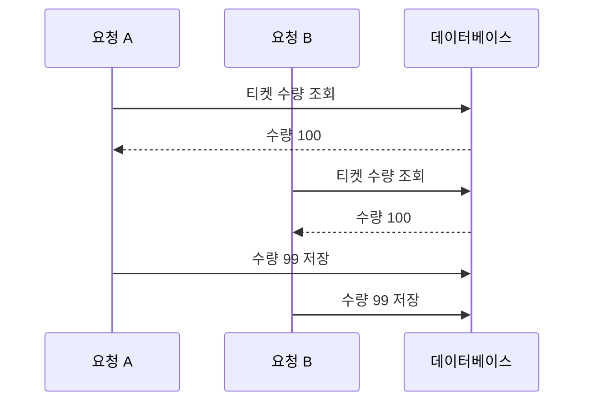
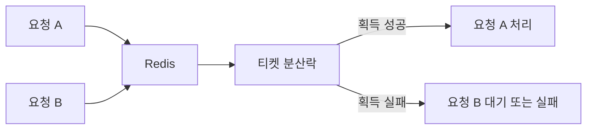
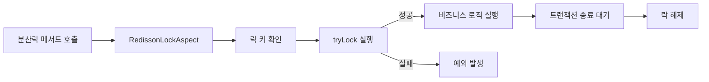
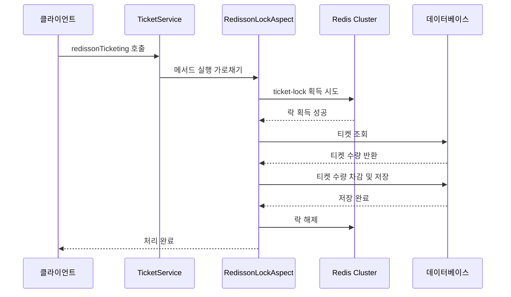
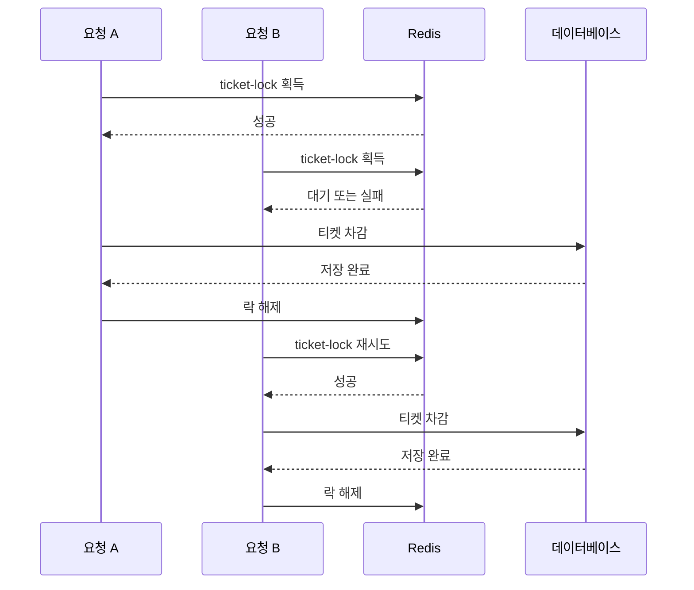

# Redisson으로 동시성 문제 해결해보기

# Redisson으로 동시성 문제 해결해보기

* toc
{:toc}

---

## Redisson으로 동시성 문제 해결하기

분산 환경에서 여러 요청이 하나의 데이터를 동시에 변경하면 데이터가 잘못 저장될 수 있다.

티켓 수량이 100개인 상황에서 여러 사용자가 동시에 티켓을 구매하면 다음과 같은 문제가 발생할 수 있다.

```text
요청 A: 수량 100 조회
요청 B: 수량 100 조회

요청 A: 1개 차감 -> 99 저장
요청 B: 1개 차감 -> 99 저장
```

두 건의 요청이 처리되었지만 최종 수량은 98이 아니라 99가 된다. 이런 문제를 해결하려면 여러 서버가 공유할 수 있는 락이 필요하다.

Redisson은 Redis를 기반으로 동작하는 Java 클라이언트 라이브러리이다. RedisTemplate보다 높은 수준의 분산 자료구조와 분산락 기능을 제공하기 때문에 락 획득, 락 해제, 대기 시간, 락 점유 시간 등을 편리하게 관리할 수 있다.

---

## 개념

### 동시성 문제

동시성 문제는 여러 스레드나 프로세스가 같은 데이터를 동시에 읽고 수정할 때 발생한다.



요청 A와 요청 B 모두 수량 100을 읽었기 때문에 같은 결과인 99를 저장한다. 실제로는 티켓이 2장 판매되었으므로 수량은 98이어야 한다.

---

### 분산락

분산락은 여러 서버나 프로세스가 공유 자원에 동시에 접근하지 못하도록 제어하는 기능이다.

```text
서버 A ─┐
서버 B ─┼── Redis 분산락
서버 C ─┘
```

어떤 서버가 먼저 락을 획득하면 다른 서버는 락이 해제될 때까지 기다리거나 작업을 포기한다.



---

### Redisson

Redisson은 Redis에 저장된 데이터를 Java 객체처럼 사용할 수 있도록 도와주는 라이브러리이다.

다음과 같은 기능을 제공한다.

- 분산락
- 분산 컬렉션
- 분산 객체
- 분산 원자 변수
- 분산 세마포어
- 분산 카운트다운 래치
- Redis Cluster 연결

이번에는 Redisson의 `RLock`과 Spring AOP를 함께 사용해 비즈니스 메서드에 분산락을 적용한다.

---

## 왜 사용하는가?

### Redis 명령어보다 편리하게 분산락을 구현하기 위해 사용한다

Redis의 `SETNX` 명령어를 직접 사용해 분산락을 구현할 수도 있다.

```redis
SET lock:ticket:1 LOCK NX EX 5
```

하지만 실제 서비스에서는 다음 기능까지 직접 관리해야 한다.

- 락 획득 대기
- 락 점유 시간
- 락 해제
- 현재 스레드의 락 소유 여부
- 예외 발생 시 락 해제
- 트랜잭션 종료 시 락 해제
- 락 갱신

Redisson을 사용하면 이러한 기능을 `RLock` API로 처리할 수 있다.

---

### 비즈니스 로직과 락 로직을 분리하기 위해 사용한다

비즈니스 메서드마다 다음 코드를 직접 작성하면 중복이 발생한다.

```java
RLock lock = redissonClient.getLock(lockKey);

try {
    lock.lock();
    // 비즈니스 로직
} finally {
    lock.unlock();
}
```

AOP를 사용하면 메서드에 어노테이션만 붙여 락을 적용할 수 있다.

```java
@RedissonLock(value = TICKET_KEY)
public void redissonTicketing(
        Long ticketId,
        Long quantity
) {
    // 티켓 차감 로직
}
```

락 처리 로직은 Aspect에서 담당하고, 서비스에는 티켓을 차감하는 핵심 로직만 남길 수 있다.

---

### 여러 애플리케이션 인스턴스에서 같은 락을 사용하기 위해 사용한다

`ReentrantLock`은 하나의 JVM 안에서만 동작한다.

```text
서버 A JVM의 ReentrantLock
서버 B JVM의 ReentrantLock
```

두 서버는 서로 다른 락 객체를 사용하므로 같은 자원을 동시에 수정할 수 있다.

Redisson은 Redis에 락을 저장하므로 여러 서버가 같은 락을 확인할 수 있다.

```text
서버 A -> Redis의 lock:ticket:1 확인
서버 B -> Redis의 lock:ticket:1 확인
```

---

## 주요 특징

### `waitTime`

`waitTime`은 락을 획득하기 위해 대기하는 최대 시간이다.

```java
long waitTime() default 5000L;
```

단위는 밀리초이다. 기본값인 5,000밀리초는 최대 5초 동안 락 획득을 시도한다는 의미이다.

```text
waitTime = 5000
```

5초 안에 락을 획득하지 못하면 락 획득에 실패한다.

---

### `leaseTime`

`leaseTime`은 락을 획득한 뒤 락을 유지하는 최대 시간이다.

```java
long leaseTime() default 2000L;
```

기본값인 2,000밀리초는 락을 최대 2초 동안 점유한다는 의미이다.

작업이 2초보다 오래 걸리는데 락이 만료되면 다른 요청이 같은 자원에 접근할 수 있다. 따라서 실제 작업 시간보다 충분히 긴 값을 설정해야 한다.

---

### RedissonLock 어노테이션

```java
package com.example.annotations;

import java.lang.annotation.Documented;
import java.lang.annotation.ElementType;
import java.lang.annotation.Retention;
import java.lang.annotation.RetentionPolicy;
import java.lang.annotation.Target;

@Target(ElementType.METHOD)
@Retention(RetentionPolicy.RUNTIME)
@Documented
public @interface RedissonLock {

    String value();

    long waitTime() default 5000L;

    long leaseTime() default 2000L;
}
```

각 어노테이션 설정은 다음과 같다.

| 설정 | 의미 |
|---|---|
| `@Target(ElementType.METHOD)` | 메서드에만 적용 |
| `@Retention(RetentionPolicy.RUNTIME)` | 실행 중에도 어노테이션 정보 유지 |
| `value` | Redis에 사용할 락 이름 |
| `waitTime` | 락 획득을 기다리는 최대 시간 |
| `leaseTime` | 락을 점유하는 최대 시간 |

---

### Redisson Cluster 연결

```java
package com.example.config;

import org.redisson.Redisson;
import org.redisson.api.RedissonClient;
import org.redisson.config.Config;
import org.springframework.context.annotation.Bean;
import org.springframework.context.annotation.Configuration;

@Configuration
public class RedissonConfig {

    @Bean(destroyMethod = "shutdown")
    public RedissonClient redissonClient() {
        Config config = new Config();

        config.useClusterServers()
                .addNodeAddress(
                        "redis://127.0.0.1:7001",
                        "redis://127.0.0.1:7002",
                        "redis://127.0.0.1:7003",
                        "redis://127.0.0.1:7004",
                        "redis://127.0.0.1:7005",
                        "redis://127.0.0.1:7006"
                )
                .setScanInterval(2000);

        return Redisson.create(config);
    }
}
```

#### `useClusterServers`

Redis Cluster에 연결하기 위한 설정이다.

```java
config.useClusterServers()
```

단일 Redis 서버를 사용할 때는 `useSingleServer()`를 사용할 수 있지만, Redis Cluster를 사용하는 환경에서는 `useClusterServers()`를 사용해야 한다.

#### `addNodeAddress`

Redis Cluster의 노드 주소를 등록한다.

```java
.addNodeAddress(
        "redis://127.0.0.1:7001",
        "redis://127.0.0.1:7002",
        "redis://127.0.0.1:7003",
        "redis://127.0.0.1:7004",
        "redis://127.0.0.1:7005",
        "redis://127.0.0.1:7006"
)
```

Redis Cluster가 실제로 실행 중인 포트와 애플리케이션에 설정한 포트는 반드시 일치해야 한다.

#### `setScanInterval`

```java
.setScanInterval(2000)
```

클러스터 노드 정보를 갱신하는 주기를 밀리초로 설정한다. 2,000은 2초마다 클러스터 노드 정보를 확인한다는 의미이다.

---

## 예제

### build.gradle

```gradle
dependencies {
    // Spring Data JPA
    implementation 'org.springframework.boot:spring-boot-starter-data-jpa'

    // MySQL Driver
    runtimeOnly 'com.mysql:mysql-connector-j'

    // Caffeine Cache
    implementation 'com.github.ben-manes.caffeine:caffeine'

    // Lombok
    compileOnly 'org.projectlombok:lombok'
    annotationProcessor 'org.projectlombok:lombok'

    // Spring Data Redis
    implementation 'org.springframework.boot:spring-boot-starter-data-redis'

    // Lettuce
    implementation 'io.lettuce:lettuce-core'

    // Spring Session Data Redis
    implementation 'org.springframework.session:spring-session-data-redis'

    // Redisson
    implementation 'org.redisson:redisson-spring-boot-starter:3.27.0'

    // H2 Database
    runtimeOnly 'com.h2database:h2'

    // Spring Boot DevTools
    developmentOnly 'org.springframework.boot:spring-boot-devtools'

    // Test
    testImplementation 'org.springframework.boot:spring-boot-starter-test'
}

springBoot {
    mainClass.set('com.example.RedisApplication')
}

bootJar {
    archiveFileName = 'service-redis.jar'
}
```

Redisson을 사용하기 위해 다음 의존성이 필요하다.

```gradle
implementation 'org.redisson:redisson-spring-boot-starter:3.27.0'
```

이 Starter를 사용하면 Spring Boot에서 Redisson을 Bean으로 등록하고 주입받을 수 있다.

---

### RedissonLockAspect.java

```java
package com.example.aop;

import com.example.annotations.RedissonLock;
import lombok.RequiredArgsConstructor;
import lombok.extern.slf4j.Slf4j;
import org.aspectj.lang.ProceedingJoinPoint;
import org.aspectj.lang.annotation.Around;
import org.aspectj.lang.annotation.Aspect;
import org.aspectj.lang.reflect.MethodSignature;
import org.redisson.api.RLock;
import org.redisson.api.RedissonClient;
import org.springframework.stereotype.Component;
import org.springframework.transaction.support.TransactionSynchronization;
import org.springframework.transaction.support.TransactionSynchronizationManager;

import java.lang.reflect.Method;
import java.util.concurrent.TimeUnit;

@Slf4j
@Aspect
@Component
@RequiredArgsConstructor
public class RedissonLockAspect {

    private final RedissonClient redissonClient;

    @Around("@annotation(com.example.annotations.RedissonLock)")
    public Object redissonLock(
            ProceedingJoinPoint joinPoint
    ) throws Throwable {
        MethodSignature signature =
                (MethodSignature) joinPoint.getSignature();

        Method method = signature.getMethod();

        RedissonLock annotation =
                method.getAnnotation(RedissonLock.class);

        String lockKey = annotation.value();

        RLock lock = redissonClient.getLock(lockKey);

        boolean lockable = false;

        try {
            // 락 획득 시도
            lockable = lock.tryLock(
                    annotation.waitTime(),
                    annotation.leaseTime(),
                    TimeUnit.MILLISECONDS
            );

            log.info(
                    "name: {}, locked: {}, lockable: {}",
                    lock.getName(),
                    lock.isLocked(),
                    lockable
            );

            if (!lockable) {
                throw new IllegalStateException(
                        "Could not acquire lock for key: " + lockKey
                );
            }

            log.info("락 획득 성공: {}", lockKey);

            // 트랜잭션 종료 후 락 해제를 등록
            if (TransactionSynchronizationManager
                    .isSynchronizationActive()) {

                TransactionSynchronizationManager
                        .registerSynchronization(
                                new TransactionSynchronization() {
                                    @Override
                                    public void afterCompletion(
                                            int status
                                    ) {
                                        if (lock.isHeldByCurrentThread()) {
                                            lock.unlock();

                                            log.info(
                                                    "트랜잭션 종료 후 락 해제: {}",
                                                    lockKey
                                            );
                                        }
                                    }
                                }
                        );
            }

            // 비즈니스 로직 수행
            return joinPoint.proceed();

        } catch (InterruptedException e) {
            Thread.currentThread().interrupt();

            throw new IllegalStateException(
                    "Interrupted while acquiring lock: "
                            + lockKey,
                    e
            );

        } catch (IllegalStateException e) {
            log.info("락 획득 실패: {}", lockKey);

            throw e;

        } finally {
            // 트랜잭션이 없거나 동기화가 활성화되지 않은 경우 락 해제
            if (!TransactionSynchronizationManager
                    .isSynchronizationActive()
                    && lock.isHeldByCurrentThread()) {

                lock.unlock();

                log.info(
                        "트랜잭션 외부에서 락 해제: {}",
                        lockKey
                );
            }
        }
    }
}
```

---

### Aspect 실행 흐름

Aspect는 `@RedissonLock`이 붙은 메서드 실행 전후에 동작한다.



동작 순서는 다음과 같다.

1. 실행할 메서드의 `RedissonLock` 어노테이션을 조회한다.
2. 어노테이션의 `value`에서 락 키를 가져온다.
3. Redisson에서 해당 락 객체를 가져온다.
4. `waitTime`과 `leaseTime`을 사용해 락 획득을 시도한다.
5. 락 획득에 성공하면 비즈니스 로직을 실행한다.
6. 트랜잭션이 있다면 트랜잭션 종료 후 락을 해제한다.
7. 트랜잭션이 없다면 `finally`에서 락을 해제한다.

---

### `tryLock`

```java
lockable = lock.tryLock(
        annotation.waitTime(),
        annotation.leaseTime(),
        TimeUnit.MILLISECONDS
);
```

`tryLock`은 무조건 기다리는 것이 아니라 지정된 시간 동안만 락 획득을 시도한다.

```text
waitTime = 5000ms
leaseTime = 2000ms
```

위 설정은 최대 5초 동안 락을 기다리고, 락을 획득하면 최대 2초 동안 점유한다는 의미이다.

---

### `isHeldByCurrentThread`

```java
if (lock.isHeldByCurrentThread()) {
    lock.unlock();
}
```

현재 실행 중인 스레드가 해당 락을 가지고 있는지 확인한다.

다른 스레드가 획득한 락을 해제하면 안 되기 때문에 락을 해제하기 전에 소유 여부를 확인하는 것이 중요하다.

---

### 트랜잭션 종료 후 락 해제

데이터베이스 트랜잭션이 아직 끝나지 않았는데 락을 먼저 해제하면 다른 요청이 변경 중인 데이터를 읽거나 수정할 수 있다.

```text
1. 락 획득
2. 데이터베이스 변경
3. 트랜잭션 커밋
4. 락 해제
```

따라서 트랜잭션이 활성화된 경우 `afterCompletion`에서 락을 해제한다.

```java
TransactionSynchronizationManager
        .registerSynchronization(
                new TransactionSynchronization() {
                    @Override
                    public void afterCompletion(
                            int status
                    ) {
                        if (lock.isHeldByCurrentThread()) {
                            lock.unlock();
                        }
                    }
                }
        );
```

이렇게 하면 트랜잭션이 정상적으로 커밋되거나 롤백된 이후 락이 해제된다.

---

### Ticket.java

```java
package com.example.tickets;

import jakarta.persistence.Entity;
import jakarta.persistence.GeneratedValue;
import jakarta.persistence.GenerationType;
import jakarta.persistence.Id;
import lombok.Data;
import lombok.NoArgsConstructor;
import lombok.Setter;

@Data
@Entity
@NoArgsConstructor
public class Ticket {

    @Id
    @GeneratedValue(strategy = GenerationType.IDENTITY)
    private Long id;

    @Setter
    private Long quantity;

    public static Ticket create(Long quantity) {
        Ticket entity = new Ticket();
        entity.setQuantity(quantity);

        return entity;
    }

    public void decrease(Long quantity) {
        long remainingQuantity =
                this.quantity - quantity;

        this.quantity =
                remainingQuantity < 0
                        ? 0L
                        : remainingQuantity;
    }
}
```

`Ticket`은 티켓 수량을 저장하는 엔티티이다.

```java
public void decrease(Long quantity) {
    long remainingQuantity =
            this.quantity - quantity;

    this.quantity =
            remainingQuantity < 0
                    ? 0L
                    : remainingQuantity;
}
```

현재 수량에서 요청 수량을 차감하고, 결과가 0보다 작으면 0으로 설정한다.

다만 실제 주문 시스템에서는 재고가 부족한 경우 0으로 저장하기보다 예외를 발생시키고 주문을 거부하는 것이 더 안전하다.

---

### TicketRepository.java

```java
package com.example.tickets;

import org.springframework.data.jpa.repository.JpaRepository;

public interface TicketRepository
        extends JpaRepository<Ticket, Long> {
}
```

`JpaRepository<Ticket, Long>`을 상속하면 티켓을 ID로 조회하고 저장할 수 있다.

---

### TicketService.java

```java
package com.example.tickets;

import com.example.annotations.RedissonLock;
import lombok.RequiredArgsConstructor;
import lombok.extern.slf4j.Slf4j;
import org.springframework.stereotype.Service;
import org.springframework.transaction.annotation.Transactional;

@Slf4j
@Service
@RequiredArgsConstructor
@Transactional
public class TicketService {

    private static final String TICKET_KEY = "ticket-lock";

    private final TicketRepository ticketRepository;

    public void ticketing(
            Long ticketId,
            Long quantity
    ) {
        Ticket ticket =
                ticketRepository.findById(ticketId)
                        .orElseThrow();

        ticket.decrease(quantity);

        log.info(
                "quantity: {}, after quantity: {}",
                quantity,
                ticket.getQuantity()
        );

        ticketRepository.saveAndFlush(ticket);
    }

    public void normalTicketing(
            Long ticketId,
            Long quantity
    ) {
        ticketing(ticketId, quantity);
    }

    @RedissonLock(value = TICKET_KEY)
    public void redissonTicketing(
            Long ticketId,
            Long quantity
    ) {
        ticketing(ticketId, quantity);
    }
}
```

`normalTicketing`은 분산락 없이 티켓을 차감한다.

```java
public void normalTicketing(
        Long ticketId,
        Long quantity
) {
    ticketing(ticketId, quantity);
}
```

여러 요청이 동시에 실행되면 같은 수량을 읽고 덮어쓸 수 있다.

`redissonTicketing`에는 `@RedissonLock`을 적용한다.

```java
@RedissonLock(value = TICKET_KEY)
public void redissonTicketing(
        Long ticketId,
        Long quantity
) {
    ticketing(ticketId, quantity);
}
```

메서드가 실행되기 전에 Aspect가 먼저 락을 획득하고, 비즈니스 로직이 끝난 뒤 락을 해제한다.

---

## 구조

Redisson AOP를 적용한 티켓 차감 흐름은 다음과 같다.



두 요청이 동시에 들어오면 한 요청만 락을 획득한다.



---

## 실무에서의 활용

### 락 키를 자원의 단위에 맞게 설정한다

다음과 같이 하나의 고정된 락 키를 사용하면 모든 티켓 요청이 하나의 락을 공유한다.

```java
private static final String TICKET_KEY = "ticket-lock";
```

티켓이 하나뿐인 테스트에서는 문제가 없지만, 티켓 종류가 여러 개라면 서로 다른 티켓의 요청까지 대기하게 된다.

```text
티켓 1 요청 -> ticket-lock
티켓 2 요청 -> ticket-lock
티켓 3 요청 -> ticket-lock
```

실제 서비스에서는 티켓 ID별로 락 키를 분리하는 것이 더 효율적이다.

```text
lock:ticket:1
lock:ticket:2
lock:ticket:3
```

티켓 1에 대한 요청끼리만 서로 대기하고, 티켓 2와 티켓 3은 동시에 처리할 수 있다.

---

### 어노테이션의 `value`를 동적으로 처리한다

현재 Aspect는 다음과 같이 어노테이션의 값을 그대로 락 키로 사용한다.

```java
String lockKey = annotation.value();
```

따라서 다음과 같이 작성해도 `#ticketId`가 자동으로 실제 티켓 ID로 변환되는 것은 아니다.

```java
@RedissonLock(value = "#ticketId")
```

별도의 SpEL 처리 로직이 없다면 `#ticketId`라는 문자열 자체가 락 키가 된다.

```text
실제 의도: lock:ticket:1001
실제 생성: #ticketId
```

동적 락 키를 사용하려면 다음 중 하나가 필요하다.

- Aspect에서 SpEL 표현식 해석
- 메서드 실행 전에 직접 락 키 생성
- 티켓별 락 객체를 직접 생성
- Redisson의 별도 락 추상화 사용

동적 키를 제대로 해석하지 않으면 모든 티켓이 하나의 락을 공유하거나, 반대로 의도한 자원을 보호하지 못할 수 있다.

---

### 락 범위는 필요한 만큼만 설정한다

다음처럼 메서드 전체에 락을 걸면 조회부터 저장까지 모든 작업이 락으로 보호된다.

```java
@RedissonLock(value = TICKET_KEY)
public void redissonTicketing(
        Long ticketId,
        Long quantity
) {
    ticketing(ticketId, quantity);
}
```

락 내부에서 다음 작업까지 수행하면 락 점유 시간이 길어질 수 있다.

- 외부 API 호출
- 파일 생성
- 복잡한 계산
- 불필요한 데이터 조회
- 여러 테이블에 대한 대량 처리

락은 반드시 동시에 실행되면 안 되는 작업에만 적용하는 것이 좋다.

---

### `leaseTime`을 작업 시간에 맞춘다

```java
long leaseTime() default 2000L;
```

작업이 2초보다 오래 걸리는데 락이 만료되면 다른 요청이 같은 티켓을 처리할 수 있다.

```text
작업 시간: 5초
leaseTime: 2초
```

이 경우 작업이 끝나기 전에 락이 풀릴 수 있다.

작업 시간이 일정하지 않다면 다음 방법을 고려할 수 있다.

- 충분히 긴 `leaseTime` 설정
- 락 갱신 방식 사용
- Redisson watchdog 기능 활용
- 긴 작업을 짧은 작업으로 분리
- 비동기 작업으로 전환

Redisson의 자동 락 갱신 기능을 사용할지, 고정된 `leaseTime`을 사용할지는 작업 시간과 장애 대응 정책에 따라 결정해야 한다.

---

### 트랜잭션과 락의 순서를 확인한다

티켓 차감에서는 일반적으로 다음 순서가 필요하다.

```text
락 획득
    -> 데이터베이스 조회
    -> 수량 검증
    -> 수량 차감
    -> 데이터베이스 저장
    -> 트랜잭션 커밋
    -> 락 해제
```

트랜잭션이 커밋되기 전에 락을 해제하면 다른 요청이 아직 확정되지 않은 데이터를 기준으로 작업할 수 있다.

반대로 트랜잭션이 끝났는데도 락을 계속 유지하면 불필요하게 다른 요청이 대기한다.

---

### 락 획득 실패를 처리한다

락을 획득하지 못했을 때 무조건 내부 서버 오류로 응답하기보다 비즈니스에 맞는 방식으로 처리해야 한다.

```text
락 획득 실패
    -> 즉시 실패 응답
    -> 짧은 시간 재시도
    -> 대기열에 저장
    -> 사용자에게 다시 시도 안내
```

티켓팅처럼 선착순성이 중요한 기능은 락을 오래 기다리게 하기보다 빠르게 실패시키고 재시도하도록 만들 수 있다.

반면 백그라운드 작업이라면 일정 횟수만큼 재시도한 뒤 실패 로그를 남기는 방식이 적합할 수 있다.

---

### 테스트 결과를 비교한다

티켓 수량이 100개이고 100개의 요청이 동시에 들어왔다고 가정한다.

분산락이 없으면 여러 요청이 같은 수량을 읽고 덮어쓰면서 최종 수량이 예상보다 많이 남을 수 있다.

```text
기대 수량: 0
실제 수량: 10 또는 그 이상
```

Redisson 분산락을 적용하면 한 번에 하나의 요청만 수량을 조회하고 저장한다.

```text
요청 A: 100 -> 99
요청 B: 99 -> 98
요청 C: 98 -> 97
```

실제 테스트에서는 다음 항목을 함께 확인해야 한다.

- 동시에 실행한 요청 수
- 성공한 요청 수
- 최종 티켓 수량
- 락 획득 실패 횟수
- 평균 락 대기 시간
- 락 점유 시간
- 예외 발생 여부
- 트랜잭션 롤백 여부

단순히 로그에 락 획득 메시지가 출력되는 것만으로 동시성 문제가 해결되었다고 판단해서는 안 된다. 최종 데이터와 성공한 비즈니스 요청 수가 일치하는지 확인해야 한다.

---

## 정리

Redisson은 Redis를 기반으로 분산락을 구현할 수 있는 Java 클라이언트 라이브러리이다.

Redis의 `SETNX`를 직접 사용하는 방식보다 락 획득, 대기 시간, 점유 시간, 현재 스레드의 락 소유 여부, 락 해제 등을 편리하게 처리할 수 있다.

Spring AOP와 커스텀 어노테이션을 함께 사용하면 비즈니스 메서드에 다음과 같이 락을 적용할 수 있다.

```java
@RedissonLock(value = TICKET_KEY)
public void redissonTicketing(
        Long ticketId,
        Long quantity
) {
    ticketing(ticketId, quantity);
}
```

Aspect에서는 어노테이션 정보를 읽고 `RLock`을 생성한다.

```java
RLock lock = redissonClient.getLock(lockKey);
```

이후 `tryLock`으로 일정 시간 동안 락 획득을 시도한다.

```java
lock.tryLock(
        annotation.waitTime(),
        annotation.leaseTime(),
        TimeUnit.MILLISECONDS
);
```

트랜잭션이 있는 경우에는 데이터베이스 트랜잭션이 종료된 뒤 락을 해제해야 한다. 트랜잭션이 없는 경우에는 `finally`에서 락을 해제한다.

실무에서는 다음 항목을 특히 주의해야 한다.

- 락 키를 자원별로 분리하기
- `waitTime`과 `leaseTime` 구분하기
- 작업 시간보다 짧은 TTL 사용하지 않기
- 락 소유 스레드만 해제하기
- 트랜잭션 종료 후 락 해제하기
- 동적 락 키 표현식이 실제로 해석되는지 확인하기
- Redis 장애와 락 획득 실패 처리하기
- 동시 요청 후 최종 데이터 검증하기

Redisson 분산락은 동시성 문제를 해결하는 도구이지 데이터베이스 트랜잭션을 대신하는 기능은 아니다. 락과 트랜잭션의 범위를 함께 설계해야 티켓 수량이나 재고와 같은 공유 데이터를 안전하게 처리할 수 있다.

---

### 한 줄 요약

Redisson의 `RLock`과 AOP를 활용하면 여러 서버에서 실행되는 티켓 차감과 재고 변경 작업을 하나씩 처리해 동시성 문제를 줄일 수 있다.
