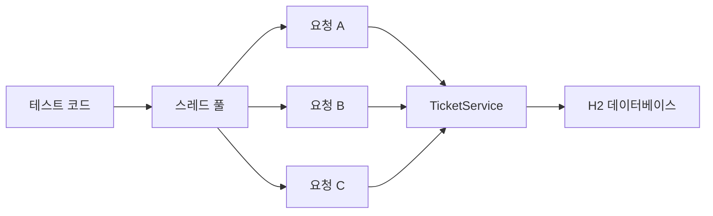
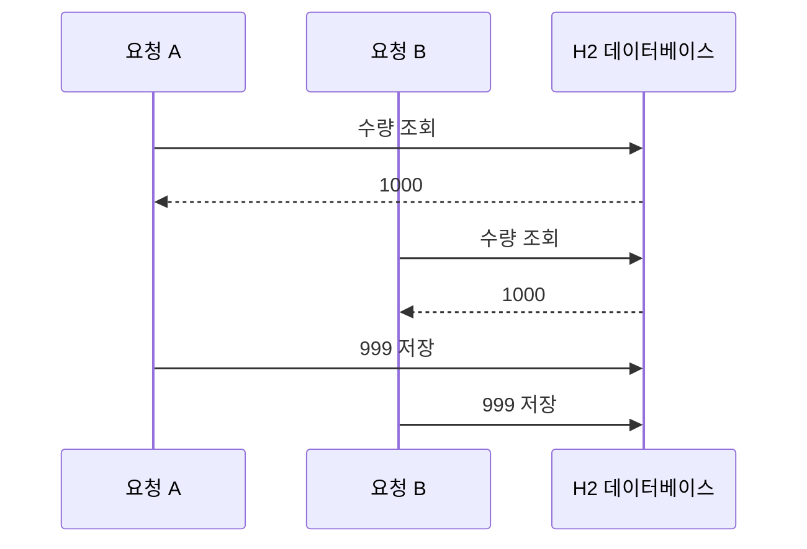
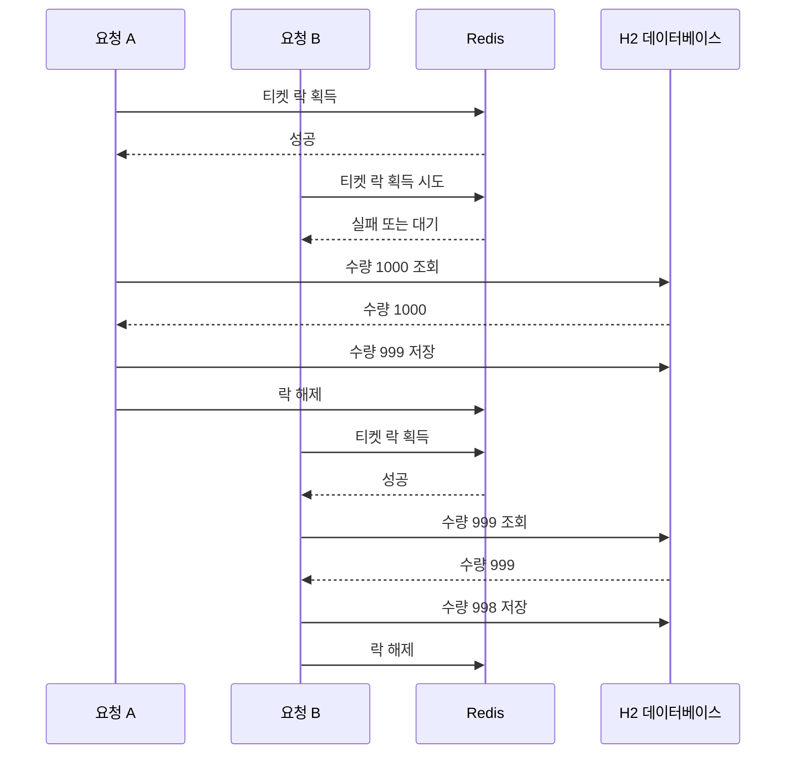

# 테스트코드로 분산락 테스트하기

# 테스트코드로 분산락 테스트하기

* toc
{:toc}

---

## 테스트 코드로 Redisson 분산락 검증하기

분산락은 코드를 작성하는 것만으로 충분하지 않다. 여러 요청이 동시에 들어왔을 때 실제로 데이터가 안전하게 변경되는지 테스트해야 한다.

티켓이 1,000개 있고 100명의 사용자가 동시에 1장씩 구매한다고 가정해 보자.

```text
초기 수량: 1000
동시 주문 수: 100
기대 수량: 900
```

분산락이 없다면 여러 요청이 같은 수량을 읽고 저장하면서 일부 차감이 사라질 수 있다. Redisson 분산락을 적용하면 한 번에 하나의 요청만 티켓 수량을 변경할 수 있다.

---

## 개념

### 동시성 테스트

동시성 테스트는 여러 스레드에서 같은 비즈니스 로직을 동시에 실행한 뒤 최종 결과를 검증하는 테스트이다.



테스트에서는 다음 요소를 사용한다.

| 구성 요소 | 역할 |
|---|---|
| `@SpringBootTest` | Spring Context를 실제로 구성 |
| `@ActiveProfiles("test")` | 테스트 환경 설정 사용 |
| `ExecutorService` | 여러 스레드에서 작업 실행 |
| `CountDownLatch` | 모든 작업이 끝날 때까지 대기 |
| `@BeforeEach` | 테스트 전 초기 티켓 생성 |
| `@AfterEach` | 테스트 후 데이터 삭제 |
| `assertEquals` | 최종 수량 검증 |

---

### 테스트 격리

테스트에서 운영 데이터베이스를 사용하면 실제 데이터가 변경될 수 있다. 따라서 별도의 테스트 데이터베이스를 사용해야 한다.

H2의 인메모리 데이터베이스를 사용하면 테스트가 시작될 때 데이터베이스가 생성되고, 테스트가 끝나면 데이터가 사라진다.

```text
테스트 시작
    -> H2 데이터베이스 생성
    -> 티켓 데이터 저장
    -> 동시성 테스트 실행
    -> 결과 검증
    -> H2 데이터베이스 삭제
```

---

## 왜 사용하는가?

### 분산락 적용 전후를 비교하기 위해 사용한다

같은 티켓 차감 로직을 다음 두 가지 방식으로 실행한다.

```text
1. 분산락 없이 실행
2. Redisson 분산락을 적용해 실행
```

두 결과를 비교하면 락이 실제로 동시성 문제를 해결하는지 확인할 수 있다.

---

### 최종 데이터의 정확성을 검증하기 위해 사용한다

초기 수량이 1,000개이고 100개의 요청이 각각 1개씩 차감하면 최종 수량은 900개여야 한다.

```java
assertEquals(
        originQuantity - CONCURRENT_COUNT,
        ticket.getQuantity()
);
```

테스트가 확인하는 것은 단순히 메서드가 예외 없이 실행되었는지가 아니다.

```text
실제 성공한 차감 횟수
    = 초기 수량 - 최종 수량
```

실제 차감 횟수가 요청 횟수와 같은지 확인해야 한다.

---

## 주요 특징

### `@SpringBootTest`

```java
@SpringBootTest
```

Spring Boot 애플리케이션의 전체 Context를 구성한다.

따라서 다음 Bean을 실제로 주입받을 수 있다.

```java
@Autowired
TicketService ticketService;

@Autowired
TicketRepository ticketRepository;
```

단위 테스트보다 실행 비용은 크지만, JPA, Redis, Redisson, AOP가 함께 동작하는 흐름을 확인할 수 있다.

---

### `@ActiveProfiles("test")`

```java
@ActiveProfiles("test")
```

테스트 실행 시 `application-test.yml` 설정을 사용하도록 지정한다.

운영 데이터베이스 대신 H2를 사용하려면 테스트 전용 프로파일을 분리해야 한다.

---

### `ExecutorService`

```java
ExecutorService executorService =
        Executors.newFixedThreadPool(32);
```

최대 32개의 스레드를 사용하는 스레드 풀을 생성한다.

동시 요청 수가 100개이더라도 동시에 실행할 수 있는 스레드 수는 32개이다. 작업이 끝난 스레드는 다음 작업을 다시 처리한다.

---

### `CountDownLatch`

```java
CountDownLatch latch =
        new CountDownLatch(CONCURRENT_COUNT);
```

모든 동시 작업이 끝날 때까지 테스트 스레드를 대기시킨다.

각 작업이 끝나면 카운트를 하나 줄인다.

```java
finally {
    latch.countDown();
}
```

카운트가 0이 되면 대기 중이던 테스트 코드가 다음 단계로 진행한다.

---

### `Consumer<Void>`

```java
private void ticketingTest(
        Consumer<Void> action
) throws InterruptedException
```

공통적인 동시 실행 흐름은 하나만 만들고, 실제로 실행할 티켓팅 메서드만 외부에서 전달한다.

```java
ticketingTest(
        unused -> ticketService.normalTicketing(
                TICKET_ID,
                1L
        )
);
```

```java
ticketingTest(
        unused -> ticketService.redissonTicketing(
                TICKET_ID,
                1L
        )
);
```

이 방식으로 분산락을 적용하지 않은 경우와 적용한 경우를 같은 조건에서 비교할 수 있다.

---

## 예제

### build.gradle

```gradle
dependencies {
    // Spring Data JPA
    implementation 'org.springframework.boot:spring-boot-starter-data-jpa'

    // MySQL Driver
    runtimeOnly 'com.mysql:mysql-connector-j'

    // Caffeine Cache
    implementation 'com.github.ben-manes.caffeine:caffeine'

    // Lombok
    compileOnly 'org.projectlombok:lombok'
    annotationProcessor 'org.projectlombok:lombok'

    // Spring Data Redis
    implementation 'org.springframework.boot:spring-boot-starter-data-redis'

    // Lettuce
    implementation 'io.lettuce:lettuce-core'

    // Spring Session Data Redis
    implementation 'org.springframework.session:spring-session-data-redis'

    // Redisson
    implementation 'org.redisson:redisson-spring-boot-starter:3.27.0'

    // H2 Database
    runtimeOnly 'com.h2database:h2'

    // Spring Boot DevTools
    developmentOnly 'org.springframework.boot:spring-boot-devtools'

    // Test
    testImplementation 'org.springframework.boot:spring-boot-starter-test'
}

springBoot {
    mainClass.set('com.example.RedisApplication')
}

bootJar {
    archiveFileName = 'service-redis.jar'
}
```

테스트에서는 H2를 사용하므로 다음 의존성이 필요하다.

```gradle
runtimeOnly 'com.h2database:h2'
```

Redisson 분산락을 사용하는 서비스 코드를 테스트하기 위해 Redisson 의존성도 필요하다.

```gradle
implementation 'org.redisson:redisson-spring-boot-starter:3.27.0'
```

---

### application-test.yml

```yaml
spring:
  datasource:
    url: jdbc:h2:mem:testdb
    driver-class-name: org.h2.Driver
    username: sa
    password:

  jpa:
    hibernate:
      ddl-auto: create-drop
    properties:
      hibernate:
        dialect: org.hibernate.dialect.H2Dialect

  data:
    redis:
      cluster:
        nodes:
          - localhost:7001
          - localhost:7002
          - localhost:7003
          - localhost:7004
          - localhost:7005
          - localhost:7006
      lettuce:
        pool:
          max-active: 8
          max-idle: 8
          min-idle: 0
```

#### H2 설정

```yaml
url: jdbc:h2:mem:testdb
```

`mem:testdb`는 메모리 안에 `testdb`라는 이름의 데이터베이스를 생성한다.

```yaml
ddl-auto: create-drop
```

테스트 시작 시 테이블을 생성하고, 테스트가 종료되면 테이블을 삭제한다.

테스트마다 초기화된 데이터베이스를 사용할 수 있기 때문에 테스트 간 데이터가 섞이는 문제를 줄일 수 있다.

#### Redis 설정

테스트 데이터베이스는 H2를 사용하지만 분산락은 실제 Redis Cluster를 사용한다.

```yaml
nodes:
  - localhost:7001
  - localhost:7002
  - localhost:7003
  - localhost:7004
  - localhost:7005
  - localhost:7006
```

분산락의 동작을 검증하려면 테스트 애플리케이션이 Redisson이 연결할 수 있는 Redis Cluster를 사용해야 한다.

---

### TicketServiceTest.java

```java
package com.example.tickets;

import lombok.extern.slf4j.Slf4j;
import org.junit.jupiter.api.AfterEach;
import org.junit.jupiter.api.BeforeEach;
import org.junit.jupiter.api.DisplayName;
import org.junit.jupiter.api.Test;
import org.springframework.beans.factory.annotation.Autowired;
import org.springframework.boot.test.context.SpringBootTest;
import org.springframework.test.context.ActiveProfiles;

import java.util.concurrent.CountDownLatch;
import java.util.concurrent.ExecutorService;
import java.util.concurrent.Executors;
import java.util.function.Consumer;

import static org.junit.jupiter.api.Assertions.assertEquals;

@Slf4j
@SpringBootTest
@ActiveProfiles("test")
class TicketServiceTest {

    @Autowired
    TicketService ticketService;

    @Autowired
    TicketRepository ticketRepository;

    private Long ticketId;

    @BeforeEach
    public void before() {
        log.info("1000개의 티켓 생성");

        Ticket ticket = Ticket.create(1000L);

        Ticket savedTicket =
                ticketRepository.saveAndFlush(ticket);

        ticketId = savedTicket.getId();

        log.info("ticketId: {}", ticketId);
    }

    @AfterEach
    public void after() {
        ticketRepository.deleteAll();
    }

    private void ticketingTest(
            Consumer<Void> action
    ) throws InterruptedException {
        log.info("ticketingTest");

        Long originQuantity =
                ticketRepository.findById(ticketId)
                        .orElseThrow()
                        .getQuantity();

        log.info(
                "originQuantity: {}",
                originQuantity
        );

        ExecutorService executorService =
                Executors.newFixedThreadPool(32);

        int concurrentCount = 100;

        CountDownLatch latch =
                new CountDownLatch(concurrentCount);

        try {
            for (int i = 0; i < concurrentCount; i++) {
                executorService.submit(() -> {
                    try {
                        action.accept(null);
                    } finally {
                        latch.countDown();
                    }
                });
            }

            latch.await();

        } finally {
            executorService.shutdownNow();
        }

        Ticket ticket =
                ticketRepository.findById(ticketId)
                        .orElseThrow();

        assertEquals(
                originQuantity - concurrentCount,
                ticket.getQuantity()
        );
    }

    @Test
    @DisplayName("동시에 100명의 티켓팅 : 동시성 이슈")
    public void badTicketingTest()
            throws Exception {
        ticketingTest(
                unused -> ticketService.normalTicketing(
                        ticketId,
                        1L
                )
        );
    }

    @Test
    @DisplayName("동시에 100명의 티켓팅 : 분산락")
    public void redissonTicketingTest()
            throws Exception {
        ticketingTest(
                unused -> ticketService.redissonTicketing(
                        ticketId,
                        1L
                )
        );
    }
}
```

---

### 테스트 초기화

```java
@BeforeEach
public void before() {
    Ticket ticket = Ticket.create(1000L);

    Ticket savedTicket =
            ticketRepository.saveAndFlush(ticket);

    ticketId = savedTicket.getId();
}
```

`@BeforeEach`는 각각의 테스트 메서드가 실행되기 전에 호출된다.

따라서 두 테스트는 항상 티켓 수량 1,000개에서 시작한다.

```text
badTicketingTest
    -> 티켓 1000개 생성
    -> 테스트 실행
    -> 데이터 삭제

redissonTicketingTest
    -> 티켓 1000개 생성
    -> 테스트 실행
    -> 데이터 삭제
```

---

### 테스트 종료 후 정리

```java
@AfterEach
public void after() {
    ticketRepository.deleteAll();
}
```

`@AfterEach`는 각각의 테스트가 끝난 뒤 실행된다.

테스트에서 생성한 티켓 데이터를 삭제해 다음 테스트에 영향을 주지 않도록 한다.

---

### 동시 요청 실행

```java
for (int i = 0; i < concurrentCount; i++) {
    executorService.submit(() -> {
        try {
            action.accept(null);
        } finally {
            latch.countDown();
        }
    });
}
```

100개의 작업을 스레드 풀에 등록한다.

각 작업은 다음 메서드 중 하나를 실행한다.

```java
ticketService.normalTicketing(
        ticketId,
        1L
);
```

또는:

```java
ticketService.redissonTicketing(
        ticketId,
        1L
);
```

작업이 정상적으로 끝나든 예외가 발생하든 `countDown()`이 호출되어야 한다. 그렇지 않으면 `latch.await()`가 영원히 종료되지 않을 수 있다.

---

### 테스트 결과 검증

```java
assertEquals(
        originQuantity - concurrentCount,
        ticket.getQuantity()
);
```

초기 수량이 1,000이고 동시 요청 수가 100이므로 기대 수량은 900이다.

```text
기대 수량 = 1000 - 100
기대 수량 = 900
```

분산락이 없는 테스트에서는 다음과 같은 결과가 나올 수 있다.

```text
기대 수량: 900
실제 수량: 990
```

이는 100개의 요청이 모두 실행되었지만, 여러 요청이 같은 수량을 읽고 저장하면서 일부 차감이 사라졌다는 의미이다.

Redisson 분산락을 적용한 테스트에서는 다음 결과를 기대할 수 있다.

```text
기대 수량: 900
실제 수량: 900
```

---

## 구조

분산락이 없는 티켓팅의 문제 상황은 다음과 같다.



두 요청 모두 수량 1,000을 읽고 999를 저장하기 때문에 한 번의 차감이 사라진다.

Redisson 분산락을 적용하면 다음과 같이 순차적으로 처리된다.



요청 A가 작업을 완료하고 락을 해제한 뒤 요청 B가 락을 획득한다. 따라서 요청 B는 요청 A가 저장한 최신 수량을 읽을 수 있다.

---

## 실무에서의 활용

### 분산락이 없는 테스트 결과는 매번 같지 않을 수 있다

동시성 문제 테스트는 스레드 실행 순서에 따라 결과가 달라질 수 있다.

어떤 실행에서는 요청이 우연히 순차적으로 처리되어 테스트가 통과할 수도 있다.

```text
실행 1: 실제 수량 990
실행 2: 실제 수량 973
실행 3: 실제 수량 900
```

따라서 분산락이 없는 테스트가 한 번 통과했다고 해서 동시성 문제가 없다고 판단해서는 안 된다.

다음과 같은 방법을 함께 고려할 수 있다.

- 동시 요청 횟수 증가
- 스레드 수 조정
- 데이터베이스 조회와 저장 사이에 짧은 지연 추가
- 테스트를 여러 번 반복 실행
- 성공한 요청 수와 최종 수량을 함께 검증

---

### 테스트에는 충분한 동시성을 만들어야 한다

```java
ExecutorService executorService =
        Executors.newFixedThreadPool(32);
```

스레드 풀이 너무 작으면 요청이 순차적으로 처리될 가능성이 높아진다.

반대로 스레드 수를 지나치게 크게 설정하면 테스트 환경의 CPU와 메모리를 과도하게 사용할 수 있다.

동시성 테스트에서는 다음 값을 조정하면서 결과를 확인할 수 있다.

```java
int concurrentCount = 100;
int threadCount = 32;
```

테스트 목적은 가장 큰 숫자를 사용하는 것이 아니라 실제 서비스에서 발생할 수 있는 경쟁 조건을 재현하는 것이다.

---

### `ExecutorService`를 정리한다

스레드 풀을 생성한 뒤 종료하지 않으면 테스트가 끝난 후에도 스레드가 남아 있을 수 있다.

```java
finally {
    executorService.shutdownNow();
}
```

테스트가 중간에 실패하더라도 스레드 풀을 정리할 수 있도록 `finally`에서 종료하는 것이 좋다.

---

### 테스트 환경의 Redis는 실제 구성과 맞춰야 한다

H2는 테스트용 데이터베이스이지만 Redisson은 Redis Cluster에 연결한다.

```yaml
data:
  redis:
    cluster:
      nodes:
        - localhost:7001
        - localhost:7002
        - localhost:7003
        - localhost:7004
        - localhost:7005
        - localhost:7006
```

Redis Cluster가 실행 중이지 않으면 Spring Context가 시작되지 않거나 Redisson Bean 생성에 실패할 수 있다.

테스트 전에 Redis 상태를 확인한다.

```bash
docker compose ps
```

실행 결과는 다음과 같은 형태이다.

```text
NAME              STATUS
redis-cluster-6   Up
```

Redis Cluster에 연결할 수 있는지도 확인한다.

```bash
docker exec -it redis-cluster-6 redis-cli -c -p 7001 cluster nodes
```

실행 결과에는 Master와 Replica 노드 정보가 출력된다.

---

### Redisson 락 로그를 확인한다

분산락 테스트를 실행하면 다음과 같은 로그를 확인할 수 있다.

```text
락 획득 성공: ticket-lock
quantity: 1, after quantity: 999
트랜잭션 종료 후 락 해제: ticket-lock
```

다른 요청은 락 획득에 실패하거나 대기한다.

```text
락 획득 실패: ticket-lock
```

로그를 통해 다음 내용을 확인할 수 있다.

- 어떤 락 키를 사용했는지
- 락 획득에 성공했는지
- 락 획득에 실패했는지
- 트랜잭션 종료 후 락이 해제되었는지
- 최종 수량이 올바르게 저장되었는지

---

### 테스트가 검증하지 못하는 범위도 확인한다

`@SpringBootTest` 기반 테스트는 하나의 애플리케이션 Context에서 여러 스레드를 실행하는 방식이다.

따라서 다음 상황까지 자동으로 검증하는 것은 아니다.

- 서로 다른 서버 인스턴스에서 실행되는 요청
- 네트워크 단절
- Redis 장애
- Redis Cluster 노드 장애
- 프로세스 강제 종료
- 락의 TTL 만료
- 장시간 실행되는 작업
- 여러 애플리케이션이 서로 다른 락 키를 사용하는 경우

멀티 스레드 테스트가 통과했다는 것은 현재 테스트 조건에서 락 동작을 확인했다는 의미이다. 실제 분산 환경까지 검증하려면 여러 애플리케이션 인스턴스를 실행하는 통합 테스트가 추가로 필요하다.

---

## 정리

동시성 문제는 여러 요청이 같은 데이터를 동시에 읽고 수정하면서 일부 변경 사항이 사라지는 문제이다.

테스트 코드에서는 다음과 같은 조건을 만들 수 있다.

```text
초기 티켓 수량: 1000
동시 요청 수: 100
요청당 차감 수량: 1
기대 최종 수량: 900
```

분산락이 없는 메서드와 Redisson 분산락을 적용한 메서드를 같은 조건에서 실행하면 두 방식의 결과를 비교할 수 있다.

```java
ticketService.normalTicketing(
        ticketId,
        1L
);
```

```java
ticketService.redissonTicketing(
        ticketId,
        1L
);
```

`ExecutorService`는 여러 스레드에서 티켓팅 로직을 실행하고, `CountDownLatch`는 100개의 작업이 모두 끝날 때까지 테스트를 대기시킨다.

분산락이 없는 경우에는 요청 간 경쟁 조건 때문에 최종 수량이 900보다 많이 남을 수 있다.

```text
기대 수량: 900
실제 수량: 990
```

Redisson 분산락을 적용하면 한 번에 하나의 요청만 티켓 수량을 변경하므로 최종 수량이 기대값과 일치해야 한다.

```text
기대 수량: 900
실제 수량: 900
```

테스트를 작성할 때는 H2와 같은 별도의 테스트 데이터베이스를 사용하고, Redis Cluster 연결 상태를 확인해야 한다. 또한 스레드 풀 정리, 락 획득 실패 처리, 테스트 반복 실행, 최종 데이터 검증까지 함께 고려해야 한다.

분산락 테스트의 핵심은 락 메서드가 호출되었는지를 확인하는 것이 아니라, 동시 요청 이후에도 최종 데이터가 정확한지 검증하는 것이다.

---

### 한 줄 요약

동시 요청을 테스트 코드로 실행하고 최종 수량을 비교하면 Redisson 분산락이 경쟁 조건을 막고 데이터 정합성을 지키는지 검증할 수 있다.
