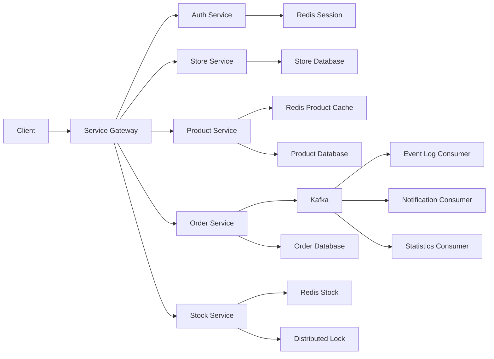
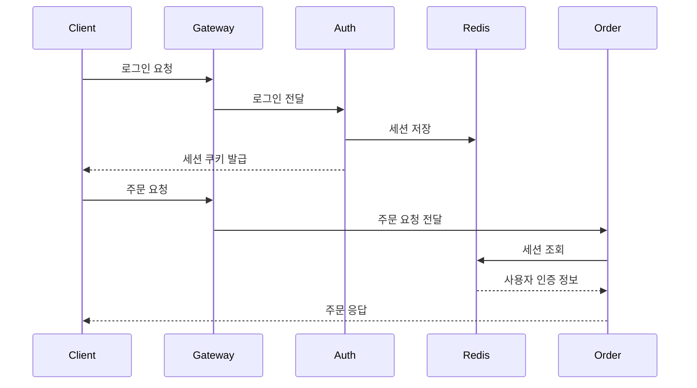
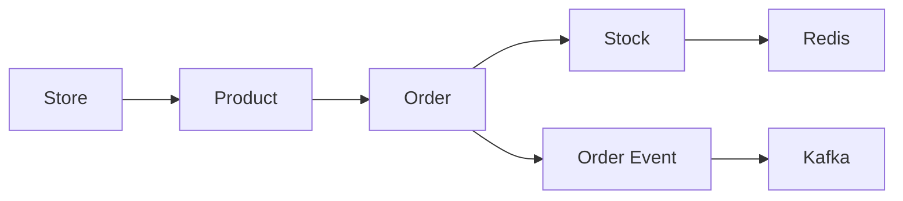
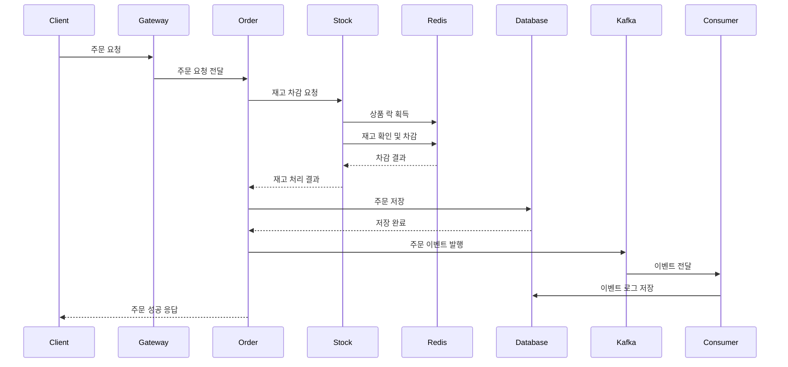
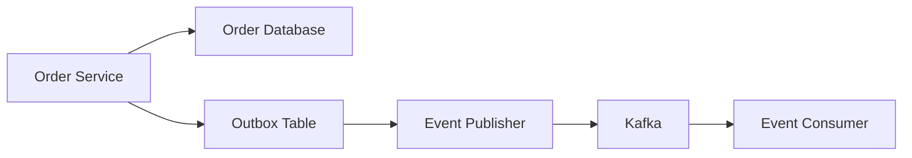

# Kafka와 Redis를 활용해 프로젝트 설계해보기

# Kafka와 Redis를 활용해 프로젝트 설계해보기

* toc
{:toc}

---

## Kafka와 Redis를 활용한 대규모 트래픽 이커머스 프로젝트 설계

대규모 트래픽을 처리하는 이커머스 서비스를 설계할 때는 단순히 상품을 조회하고 주문을 생성하는 기능만 구현해서는 부족하다.

많은 사용자가 동시에 상품을 조회하고, 같은 상품을 주문하며, 재고를 차감하고, 좋아요와 검색 기록을 남긴다. 이 과정에서 데이터 일관성, 응답 속도, 장애 대응, 서비스 확장성을 함께 고려해야 한다.

이때 Redis는 빠른 조회와 동시성 제어를 담당하고, Kafka는 서비스 간 이벤트 전달과 비동기 처리를 담당하도록 구성할 수 있다.

---

## 개념

이번에 설계할 서비스는 온라인 쇼핑몰이다.

사용자는 상품을 조회하고 주문할 수 있으며, 운영자는 가게와 상품을 등록할 수 있다. 주문량이 증가하면 재고 차감 과정에서 동시성 문제가 발생할 수 있으므로 Redis 기반 분산 락을 활용한다.

또한 서비스에서 발생하는 이벤트는 Kafka로 전달해 로그 저장, 통계, 알림 등의 후속 작업을 비동기로 처리한다.

주요 기능은 다음과 같다.

| 영역 | 주요 기능 | 활용 기술 |
|---|---|---|
| 인증 | 로그인, 사용자 인증, 세션 관리 | Redis Session |
| 게이트웨이 | 외부 요청 수신과 서비스 라우팅 | Spring Cloud Gateway |
| 가게 | 가게 등록과 조회 | Spring Boot, RDB |
| 상품 | 상품 등록, 조회, 수정 | Spring Boot, Redis Cache |
| 주문 | 주문 생성과 주문 상태 관리 | Spring Boot, Kafka |
| 재고 | 재고 조회와 차감 | Redis, Redisson |
| 이벤트 로그 | 서비스 이벤트 저장 | Kafka |
| 사용자 경험 | 좋아요, 일일 방문자, 최근 검색어 | Redis |
| 성능 검증 | 부하 테스트와 비교 | nGrinder |

이 프로젝트의 핵심은 모든 기능에 Redis와 Kafka를 무조건 적용하는 것이 아니다. 데이터의 성격에 따라 적절한 저장소와 처리 방식을 선택하는 것이다.

---

## 왜 사용하는가?

### Redis를 사용하는 이유

Redis는 메모리 기반으로 동작하기 때문에 빠른 읽기와 쓰기가 가능하다.

다음과 같은 기능은 Redis와 잘 어울린다.

- 로그인 세션 저장
- 자주 조회되는 상품 캐시
- 재고 수량 관리
- 분산 락
- 상품 좋아요 수
- 일일 방문자 수
- 최근 검색어
- 임시 인증 코드
- 짧은 시간 동안만 필요한 데이터

특히 재고 차감은 여러 사용자가 동시에 같은 상품을 주문할 수 있기 때문에 일반적인 조회 후 수정 방식만으로는 안전하지 않다.

```text
재고 조회
→ 재고가 충분한지 확인
→ 재고 차감
```

이 세 작업 사이에 다른 요청이 끼어들면 동일한 재고를 여러 요청이 차감할 수 있다. Redis 분산 락을 사용하면 특정 상품의 재고를 수정하는 동안 다른 요청이 접근하지 못하도록 제어할 수 있다.

### Kafka를 사용하는 이유

Kafka는 서비스에서 발생한 이벤트를 저장하고 전달하는 역할을 한다.

주문 생성 요청이 들어왔을 때 주문 서비스가 모든 후속 작업을 직접 처리하면 다음과 같은 문제가 발생한다.

- 주문 응답 시간이 길어진다.
- 로그 저장 실패가 주문 생성까지 영향을 준다.
- 알림, 통계, 분석 기능이 주문 서비스에 강하게 결합된다.
- 후속 기능이 추가될 때 주문 서비스를 계속 수정해야 한다.

Kafka를 중간에 두면 주문 서비스는 주문 생성에 필요한 작업만 처리한 뒤 이벤트를 발행할 수 있다.

```text
주문 생성
→ 주문 이벤트 발행
→ 로그 저장
→ 통계 처리
→ 알림 발송
```

주문 서비스는 로그 저장이나 알림 처리가 완료될 때까지 기다리지 않아도 된다. 각 소비자는 Kafka의 이벤트를 독립적으로 처리할 수 있다.

---

## 주요 특징

### 전체 서비스 구성



각 서비스의 책임을 분리하면 특정 기능의 트래픽이 증가해도 해당 서비스만 확장할 수 있다.

| 서비스 | 책임 |
|---|---|
| Gateway | 외부 요청 수신, 라우팅, 공통 필터 |
| Auth Service | 로그인, 인증, 세션 발급 |
| Store Service | 가게 등록과 가게 정보 관리 |
| Product Service | 상품 정보와 가격 관리 |
| Order Service | 주문 생성과 주문 상태 관리 |
| Stock Service | 재고 조회와 재고 차감 |
| Event Consumer | Kafka 이벤트 소비와 후속 작업 |

---

### Service Gateway

클라이언트가 각 서비스의 주소를 직접 알고 있으면 서비스가 추가되거나 주소가 변경될 때 클라이언트 수정이 필요하다.

Gateway를 앞에 배치하면 클라이언트는 하나의 진입점만 사용하면 된다.

```text
Client
  │
  ▼
Service Gateway
  ├── /auth/**    → Auth Service
  ├── /stores/**  → Store Service
  ├── /products/** → Product Service
  └── /orders/**  → Order Service
```

Spring Cloud Gateway의 라우팅 설정 예시는 다음과 같다.

```yaml
spring:
  cloud:
    gateway:
      routes:
        - id: auth-service
          uri: http://auth-service:8080
          predicates:
            - Path=/auth/**

        - id: store-service
          uri: http://store-service:8080
          predicates:
            - Path=/stores/**

        - id: product-service
          uri: http://product-service:8080
          predicates:
            - Path=/products/**

        - id: order-service
          uri: http://order-service:8080
          predicates:
            - Path=/orders/**
```

| 설정 | 의미 |
|---|---|
| `id` | 라우팅 규칙의 식별자 |
| `uri` | 요청을 전달할 서비스 주소 |
| `Path` | 라우팅할 URL 패턴 |

Gateway에서는 다음과 같은 공통 기능도 처리할 수 있다.

- 인증 토큰 확인
- 요청 로깅
- 공통 헤더 추가
- 요청 제한
- CORS 설정
- 서비스별 타임아웃
- 장애 서비스로의 요청 차단

단, 모든 비즈니스 로직을 Gateway에 넣으면 Gateway가 또 하나의 거대한 서비스가 될 수 있다. 인증 토큰의 기본 검증이나 라우팅처럼 여러 서비스에서 공통으로 필요한 기능만 배치하는 것이 좋다.

---

### 글로벌 세션

서비스가 여러 개로 나뉘면 각 서비스가 로컬 메모리에 세션을 저장해서는 안 된다.

사용자가 첫 번째 요청에서 Service A로 연결되고, 다음 요청에서 Service B로 연결되면 Service B가 Service A의 로컬 세션을 알 수 없기 때문이다.

Redis를 세션 저장소로 사용하면 모든 서비스가 동일한 세션을 조회할 수 있다.



세션 키는 사용자 식별자를 포함해 관리할 수 있다.

```text
spring:session:sessions:8a2f...
```

세션에는 다음과 같은 정보가 저장될 수 있다.

```json
{
  "userId": 1001,
  "role": "USER",
  "loginAt": "2026-09-01T10:00:00"
}
```

세션에는 비밀번호나 민감한 개인정보를 저장하지 않는 것이 좋다. 세션이 만료되도록 TTL을 설정하고, 로그아웃 시 Redis에서 세션을 삭제해야 한다.

---

### 이커머스 서비스

이커머스 서비스는 가게, 상품, 주문, 재고를 분리해 설계한다.



#### 가게 서비스

가게 서비스는 판매자나 가게 정보를 관리한다.

```text
가게 등록
가게 조회
가게 수정
가게 삭제
가게별 상품 조회
```

가게 정보는 주문 처리에 필요한 원본 데이터이므로 일반적으로 RDB에 저장한다. 자주 변경되지 않고 조회가 많은 가게 정보는 Redis에 캐시할 수 있다.

#### 상품 서비스

상품 서비스는 상품명, 가격, 설명, 판매 상태 등을 관리한다.

```json
{
  "productId": 1001,
  "storeId": 2001,
  "name": "무선 키보드",
  "price": 45000,
  "saleStatus": "ON_SALE"
}
```

상품 조회는 주문보다 훨씬 자주 발생할 수 있다. 따라서 상품 상세 정보는 Redis 캐시를 활용해 데이터베이스 조회를 줄일 수 있다.

```text
product:1001
```

상품이 수정되면 캐시를 삭제하거나 새 값으로 갱신해야 한다.

#### 주문 서비스

주문 서비스는 다음 작업을 담당한다.

1. 사용자 인증 확인
2. 상품과 가격 확인
3. 재고 차감 요청
4. 주문 정보 저장
5. 주문 이벤트 발행
6. 사용자에게 주문 결과 반환

주문 생성과 재고 차감의 순서는 서비스 정책에 따라 달라질 수 있다. 중요한 것은 실패했을 때 보상 처리가 가능해야 한다는 점이다.

예를 들어 Redis에서 재고를 먼저 차감한 뒤 주문 데이터베이스 저장에 실패하면 재고를 다시 복구해야 한다. 반대로 주문을 먼저 저장한 뒤 재고 차감에 실패하면 주문을 취소 상태로 변경해야 한다.

---

### 재고 관리와 분산 락

재고는 동시성 문제가 발생하기 쉬운 대표적인 데이터이다.

재고가 1개 남아 있는 상품에 두 명의 사용자가 동시에 주문한다고 가정해 보자.

```text
요청 A: 재고 조회 → 1
요청 B: 재고 조회 → 1

요청 A: 주문 가능 판단
요청 B: 주문 가능 판단

요청 A: 재고 차감
요청 B: 재고 차감
```

락이 없다면 두 요청 모두 주문에 성공할 수 있다.

분산 락을 사용하면 다음과 같이 처리할 수 있다.

```text
요청 A: 상품 락 획득
요청 B: 상품 락 대기

요청 A: 재고 확인
요청 A: 재고 차감
요청 A: 락 해제

요청 B: 상품 락 획득
요청 B: 재고 확인
요청 B: 재고 부족으로 주문 실패
```

Redisson을 사용하는 구현 예시는 다음과 같다.

```java
@Service
@RequiredArgsConstructor
public class StockService {

    private final RedissonClient redissonClient;
    private final StringRedisTemplate redisTemplate;

    public void decrease(Long productId, int quantity) {
        String lockKey = "lock:stock:" + productId;
        RLock lock = redissonClient.getLock(lockKey);

        boolean locked = false;

        try {
            locked = lock.tryLock(5, 10, TimeUnit.SECONDS);

            if (!locked) {
                throw new IllegalStateException("재고 처리 요청이 많습니다.");
            }

            String stockKey = "stock:" + productId;
            String stockValue = redisTemplate.opsForValue().get(stockKey);

            if (stockValue == null) {
                throw new IllegalStateException("재고 정보를 찾을 수 없습니다.");
            }

            int currentStock = Integer.parseInt(stockValue);

            if (currentStock < quantity) {
                throw new IllegalStateException("재고가 부족합니다.");
            }

            redisTemplate.opsForValue().decrement(stockKey, quantity);
        } catch (InterruptedException e) {
            Thread.currentThread().interrupt();
            throw new IllegalStateException("재고 락 대기 중 인터럽트가 발생했습니다.", e);
        } finally {
            if (locked && lock.isHeldByCurrentThread()) {
                lock.unlock();
            }
        }
    }
}
```

| 설정 | 의미 |
|---|---|
| `tryLock(5, 10, TimeUnit.SECONDS)` | 최대 5초 동안 락을 기다리고, 락 획득 후 최대 10초 동안 유지 |
| `lock:stock:1001` | 상품별로 분리된 락 키 |
| `stock:1001` | 상품별 재고 키 |
| `decrement` | Redis에서 재고 수량 차감 |

락의 만료 시간은 실제 처리 시간보다 충분히 길어야 한다. 너무 짧으면 작업 중 락이 만료되어 다른 요청이 동시에 진입할 수 있다. 반대로 지나치게 길면 장애가 발생했을 때 다른 요청이 오래 대기할 수 있다.

---

### Kafka 이벤트 로그

주문이 생성되면 Kafka에 이벤트를 발행할 수 있다.

```json
{
  "eventType": "ORDER_CREATED",
  "orderId": 5001,
  "userId": 1001,
  "productId": 1001,
  "quantity": 2,
  "createdAt": "2026-09-01T10:30:00"
}
```

Spring Kafka Producer 설정 예시는 다음과 같다.

```yaml
spring:
  kafka:
    bootstrap-servers: kafka:9092
    producer:
      key-serializer: org.apache.kafka.common.serialization.StringSerializer
      value-serializer: org.springframework.kafka.support.serializer.JsonSerializer
      acks: all
      retries: 3
```

| 설정 | 의미 |
|---|---|
| `bootstrap-servers` | Kafka 브로커 주소 |
| `key-serializer` | 메시지 키 직렬화 방식 |
| `value-serializer` | 메시지 값 직렬화 방식 |
| `acks: all` | 모든 Replica의 확인을 기다림 |
| `retries: 3` | 전송 실패 시 최대 3회 재시도 |

Kafka Consumer 설정 예시는 다음과 같다.

```yaml
spring:
  kafka:
    consumer:
      group-id: event-log-group
      auto-offset-reset: earliest
      enable-auto-commit: false
      key-deserializer: org.apache.kafka.common.serialization.StringDeserializer
      value-deserializer: org.springframework.kafka.support.serializer.JsonDeserializer
      properties:
        spring.json.trusted.packages: "com.example.event"
```

| 설정 | 의미 |
|---|---|
| `group-id` | 소비자 그룹 이름 |
| `auto-offset-reset` | 저장된 오프셋이 없을 때 시작 위치 |
| `enable-auto-commit` | 오프셋 자동 커밋 여부 |
| `trusted.packages` | 역직렬화를 허용할 패키지 |

이벤트 로그를 저장하는 소비자는 Kafka에서 주문 이벤트를 읽어 별도의 로그 저장소에 저장할 수 있다.

```java
@Component
@RequiredArgsConstructor
public class OrderEventConsumer {

    private final EventLogService eventLogService;

    @KafkaListener(
        topics = "order-events",
        groupId = "event-log-group"
    )
    public void consume(OrderCreatedEvent event) {
        eventLogService.save(
            event.getEventType(),
            event.getOrderId(),
            event.getUserId(),
            event.getCreatedAt()
        );
    }
}
```

소비자가 이벤트를 처리한 뒤에만 오프셋을 커밋하도록 구성하면 처리 실패 시 재처리할 수 있다. 다만 같은 이벤트가 두 번 처리될 가능성이 있으므로 소비자 로직은 멱등성을 가져야 한다.

예를 들어 같은 `eventId`가 이미 저장되어 있다면 중복 저장하지 않도록 해야 한다.

---

## 예제

### Redis와 Kafka 연결 설정

Spring Boot에서 Redis와 Kafka를 함께 사용하는 기본 설정은 다음과 같이 구성할 수 있다.

```yaml
spring:
  application:
    name: order-service

  data:
    redis:
      host: redis
      port: 6379
      timeout: 2s

  kafka:
    bootstrap-servers: kafka:9092

    producer:
      key-serializer: org.apache.kafka.common.serialization.StringSerializer
      value-serializer: org.springframework.kafka.support.serializer.JsonSerializer
      acks: all
      retries: 3

    consumer:
      group-id: order-event-group
      enable-auto-commit: false
      auto-offset-reset: earliest
      key-deserializer: org.apache.kafka.common.serialization.StringDeserializer
      value-deserializer: org.springframework.kafka.support.serializer.JsonDeserializer
      properties:
        spring.json.trusted.packages: "com.example.event"
```

Gradle 의존성은 다음과 같이 추가할 수 있다.

```groovy
dependencies {
    implementation 'org.springframework.boot:spring-boot-starter-web'
    implementation 'org.springframework.boot:spring-boot-starter-data-redis'
    implementation 'org.springframework.kafka:spring-kafka'
    implementation 'org.redisson:redisson-spring-boot-starter:3.27.2'
}
```

각 의존성의 용도는 다음과 같다.

| 의존성 | 용도 |
|---|---|
| `spring-boot-starter-web` | REST API 개발 |
| `spring-boot-starter-data-redis` | Redis 연결과 RedisTemplate 사용 |
| `spring-kafka` | Kafka Producer와 Consumer 구현 |
| `redisson-spring-boot-starter` | Redis 기반 분산 락 구현 |

버전은 프로젝트의 Spring Boot 버전과 호환되는지 확인해야 한다. 특히 Redisson, Spring Kafka, Kafka 브로커 버전은 배포 환경과 맞춰야 한다.

---

### 주문 이벤트 발행

```java
public record OrderCreatedEvent(
    String eventId,
    String eventType,
    Long orderId,
    Long userId,
    Long productId,
    int quantity,
    LocalDateTime createdAt
) {
}
```

Kafka 이벤트를 발행하는 코드는 다음과 같다.

```java
@Service
@RequiredArgsConstructor
public class OrderEventPublisher {

    private final KafkaTemplate<String, OrderCreatedEvent> kafkaTemplate;

    public void publish(OrderCreatedEvent event) {
        kafkaTemplate.send(
            "order-events",
            String.valueOf(event.orderId()),
            event
        );
    }
}
```

주문 ID를 Kafka 메시지 키로 사용하면 동일한 주문에 대한 이벤트가 같은 파티션으로 전달될 가능성을 높일 수 있다. 이렇게 하면 동일한 키에 대한 이벤트 순서를 유지하는 데 도움이 된다.

단, Kafka의 순서 보장은 전체 토픽 단위가 아니라 파티션 단위이다. 따라서 이벤트 순서가 중요한 기준을 먼저 정하고 메시지 키를 설계해야 한다.

---

### 좋아요 기능

상품 좋아요는 Redis Set으로 구현할 수 있다.

```redis
SADD product:1001:likes user:2001
SISMEMBER product:1001:likes user:2001
SCARD product:1001:likes
```

실행 결과는 다음과 같다.

```text
(integer) 1
1
(integer) 1
```

| 명령어 | 의미 |
|---|---|
| `SADD` | 좋아요를 누른 사용자 추가 |
| `SISMEMBER` | 특정 사용자가 좋아요를 눌렀는지 확인 |
| `SCARD` | 좋아요를 누른 사용자 수 확인 |

Set을 사용하면 같은 사용자가 여러 번 좋아요를 눌러도 중복으로 저장되지 않는다.

---

### 일일 방문자 수

일일 방문자는 HyperLogLog로 대략적인 고유 방문자 수를 계산할 수 있다.

```redis
PFADD visitors:2026-09-01 user:1001 user:1002 user:1003
PFCOUNT visitors:2026-09-01
```

실행 결과는 다음과 같다.

```text
(integer) 1
(integer) 3
```

HyperLogLog는 실제 사용자 목록을 저장하지 않고 고유 개수를 추정한다. 따라서 정확한 사용자 목록이 필요하지 않고 대략적인 방문자 수만 필요할 때 적합하다.

정확한 방문자 목록이 필요하다면 Set을 사용해야 하지만, 방문자가 많아질수록 메모리 사용량이 증가한다.

---

### 최근 검색 기록

최근 검색어는 List를 사용해 구현할 수 있다.

```redis
LPUSH user:1001:recent-search "무선 키보드"
LTRIM user:1001:recent-search 0 9
LRANGE user:1001:recent-search 0 9
```

실행 결과는 다음과 같다.

```text
(integer) 1
OK
1) "무선 키보드"
```

`LPUSH`로 가장 최근 검색어를 앞에 추가하고, `LTRIM`으로 최근 10개만 유지할 수 있다.

검색어가 이미 존재할 때 중복을 제거해야 한다면 단순 List만으로는 부족하다. 별도의 Set을 함께 사용하거나 애플리케이션에서 중복 제거 정책을 구현해야 한다.

---

## 구조

전체 요청 흐름은 다음과 같이 구성할 수 있다.



이 구조에서 주문 응답을 빠르게 반환하기 위해 이벤트 로그 저장은 비동기로 처리할 수 있다.

다만 주문 저장과 Kafka 이벤트 발행 사이에 장애가 발생할 수 있다.

```text
주문 저장 성공
Kafka 발행 실패
```

이 경우 주문은 생성되었지만 이벤트 로그가 남지 않을 수 있다. 이를 해결하려면 다음과 같은 방법을 고려해야 한다.

| 방법 | 특징 |
|---|---|
| 재시도 | Kafka 발행 실패 시 여러 번 재시도 |
| 별도 발행 테이블 | DB에 이벤트를 저장하고 별도 프로세스가 발행 |
| Outbox Pattern | 주문 트랜잭션과 이벤트 저장을 하나의 트랜잭션으로 처리 |
| 트랜잭션 메시징 | DB와 메시지 브로커의 일관성을 보장하는 구조 사용 |

대규모 서비스에서는 Outbox Pattern을 함께 고려하는 것이 좋다.



주문 데이터와 Outbox 이벤트를 같은 데이터베이스 트랜잭션으로 저장하면 주문은 저장되었지만 이벤트 기록이 사라지는 문제를 줄일 수 있다.

---

## 실무에서의 활용

### 프로젝트 목표를 단계적으로 나누기

대규모 프로젝트는 처음부터 모든 기능을 구현하려고 하면 범위가 지나치게 커진다. 다음과 같이 단계별로 나누는 것이 좋다.

| 단계 | 구현 내용 |
|---|---|
| 1단계 | Spring Boot 기본 환경 구성 |
| 2단계 | Redis와 Kafka 연결 |
| 3단계 | Gateway와 서비스 라우팅 |
| 4단계 | 인증과 글로벌 세션 |
| 5단계 | 가게와 상품 기능 |
| 6단계 | 주문과 재고 관리 |
| 7단계 | 분산 락 적용 |
| 8단계 | Kafka 이벤트 로그 |
| 9단계 | 좋아요, 방문자, 최근 검색어 |
| 10단계 | 부하 테스트와 병목 분석 |

기능이 동작하는지 확인하지 않은 채 여러 기술을 한꺼번에 적용하면 문제가 발생했을 때 원인을 찾기 어렵다.

먼저 단일 서비스에서 기능을 완성한 뒤 Redis, Kafka, Gateway를 순서대로 추가하는 방식이 안정적이다.

---

### 기능별 To-Do List

#### 프로젝트 환경 구성

- Spring Boot 프로젝트 생성
- 서비스별 패키지와 모듈 구성
- Redis 의존성 추가
- Kafka 의존성 추가
- 서비스별 포트 설정
- 환경별 설정 파일 분리
- 로컬 실행 환경 구성

#### 분산 환경 구성

- Service Gateway 구현
- 서비스별 라우팅 설정
- 서비스 간 통신 방식 결정
- OpenFeign 의존성 추가
- 서비스 간 타임아웃 설정
- 공통 에러 응답 정의
- 요청 추적용 로그 구성

#### 인증과 세션

- 로그인 API 구현
- 인증 사용자 정보 정의
- Redis Session 설정
- 세션 TTL 설정
- 로그아웃 시 세션 삭제
- 서비스 간 세션 조회 확인
- 세션 만료 테스트

#### 이커머스 기능

- 가게 등록과 조회
- 상품 등록과 조회
- 상품 가격과 판매 상태 관리
- 주문 생성
- 주문 상태 변경
- 주문 취소
- 재고 조회
- 재고 차감
- 재고 부족 처리

#### 분산 락

- 상품별 락 키 설계
- 락 획득 대기 시간 설정
- 락 만료 시간 설정
- 락 해제 보장
- 예외 발생 시 락 해제 확인
- 동시에 같은 상품을 주문하는 테스트
- 락 획득 실패 처리

#### Kafka 이벤트

- Kafka 토픽 생성
- Producer 설정
- Consumer 설정
- 주문 이벤트 발행
- 이벤트 로그 소비
- 소비 실패 시 재처리
- 중복 이벤트 처리
- Consumer Group 분리

#### 사용자 경험 기능

- 상품 좋아요
- 좋아요 여부 확인
- 일일 고유 방문자 수
- 최근 검색어 저장
- 최근 검색어 개수 제한
- TTL이 필요한 데이터의 만료 설정

---

### 부하 테스트 계획

nGrinder를 활용하면 Redis와 Kafka를 적용한 환경과 적용하지 않은 환경의 성능을 비교할 수 있다.

비교할 수 있는 항목은 다음과 같다.

| 비교 항목 | 확인 내용 |
|---|---|
| 평균 응답 시간 | 요청 하나가 처리되는 평균 시간 |
| 최대 응답 시간 | 가장 느린 요청의 처리 시간 |
| TPS | 초당 처리 가능한 요청 수 |
| 오류율 | 실패한 요청의 비율 |
| CPU 사용량 | 서비스와 Redis의 CPU 사용량 |
| 메모리 사용량 | 캐시와 이벤트 처리에 사용된 메모리 |
| 데이터베이스 부하 | DB 연결 수와 쿼리 처리량 |
| Kafka 처리 지연 | 이벤트 발행부터 소비까지 걸린 시간 |

테스트 시나리오는 실제 사용 패턴에 가깝게 구성해야 한다.

```text
상품 목록 조회 50%
상품 상세 조회 25%
로그인과 세션 확인 10%
좋아요 처리 5%
주문 생성 5%
재고 조회 5%
```

단순히 주문 API만 반복 호출하면 전체 서비스의 특성을 반영하기 어렵다. 조회 트래픽과 쓰기 트래픽을 나누고, 같은 상품에 요청이 집중되는 상황도 함께 테스트해야 한다.

특히 재고 테스트에서는 다음 시나리오가 중요하다.

- 재고가 충분한 상품에 동시 주문
- 재고가 부족한 상품에 동시 주문
- 동일 상품에 요청이 집중되는 상황
- Redis 락 대기 시간이 길어지는 상황
- Kafka 처리 지연이 발생하는 상황
- Redis 연결이 끊긴 상황
- 데이터베이스 응답이 지연되는 상황

테스트 결과는 단순히 TPS가 높은 환경을 선택하는 방식으로 해석해서는 안 된다. 데이터 유실, 중복 주문, 재고 불일치, 이벤트 누락이 없는지 함께 확인해야 한다.

---

### 장애 상황별 대응

| 장애 상황 | 대응 방향 |
|---|---|
| Redis 장애 | 캐시 우회, 원본 DB 조회, 기능 제한 |
| Kafka 장애 | 이벤트 재시도, Outbox 보관, 발행 지연 |
| DB 장애 | 요청 차단, 재시도 제한, 장애 페이지 제공 |
| 재고 락 획득 실패 | 즉시 실패 또는 짧은 재시도 |
| 이벤트 중복 | 이벤트 ID 기반 멱등 처리 |
| 세션 만료 | 재로그인 요청 |
| Gateway 장애 | 다중 인스턴스와 로드밸런서 구성 |

Redis가 캐시 용도라면 장애 시 데이터베이스로 우회할 수 있다. 하지만 Redis가 재고나 세션의 핵심 저장소라면 단순 우회만으로 해결할 수 없다. Redis Replica, Sentinel, Cluster 등의 고가용성 구성을 고려해야 한다.

Kafka 이벤트는 중복될 수 있다는 전제로 소비자를 구현하는 것이 좋다. 이벤트 ID를 저장하고 이미 처리한 이벤트인지 확인하면 중복 처리로 인한 문제를 줄일 수 있다.

---

## 정리

Kafka와 Redis를 활용한 이커머스 프로젝트는 기술을 많이 사용하는 것보다 각 기술의 책임을 명확하게 나누는 것이 중요하다.

Redis는 세션, 캐시, 재고, 분산 락, 좋아요, 방문자 수, 최근 검색어처럼 빠른 처리와 임시 저장이 필요한 기능에 적합하다.

Kafka는 주문 생성 이벤트, 이벤트 로그, 알림, 통계처럼 서비스 간 결합도를 낮추고 비동기로 처리해야 하는 기능에 적합하다.

가게, 상품, 주문, 재고 서비스를 분리하면 기능별 확장이 가능해지고 장애 범위도 줄일 수 있다. Gateway는 외부 요청의 진입점과 라우팅을 담당하고, Redis Session을 사용하면 여러 서비스가 동일한 인증 상태를 공유할 수 있다.

재고 차감은 분산 락으로 동시성 문제를 제어해야 하며, Kafka 이벤트는 중복과 발행 실패를 고려해 멱등성, 재시도, Outbox Pattern 등을 함께 검토해야 한다.

마지막으로 프로젝트는 환경 구성, 인증, 이커머스 기능, 분산 락, Kafka 이벤트, 사용자 기능, 부하 테스트 순서로 세분화하는 것이 좋다. 기능을 작은 단위로 나누고 각 단계마다 정상 동작과 장애 상황을 검증해야 실제 트래픽을 견딜 수 있는 구조에 가까워진다.

---

### 한 줄 요약

Redis는 빠른 데이터 처리와 동시성 제어에 사용하고 Kafka는 서비스 간 이벤트 전달과 비동기 처리에 사용해 이커머스 시스템을 확장 가능한 구조로 설계할 수 있다.
