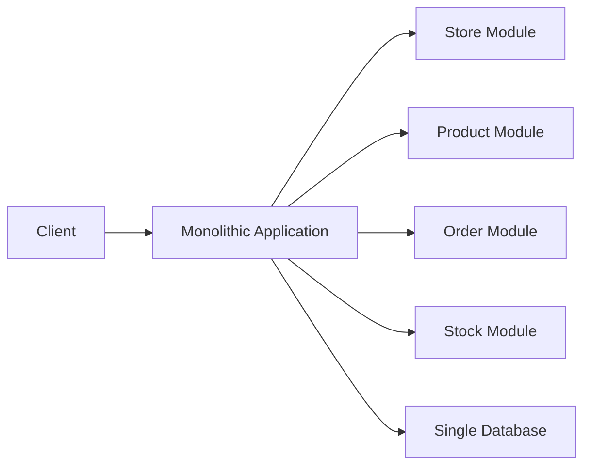
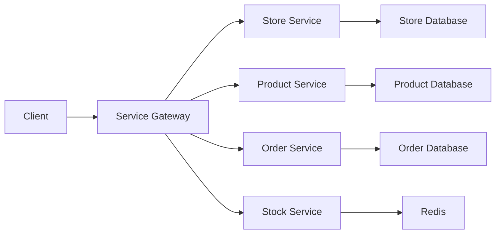
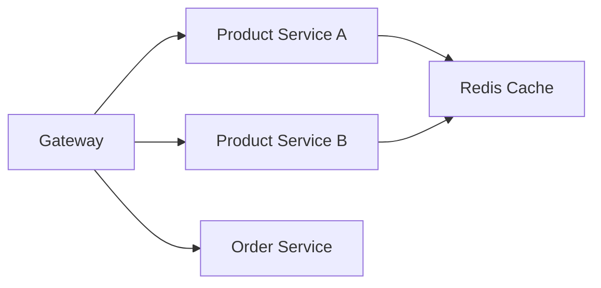
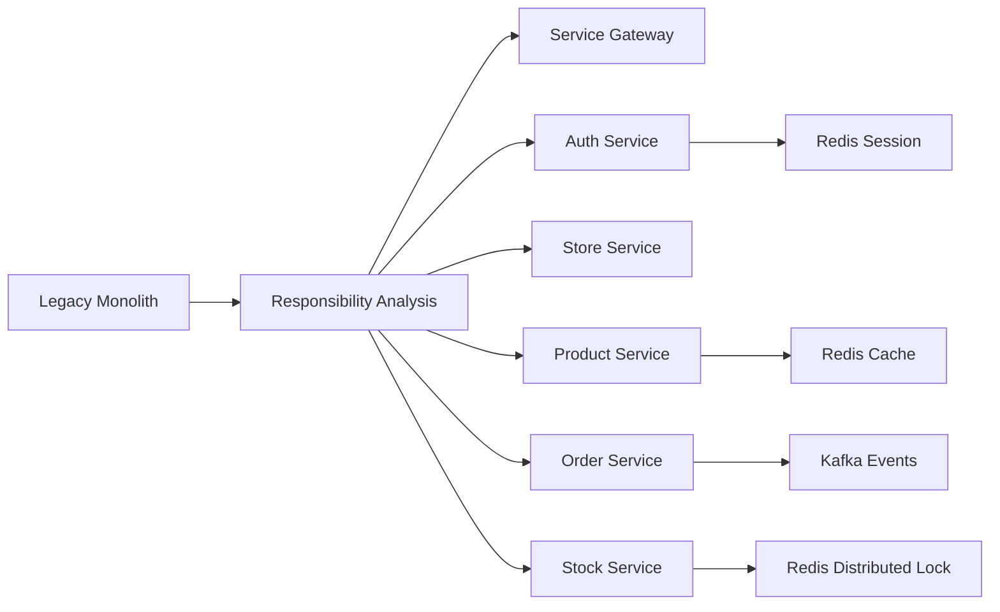
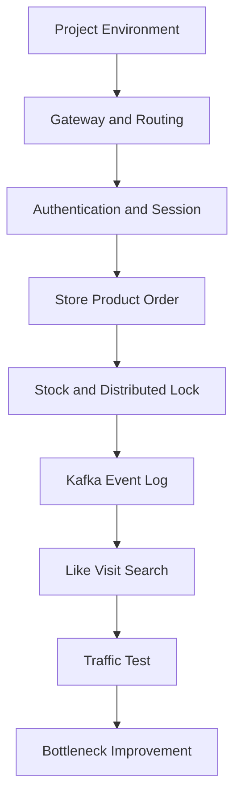
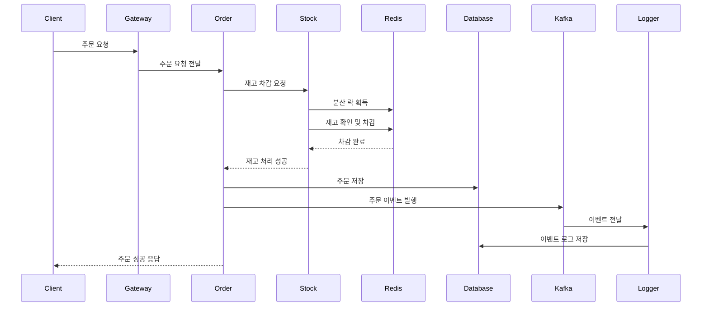
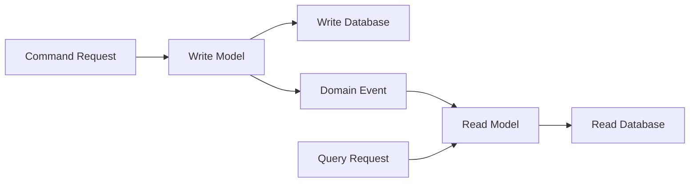

# 미니 프로젝트 실습환경 구축하기

# 미니 프로젝트 실습환경 구축하기

* toc
{:toc}

---

## 레거시 모놀리식 서비스를 Redis와 Kafka 기반으로 전환하기

대규모 트래픽을 처리하는 서비스를 설계하려면 처음부터 모든 기능을 마이크로서비스로 개발하는 것보다, 기존 서비스를 분석하고 점진적으로 분리하는 과정이 중요하다.

가게, 상품, 주문, 재고 기능이 하나의 애플리케이션에 모두 들어 있는 레거시 모놀리식 서비스를 기준으로 Redis와 Kafka를 적용해 보자.

Redis는 캐싱, 세션, 재고, 분산 락을 담당하고 Kafka는 이벤트 전달, 비동기 처리, 이벤트 로그 저장을 담당하도록 구성한다. 이후 서비스를 가게, 상품, 주문, 재고 단위로 분리해 독립적으로 확장할 수 있는 구조로 개선한다.

---

## 개념

### 레거시 시스템

레거시 시스템은 오랫동안 사용되어 온 소프트웨어나 인프라를 의미한다.

레거시라는 말이 반드시 나쁜 시스템이라는 뜻은 아니다. 오랜 기간 운영되면서 비즈니스 요구사항을 충족하고 있을 수도 있다.

다만 다음과 같은 문제가 누적되기 쉽다.

- 오래된 기술과 라이브러리 사용
- 변경 영향 범위 파악 어려움
- 기능 간 강한 결합
- 테스트 코드 부족
- 특정 개발자에게 지식 집중
- 배포 시 전체 서비스 재배포 필요
- 작은 변경에도 전체 장애 발생 가능

따라서 레거시 시스템을 개선할 때는 기존 기능을 모두 버리고 새로 개발하기보다, 현재 동작을 이해한 뒤 변경 범위를 단계적으로 나누는 방식이 적합하다.

### 모놀리식 아키텍처

모놀리식 아키텍처는 애플리케이션의 모든 기능이 하나의 코드베이스와 하나의 프로세스 안에서 동작하는 구조이다.



모놀리식 구조는 초기 개발이 단순하다는 장점이 있다. 하나의 프로젝트 안에서 모듈을 호출하고, 하나의 데이터베이스를 사용하면 되기 때문이다.

반면 서비스 규모가 커지면 다음 문제가 발생한다.

- 상품 기능을 수정해도 전체 애플리케이션을 빌드해야 한다.
- 주문 트래픽이 증가해도 전체 애플리케이션을 함께 확장해야 한다.
- 하나의 기능 장애가 전체 서비스에 영향을 준다.
- 기능 간 데이터베이스 접근이 뒤섞인다.
- 배포와 롤백 단위가 지나치게 커진다.

### 마이크로서비스 아키텍처

마이크로서비스 아키텍처는 하나의 애플리케이션을 여러 개의 작은 서비스로 분리하는 구조이다.

각 서비스는 특정 비즈니스 기능을 담당하며 독립적으로 개발, 배포, 확장할 수 있다.



마이크로서비스로 분리한다고 해서 단순히 패키지나 클래스를 나누는 것만으로 충분하지는 않다.

다음 항목까지 함께 분리해야 한다.

- 서비스별 책임
- 서비스별 데이터 소유권
- 서비스 간 통신 방식
- 장애 전파 범위
- 배포 단위
- 로그와 모니터링 방식
- 트랜잭션 처리 기준

---

## 왜 사용하는가?

### 서비스별 독립적인 확장

상품 조회는 주문보다 훨씬 자주 발생할 수 있다. 상품 서비스와 주문 서비스가 하나의 애플리케이션으로 묶여 있으면 상품 조회량이 증가했을 때 주문 기능까지 함께 확장해야 한다.

서비스를 분리하면 상품 서비스만 여러 인스턴스로 늘릴 수 있다.



### 장애 범위 축소

주문 서비스에 문제가 발생하더라도 상품 조회 서비스까지 반드시 중단될 필요는 없다.

물론 서비스 간 의존성이 있다면 일부 기능이 제한될 수 있지만, 모든 기능이 동시에 중단되는 상황은 줄일 수 있다.

### Redis를 통한 응답 속도 개선

상품 목록이나 상품 상세 정보처럼 조회가 많은 데이터는 Redis에 캐시할 수 있다.

```text
상품 조회 요청
→ Redis 캐시 확인
→ 캐시가 있으면 즉시 반환
→ 캐시가 없으면 데이터베이스 조회
→ 조회 결과를 Redis에 저장
```

데이터베이스에 반복적으로 접근하는 횟수를 줄이면 데이터베이스 부하와 응답 시간을 낮출 수 있다.

### Kafka를 통한 비동기 처리

주문이 완료된 뒤 로그 저장, 알림 발송, 통계 계산을 모두 동기적으로 처리하면 사용자는 모든 작업이 끝날 때까지 기다려야 한다.

Kafka를 사용하면 주문 서비스는 주문 생성에 필요한 작업을 완료한 뒤 이벤트를 발행하고 빠르게 응답할 수 있다.

```text
주문 생성
→ 주문 이벤트 발행
→ 사용자 응답

주문 이벤트 소비
→ 이벤트 로그 저장
→ 알림 발송
→ 통계 처리
```

각 소비자는 독립적으로 동작하기 때문에 새로운 후속 기능을 추가할 때 주문 서비스의 변경을 줄일 수 있다.

---

## 주요 특징

### 이커머스 서비스의 책임 분리

가게, 상품, 주문, 재고를 다음과 같이 분리할 수 있다.

| 서비스 | 책임 | 주요 데이터 |
|---|---|---|
| Store Service | 가게 등록과 조회 | 가게명, 판매자, 운영 상태 |
| Product Service | 상품 등록과 조회 | 상품명, 가격, 설명 |
| Order Service | 주문 생성과 상태 관리 | 주문자, 상품, 주문 상태 |
| Stock Service | 재고 조회와 차감 | 상품별 재고 수량 |
| Auth Service | 인증과 세션 관리 | 사용자 인증 정보 |
| Event Service | 이벤트 소비와 로그 저장 | 주문 이벤트, 재고 이벤트 |

서비스를 나눌 때는 데이터베이스 테이블 기준보다 비즈니스 책임을 기준으로 나누는 것이 좋다.

예를 들어 상품 테이블과 재고 테이블이 같은 데이터베이스에 있다고 해서 반드시 하나의 서비스로 묶어야 하는 것은 아니다. 상품 정보와 재고 정보는 변경 빈도와 동시성 요구사항이 다르기 때문이다.

### Gateway를 통한 단일 진입점

클라이언트가 각 서비스에 직접 요청하면 서비스 주소와 포트가 클라이언트에 노출된다.

Gateway를 사용하면 외부에서는 하나의 주소만 사용하고, Gateway가 내부 서비스로 요청을 전달한다.

```text
/api/stores/**   → Store Service
/api/products/** → Product Service
/api/orders/**   → Order Service
/api/auth/**     → Auth Service
```

Spring Cloud Gateway 설정 예시는 다음과 같다.

```yaml
spring:
  cloud:
    gateway:
      routes:
        - id: store-service
          uri: http://store-service:8080
          predicates:
            - Path=/api/stores/**

        - id: product-service
          uri: http://product-service:8080
          predicates:
            - Path=/api/products/**

        - id: order-service
          uri: http://order-service:8080
          predicates:
            - Path=/api/orders/**

        - id: auth-service
          uri: http://auth-service:8080
          predicates:
            - Path=/api/auth/**
```

| 설정 | 의미 |
|---|---|
| `id` | 라우팅 규칙 이름 |
| `uri` | 요청을 전달할 내부 서비스 주소 |
| `Path` | 해당 라우팅을 적용할 URL 패턴 |

Gateway에는 인증 토큰 확인, 공통 로깅, CORS, 요청 제한 등을 배치할 수 있다.

다만 주문 생성이나 재고 차감 같은 비즈니스 로직을 Gateway에 넣으면 Gateway의 책임이 지나치게 커진다. Gateway는 요청을 전달하고 공통 정책을 적용하는 역할에 집중하는 것이 좋다.

### OpenFeign을 이용한 서비스 간 통신

주문 서비스가 상품 정보를 확인하거나 재고 서비스에 재고 차감을 요청해야 한다면 서비스 간 통신이 필요하다.

OpenFeign을 사용하면 HTTP 통신을 인터페이스 형태로 작성할 수 있다.

```java
@FeignClient(name = "stock-service", url = "${services.stock.url}")
public interface StockClient {

    @PostMapping("/stocks/{productId}/decrease")
    void decrease(
        @PathVariable("productId") Long productId,
        @RequestParam("quantity") int quantity
    );
}
```

설정 파일은 다음과 같이 구성할 수 있다.

```yaml
services:
  stock:
    url: http://stock-service:8080
```

OpenFeign을 사용할 때는 다음 항목을 함께 설정해야 한다.

- 연결 타임아웃
- 읽기 타임아웃
- 재시도 횟수
- 장애 서비스 차단
- 실패 시 대체 응답
- 요청 추적용 헤더

서비스 간 통신에서 타임아웃을 설정하지 않으면 하나의 장애 서비스 때문에 다른 서비스의 스레드가 계속 대기할 수 있다.

### Redis의 역할

Redis는 다음 기능에 활용할 수 있다.

| 기능 | Redis 자료구조 또는 기능 |
|---|---|
| 글로벌 세션 | String, Hash, Redis Session |
| 상품 캐시 | String |
| 재고 수량 | String |
| 분산 락 | Redisson Lock |
| 좋아요 사용자 | Set |
| 일일 방문자 | HyperLogLog |
| 최근 검색어 | List |
| 캐시 동기화 | Pub/Sub |

Redis를 사용할 때는 저장하는 데이터의 중요도를 구분해야 한다.

- 다시 생성할 수 있는 데이터: 캐시
- 짧은 시간만 필요한 데이터: 세션, 인증 코드
- 동시성 제어가 필요한 데이터: 재고, 락
- 유실되면 안 되는 데이터: 원본 데이터베이스나 Kafka와 함께 관리

### Kafka의 역할

Kafka는 서비스에서 발생하는 이벤트를 전달한다.

예를 들어 주문이 생성되면 다음과 같은 이벤트를 발행할 수 있다.

```json
{
  "eventId": "order-event-5001",
  "eventType": "ORDER_CREATED",
  "orderId": 5001,
  "userId": 1001,
  "productId": 2001,
  "quantity": 2,
  "createdAt": "2026-09-01T12:00:00"
}
```

이벤트를 소비하는 서비스는 서로 다른 Consumer Group을 사용할 수 있다.

| Consumer Group | 역할 |
|---|---|
| `event-log-group` | 이벤트 로그 저장 |
| `notification-group` | 사용자 알림 발송 |
| `statistics-group` | 판매 통계 계산 |

같은 이벤트를 여러 목적에 사용해야 한다면 소비자 그룹을 분리해야 한다. 하나의 소비자 그룹 안에서는 각 메시지가 하나의 소비자에게만 전달되지만, 서로 다른 소비자 그룹은 같은 이벤트를 각각 받을 수 있다.

---

## 예제

### 프로젝트 환경 구성

로컬에서 Redis와 Kafka를 실행하기 위한 `docker-compose.yml` 예시는 다음과 같다.

```yaml
services:
  redis:
    image: redis:7.2
    container_name: ecommerce-redis
    ports:
      - "6379:6379"
    command:
      - redis-server
      - --appendonly
      - "yes"
      - --requirepass
      - redis_password
    healthcheck:
      test:
        [
          "CMD",
          "redis-cli",
          "-a",
          "redis_password",
          "ping"
        ]
      interval: 5s
      timeout: 3s
      retries: 10

  kafka:
    image: bitnami/kafka:3.7
    container_name: ecommerce-kafka
    ports:
      - "9092:9092"
    environment:
      KAFKA_CFG_NODE_ID: 1
      KAFKA_CFG_PROCESS_ROLES: controller,broker
      KAFKA_CFG_CONTROLLER_QUORUM_VOTERS: 1@kafka:9093
      KAFKA_CFG_LISTENERS: PLAINTEXT://:9092,CONTROLLER://:9093
      KAFKA_CFG_ADVERTISED_LISTENERS: PLAINTEXT://localhost:9092
      KAFKA_CFG_LISTENER_SECURITY_PROTOCOL_MAP: CONTROLLER:PLAINTEXT,PLAINTEXT:PLAINTEXT
      KAFKA_CFG_CONTROLLER_LISTENER_NAMES: CONTROLLER
      KAFKA_CFG_INTER_BROKER_LISTENER_NAME: PLAINTEXT
      KAFKA_ENABLE_KRAFT: "yes"
      ALLOW_PLAINTEXT_LISTENER: "yes"
```

이 구성은 Spring Boot 애플리케이션을 호스트 운영체제에서 실행하고 Redis와 Kafka만 Docker에서 실행하는 형태이다.

컨테이너를 실행한다.

```bash
docker compose up -d
```

실행 결과 예시는 다음과 같다.

```text
[+] Running 2/2
 ✔ Container ecommerce-redis  Started
 ✔ Container ecommerce-kafka  Started
```

`-d` 옵션은 백그라운드 모드로 컨테이너를 실행한다는 의미이다.

실행 중인 컨테이너는 다음 명령어로 확인한다.

```bash
docker compose ps
```

실행 결과 예시는 다음과 같다.

```text
NAME               IMAGE                 SERVICE   STATUS
ecommerce-redis    redis:7.2             redis     running
ecommerce-kafka    bitnami/kafka:3.7     kafka     running
```

Redis 연결을 확인한다.

```bash
docker exec ecommerce-redis redis-cli -a redis_password ping
```

실행 결과는 다음과 같다.

```text
PONG
```

Kafka 토픽을 생성한다.

```bash
docker exec ecommerce-kafka kafka-topics.sh \
  --create \
  --topic order-events \
  --bootstrap-server localhost:9092 \
  --partitions 3 \
  --replication-factor 1
```

실행 결과 예시는 다음과 같다.

```text
Created topic order-events.
```

| 옵션 | 의미 |
|---|---|
| `--topic` | 생성할 토픽 이름 |
| `--partitions 3` | 토픽을 3개 파티션으로 구성 |
| `--replication-factor 1` | 메시지 복제본 수 |
| `--bootstrap-server` | Kafka 브로커 주소 |

개발 환경에서는 복제본 수를 1로 설정할 수 있지만, 운영 환경에서는 여러 브로커를 구성하고 적절한 복제본 수를 설정해야 한다.

### Gradle 의존성

```groovy
dependencies {
    implementation 'org.springframework.boot:spring-boot-starter-web'
    implementation 'org.springframework.boot:spring-boot-starter-data-redis'
    implementation 'org.springframework.kafka:spring-kafka'
    implementation 'org.springframework.cloud:spring-cloud-starter-gateway'
    implementation 'org.springframework.cloud:spring-cloud-starter-openfeign'
    implementation 'org.redisson:redisson-spring-boot-starter:3.27.2'

    testImplementation 'org.springframework.boot:spring-boot-starter-test'
    testImplementation 'org.springframework.kafka:spring-kafka-test'
}
```

| 의존성 | 용도 |
|---|---|
| `starter-web` | REST API 개발 |
| `starter-data-redis` | Redis 연결 |
| `spring-kafka` | Kafka Producer와 Consumer |
| `starter-gateway` | API Gateway |
| `starter-openfeign` | 서비스 간 HTTP 통신 |
| `redisson-spring-boot-starter` | 분산 락 |
| `spring-kafka-test` | Kafka 테스트 |

Spring Cloud 의존성은 프로젝트의 Spring Boot 버전과 호환되는 Spring Cloud BOM을 함께 사용해야 한다. 실제 프로젝트에서는 버전 호환성을 확인한 뒤 의존성을 추가해야 한다.

### 애플리케이션 설정

```yaml
spring:
  application:
    name: order-service

  data:
    redis:
      host: localhost
      port: 6379
      password: redis_password
      timeout: 2s

  kafka:
    bootstrap-servers: localhost:9092

    producer:
      key-serializer: org.apache.kafka.common.serialization.StringSerializer
      value-serializer: org.springframework.kafka.support.serializer.JsonSerializer
      acks: all
      retries: 3

    consumer:
      group-id: event-log-group
      enable-auto-commit: false
      auto-offset-reset: earliest
      key-deserializer: org.apache.kafka.common.serialization.StringDeserializer
      value-deserializer: org.springframework.kafka.support.serializer.JsonDeserializer
      properties:
        spring.json.trusted.packages: "com.example.event"

services:
  stock:
    url: http://localhost:8082
```

Redis와 Kafka를 Docker에서 실행하고 Spring Boot를 로컬에서 실행할 때는 `localhost`를 사용할 수 있다.

반대로 Spring Boot 애플리케이션도 Docker 컨테이너에서 실행한다면 `localhost`는 애플리케이션 컨테이너 자신을 의미한다. 이 경우 다음처럼 Docker Compose 서비스 이름을 사용해야 한다.

```yaml
spring:
  data:
    redis:
      host: redis
      port: 6379

  kafka:
    bootstrap-servers: kafka:9092
```

이 차이를 이해하지 못하면 컨테이너는 실행 중인데 애플리케이션에서 Redis나 Kafka를 찾지 못하는 문제가 발생한다.

### 프로젝트 실행

Gradle 프로젝트를 빌드한다.

```bash
./gradlew clean build
```

Windows에서는 다음 명령어를 사용할 수 있다.

```powershell
.\gradlew.bat clean build
```

실행 결과 예시는 다음과 같다.

```text
BUILD SUCCESSFUL in 12s
8 actionable tasks: 8 executed
```

빌드가 성공하면 컴파일과 테스트 작업이 정상적으로 완료된 것이다.

애플리케이션을 실행한다.

```bash
./gradlew bootRun
```

Windows에서는 다음과 같이 실행한다.

```powershell
.\gradlew.bat bootRun
```

실행 로그에서 다음 항목을 확인해야 한다.

```text
Started OrderApplication in 4.321 seconds
```

이 메시지는 Spring Boot 애플리케이션이 정상적으로 시작되었다는 의미이다.

서비스 상태는 다음과 같이 확인할 수 있다.

```bash
curl http://localhost:8080/actuator/health
```

실행 결과는 다음과 같다.

```json
{
  "status": "UP"
}
```

---

## 구조

레거시 모놀리식 서비스를 마이크로서비스로 전환하는 과정은 한 번에 모든 기능을 분리하는 방식보다 단계적으로 진행하는 것이 안전하다.



전체 개발 흐름은 다음과 같이 구성할 수 있다.



Kafka를 활용한 주문 이벤트 흐름은 다음과 같다.



### Event Sourcing

Event Sourcing은 현재 상태만 저장하는 대신 상태를 변경한 이벤트를 저장하고, 이벤트를 재생해 현재 상태를 복원하는 방식이다.

예를 들어 재고 수량을 직접 `7`로 저장하는 대신 다음과 같은 이벤트를 저장할 수 있다.

```text
STOCK_CREATED quantity=10
STOCK_DECREASED quantity=2
STOCK_INCREASED quantity=1
STOCK_DECREASED quantity=2
```

이벤트를 순서대로 재생하면 현재 재고가 7이라는 사실을 계산할 수 있다.

다만 Kafka에 이벤트 로그를 저장한다고 해서 자동으로 완전한 Event Sourcing이 되는 것은 아니다. 완전한 Event Sourcing을 적용하려면 이벤트가 상태의 원본이 되어야 하며, 이벤트 스키마 변경과 재생 전략까지 설계해야 한다.

프로젝트에서는 먼저 주문 이벤트를 Kafka로 발행하고 로그를 저장하는 방식부터 적용한 뒤, 필요에 따라 Event Sourcing으로 확장할 수 있다.

### CQRS

CQRS는 명령을 처리하는 모델과 조회를 처리하는 모델을 분리하는 방식이다.



주문 생성은 쓰기 모델에서 처리하고, 상품 목록이나 주문 조회는 조회 모델에서 처리하도록 분리할 수 있다.

조회 데이터는 Redis에 캐시하거나 별도의 조회용 테이블로 구성할 수 있다. 이렇게 하면 읽기 트래픽이 증가해도 쓰기 작업에 미치는 영향을 줄일 수 있다.

### Event-Driven Architecture

Event-Driven Architecture는 서비스가 직접 모든 후속 작업을 호출하는 대신 이벤트를 발행하고, 다른 서비스가 이벤트를 구독해 처리하는 구조이다.

```text
Order Service
→ ORDER_CREATED 이벤트 발행

Event Log Consumer
→ 이벤트 로그 저장

Notification Consumer
→ 주문 알림 발송

Statistics Consumer
→ 판매 통계 반영
```

이 구조를 사용하면 주문 서비스와 통계 서비스가 직접 결합되지 않는다. 통계 기능을 제거하거나 새로운 소비자를 추가해도 주문 서비스의 핵심 로직은 크게 변경되지 않는다.

---

## 실무에서의 활용

### 마이그레이션 순서 정하기

레거시 시스템을 분리할 때는 다음 순서가 적합하다.

1. 현재 기능과 데이터 흐름을 분석한다.
2. 서비스별 책임과 데이터 소유권을 정의한다.
3. 로컬 개발 환경을 구성한다.
4. Gateway를 추가한다.
5. 인증과 세션을 Redis 기반으로 변경한다.
6. 가게와 상품 기능을 분리한다.
7. 주문과 재고 기능을 분리한다.
8. 재고에 분산 락을 적용한다.
9. Kafka 이벤트를 발행한다.
10. 부하 테스트를 진행한다.

처음부터 주문, 재고, Kafka, 세션, Gateway를 모두 동시에 변경하면 문제가 발생했을 때 원인을 추적하기 어렵다.

각 단계마다 다음 항목을 확인하는 것이 좋다.

- 기존 기능과 동일하게 동작하는가
- API 응답 형식이 바뀌지 않았는가
- 데이터가 중복 저장되지 않는가
- 장애 발생 시 복구 가능한가
- 로그로 요청 흐름을 추적할 수 있는가

### 환경별 설정 분리

로컬, 테스트, 운영 환경은 Redis와 Kafka 주소가 다르다. 설정 파일을 분리하거나 환경 변수로 관리해야 한다.

```yaml
spring:
  profiles:
    active: ${SPRING_PROFILES_ACTIVE:local}
```

로컬 설정은 다음과 같이 작성할 수 있다.

```yaml
spring:
  config:
    activate:
      on-profile: local

  data:
    redis:
      host: localhost
      port: 6379
      password: redis_password

  kafka:
    bootstrap-servers: localhost:9092
```

운영 환경에서는 비밀번호를 설정 파일에 직접 작성하지 않고 환경 변수나 비밀 관리 시스템을 사용하는 것이 좋다.

```yaml
spring:
  data:
    redis:
      host: ${REDIS_HOST}
      port: ${REDIS_PORT:6379}
      password: ${REDIS_PASSWORD}

  kafka:
    bootstrap-servers: ${KAFKA_BOOTSTRAP_SERVERS}
```

### 서비스 간 데이터 소유권

마이크로서비스에서는 각 서비스가 자신의 데이터를 관리해야 한다.

| 데이터 | 소유 서비스 |
|---|---|
| 가게 정보 | Store Service |
| 상품 정보 | Product Service |
| 주문 정보 | Order Service |
| 재고 정보 | Stock Service |
| 세션 정보 | Auth Service 또는 공통 세션 저장소 |
| 이벤트 로그 | Event Log Service |

주문 서비스가 상품 데이터베이스에 직접 접근하거나 상품 서비스가 주문 테이블을 직접 수정하면 서비스 간 결합도가 높아진다.

필요한 데이터는 API나 이벤트를 통해 전달받는 구조가 적합하다.

### Redis와 Kafka의 장애 대응

Redis나 Kafka가 항상 정상 동작한다고 가정하면 안 된다.

Redis 장애 시에는 Redis의 용도에 따라 대응 방식이 달라진다.

| Redis 용도 | 장애 대응 |
|---|---|
| 상품 캐시 | 원본 데이터베이스로 우회 |
| 세션 | 인증 실패 또는 재로그인 처리 |
| 재고 | 주문 차단 또는 대체 저장소 검토 |
| 분산 락 | 주문 요청 제한 |
| 좋아요 | 임시 저장 후 재처리 |

Kafka 장애가 발생하면 이벤트 발행 실패를 처리해야 한다.

- 발행 재시도
- 실패 이벤트 별도 저장
- Outbox Pattern
- 이벤트 발행 상태 기록
- Consumer 재처리
- 중복 이벤트 방지

특히 주문 저장은 성공했지만 Kafka 이벤트 발행이 실패하는 상황을 반드시 고려해야 한다.

### 부하 테스트

분산 환경을 구성한 뒤에는 실제로 성능이 개선되었는지 확인해야 한다.

비교 대상은 다음과 같이 구성할 수 있다.

| 환경 | 설명 |
|---|---|
| 기준 환경 | 모놀리식 구조, Redis와 Kafka 미사용 |
| 캐시 환경 | Redis 상품 캐시 적용 |
| 이벤트 환경 | Kafka 주문 이벤트 적용 |
| 분산 환경 | 서비스 분리, Redis와 Kafka 모두 적용 |

측정해야 할 지표는 다음과 같다.

- 평균 응답 시간
- 최대 응답 시간
- 초당 처리량
- 오류율
- CPU 사용량
- 메모리 사용량
- 데이터베이스 커넥션 수
- Redis 캐시 적중률
- Kafka Consumer 지연 시간

상품 조회와 주문 요청을 동일한 비율로 반복하기보다 실제 사용 패턴을 반영해야 한다.

```text
상품 목록 조회: 45%
상품 상세 조회: 30%
로그인과 세션 확인: 10%
좋아요 처리: 5%
주문 생성: 5%
재고 조회: 5%
```

테스트 결과를 해석할 때는 TPS만 보면 안 된다. 처리량이 높더라도 재고가 잘못 차감되거나 주문 이벤트가 누락되면 정상적인 시스템이라고 할 수 없다.

---

## 정리

레거시 모놀리식 서비스를 Redis와 Kafka 기반의 마이크로서비스로 전환하려면 먼저 기존 기능과 데이터 흐름을 분석해야 한다.

가게, 상품, 주문, 재고 기능을 비즈니스 책임에 따라 분리하고, Gateway를 통해 외부 요청을 전달한다. Redis는 세션, 캐시, 재고, 분산 락, 좋아요, 방문자 수, 최근 검색어처럼 빠른 처리와 동시성 제어가 필요한 기능에 활용한다.

Kafka는 주문 이벤트와 같은 서비스 이벤트를 전달하고, 이벤트 로그 저장, 알림, 통계와 같은 후속 작업을 비동기로 처리하는 데 사용한다.

Event Sourcing은 이벤트를 원본 데이터로 관리하는 방식이고, CQRS는 명령과 조회 모델을 분리하는 방식이며, Event-Driven Architecture는 서비스 간 직접 호출을 줄이고 이벤트 중심으로 연결하는 방식이다.

다만 Redis나 Kafka를 적용했다고 해서 자동으로 확장성과 고가용성이 확보되는 것은 아니다. 서비스별 데이터 소유권, 장애 대응, 재시도, 중복 이벤트, 타임아웃, 부하 테스트까지 함께 설계해야 한다.

프로젝트는 환경 구성부터 시작해 Gateway, 인증과 세션, 이커머스 기능, 재고 분산 락, Kafka 이벤트, 사용자 경험 기능, 부하 테스트 순서로 단계적으로 진행하는 것이 안정적이다.

---

### 한 줄 요약

레거시 모놀리식 이커머스 서비스를 서비스별로 분리하고 Redis는 빠른 데이터 처리와 동시성 제어에, Kafka는 이벤트 기반 비동기 처리에 활용하면 확장 가능한 분산 시스템으로 발전시킬 수 있다.
