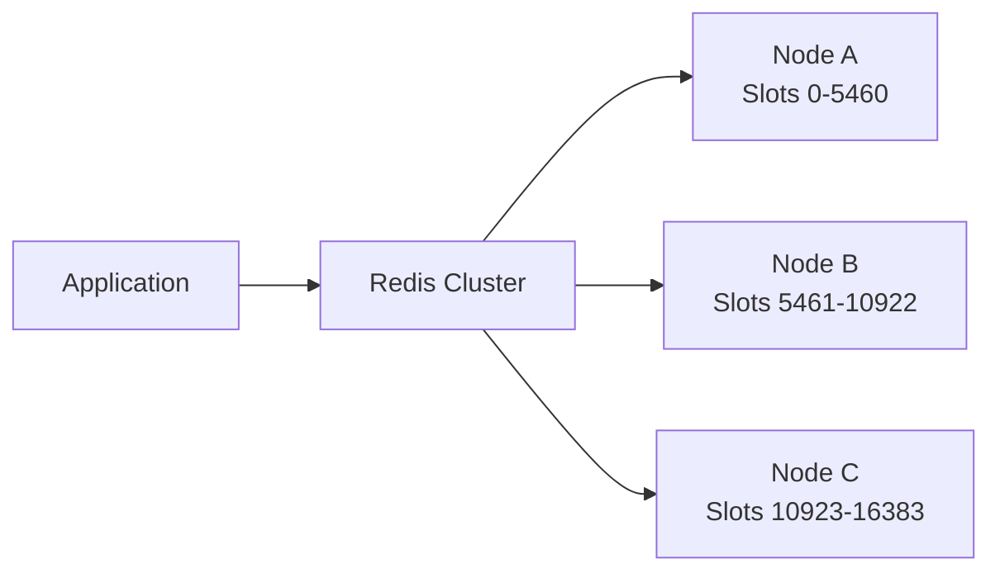
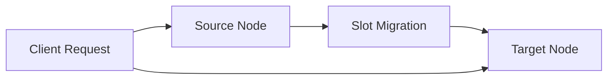
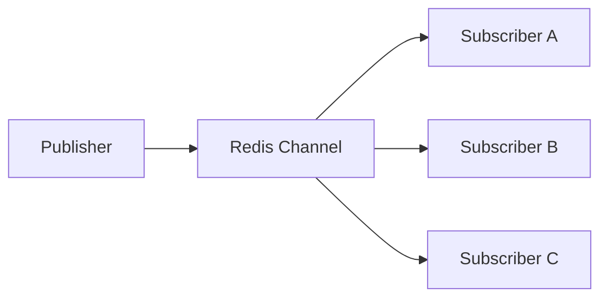
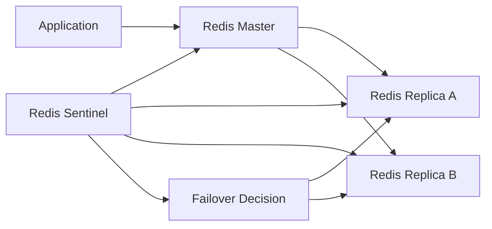
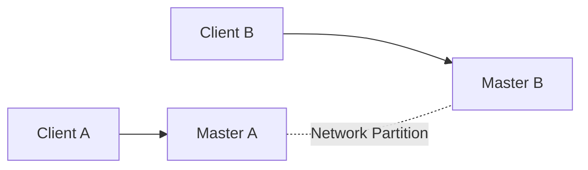
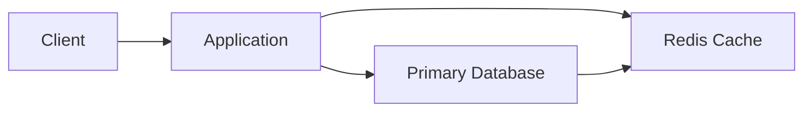

# Redis에서 주의깊게 생각해야 할 것들이 있을까요

# Redis에서 주의깊게 생각해야 할 것들이 있을까요

* toc
{:toc}

---

## Redis 운영에서 주의 깊게 생각해야 할 것들

Redis는 빠른 응답 속도와 다양한 자료구조를 제공하기 때문에 캐시, 세션, 분산 락, 메시징, 실시간 데이터 처리 등 다양한 용도로 활용할 수 있다.

하지만 Redis를 단순히 설치하고 애플리케이션과 연결하는 것만으로 안정적인 운영이 보장되는 것은 아니다. 클러스터에서 데이터를 이동하는 과정, 메모리 부족, 메시지 손실, 장애 조치 지연, 접근 제어 미흡 등 여러 문제가 발생할 수 있다.

특히 Redis는 메모리 기반으로 동작하고, 기본적으로 일부 기능이 비동기 방식으로 처리되기 때문에 데이터의 중요도와 서비스 요구사항에 맞는 운영 정책을 세워야 한다.

---

## 개념

Redis를 운영할 때는 단순히 명령어 사용법만 아는 것이 아니라 다음과 같은 항목을 함께 고려해야 한다.

| 구분 | 주요 내용 |
|---|---|
| 클러스터 | 슬롯 이동, 리밸런싱, 노드별 부하 분산 |
| 데이터 일관성 | 마이그레이션 중 읽기와 쓰기 충돌 방지 |
| 메시징 | Pub/Sub 메시지 손실과 구독자 증가에 따른 부하 |
| 영속성 | RDB, AOF, Replica를 활용한 데이터 복구 |
| 보안 | 인증, ACL, 네트워크 제한, TLS |
| 모니터링 | Slow Log, Keyspace Events, Latency Monitor |
| 장애 대응 | Split-Brain, Failover 지연, 복제 상태 |

Redis의 운영에서 가장 중요한 기준은 “모든 데이터를 Redis에 저장해도 되는가?”이다.

Redis를 캐시로 사용한다면 일부 데이터가 손실되어도 원본 데이터베이스에서 다시 생성할 수 있다. 반면 주문 상태, 결제 결과, 재고 수량처럼 손실되면 안 되는 데이터라면 Redis만을 유일한 저장소로 사용해서는 안 된다.

---

## 왜 사용하는가?

Redis는 매우 빠르지만, 빠르다는 이유만으로 모든 문제를 해결해 주지는 않는다.

예를 들어 다음과 같은 상황을 생각해 볼 수 있다.

- 클러스터 노드 간 슬롯을 이동하는 중에 사용자가 데이터를 수정하는 경우
- Pub/Sub 구독자가 잠시 연결이 끊겨 메시지를 받지 못하는 경우
- 특정 노드에 슬롯이 몰려 전체 트래픽이 균등하게 분산되지 않는 경우
- Redis 서버의 메모리가 부족해 기존 키가 삭제되는 경우
- 마스터 장애 후 Replica가 새로운 마스터로 승격되는 데 시간이 걸리는 경우
- 외부 네트워크에 Redis 포트가 노출되어 비인가 사용자가 접속하는 경우

이런 문제는 개발 환경에서는 쉽게 드러나지 않지만, 트래픽이 증가하거나 노드 장애가 발생하면 서비스 장애로 이어질 수 있다.

따라서 Redis를 사용할 때는 다음 질문을 항상 함께 검토해야 한다.

1. 이 데이터가 유실되어도 되는가?
2. Redis 장애가 발생하면 애플리케이션은 어떻게 동작하는가?
3. 키가 만료되거나 삭제되었을 때 어떻게 복구하는가?
4. 데이터가 여러 노드에 균등하게 분산되는가?
5. 운영자가 문제를 발견할 수 있는 지표가 준비되어 있는가?
6. Redis에 접근할 수 있는 사용자의 범위가 제한되어 있는가?

---

## 주요 특징

### Redis Cluster의 슬롯 구조

Redis Cluster는 전체 키 공간을 16,384개의 해시 슬롯으로 나누고, 각 노드가 일부 슬롯을 담당한다.

키가 어느 슬롯에 저장될지는 다음과 같은 방식으로 결정된다.

```text
HASH_SLOT = CRC16(key) mod 16384
```

일반적으로 애플리케이션이 직접 슬롯을 계산할 필요는 없다. Redis Cluster 클라이언트가 키를 기준으로 적절한 노드에 요청을 전달한다.



여기서 중요한 점은 노드 수가 늘어난다고 해서 슬롯이 자동으로 완벽하게 재분배되는 것은 아니라는 점이다. 노드를 추가하거나 제거한 뒤에는 슬롯 분포와 실제 트래픽을 확인해야 한다.

---

### Slot Migration 중 데이터 일관성

Slot Migration은 특정 슬롯에 속한 키를 다른 노드로 이동하는 작업이다.

일반적인 흐름은 다음과 같다.



데이터를 이동하는 도중에는 다음과 같은 문제가 발생할 수 있다.

- 원본 노드에는 키가 있지만 대상 노드에는 아직 키가 없는 경우
- 키를 이동하는 동시에 애플리케이션이 값을 변경하는 경우
- 마이그레이션 완료 직후 클라이언트가 이전 노드로 요청을 보내는 경우
- 마스터와 Replica 사이에 복제 지연이 발생하는 경우

`MIGRATE` 명령은 키를 다른 Redis 인스턴스로 이동할 때 사용한다.

```redis
MIGRATE 127.0.0.1 7001 0 5000 KEYS user:1 user:2
```

| 항목 | 의미 |
|---|---|
| `127.0.0.1` | 키를 이동할 대상 호스트 |
| `7001` | 대상 Redis 포트 |
| `0` | 대상 데이터베이스 번호 |
| `5000` | 타임아웃 시간 |
| `KEYS` | 여러 키를 이동한다는 의미 |
| `user:1 user:2` | 이동할 키 목록 |

실행 결과는 다음과 같이 확인할 수 있다.

```text
OK
```

`OK`가 반환되면 대상 서버로 키가 이동된 것이다.

다만 이동 과정에서 데이터 변경이 발생할 수 있다면 애플리케이션 계층에서 동기화가 필요하다. 이동 중인 키에 쓰기 작업이 발생하지 않도록 잠시 차단하거나, 요청을 큐에 저장한 뒤 이동이 끝난 후 처리하는 방식이 사용될 수 있다.

`COPY` 옵션을 사용하면 원본 키를 삭제하지 않고 대상 서버에 복사할 수 있다.

```redis
MIGRATE 127.0.0.1 7001 0 5000 user:1 COPY
```

이 방식은 원본 데이터를 유지하면서 대상 노드에 복사하는 데 유용하다. 하지만 복사 이후 원본 키를 직접 삭제하지 않으면 두 노드에 동일한 키가 남을 수 있으므로, 작업 완료 여부와 삭제 시점을 별도로 관리해야 한다.

실제 운영에서는 다음과 같은 방식이 안전하다.

1. 이동 대상 슬롯과 키 목록을 확인한다.
2. 마이그레이션 중인 키에 대한 쓰기 작업을 제어한다.
3. 키가 대상 노드에 정상적으로 존재하는지 확인한다.
4. Replica 복제 상태를 확인한다.
5. 애플리케이션 요청이 새로운 노드로 전달되는지 점검한다.
6. 문제가 없을 때 원본 데이터를 정리한다.

---

### 비대칭 슬롯 할당

슬롯이 노드별로 균등하게 배분되지 않으면 특정 노드에 요청이 집중될 수 있다.

예를 들어 세 개의 노드가 다음과 같이 구성되어 있다고 가정한다.

| 노드 | 할당 슬롯 | 예상 상태 |
|---|---:|---|
| Node A | 10,000개 | CPU와 네트워크 부하 증가 |
| Node B | 2,000개 | 상대적으로 여유 |
| Node C | 4,384개 | 중간 수준 |

이 경우 전체 Redis Cluster의 성능은 가장 바쁜 Node A의 상태에 영향을 받는다.

슬롯 분포는 다음 명령어로 확인할 수 있다.

```bash
redis-cli -c -p 7000 cluster slots
```

실행 결과 예시는 다음과 같다.

```text
1) 1) (integer) 0
   2) (integer) 10000
   3) 1) "127.0.0.1"
      2) (integer) 7000
```

이 결과는 0번부터 10,000번 슬롯까지 특정 노드가 담당하고 있다는 의미이다.

전체 클러스터 상태는 다음 명령어로 확인할 수 있다.

```bash
redis-cli --cluster check 127.0.0.1:7000
```

실행 결과 예시는 다음과 같다.

```text
[OK] All nodes agree about slots configuration.
[OK] All 16384 slots covered.
```

각 노드가 슬롯 설정에 동의하고 있으며, 16,384개의 슬롯이 모두 할당되었다는 의미이다. 하지만 슬롯이 정상적으로 할당되었다고 해서 트래픽까지 균등하다는 뜻은 아니다. 실제 키 개수와 명령어 처리량도 함께 확인해야 한다.

슬롯을 재분배할 때는 다음 명령어를 사용할 수 있다.

```bash
redis-cli --cluster rebalance 127.0.0.1:7000
```

새로 추가된 빈 마스터 노드에 슬롯을 우선 배분하려면 다음 옵션을 사용할 수 있다.

```bash
redis-cli --cluster rebalance 127.0.0.1:7000 --use-empty-masters
```

`--use-empty-masters`는 아직 슬롯을 할당받지 못한 마스터 노드를 리밸런싱 대상에 포함할 때 사용한다.

리밸런싱 전에 다음 명령어로 노드별 기본 상태를 확인할 수 있다.

```bash
redis-cli -c -p 7000 info memory
redis-cli -c -p 7000 info stats
redis-cli -c -p 7000 cluster nodes
```

| 명령어 | 확인 내용 |
|---|---|
| `info memory` | 메모리 사용량, 최대 메모리 |
| `info stats` | 처리한 명령어 수, 네트워크 통계 |
| `cluster nodes` | 노드 상태, 슬롯, Replica 관계 |

해시 태그를 사용하면 여러 키를 같은 슬롯에 배치할 수 있다.

```text
user:{100}:profile
user:{100}:orders
user:{100}:permissions
```

중괄호 안의 `{100}`이 해시 태그로 사용된다. 위 세 키는 동일한 슬롯에 배치된다.

이 방식은 여러 키를 하나의 트랜잭션이나 Lua 스크립트에서 원자적으로 처리해야 할 때 유용하다. 다만 특정 해시 태그에 요청이 집중되면 오히려 하나의 노드에 부하가 몰릴 수 있다. 해시 태그는 무조건 부하를 분산하는 기능이 아니라, 관련 키를 같은 슬롯에 배치하는 기능이다.

---

### 리밸런싱과 다운타임

리밸런싱은 Redis가 동작 중인 상태에서도 수행할 수 있지만, 작업량이 많으면 성능이 일시적으로 저하될 수 있다.

다운타임을 줄이기 위해서는 다음 항목을 고려해야 한다.

- 슬롯을 한 번에 많이 이동하지 않는다.
- 트래픽이 낮은 시간대에 작업한다.
- 이동 중인 키에 대한 쓰기 충돌을 제어한다.
- 리밸런싱 전후의 응답 시간과 오류율을 비교한다.
- 노드별 CPU, 메모리, 네트워크 사용량을 확인한다.
- 가능하면 작은 단위로 나누어 작업한다.

리밸런싱은 데이터 이동과 클라이언트 요청이 동시에 발생하는 작업이다. 따라서 “슬롯 이동이 성공했다”는 결과만 확인해서는 부족하다. 실제 애플리케이션 요청이 정상적으로 처리되는지까지 확인해야 한다.

---

### Pub/Sub의 메시지 손실 가능성

Redis Pub/Sub은 게시자가 채널에 메시지를 발행하면 해당 채널을 구독 중인 클라이언트에게 메시지를 전달하는 구조이다.



Pub/Sub은 빠르고 간단하지만 메시지를 저장하지 않는다.

따라서 다음과 같은 경우 메시지가 손실될 수 있다.

- 메시지 발행 시점에 구독자가 없는 경우
- 구독자가 일시적으로 연결이 끊긴 경우
- 네트워크 오류로 메시지를 수신하지 못한 경우
- 구독자의 처리 속도보다 메시지 발행 속도가 빠른 경우

Pub/Sub은 “지금 연결되어 있는 구독자에게 알림을 전달하는 기능”에 가깝다. 반드시 처리되어야 하는 작업에는 적합하지 않다.

| 용도 | 적합한 방식 |
|---|---|
| 로컬 캐시 삭제 알림 | Pub/Sub |
| 실시간 화면 갱신 알림 | Pub/Sub |
| 주문 처리 이벤트 | Redis Streams 또는 Kafka |
| 결제 결과 이벤트 | Kafka 또는 영속 메시지 시스템 |
| 재처리가 필요한 작업 | Redis Streams 또는 Kafka |

구독자가 많아지면 Redis 서버의 네트워크 부하와 클라이언트 출력 버퍼 사용량이 증가할 수 있다. 이를 제한하는 설정은 다음과 같다.

```conf
client-output-buffer-limit pubsub 32mb 8mb 60
```

| 설정 | 의미 |
|---|---|
| `pubsub` | Pub/Sub 클라이언트 대상 설정 |
| `32mb` | 하드 제한 |
| `8mb` | 소프트 제한 |
| `60` | 소프트 제한 초과 상태가 유지되는 시간 |

예를 들어 출력 버퍼가 32MB를 넘으면 연결이 종료될 수 있다. 또한 8MB를 초과한 상태가 60초 동안 유지되면 연결이 종료될 수 있다.

이 값은 서비스의 메시지 크기와 구독자 수에 맞게 설정해야 한다. 무조건 큰 값을 설정하면 메모리 부족을 늦출 수는 있지만, 장애가 발생했을 때 더 큰 메모리를 사용하게 될 수 있다.

채널 이름도 규칙적으로 설계해야 한다.

```text
cache.invalidate.product
cache.invalidate.user
notification.order.created
notification.payment.completed
```

채널 이름에 서비스, 도메인, 이벤트 종류를 포함하면 운영 중 어떤 메시지인지 확인하기 쉽다.

---

### 데이터 지속성과 내구성

Redis의 데이터는 메모리에 저장되기 때문에 프로세스가 종료되거나 서버가 손상되면 데이터가 사라질 수 있다. 이를 보완하기 위해 RDB와 AOF를 사용한다.

| 방식 | 특징 | 적합한 상황 |
|---|---|---|
| RDB | 특정 시점의 스냅샷 저장 | 주기적 백업, 빠른 복구 |
| AOF | 실행된 쓰기 명령 기록 | 변경 내역 보존 |
| RDB + AOF | 두 방식을 함께 사용 | 복구 속도와 내구성 모두 필요할 때 |
| Replica | 다른 노드에 데이터 복제 | 장애 대응과 읽기 분산 |

RDB 설정 예시는 다음과 같다.

```conf
save 900 1
save 300 10
save 60 10000
```

| 설정 | 의미 |
|---|---|
| `save 900 1` | 900초 동안 1회 이상 변경되면 저장 |
| `save 300 10` | 300초 동안 10회 이상 변경되면 저장 |
| `save 60 10000` | 60초 동안 10,000회 이상 변경되면 저장 |

AOF 설정 예시는 다음과 같다.

```conf
appendonly yes
appendfilename "appendonly.aof"
appendfsync everysec
```

`appendfsync`는 AOF 데이터를 디스크에 기록하는 주기를 설정한다.

| 값 | 특징 |
|---|---|
| `always` | 모든 쓰기마다 디스크에 기록, 내구성은 높지만 성능 저하 가능 |
| `everysec` | 약 1초마다 기록, 성능과 내구성의 균형 |
| `no` | 운영체제에 기록을 위임, 성능은 좋지만 유실 범위가 커질 수 있음 |

일반적인 애플리케이션에서는 `everysec`가 자주 사용된다. 다만 1초 정도의 데이터 손실도 허용할 수 없는 시스템이라면 별도의 메시지 시스템이나 데이터베이스 트랜잭션을 함께 사용해야 한다.

현재 영속성 상태는 다음 명령어로 확인할 수 있다.

```bash
redis-cli info persistence
```

실행 결과 예시는 다음과 같다.

```text
rdb_last_save_time:1720000000
rdb_changes_since_last_save:25
rdb_bgsave_in_progress:0
aof_enabled:1
aof_rewrite_in_progress:0
aof_last_bgrewrite_status:ok
```

| 항목 | 의미 |
|---|---|
| `rdb_last_save_time` | 마지막 RDB 저장 시각 |
| `rdb_changes_since_last_save` | 마지막 저장 이후 변경 횟수 |
| `rdb_bgsave_in_progress` | 백그라운드 RDB 저장 진행 여부 |
| `aof_enabled` | AOF 활성화 여부 |
| `aof_rewrite_in_progress` | AOF 재작성 진행 여부 |
| `aof_last_bgrewrite_status` | 마지막 AOF 재작성 결과 |

Replica를 구성하면 마스터 장애 시 복구 가능성을 높일 수 있다.

```bash
redis-cli -p 7001 replicaof 127.0.0.1 7000
```

실행 결과는 다음과 같다.

```text
OK
```

Replica 상태는 다음 명령어로 확인한다.

```bash
redis-cli -p 7001 info replication
```

실행 결과 예시는 다음과 같다.

```text
role:slave
master_host:127.0.0.1
master_port:7000
master_link_status:up
master_last_io_seconds_ago:1
slave_repl_offset:12500
master_repl_offset:12500
```

`master_link_status:up`이면 마스터와 Replica의 연결이 정상이라는 의미이다. 복제 오프셋이 크게 차이 나면 복제 지연이 발생하고 있을 가능성이 있다.

클러스터 환경에서는 모든 노드의 설정을 동일하게 관리해야 한다. 특정 노드만 AOF가 활성화되어 있거나, Replica의 영속성 설정이 지나치게 약하면 장애 시 노드별 복구 수준이 달라질 수 있다.

---

### 접근 제어와 네트워크 보안

Redis는 외부에 그대로 노출해서는 안 된다. 인증을 설정하더라도 네트워크 접근 자체를 제한하는 것이 기본이다.

기본적인 비밀번호 설정은 다음과 같다.

```conf
requirepass your_secure_password
```

클라이언트는 비밀번호를 사용해 접속한다.

```bash
redis-cli -h 127.0.0.1 -p 6379 -a your_secure_password ping
```

실행 결과는 다음과 같다.

```text
PONG
```

`PONG`이 반환되면 인증 후 Redis가 정상적으로 응답한 것이다.

다만 운영 환경에서는 단일 비밀번호보다 ACL을 사용해 사용자별 권한을 분리하는 편이 좋다.

```redis
ACL SETUSER readonly_user on >readonly_password ~* +get +mget +exists +scan
```

| 항목 | 의미 |
|---|---|
| `readonly_user` | 생성할 사용자 이름 |
| `on` | 사용자 활성화 |
| `>readonly_password` | 비밀번호 설정 |
| `~*` | 모든 키에 접근 허용 |
| `+get` | `GET` 명령 허용 |
| `+mget` | `MGET` 명령 허용 |
| `+exists` | `EXISTS` 명령 허용 |
| `+scan` | `SCAN` 명령 허용 |

읽기 전용 사용자는 애플리케이션의 조회 기능이나 모니터링에 활용할 수 있다.

키 패턴도 제한할 수 있다.

```redis
ACL SETUSER product_reader on >password ~product:* +get +mget +exists +scan
```

이 사용자는 `product:*` 패턴의 키만 조회할 수 있다.

`KEYS` 명령은 전체 키를 한 번에 탐색하기 때문에 운영 환경에서 사용하면 Redis를 오랫동안 점유할 수 있다. 키 조회가 필요하다면 `SCAN`을 사용하는 편이 안전하다.

```redis
SCAN 0 MATCH product:* COUNT 100
```

실행 결과 예시는 다음과 같다.

```text
1) "128"
2) 1) "product:100"
   2) "product:101"
```

첫 번째 값은 다음 탐색에 사용할 커서이고, 두 번째 값은 현재 조회된 키 목록이다. 반환된 커서가 `0`이 될 때까지 반복해야 전체 키를 순회할 수 있다.

네트워크 접근도 제한해야 한다.

```conf
bind 127.0.0.1 10.0.0.10
protected-mode yes
port 6379
```

| 설정 | 의미 |
|---|---|
| `bind` | Redis가 요청을 받을 네트워크 주소 |
| `protected-mode yes` | 외부 노출 위험을 줄이는 보호 모드 |
| `port` | Redis 접속 포트 |

운영 환경에서는 방화벽, 보안 그룹, 사설 네트워크, VPN 등을 함께 사용해 Redis 접근 대상을 제한해야 한다.

---

### TLS를 이용한 데이터 전송 암호화

Redis와 애플리케이션 사이의 네트워크가 신뢰할 수 없는 환경이라면 TLS를 사용해야 한다.

Redis 설정 예시는 다음과 같다.

```conf
tls-port 6379
port 0

tls-cert-file /etc/redis/tls/redis.crt
tls-key-file /etc/redis/tls/redis.key
tls-ca-cert-file /etc/redis/tls/ca.crt

tls-auth-clients yes
```

| 설정 | 의미 |
|---|---|
| `tls-port` | TLS 연결을 받을 포트 |
| `port 0` | 일반 비암호화 포트 비활성화 |
| `tls-cert-file` | 서버 인증서 |
| `tls-key-file` | 서버 개인 키 |
| `tls-ca-cert-file` | 인증 기관 인증서 |
| `tls-auth-clients yes` | 클라이언트 인증서 검증 |

TLS가 활성화된 Redis에 연결할 때는 다음과 같이 `--tls` 옵션을 사용한다.

```bash
redis-cli --tls \
  -h redis.internal \
  -p 6379 \
  --cacert /etc/redis/tls/ca.crt \
  -a your_secure_password \
  ping
```

실행 결과는 다음과 같다.

```text
PONG
```

인증서 파일의 권한과 개인 키 보호도 중요하다. 개인 키가 일반 사용자에게 노출되면 TLS를 사용하더라도 보안상 문제가 발생할 수 있다.

---

### Redis Slow Log

Redis Slow Log는 실행 시간이 오래 걸린 명령어를 기록한다. 네트워크 지연은 포함하지 않고 Redis 내부에서 명령어를 처리하는 데 걸린 시간을 기준으로 한다.

설정 예시는 다음과 같다.

```conf
slowlog-log-slower-than 10000
slowlog-max-len 128
```

`slowlog-log-slower-than`의 단위는 마이크로초이다.

```text
10000 microseconds = 10 milliseconds
```

현재 Slow Log를 조회하려면 다음 명령어를 사용한다.

```bash
redis-cli slowlog get 10
```

실행 결과 예시는 다음과 같다.

```text
1) 1) (integer) 12
   2) (integer) 1720000000
   3) (integer) 15342
   4) 1) "HGETALL"
      2) "large:user"
```

| 항목 | 의미 |
|---|---|
| `12` | Slow Log 식별자 |
| `1720000000` | 실행 시각 |
| `15342` | 실행 시간, 마이크로초 |
| `HGETALL large:user` | 느리게 실행된 명령어 |

`HGETALL`처럼 데이터가 매우 큰 Hash 전체를 조회하거나, `KEYS *`처럼 전체 키를 검색하는 명령어는 데이터 규모가 커질수록 문제가 될 수 있다.

조회 결과가 발견되었다면 다음 항목을 확인해야 한다.

- 반환 데이터의 크기가 지나치게 크지 않은가
- 한 번에 너무 많은 키를 읽고 있지 않은가
- 대체 명령어로 나눌 수 있는가
- 해당 명령어가 트래픽이 집중되는 경로에 있는가
- 애플리케이션에서 불필요하게 반복 호출하고 있지 않은가

---

### Keyspace Events

Keyspace Events는 키 생성, 수정, 삭제, 만료 등의 이벤트를 Pub/Sub 방식으로 전달하는 기능이다.

설정 예시는 다음과 같다.

```conf
notify-keyspace-events "KEA"
```

| 옵션 | 의미 |
|---|---|
| `K` | Keyspace 채널 이벤트 활성화 |
| `E` | Keyevent 채널 이벤트 활성화 |
| `A` | 여러 일반 이벤트 유형 활성화 |

Keyevent 채널을 구독하면 특정 이벤트를 확인할 수 있다.

```bash
redis-cli psubscribe '__keyevent@0__:expired'
```

다른 터미널에서 TTL이 있는 키를 생성한다.

```bash
redis-cli set session:1001 active ex 5
```

실행 결과는 다음과 같다.

```text
OK
```

약 5초 후 구독 터미널에서 다음과 같은 이벤트를 받을 수 있다.

```text
1) "pmessage"
2) "__keyevent@0__:expired"
3) "session:1001"
```

이 기능은 다음과 같은 곳에 활용할 수 있다.

- 캐시 만료 감지
- 세션 만료 이벤트 처리
- 특정 키 삭제 시 후속 작업 수행
- 테스트 환경에서 TTL 동작 확인

다만 Keyspace Events 역시 메시지를 영구 저장하지 않는다. 이벤트를 반드시 처리해야 하는 업무라면 Streams나 Kafka 같은 별도의 메시지 처리 구조를 고려해야 한다.

또한 모든 키에 대한 이벤트를 활성화하면 이벤트 자체가 많아져 Redis 부하가 증가할 수 있다. 필요한 이벤트 종류만 선택하는 것이 좋다.

---

### Redis Latency Monitor

Latency Monitor는 Redis 내부에서 발생하는 지연을 추적하는 기능이다.

활성화 명령어는 다음과 같다.

```redis
CONFIG SET latency-monitor-threshold 100
```

위 설정은 100밀리초 이상 지연된 이벤트를 기록하도록 설정한다.

지연 원인은 다음 명령어로 확인할 수 있다.

```redis
LATENCY DOCTOR
```

실행 결과 예시는 다음과 같다.

```text
1. command: 2 latency spikes (average 145 milliseconds)
2. fork: 1 latency spike (average 210 milliseconds)
```

이 결과는 명령어 실행이나 백그라운드 프로세스 생성 과정에서 지연이 발생했다는 의미이다.

지연의 원인은 다양할 수 있다.

- 대량 데이터를 처리하는 명령어
- RDB 백그라운드 저장
- AOF 재작성
- 디스크 I/O
- 복제 데이터 처리
- CPU 부족
- 네트워크 지연
- 컨테이너 또는 가상 머신의 자원 제한

Slow Log는 특정 명령어의 처리 시간을 찾는 데 유용하고, Latency Monitor는 Redis 내부에서 지연이 발생한 원인을 넓게 확인하는 데 유용하다.

---

### 클라이언트 활동 추적

현재 Redis에 연결된 클라이언트는 다음 명령어로 확인할 수 있다.

```bash
redis-cli client list
```

실행 결과 예시는 다음과 같다.

```text
id=12 addr=10.0.0.21:54321 laddr=10.0.0.10:6379 fd=8 name=app-1 age=120 idle=3 flags=N db=0
```

| 항목 | 의미 |
|---|---|
| `id` | 클라이언트 식별자 |
| `addr` | 클라이언트 주소 |
| `laddr` | Redis 서버의 로컬 주소 |
| `name` | 클라이언트 이름 |
| `age` | 연결이 유지된 시간 |
| `idle` | 마지막 명령 이후 유휴 시간 |
| `flags` | 클라이언트 상태 |
| `db` | 사용 중인 데이터베이스 |

비정상적으로 많은 연결이 발생하거나, 유휴 연결이 계속 증가한다면 커넥션 풀 설정과 애플리케이션의 연결 반환 여부를 점검해야 한다.

문제가 있는 연결을 종료할 때는 다음 명령어를 사용할 수 있다.

```bash
redis-cli client kill 10.0.0.21:54321
```

실행 결과는 다음과 같다.

```text
OK
```

`CLIENT KILL`은 실제 연결을 종료하므로 운영 환경에서는 대상 주소를 정확히 확인한 뒤 사용해야 한다.

---

## 예제

다음은 운영 환경에서 기본적으로 점검할 수 있는 Redis 설정 예시이다.

```conf
bind 127.0.0.1 10.0.0.10
protected-mode yes
port 6379

requirepass your_secure_password

appendonly yes
appendfilename "appendonly.aof"
appendfsync everysec

save 900 1
save 300 10
save 60 10000

slowlog-log-slower-than 10000
slowlog-max-len 128

notify-keyspace-events "KEA"

maxmemory 4gb
maxmemory-policy allkeys-lru
```

각 설정의 의미는 다음과 같다.

| 설정 | 설명 |
|---|---|
| `bind` | 허용할 네트워크 주소 지정 |
| `protected-mode` | 보호 모드 활성화 |
| `requirepass` | 기본 비밀번호 인증 |
| `appendonly` | AOF 활성화 |
| `appendfsync everysec` | AOF를 1초 주기로 디스크에 기록 |
| `save` | RDB 스냅샷 조건 |
| `slowlog-log-slower-than` | Slow Log 기록 기준 |
| `slowlog-max-len` | Slow Log 최대 보관 개수 |
| `notify-keyspace-events` | 키 이벤트 알림 활성화 |
| `maxmemory` | Redis가 사용할 최대 메모리 |
| `maxmemory-policy` | 메모리 초과 시 키 처리 정책 |

캐시 전용 Redis라면 다음과 같이 만료 정책을 사용할 수 있다.

```conf
maxmemory 4gb
maxmemory-policy allkeys-lru
```

`allkeys-lru`는 모든 키를 대상으로 오랫동안 사용되지 않은 키를 우선 삭제한다.

반면 TTL이 설정된 키만 삭제 대상으로 삼고 싶다면 다음 정책을 사용할 수 있다.

```conf
maxmemory-policy volatile-lru
```

| 정책 | 설명 |
|---|---|
| `noeviction` | 메모리 초과 시 쓰기 명령 실패 |
| `allkeys-lru` | 모든 키 중 오래 사용하지 않은 키 삭제 |
| `volatile-lru` | TTL이 있는 키 중 오래 사용하지 않은 키 삭제 |
| `allkeys-lfu` | 모든 키 중 사용 빈도가 낮은 키 삭제 |
| `volatile-ttl` | TTL이 짧게 남은 키부터 삭제 |
| `allkeys-random` | 모든 키 중 무작위 삭제 |

캐시가 아닌 중요한 데이터를 저장하면서 `allkeys-lru`를 사용하면 데이터가 임의로 삭제될 수 있다. 따라서 `maxmemory-policy`는 Redis의 용도에 맞게 선택해야 한다.

운영 중에는 다음 명령어를 정기적으로 확인할 수 있다.

```bash
redis-cli info memory
redis-cli info persistence
redis-cli info replication
redis-cli slowlog get 10
redis-cli client list
```

각 명령어의 확인 목적은 다음과 같다.

| 명령어 | 점검 목적 |
|---|---|
| `info memory` | 메모리 부족 여부 확인 |
| `info persistence` | RDB, AOF 저장 상태 확인 |
| `info replication` | 마스터와 Replica 복제 상태 확인 |
| `slowlog get 10` | 느린 명령어 확인 |
| `client list` | 연결 수와 비정상 클라이언트 확인 |

이 명령어들을 단순히 사람이 필요할 때 실행하는 것에서 끝내지 않고, 모니터링 시스템과 연결해 임계치를 초과하면 알림을 발생시키는 것이 좋다.

---

## 구조

Redis의 일반적인 장애 대응 구조는 다음과 같이 구성할 수 있다.



Sentinel은 마스터와 Replica의 상태를 감시하고, 마스터 장애가 발생하면 Replica를 새로운 마스터로 승격하는 역할을 한다.

Sentinel 설정 예시는 다음과 같다.

```conf
sentinel monitor mymaster 127.0.0.1 6379 2
sentinel down-after-milliseconds mymaster 5000
sentinel failover-timeout mymaster 10000
sentinel parallel-syncs mymaster 2
```

| 설정 | 의미 |
|---|---|
| `sentinel monitor` | 감시할 마스터 지정 |
| `2` | 마스터 장애로 판단하기 위한 Sentinel 동의 수 |
| `down-after-milliseconds` | 응답이 없다고 판단하는 시간 |
| `failover-timeout` | Failover 작업에 사용할 제한 시간 |
| `parallel-syncs` | Failover 이후 동시에 동기화할 Replica 수 |

`down-after-milliseconds`를 지나치게 짧게 설정하면 일시적인 네트워크 지연을 장애로 잘못 판단할 수 있다. 반대로 너무 길게 설정하면 실제 장애 감지가 늦어진다.

---

### Split-Brain 상황

Split-Brain은 네트워크 단절로 인해 하나의 클러스터가 서로 통신하지 못하는 여러 그룹으로 나뉘는 상황이다.



서로 통신할 수 없는 두 노드가 각각 자신이 정상적인 마스터라고 판단하면 동일한 키에 대해 서로 다른 쓰기 작업을 수행할 수 있다.

예를 들어 다음과 같은 문제가 발생할 수 있다.

- 같은 상품의 재고가 서로 다르게 저장됨
- 동일한 세션이 서로 다른 상태를 가짐
- 한쪽에서 삭제한 키가 다른 쪽에는 남아 있음
- 장애 복구 후 어느 데이터를 우선할지 판단하기 어려움

Sentinel 기반 환경에서는 다음 설정을 조정할 수 있다.

```conf
sentinel down-after-milliseconds mymaster 5000
sentinel failover-timeout mymaster 10000
```

하지만 설정값만으로 Split-Brain을 완전히 제거할 수 있는 것은 아니다. 네트워크 구조와 Sentinel 배치도 중요하다.

Sentinel을 한 대의 서버에만 배치하면 해당 서버 장애가 전체 장애 감지에 영향을 줄 수 있다. 서로 다른 장애 도메인이나 가용 영역에 Sentinel을 배치하고, 과반수 판단이 가능하도록 구성해야 한다.

Redis Cluster를 사용하는 경우에도 노드 간 연결 상태와 클러스터 버스를 지속적으로 모니터링해야 한다.

---

### Failover 지연

마스터 장애가 발생하면 Replica가 새로운 마스터로 승격되는 과정이 필요하다. 이 과정에서 다음과 같은 지연이 발생할 수 있다.

- 장애 감지 시간
- Sentinel 간 합의 시간
- 새로운 마스터 선출 시간
- 클라이언트가 새로운 마스터를 인식하는 시간
- Replica 초기 동기화 시간

Failover가 완료되기 전까지는 쓰기 요청이 실패하거나 일시적으로 지연될 수 있다.

Replica 동기화를 병렬로 진행하려면 다음 설정을 사용할 수 있다.

```conf
sentinel parallel-syncs mymaster 2
```

`parallel-syncs`를 증가시키면 여러 Replica가 동시에 동기화되어 전체 동기화 시간을 줄일 수 있다. 하지만 동시에 동기화하는 Replica 수가 많아지면 네트워크와 디스크 사용량이 증가할 수 있다.

디스크를 거치지 않고 복제 데이터를 전송하려면 다음 설정을 사용할 수 있다.

```conf
repl-diskless-sync yes
```

디스크리스 동기화는 복제 과정에서 디스크 파일을 생성하는 단계를 줄일 수 있어 환경에 따라 초기 동기화 시간을 단축할 수 있다.

다만 네트워크 대역폭을 직접 사용하므로 다음 항목을 함께 확인해야 한다.

- 마스터와 Replica 사이의 네트워크 대역폭
- 동기화할 데이터 크기
- 동기화 중 애플리케이션 요청량
- 컨테이너나 가상 머신의 네트워크 제한
- 동기화 실패 시 재시도 동작

---

## 실무에서의 활용

### 캐시와 원본 데이터의 역할 분리

캐시 데이터는 손실되더라도 원본 데이터베이스에서 다시 생성할 수 있어야 한다.



Redis에 저장한 데이터가 원본 데이터베이스에 존재하지 않는다면 Redis를 단순 캐시로 볼 수 없다. 이 경우 영속성, 백업, 복제, 복구 시나리오를 훨씬 엄격하게 설계해야 한다.

---

### 키와 값의 크기 관리

값 하나가 지나치게 크면 다음 문제가 발생할 수 있다.

- 네트워크 전송 시간이 증가한다.
- 직렬화와 역직렬화 시간이 증가한다.
- Redis 이벤트 루프를 오래 점유한다.
- 백업 파일 크기가 커진다.
- 복제와 Failover가 느려진다.

큰 Hash 전체를 한 번에 조회하는 대신 필요한 필드만 가져오는 방식이 좋다.

```redis
HGET user:1001 name
HGET user:1001 email
```

여러 필드가 필요하더라도 필요한 필드만 지정할 수 있다.

```redis
HMGET user:1001 name email status
```

`HGETALL`은 데이터 크기가 작고 필드 수가 통제되는 경우에만 사용하는 것이 좋다.

---

### Pub/Sub와 Streams 선택

다음과 같이 단순한 캐시 삭제 알림은 Pub/Sub으로 처리할 수 있다.

```text
cache.invalidate.product:1001
```

하지만 메시지가 반드시 처리되어야 한다면 Redis Streams를 사용해야 한다.

```redis
XADD order-events * orderId 1001 status CREATED
```

Streams는 메시지를 저장하고 소비자가 나중에 읽을 수 있기 때문에 일시적인 연결 끊김에 대응하기 쉽다.

대규모 이벤트 처리나 여러 소비자 그룹, 장기 보관, 높은 처리량이 필요하면 Kafka 같은 메시지 브로커가 더 적합할 수 있다.

---

### 운영 모니터링 항목

Redis 운영 대시보드에는 다음 지표를 포함하는 것이 좋다.

| 영역 | 주요 지표 |
|---|---|
| 메모리 | `used_memory`, `used_memory_peak`, `mem_fragmentation_ratio` |
| 명령어 | 초당 처리 명령어 수, 명령어별 지연 시간 |
| 네트워크 | 입력 바이트, 출력 바이트, 연결 수 |
| 복제 | 복제 지연, 연결 상태, 오프셋 차이 |
| 영속성 | 마지막 RDB 저장 시간, AOF 재작성 상태 |
| 키 | 만료 수, 삭제 수, Eviction 수 |
| 클러스터 | 슬롯 분포, 노드 상태, Failover 횟수 |

특히 `evicted_keys`가 계속 증가한다면 메모리가 부족하거나 `maxmemory-policy`가 자주 동작하고 있다는 의미일 수 있다.

```bash
redis-cli info stats | findstr evicted_keys
```

실행 결과 예시는 다음과 같다.

```text
evicted_keys:1520
```

캐시 서버라면 일정 수준의 Eviction이 발생할 수 있지만, 갑자기 증가했다면 다음을 확인해야 한다.

- 캐시 키의 TTL이 적절한가
- 값의 크기가 커지지 않았는가
- 트래픽이 갑자기 증가했는가
- `maxmemory`가 충분한가
- Eviction 정책이 서비스 목적에 맞는가

---

### 장애 대응 절차

장애가 발생하면 무작정 Redis를 재시작하기보다 다음 순서로 확인하는 것이 좋다.

1. 클라이언트 연결 수를 확인한다.
2. 메모리 사용량과 Eviction을 확인한다.
3. Slow Log와 Latency Monitor를 확인한다.
4. 마스터와 Replica의 연결 상태를 확인한다.
5. 클러스터 슬롯과 노드 상태를 확인한다.
6. 최근 RDB 저장과 AOF 재작성 결과를 확인한다.
7. 애플리케이션의 Redis 타임아웃과 재시도 상태를 확인한다.

Redis가 응답하지 않는 상황에서 애플리케이션이 무한 재시도를 수행하면 Redis와 애플리케이션 모두 장애가 확대될 수 있다. Redis 클라이언트에는 연결 타임아웃, 명령어 타임아웃, 재시도 횟수, 백오프 정책을 적절히 설정해야 한다.

---

### 보안 설정 점검표

운영 환경에 배포하기 전에는 다음 항목을 점검하는 것이 좋다.

- Redis 포트가 외부 인터넷에 노출되어 있지 않은가
- `bind` 설정이 적절한가
- 인증이 활성화되어 있는가
- 애플리케이션별 ACL 계정이 분리되어 있는가
- 읽기 전용 계정에 쓰기 권한이 없는가
- TLS가 필요한 네트워크 구간에 적용되어 있는가
- Redis 설정 파일과 인증서의 파일 권한이 제한되어 있는가
- 운영자 명령어 사용 이력이 남는가
- `KEYS`, `FLUSHALL`, `FLUSHDB` 같은 위험한 명령어를 제한했는가

특히 `FLUSHALL`과 `FLUSHDB`는 전체 데이터를 삭제할 수 있으므로 운영 계정에서 권한을 제한하는 것이 좋다.

---

## 정리

Redis는 빠르고 유연하지만, 데이터 이동과 장애 복구까지 자동으로 안전하게 처리해 주는 저장소는 아니다.

Redis Cluster를 사용할 때는 슬롯이 균등하게 배분되어 있는지, 특정 노드에 트래픽이 집중되지 않는지 확인해야 한다. Slot Migration 중에는 데이터 변경 충돌과 복제 지연을 고려해야 하며, 리밸런싱은 트래픽과 성능을 관찰하면서 단계적으로 진행해야 한다.

Pub/Sub은 빠른 알림에는 적합하지만 메시지를 저장하지 않기 때문에 중요한 이벤트 처리에는 적합하지 않다. 반드시 처리되어야 하는 메시지는 Redis Streams나 Kafka처럼 재처리가 가능한 시스템을 사용하는 것이 좋다.

RDB와 AOF는 데이터의 중요도와 복구 목표에 맞게 선택해야 한다. Replica를 구성하면 장애 대응력을 높일 수 있지만, 비동기 복제에 따른 데이터 손실 가능성은 여전히 존재한다.

보안 측면에서는 비밀번호만 설정하는 것보다 ACL로 권한을 분리하고, `bind`, 방화벽, 사설 네트워크, TLS를 함께 적용해야 한다.

마지막으로 Slow Log, Keyspace Events, Latency Monitor, `INFO`, `CLIENT LIST`를 활용해 Redis 상태를 지속적으로 관찰해야 한다. 장애가 발생한 뒤 원인을 찾는 것보다, 장애 징후를 미리 발견할 수 있는 모니터링 체계를 갖추는 것이 훨씬 중요하다.

---

### 한 줄 요약

Redis를 안정적으로 운영하려면 클러스터 데이터 이동, 메시지 손실, 영속성, 보안, 모니터링과 장애 조치까지 함께 설계해야 한다.
