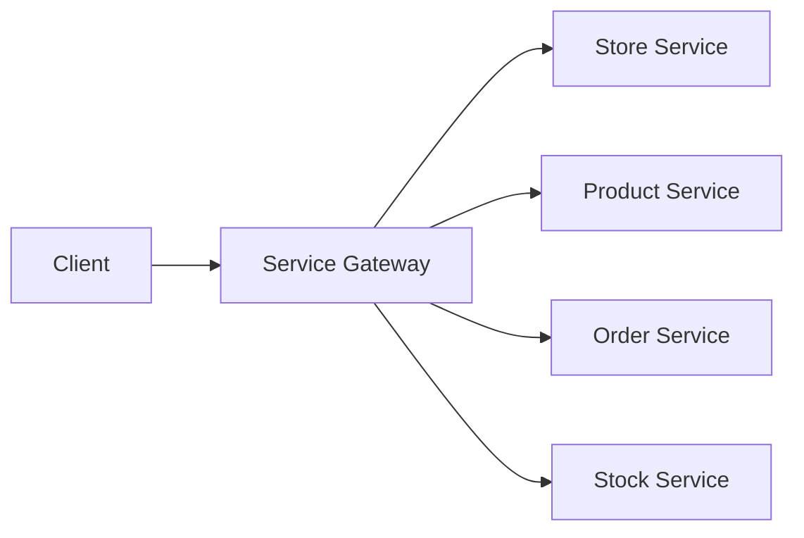
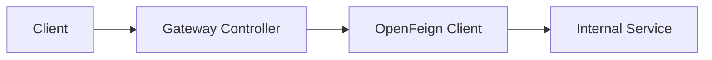
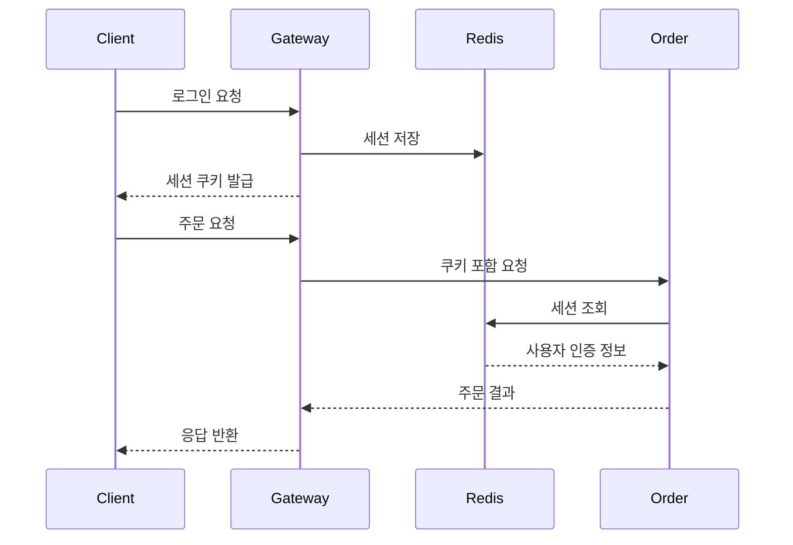
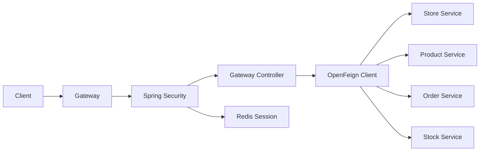
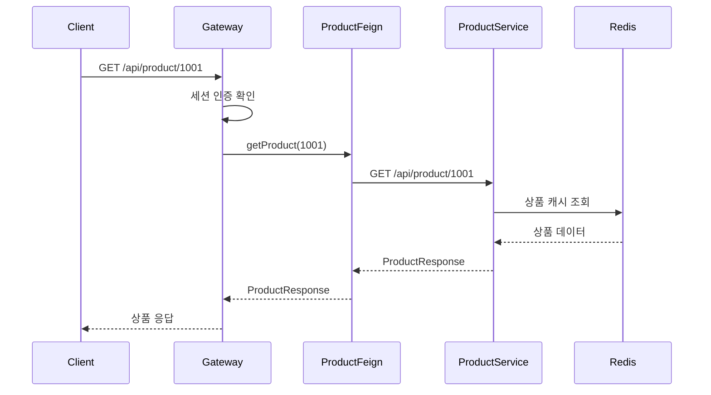
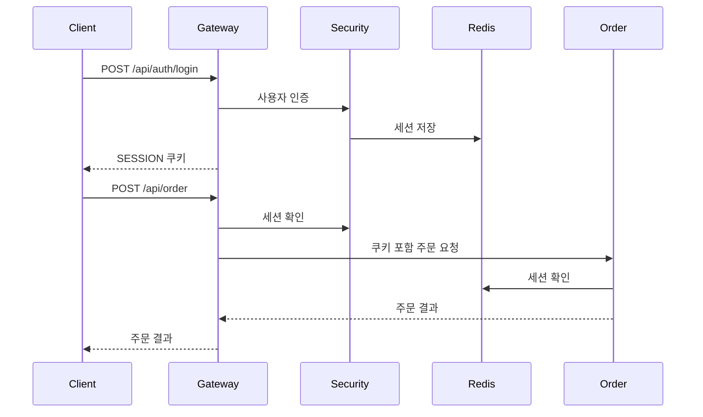
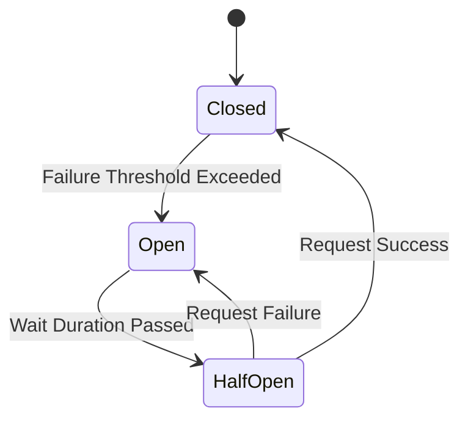

# 오픈 페인으로 게이트웨이 만들기

# 오픈 페인으로 게이트웨이 만들기

* toc
{:toc}

---

## OpenFeign으로 서비스 게이트웨이 구성하기

마이크로서비스 구조에서는 가게, 상품, 주문, 재고처럼 기능이 여러 서비스로 나뉜다. 클라이언트가 각 서비스에 직접 요청하도록 만들 수도 있지만, 서비스 주소와 내부 API 구조가 외부에 노출되고 클라이언트가 여러 서버를 관리해야 한다는 문제가 생긴다.

이때 Gateway를 외부 진입점으로 두고, Gateway가 OpenFeign을 사용해 내부 서비스에 요청을 전달하도록 구성할 수 있다.



이번 구조에서 Gateway는 다음 역할을 담당한다.

- 외부 요청의 단일 진입점
- 서비스별 API 라우팅
- 로그인과 로그아웃
- 세션 인증
- 요청 쿠키 전달
- 서비스 응답 반환
- 공통 인증과 보안 정책 적용

---

## 개념

### OpenFeign이란?

OpenFeign은 HTTP API 호출을 인터페이스 형태로 작성할 수 있게 해주는 선언적 HTTP 클라이언트이다.

일반적인 HTTP 통신은 URL, HTTP 메서드, 헤더, 요청 본문, 응답 변환 등을 직접 작성해야 한다.

OpenFeign을 사용하면 인터페이스에 `@GetMapping`, `@PostMapping` 같은 어노테이션을 선언하는 것만으로 원격 서비스 호출이 가능하다.

```java
@FeignClient(
    name = "productClient",
    url = "http://localhost:8082"
)
public interface ProductFeignClient {

    @GetMapping("/api/product/{productId}")
    ProductResponse getProduct(
        @PathVariable("productId") String productId
    );
}
```

호출하는 쪽에서는 실제 HTTP 통신 과정을 알 필요 없이 일반적인 메서드처럼 사용할 수 있다.

```java
ProductResponse response =
    productFeignClient.getProduct("1001");
```

내부적으로는 다음 요청이 수행된다.

```http
GET http://localhost:8082/api/product/1001
```

### 선언적 방식

OpenFeign의 핵심은 “어떻게 요청을 보낼지”보다 “어떤 API를 호출할지”를 선언한다는 점이다.

```java
@PostMapping("/api/order")
String createOrder(@RequestBody OrderRequest request);
```

위 코드는 다음 정보를 표현한다.

| 요소 | 의미 |
|---|---|
| `@PostMapping` | HTTP POST 요청 |
| `"/api/order"` | 요청 경로 |
| `@RequestBody` | 요청 본문에 JSON 데이터 전달 |
| `OrderRequest` | 요청 데이터 타입 |
| `String` | 응답 데이터 타입 |

Spring Cloud가 이 인터페이스를 기반으로 구현체를 생성하고, 메서드 호출 시 실제 HTTP 요청을 보낸다.

### Gateway와 OpenFeign의 차이

Gateway와 OpenFeign은 같은 개념이 아니다.

| 구분 | 역할 |
|---|---|
| Gateway | 외부 요청을 받아 내부 서비스로 전달하는 진입점 |
| OpenFeign | 다른 서비스의 HTTP API를 호출하는 클라이언트 |
| Spring Cloud Gateway | 라우팅, 필터, 부하 분산을 제공하는 별도 제품 |
| Feign Controller | OpenFeign을 이용해 직접 만든 API 중계 계층 |

이번 구조에서는 Spring Cloud Gateway 제품을 사용하는 것이 아니라, Gateway 애플리케이션 안에 Controller와 Feign Client를 만들고 이를 조합해 서비스 게이트웨이 역할을 구현한다.



따라서 `spring-cloud-starter-gateway`가 없어도 OpenFeign 기반 Gateway를 만들 수 있다.

---

## 왜 사용하는가?

### 서비스 주소를 숨길 수 있다

클라이언트가 각 서비스에 직접 접근하면 다음과 같은 주소가 외부에 노출된다.

```text
http://localhost:8081/api/store
http://localhost:8082/api/product
http://localhost:8083/api/order
http://localhost:8084/api/stock
```

Gateway를 사용하면 클라이언트는 Gateway 주소만 알고 있으면 된다.

```text
http://localhost:8080/api/store
http://localhost:8080/api/product
http://localhost:8080/api/order
http://localhost:8080/api/stock
```

내부 서비스의 주소나 포트가 변경되어도 Gateway 설정만 수정하면 된다.

### HTTP 통신 코드를 줄일 수 있다

OpenFeign을 사용하지 않으면 다음과 같이 직접 HTTP 클라이언트를 작성해야 한다.

```java
RestClient restClient = RestClient.create();

ProductResponse response = restClient.get()
    .uri("http://localhost:8082/api/product/{productId}", productId)
    .retrieve()
    .body(ProductResponse.class);
```

OpenFeign을 사용하면 API 선언과 호출 코드가 분리된다.

```java
ProductResponse response =
    productFeignClient.getProduct(productId);
```

서비스 호출 규칙이 인터페이스에 모이기 때문에 API 목록을 확인하기도 쉽다.

### 세션을 여러 서비스에서 공유할 수 있다

사용자가 Gateway에서 로그인한 뒤 주문 서비스로 요청을 보낸다고 가정해 보자.

Gateway에서 생성한 세션을 내부 서비스로 전달하려면 요청 쿠키가 함께 전달되어야 한다.



### 공통 보안 정책을 적용할 수 있다

Gateway에서 인증 여부를 확인하면 각 서비스마다 같은 인증 코드를 반복 작성하지 않아도 된다.

```text
/api/auth/**  → 인증 없이 접근 가능
/api/product  → 로그인 필요
/api/order    → 로그인 필요
/api/stock    → 관리자 권한 필요
```

다만 Gateway에서 인증을 확인하더라도 내부 서비스가 외부에 직접 노출되면 우회 요청이 발생할 수 있다. 내부 서비스도 필요한 권한 검증을 수행하는 것이 안전하다.

---

## 주요 특징

### 프로젝트 의존성 설정

`build.gradle`은 다음과 같이 구성할 수 있다.

```groovy
plugins {
    id 'org.springframework.boot'
}

springBoot {
    mainClass.set('com.example.GatewayApplication')
}

bootJar {
    archiveFileName = 'service-gateway.jar'
}

repositories {
    mavenCentral()

    maven {
        url 'https://packages.confluent.io/maven/'
    }
}

dependencies {
    implementation 'org.springframework.cloud:spring-cloud-starter-openfeign'

    implementation 'org.springframework.boot:spring-boot-starter-data-redis'
    implementation 'org.springframework.session:spring-session-data-redis'
    implementation 'org.springframework.boot:spring-boot-starter-security'

    implementation 'io.lettuce:lettuce-core'

    compileOnly 'org.projectlombok:lombok'
    annotationProcessor 'org.projectlombok:lombok'

    testImplementation 'org.springframework.boot:spring-boot-starter-test'
}
```

각 의존성의 역할은 다음과 같다.

| 의존성 | 역할 |
|---|---|
| `spring-cloud-starter-openfeign` | 서비스 간 HTTP API 호출 |
| `spring-boot-starter-data-redis` | RedisTemplate과 Redis 연결 |
| `spring-session-data-redis` | Redis 기반 세션 저장 |
| `spring-boot-starter-security` | 로그인과 인증 처리 |
| `lettuce-core` | Redis 비동기 클라이언트 |
| Lombok | Getter, Setter, 생성자 등의 코드 감소 |

Confluent Maven 저장소는 Avro나 Schema Registry 관련 의존성을 사용할 때 필요할 수 있다. 현재 Gateway에서 Avro를 사용하지 않는다면 `mavenCentral()`만으로 충분할 수 있다.

### Feign Client 활성화

메인 애플리케이션에는 `@EnableFeignClients`를 추가해야 한다.

```java
package com.example;

import org.springframework.boot.SpringApplication;
import org.springframework.boot.autoconfigure.SpringBootApplication;
import org.springframework.cloud.openfeign.EnableFeignClients;

@SpringBootApplication
@EnableFeignClients
public class GatewayApplication {

    public static void main(String[] args) {
        SpringApplication.run(
            GatewayApplication.class,
            args
        );
    }
}
```

`@EnableFeignClients`가 없으면 `@FeignClient`가 붙은 인터페이스가 Bean으로 등록되지 않는다.

다음과 같은 오류가 발생하면 해당 어노테이션을 확인해야 한다.

```text
Parameter 0 of constructor required a bean of type
'ProductFeignClient' that could not be found.
```

### CORS 설정

브라우저에서 다른 출처의 서버로 요청을 보내려면 CORS 설정이 필요하다.

```java
package com.example.config;

import java.util.List;

import org.springframework.context.annotation.Bean;
import org.springframework.context.annotation.Configuration;
import org.springframework.web.cors.CorsConfiguration;
import org.springframework.web.cors.UrlBasedCorsConfigurationSource;
import org.springframework.web.filter.CorsFilter;

@Configuration
public class CorsConfig {

    @Bean
    public CorsFilter corsFilter() {
        UrlBasedCorsConfigurationSource source =
            new UrlBasedCorsConfigurationSource();

        CorsConfiguration config =
            new CorsConfiguration();

        config.setAllowCredentials(true);

        config.setAllowedOrigins(
            List.of("http://localhost:3000")
        );

        config.setAllowedHeaders(
            List.of("Content-Type", "Authorization")
        );

        config.setAllowedMethods(
            List.of("GET", "POST", "PUT", "DELETE", "OPTIONS")
        );

        source.registerCorsConfiguration("/**", config);

        return new CorsFilter(source);
    }
}
```

| 설정 | 의미 |
|---|---|
| `setAllowCredentials(true)` | 쿠키와 인증 정보를 포함한 요청 허용 |
| `setAllowedOrigins` | 요청을 허용할 클라이언트 주소 |
| `setAllowedHeaders` | 허용할 요청 헤더 |
| `setAllowedMethods` | 허용할 HTTP 메서드 |
| `registerCorsConfiguration` | URL별 CORS 정책 등록 |

쿠키를 사용하면서 다음과 같이 설정하면 문제가 발생할 수 있다.

```java
config.setAllowCredentials(true);
config.addAllowedOrigin("*");
```

브라우저는 자격 증명이 포함된 요청에서 `*` 와일드카드 출처를 허용하지 않는다. 쿠키 기반 세션을 사용한다면 `http://localhost:3000`처럼 실제 클라이언트 출처를 명시하는 것이 좋다.

운영 환경에서는 환경별로 허용 출처를 분리한다.

```yaml
cors:
  allowed-origins:
    - https://www.example.com
    - https://admin.example.com
```

### 요청 쿠키 전달

Gateway에서 받은 세션 쿠키를 내부 서비스로 전달하려면 Feign의 `RequestInterceptor`를 사용할 수 있다.

```java
package com.example.config;

import feign.RequestInterceptor;
import jakarta.servlet.http.Cookie;
import jakarta.servlet.http.HttpServletRequest;
import org.springframework.context.annotation.Bean;
import org.springframework.context.annotation.Configuration;
import org.springframework.web.context.request.RequestContextHolder;
import org.springframework.web.context.request.ServletRequestAttributes;

@Configuration
public class FeignConfig {

    @Bean
    public RequestInterceptor requestInterceptor() {
        return requestTemplate -> {
            ServletRequestAttributes attributes =
                (ServletRequestAttributes)
                    RequestContextHolder.getRequestAttributes();

            if (attributes == null) {
                return;
            }

            HttpServletRequest request =
                attributes.getRequest();

            Cookie[] cookies = request.getCookies();

            if (cookies == null) {
                return;
            }

            StringBuilder cookieHeader =
                new StringBuilder();

            for (Cookie cookie : cookies) {
                if (cookieHeader.length() > 0) {
                    cookieHeader.append("; ");
                }

                cookieHeader
                    .append(cookie.getName())
                    .append("=")
                    .append(cookie.getValue());
            }

            requestTemplate.header(
                "Cookie",
                cookieHeader.toString()
            );
        };
    }
}
```

이 코드는 현재 요청에 포함된 쿠키를 읽어 Feign 요청의 `Cookie` 헤더에 추가한다.

```text
Client Cookie
→ Gateway Request
→ Feign Request Cookie
→ Internal Service
```

실무에서는 모든 쿠키를 전달하기보다 세션에 필요한 쿠키만 전달하는 것이 좋다.

```java
if ("SESSION".equals(cookie.getName())) {
    requestTemplate.header(
        "Cookie",
        cookie.getName() + "=" + cookie.getValue()
    );
}
```

모든 쿠키를 내부 서비스로 전달하면 불필요한 인증 정보나 추적 쿠키까지 전달될 수 있다.

또한 `RequestContextHolder`는 현재 HTTP 요청 스레드에 요청 정보가 있을 때만 사용할 수 있다. 비동기 스레드나 별도 작업 스레드에서 Feign을 호출하면 요청 정보가 없을 수 있으므로 인증 정보를 명시적으로 전달해야 한다.

---

## 예제

### Redis Cluster 세션 설정

Redis Cluster를 세션 저장소로 사용하려면 여러 클러스터 노드를 연결해야 한다.

```java
package com.example.config;

import org.springframework.context.annotation.Bean;
import org.springframework.context.annotation.Configuration;
import org.springframework.data.redis.connection.RedisClusterConfiguration;
import org.springframework.data.redis.connection.lettuce.LettuceConnectionFactory;
import org.springframework.data.redis.core.RedisTemplate;
import org.springframework.session.data.redis.config.annotation.web.http.EnableRedisHttpSession;

@Configuration
@EnableRedisHttpSession
public class RedisConfig {

    @Bean
    public LettuceConnectionFactory redisConnectionFactory() {
        RedisClusterConfiguration clusterConfiguration =
            new RedisClusterConfiguration();

        clusterConfiguration.clusterNode("localhost", 7001);
        clusterConfiguration.clusterNode("localhost", 7002);
        clusterConfiguration.clusterNode("localhost", 7003);
        clusterConfiguration.clusterNode("localhost", 7004);
        clusterConfiguration.clusterNode("localhost", 7005);
        clusterConfiguration.clusterNode("localhost", 7006);

        return new LettuceConnectionFactory(
            clusterConfiguration
        );
    }

    @Bean
    public RedisTemplate<String, Object> redisTemplate(
        LettuceConnectionFactory redisConnectionFactory
    ) {
        RedisTemplate<String, Object> redisTemplate =
            new RedisTemplate<>();

        redisTemplate.setConnectionFactory(
            redisConnectionFactory
        );

        return redisTemplate;
    }
}
```

| 설정 | 의미 |
|---|---|
| `@EnableRedisHttpSession` | HTTP 세션을 Redis에 저장 |
| `RedisClusterConfiguration` | Redis Cluster 연결 정보 |
| `clusterNode` | 클러스터에 참여한 노드 주소 |
| `LettuceConnectionFactory` | Lettuce 기반 Redis 연결 |
| `RedisTemplate` | Redis 데이터 처리 객체 |

Redis Cluster 상태는 다음 명령어로 확인할 수 있다.

```bash
redis-cli -p 7001 cluster info
```

실행 결과 예시는 다음과 같다.

```text
cluster_state:ok
cluster_slots_assigned:16384
cluster_slots_ok:16384
cluster_known_nodes:6
```

| 결과 | 의미 |
|---|---|
| `cluster_state:ok` | 클러스터 정상 |
| `cluster_slots_assigned:16384` | 전체 슬롯 할당 완료 |
| `cluster_slots_ok:16384` | 정상 처리 가능한 슬롯 수 |
| `cluster_known_nodes:6` | 클러스터에서 인식하는 노드 수 |

노드 목록은 다음 명령어로 확인한다.

```bash
redis-cli -p 7001 cluster nodes
```

세션 TTL은 설정 파일에서 관리할 수 있다.

```yaml
spring:
  session:
    store-type: redis
    timeout: 30m
```

세션을 Redis에 저장하면 Gateway 인스턴스가 여러 대로 늘어나도 같은 세션을 공유할 수 있다.

### Spring Security 설정

다음은 세션 기반 인증을 사용하는 Spring Security 설정 예시이다.

```java
package com.example.config;

import jakarta.servlet.http.HttpServletResponse;

import org.springframework.context.annotation.Bean;
import org.springframework.context.annotation.Configuration;
import org.springframework.security.authentication.AuthenticationManager;
import org.springframework.security.config.annotation.authentication.configuration.AuthenticationConfiguration;
import org.springframework.security.config.annotation.method.configuration.EnableMethodSecurity;
import org.springframework.security.config.annotation.web.builders.HttpSecurity;
import org.springframework.security.config.annotation.web.configurers.AbstractHttpConfigurer;
import org.springframework.security.config.http.SessionCreationPolicy;
import org.springframework.security.core.userdetails.User;
import org.springframework.security.core.userdetails.UserDetails;
import org.springframework.security.crypto.bcrypt.BCryptPasswordEncoder;
import org.springframework.security.crypto.password.PasswordEncoder;
import org.springframework.security.provisioning.InMemoryUserDetailsManager;
import org.springframework.security.web.SecurityFilterChain;

@Configuration
@EnableMethodSecurity
public class SecurityConfig {

    @Bean
    public InMemoryUserDetailsManager userDetailsService(
        PasswordEncoder passwordEncoder
    ) {
        UserDetails user =
            User.withUsername("test")
                .password(
                    passwordEncoder.encode("password")
                )
                .roles("USER")
                .build();

        UserDetails admin =
            User.withUsername("admin")
                .password(
                    passwordEncoder.encode("admin")
                )
                .roles("ADMIN")
                .build();

        return new InMemoryUserDetailsManager(
            user,
            admin
        );
    }

    @Bean
    public SecurityFilterChain securityFilterChain(
        HttpSecurity http
    ) throws Exception {
        http
            .csrf(AbstractHttpConfigurer::disable)
            .authorizeHttpRequests(auth -> auth
                .requestMatchers("/api/auth/**")
                .permitAll()
                .anyRequest()
                .authenticated()
            )
            .sessionManagement(session -> session
                .sessionCreationPolicy(
                    SessionCreationPolicy.IF_REQUIRED
                )
            )
            .formLogin(form -> form
                .loginProcessingUrl("/api/auth/login")
                .usernameParameter("username")
                .passwordParameter("password")
                .successHandler(
                    (request, response, authentication) -> {
                        response.setStatus(
                            HttpServletResponse.SC_OK
                        );
                        response.getWriter().write(
                            "Login successful"
                        );
                    }
                )
                .failureHandler(
                    (request, response, exception) -> {
                        response.setStatus(
                            HttpServletResponse.SC_UNAUTHORIZED
                        );
                        response.getWriter().write(
                            "Login failed: "
                                + exception.getMessage()
                        );
                    }
                )
            )
            .logout(logout -> logout
                .logoutUrl("/api/auth/logout")
                .logoutSuccessHandler(
                    (request, response, authentication) -> {
                        request.getSession().invalidate();
                        response.setStatus(
                            HttpServletResponse.SC_OK
                        );
                        response.getWriter().write(
                            "Logout successful"
                        );
                    }
                )
                .permitAll()
            );

        return http.build();
    }

    @Bean
    public PasswordEncoder passwordEncoder() {
        return new BCryptPasswordEncoder();
    }

    @Bean
    public AuthenticationManager authenticationManager(
        AuthenticationConfiguration authenticationConfiguration
    ) throws Exception {
        return authenticationConfiguration
            .getAuthenticationManager();
    }
}
```

주요 설정은 다음과 같다.

| 설정 | 의미 |
|---|---|
| `csrf().disable()` | CSRF 보호 비활성화 |
| `permitAll()` | 인증 없이 접근 허용 |
| `anyRequest().authenticated()` | 나머지 요청은 인증 필요 |
| `IF_REQUIRED` | 필요한 경우에만 세션 생성 |
| `loginProcessingUrl` | 로그인 처리 URL |
| `logoutUrl` | 로그아웃 처리 URL |
| `BCryptPasswordEncoder` | 비밀번호 해시 처리 |

이 예제의 `InMemoryUserDetailsManager`는 테스트용 사용자 저장소이다. 실제 서비스에서는 데이터베이스나 별도의 사용자 서비스에서 사용자를 조회해야 한다.

또한 쿠키 기반 세션을 사용하는데 CSRF를 무조건 비활성화하면 보안 문제가 발생할 수 있다. 브라우저 기반 서비스에서는 CSRF 토큰, SameSite 쿠키, 허용 Origin 검증 등을 함께 고려해야 한다.

### 인증 DTO

```java
package com.example.dto;

import lombok.Data;

@Data
public class LoginRequest {

    private String username;
    private String password;
}
```

```java
package com.example.dto;

import lombok.AllArgsConstructor;
import lombok.Data;

@Data
@AllArgsConstructor
public class JwtResponse {

    private String token;
}
```

```java
package com.example.dto;

import lombok.Data;

@Data
public class SignupRequest {

    private String username;
    private String password;
}
```

현재 보안 설정은 JWT가 아니라 세션 기반 로그인이다. 따라서 `JwtResponse`라는 이름은 실제 동작과 맞지 않는다.

JWT를 사용할 계획이 없다면 `LoginResponse`나 `SessionResponse`처럼 이름을 변경하는 것이 더 정확하다. DTO 이름과 실제 인증 방식을 일치시키지 않으면 이후 유지보수 과정에서 혼란이 발생한다.

### 주문 DTO

```java
package com.example.order.dto;

import lombok.Data;

@Data
public class OrderRequest {

    private String storeId;
    private String productId;
    private String stockId;
    private long quantity;
}
```

```java
package com.example.order.dto;

import lombok.Data;

@Data
public class OrderResponse {

    private String id;
    private String storeId;
    private String productId;
    private String stockId;
    private long quantity;
}
```

### 주문 Feign Client

```java
package com.example.order;

import com.example.order.dto.OrderRequest;
import com.example.order.dto.OrderResponse;

import org.springframework.cloud.openfeign.FeignClient;
import org.springframework.web.bind.annotation.DeleteMapping;
import org.springframework.web.bind.annotation.GetMapping;
import org.springframework.web.bind.annotation.PathVariable;
import org.springframework.web.bind.annotation.PostMapping;
import org.springframework.web.bind.annotation.PutMapping;
import org.springframework.web.bind.annotation.RequestBody;

@FeignClient(
    name = "orderClient",
    url = "${services.order.url}"
)
public interface OrderFeignClient {

    @PostMapping("/api/order")
    String createOrder(
        @RequestBody OrderRequest request
    );

    @GetMapping("/api/order/{orderId}")
    OrderResponse getOrder(
        @PathVariable("orderId") String orderId
    );

    @PutMapping("/api/order/{orderId}")
    boolean updateOrders(
        @PathVariable("orderId") String orderId,
        @RequestBody OrderRequest request
    );

    @DeleteMapping("/api/order/{orderId}")
    boolean deleteOrder(
        @PathVariable("orderId") String orderId
    );
}
```

서비스 주소를 코드에 직접 작성하지 않고 설정 파일에서 관리하는 것이 좋다.

```yaml
services:
  order:
    url: http://localhost:8083
```

운영 환경에서는 다음처럼 환경 변수를 사용할 수 있다.

```yaml
services:
  order:
    url: ${ORDER_SERVICE_URL}
```

### 주문 Gateway Controller

```java
package com.example.order;

import com.example.order.dto.OrderRequest;
import com.example.order.dto.OrderResponse;

import lombok.extern.slf4j.Slf4j;

import org.springframework.web.bind.annotation.DeleteMapping;
import org.springframework.web.bind.annotation.GetMapping;
import org.springframework.web.bind.annotation.PathVariable;
import org.springframework.web.bind.annotation.PostMapping;
import org.springframework.web.bind.annotation.PutMapping;
import org.springframework.web.bind.annotation.RequestBody;
import org.springframework.web.bind.annotation.RequestMapping;
import org.springframework.web.bind.annotation.RestController;

@Slf4j
@RestController
@RequestMapping("/api/order")
public class OrderController {

    private final OrderFeignClient orderFeignClient;

    public OrderController(
        OrderFeignClient orderFeignClient
    ) {
        this.orderFeignClient = orderFeignClient;
    }

    @PostMapping
    public String createOrder(
        @RequestBody OrderRequest request
    ) {
        return orderFeignClient.createOrder(request);
    }

    @GetMapping("/{orderId}")
    public OrderResponse getOrder(
        @PathVariable("orderId") String orderId
    ) {
        log.info(
            "Get order with id {}",
            orderId
        );

        return orderFeignClient.getOrder(orderId);
    }

    @PutMapping("/{orderId}")
    public boolean updateOrder(
        @PathVariable("orderId") String orderId,
        @RequestBody OrderRequest request
    ) {
        return orderFeignClient.updateOrders(
            orderId,
            request
        );
    }

    @DeleteMapping("/{orderId}")
    public boolean deleteOrder(
        @PathVariable("orderId") String orderId
    ) {
        return orderFeignClient.deleteOrder(orderId);
    }
}
```

Gateway Controller는 비즈니스 로직을 직접 수행하지 않고 요청을 Feign Client에 전달한다. 이렇게 하면 외부 API와 내부 API 사이의 경계를 만들 수 있다.

### 상품 DTO

```java
package com.example.product.dto;

import lombok.Data;

@Data
public class ProductDto {

    private Long id;
    private String name;
    private int price;
}
```

```java
package com.example.product.dto;

import java.util.List;

import lombok.AllArgsConstructor;
import lombok.Data;

@Data
@AllArgsConstructor
public class ProductMetricsDto {

    private String productId;
    private Long likesCount;
    private Long visitsCount;
    private List<String> recentSearches;
}
```

```java
package com.example.product.dto;

import lombok.Data;

@Data
public class ProductRequest {

    private String name;
    private long price;
}
```

```java
package com.example.product.dto;

import lombok.Data;

@Data
public class ProductResponse {

    private Long id;
    private String name;
    private int price;
}
```

### 상품 Feign Client

```java
package com.example.product;

import com.example.product.dto.ProductMetricsDto;
import com.example.product.dto.ProductRequest;
import com.example.product.dto.ProductResponse;

import org.springframework.cloud.openfeign.FeignClient;
import org.springframework.web.bind.annotation.DeleteMapping;
import org.springframework.web.bind.annotation.GetMapping;
import org.springframework.web.bind.annotation.PathVariable;
import org.springframework.web.bind.annotation.PostMapping;
import org.springframework.web.bind.annotation.PutMapping;
import org.springframework.web.bind.annotation.RequestBody;

@FeignClient(
    name = "productClient",
    url = "${services.product.url}"
)
public interface ProductFeignClient {

    @PostMapping("/api/product")
    String createProduct(
        @RequestBody ProductRequest request
    );

    @GetMapping("/api/product/{productId}")
    ProductResponse getProduct(
        @PathVariable("productId") String productId
    );

    @PutMapping("/api/product/{productId}")
    boolean updateProducts(
        @PathVariable("productId") String productId,
        @RequestBody ProductRequest request
    );

    @DeleteMapping("/api/product/{productId}")
    boolean deleteProduct(
        @PathVariable("productId") String productId
    );

    @PostMapping(
        "/api/product/like/{productId}/username/{username}"
    )
    String likeProduct(
        @PathVariable("productId") String productId,
        @PathVariable("username") String username
    );

    @PostMapping("/api/product/visit/{productId}")
    String visitProduct(
        @PathVariable("productId") String productId
    );

    @PostMapping("/api/product/search/{productId}")
    String searchProduct(
        @PathVariable("productId") String productId,
        @RequestParam("query") String query
    );

    @GetMapping("/api/product/metrics/{productId}")
    ProductMetricsDto getProductMetrics(
        @PathVariable("productId") String productId
    );
}
```

```yaml
services:
  product:
    url: http://localhost:8082
```

### 상품 Gateway Controller

```java
package com.example.product;

import com.example.product.dto.ProductMetricsDto;
import com.example.product.dto.ProductRequest;
import com.example.product.dto.ProductResponse;

import org.springframework.web.bind.annotation.DeleteMapping;
import org.springframework.web.bind.annotation.GetMapping;
import org.springframework.web.bind.annotation.PathVariable;
import org.springframework.web.bind.annotation.PostMapping;
import org.springframework.web.bind.annotation.PutMapping;
import org.springframework.web.bind.annotation.RequestBody;
import org.springframework.web.bind.annotation.RequestMapping;
import org.springframework.web.bind.annotation.RequestParam;
import org.springframework.web.bind.annotation.RestController;

@RestController
@RequestMapping("/api/product")
public class ProductController {

    private final ProductFeignClient productFeignClient;

    public ProductController(
        ProductFeignClient productFeignClient
    ) {
        this.productFeignClient = productFeignClient;
    }

    @PostMapping
    public String createProduct(
        @RequestBody ProductRequest request
    ) {
        return productFeignClient.createProduct(request);
    }

    @GetMapping("/{productId}")
    public ProductResponse getProduct(
        @PathVariable("productId") String productId
    ) {
        return productFeignClient.getProduct(productId);
    }

    @PutMapping("/{productId}")
    public boolean updateProduct(
        @PathVariable("productId") String productId,
        @RequestBody ProductRequest request
    ) {
        return productFeignClient.updateProducts(
            productId,
            request
        );
    }

    @DeleteMapping("/{productId}")
    public boolean deleteProduct(
        @PathVariable("productId") String productId
    ) {
        return productFeignClient.deleteProduct(productId);
    }

    @PostMapping(
        "/like/{productId}/username/{username}"
    )
    public String likeProduct(
        @PathVariable("productId") String productId,
        @PathVariable("username") String username
    ) {
        return productFeignClient.likeProduct(
            productId,
            username
        );
    }

    @PostMapping("/visit/{productId}")
    public String visitProduct(
        @PathVariable("productId") String productId
    ) {
        return productFeignClient.visitProduct(productId);
    }

    @PostMapping("/search/{productId}")
    public String searchProduct(
        @PathVariable("productId") String productId,
        @RequestParam("query") String query
    ) {
        return productFeignClient.searchProduct(
            productId,
            query
        );
    }

    @GetMapping("/metrics/{productId}")
    public ProductMetricsDto getProductMetrics(
        @PathVariable("productId") String productId
    ) {
        return productFeignClient.getProductMetrics(productId);
    }
}
```

`@PathVariable`과 `@RequestParam`에는 이름을 명시하는 것이 좋다.

```java
@PathVariable("productId") String productId
```

컴파일 옵션이나 Java 파라미터 이름 정보에 따라 이름을 생략하면 런타임에 파라미터를 찾지 못하는 문제가 발생할 수 있다.

### 재고 DTO

```java
package com.example.stock.dto;

import lombok.Data;

@Data
public class StockRequest {

    private String storeId;
    private String productId;
    private long stock;
}
```

```java
package com.example.stock.dto;

import lombok.Data;

@Data
public class StockResponse {

    private long id;
    private String stockId;
    private String storeId;
    private String productId;
    private long stock;
}
```

### 재고 Feign Client

```java
package com.example.stock;

import com.example.stock.dto.StockRequest;
import com.example.stock.dto.StockResponse;

import org.springframework.cloud.openfeign.FeignClient;
import org.springframework.web.bind.annotation.DeleteMapping;
import org.springframework.web.bind.annotation.GetMapping;
import org.springframework.web.bind.annotation.PathVariable;
import org.springframework.web.bind.annotation.PostMapping;
import org.springframework.web.bind.annotation.PutMapping;
import org.springframework.web.bind.annotation.RequestBody;

@FeignClient(
    name = "stockClient",
    url = "${services.stock.url}"
)
public interface StockFeignClient {

    @PostMapping("/api/stock")
    String createStock(
        @RequestBody StockRequest request
    );

    @GetMapping("/api/stock/{stockId}")
    StockResponse getStock(
        @PathVariable("stockId") String stockId
    );

    @PutMapping("/api/stock/{stockId}")
    boolean updateStocks(
        @PathVariable("stockId") String stockId,
        @RequestBody StockRequest request
    );

    @PutMapping(
        "/api/stock/{stockId}/decrease/{quantity}"
    )
    boolean decreaseStock(
        @PathVariable("stockId") String stockId,
        @PathVariable("quantity") long quantity
    );

    @DeleteMapping("/api/stock/{stockId}")
    boolean deleteStock(
        @PathVariable("stockId") String stockId
    );
}
```

### 재고 Gateway Controller

```java
package com.example.stock;

import com.example.stock.dto.StockRequest;
import com.example.stock.dto.StockResponse;

import lombok.extern.slf4j.Slf4j;

import org.springframework.web.bind.annotation.DeleteMapping;
import org.springframework.web.bind.annotation.GetMapping;
import org.springframework.web.bind.annotation.PathVariable;
import org.springframework.web.bind.annotation.PostMapping;
import org.springframework.web.bind.annotation.PutMapping;
import org.springframework.web.bind.annotation.RequestBody;
import org.springframework.web.bind.annotation.RequestMapping;
import org.springframework.web.bind.annotation.RestController;

@Slf4j
@RestController
@RequestMapping("/api/stock")
public class StockController {

    private final StockFeignClient stockFeignClient;

    public StockController(
        StockFeignClient stockFeignClient
    ) {
        this.stockFeignClient = stockFeignClient;
    }

    @PostMapping
    public String createStock(
        @RequestBody StockRequest request
    ) {
        log.info(
            "Create stock request: {}",
            request
        );

        return stockFeignClient.createStock(request);
    }

    @GetMapping("/{stockId}")
    public StockResponse getStock(
        @PathVariable("stockId") String stockId
    ) {
        log.info(
            "Get stock by id {}",
            stockId
        );

        return stockFeignClient.getStock(stockId);
    }

    @PutMapping("/{stockId}")
    public boolean updateStock(
        @PathVariable("stockId") String stockId,
        @RequestBody StockRequest request
    ) {
        return stockFeignClient.updateStocks(
            stockId,
            request
        );
    }

    @PutMapping("/{stockId}/decrease/{quantity}")
    public boolean decreaseStock(
        @PathVariable("stockId") String stockId,
        @PathVariable("quantity") long quantity
    ) {
        return stockFeignClient.decreaseStock(
            stockId,
            quantity
        );
    }

    @DeleteMapping("/{stockId}")
    public boolean deleteStock(
        @PathVariable("stockId") String stockId
    ) {
        return stockFeignClient.deleteStock(stockId);
    }
}
```

재고 차감은 단순한 HTTP 전달만으로 끝나지 않는다. 실제 재고 서비스에서는 Redisson 분산 락이나 Redis 원자 명령을 활용해 동시성 문제를 처리해야 한다.

### 가게 DTO

```java
package com.example.store.dto;

import lombok.Data;

@Data
public class StoreRequest {

    private String storeName;
    private String ownerName;
    private String address;
    private String phoneNumber;
}
```

```java
package com.example.store.dto;

import lombok.Data;

@Data
public class StoreResponse {

    private Long id;
    private String storeId;
    private String storeName;
    private String ownerName;
    private String address;
    private String phoneNumber;
}
```

### 가게 Feign Client

```java
package com.example.store;

import com.example.config.FeignConfig;
import com.example.store.dto.StoreRequest;
import com.example.store.dto.StoreResponse;

import org.springframework.cloud.openfeign.FeignClient;
import org.springframework.web.bind.annotation.DeleteMapping;
import org.springframework.web.bind.annotation.GetMapping;
import org.springframework.web.bind.annotation.PathVariable;
import org.springframework.web.bind.annotation.PostMapping;
import org.springframework.web.bind.annotation.PutMapping;
import org.springframework.web.bind.annotation.RequestBody;

@FeignClient(
    name = "storeClient",
    url = "${services.store.url}",
    configuration = FeignConfig.class
)
public interface StoreFeignClient {

    @PostMapping("/api/store")
    String createStore(
        @RequestBody StoreRequest request
    );

    @GetMapping("/api/store/{storeId}")
    StoreResponse getStore(
        @PathVariable("storeId") String storeId
    );

    @PutMapping("/api/store/{storeId}")
    boolean updateStore(
        @PathVariable("storeId") String storeId,
        @RequestBody StoreRequest request
    );

    @DeleteMapping("/api/store/{storeId}")
    boolean deleteStore(
        @PathVariable("storeId") String storeId
    );
}
```

```yaml
services:
  store:
    url: http://localhost:8081

  product:
    url: http://localhost:8082

  order:
    url: http://localhost:8083

  stock:
    url: http://localhost:8084
```

`configuration = FeignConfig.class`를 지정하면 해당 Client에만 쿠키 전달 인터셉터를 적용할 수 있다.

모든 Feign Client에 공통으로 적용할지, 세션이 필요한 Client에만 적용할지는 서비스 구조에 따라 결정해야 한다.

### 가게 Gateway Controller

```java
package com.example.store;

import com.example.store.dto.StoreRequest;
import com.example.store.dto.StoreResponse;

import lombok.extern.slf4j.Slf4j;

import org.springframework.web.bind.annotation.DeleteMapping;
import org.springframework.web.bind.annotation.GetMapping;
import org.springframework.web.bind.annotation.PathVariable;
import org.springframework.web.bind.annotation.PostMapping;
import org.springframework.web.bind.annotation.PutMapping;
import org.springframework.web.bind.annotation.RequestBody;
import org.springframework.web.bind.annotation.RequestMapping;
import org.springframework.web.bind.annotation.RestController;

@Slf4j
@RestController
@RequestMapping("/api/store")
public class StoreController {

    private final StoreFeignClient storeFeignClient;

    public StoreController(
        StoreFeignClient storeFeignClient
    ) {
        this.storeFeignClient = storeFeignClient;
    }

    @PostMapping
    public String createStore(
        @RequestBody StoreRequest request
    ) {
        return storeFeignClient.createStore(request);
    }

    @GetMapping("/{storeId}")
    public StoreResponse getStore(
        @PathVariable("storeId") String storeId
    ) {
        return storeFeignClient.getStore(storeId);
    }

    @PutMapping("/{storeId}")
    public boolean updateStore(
        @PathVariable("storeId") String storeId,
        @RequestBody StoreRequest request
    ) {
        return storeFeignClient.updateStore(
            storeId,
            request
        );
    }

    @DeleteMapping("/{storeId}")
    public boolean deleteStore(
        @PathVariable("storeId") String storeId
    ) {
        return storeFeignClient.deleteStore(storeId);
    }
}
```

---

## 구조

전체 요청 구조는 다음과 같다.



상품 조회 요청의 흐름은 다음과 같다.



로그인과 내부 서비스 호출은 다음과 같이 처리된다.



---

## 실무에서의 활용

### 타임아웃 설정

Feign 요청에 타임아웃을 설정하지 않으면 내부 서비스가 응답하지 않을 때 Gateway의 요청이 계속 대기할 수 있다.

```yaml
spring:
  cloud:
    openfeign:
      client:
        config:
          default:
            connect-timeout: 2000
            read-timeout: 3000
            logger-level: basic
```

| 설정 | 의미 |
|---|---|
| `connect-timeout` | 연결을 맺을 때 기다리는 시간 |
| `read-timeout` | 연결 후 응답을 기다리는 시간 |
| `logger-level` | Feign 요청 로그 수준 |

타임아웃은 서비스의 실제 처리 시간을 고려해 설정해야 한다. 지나치게 짧으면 정상적인 요청도 실패하고, 지나치게 길면 장애가 다른 서비스로 전파될 수 있다.

### Feign 예외 처리

내부 서비스가 404, 500 등의 응답을 반환하면 Feign은 예외를 발생시킬 수 있다.

```java
try {
    return productFeignClient.getProduct(productId);
} catch (FeignException.NotFound e) {
    throw new IllegalArgumentException(
        "상품을 찾을 수 없습니다."
    );
} catch (FeignException e) {
    throw new IllegalStateException(
        "상품 서비스 호출에 실패했습니다.",
        e
    );
}
```

Gateway에서 내부 서비스의 예외를 그대로 반환하면 내부 구조나 스택 트레이스가 외부에 노출될 수 있다. 외부용 에러 응답 형식을 별도로 정의하는 것이 좋다.

```json
{
  "code": "PRODUCT_SERVICE_UNAVAILABLE",
  "message": "상품 서비스를 잠시 이용할 수 없습니다."
}
```

### Circuit Breaker

특정 내부 서비스가 장애 상태인데도 Gateway가 계속 요청을 보내면 장애가 확산될 수 있다.

Circuit Breaker를 사용하면 실패가 반복되는 서비스에 대한 요청을 일시적으로 차단할 수 있다.



상태의 의미는 다음과 같다.

| 상태 | 의미 |
|---|---|
| `Closed` | 정상적으로 요청 전달 |
| `Open` | 요청을 차단하고 빠르게 실패 처리 |
| `HalfOpen` | 일부 요청으로 복구 여부 확인 |

OpenFeign은 Resilience4j와 연동할 수 있다. 장애가 예상되는 서비스에는 타임아웃, 재시도, Circuit Breaker를 함께 적용해야 한다.

### 재시도 설정

읽기 요청은 상황에 따라 재시도할 수 있지만, 주문 생성과 같은 쓰기 요청은 무조건 재시도하면 안 된다.

```text
상품 조회 실패
→ 짧은 재시도 가능

주문 생성 응답 지연
→ 무조건 재시도하면 중복 주문 가능
```

주문 API를 재시도하려면 멱등 키를 사용해야 한다.

```http
Idempotency-Key: order-request-1001
```

동일한 멱등 키로 요청이 다시 들어오면 기존 처리 결과를 반환하도록 구현해야 한다.

### 요청과 응답 DTO 분리

Gateway에서 내부 서비스의 DTO를 그대로 외부에 노출하면 내부 변경이 외부 API에 영향을 줄 수 있다.

```text
Gateway Request DTO
→ Feign Request DTO
→ Internal Service DTO
```

작은 프로젝트에서는 같은 DTO를 사용할 수 있지만, 서비스가 커지면 외부 API 모델과 내부 서비스 모델을 분리하는 것이 좋다.

### URL 직접 작성의 한계

개발 환경에서는 다음처럼 URL을 직접 작성할 수 있다.

```java
@FeignClient(
    name = "productClient",
    url = "http://localhost:8082"
)
```

하지만 운영 환경에서는 다음 문제가 발생한다.

- 서버 주소 변경 시 재빌드 필요
- 환경별 주소 관리 어려움
- 서비스 인스턴스가 여러 대일 때 부하 분산 어려움
- 장애 인스턴스 제외 어려움

따라서 설정 파일이나 서비스 디스커버리를 활용하는 것이 좋다.

```java
@FeignClient(
    name = "productClient",
    url = "${services.product.url}"
)
```

### Gateway 확인 방법

Gateway를 실행한 뒤 상품 조회 API를 호출한다.

```bash
curl http://localhost:8080/api/product/1001
```

실행 결과 예시는 다음과 같다.

```json
{
  "id": 1001,
  "name": "무선 키보드",
  "price": 45000
}
```

이 요청이 정상적으로 동작하려면 다음 조건이 모두 충족되어야 한다.

- Gateway가 실행 중이어야 한다.
- Product Service가 실행 중이어야 한다.
- `services.product.url`이 올바른 주소여야 한다.
- Product Service에 `/api/product/{productId}` API가 있어야 한다.
- Feign Client의 HTTP 메서드와 경로가 일치해야 한다.
- 응답 JSON이 `ProductResponse`와 호환되어야 한다.

로그인 요청은 다음과 같이 보낼 수 있다.

```bash
curl -i \
  -c cookies.txt \
  -X POST http://localhost:8080/api/auth/login \
  -H "Content-Type: application/x-www-form-urlencoded" \
  -d "username=test&password=password"
```

실행 결과 예시는 다음과 같다.

```text
HTTP/1.1 200
Set-Cookie: SESSION=...
Login successful
```

`-c cookies.txt`는 응답으로 받은 쿠키를 파일에 저장한다.

저장한 세션 쿠키로 인증이 필요한 API를 호출한다.

```bash
curl \
  -b cookies.txt \
  http://localhost:8080/api/order/5001
```

`-b cookies.txt`는 저장한 쿠키를 요청에 포함한다.

로그아웃은 다음과 같이 호출한다.

```bash
curl \
  -b cookies.txt \
  -X POST http://localhost:8080/api/auth/logout
```

실행 결과는 다음과 같다.

```text
Logout successful
```

로그아웃 시 Gateway의 세션이 삭제되고, 이후 인증이 필요한 요청은 다시 인증을 요구하게 된다.

---

## 정리

OpenFeign은 서비스 간 HTTP 통신을 인터페이스 형태로 작성할 수 있게 해주는 선언적 HTTP 클라이언트이다.

Gateway 애플리케이션에 Controller와 Feign Client를 구성하면 클라이언트는 하나의 주소만 사용하면서 내부의 가게, 상품, 주문, 재고 서비스에 접근할 수 있다.

Gateway에는 다음과 같은 기능을 배치할 수 있다.

- 외부 요청의 단일 진입점
- 서비스별 요청 전달
- Spring Security 기반 인증
- Redis 기반 글로벌 세션
- 요청 쿠키 전달
- 공통 CORS 설정
- 서비스별 예외 처리
- 타임아웃과 Circuit Breaker

Redis Cluster를 세션 저장소로 사용하면 Gateway가 여러 대로 늘어나도 사용자의 세션을 공유할 수 있다. Feign `RequestInterceptor`를 사용하면 Gateway에서 받은 세션 쿠키를 내부 서비스로 전달할 수 있다.

다만 쿠키를 사용하는 환경에서 CORS를 `*`로 설정하거나 CSRF를 무조건 비활성화하면 보안 문제가 발생할 수 있다. 허용 Origin, 쿠키 전달 범위, 세션 만료, CSRF 방어 정책을 실제 서비스 환경에 맞게 설정해야 한다.

또한 OpenFeign은 통신을 간편하게 만들어 주지만 타임아웃과 재시도 정책까지 자동으로 안전하게 구성해 주는 것은 아니다. 주문과 같은 쓰기 요청에는 중복 처리 방지와 멱등성까지 함께 설계해야 한다.

---

### 한 줄 요약

OpenFeign을 사용하면 Gateway에서 서비스별 HTTP API를 간결하게 호출할 수 있고, Redis Session과 Spring Security를 결합해 여러 마이크로서비스가 공유하는 인증 구조를 만들 수 있다.
