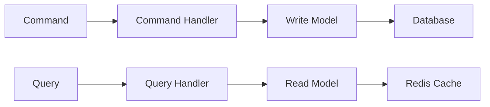
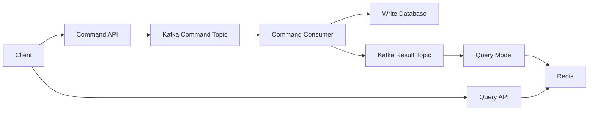
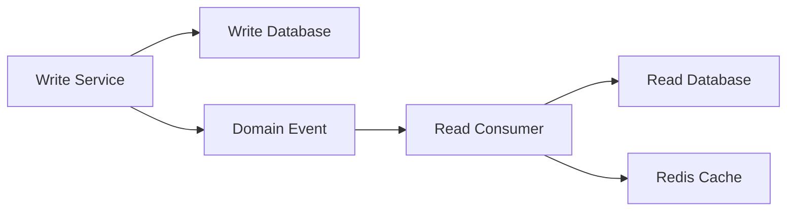
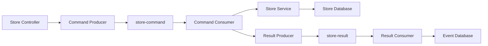
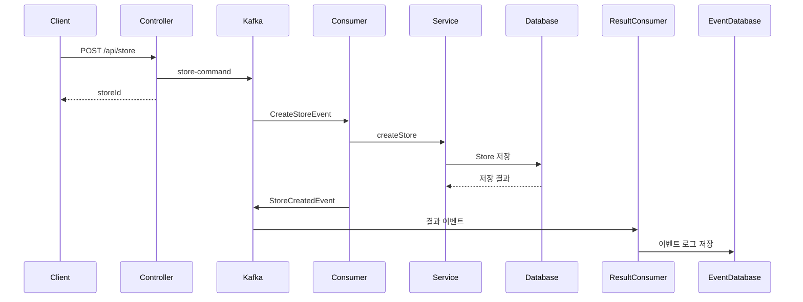
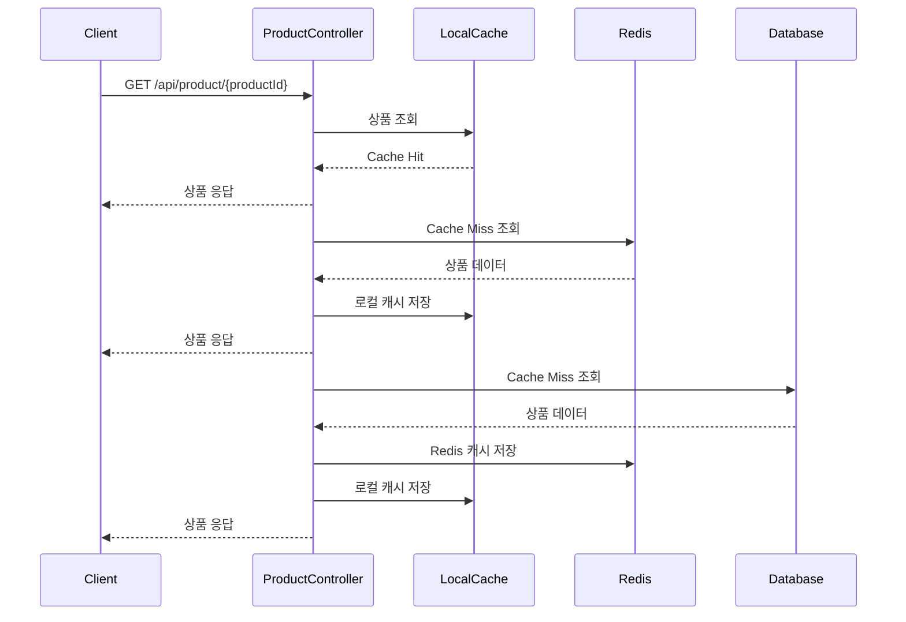
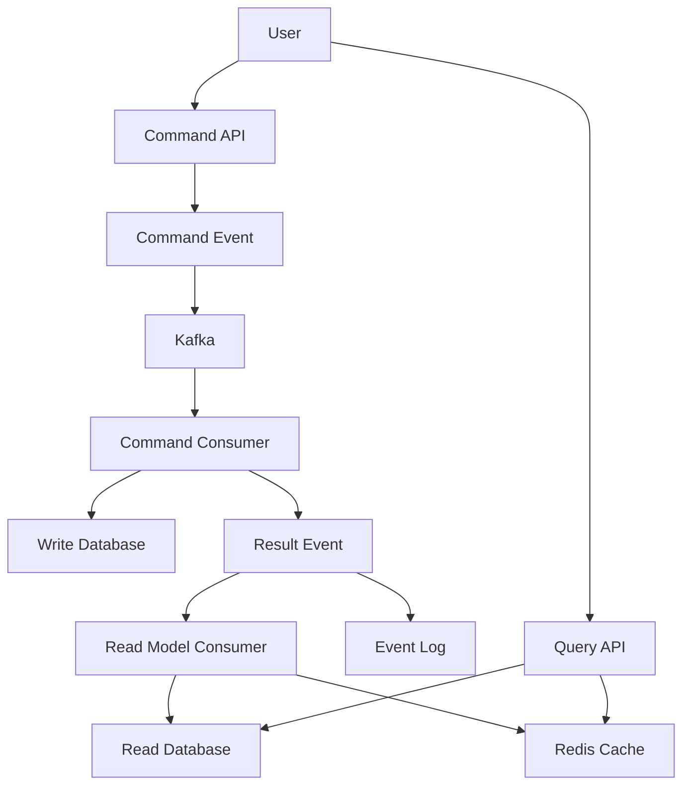
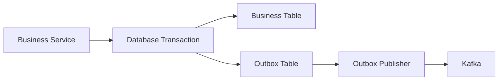
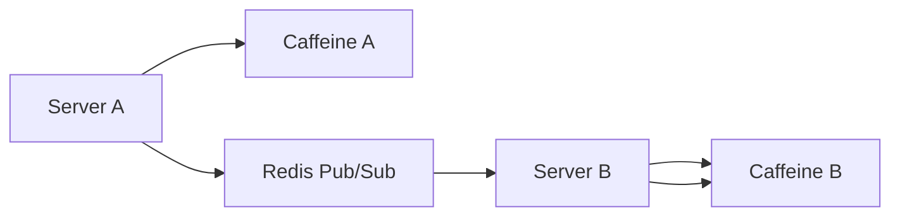

# Event Sourcing과 CQRS패턴이 적용된 서비스 만들기1

# Event Sourcing과 CQRS패턴이 적용된 서비스 만들기1

* toc
{:toc}

---

## Event Sourcing과 CQRS를 적용한 서비스 만들기

마이크로서비스 환경에서는 하나의 요청이 여러 서비스와 데이터 저장소를 거쳐 처리된다. 이때 단순히 현재 데이터만 저장하면 “언제, 누가, 어떤 이유로 데이터가 변경되었는가?”를 추적하기 어렵다.

예를 들어 가게 정보가 현재 다음과 같이 저장되어 있다고 가정해 보자.

```text
storeName = "기존 가게 이름"
```

이 값만으로는 다음 사실을 알 수 없다.

- 가게가 언제 생성되었는가
- 이름이 몇 번 변경되었는가
- 누가 변경했는가
- 변경 전 이름은 무엇이었는가
- 특정 시점의 가게 상태는 어떠했는가

Event Sourcing은 데이터의 최종 상태만 저장하는 대신 상태를 변경한 이벤트를 기록한다. CQRS는 데이터를 변경하는 작업과 조회하는 작업을 분리한다.

Kafka를 이벤트 전달 수단으로 사용하고, 데이터베이스와 Redis를 각각 명령 처리와 조회 성능 개선에 활용하면 분산 환경에서도 변경 이력을 추적하고 읽기 성능을 높일 수 있다.

---

## 개념

### Event Sourcing이란?

Event Sourcing은 시스템에서 발생한 모든 상태 변경을 이벤트로 저장하고, 필요할 때 이벤트를 순서대로 재생해 현재 상태를 복원하는 방식이다.

재고 수량을 직접 저장하는 방식과 Event Sourcing 방식을 비교해 보자.

#### 일반적인 상태 저장 방식

```text
stock = 10
```

주문이 발생하면 다음과 같이 변경된다.

```text
stock = 7
```

최종 상태는 알 수 있지만, 어떤 작업을 통해 7이 되었는지는 알기 어렵다.

#### Event Sourcing 방식

```text
StockCreated(quantity=10)
StockDecreased(quantity=3)
```

이벤트를 순서대로 재생하면 현재 재고를 계산할 수 있다.

```text
10 - 3 = 7
```

재고가 다시 증가했다면 다음 이벤트가 추가된다.

```text
StockCreated(quantity=10)
StockDecreased(quantity=3)
StockIncreased(quantity=5)
```

현재 재고는 다음과 같이 계산된다.

```text
10 - 3 + 5 = 12
```

이벤트는 이미 발생한 사실을 표현해야 한다. 다음과 같은 이벤트가 대표적이다.

```text
StoreCreated
StoreUpdated
StoreDeleted

ProductCreated
ProductUpdated
ProductDeleted

OrderCreated
OrderUpdated
OrderDeleted
```

### CQRS란?

CQRS는 `Command Query Responsibility Segregation`의 약자로, 명령과 조회의 책임을 분리하는 아키텍처이다.

| 구분 | 역할 | 주요 특징 |
|---|---|---|
| Command | 데이터 생성, 수정, 삭제 | 검증과 비즈니스 규칙 중요 |
| Query | 데이터 조회 | 응답 속도와 조회 모델 중요 |

명령과 조회는 요구사항이 다르다.

- 쓰기 작업은 트랜잭션 일관성이 중요하다.
- 조회 작업은 빠른 응답과 검색 최적화가 중요하다.
- 쓰기 모델은 도메인 규칙을 중심으로 설계한다.
- 조회 모델은 Redis나 읽기 전용 테이블을 사용할 수 있다.



### Event Sourcing과 CQRS의 조합

Event Sourcing과 CQRS를 함께 사용하면 명령 처리 결과를 이벤트로 기록하고, 조회 모델이 이벤트를 구독해 최신 상태를 유지할 수 있다.



이 구조에서는 명령 요청과 조회 요청이 서로 다른 경로를 사용한다.

```text
쓰기 요청
→ Command Event 발행
→ Command Consumer 처리
→ 데이터베이스 변경
→ Result Event 발행

조회 요청
→ Redis 또는 조회 데이터베이스 조회
```

### 이벤트 로그와 진짜 Event Sourcing의 차이

Kafka에 이벤트를 발행하고 이벤트 로그 테이블에 저장한다고 해서 완전한 Event Sourcing이 되는 것은 아니다.

진짜 Event Sourcing은 이벤트가 상태의 원본이어야 한다.

```text
이벤트 저장소
→ 이벤트 재생
→ 현재 상태 복원
```

반면 데이터베이스를 먼저 수정하고 결과 이벤트를 기록하는 구조는 이벤트 로그나 감사 로그에 가깝다.

```text
데이터베이스 수정
→ 결과 이벤트 발행
→ 이벤트 로그 저장
```

이 구조도 장애 추적과 변경 이력 관리에는 유용하지만, 데이터베이스가 원본이고 이벤트는 부가 기록이라는 차이가 있다.

---

## 왜 사용하는가?

### 변경 이력을 추적할 수 있다

Event Sourcing을 사용하면 데이터가 변경된 과정을 확인할 수 있다.

```text
StoreCreated
StoreUpdated
StoreUpdated
StoreDeleted
```

각 이벤트에 시간, 사용자, 요청 ID, 변경 데이터가 포함되어 있다면 장애 원인과 변경 주체를 추적하기 쉽다.

### 과거 상태를 재구성할 수 있다

특정 시점까지의 이벤트만 재생하면 과거의 상태를 복원할 수 있다.

```text
현재 시점까지 이벤트 재생
→ 현재 상태

특정 날짜까지 이벤트 재생
→ 특정 날짜의 상태
```

이는 다음과 같은 기능에 활용할 수 있다.

- 감사 로그
- 주문 상태 추적
- 재고 변동 내역
- 가게 정보 변경 이력
- 장애 분석
- 데이터 복구

### 읽기와 쓰기를 독립적으로 확장할 수 있다

상품 조회가 주문 생성보다 훨씬 많은 서비스라면 조회 모델을 별도로 확장할 수 있다.



쓰기 서비스는 트랜잭션과 데이터 일관성에 집중하고, 조회 서비스는 캐시와 검색 구조에 집중할 수 있다.

### 서비스 간 결합도를 낮출 수 있다

주문 서비스가 로그 서비스, 알림 서비스, 통계 서비스를 직접 호출하면 서비스 간 결합도가 높아진다.

Kafka 이벤트를 사용하면 주문 서비스는 이벤트를 발행하고, 각 소비자가 필요한 작업을 독립적으로 처리할 수 있다.

```text
Order Service
→ OrderCreated Event 발행

Event Log Consumer
→ 이벤트 로그 저장

Notification Consumer
→ 주문 알림 발송

Statistics Consumer
→ 판매 통계 반영
```

새로운 소비자를 추가해도 주문 서비스의 핵심 로직은 크게 변경되지 않는다.

---

## 주요 특징

### Command Topic과 Result Topic

가게 서비스는 다음과 같이 두 종류의 토픽을 사용할 수 있다.

| 토픽 | 역할 |
|---|---|
| `store-command` | 가게 생성, 수정, 삭제 명령 전달 |
| `store-result` | 명령 처리 결과 이벤트 전달 |

전체 흐름은 다음과 같다.



명령 이벤트와 결과 이벤트를 분리하면 다음 정보를 구분할 수 있다.

```text
무엇을 요청했는가?
→ Command Event

요청이 어떤 결과를 만들었는가?
→ Result Event
```

### 비동기 처리

명령 이벤트를 Kafka에 발행한 뒤 실제 데이터베이스 변경은 Consumer가 처리한다.

따라서 API는 데이터베이스 변경이 완료될 때까지 기다리지 않고 요청 ID를 먼저 반환할 수 있다.

```java
@PostMapping
public String createStore(
    @RequestBody StoreDto dto
) {
    String storeId = UUID.randomUUID().toString();

    CreateStoreEvent event =
        new CreateStoreEvent(
            storeId,
            dto.getStoreName(),
            dto.getOwnerName(),
            dto.getAddress(),
            dto.getPhoneNumber()
        );

    eventProducer.sendCommandEvent(event);

    return storeId;
}
```

이 방식은 응답 속도를 높일 수 있지만, 응답 시점에 데이터베이스 저장이 아직 끝나지 않았을 수 있다.

```text
POST /api/store
→ 202 Accepted
→ storeId 반환

잠시 후
→ Consumer가 데이터베이스 저장
```

따라서 클라이언트는 요청 성공과 데이터 반영 완료를 동일하게 생각하면 안 된다.

### Avro를 이용한 이벤트 직렬화

Kafka에 객체를 전송하려면 직렬화가 필요하다. JSON을 사용할 수도 있지만, Avro와 Schema Registry를 사용하면 이벤트 스키마를 관리하기 쉽다.

```text
Java Event Object
→ Avro Serializer
→ Kafka Message
→ Avro Deserializer
→ Java Event Object
```

Avro를 사용하면 다음 장점이 있다.

- 데이터 크기가 비교적 작다.
- 스키마를 명확하게 관리할 수 있다.
- Producer와 Consumer 간 데이터 구조를 검증할 수 있다.
- 스키마 변경 호환성 정책을 적용할 수 있다.

---

## 예제

### Store 서비스 Gradle 설정

```groovy
plugins {
    id 'org.springframework.boot'

    id 'com.github.davidmc24.gradle.plugin.avro' version '1.9.1'
}

springBoot {
    mainClass.set('com.example.StoreApplication')
}

bootJar {
    archiveFileName = 'service-store.jar'
}

generateAvroJava {
    source('src/main/resources/avro')
    include('**/*.avsc')
}

repositories {
    mavenCentral()

    maven {
        url 'https://packages.confluent.io/maven/'
    }
}

dependencies {
    implementation 'org.springframework.boot:spring-boot-starter-data-jpa'
    implementation 'org.springframework.boot:spring-boot-starter-web'
    implementation 'org.springframework.boot:spring-boot-starter-actuator'

    runtimeOnly 'com.mysql:mysql-connector-j'

    implementation 'org.springframework.kafka:spring-kafka'
    implementation 'org.springframework.boot:spring-boot-starter-data-redis'

    implementation 'io.confluent:kafka-avro-serializer:7.8.0'
    implementation 'org.apache.avro:avro:1.12.0'

    compileOnly 'org.projectlombok:lombok'
    annotationProcessor 'org.projectlombok:lombok'

    testImplementation 'org.springframework.boot:spring-boot-starter-test'
    testImplementation 'org.springframework.kafka:spring-kafka-test'
}
```

각 의존성의 역할은 다음과 같다.

| 의존성 | 역할 |
|---|---|
| `spring-boot-starter-data-jpa` | 데이터베이스 접근 |
| `mysql-connector-j` | MySQL 연결 |
| `spring-kafka` | Kafka Producer와 Consumer |
| `spring-boot-starter-data-redis` | Redis 캐시 사용 |
| `kafka-avro-serializer` | Kafka 메시지 Avro 직렬화 |
| `avro` | Avro 클래스 생성과 스키마 처리 |
| `starter-actuator` | 서비스 상태와 모니터링 |

### Kafka Producer 설정

```java
package com.example.config;

import com.example.kafka.Event;

import io.confluent.kafka.serializers.KafkaAvroSerializer;

import java.util.HashMap;
import java.util.List;
import java.util.Map;

import org.apache.kafka.clients.admin.NewTopic;
import org.apache.kafka.clients.producer.ProducerConfig;
import org.apache.kafka.common.serialization.StringSerializer;

import org.springframework.context.annotation.Bean;
import org.springframework.context.annotation.Configuration;
import org.springframework.kafka.annotation.EnableKafka;
import org.springframework.kafka.core.DefaultKafkaProducerFactory;
import org.springframework.kafka.core.KafkaTemplate;
import org.springframework.kafka.core.ProducerFactory;

@EnableKafka
@Configuration
public class KafkaProducerConfig {

    @Bean
    public ProducerFactory<String, Event> producerFactory() {
        Map<String, Object> config =
            new HashMap<>();

        config.put(
            ProducerConfig.BOOTSTRAP_SERVERS_CONFIG,
            "localhost:9092"
        );

        config.put(
            ProducerConfig.KEY_SERIALIZER_CLASS_CONFIG,
            StringSerializer.class
        );

        config.put(
            ProducerConfig.VALUE_SERIALIZER_CLASS_CONFIG,
            KafkaAvroSerializer.class
        );

        config.put(
            "schema.registry.url",
            "http://localhost:9001"
        );

        config.put(
            ProducerConfig.ACKS_CONFIG,
            "all"
        );

        config.put(
            ProducerConfig.RETRIES_CONFIG,
            3
        );

        return new DefaultKafkaProducerFactory<>(
            config
        );
    }

    @Bean
    public KafkaTemplate<String, Event> kafkaTemplate() {
        return new KafkaTemplate<>(
            producerFactory()
        );
    }

    @Bean
    public List<NewTopic> topics() {
        return List.of(
            new NewTopic(
                "store-command",
                3,
                (short) 1
            ),
            new NewTopic(
                "store-result",
                3,
                (short) 1
            ),
            new NewTopic(
                "product-command",
                3,
                (short) 1
            ),
            new NewTopic(
                "product-result",
                3,
                (short) 1
            )
        );
    }
}
```

`acks=all`은 Producer가 메시지를 보낼 때 Kafka Replica의 확인을 기다리는 설정이다.

```text
acks=0
→ 브로커 응답을 기다리지 않음

acks=1
→ Leader 확인만 기다림

acks=all
→ 동기화된 Replica 확인까지 기다림
```

운영 환경에서는 `acks=all`을 사용해 데이터 유실 가능성을 줄일 수 있지만, 응답 시간이 증가할 수 있다.

### Kafka Consumer 설정

```java
package com.example.config;

import com.example.kafka.Event;

import io.confluent.kafka.serializers.KafkaAvroDeserializer;

import java.util.HashMap;
import java.util.Map;

import org.apache.kafka.clients.consumer.ConsumerConfig;
import org.apache.kafka.common.serialization.StringDeserializer;

import org.springframework.context.annotation.Bean;
import org.springframework.context.annotation.Configuration;
import org.springframework.kafka.annotation.EnableKafka;
import org.springframework.kafka.config.ConcurrentKafkaListenerContainerFactory;
import org.springframework.kafka.core.ConsumerFactory;
import org.springframework.kafka.core.DefaultKafkaConsumerFactory;

@EnableKafka
@Configuration
public class KafkaConsumerConfig {

    @Bean
    public ConsumerFactory<String, Event> consumerFactory() {
        Map<String, Object> config =
            new HashMap<>();

        config.put(
            ConsumerConfig.BOOTSTRAP_SERVERS_CONFIG,
            "localhost:9092"
        );

        config.put(
            ConsumerConfig.GROUP_ID_CONFIG,
            "store-group"
        );

        config.put(
            ConsumerConfig.KEY_DESERIALIZER_CLASS_CONFIG,
            StringDeserializer.class
        );

        config.put(
            ConsumerConfig.VALUE_DESERIALIZER_CLASS_CONFIG,
            KafkaAvroDeserializer.class
        );

        config.put(
            "schema.registry.url",
            "http://localhost:9001"
        );

        config.put(
            "specific.avro.reader",
            true
        );

        config.put(
            ConsumerConfig.AUTO_OFFSET_RESET_CONFIG,
            "earliest"
        );

        return new DefaultKafkaConsumerFactory<>(
            config
        );
    }

    @Bean
    public ConcurrentKafkaListenerContainerFactory<
        String,
        Event
    > kafkaListenerContainerFactory() {
        ConcurrentKafkaListenerContainerFactory<
            String,
            Event
        > factory =
            new ConcurrentKafkaListenerContainerFactory<>();

        factory.setConsumerFactory(
            consumerFactory()
        );

        return factory;
    }
}
```

| 설정 | 의미 |
|---|---|
| `GROUP_ID_CONFIG` | Consumer Group 지정 |
| `AUTO_OFFSET_RESET_CONFIG` | 오프셋이 없을 때 읽기 시작 위치 |
| `specific.avro.reader` | 생성된 Avro 클래스로 역직렬화 |
| `ConcurrentKafkaListenerContainerFactory` | Kafka Listener 실행 환경 |

### 이벤트 로그 엔티티

```java
package com.example.events;

import jakarta.persistence.Entity;
import jakarta.persistence.GeneratedValue;
import jakarta.persistence.GenerationType;
import jakarta.persistence.Id;
import jakarta.persistence.Table;

import java.time.LocalDateTime;

import lombok.AllArgsConstructor;
import lombok.Builder;
import lombok.Getter;
import lombok.NoArgsConstructor;
import lombok.Setter;

@Entity
@Table(name = "events")
@Getter
@Setter
@NoArgsConstructor
@AllArgsConstructor
@Builder
public class EventEntity {

    @Id
    @GeneratedValue(
        strategy = GenerationType.IDENTITY
    )
    private Long id;

    private String eventType;

    private String payload;

    private LocalDateTime eventTime;

    private String status;
}
```

```java
package com.example.events;

import org.springframework.data.jpa.repository.JpaRepository;

public interface EventRepository
    extends JpaRepository<EventEntity, Long> {
}
```

각 필드의 역할은 다음과 같다.

| 필드 | 의미 |
|---|---|
| `eventType` | 이벤트 종류 |
| `payload` | 이벤트 상세 데이터 |
| `eventTime` | 이벤트 발생 시간 |
| `status` | 처리 성공 또는 실패 상태 |

실제 운영 환경에서는 다음 필드도 추가하는 것이 좋다.

```text
eventId
aggregateId
aggregateType
eventVersion
producer
traceId
errorMessage
```

### Store 엔티티와 DTO

```java
package com.example.store.entity;

import jakarta.persistence.Column;
import jakarta.persistence.Entity;
import jakarta.persistence.GeneratedValue;
import jakarta.persistence.GenerationType;
import jakarta.persistence.Id;
import jakarta.persistence.Table;

import lombok.AllArgsConstructor;
import lombok.Builder;
import lombok.Getter;
import lombok.NoArgsConstructor;
import lombok.Setter;

@Entity
@Table(name = "stores")
@Getter
@Setter
@NoArgsConstructor
@AllArgsConstructor
@Builder
public class Store {

    @Id
    @GeneratedValue(
        strategy = GenerationType.IDENTITY
    )
    private Long id;

    @Column(
        unique = true,
        nullable = false
    )
    private String storeId;

    private String storeName;

    private String ownerName;

    private String address;

    private String phoneNumber;
}
```

```java
package com.example.store.dto;

import lombok.AllArgsConstructor;
import lombok.Data;

@Data
@AllArgsConstructor
public class StoreDto {

    private String storeName;

    private String ownerName;

    private String address;

    private String phoneNumber;
}
```

```java
package com.example.store.repository;

import com.example.store.entity.Store;

import java.util.Optional;

import org.springframework.data.jpa.repository.JpaRepository;

public interface StoreRepository
    extends JpaRepository<Store, Long> {

    Optional<Store> findByStoreId(String storeId);
}
```

### Store Controller

```java
package com.example.store.controller;

import com.example.kafka.CreateStoreEvent;
import com.example.kafka.DeleteStoreEvent;
import com.example.kafka.UpdateStoreEvent;
import com.example.store.dto.StoreDto;
import com.example.store.entity.Store;
import com.example.store.kafka.StoreEventProducer;
import com.example.store.service.StoreService;

import java.util.UUID;

import lombok.RequiredArgsConstructor;

import org.springframework.web.bind.annotation.DeleteMapping;
import org.springframework.web.bind.annotation.GetMapping;
import org.springframework.web.bind.annotation.PathVariable;
import org.springframework.web.bind.annotation.PostMapping;
import org.springframework.web.bind.annotation.PutMapping;
import org.springframework.web.bind.annotation.RequestBody;
import org.springframework.web.bind.annotation.RequestMapping;
import org.springframework.web.bind.annotation.RestController;

@RestController
@RequestMapping("/api/store")
@RequiredArgsConstructor
public class StoreController {

    private final StoreEventProducer eventProducer;

    private final StoreService storeService;

    @PostMapping
    public String createStore(
        @RequestBody StoreDto dto
    ) {
        String storeId =
            UUID.randomUUID().toString();

        CreateStoreEvent event =
            new CreateStoreEvent(
                storeId,
                dto.getStoreName(),
                dto.getOwnerName(),
                dto.getAddress(),
                dto.getPhoneNumber()
            );

        eventProducer.sendCommandEvent(event);

        return storeId;
    }

    @GetMapping("/{storeId}")
    public Store getStore(
        @PathVariable("storeId") String storeId
    ) {
        return storeService.getStore(storeId);
    }

    @PutMapping("/{storeId}")
    public boolean updateStore(
        @PathVariable("storeId") String storeId,
        @RequestBody StoreDto dto
    ) {
        UpdateStoreEvent event =
            new UpdateStoreEvent(
                storeId,
                dto.getStoreName(),
                dto.getOwnerName(),
                dto.getAddress(),
                dto.getPhoneNumber()
            );

        eventProducer.sendCommandEvent(event);

        return true;
    }

    @DeleteMapping("/{storeId}")
    public boolean deleteStore(
        @PathVariable("storeId") String storeId
    ) {
        DeleteStoreEvent event =
            new DeleteStoreEvent(storeId);

        eventProducer.sendCommandEvent(event);

        return true;
    }
}
```

생성, 수정, 삭제는 Kafka 명령 이벤트로 전달하고 조회는 `StoreService`에서 직접 처리한다.

이 구조는 CQRS의 기본 형태를 보여 준다.

```text
Create, Update, Delete
→ Command Event

Get
→ Query Service
```

### Store Event Producer

```java
package com.example.store.kafka;

import com.example.kafka.Event;

import lombok.RequiredArgsConstructor;

import org.springframework.kafka.core.KafkaTemplate;
import org.springframework.stereotype.Service;

@Service
@RequiredArgsConstructor
public class StoreEventProducer {

    private static final String COMMAND_TOPIC =
        "store-command";

    private static final String RESULT_TOPIC =
        "store-result";

    private final KafkaTemplate<String, Event>
        kafkaTemplate;

    public void sendCommandEvent(Object event) {
        Event wrapper =
            new Event(
                event.getClass().getSimpleName(),
                event
            );

        kafkaTemplate.send(
            COMMAND_TOPIC,
            wrapper
        );
    }

    public void sendResultEvent(Object event) {
        Event wrapper =
            new Event(
                event.getClass().getSimpleName(),
                event
            );

        kafkaTemplate.send(
            RESULT_TOPIC,
            wrapper
        );
    }
}
```

`Event`는 여러 이벤트 타입을 감싸는 공통 이벤트 래퍼 역할을 한다.

```text
Event
├── eventType
└── event payload
```

실제 구현에서는 `Object`를 그대로 사용하기보다 Avro 스키마에 맞는 타입을 사용해야 한다. `Object` 기반 이벤트는 컴파일 시점에 타입 오류를 발견하기 어렵고, Consumer에서 역직렬화 문제가 발생할 가능성이 있다.

### Store Command Consumer

```java
package com.example.store.kafka;

import com.example.kafka.CreateStoreEvent;
import com.example.kafka.DeleteStoreEvent;
import com.example.kafka.Event;
import com.example.kafka.StoreCreatedEvent;
import com.example.kafka.StoreDeletedEvent;
import com.example.kafka.StoreUpdatedEvent;
import com.example.kafka.UpdateStoreEvent;
import com.example.store.entity.Store;
import com.example.store.service.StoreService;

import lombok.RequiredArgsConstructor;
import lombok.extern.slf4j.Slf4j;

import org.apache.kafka.clients.consumer.ConsumerRecord;
import org.springframework.kafka.annotation.KafkaListener;
import org.springframework.stereotype.Service;

@Slf4j
@Service
@RequiredArgsConstructor
public class StoreCommandConsumer {

    private final StoreService storeService;

    private final StoreEventProducer eventProducer;

    @KafkaListener(
        topics = "store-command",
        groupId = "store-group"
    )
    public void onCommandEvent(
        ConsumerRecord<String, Event> record
    ) {
        log.info(
            "Received record: {}",
            record
        );

        Object event =
            record.value().getEvent();

        if (event instanceof CreateStoreEvent) {
            handleCreateStore(
                (CreateStoreEvent) event
            );
        } else if (event instanceof UpdateStoreEvent) {
            handleUpdateStore(
                (UpdateStoreEvent) event
            );
        } else if (event instanceof DeleteStoreEvent) {
            handleDeleteStore(
                (DeleteStoreEvent) event
            );
        } else {
            log.warn(
                "Unknown command event: {}",
                record
            );
        }
    }

    private void handleCreateStore(
        CreateStoreEvent event
    ) {
        try {
            log.info(
                "[CommandConsumer] Creating store: {}",
                event
            );

            Store store =
                storeService.createStore(event);

            StoreCreatedEvent result =
                new StoreCreatedEvent(
                    store.getId(),
                    store.getStoreId(),
                    store.getStoreName()
                );

            eventProducer.sendResultEvent(result);
        } catch (Exception exception) {
            log.error(
                "[CommandConsumer] Error in handleCreateStore",
                exception
            );
        }
    }

    private void handleUpdateStore(
        UpdateStoreEvent event
    ) {
        try {
            log.info(
                "[CommandConsumer] Updating store: {}",
                event
            );

            Store store =
                storeService.updateStore(event);

            StoreUpdatedEvent result =
                new StoreUpdatedEvent(
                    store.getId(),
                    store.getStoreId(),
                    store.getStoreName()
                );

            eventProducer.sendResultEvent(result);
        } catch (Exception exception) {
            log.error(
                "[CommandConsumer] Error in handleUpdateStore",
                exception
            );
        }
    }

    private void handleDeleteStore(
        DeleteStoreEvent event
    ) {
        try {
            log.info(
                "[CommandConsumer] Deleting store: {}",
                event
            );

            storeService.deleteStore(
                event.getStoreId()
            );

            StoreDeletedEvent result =
                new StoreDeletedEvent(
                    event.getStoreId()
                );

            eventProducer.sendResultEvent(result);
        } catch (Exception exception) {
            log.error(
                "[CommandConsumer] Error in handleDeleteStore",
                exception
            );
        }
    }
}
```

Consumer는 명령 이벤트의 타입을 확인한 뒤 해당 서비스 메서드를 호출한다.

```text
CreateStoreEvent
→ createStore()

UpdateStoreEvent
→ updateStore()

DeleteStoreEvent
→ deleteStore()
```

명령 처리에 성공하면 결과 이벤트를 다시 `store-result` 토픽으로 발행한다.

### Store Service와 캐시

```java
package com.example.store.service;

import com.example.cache.CachePublisher;
import com.example.kafka.CreateStoreEvent;
import com.example.kafka.UpdateStoreEvent;
import com.example.store.entity.Store;
import com.example.store.repository.StoreRepository;

import com.github.benmanes.caffeine.cache.Cache;

import java.util.concurrent.TimeUnit;

import lombok.RequiredArgsConstructor;

import org.springframework.data.redis.core.RedisTemplate;
import org.springframework.stereotype.Service;

@Service
@RequiredArgsConstructor
public class StoreService {

    private static final String STORE_KEY_PREFIX =
        "store:";

    private final StoreRepository storeRepository;

    private final Cache<String, Object> localCache;

    private final RedisTemplate<String, Object>
        redisTemplate;

    private final CachePublisher cachePublisher;

    public Store createStore(
        CreateStoreEvent event
    ) {
        Store store =
            Store.builder()
                .storeId(event.getStoreId())
                .storeName(event.getStoreName())
                .ownerName(event.getOwnerName())
                .address(event.getAddress())
                .phoneNumber(event.getPhoneNumber())
                .build();

        Store savedStore =
            storeRepository.saveAndFlush(store);

        String cacheKey =
            STORE_KEY_PREFIX
                + savedStore.getStoreId();

        redisTemplate.opsForValue().set(
            cacheKey,
            savedStore,
            1,
            TimeUnit.HOURS
        );

        localCache.put(
            cacheKey,
            savedStore
        );

        return savedStore;
    }

    public Store updateStore(
        UpdateStoreEvent event
    ) {
        String storeId =
            event.getStoreId();

        Store store =
            storeRepository.findByStoreId(storeId)
                .orElseThrow(
                    () -> new IllegalArgumentException(
                        "Store not found: " + storeId
                    )
                );

        store.setStoreName(
            event.getStoreName()
        );

        store.setOwnerName(
            event.getOwnerName()
        );

        store.setAddress(
            event.getAddress()
        );

        store.setPhoneNumber(
            event.getPhoneNumber()
        );

        Store savedStore =
            storeRepository.save(store);

        String cacheKey =
            STORE_KEY_PREFIX
                + savedStore.getStoreId();

        redisTemplate.opsForValue().set(
            cacheKey,
            savedStore,
            1,
            TimeUnit.HOURS
        );

        localCache.put(
            cacheKey,
            savedStore
        );

        String message =
            "Updated store-" + cacheKey;

        cachePublisher.publish(
            "cache-sync",
            message
        );

        return savedStore;
    }

    public void deleteStore(
        String storeId
    ) {
        Store store =
            storeRepository.findByStoreId(storeId)
                .orElseThrow(
                    () -> new IllegalArgumentException(
                        "Store not found: " + storeId
                    )
                );

        storeRepository.delete(store);

        String cacheKey =
            STORE_KEY_PREFIX + storeId;

        localCache.invalidate(cacheKey);

        redisTemplate.delete(cacheKey);

        String message =
            "Deleted store-" + cacheKey;

        cachePublisher.publish(
            "cache-sync",
            message
        );
    }

    public Store getStore(
        String storeId
    ) {
        String cacheKey =
            STORE_KEY_PREFIX + storeId;

        Store cachedStore =
            (Store) localCache.getIfPresent(
                cacheKey
            );

        if (cachedStore != null) {
            return cachedStore;
        }

        cachedStore =
            (Store) redisTemplate.opsForValue()
                .get(cacheKey);

        if (cachedStore != null) {
            localCache.put(
                cacheKey,
                cachedStore
            );

            return cachedStore;
        }

        Store databaseStore =
            storeRepository.findByStoreId(storeId)
                .orElseThrow(
                    () -> new IllegalArgumentException(
                        "Store not found: " + storeId
                    )
                );

        redisTemplate.opsForValue().set(
            cacheKey,
            databaseStore,
            1,
            TimeUnit.HOURS
        );

        localCache.put(
            cacheKey,
            databaseStore
        );

        return databaseStore;
    }
}
```

조회 순서는 다음과 같다.

```text
Caffeine Local Cache
→ Redis
→ Database
```

각 캐시의 역할은 다음과 같다.

| 캐시 | 특징 |
|---|---|
| Caffeine | 현재 애플리케이션 인스턴스의 메모리 캐시 |
| Redis | 여러 서버가 공유하는 분산 캐시 |
| Database | 원본 데이터 저장소 |

상품이나 가게가 수정되면 현재 서버의 캐시뿐만 아니라 다른 서버의 로컬 캐시도 삭제해야 한다. 이를 위해 Redis Pub/Sub으로 캐시 무효화 메시지를 발행한다.

### Product 서비스의 Redis 기능

상품 서비스에는 좋아요, 방문 수, 최근 검색어 기능을 추가할 수 있다.

```java
public void likeProduct(
    String productId,
    String username
) {
    String key =
        "product:likes:" + productId;

    redisTemplate.opsForSet().add(
        key,
        username
    );
}
```

Set을 사용하면 같은 사용자가 여러 번 좋아요를 눌러도 중복으로 저장되지 않는다.

```java
public Long getLikesCount(
    String productId
) {
    String key =
        "product:likes:" + productId;

    Long count =
        redisTemplate.opsForSet().size(key);

    return count != null ? count : 0L;
}
```

방문 수는 하루 단위로 만료시킬 수 있다.

```java
public void visitProduct(
    String productId
) {
    String key =
        "product:visits:" + productId;

    Long count =
        redisTemplate.opsForValue().increment(
            key
        );

    redisTemplate.expire(
        key,
        1,
        TimeUnit.DAYS
    );
}
```

`increment`를 사용하면 값을 조회한 뒤 직접 더하는 방식보다 동시성 문제가 줄어든다.

최근 검색어는 List로 저장할 수 있다.

```java
public void searchProduct(
    String productId,
    String query
) {
    String key =
        "product:searches:" + productId;

    redisTemplate.opsForList().rightPush(
        key,
        query
    );

    redisTemplate.opsForList().trim(
        key,
        -10,
        -1
    );
}
```

최근 검색어를 조회한다.

```java
public List<String> getRecentSearches(
    String productId
) {
    String key =
        "product:searches:" + productId;

    List<Object> rawList =
        redisTemplate.opsForList().range(
            key,
            0,
            -1
        );

    if (rawList == null) {
        return List.of();
    }

    return rawList.stream()
        .map(Object::toString)
        .toList();
}
```

좋아요 수, 방문 수, 최근 검색어를 하나의 DTO로 묶어 반환할 수 있다.

```java
package com.example.product.dto;

import java.util.List;

import lombok.AllArgsConstructor;
import lombok.Data;

@Data
@AllArgsConstructor
public class ProductMetricsDto {

    private String productId;

    private Long likesCount;

    private Long visitsCount;

    private List<String> recentSearches;
}
```

### Result Consumer

결과 이벤트는 이벤트 로그 테이블에 저장할 수 있다.

```java
package com.example.store.kafka;

import com.example.events.EventEntity;
import com.example.events.EventRepository;
import com.example.kafka.Event;
import com.example.kafka.StoreCreatedEvent;
import com.example.kafka.StoreDeletedEvent;
import com.example.kafka.StoreUpdatedEvent;

import java.time.LocalDateTime;

import lombok.RequiredArgsConstructor;
import lombok.extern.slf4j.Slf4j;

import org.apache.kafka.clients.consumer.ConsumerRecord;
import org.springframework.kafka.annotation.KafkaListener;
import org.springframework.stereotype.Service;

@Slf4j
@Service
@RequiredArgsConstructor
public class StoreResultConsumer {

    private final EventRepository eventRepository;

    @KafkaListener(
        topics = "store-result",
        groupId = "store-group"
    )
    public void onResultEvent(
        ConsumerRecord<String, Event> record
    ) {
        log.info(
            "Received result event: {}",
            record.value()
        );

        Object event =
            record.value().getEvent();

        if (event instanceof StoreCreatedEvent) {
            handleStoreCreated(
                (StoreCreatedEvent) event
            );
        } else if (event instanceof StoreUpdatedEvent) {
            handleStoreUpdated(
                (StoreUpdatedEvent) event
            );
        } else if (event instanceof StoreDeletedEvent) {
            handleStoreDeleted(
                (StoreDeletedEvent) event
            );
        } else {
            log.warn(
                "Unknown result event: {}",
                record
            );
        }
    }

    private void handleStoreCreated(
        StoreCreatedEvent event
    ) {
        EventEntity entity =
            EventEntity.builder()
                .eventType("StoreCreatedEvent")
                .payload(
                    "storeId="
                        + event.getStoreId()
                        + ", storeName="
                        + event.getStoreName()
                )
                .eventTime(LocalDateTime.now())
                .status("SUCCESS")
                .build();

        eventRepository.save(entity);
    }

    private void handleStoreUpdated(
        StoreUpdatedEvent event
    ) {
        EventEntity entity =
            EventEntity.builder()
                .eventType("StoreUpdatedEvent")
                .payload(
                    "storeId="
                        + event.getStoreId()
                        + ", storeName="
                        + event.getStoreName()
                )
                .eventTime(LocalDateTime.now())
                .status("SUCCESS")
                .build();

        eventRepository.save(entity);
    }

    private void handleStoreDeleted(
        StoreDeletedEvent event
    ) {
        EventEntity entity =
            EventEntity.builder()
                .eventType("StoreDeletedEvent")
                .payload(
                    "storeId="
                        + event.getStoreId()
                )
                .eventTime(LocalDateTime.now())
                .status("SUCCESS")
                .build();

        eventRepository.save(entity);
    }
}
```

이벤트를 별도의 테이블에 저장하면 다음과 같은 조회가 가능하다.

```text
eventType = StoreUpdatedEvent
status = SUCCESS
eventTime = 특정 시간 이후
```

실무에서는 이벤트 저장 실패가 원래 명령 처리까지 실패시키는지, 아니면 별도로 재처리할지 정책을 정해야 한다.

---

## 구조

Store 서비스의 생성 요청 흐름은 다음과 같다.



상품 조회는 캐시를 먼저 확인한다.



명령과 조회를 분리한 전체 구조는 다음과 같다.



---

## 실무에서의 활용

### 이벤트 발행과 데이터베이스 트랜잭션

다음과 같은 상황이 발생할 수 있다.

```text
데이터베이스 저장 성공
Kafka 이벤트 발행 실패
```

이 경우 실제 데이터는 저장되었지만 다른 서비스가 변경 사실을 알지 못한다.

반대 상황도 가능하다.

```text
Kafka 이벤트 발행 성공
데이터베이스 저장 실패
```

따라서 데이터베이스 변경과 이벤트 발행의 일관성을 보장해야 한다.

대표적인 해결 방법은 Outbox Pattern이다.



주문이나 가게 정보를 저장할 때 Outbox 테이블에도 이벤트를 함께 저장한다. 이후 별도의 Publisher가 Outbox 데이터를 읽어 Kafka에 발행한다.

이렇게 하면 데이터베이스 트랜잭션 안에서 비즈니스 데이터와 이벤트 기록을 함께 보장할 수 있다.

### 이벤트 중복 처리

Kafka Consumer는 같은 이벤트를 두 번 처리할 수 있다.

```text
이벤트 처리 완료
→ Consumer 응답 전에 장애 발생
→ Offset 커밋 실패
→ 같은 이벤트 재수신
```

따라서 Consumer는 멱등성을 가져야 한다.

```java
if (eventRepository.existsByEventId(eventId)) {
    return;
}

eventRepository.save(event);
```

이벤트 ID에는 고유 제약 조건을 설정하는 것이 좋다.

```java
@Column(
    unique = true,
    nullable = false
)
private String eventId;
```

### 이벤트 스키마 변경

이벤트는 오랫동안 보관되고 나중에 재생될 수 있기 때문에 스키마 변경에 주의해야 한다.

기존 이벤트가 다음과 같다고 가정해 보자.

```json
{
  "storeId": "store-1001",
  "storeName": "가게"
}
```

새로운 필드를 추가할 때는 기존 Consumer가 읽을 수 있도록 기본값을 제공해야 한다.

```json
{
  "storeId": "store-1001",
  "storeName": "가게",
  "ownerName": "홍길동"
}
```

기존 필드의 이름이나 타입을 변경하면 과거 이벤트를 읽지 못할 수 있다.

```text
String price
→ Long price
```

이벤트는 데이터베이스 테이블처럼 쉽게 수정할 수 있는 데이터가 아니다. 이미 발행된 이벤트는 변경하지 않고 새로운 버전의 이벤트를 추가하는 방식이 안전하다.

```text
StoreUpdatedEventV1
StoreUpdatedEventV2
```

### 비동기 응답 상태

명령 이벤트를 Kafka에 발행한 직후 `true`를 반환하는 방식은 실제 처리 성공 여부를 의미하지 않을 수 있다.

```java
eventProducer.sendCommandEvent(event);

return true;
```

위 코드는 이벤트 발행 요청이 실행되었다는 의미에 가깝다. 데이터베이스 저장까지 성공했다는 의미로 사용하면 안 된다.

실제 API에서는 다음과 같은 상태를 고려할 수 있다.

| 상태 | 의미 |
|---|---|
| `202 Accepted` | 비동기 처리 접수 |
| `200 OK` | 처리 완료 |
| `400 Bad Request` | 요청 데이터 오류 |
| `404 Not Found` | 대상 데이터 없음 |
| `409 Conflict` | 중복 또는 상태 충돌 |
| `500 Internal Server Error` | 서버 처리 실패 |

클라이언트가 처리 결과를 확인할 수 있도록 요청 ID를 반환하고 상태 조회 API를 제공하는 방식도 사용할 수 있다.

```text
POST /api/store
→ requestId 반환

GET /api/requests/{requestId}
→ PROCESSING
→ SUCCESS
→ FAILED
```

### Kafka Consumer 실패 처리

Consumer에서 예외가 발생하면 다음 정책을 결정해야 한다.

- 즉시 재시도
- 일정 시간 대기 후 재시도
- 최대 재시도 횟수 초과 시 Dead Letter Topic 이동
- 실패 이벤트 별도 테이블 저장
- 운영자 알림 발송

```text
store-command
→ Consumer 처리 실패
→ 재시도
→ 계속 실패
→ store-command.DLT 저장
```

실패한 이벤트를 무시하면 데이터가 영구적으로 누락될 수 있다. 실패 이벤트를 확인하고 다시 처리할 수 있는 운영 절차가 필요하다.

### CQRS 조회 모델과 Redis

조회 모델을 Redis에 저장하면 빠른 응답을 만들 수 있지만, Redis가 항상 최신 상태라는 보장은 별도로 관리해야 한다.

```text
Command 처리 완료
→ Result Event 발행
→ Query Model 갱신
→ Redis 캐시 갱신
```

이벤트 처리 지연이 발생하면 쓰기 데이터베이스와 조회 Redis 사이에 잠시 차이가 발생할 수 있다. 이것이 Eventual Consistency이다.

```text
Write Database: 최신 상태
Redis Read Model: 이전 상태
```

따라서 사용자에게 즉시 최신 데이터가 필요한 화면과 약간의 지연을 허용할 수 있는 통계 화면을 구분해야 한다.

### 캐시 무효화

상품이나 가게가 수정되었을 때 현재 서버의 로컬 캐시만 삭제하면 다른 서버에는 이전 데이터가 남을 수 있다.



수정 서버는 자신의 캐시를 갱신하거나 삭제하고, Pub/Sub 메시지를 발행해 다른 서버의 로컬 캐시도 무효화해야 한다.

캐시 무효화 메시지는 단순한 문자열보다 구조화된 이벤트로 관리하는 편이 좋다.

```json
{
  "eventType": "CACHE_INVALIDATED",
  "cacheKey": "store:store-1001",
  "occurredAt": "2026-09-03T10:00:00"
}
```

### Redis 방문 수 증가 방식

방문 수를 다음과 같이 직접 조회하고 더하는 방식은 동시성 문제가 발생할 수 있다.

```java
Long count = getCount();
count = count + 1;
setCount(count);
```

여러 요청이 동시에 실행되면 같은 값을 읽고 덮어쓸 수 있다.

Redis의 원자 연산을 사용하면 다음과 같이 처리할 수 있다.

```java
Long count =
    redisTemplate.opsForValue().increment(
        "product:visits:" + productId
    );
```

`INCR` 또는 `INCRBY`는 Redis 내부에서 원자적으로 처리되므로 단순 카운터에 적합하다.

### Event Sourcing 적용 시 주의점

Event Sourcing은 모든 서비스에 적용해야 하는 패턴이 아니다.

다음과 같은 데이터에는 적합할 수 있다.

- 주문 상태 변경 이력
- 결제 상태 변경
- 재고 변동
- 금융 거래
- 감사 로그가 중요한 데이터

반면 단순한 캐시나 일시적인 방문자 수에 Event Sourcing을 적용하면 저장해야 할 이벤트가 지나치게 많아지고 구조가 복잡해질 수 있다.

| 데이터 | 권장 방식 |
|---|---|
| 상품 캐시 | Redis Cache |
| 최근 검색어 | Redis List |
| 좋아요 | Redis Set |
| 주문 원본 | Database |
| 주문 변경 이력 | Event Sourcing 고려 |
| 이벤트 감사 로그 | Kafka + Event Table |
| 방문자 수 | Redis Counter 또는 HyperLogLog |

---

## 정리

Event Sourcing은 데이터의 최종 상태만 저장하는 대신 상태를 변경한 이벤트를 순서대로 저장하고, 필요할 때 이벤트를 재생해 상태를 복원하는 방식이다.

CQRS는 데이터를 변경하는 Command와 데이터를 조회하는 Query의 책임을 분리하는 패턴이다. 쓰기 모델은 트랜잭션과 비즈니스 규칙에 집중하고, 조회 모델은 Redis나 읽기 전용 데이터베이스를 활용해 빠른 응답을 제공할 수 있다.

가게 서비스에서는 다음과 같은 흐름을 구현할 수 있다.

```text
Store Controller
→ store-command 발행
→ Store Command Consumer
→ 데이터베이스 저장
→ store-result 발행
→ Result Consumer
→ 이벤트 로그 저장
```

Kafka는 명령과 결과 이벤트를 전달하고, 데이터베이스는 원본 데이터를 저장하며, Redis와 Caffeine은 조회 성능을 높이는 역할을 담당한다.

다만 Kafka에 이벤트를 발행하고 이벤트 로그를 저장하는 것만으로 완전한 Event Sourcing이 되는 것은 아니다. 진짜 Event Sourcing을 적용하려면 이벤트가 상태의 원본이 되어야 하며, 이벤트 재생과 스키마 버전 관리까지 함께 설계해야 한다.

비동기 구조에서는 이벤트 중복, 발행 실패, Consumer 장애, 처리 지연, 조회 모델의 일시적인 불일치를 반드시 고려해야 한다. Outbox Pattern, 멱등성, Dead Letter Topic, 이벤트 버전 관리 등을 함께 적용하면 안정성을 높일 수 있다.

---

### 한 줄 요약

Event Sourcing은 변경 이력을 이벤트로 저장하고 CQRS는 명령과 조회를 분리하는 패턴이며, Kafka와 Redis를 함께 사용하면 확장 가능하고 추적 가능한 분산 서비스를 구성할 수 있다.
