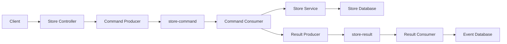
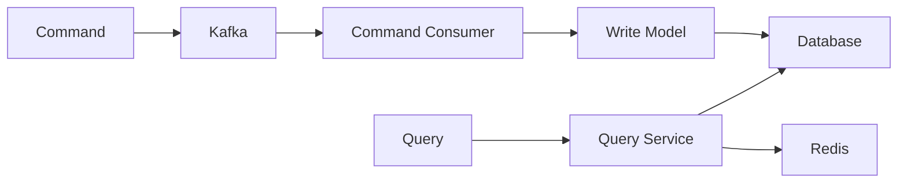
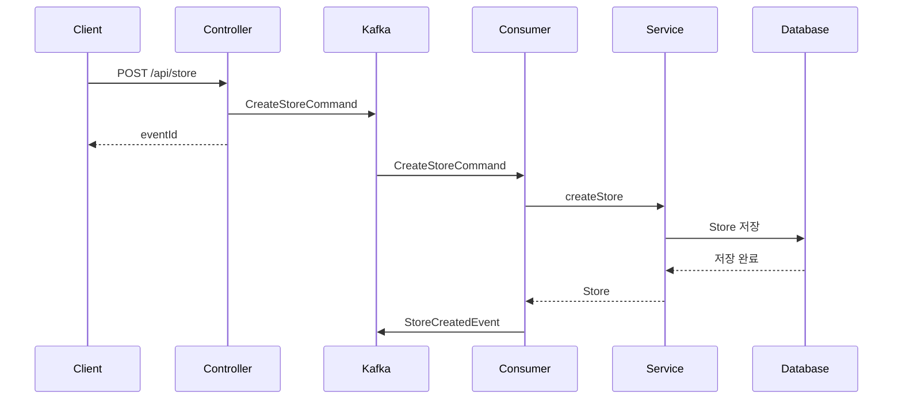
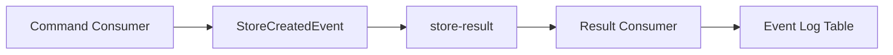
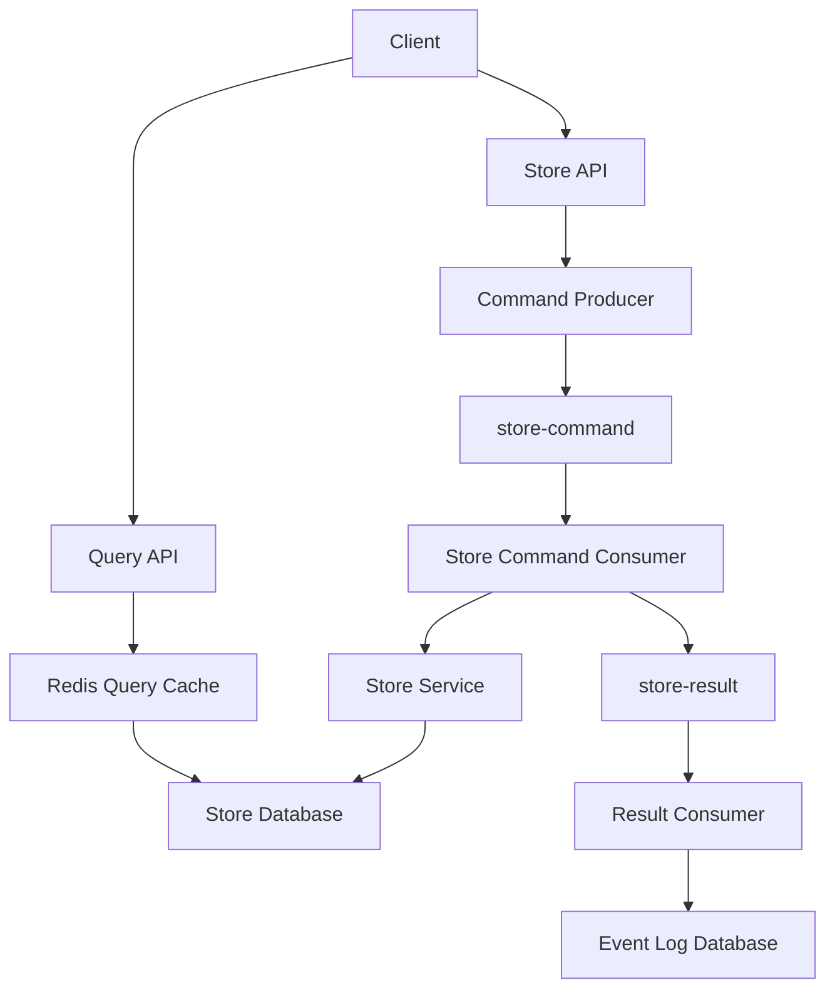
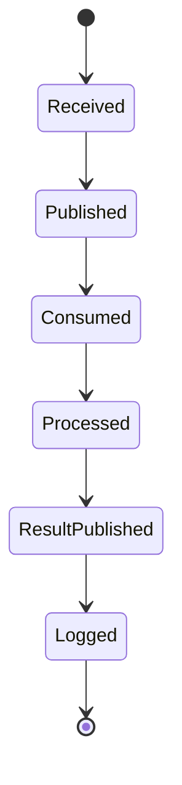
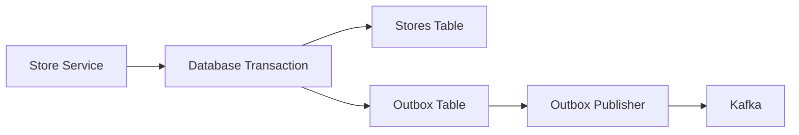

# Event Sourcing과 CQRS패턴이 적용된 서비스 만들기2

# Event Sourcing과 CQRS패턴이 적용된 서비스 만들기2

* toc
{:toc}

---

## Event Sourcing과 CQRS가 적용된 서비스 구현하기

Event Sourcing과 CQRS는 개념만 이해하는 것보다 실제 서비스 코드에 적용해 보는 과정이 중요하다.

가게 서비스를 예로 들면 가게 생성, 수정, 삭제 요청은 바로 데이터베이스에 반영하지 않고 Kafka Command Topic으로 전달한다. Consumer는 명령 이벤트를 읽어 실제 데이터를 변경하고, 처리 결과를 Result Event로 다시 발행한다.

조회는 별도의 Query 흐름으로 처리한다. 조회 요청은 데이터베이스나 Redis 캐시에서 데이터를 읽고, 변경 작업과 분리해 관리한다.



---

## 개념

### Command와 Query 분리

가게 생성, 수정, 삭제는 Command에 해당한다.

```text
Create Store
Update Store
Delete Store
```

가게 조회는 Query에 해당한다.

```text
Get Store
Get Store List
```

Command는 데이터 상태를 변경하므로 검증과 트랜잭션이 중요하다. Query는 데이터를 변경하지 않고 빠르게 반환하는 것이 중요하다.



### 이벤트의 역할

이벤트는 이미 발생한 사실을 표현한다.

```text
StoreCreated
StoreUpdated
StoreDeleted
```

명령은 요청을 표현한다.

```text
CreateStoreCommand
UpdateStoreCommand
DeleteStoreCommand
```

두 개념을 구분하면 다음과 같다.

| 구분 | 의미 | 예시 |
|---|---|---|
| Command | 무엇을 해 달라는 요청 | `CreateStoreCommand` |
| Event | 어떤 일이 발생했다는 사실 | `StoreCreatedEvent` |
| Query | 데이터를 조회하는 요청 | `GetStoreQuery` |
| Result | 처리 결과 | `StoreCreatedResult` |

### 이벤트 봉투

서로 다른 이벤트를 Kafka로 전달하려면 공통 메타데이터가 필요하다.

```java
public record EventEnvelope(
    String eventId,
    String eventType,
    String aggregateId,
    Object payload,
    long version,
    LocalDateTime occurredAt
) {
}
```

| 필드 | 의미 |
|---|---|
| `eventId` | 이벤트를 식별하는 고유 ID |
| `eventType` | 이벤트 종류 |
| `aggregateId` | 이벤트가 속한 도메인 객체 ID |
| `payload` | 이벤트 상세 데이터 |
| `version` | 이벤트 버전 |
| `occurredAt` | 이벤트 발생 시간 |

`eventId`는 중복 처리를 막을 때 사용한다. `aggregateId`는 특정 가게나 주문에 대한 이벤트를 묶을 때 사용한다.

---

## 왜 사용하는가?

### 변경 과정을 추적할 수 있다

일반적인 데이터베이스에는 현재 상태만 저장될 수 있다.

```text
storeName = "새로운 가게 이름"
```

Event Sourcing을 적용하면 변경 과정이 이벤트로 남는다.

```text
StoreCreated
StoreUpdated
StoreUpdated
StoreDeleted
```

따라서 데이터가 언제 어떻게 변경되었는지 확인할 수 있다.

### 장애 원인을 찾기 쉽다

Consumer에서 데이터 저장에 실패하거나 잘못된 이벤트가 발행되면 이벤트 로그를 기준으로 처리 과정을 확인할 수 있다.

```text
eventId
eventType
aggregateId
occurredAt
status
errorMessage
```

운영 환경에서는 로그만 남기는 것보다 이벤트 자체를 저장하는 것이 문제 분석에 유리하다.

### 읽기와 쓰기를 독립적으로 확장할 수 있다

상품 조회량이 많고 상품 변경 요청은 적다면 Query 모델을 여러 대로 확장할 수 있다.

```text
Write Service
→ 데이터 변경

Read Service
→ 조회 전용 모델과 Redis 캐시 사용
```

쓰기 모델과 조회 모델을 분리하면 조회 트래픽이 증가해도 데이터 변경 로직에 미치는 영향을 줄일 수 있다.

### 새로운 기능을 추가하기 쉽다

주문 생성 이벤트가 발행되면 여러 서비스가 독립적으로 사용할 수 있다.

```text
OrderCreatedEvent
├── Event Log Consumer
├── Notification Consumer
├── Statistics Consumer
└── Read Model Consumer
```

알림 기능을 추가하더라도 주문 서비스가 알림 서비스의 API를 직접 호출할 필요가 없다.

---

## 주요 특징

### 명령 처리 흐름

가게 생성 요청은 다음과 같이 처리할 수 있다.



Controller가 데이터베이스를 직접 변경하지 않는 것이 핵심이다.

```text
Controller
→ 명령 이벤트 발행

Command Consumer
→ 비즈니스 로직 실행
→ 데이터베이스 변경
→ 결과 이벤트 발행
```

### 결과 이벤트 처리

명령 처리 결과는 Result Topic으로 발행한다.



결과 이벤트는 다음 목적으로 활용할 수 있다.

- 이벤트 감사 로그
- 장애 추적
- 조회 모델 갱신
- 알림 발송
- 통계 계산
- 데이터 복구

### 최종적 일관성

명령 이벤트를 Kafka에 발행하고 Consumer가 나중에 처리하면 요청 시점과 데이터 반영 시점 사이에 차이가 발생할 수 있다.

```text
POST /api/store
→ eventId 반환
→ 아직 데이터베이스에는 데이터가 없음
→ Consumer 처리
→ 데이터베이스 저장 완료
```

이를 최종적 일관성이라고 한다.

따라서 비동기 명령 API는 `true`만 반환하기보다 처리 상태를 확인할 수 있는 요청 ID나 상태 API를 제공하는 것이 좋다.

---

## 예제

### 이벤트 객체

```java
public record CreateStoreEvent(
    String eventId,
    String storeId,
    String storeName,
    String ownerName,
    String address,
    String phoneNumber
) {
}
```

```java
public record UpdateStoreEvent(
    String eventId,
    String storeId,
    String storeName,
    String ownerName,
    String address,
    String phoneNumber
) {
}
```

```java
public record DeleteStoreEvent(
    String eventId,
    String storeId
) {
}
```

결과 이벤트는 처리 완료 후 발행한다.

```java
public record StoreCreatedEvent(
    String eventId,
    String storeId,
    String storeName
) {
}
```

```java
public record StoreUpdatedEvent(
    String eventId,
    String storeId,
    String storeName
) {
}
```

```java
public record StoreDeletedEvent(
    String eventId,
    String storeId
) {
}
```

### Store 엔티티

```java
@Entity
@Table(name = "stores")
@Getter
@Setter
@NoArgsConstructor
@AllArgsConstructor
@Builder
public class Store {

    @Id
    @GeneratedValue(
        strategy = GenerationType.IDENTITY
    )
    private Long id;

    @Column(
        unique = true,
        nullable = false
    )
    private String storeId;

    private String storeName;

    private String ownerName;

    private String address;

    private String phoneNumber;
}
```

```java
public interface StoreRepository
    extends JpaRepository<Store, Long> {

    Optional<Store> findByStoreId(String storeId);
}
```

### Store Controller

```java
@RestController
@RequestMapping("/api/store")
@RequiredArgsConstructor
public class StoreController {

    private final StoreEventProducer eventProducer;

    private final StoreService storeService;

    @PostMapping
    public String createStore(
        @RequestBody StoreDto dto
    ) {
        String eventId =
            UUID.randomUUID().toString();

        String storeId =
            UUID.randomUUID().toString();

        CreateStoreEvent event =
            new CreateStoreEvent(
                eventId,
                storeId,
                dto.getStoreName(),
                dto.getOwnerName(),
                dto.getAddress(),
                dto.getPhoneNumber()
            );

        eventProducer.sendCommandEvent(event);

        return eventId;
    }

    @GetMapping("/{storeId}")
    public Store getStore(
        @PathVariable("storeId") String storeId
    ) {
        return storeService.getStore(storeId);
    }

    @PutMapping("/{storeId}")
    public String updateStore(
        @PathVariable("storeId") String storeId,
        @RequestBody StoreDto dto
    ) {
        String eventId =
            UUID.randomUUID().toString();

        UpdateStoreEvent event =
            new UpdateStoreEvent(
                eventId,
                storeId,
                dto.getStoreName(),
                dto.getOwnerName(),
                dto.getAddress(),
                dto.getPhoneNumber()
            );

        eventProducer.sendCommandEvent(event);

        return eventId;
    }

    @DeleteMapping("/{storeId}")
    public String deleteStore(
        @PathVariable("storeId") String storeId
    ) {
        String eventId =
            UUID.randomUUID().toString();

        DeleteStoreEvent event =
            new DeleteStoreEvent(
                eventId,
                storeId
            );

        eventProducer.sendCommandEvent(event);

        return eventId;
    }
}
```

### Kafka Producer

```java
@Service
@RequiredArgsConstructor
public class StoreEventProducer {

    private static final String COMMAND_TOPIC =
        "store-command";

    private static final String RESULT_TOPIC =
        "store-result";

    private final KafkaTemplate<
        String,
        EventEnvelope
    > kafkaTemplate;

    public void sendCommandEvent(
        Object payload
    ) {
        String eventId =
            UUID.randomUUID().toString();

        String eventType =
            payload.getClass().getSimpleName();

        EventEnvelope event =
            new EventEnvelope(
                eventId,
                eventType,
                extractAggregateId(payload),
                payload,
                1L,
                LocalDateTime.now()
            );

        kafkaTemplate.send(
            COMMAND_TOPIC,
            event.getAggregateId(),
            event
        );
    }

    public void sendResultEvent(
        Object payload
    ) {
        String eventId =
            UUID.randomUUID().toString();

        String eventType =
            payload.getClass().getSimpleName();

        EventEnvelope event =
            new EventEnvelope(
                eventId,
                eventType,
                extractAggregateId(payload),
                payload,
                1L,
                LocalDateTime.now()
            );

        kafkaTemplate.send(
            RESULT_TOPIC,
            event.getAggregateId(),
            event
        );
    }

    private String extractAggregateId(
        Object payload
    ) {
        if (payload instanceof CreateStoreEvent event) {
            return event.storeId();
        }

        if (payload instanceof UpdateStoreEvent event) {
            return event.storeId();
        }

        if (payload instanceof DeleteStoreEvent event) {
            return event.storeId();
        }

        if (payload instanceof StoreCreatedEvent event) {
            return event.storeId();
        }

        if (payload instanceof StoreUpdatedEvent event) {
            return event.storeId();
        }

        if (payload instanceof StoreDeletedEvent event) {
            return event.storeId();
        }

        throw new IllegalArgumentException(
            "Unknown event payload"
        );
    }
}
```

실제 Avro를 사용하는 경우에는 `EventEnvelope`를 직접 정의하기보다 Avro로 생성된 이벤트 클래스를 사용하면 된다.

### Command Consumer

```java
@Service
@RequiredArgsConstructor
@Slf4j
public class StoreCommandConsumer {

    private final StoreService storeService;

    private final StoreEventProducer eventProducer;

    @KafkaListener(
        topics = "store-command",
        groupId = "store-command-group"
    )
    public void consume(
        EventEnvelope envelope
    ) {
        log.info(
            "Received command event: {}",
            envelope
        );

        Object payload =
            envelope.payload();

        if (payload instanceof CreateStoreEvent event) {
            handleCreate(event);
            return;
        }

        if (payload instanceof UpdateStoreEvent event) {
            handleUpdate(event);
            return;
        }

        if (payload instanceof DeleteStoreEvent event) {
            handleDelete(event);
            return;
        }

        log.warn(
            "Unknown command event: {}",
            envelope.eventType()
        );
    }

    private void handleCreate(
        CreateStoreEvent event
    ) {
        Store store =
            storeService.createStore(event);

        StoreCreatedEvent result =
            new StoreCreatedEvent(
                event.eventId(),
                store.getStoreId(),
                store.getStoreName()
            );

        eventProducer.sendResultEvent(result);
    }

    private void handleUpdate(
        UpdateStoreEvent event
    ) {
        Store store =
            storeService.updateStore(event);

        StoreUpdatedEvent result =
            new StoreUpdatedEvent(
                event.eventId(),
                store.getStoreId(),
                store.getStoreName()
            );

        eventProducer.sendResultEvent(result);
    }

    private void handleDelete(
        DeleteStoreEvent event
    ) {
        storeService.deleteStore(
            event.storeId()
        );

        StoreDeletedEvent result =
            new StoreDeletedEvent(
                event.eventId(),
                event.storeId()
            );

        eventProducer.sendResultEvent(result);
    }
}
```

### Store Service

```java
@Service
@RequiredArgsConstructor
public class StoreService {

    private static final String STORE_KEY_PREFIX =
        "store:";

    private final StoreRepository storeRepository;

    private final RedisTemplate<String, Object>
        redisTemplate;

    public Store createStore(
        CreateStoreEvent event
    ) {
        Store store =
            Store.builder()
                .storeId(event.storeId())
                .storeName(event.storeName())
                .ownerName(event.ownerName())
                .address(event.address())
                .phoneNumber(event.phoneNumber())
                .build();

        Store savedStore =
            storeRepository.saveAndFlush(store);

        String cacheKey =
            STORE_KEY_PREFIX
                + savedStore.getStoreId();

        redisTemplate.opsForValue().set(
            cacheKey,
            savedStore,
            1,
            TimeUnit.HOURS
        );

        return savedStore;
    }

    public Store updateStore(
        UpdateStoreEvent event
    ) {
        Store store =
            storeRepository.findByStoreId(
                event.storeId()
            ).orElseThrow(
                () -> new IllegalArgumentException(
                    "Store not found: "
                        + event.storeId()
                )
            );

        store.setStoreName(
            event.storeName()
        );

        store.setOwnerName(
            event.ownerName()
        );

        store.setAddress(
            event.address()
        );

        store.setPhoneNumber(
            event.phoneNumber()
        );

        Store savedStore =
            storeRepository.saveAndFlush(store);

        String cacheKey =
            STORE_KEY_PREFIX
                + savedStore.getStoreId();

        redisTemplate.opsForValue().set(
            cacheKey,
            savedStore,
            1,
            TimeUnit.HOURS
        );

        return savedStore;
    }

    public void deleteStore(
        String storeId
    ) {
        Store store =
            storeRepository.findByStoreId(storeId)
                .orElseThrow(
                    () -> new IllegalArgumentException(
                        "Store not found: " + storeId
                    )
                );

        storeRepository.delete(store);

        String cacheKey =
            STORE_KEY_PREFIX + storeId;

        redisTemplate.delete(cacheKey);
    }

    public Store getStore(
        String storeId
    ) {
        String cacheKey =
            STORE_KEY_PREFIX + storeId;

        Object cached =
            redisTemplate.opsForValue()
                .get(cacheKey);

        if (cached instanceof Store store) {
            return store;
        }

        Store store =
            storeRepository.findByStoreId(storeId)
                .orElseThrow(
                    () -> new IllegalArgumentException(
                        "Store not found: " + storeId
                    )
                );

        redisTemplate.opsForValue().set(
            cacheKey,
            store,
            1,
            TimeUnit.HOURS
        );

        return store;
    }
}
```

### Result Consumer

```java
@Service
@RequiredArgsConstructor
@Slf4j
public class StoreResultConsumer {

    private final EventRepository eventRepository;

    @KafkaListener(
        topics = "store-result",
        groupId = "store-result-group"
    )
    public void consume(
        EventEnvelope envelope
    ) {
        log.info(
            "Received result event: {}",
            envelope
        );

        EventEntity entity =
            EventEntity.builder()
                .eventId(envelope.eventId())
                .eventType(envelope.eventType())
                .aggregateId(
                    envelope.aggregateId()
                )
                .payload(
                    String.valueOf(
                        envelope.payload()
                    )
                )
                .eventTime(
                    envelope.occurredAt()
                )
                .status("SUCCESS")
                .build();

        eventRepository.save(entity);
    }
}
```

이벤트 로그 테이블에는 중복 이벤트 방지를 위해 `eventId`에 고유 제약 조건을 설정하는 것이 좋다.

```java
@Entity
@Table(
    name = "events",
    uniqueConstraints = {
        @UniqueConstraint(
            name = "uk_event_id",
            columnNames = "eventId"
        )
    }
)
@Getter
@Setter
@NoArgsConstructor
@AllArgsConstructor
@Builder
public class EventEntity {

    @Id
    @GeneratedValue(
        strategy = GenerationType.IDENTITY
    )
    private Long id;

    @Column(
        nullable = false,
        unique = true
    )
    private String eventId;

    @Column(nullable = false)
    private String eventType;

    @Column(nullable = false)
    private String aggregateId;

    @Column(columnDefinition = "TEXT")
    private String payload;

    private LocalDateTime eventTime;

    private String status;
}
```

---

## 구조

전체 처리 구조는 다음과 같다.



명령 이벤트의 생명주기는 다음과 같다.



### Store 생성 요청

```bash
curl -X POST http://localhost:8080/api/store \
  -H "Content-Type: application/json" \
  -d "{\"storeName\":\"테스트 가게\",\"ownerName\":\"홍길동\",\"address\":\"서울\",\"phoneNumber\":\"010-0000-0000\"}"
```

응답 예시는 다음과 같다.

```text
7f7f3d47-9f1d-4f28-9ea6-7bb0d6d0f001
```

이 값은 가게가 데이터베이스에 저장되었다는 의미가 아니라, 명령 이벤트를 추적하기 위한 요청 ID이다.

Consumer 로그는 다음과 같이 확인할 수 있다.

```text
Received command event: CreateStoreEvent
Created store: store-1001
Published result event: StoreCreatedEvent
```

조회는 다음과 같이 수행한다.

```bash
curl http://localhost:8080/api/store/store-1001
```

응답 예시는 다음과 같다.

```json
{
  "storeId": "store-1001",
  "storeName": "테스트 가게",
  "ownerName": "홍길동",
  "address": "서울",
  "phoneNumber": "010-0000-0000"
}
```

---

## 실무에서의 활용

### 이벤트 중복 처리

Kafka Consumer는 메시지를 처리한 뒤 Offset을 커밋하기 전에 장애가 발생할 수 있다.

```text
이벤트 처리 성공
→ Offset 커밋 전에 장애
→ 같은 이벤트 재수신
```

따라서 Consumer는 같은 이벤트가 다시 들어와도 문제가 발생하지 않도록 구현해야 한다.

```java
if (eventRepository.existsByEventId(
    envelope.eventId()
)) {
    return;
}
```

이벤트 ID를 기준으로 이미 처리한 이벤트인지 확인하면 중복 로그와 중복 작업을 줄일 수 있다.

### 이벤트 처리 실패

Consumer에서 예외가 발생하면 이벤트를 잃어버리지 않도록 해야 한다.

```text
Consumer 처리 실패
→ 재시도
→ 계속 실패
→ Dead Letter Topic 저장
```

실패한 이벤트에는 오류 메시지를 저장하는 것이 좋다.

```java
EventEntity failedEvent =
    EventEntity.builder()
        .eventId(envelope.eventId())
        .eventType(envelope.eventType())
        .aggregateId(envelope.aggregateId())
        .payload(
            String.valueOf(
                envelope.payload()
            )
        )
        .eventTime(
            envelope.occurredAt()
        )
        .status("FAILED")
        .build();
```

운영자는 실패 이벤트를 확인한 뒤 원인을 해결하고 다시 처리할 수 있어야 한다.

### 이벤트 순서

같은 가게의 생성과 수정 이벤트 순서가 바뀌면 잘못된 상태가 저장될 수 있다.

```text
StoreCreated
StoreUpdated
```

위 순서는 정상이다.

```text
StoreUpdated
StoreCreated
```

이 순서로 처리되면 문제가 발생할 수 있다.

Kafka는 파티션 단위로 순서를 보장하므로 `aggregateId`를 메시지 키로 사용하는 것이 좋다.

```java
kafkaTemplate.send(
    "store-command",
    event.storeId(),
    event
);
```

같은 `storeId`를 가진 이벤트가 같은 파티션에 들어가면 해당 가게에 대한 이벤트 순서를 유지하는 데 도움이 된다.

### Outbox Pattern

데이터베이스 저장과 Kafka 발행 사이에는 다음과 같은 문제가 발생할 수 있다.

```text
DB 저장 성공
Kafka 발행 실패
```

이를 보완하려면 Outbox 테이블을 사용할 수 있다.



가게 데이터와 이벤트를 같은 데이터베이스 트랜잭션으로 저장한 뒤, 별도의 Publisher가 Outbox 이벤트를 Kafka로 발행한다.

### 캐시 일관성

가게 수정이 완료되면 Redis에 저장된 기존 데이터를 삭제하거나 갱신해야 한다.

```text
DB 수정
→ Redis 캐시 갱신
→ 다른 서버 로컬 캐시 무효화
```

여러 서버가 Caffeine 같은 로컬 캐시를 사용한다면 Redis Pub/Sub으로 캐시 무효화 메시지를 발행해야 한다.

```json
{
  "eventType": "CACHE_INVALIDATED",
  "cacheKey": "store:store-1001"
}
```

캐시가 오래된 데이터를 반환하지 않도록 수정, 삭제 이벤트와 캐시 처리의 관계를 명확하게 정의해야 한다.

### Event Sourcing의 범위

Event Sourcing은 모든 데이터에 적용할 필요가 없다.

다음 데이터는 Event Sourcing과 잘 어울린다.

- 주문 상태
- 결제 상태
- 재고 변경
- 금융 거래
- 감사 로그

반면 단순한 캐시나 방문 횟수까지 이벤트로 관리하면 저장해야 할 이벤트가 지나치게 많아질 수 있다.

| 데이터 | 적합한 방식 |
|---|---|
| 주문 상태 변경 | Event Sourcing 고려 |
| 재고 변동 | Event Sourcing 고려 |
| 상품 상세 캐시 | Redis |
| 최근 검색어 | Redis List |
| 좋아요 사용자 | Redis Set |
| 일일 방문자 수 | Redis Counter 또는 HyperLogLog |

### 이벤트와 데이터베이스의 관계

이벤트 로그를 저장하는 구조와 완전한 Event Sourcing은 구분해야 한다.

```text
Database가 원본
→ 변경 결과를 이벤트로 기록
```

이 구조는 감사 로그와 이벤트 추적에 적합하다.

```text
Event가 원본
→ 이벤트 재생
→ 현재 상태 복원
```

이 구조가 완전한 Event Sourcing이다.

현재 상태를 데이터베이스에 저장하면서 이벤트도 함께 기록하는 방식을 사용한다면, 이벤트 로그를 통한 복구가 실제로 가능한지 별도로 검증해야 한다.

---

## 정리

Event Sourcing과 CQRS를 적용한 서비스에서는 명령 처리와 조회 처리를 분리한다.

가게 생성, 수정, 삭제 요청은 Kafka Command Topic으로 전달하고, Command Consumer가 실제 데이터베이스 변경을 수행한다. 처리 결과는 Result Event로 다시 발행해 이벤트 로그 저장, 알림, 통계, 조회 모델 갱신에 사용할 수 있다.

조회 요청은 데이터베이스나 Redis에서 처리하며, 조회가 많은 데이터는 Redis 캐시를 활용해 응답 속도를 높일 수 있다.

구현할 때는 다음 항목이 중요하다.

- Command와 Event를 구분한다.
- 이벤트마다 고유한 `eventId`를 부여한다.
- 같은 Aggregate의 이벤트에는 동일한 메시지 키를 사용한다.
- Consumer 중복 처리를 방지한다.
- 실패 이벤트를 재처리할 수 있도록 구성한다.
- 이벤트 스키마 변경을 고려한다.
- 비동기 처리에 따른 최종적 일관성을 이해한다.
- 데이터베이스와 Kafka 발행 사이의 유실을 Outbox Pattern으로 보완한다.
- 이벤트 로그와 완전한 Event Sourcing을 구분한다.

Kafka를 사용하면 서비스 간 결합도를 낮출 수 있고, Redis를 사용하면 조회 성능과 캐시 활용도를 높일 수 있다. 하지만 메시지 중복, 처리 실패, 순서 보장, 캐시 불일치까지 함께 설계해야 안정적인 분산 서비스를 만들 수 있다.

---

### 한 줄 요약

Event Sourcing과 CQRS는 명령을 이벤트로 기록하고 조회와 쓰기를 분리해 변경 이력, 확장성, 장애 추적성을 높이는 설계 방식이다.
