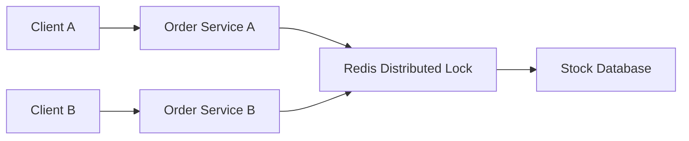
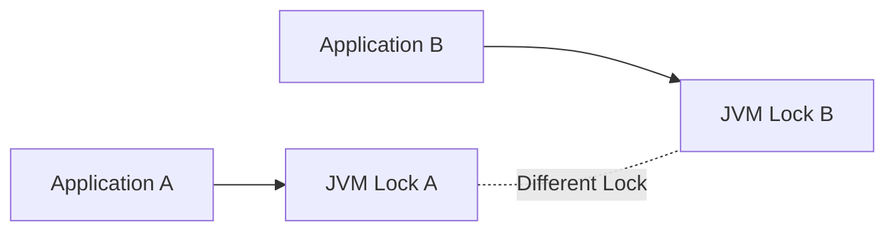
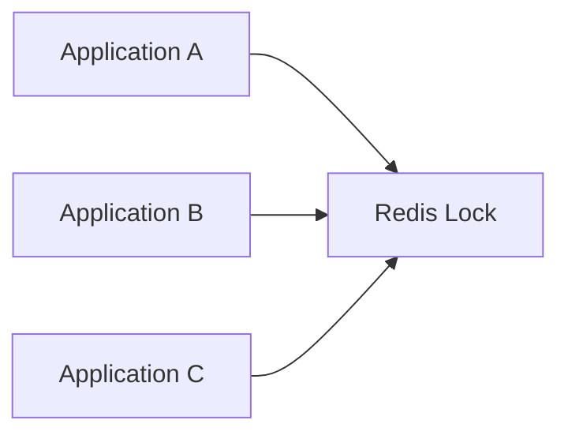
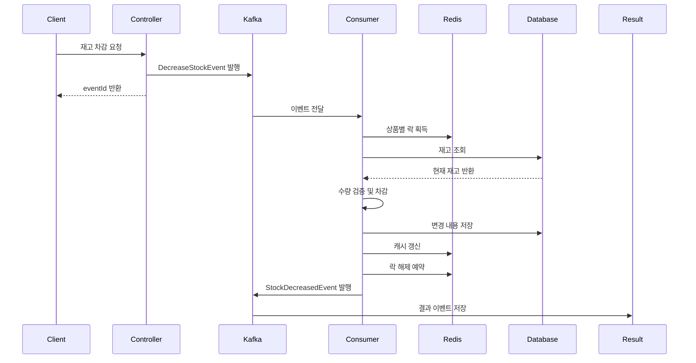
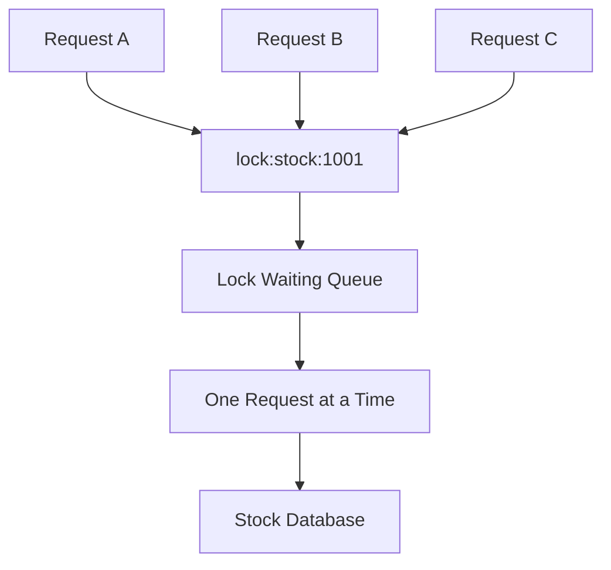
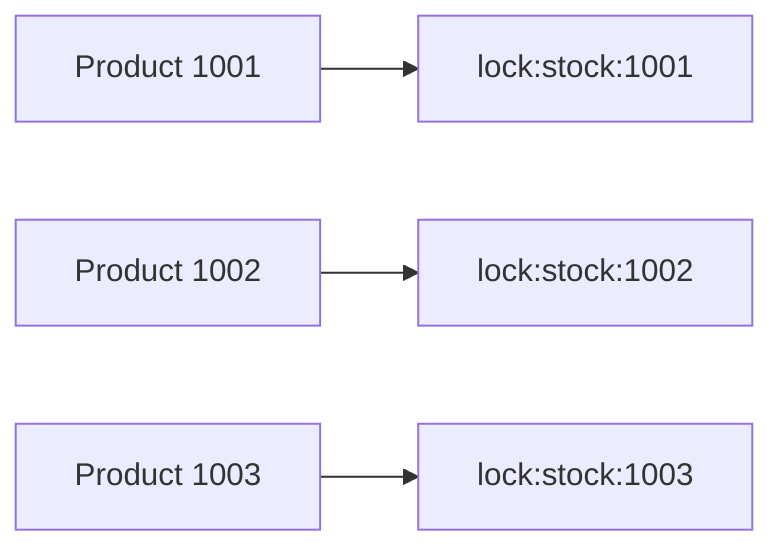
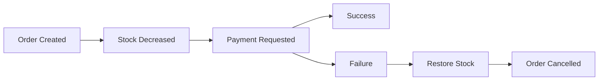

# 분산락을 활용해 재고관리 서비스 구현하기(Redis)

# 분산락을 활용해 재고관리 서비스 구현하기(Redis)

* toc
{:toc}

---

## Redis 분산 락으로 재고 관리 서비스 구현하기

이커머스에서 재고 관리는 동시성 문제가 가장 쉽게 발생하는 영역이다.

재고가 1개 남은 상품에 두 명의 사용자가 동시에 주문하면 두 요청이 모두 재고를 확인하고 주문에 성공하는 상황이 발생할 수 있다.

```text
현재 재고: 1

요청 A: 재고 조회 → 1
요청 B: 재고 조회 → 1

요청 A: 주문 성공
요청 B: 주문 성공
```

이렇게 되면 실제 재고보다 많은 주문이 접수된다. 이를 초과 판매 또는 재고 불일치라고 한다.

Redis의 분산 락을 사용하면 여러 애플리케이션 서버가 하나의 공유 락을 기준으로 재고 차감 작업을 순서대로 처리할 수 있다.



---

## 개념

### 분산 락이란?

분산 락은 여러 서버에서 실행되는 작업 중 특정 작업을 한 번에 하나의 서버만 수행하도록 제어하는 기능이다.

일반적인 `synchronized`는 하나의 JVM 안에서만 동작한다.

```java
synchronized (this) {
    decreaseStock();
}
```

서버가 한 대라면 동작할 수 있지만, 서버가 여러 대라면 각각의 JVM이 별도 락을 가지게 된다.



이 경우 Server A와 Server B가 동시에 재고를 수정할 수 있다.

Redis 분산 락은 모든 서버가 같은 Redis에 접근해 하나의 락을 공유한다.



### 재고 차감에서 분산 락이 필요한 이유

재고 차감은 다음 세 단계가 하나의 작업처럼 처리되어야 한다.

```text
재고 조회
→ 재고가 충분한지 확인
→ 재고 차감
```

이 세 작업 사이에 다른 요청이 끼어들면 문제가 발생한다.

```text
재고: 1

요청 A가 재고 1 조회
요청 B가 재고 1 조회

요청 A가 재고 차감
요청 B도 재고 차감
```

분산 락을 사용하면 다음과 같이 처리된다.

```text
요청 A가 락 획득
→ 재고 조회
→ 재고 차감
→ 트랜잭션 커밋
→ 락 해제

요청 B가 락 획득
→ 재고 조회
→ 재고 부족 확인
→ 주문 실패
```

### Redisson

Redisson은 Redis를 Java 객체처럼 사용할 수 있게 해주는 클라이언트이다.

분산 락은 `RLock`으로 사용할 수 있다.

```java
RLock lock =
    redissonClient.getLock("lock:stock:1001");

lock.lock();

try {
    decreaseStock();
} finally {
    lock.unlock();
}
```

`RLock`은 다음과 같은 기능을 제공한다.

- 락 획득
- 락 대기 시간 설정
- 락 보유 시간 설정
- 현재 스레드가 락을 보유하고 있는지 확인
- 재진입 락
- 자동 만료
- 공정 락과 읽기·쓰기 락

---

## 왜 사용하는가?

### 여러 애플리케이션 서버의 동시 수정 방지

서비스가 여러 대로 실행되면 같은 상품에 대한 요청이 서로 다른 서버로 전달될 수 있다.

```text
사용자 A → Application A
사용자 B → Application B
사용자 C → Application C
```

Redis 분산 락을 사용하면 서버가 달라도 같은 상품의 재고 차감은 순서대로 처리된다.

### 재고 데이터의 일관성 유지

재고 차감 로직 전체를 락으로 감싸면 재고 확인과 차감 사이의 경쟁 상태를 방지할 수 있다.

### 재고 처리 로직을 공통화할 수 있다

어노테이션과 AOP를 사용하면 여러 서비스 메서드에 분산 락을 반복해서 작성하지 않아도 된다.

```java
@RedissonLock(
    value = "#stock:{event.stockId()}",
    waitTime = 5000L,
    leaseTime = 10000L
)
public Stock decreaseStock(
    DecreaseStockEvent event
) {
    return stockRepository.decrease(
        event.stockId(),
        event.quantity()
    );
}
```

---

## 주요 특징

### 락 키는 상품별로 분리해야 한다

모든 재고에 같은 락 키를 사용하면 서로 다른 상품의 주문까지 모두 대기하게 된다.

```text
lock:stock
```

이렇게 사용하면 상품 A와 상품 B의 재고 차감도 동시에 처리되지 않는다.

```text
lock:stock:product-1001
lock:stock:product-1002
```

상품별로 락 키를 분리하면 서로 다른 상품은 동시에 처리할 수 있다.

| 락 키 | 보호 대상 |
|---|---|
| `lock:stock:1001` | 1001번 상품 재고 |
| `lock:stock:1002` | 1002번 상품 재고 |
| `lock:stock:1003` | 1003번 상품 재고 |

### 락 대기 시간

락을 다른 요청이 사용 중일 때 얼마나 기다릴지 설정할 수 있다.

```java
lock.tryLock(
    5,
    10,
    TimeUnit.SECONDS
);
```

| 인자 | 의미 |
|---|---|
| `5` | 최대 5초 동안 락 획득 대기 |
| `10` | 락을 획득한 뒤 최대 10초 동안 유지 |
| `TimeUnit.SECONDS` | 시간 단위 |

대기 시간이 너무 짧으면 정상적인 요청도 실패할 수 있다. 반대로 너무 길면 사용자가 오랫동안 응답을 기다리게 된다.

### Lease Time

Lease Time은 락을 획득한 뒤 락을 유지하는 최대 시간이다.

```text
락 획득
→ 최대 10초 동안 락 유지
→ 10초가 지나면 자동 해제
```

애플리케이션이 락을 획득한 뒤 비정상 종료되더라도 영원히 락이 남지 않도록 하는 역할을 한다.

Lease Time을 실제 작업 시간보다 짧게 설정하면 문제가 발생할 수 있다.

```text
Lease Time: 2초
실제 DB 작업: 5초

2초 후 락 자동 해제
→ 다른 요청이 진입
→ 기존 요청과 동시에 재고 수정
```

실제 처리 시간이 일정하지 않다면 Redisson의 Watchdog 기능을 활용하거나 충분한 Lease Time을 설정해야 한다.

### 락 해제는 반드시 보장해야 한다

락을 획득한 뒤 예외가 발생해도 락을 해제해야 한다.

```java
boolean locked = false;

try {
    locked = lock.tryLock(
        5,
        10,
        TimeUnit.SECONDS
    );

    if (!locked) {
        throw new IllegalStateException(
            "락을 획득하지 못했습니다."
        );
    }

    decreaseStock();
} finally {
    if (
        locked
        && lock.isHeldByCurrentThread()
    ) {
        lock.unlock();
    }
}
```

다른 스레드가 획득한 락을 해제하면 안 되므로 `isHeldByCurrentThread()`를 확인해야 한다.

### 트랜잭션 커밋 이후 락 해제

재고 데이터베이스 트랜잭션이 아직 커밋되지 않았는데 락을 먼저 해제하면 문제가 발생할 수 있다.

```text
락 해제
→ 다른 요청이 락 획득
→ 이전 트랜잭션은 아직 커밋되지 않음
→ 다른 요청이 오래된 재고 조회
```

따라서 데이터베이스 트랜잭션이 완료된 뒤 락을 해제하는 것이 안전하다.

---

## 예제

### Gradle 설정

```groovy
plugins {
    id 'org.springframework.boot'

    id 'com.github.davidmc24.gradle.plugin.avro' version '1.9.1'
}

springBoot {
    mainClass.set('com.example.StockApplication')
}

bootJar {
    archiveFileName = 'service-stock.jar'
}

generateAvroJava {
    source('src/main/resources/avro')
    include('**/*.avsc')
}

repositories {
    mavenCentral()

    maven {
        url 'https://packages.confluent.io/maven/'
    }
}

dependencies {
    implementation 'org.springframework.boot:spring-boot-starter-web'
    implementation 'org.springframework.boot:spring-boot-starter-data-jpa'
    implementation 'org.springframework.boot:spring-boot-starter-data-redis'
    implementation 'org.springframework.boot:spring-boot-starter-aop'
    implementation 'org.springframework.boot:spring-boot-starter-security'

    runtimeOnly 'com.mysql:mysql-connector-j'

    implementation 'org.springframework.kafka:spring-kafka'
    implementation 'io.lettuce:lettuce-core'
    implementation 'org.redisson:redisson-spring-boot-starter:3.27.0'

    implementation 'io.confluent:kafka-avro-serializer:7.8.0'
    implementation 'org.apache.avro:avro:1.12.0'

    compileOnly 'org.projectlombok:lombok'
    annotationProcessor 'org.projectlombok:lombok'

    testImplementation 'org.springframework.boot:spring-boot-starter-test'
}
```

분산 락을 AOP로 처리하려면 `spring-boot-starter-aop`가 필요하다.

| 의존성 | 역할 |
|---|---|
| `spring-boot-starter-data-jpa` | 재고 데이터베이스 처리 |
| `spring-boot-starter-data-redis` | Redis 캐시와 Redis 연결 |
| `spring-boot-starter-aop` | 분산 락 어노테이션 처리 |
| `redisson-spring-boot-starter` | Redis 기반 분산 락 |
| `spring-kafka` | 재고 명령과 결과 이벤트 처리 |
| `mysql-connector-j` | MySQL 연결 |
| `kafka-avro-serializer` | Avro 이벤트 직렬화 |

### 재고 DTO

```java
package com.example.stock.dto;

import lombok.AllArgsConstructor;
import lombok.Data;

@Data
@AllArgsConstructor
public class StockDto {

    private String stockId;

    private String storeId;

    private String productId;

    private Long stock;
}
```

### 재고 엔티티

```java
package com.example.stock.entity;

import jakarta.persistence.Column;
import jakarta.persistence.Entity;
import jakarta.persistence.GeneratedValue;
import jakarta.persistence.GenerationType;
import jakarta.persistence.Id;
import jakarta.persistence.Table;

import java.io.Serializable;

import lombok.AllArgsConstructor;
import lombok.Builder;
import lombok.Getter;
import lombok.NoArgsConstructor;
import lombok.Setter;
import lombok.ToString;

@Entity
@Table(name = "stocks")
@Getter
@Setter
@NoArgsConstructor
@AllArgsConstructor
@Builder
@ToString
public class Stock implements Serializable {

    @Id
    @GeneratedValue(
        strategy = GenerationType.IDENTITY
    )
    private Long id;

    @Column(
        unique = true,
        nullable = false
    )
    private String stockId;

    private String storeId;

    private String productId;

    private long stock;

    public boolean decrease(
        long quantity
    ) {
        if (quantity <= 0) {
            return false;
        }

        if (stock < quantity) {
            return false;
        }

        stock -= quantity;

        return true;
    }
}
```

`quantity`가 0 이하이면 재고가 증가하는 잘못된 요청이 될 수 있으므로 검증해야 한다.

```text
재고 10
차감 수량 -3
→ 재고가 13이 되는 오류 가능
```

### Repository

```java
package com.example.stock.repository;

import com.example.stock.entity.Stock;

import java.util.Optional;

import org.springframework.data.jpa.repository.JpaRepository;

public interface StockRepository
    extends JpaRepository<Stock, Long> {

    Optional<Stock> findByStockId(
        String stockId
    );
}
```

### 분산 락 어노테이션

```java
package com.example.annotations;

import java.lang.annotation.Documented;
import java.lang.annotation.ElementType;
import java.lang.annotation.Retention;
import java.lang.annotation.RetentionPolicy;
import java.lang.annotation.Target;

@Target(ElementType.METHOD)
@Retention(RetentionPolicy.RUNTIME)
@Documented
public @interface RedissonLock {

    String value();

    long waitTime() default 5000L;

    long leaseTime() default 10000L;
}
```

`value`는 락의 이름 또는 락 키를 표현한다.

```java
@RedissonLock(
    value = "lock:stock:1001"
)
```

하지만 상품 ID가 동적으로 결정되는 경우에는 고정 문자열을 사용할 수 없다.

```java
@RedissonLock(
    value = "lock:stock"
)
```

위와 같이 작성하면 모든 상품이 하나의 락을 공유하게 된다.

또한 다음처럼 작성해도 AOP에서 SpEL을 해석하지 않는다면 문자열 그대로 사용된다.

```java
@RedissonLock(
    value = "#stock-{event.stockId()}"
)
```

따라서 동적 키를 사용하려면 AOP에서 SpEL을 직접 해석해야 한다.

### Redisson Lock Aspect

```java
package com.example.aop;

import com.example.annotations.RedissonLock;

import java.lang.reflect.Method;
import java.util.concurrent.TimeUnit;

import lombok.RequiredArgsConstructor;
import lombok.extern.slf4j.Slf4j;

import org.aspectj.lang.ProceedingJoinPoint;
import org.aspectj.lang.annotation.Around;
import org.aspectj.lang.annotation.Aspect;
import org.aspectj.lang.reflect.MethodSignature;

import org.redisson.api.RLock;
import org.redisson.api.RedissonClient;

import org.springframework.context.expression.MethodBasedEvaluationContext;
import org.springframework.core.DefaultParameterNameDiscoverer;
import org.springframework.expression.ExpressionParser;
import org.springframework.expression.spel.standard.SpelExpressionParser;
import org.springframework.stereotype.Component;
import org.springframework.transaction.support.TransactionSynchronization;
import org.springframework.transaction.support.TransactionSynchronizationManager;

@Slf4j
@Aspect
@Component
@RequiredArgsConstructor
public class RedissonLockAspect {

    private final RedissonClient redissonClient;

    private final ExpressionParser expressionParser =
        new SpelExpressionParser();

    private final DefaultParameterNameDiscoverer
        parameterNameDiscoverer =
            new DefaultParameterNameDiscoverer();

    @Around(
        "@annotation(com.example.annotations.RedissonLock)"
    )
    public Object redissonLock(
        ProceedingJoinPoint joinPoint
    ) throws Throwable {
        MethodSignature signature =
            (MethodSignature) joinPoint.getSignature();

        Method method =
            signature.getMethod();

        RedissonLock annotation =
            method.getAnnotation(
                RedissonLock.class
            );

        String lockKey =
            resolveLockKey(
                annotation.value(),
                joinPoint
            );

        RLock lock =
            redissonClient.getLock(lockKey);

        boolean locked = false;

        try {
            locked = lock.tryLock(
                annotation.waitTime(),
                annotation.leaseTime(),
                TimeUnit.MILLISECONDS
            );

            log.info(
                "Lock name={}, locked={}, acquired={}",
                lock.getName(),
                lock.isLocked(),
                locked
            );

            if (!locked) {
                throw new IllegalStateException(
                    "Could not acquire lock: "
                        + lockKey
                );
            }

            if (
                TransactionSynchronizationManager
                    .isSynchronizationActive()
            ) {
                registerUnlockAfterTransaction(
                    lock,
                    lockKey
                );
            }

            return joinPoint.proceed();
        } finally {
            if (
                !TransactionSynchronizationManager
                    .isSynchronizationActive()
                && locked
                && lock.isHeldByCurrentThread()
            ) {
                lock.unlock();

                log.info(
                    "Lock released outside transaction: {}",
                    lockKey
                );
            }
        }
    }

    private String resolveLockKey(
        String expression,
        ProceedingJoinPoint joinPoint
    ) {
        MethodSignature signature =
            (MethodSignature) joinPoint.getSignature();

        Method method =
            signature.getMethod();

        MethodBasedEvaluationContext context =
            new MethodBasedEvaluationContext(
                null,
                method,
                joinPoint.getArgs(),
                parameterNameDiscoverer
            );

        String resolved =
            expressionParser
                .parseExpression(expression)
                .getValue(
                    context,
                    String.class
                );

        if (resolved == null) {
            throw new IllegalArgumentException(
                "Lock key cannot be null"
            );
        }

        return resolved;
    }

    private void registerUnlockAfterTransaction(
        RLock lock,
        String lockKey
    ) {
        TransactionSynchronizationManager
            .registerSynchronization(
                new TransactionSynchronization() {
                    @Override
                    public void afterCompletion(
                        int status
                    ) {
                        if (
                            lock.isHeldByCurrentThread()
                        ) {
                            lock.unlock();

                            log.info(
                                "Lock released after transaction: {}",
                                lockKey
                            );
                        }
                    }
                }
            );
    }
}
```

이 Aspect에서는 어노테이션의 값을 SpEL 표현식으로 해석한다.

```java
@RedissonLock(
    value = "'lock:stock:' + #event.stockId()",
    waitTime = 5000L,
    leaseTime = 10000L
)
```

이벤트가 Java Bean이라면 다음처럼 작성할 수 있다.

```java
@RedissonLock(
    value = "'lock:stock:' + #event.stockId",
    waitTime = 5000L,
    leaseTime = 10000L
)
```

핵심은 락 키가 실제 상품별로 생성되는지 확인하는 것이다.

```text
상품 1001
→ lock:stock:1001

상품 1002
→ lock:stock:1002
```

### Stock Service

```java
package com.example.stock.service;

import com.example.annotations.RedissonLock;
import com.example.cache.CachePublisher;
import com.example.kafka.CreateStockEvent;
import com.example.kafka.DecreaseStockEvent;
import com.example.kafka.UpdateStockEvent;
import com.example.stock.entity.Stock;
import com.example.stock.repository.StockRepository;

import java.util.concurrent.TimeUnit;

import jakarta.transaction.Transactional;

import lombok.RequiredArgsConstructor;
import lombok.extern.slf4j.Slf4j;

import org.springframework.data.redis.core.RedisTemplate;
import org.springframework.stereotype.Service;

@Service
@RequiredArgsConstructor
@Slf4j
public class StockService {

    private static final String STOCK_KEY_PREFIX =
        "stock:";

    private final StockRepository stockRepository;

    private final RedisTemplate<String, Object>
        redisTemplate;

    private final Cache<String, Object> localCache;

    private final CachePublisher cachePublisher;

    public Stock createStock(
        CreateStockEvent event
    ) {
        Stock stock =
            Stock.builder()
                .stockId(event.getStockId())
                .storeId(event.getStoreId())
                .productId(event.getProductId())
                .stock(event.getStock())
                .build();

        Stock savedStock =
            stockRepository.saveAndFlush(stock);

        String cacheKey =
            STOCK_KEY_PREFIX
                + savedStock.getStockId();

        redisTemplate.opsForValue().set(
            cacheKey,
            savedStock,
            1,
            TimeUnit.HOURS
        );

        localCache.put(
            cacheKey,
            savedStock
        );

        return savedStock;
    }

    public Stock getStock(
        String stockId
    ) {
        String cacheKey =
            STOCK_KEY_PREFIX + stockId;

        Object localValue =
            localCache.getIfPresent(cacheKey);

        if (localValue instanceof Stock stock) {
            return stock;
        }

        Object redisValue =
            redisTemplate.opsForValue()
                .get(cacheKey);

        if (redisValue instanceof Stock stock) {
            localCache.put(
                cacheKey,
                stock
            );

            return stock;
        }

        Stock databaseStock =
            stockRepository.findByStockId(stockId)
                .orElseThrow(
                    () -> new IllegalArgumentException(
                        "Stock not found: " + stockId
                    )
                );

        redisTemplate.opsForValue().set(
            cacheKey,
            databaseStock,
            1,
            TimeUnit.HOURS
        );

        localCache.put(
            cacheKey,
            databaseStock
        );

        return databaseStock;
    }

    public Stock updateStock(
        UpdateStockEvent event
    ) {
        Stock stock =
            stockRepository.findByStockId(
                event.getStockId()
            ).orElseThrow(
                () -> new IllegalArgumentException(
                    "Stock not found: "
                        + event.getStockId()
                )
            );

        stock.setStoreId(
            event.getStoreId()
        );

        stock.setProductId(
            event.getProductId()
        );

        stock.setStock(
            event.getStock()
        );

        Stock savedStock =
            stockRepository.saveAndFlush(stock);

        String cacheKey =
            STOCK_KEY_PREFIX
                + savedStock.getStockId();

        redisTemplate.opsForValue().set(
            cacheKey,
            savedStock,
            1,
            TimeUnit.HOURS
        );

        localCache.put(
            cacheKey,
            savedStock
        );

        cachePublisher.publish(
            "cache-sync",
            "Updated stock-" + cacheKey
        );

        return savedStock;
    }

    @Transactional
    @RedissonLock(
        value = "'lock:stock:' + #event.stockId",
        waitTime = 5000L,
        leaseTime = 10000L
    )
    public Stock decreaseStock(
        DecreaseStockEvent event
    ) {
        String stockId =
            event.getStockId();

        long quantity =
            event.getQuantity();

        if (quantity <= 0) {
            throw new IllegalArgumentException(
                "Quantity must be greater than zero"
            );
        }

        Stock stock =
            stockRepository.findByStockId(stockId)
                .orElseThrow(
                    () -> new IllegalArgumentException(
                        "Stock not found: " + stockId
                    )
                );

        boolean decreased =
            stock.decrease(quantity);

        if (!decreased) {
            throw new IllegalStateException(
                "The quantity is larger than the stock: "
                    + stock.getStock()
            );
        }

        Stock savedStock =
            stockRepository.saveAndFlush(stock);

        String cacheKey =
            STOCK_KEY_PREFIX + stockId;

        redisTemplate.opsForValue().set(
            cacheKey,
            savedStock,
            1,
            TimeUnit.HOURS
        );

        localCache.put(
            cacheKey,
            savedStock
        );

        cachePublisher.publish(
            "cache-sync",
            "Updated stock-" + cacheKey
        );

        log.info(
            "Stock decreased. stockId={}, quantity={}, remaining={}",
            stockId,
            quantity,
            savedStock.getStock()
        );

        return savedStock;
    }

    public void deleteStock(
        String stockId
    ) {
        Stock stock =
            stockRepository.findByStockId(stockId)
                .orElseThrow(
                    () -> new IllegalArgumentException(
                        "Stock not found: " + stockId
                    )
                );

        stockRepository.delete(stock);

        String cacheKey =
            STOCK_KEY_PREFIX + stockId;

        localCache.invalidate(cacheKey);
        redisTemplate.delete(cacheKey);

        cachePublisher.publish(
            "cache-sync",
            "Deleted stock-" + cacheKey
        );
    }
}
```

재고 차감 순서는 다음과 같다.

```text
락 획득
→ 재고 조회
→ 수량 검증
→ 재고 차감
→ 데이터베이스 저장
→ 캐시 갱신
→ 트랜잭션 커밋
→ 락 해제
```

### Stock Controller

```java
package com.example.stock.controller;

import com.example.kafka.CreateStockEvent;
import com.example.kafka.DecreaseStockEvent;
import com.example.kafka.DeleteStockEvent;
import com.example.kafka.UpdateStockEvent;
import com.example.stock.dto.StockDto;
import com.example.stock.entity.Stock;
import com.example.stock.kafka.StockEventProducer;
import com.example.stock.service.StockService;

import java.util.UUID;

import lombok.RequiredArgsConstructor;
import lombok.extern.slf4j.Slf4j;

import org.springframework.web.bind.annotation.DeleteMapping;
import org.springframework.web.bind.annotation.GetMapping;
import org.springframework.web.bind.annotation.PathVariable;
import org.springframework.web.bind.annotation.PostMapping;
import org.springframework.web.bind.annotation.PutMapping;
import org.springframework.web.bind.annotation.RequestBody;
import org.springframework.web.bind.annotation.RequestMapping;
import org.springframework.web.bind.annotation.RestController;

@Slf4j
@RestController
@RequestMapping("/api/stock")
@RequiredArgsConstructor
public class StockController {

    private final StockEventProducer eventProducer;

    private final StockService stockService;

    @PostMapping
    public String createStock(
        @RequestBody StockDto dto
    ) {
        String eventId =
            UUID.randomUUID().toString();

        CreateStockEvent event =
            new CreateStockEvent(
                eventId,
                dto.getStockId(),
                dto.getStoreId(),
                dto.getProductId(),
                dto.getStock()
            );

        eventProducer.sendCommandEvent(event);

        return eventId;
    }

    @GetMapping("/{stockId}")
    public Stock getStock(
        @PathVariable("stockId") String stockId
    ) {
        return stockService.getStock(stockId);
    }

    @PutMapping("/{stockId}")
    public String updateStock(
        @PathVariable("stockId") String stockId,
        @RequestBody StockDto dto
    ) {
        String eventId =
            UUID.randomUUID().toString();

        UpdateStockEvent event =
            new UpdateStockEvent(
                eventId,
                stockId,
                dto.getStoreId(),
                dto.getProductId(),
                dto.getStock()
            );

        eventProducer.sendCommandEvent(event);

        return eventId;
    }

    @PutMapping(
        "/{stockId}/decrease/{quantity}"
    )
    public String decreaseStock(
        @PathVariable("stockId") String stockId,
        @PathVariable("quantity") long quantity
    ) {
        String eventId =
            UUID.randomUUID().toString();

        DecreaseStockEvent event =
            new DecreaseStockEvent(
                eventId,
                stockId,
                quantity
            );

        eventProducer.sendCommandEvent(event);

        return eventId;
    }

    @DeleteMapping("/{stockId}")
    public String deleteStock(
        @PathVariable("stockId") String stockId
    ) {
        String eventId =
            UUID.randomUUID().toString();

        DeleteStockEvent event =
            new DeleteStockEvent(
                eventId,
                stockId
            );

        eventProducer.sendCommandEvent(event);

        return eventId;
    }
}
```

### Command Consumer

```java
package com.example.stock.kafka;

import com.example.kafka.CreateStockEvent;
import com.example.kafka.DecreaseStockEvent;
import com.example.kafka.DeleteStockEvent;
import com.example.kafka.Event;
import com.example.kafka.StockCreatedEvent;
import com.example.kafka.StockDecreasedEvent;
import com.example.kafka.StockDeletedEvent;
import com.example.kafka.StockUpdatedEvent;
import com.example.kafka.UpdateStockEvent;
import com.example.stock.entity.Stock;
import com.example.stock.service.StockService;

import lombok.RequiredArgsConstructor;
import lombok.extern.slf4j.Slf4j;

import org.apache.kafka.clients.consumer.ConsumerRecord;
import org.springframework.kafka.annotation.KafkaListener;
import org.springframework.stereotype.Service;

@Slf4j
@Service
@RequiredArgsConstructor
public class StockCommandConsumer {

    private final StockService stockService;

    private final StockEventProducer eventProducer;

    @KafkaListener(
        topics = "stock-command",
        groupId = "stock-group"
    )
    public void onCommandEvent(
        ConsumerRecord<String, Event> record
    ) {
        log.info(
            "Received record: {}",
            record
        );

        Object event =
            record.value().getEvent();

        if (event instanceof CreateStockEvent stockEvent) {
            handleCreateStock(stockEvent);
        } else if (
            event instanceof UpdateStockEvent stockEvent
        ) {
            handleUpdateStock(stockEvent);
        } else if (
            event instanceof DecreaseStockEvent stockEvent
        ) {
            handleDecreaseStock(stockEvent);
        } else if (
            event instanceof DeleteStockEvent stockEvent
        ) {
            handleDeleteStock(stockEvent);
        } else {
            log.warn(
                "Unknown command event: {}",
                record
            );
        }
    }

    private void handleCreateStock(
        CreateStockEvent event
    ) {
        try {
            Stock stock =
                stockService.createStock(event);

            StockCreatedEvent result =
                new StockCreatedEvent(
                    stock.getId(),
                    stock.getStockId(),
                    stock.getStoreId(),
                    stock.getProductId(),
                    stock.getStock()
                );

            eventProducer.sendResultEvent(result);
        } catch (Exception exception) {
            log.error(
                "Error in handleCreateStock",
                exception
            );
        }
    }

    private void handleUpdateStock(
        UpdateStockEvent event
    ) {
        try {
            Stock stock =
                stockService.updateStock(event);

            StockUpdatedEvent result =
                new StockUpdatedEvent(
                    stock.getId(),
                    stock.getStockId(),
                    stock.getStoreId(),
                    stock.getProductId(),
                    stock.getStock()
                );

            eventProducer.sendResultEvent(result);
        } catch (Exception exception) {
            log.error(
                "Error in handleUpdateStock",
                exception
            );
        }
    }

    private void handleDecreaseStock(
        DecreaseStockEvent event
    ) {
        try {
            Stock stock =
                stockService.decreaseStock(event);

            StockDecreasedEvent result =
                new StockDecreasedEvent(
                    stock.getId(),
                    stock.getStockId(),
                    stock.getStoreId(),
                    stock.getProductId(),
                    event.getQuantity(),
                    stock.getStock()
                );

            eventProducer.sendResultEvent(result);
        } catch (Exception exception) {
            log.error(
                "Error in handleDecreaseStock",
                exception
            );
        }
    }

    private void handleDeleteStock(
        DeleteStockEvent event
    ) {
        try {
            stockService.deleteStock(
                event.getStockId()
            );

            StockDeletedEvent result =
                new StockDeletedEvent(
                    event.getStockId()
                );

            eventProducer.sendResultEvent(result);
        } catch (Exception exception) {
            log.error(
                "Error in handleDeleteStock",
                exception
            );
        }
    }
}
```

재고 차감은 Kafka Consumer에서 실행되므로 API 응답 시점에는 실제 차감이 아직 완료되지 않았을 수 있다.

```text
재고 차감 API 요청
→ stock-command 발행
→ eventId 반환
→ Consumer가 분산 락 획득
→ 재고 차감
→ stock-result 발행
```

따라서 `true`를 바로 반환하기보다 요청 상태를 조회할 수 있도록 `eventId`를 반환하는 방식이 더 적합하다.

---

## 구조

재고 차감의 전체 흐름은 다음과 같다.



동시에 여러 요청이 들어오는 경우는 다음과 같다.



서로 다른 상품은 별도의 락을 사용한다.



상품 1001의 요청이 대기 중이어도 상품 1002의 재고 차감은 독립적으로 처리할 수 있다.

---

## 실무에서의 활용

### Redis를 락 저장소로 사용하고 재고는 데이터베이스에 저장하기

분산 락을 Redis로 구현한다고 해서 재고 자체도 반드시 Redis에 저장해야 하는 것은 아니다.

```text
Redis
→ 락 관리

Database
→ 재고 원본 데이터 저장
```

재고 데이터베이스를 원본으로 사용하면 다음 장점이 있다.

- 트랜잭션 처리 가능
- 영속성 보장
- 데이터베이스 백업 활용
- 변경 이력 관리
- 장애 복구 용이

반면 Redis에 재고를 저장하면 빠른 차감이 가능하지만, Redis 장애와 데이터 복구 정책을 함께 설계해야 한다.

### 데이터베이스 조건부 차감

Redis 락만으로 모든 동시성 문제가 해결되는 것은 아니다. 데이터베이스에서도 조건부 업데이트를 함께 적용하면 방어력을 높일 수 있다.

```sql
UPDATE stocks
SET stock = stock - :quantity
WHERE stock_id = :stockId
  AND stock >= :quantity;
```

영향받은 행의 수를 확인한다.

```text
영향받은 행 수 = 1
→ 재고 차감 성공

영향받은 행 수 = 0
→ 재고 부족 또는 대상 없음
```

이 방식은 분산 락에 문제가 생기더라도 데이터베이스 조건으로 음수 재고를 방지하는 데 도움이 된다.

### 락 키 설계

락 키에는 도메인과 식별자를 포함하는 것이 좋다.

```text
lock:stock:product:1001
lock:stock:store:2001
lock:order:5001
```

단순한 숫자만 사용하면 다른 도메인의 락과 충돌할 수 있다.

```text
1001
```

보다는 다음과 같이 구분하는 편이 안전하다.

```text
lock:stock:1001
lock:product:1001
```

### 락 획득 실패 처리

락을 획득하지 못했을 때 무한정 기다리면 안 된다.

```java
if (!locked) {
    throw new IllegalStateException(
        "재고 처리 요청이 많습니다."
    );
}
```

애플리케이션에서는 다음과 같이 처리할 수 있다.

- 사용자에게 잠시 후 다시 요청하도록 안내
- 짧은 간격으로 제한된 횟수만 재시도
- 주문 대기열에 저장
- 재고 부족과 락 획득 실패를 서로 다른 오류로 반환

```text
락 획득 실패
→ STOCK_BUSY

재고 부족
→ OUT_OF_STOCK
```

두 상황을 같은 오류로 처리하면 운영자가 문제 원인을 파악하기 어렵다.

### 트랜잭션과 AOP 순서

다음 두 어노테이션을 함께 사용하는 경우 실행 순서를 확인해야 한다.

```java
@Transactional
@RedissonLock(
    value = "'lock:stock:' + #event.stockId"
)
public Stock decreaseStock(
    DecreaseStockEvent event
) {
    return decrease(event);
}
```

락이 트랜잭션보다 먼저 획득되고, 트랜잭션이 커밋된 뒤 락이 해제되어야 한다.

```text
락 획득
→ 트랜잭션 시작
→ DB 변경
→ 트랜잭션 커밋
→ 락 해제
```

만약 락이 먼저 해제되고 커밋이 나중에 수행되면 다른 요청이 아직 반영되지 않은 데이터를 읽을 수 있다.

### 캐시 갱신

재고 차감 후 Redis 캐시와 로컬 캐시를 함께 갱신해야 한다.

```text
Database stock = 7
Redis stock = 7
Local Cache stock = 7
```

재고가 차감되면 모두 같은 값으로 변경되어야 한다.

```text
Database stock = 5
Redis stock = 5
Local Cache stock = 5
```

여러 서버가 Caffeine 로컬 캐시를 사용한다면 Pub/Sub을 통해 다른 서버의 캐시도 무효화해야 한다.

```java
cachePublisher.publish(
    "cache-sync",
    "Updated stock-stock:1001"
);
```

### 재고 차감과 주문 저장의 일관성

주문 생성과 재고 차감이 서로 다른 서비스에서 처리되면 부분 실패가 발생할 수 있다.

```text
재고 차감 성공
주문 저장 실패
```

이 경우 차감된 재고를 복구해야 한다.

```text
주문 저장 성공
재고 차감 실패
```

이 경우 주문을 실패 또는 취소 상태로 변경해야 한다.

대표적인 보상 처리는 다음과 같다.



분산 트랜잭션을 무리하게 하나로 묶기보다, 주문 상태와 보상 이벤트를 명확하게 관리하는 방식이 실무에서 자주 사용된다.

### 재고 차감 테스트

동시성 테스트에서는 같은 상품에 여러 요청을 동시에 보내야 한다.

재고가 100개인 상품에 1개씩 200건의 요청을 보낸다고 가정해 보자.

```text
총 요청 수: 200
초기 재고: 100
요청 수량: 각 1개
```

정상적인 결과는 다음과 같다.

```text
주문 성공: 100건
주문 실패: 100건
최종 재고: 0
```

다음 결과가 나오면 문제가 있는 것이다.

```text
주문 성공: 200건
최종 재고: -100
```

또는 다음과 같은 결과도 확인해야 한다.

```text
주문 성공: 100건
최종 재고: 20
```

성공한 주문 수와 실제 재고 차감량이 일치하지 않기 때문이다.

### Redis 장애 대응

Redis가 분산 락을 담당할 때 Redis 장애가 발생하면 재고 차감 요청을 어떻게 처리할지 결정해야 한다.

```text
Redis 락 획득 실패
→ 주문 요청 차단
```

재고의 정확성이 중요한 시스템이라면 Redis 연결이 불가능한 상태에서 락 없이 주문을 처리하면 안 된다.

```text
Redis 장애
→ 재고 차감 API 일시 중단
→ 사용자에게 재시도 안내
```

캐시 장애와 분산 락 장애는 다르게 처리해야 한다.

| Redis 사용 목적 | 장애 시 대응 |
|---|---|
| 상품 캐시 | 데이터베이스로 우회 |
| 세션 | 인증 실패 또는 재로그인 |
| 분산 락 | 재고 요청 차단 |
| 방문자 수 | 일시 저장 또는 기능 제한 |
| 재고 원본 | 별도 복구 정책 필요 |

### 모니터링 지표

분산 락 운영에서는 다음 지표를 수집하는 것이 좋다.

| 지표 | 의미 |
|---|---|
| 락 획득 성공 수 | 정상 처리량 |
| 락 획득 실패 수 | 동시 요청 과다 여부 |
| 평균 락 대기 시간 | 경쟁 정도 |
| 최대 락 보유 시간 | 작업 지연 여부 |
| 재고 부족 수 | 품절 빈도 |
| 재고 차감 실패 수 | 시스템 오류 |
| Redis 연결 오류 수 | 락 저장소 상태 |
| 처리 지연 시간 | Kafka Consumer 지연 |

로그에는 최소한 다음 값을 포함하는 것이 좋다.

```text
stockId
quantity
lockKey
waitTime
leaseTime
result
eventId
traceId
```

---

## 정리

재고 차감은 조회와 수정을 하나의 원자적인 작업처럼 처리해야 하는 대표적인 동시성 문제이다.

여러 애플리케이션 서버가 실행되는 환경에서는 JVM의 `synchronized`만으로는 충분하지 않다. 모든 서버가 공유할 수 있는 Redis 분산 락을 사용하고, 상품별로 락 키를 분리해야 한다.

재고 차감의 기본 흐름은 다음과 같다.

```text
상품별 락 획득
→ 재고 조회
→ 요청 수량 검증
→ 재고 차감
→ 데이터베이스 저장
→ Redis와 로컬 캐시 갱신
→ 트랜잭션 커밋
→ 락 해제
```

Redisson을 사용하면 락 획득과 해제, 대기 시간, 보유 시간을 편리하게 관리할 수 있다. AOP와 커스텀 어노테이션을 조합하면 여러 재고 처리 메서드에 같은 락 로직을 반복하지 않아도 된다.

다만 락 키를 고정값으로 사용하면 모든 상품이 하나의 락을 공유하게 되므로 반드시 상품별 동적 키를 사용해야 한다. 또한 락을 트랜잭션 커밋 전에 해제하면 다른 요청이 오래된 재고를 읽을 수 있으므로 트랜잭션 완료 이후에 해제하는 것이 안전하다.

Redis 분산 락만으로 충분하다고 판단하지 말고, 데이터베이스의 조건부 차감과 재고 음수 방지 로직도 함께 적용하는 것이 좋다.

마지막으로 같은 상품에 대한 동시 주문 테스트를 수행해 성공한 주문 수, 최종 재고, 실패 요청 수가 일치하는지 확인해야 한다.

---

### 한 줄 요약

Redis 분산 락으로 상품별 재고 차감 구간을 보호하고 트랜잭션과 조건부 업데이트를 함께 적용하면 여러 서버에서 발생하는 초과 판매 문제를 방지할 수 있다.
