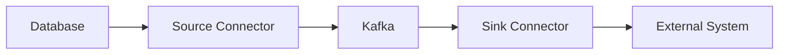
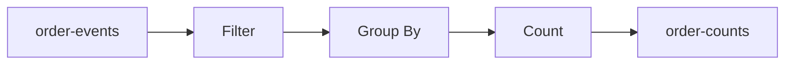
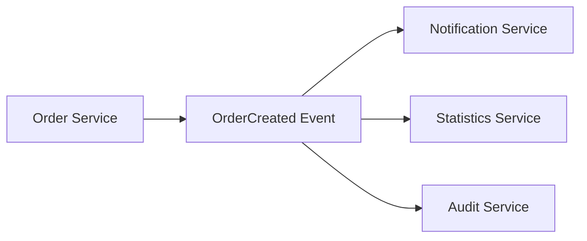
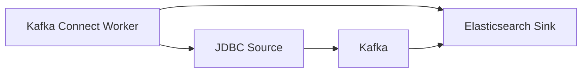
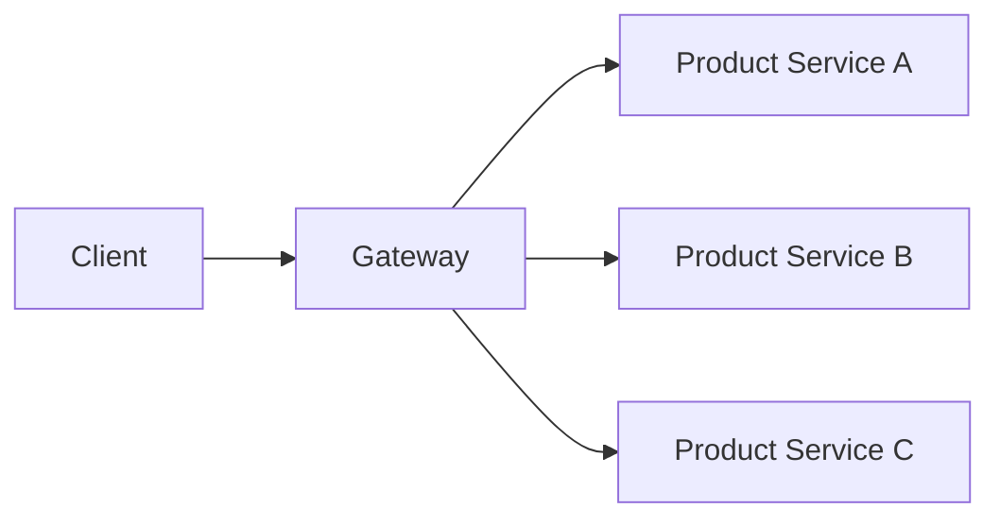
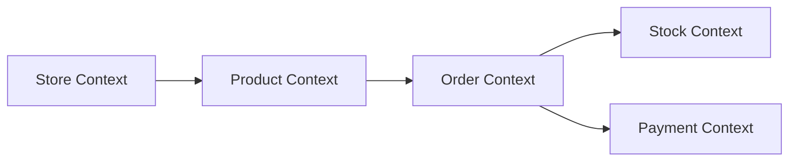
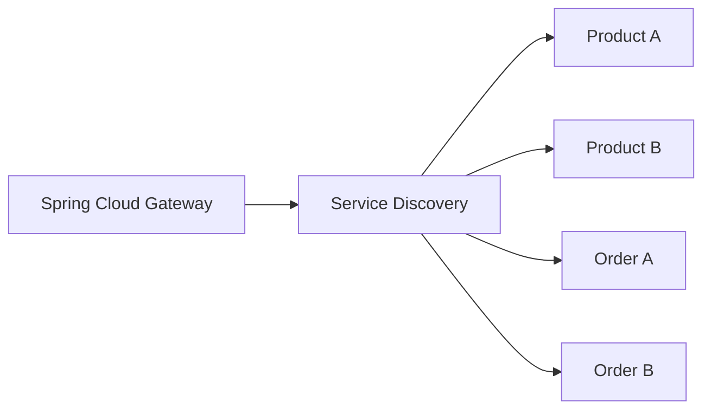
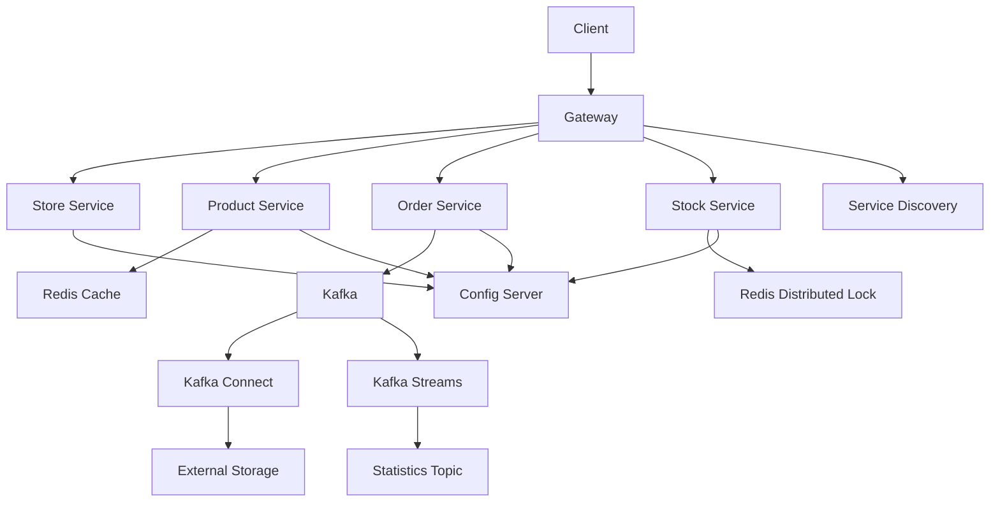
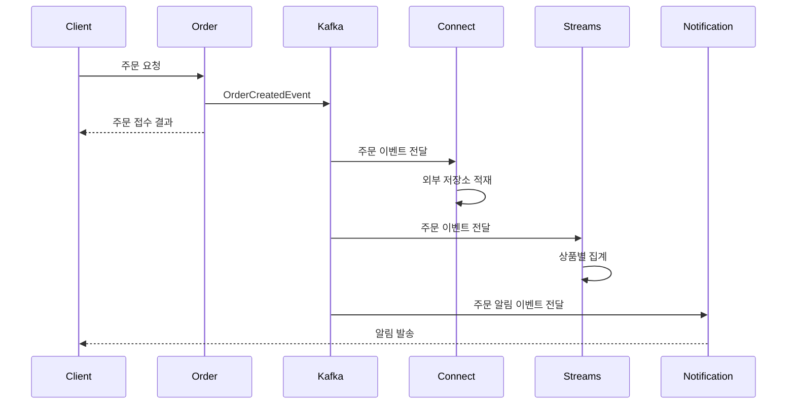

# 강의를 마치면서

# 강의를 마치면서

* toc
{:toc}

---

## Redis와 Kafka를 활용한 분산 시스템을 다음 단계로 확장하기

Redis와 Kafka를 활용하면 캐시, 세션, 분산 락, 이벤트 처리, 부하 테스트를 직접 구현할 수 있다.

하지만 서비스를 실제로 확장하려면 여기서 끝나지 않는다. 데이터베이스와 Kafka를 자동으로 연결하는 Kafka Connect, 실시간 이벤트를 처리하는 Kafka Streams, 마이크로서비스 운영을 돕는 Spring Cloud, 이벤트 중심 구조를 설계하는 EDA, 복잡한 비즈니스를 모델링하는 DDD까지 함께 이해해야 한다.

또한 사이드 프로젝트를 완성하기 위해서는 기술뿐만 아니라 목표 설정, 일정 관리, 문서화, 피드백과 같은 개발 습관도 중요하다.

---

## 개념

### 사이드 프로젝트의 목적

사이드 프로젝트는 단순히 새로운 기술을 나열하는 작업이 아니다.

Redis와 Kafka를 사용한다고 해서 좋은 프로젝트가 되는 것은 아니다. 어떤 문제를 해결하기 위해 해당 기술을 선택했는지가 더 중요하다.

```text
문제 정의
→ 목표 설정
→ 기술 선택
→ 기능 구현
→ 성능 테스트
→ 문제 개선
```

예를 들어 다음과 같이 목표를 정의할 수 있다.

```text
상품 조회 트래픽이 증가해도 데이터베이스 부하를 낮춘다.
동시에 같은 상품을 주문해도 재고가 음수가 되지 않도록 한다.
주문 처리 결과를 이벤트로 전달해 후속 작업을 비동기로 처리한다.
```

목표가 명확하면 어떤 기술을 사용할지와 어떤 테스트가 필요한지 결정하기 쉬워진다.

### Kafka Connect

Kafka Connect는 Kafka와 외부 시스템 사이의 데이터 이동을 담당하는 프레임워크이다.



Kafka Connect는 직접 Producer와 Consumer 코드를 작성하지 않고도 외부 시스템과 Kafka를 연결할 수 있게 해준다.

대표적인 연결 대상은 다음과 같다.

- MySQL
- PostgreSQL
- Elasticsearch
- 파일 시스템
- Object Storage
- 데이터 웨어하우스
- 로그 시스템

### Source Connector

Source Connector는 외부 시스템의 데이터를 Kafka로 가져온다.

```text
MySQL orders 테이블
→ JDBC Source Connector
→ Kafka order-events 토픽
```

### Sink Connector

Sink Connector는 Kafka의 데이터를 외부 시스템으로 내보낸다.

```text
Kafka order-events 토픽
→ Elasticsearch Sink Connector
→ 검색용 Elasticsearch 인덱스
```

### Kafka Streams

Kafka Streams는 Kafka 토픽의 데이터를 실시간으로 변환, 집계, 필터링하는 Java 라이브러리이다.



Kafka Streams는 별도의 스트림 처리 클러스터 없이 Spring Boot와 같은 애플리케이션 내부에서 실행할 수 있다.

다음과 같은 작업에 활용할 수 있다.

- 주문 수 집계
- 시간별 매출 계산
- 사용자별 이벤트 집계
- 특정 조건의 이벤트 필터링
- 실시간 알림용 데이터 생성
- 상품별 판매량 계산

### Spring Cloud

Spring Cloud는 마이크로서비스를 구성하고 운영하기 위한 도구 모음이다.

| 기능 | Spring Cloud 도구 |
|---|---|
| 중앙 설정 관리 | Spring Cloud Config |
| 서비스 등록과 검색 | Eureka, Consul |
| API 라우팅 | Spring Cloud Gateway |
| 서비스 간 호출 | OpenFeign |
| 장애 차단 | Circuit Breaker |
| 클라이언트 로드밸런싱 | Spring Cloud LoadBalancer |

### Event-Driven Architecture

Event-Driven Architecture는 서비스가 직접 서로를 호출하기보다 이벤트를 발행하고 구독하는 구조이다.



이벤트 생산자는 소비자의 존재를 직접 알 필요가 없다.

```text
Order Service
→ ORDER_CREATED 이벤트 발행

Notification Service
→ 이벤트 구독 후 알림 발송

Statistics Service
→ 이벤트 구독 후 통계 반영
```

이 구조는 서비스 간 결합도를 낮추고 새로운 기능을 추가하기 쉽게 만든다.

### Domain-Driven Design

Domain-Driven Design은 기술이나 데이터베이스 테이블보다 비즈니스 도메인을 중심으로 소프트웨어를 설계하는 방법이다.

```text
Store
Product
Order
Stock
Payment
```

각 도메인이 어떤 책임을 가지고 서로 어떤 관계를 맺는지 먼저 정의한다.

DDD에서 자주 사용하는 개념은 다음과 같다.

| 개념 | 의미 |
|---|---|
| Entity | 고유한 식별자를 가진 객체 |
| Value Object | 값 자체로 의미를 가지는 객체 |
| Aggregate | 하나의 단위로 관리되는 객체 묶음 |
| Aggregate Root | Aggregate에 접근하는 대표 객체 |
| Repository | 도메인 객체 저장과 조회 추상화 |
| Bounded Context | 하나의 모델과 의미가 통용되는 경계 |
| Ubiquitous Language | 개발자와 비즈니스 담당자가 함께 사용하는 용어 |

---

## 왜 사용하는가?

### 외부 시스템 연동을 단순화하기 위해

주문 데이터를 Kafka에서 Elasticsearch로 전달한다고 가정해 보자.

Kafka Connect가 없다면 다음 작업을 직접 구현해야 한다.

- Kafka Consumer 작성
- Elasticsearch Client 연결
- 역직렬화
- 재시도
- Offset 관리
- 장애 처리
- 커넥션 관리

Kafka Connect를 사용하면 Connector 설정으로 데이터 이동을 구성할 수 있다.

### 실시간 집계를 위해

주문 이벤트가 발생할 때마다 데이터베이스를 조회해 판매량을 다시 계산하면 데이터베이스 부하가 커질 수 있다.

Kafka Streams를 사용하면 이벤트가 들어오는 순간 판매량을 증가시킬 수 있다.

```text
OrderCreatedEvent
→ 상품별 그룹화
→ 수량 합산
→ 상품별 판매량 토픽 저장
```

### 서비스 간 결합도를 낮추기 위해

주문 서비스가 알림 서비스의 주소와 API를 직접 알고 있으면 두 서비스가 강하게 결합된다.

```text
Order Service
→ Notification Service 직접 호출
```

EDA를 사용하면 주문 서비스는 이벤트만 발행한다.

```text
Order Service
→ OrderCreatedEvent 발행

Notification Service
→ OrderCreatedEvent 구독
```

알림 서비스의 주소가 변경되어도 주문 서비스의 코드를 수정할 필요가 없다.

### 복잡한 비즈니스를 명확하게 표현하기 위해

상품, 주문, 재고, 결제 기능이 하나의 서비스에 섞이면 비즈니스 규칙을 이해하기 어려워진다.

DDD를 사용하면 각 도메인의 책임을 분리할 수 있다.

```text
Order
→ 주문 생성과 주문 상태 관리

Stock
→ 재고 확인과 재고 차감

Payment
→ 결제 승인과 결제 취소
```

---

## 주요 특징

### Kafka Connect의 Source와 Sink

| 유형 | 데이터 흐름 | 예시 |
|---|---|---|
| Source Connector | 외부 시스템 → Kafka | MySQL 주문 데이터 |
| Sink Connector | Kafka → 외부 시스템 | Kafka 이벤트를 Elasticsearch에 저장 |

Kafka Connect는 Connector Worker에서 실행된다.



### Kafka Streams의 상태 처리

Kafka Streams는 단순히 메시지를 전달하는 것이 아니라 상태를 유지하면서 집계할 수 있다.

```text
ORDER_CREATED product-1001 quantity=2
ORDER_CREATED product-1001 quantity=3
ORDER_CREATED product-1002 quantity=1
```

상품별 판매량은 다음과 같이 계산된다.

```text
product-1001 = 5
product-1002 = 1
```

집계 결과를 다시 Kafka 토픽으로 발행하면 다른 서비스가 해당 결과를 사용할 수 있다.

### Spring Cloud 기반 서비스 운영

마이크로서비스가 많아지면 서비스 주소를 코드에 직접 작성하기 어렵다.

```java
@FeignClient(
    name = "product-service",
    url = "http://localhost:8082"
)
```

서비스 디스커버리를 사용하면 서비스 이름을 기준으로 호출할 수 있다.

```java
@FeignClient(
    name = "product-service"
)
```

서비스 인스턴스가 여러 개 실행되면 Load Balancer가 요청을 분산할 수 있다.



### DDD 기반 서비스 경계

이커머스 서비스는 다음과 같이 Bounded Context를 나눌 수 있다.



각 Context 안에서 같은 단어가 다른 의미를 가질 수 있다.

예를 들어 `status`라는 필드도 도메인에 따라 의미가 다르다.

| 도메인 | `status` 의미 |
|---|---|
| Order | 주문 상태 |
| Payment | 결제 상태 |
| Stock | 재고 처리 상태 |
| Product | 판매 상태 |

따라서 모든 서비스가 하나의 거대한 공통 모델을 사용하는 것보다 각 도메인의 의미에 맞는 모델을 갖는 것이 좋다.

---

## 예제

### Kafka Connect JDBC Source 설정

MySQL의 `orders` 테이블을 Kafka로 가져오는 JDBC Source Connector 설정 예시는 다음과 같다.

```json
{
  "name": "mysql-order-source",
  "config": {
    "connector.class": "io.confluent.connect.jdbc.JdbcSourceConnector",
    "connection.url": "jdbc:mysql://mysql:3306/test",
    "connection.user": "test",
    "connection.password": "test",
    "mode": "incrementing",
    "incrementing.column.name": "id",
    "topic.prefix": "mysql-",
    "table.whitelist": "orders",
    "poll.interval.ms": "1000",
    "tasks.max": "1"
  }
}
```

| 설정 | 의미 |
|---|---|
| `connector.class` | 사용할 Connector 구현체 |
| `connection.url` | 데이터베이스 연결 주소 |
| `mode` | 데이터 변경 감지 방식 |
| `incrementing.column.name` | 증가하는 기준 컬럼 |
| `topic.prefix` | Kafka 토픽 이름 접두사 |
| `table.whitelist` | 가져올 테이블 목록 |
| `poll.interval.ms` | 데이터 확인 주기 |
| `tasks.max` | Connector Task 수 |

Connector를 등록한다.

```bash
curl -X POST \
  http://localhost:8083/connectors \
  -H "Content-Type: application/json" \
  -d @mysql-order-source.json
```

실행 결과 예시는 다음과 같다.

```json
{
  "name": "mysql-order-source",
  "config": {
    "connector.class": "io.confluent.connect.jdbc.JdbcSourceConnector",
    "connection.url": "jdbc:mysql://mysql:3306/test"
  },
  "tasks": []
}
```

등록된 Connector 목록을 확인한다.

```bash
curl http://localhost:8083/connectors
```

실행 결과는 다음과 같다.

```json
[
  "mysql-order-source"
]
```

Connector 상태를 확인한다.

```bash
curl http://localhost:8083/connectors/mysql-order-source/status
```

실행 결과 예시는 다음과 같다.

```json
{
  "name": "mysql-order-source",
  "connector": {
    "state": "RUNNING"
  },
  "tasks": [
    {
      "id": 0,
      "state": "RUNNING"
    }
  ]
}
```

`RUNNING` 상태가 아니면 Connector 로그에서 데이터베이스 연결 정보와 JDBC 플러그인 설치 여부를 확인해야 한다.

### Kafka Streams 애플리케이션

주문 이벤트를 읽어 상품별 주문 횟수를 집계하는 예시이다.

```java
package com.example.stream;

import org.apache.kafka.common.serialization.Serdes;

import org.apache.kafka.streams.KeyValue;
import org.apache.kafka.streams.StreamsBuilder;
import org.apache.kafka.streams.kstream.Consumed;
import org.apache.kafka.streams.kstream.Grouped;
import org.apache.kafka.streams.kstream.KStream;
import org.apache.kafka.streams.kstream.KTable;
import org.apache.kafka.streams.kstream.Produced;

import org.springframework.context.annotation.Bean;
import org.springframework.context.annotation.Configuration;
import org.springframework.kafka.annotation.EnableKafkaStreams;

@Configuration
@EnableKafkaStreams
public class OrderStreamConfiguration {

    @Bean
    public KStream<String, String> orderStream(
        StreamsBuilder builder
    ) {
        KStream<String, String> orders =
            builder.stream(
                "order-events",
                Consumed.with(
                    Serdes.String(),
                    Serdes.String()
                )
            );

        KTable<String, Long> orderCounts =
            orders
                .filter(
                    (key, value) ->
                        value.startsWith(
                            "ORDER_CREATED"
                        )
                )
                .map(
                    (key, value) ->
                        KeyValue.pair(
                            key,
                            value
                        )
                )
                .groupByKey(
                    Grouped.with(
                        Serdes.String(),
                        Serdes.String()
                    )
                )
                .count();

        orderCounts
            .toStream()
            .mapValues(String::valueOf)
            .to(
                "order-counts",
                Produced.with(
                    Serdes.String(),
                    Serdes.String()
                )
            );

        return orders;
    }
}
```

이 코드는 다음 순서로 동작한다.

```text
order-events 읽기
→ ORDER_CREATED 이벤트 필터링
→ 상품 키 기준 그룹화
→ 이벤트 개수 집계
→ order-counts 토픽에 발행
```

실제 주문 수량을 합산하려면 이벤트의 JSON을 역직렬화한 뒤 수량 필드를 사용해야 한다.

### Spring Cloud Config 예시

환경별 설정을 중앙에서 관리하려면 Spring Cloud Config를 사용할 수 있다.

```yaml
spring:
  application:
    name: product-service

  config:
    import: optional:configserver:http://localhost:8888
```

Config Server를 사용하면 다음과 같은 설정을 중앙에서 관리할 수 있다.

```yaml
spring:
  datasource:
    url: jdbc:mysql://mysql:3306/product
    username: product_user
    password: product_password

  data:
    redis:
      cluster:
        nodes:
          - redis-1:7001
          - redis-2:7002
          - redis-3:7003
```

서비스마다 직접 설정 파일을 관리하는 대신 환경별 설정을 중앙화할 수 있다.

```text
product-service-local.yml
product-service-test.yml
product-service-prod.yml
```

### Spring Cloud Gateway와 서비스 디스커버리

```yaml
spring:
  cloud:
    gateway:
      routes:
        - id: product-service
          uri: lb://product-service
          predicates:
            - Path=/api/products/**

        - id: order-service
          uri: lb://order-service
          predicates:
            - Path=/api/orders/**
```

`lb://`는 서비스 이름을 기준으로 인스턴스를 찾고 부하를 분산한다는 의미이다.



### DDD 기반 재고 도메인

재고 차감 규칙을 Stock 도메인 안에 배치할 수 있다.

```java
public class Stock {

    private final String productId;

    private long quantity;

    public Stock(
        String productId,
        long quantity
    ) {
        this.productId = productId;
        this.quantity = quantity;
    }

    public void decrease(
        long requestedQuantity
    ) {
        if (requestedQuantity <= 0) {
            throw new IllegalArgumentException(
                "차감 수량은 0보다 커야 합니다."
            );
        }

        if (quantity < requestedQuantity) {
            throw new IllegalStateException(
                "재고가 부족합니다."
            );
        }

        quantity -= requestedQuantity;
    }

    public long getQuantity() {
        return quantity;
    }
}
```

서비스에서 직접 조건문을 반복하는 대신 도메인 객체가 자신의 규칙을 관리한다.

```java
stock.decrease(
    order.getQuantity()
);
```

재고 부족이라는 비즈니스 규칙이 여러 서비스에 흩어지지 않는다는 장점이 있다.

---

## 구조

Redis와 Kafka를 활용한 전체 시스템은 다음과 같이 확장할 수 있다.



주문 이벤트의 확장 흐름은 다음과 같다.



---

## 실무에서의 활용

### 명확한 목표 설정

프로젝트를 시작하기 전에 무엇을 얻고 싶은지 정해야 한다.

좋은 목표는 측정할 수 있어야 한다.

```text
Redis 적용 후 상품 조회 평균 응답 시간을 50% 이상 줄인다.
동시에 100명의 사용자가 주문해도 재고가 음수가 되지 않도록 한다.
Kafka 이벤트 처리 지연을 1초 이내로 유지한다.
```

다음과 같이 추상적인 목표만 세우면 결과를 판단하기 어렵다.

```text
Redis를 공부한다.
Kafka를 사용해 본다.
마이크로서비스를 만들어 본다.
```

기술보다 문제와 측정 기준을 먼저 정의해야 한다.

### 계획을 작은 단위로 나누기

큰 프로젝트를 한 번에 완성하려고 하면 중간에 진행 상황을 잃기 쉽다.

```text
1단계: 기본 서비스 실행
2단계: 상품 조회 구현
3단계: Redis 캐시 적용
4단계: 주문과 재고 구현
5단계: Kafka 이벤트 발행
6단계: 분산 락 적용
7단계: 부하 테스트
8단계: 병목 개선
```

각 단계가 끝날 때마다 다음 내용을 확인하는 것이 좋다.

- 기능이 동작하는가
- 테스트가 통과하는가
- 로그로 흐름을 추적할 수 있는가
- 장애가 발생했을 때 원인을 알 수 있는가
- 다음 단계에 필요한 기반이 준비되었는가

### 학습과 구현의 균형

기술 개념을 공부하는 것은 중요하지만, 실제 코드에 적용하지 않으면 이해가 오래 유지되지 않을 수 있다.

```text
개념 학습
→ 작은 예제 작성
→ 실제 서비스에 적용
→ 오류 해결
→ 문서화
```

예를 들어 Redis 분산 락을 공부했다면 다음과 같은 작은 기능부터 적용할 수 있다.

```text
좋아요 중복 방지
→ 쿠폰 발급 중복 방지
→ 재고 차감 동시성 제어
```

처음부터 가장 복잡한 주문 시스템에 적용하기보다 작은 문제에서 동작을 확인한 뒤 범위를 넓히는 것이 좋다.

### 코드 품질과 문서화

분산 시스템은 실행 흐름이 복잡하기 때문에 코드만으로 전체 구조를 파악하기 어렵다.

다음 내용을 문서로 남기는 것이 좋다.

- 서비스별 책임
- Kafka 토픽 목록
- 이벤트 스키마
- Redis 키 규칙
- API 목록
- 장애 처리 방식
- 캐시 TTL
- 분산 락 키
- 부하 테스트 결과

Redis 키 규칙은 다음처럼 문서화할 수 있다.

| 키 패턴 | 용도 | TTL |
|---|---|---|
| `product:{productId}` | 상품 캐시 | 1시간 |
| `stock:{stockId}` | 재고 캐시 | 1시간 |
| `lock:stock:{stockId}` | 재고 분산 락 | 락 처리 시간 |
| `product:likes:{productId}` | 좋아요 사용자 | 정책에 따라 설정 |
| `product:visits:{date}` | 일일 방문자 | 1일 |

Kafka 토픽도 다음과 같이 정리할 수 있다.

| 토픽 | Producer | Consumer |
|---|---|---|
| `order-command` | Order Service | Order Service |
| `order-result` | Order Service | Event Log Service |
| `product-events` | Product Service | Statistics Service |
| `stock-events` | Stock Service | Audit Service |

### 커뮤니티와 피드백

혼자 개발하면 자신의 설계가 잘못되었는지 확인하기 어려울 수 있다.

다음과 같은 방식으로 피드백을 받을 수 있다.

- 코드 리뷰 요청
- 아키텍처 다이어그램 공유
- 부하 테스트 결과 공유
- 장애 상황과 해결 과정 기록
- 동일한 문제를 경험한 개발자에게 질문

특히 분산 시스템은 동작하는 것처럼 보여도 장애 상황에서 문제가 발생할 수 있다. 다른 사람이 다음 질문을 해 주는 것만으로도 설계의 빈틈을 찾을 수 있다.

```text
Redis가 장애 나면 어떻게 동작하는가?
Kafka 이벤트가 중복되면 어떻게 처리하는가?
상품 캐시가 오래된 상태라면 어떻게 갱신하는가?
재고 차감 후 주문 저장이 실패하면 어떻게 복구하는가?
```

### 지속 가능한 학습 습관

복잡한 기술을 한 번에 오래 공부하려고 하면 쉽게 지칠 수 있다.

짧은 단위로 나누어 실행하는 방식이 도움이 된다.

```text
오늘의 목표
→ Kafka Producer 설정 확인

다음 목표
→ Kafka Consumer 구현

그다음 목표
→ 이벤트 중복 처리 추가
```

학습한 내용은 자신의 표현으로 요약하는 것이 좋다.

```text
Redis
→ 빠른 메모리 저장소

Kafka
→ 이벤트를 저장하고 전달하는 로그

분산 락
→ 여러 서버에서 하나의 작업만 실행

CQRS
→ 쓰기와 조회 분리
```

키워드와 관계를 함께 정리하면 나중에 전체 구조를 다시 떠올리기 쉽다.

```text
Order
├── Redis
│   ├── Cache
│   └── Distributed Lock
├── Kafka
│   ├── Event
│   └── Consumer
└── Database
    └── Source of Truth
```

---

## 정리

Redis와 Kafka를 활용한 분산 시스템은 캐시와 메시지 브로커를 추가하는 것에서 끝나지 않는다.

Kafka Connect를 사용하면 Kafka와 데이터베이스, 검색 시스템, 파일 시스템 같은 외부 시스템을 연결할 수 있다. Kafka Streams를 사용하면 Kafka 이벤트를 실시간으로 필터링하고 집계할 수 있다.

Spring Cloud는 설정 관리, 서비스 디스커버리, Gateway, 부하 분산과 같은 마이크로서비스 운영 기능을 제공한다. Event-Driven Architecture는 서비스 간 직접 결합을 낮추고 이벤트 중심으로 시스템을 확장할 수 있게 한다.

DDD는 가게, 상품, 주문, 재고처럼 복잡한 비즈니스 도메인의 책임과 경계를 명확하게 만드는 데 도움을 준다. 모든 기능을 하나의 서비스와 모델에 넣기보다 도메인별 책임을 구분하고, 각 도메인이 자신의 비즈니스 규칙을 관리하도록 설계하는 것이 중요하다.

사이드 프로젝트를 완성하려면 기술 선택보다 먼저 명확한 목표를 세워야 한다. 목표를 작은 단위로 나누고, 구현과 테스트를 반복하며, 코드와 설계 내용을 문서화해야 한다.

마지막으로 성능 테스트 결과를 기록하고 실패 원인을 분석해야 한다. Redis 캐시 적중률, Kafka Consumer 지연, 분산 락 대기 시간, 데이터베이스 부하를 함께 확인해야 시스템을 제대로 개선할 수 있다.

---

### 한 줄 요약

Redis와 Kafka 기반 시스템은 Kafka Connect, Kafka Streams, Spring Cloud, EDA, DDD로 확장할 수 있으며 명확한 목표와 꾸준한 구현·테스트·문서화가 안정적인 서비스를 만드는 핵심이다.
