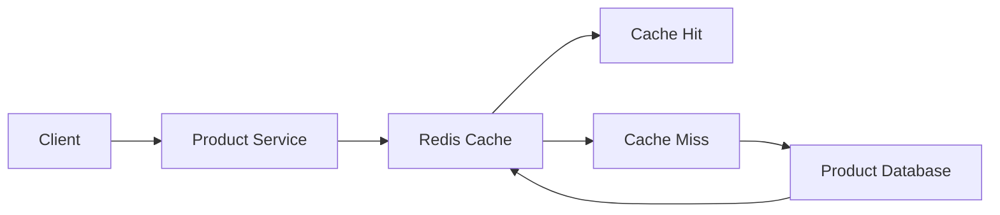
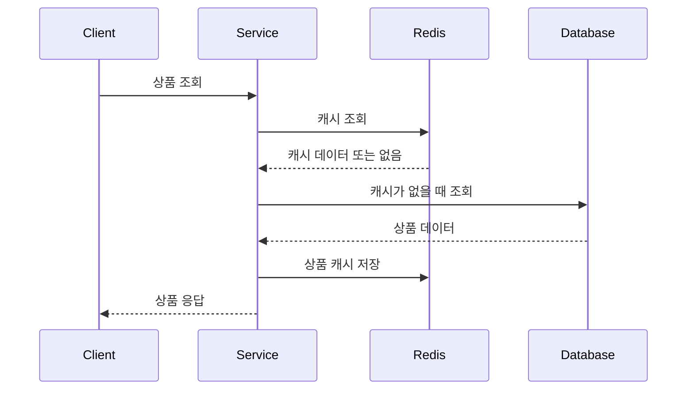
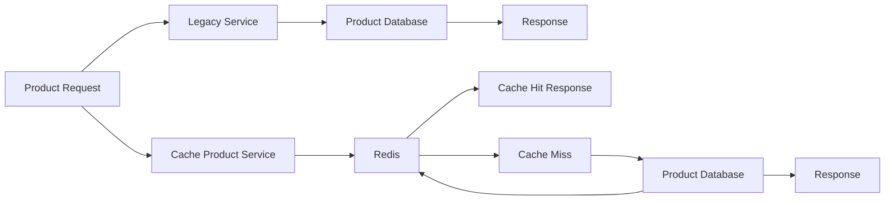
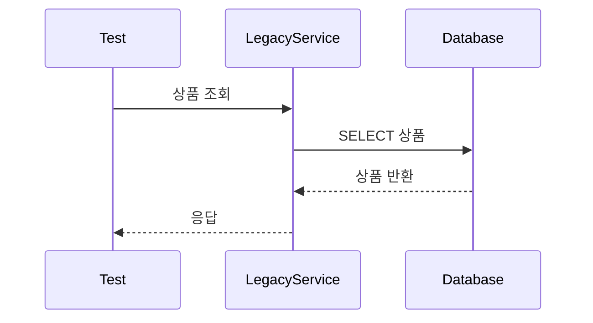
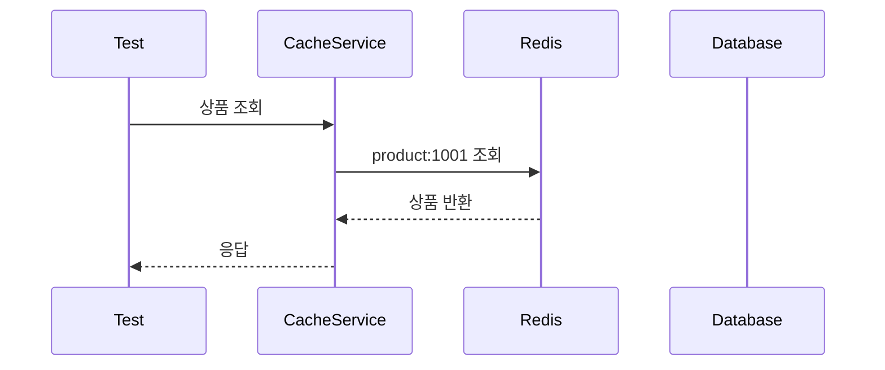
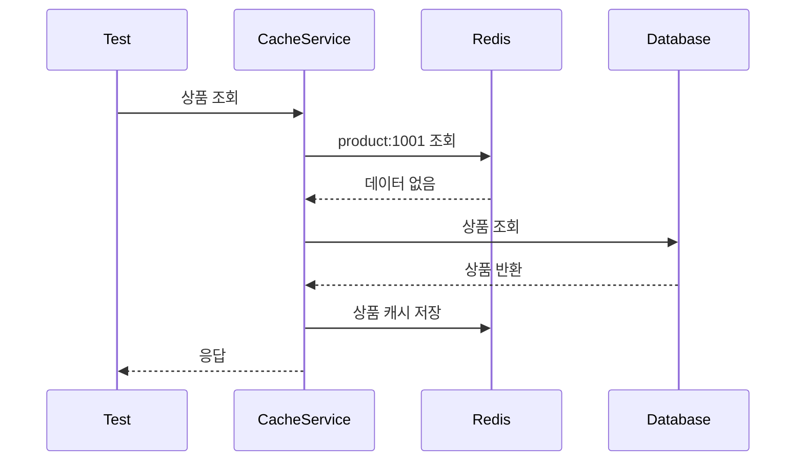

# Redis Caching 성능 테스트하기

# Redis Caching 성능 테스트하기

* toc
{:toc}

---

## Redis 캐싱 성능 테스트하기

Redis 캐시는 데이터베이스 조회 횟수를 줄이고 응답 속도를 높이기 위해 사용한다.

상품처럼 조회 요청은 많지만 변경 요청은 상대적으로 적은 데이터는 캐시 적용 효과가 크다.

```text
캐시 미사용

상품 조회 요청
→ 데이터베이스 조회
→ 응답 반환
```

```text
Redis 캐시 사용

상품 조회 요청
→ Redis 조회
→ 캐시가 있으면 즉시 응답

캐시가 없으면
→ 데이터베이스 조회
→ Redis 저장
→ 응답 반환
```

이번에는 Redis 캐시를 적용하지 않은 상품 서비스와 Redis 캐시를 적용한 상품 서비스를 동일한 데이터로 실행하고, 처리 시간을 비교한다.

---

## 개념

### 캐시란?

캐시는 자주 사용하는 데이터를 빠르게 꺼낼 수 있도록 가까운 저장 공간에 임시로 보관하는 기술이다.

Redis는 메모리 기반으로 동작하기 때문에 디스크 기반 데이터베이스보다 빠르게 데이터를 읽을 수 있다.



### Cache Hit

Redis에 상품 데이터가 이미 존재하는 경우이다.

```text
상품 조회
→ product:1001 조회
→ Redis에 데이터 존재
→ Redis 데이터 반환
```

Cache Hit이 발생하면 데이터베이스를 조회하지 않는다.

### Cache Miss

Redis에 데이터가 없는 경우이다.

```text
상품 조회
→ product:1001 조회
→ Redis에 데이터 없음
→ 데이터베이스 조회
→ Redis에 저장
→ 응답 반환
```

첫 번째 조회는 느릴 수 있지만, 이후 같은 상품을 조회하면 Redis에서 빠르게 반환할 수 있다.

### Cache Aside 패턴

상품 조회에서 가장 많이 사용하는 방식은 Cache Aside 패턴이다.



Cache Aside의 처리 순서는 다음과 같다.

1. Redis에서 데이터를 조회한다.
2. 데이터가 있으면 바로 반환한다.
3. 데이터가 없으면 데이터베이스에서 조회한다.
4. 조회한 데이터를 Redis에 저장한다.
5. 데이터를 반환한다.

---

## 왜 사용하는가?

### 데이터베이스 부하 감소

상품 조회 요청이 10,000번 발생한다고 가정해 보자.

캐시를 사용하지 않으면 데이터베이스에 10,000번 접근할 수 있다.

```text
상품 조회 10,000회
→ DB 조회 10,000회
```

캐시를 사용하면 최초 조회 이후에는 Redis에서 응답할 수 있다.

```text
상품 조회 10,000회
→ DB 조회 1회
→ Redis 조회 9,999회
```

실제 Cache Miss가 발생하는 시점과 TTL, 데이터 변경 여부에 따라 결과는 달라지지만 데이터베이스 조회 횟수를 크게 줄일 수 있다.

### 응답 시간 개선

Redis는 메모리에서 데이터를 읽기 때문에 데이터베이스의 디스크 I/O, 복잡한 쿼리, 커넥션 획득 비용을 줄일 수 있다.

특히 다음과 같은 데이터는 캐시 효과가 크다.

- 상품 상세 정보
- 가게 정보
- 카테고리 목록
- 자주 조회되는 설정 데이터
- 인기 검색어
- 읽기 전용 통계 데이터

### 트래픽 증가에 대응

조회 트래픽이 증가하면 데이터베이스의 커넥션과 CPU 사용량이 함께 증가한다.

Redis 캐시를 사용하면 조회 요청의 일부를 Redis가 처리하기 때문에 데이터베이스가 감당해야 하는 트래픽을 줄일 수 있다.

---

## 주요 특징

### 상품 캐시 키

상품 ID를 기반으로 캐시 키를 구성한다.

```text
product:{productId}
```

예시는 다음과 같다.

```text
product:1001
product:1002
product:1003
```

키 이름에 도메인을 포함하면 다른 데이터와 충돌하는 것을 방지할 수 있다.

```text
product:1001
store:1001
order:1001
```

단순히 다음과 같이 숫자만 사용하면 어떤 데이터인지 구분하기 어렵다.

```text
1001
```

### TTL 설정

캐시에 저장한 데이터는 영원히 유지하지 않고 만료 시간을 설정하는 것이 좋다.

```java
redisTemplate.opsForValue().set(
    cacheKey,
    savedProduct,
    1,
    TimeUnit.HOURS
);
```

위 코드는 상품 데이터를 1시간 동안 저장한다.

TTL을 설정하면 다음과 같은 장점이 있다.

- 오래된 데이터가 계속 남지 않는다.
- 메모리 사용량을 관리할 수 있다.
- 데이터베이스와 캐시의 불일치 시간을 제한할 수 있다.
- 캐시 장애 후 일정 시간이 지나면 자동으로 다시 생성된다.

단, TTL이 만료되었다고 해서 데이터베이스 데이터가 자동으로 변경되는 것은 아니다. Redis 캐시만 삭제되고, 다음 조회 때 데이터베이스에서 다시 읽어 캐시에 저장한다.

### 캐시 저장 시점

상품 생성 시점에 캐시를 미리 저장할 수 있다.

```java
Product savedProduct =
    productRepository.saveAndFlush(product);

String cacheKey =
    generateCacheKey(
        savedProduct.getProductId()
    );

redisTemplate.opsForValue().set(
    cacheKey,
    savedProduct,
    1,
    TimeUnit.HOURS
);
```

또는 최초 조회 시점에만 캐시를 저장할 수 있다.

```text
상품 생성
→ DB 저장

상품 첫 조회
→ DB 조회
→ Redis 저장
```

두 방식의 차이는 다음과 같다.

| 방식 | 장점 | 단점 |
|---|---|---|
| 생성 시 캐시 저장 | 첫 조회부터 빠름 | 조회되지 않는 데이터도 캐시에 저장 |
| 조회 시 캐시 저장 | 실제 사용되는 데이터만 저장 | 첫 조회는 느림 |

### 캐시 갱신과 삭제

상품이 수정되면 캐시도 갱신해야 한다.

```text
상품 수정
→ DB 수정
→ Redis 캐시 갱신
```

상품을 삭제하면 캐시도 삭제해야 한다.

```text
상품 삭제
→ DB 삭제
→ Redis 캐시 삭제
```

캐시를 갱신하지 않으면 사용자가 이전 상품 정보를 계속 볼 수 있다.

---

## 예제

### Gradle 설정

```groovy
plugins {
    id 'org.springframework.boot'
}

springBoot {
    mainClass.set(
        'com.example.LegacyApplication'
    )
}

bootJar {
    archiveFileName = 'service-legacy.jar'
}

repositories {
    mavenCentral()
}

dependencies {
    implementation 'org.springframework.boot:spring-boot-starter-web'
    implementation 'org.springframework.boot:spring-boot-starter-data-jpa'
    implementation 'org.springframework.boot:spring-boot-starter-data-redis'
    implementation 'org.springframework.boot:spring-boot-starter-actuator'

    runtimeOnly 'com.mysql:mysql-connector-j'

    implementation 'org.springframework.cloud:spring-cloud-starter-openfeign'

    implementation 'io.lettuce:lettuce-core'

    compileOnly 'org.projectlombok:lombok'
    annotationProcessor 'org.projectlombok:lombok'

    testImplementation 'org.springframework.boot:spring-boot-starter-test'
}
```

Redis 캐시 테스트에 필요한 주요 의존성은 다음과 같다.

| 의존성 | 역할 |
|---|---|
| `spring-boot-starter-data-jpa` | 상품 데이터베이스 조회 |
| `spring-boot-starter-data-redis` | Redis 연결과 캐시 처리 |
| `lettuce-core` | Redis 클라이언트 |
| `spring-boot-starter-test` | 테스트 코드 실행 |
| `spring-boot-starter-actuator` | 상태와 운영 지표 확인 |

### 테스트 환경 설정

```yaml
spring:
  datasource:
    url: jdbc:mysql://localhost:3306/test
    username: test
    password: test
    driver-class-name: com.mysql.cj.jdbc.Driver

  jpa:
    hibernate:
      ddl-auto: create-drop

  data:
    redis:
      cluster:
        nodes:
          - localhost:7001
          - localhost:7002
          - localhost:7003
          - localhost:7004
          - localhost:7005
          - localhost:7006

      lettuce:
        pool:
          max-active: 8
          max-idle: 8
          min-idle: 0
```

| 설정 | 의미 |
|---|---|
| `ddl-auto: create-drop` | 테스트 시작 시 테이블 생성, 종료 시 삭제 |
| `redis.cluster.nodes` | Redis Cluster 노드 목록 |
| `max-active` | 최대 Redis 연결 수 |
| `max-idle` | 유휴 연결 최대 수 |
| `min-idle` | 유지할 최소 유휴 연결 수 |

테스트 환경에서는 데이터가 초기화되어도 되기 때문에 `create-drop`을 사용할 수 있다. 운영 환경에서 사용하면 기존 테이블이 삭제될 수 있으므로 주의해야 한다.

Redis Cluster가 실행 중인지 확인한다.

```bash
redis-cli -p 7001 cluster info
```

실행 결과 예시는 다음과 같다.

```text
cluster_state:ok
cluster_slots_assigned:16384
cluster_slots_ok:16384
cluster_known_nodes:6
```

`cluster_state:ok`가 반환되어야 테스트 애플리케이션이 Redis Cluster에 정상적으로 연결할 수 있다.

### 상품 엔티티

```java
@Entity
@Table(name = "products")
@Getter
@Setter
@NoArgsConstructor
@AllArgsConstructor
@Builder
public class Product {

    @Id
    @GeneratedValue(
        strategy = GenerationType.IDENTITY
    )
    private Long id;

    @Column(
        unique = true,
        nullable = false
    )
    private String productId;

    private String name;

    private long price;
}
```

```java
public interface ProductRepository
    extends JpaRepository<Product, Long> {

    Optional<Product> findByProductId(
        String productId
    );
}
```

### 상품 DTO

```java
@Data
@AllArgsConstructor
public class ProductDto {

    private String name;

    private long price;
}
```

### 캐시를 사용하는 상품 서비스

```java
@Service
@RequiredArgsConstructor
@Slf4j
public class CacheProductService {

    private final ProductRepository productRepository;

    private final RedisTemplate<String, Object>
        redisTemplate;

    public Product createProduct(
        ProductDto dto
    ) {
        Product product =
            Product.builder()
                .productId(
                    generateProductId()
                )
                .name(dto.getName())
                .price(dto.getPrice())
                .build();

        Product savedProduct =
            productRepository.saveAndFlush(product);

        String cacheKey =
            generateCacheKey(
                savedProduct.getProductId()
            );

        redisTemplate.opsForValue().set(
            cacheKey,
            savedProduct,
            1,
            TimeUnit.HOURS
        );

        log.info(
            "Product created and cached: {}",
            cacheKey
        );

        return savedProduct;
    }

    public Product getProduct(
        String productId
    ) {
        String cacheKey =
            generateCacheKey(productId);

        Product cachedProduct =
            (Product) redisTemplate.opsForValue()
                .get(cacheKey);

        if (cachedProduct != null) {
            log.info(
                "[RedisCache] Hit for key: {}",
                cacheKey
            );

            return cachedProduct;
        }

        Product databaseProduct =
            productRepository.findByProductId(
                productId
            ).orElseThrow(
                () -> new IllegalArgumentException(
                    "Product not found: "
                        + productId
                )
            );

        redisTemplate.opsForValue().set(
            cacheKey,
            databaseProduct,
            1,
            TimeUnit.HOURS
        );

        log.info(
            "Product retrieved from DB and cached: {}",
            cacheKey
        );

        return databaseProduct;
    }

    public void deleteProduct(
        String productId
    ) {
        Product product =
            productRepository.findByProductId(
                productId
            ).orElseThrow(
                () -> new IllegalArgumentException(
                    "Product not found: "
                        + productId
                )
            );

        productRepository.delete(product);

        redisTemplate.delete(
            generateCacheKey(productId)
        );
    }

    private String generateCacheKey(
        String productId
    ) {
        return "product:" + productId;
    }

    private String generateProductId() {
        return UUID.randomUUID().toString();
    }
}
```

처리 순서는 다음과 같다.

```text
상품 생성
→ DB 저장
→ Redis 저장
→ 상품 반환
```

```text
상품 조회
→ Redis 조회
→ Cache Hit이면 반환
→ Cache Miss이면 DB 조회
→ Redis 저장
→ 상품 반환
```

Redis에 JPA 엔티티를 직접 저장할 때는 `RedisTemplate`의 직렬화 설정을 확인해야 한다. 운영 환경에서는 엔티티 자체보다 별도의 캐시 DTO를 JSON으로 저장하는 방식이 관리하기 쉽다.

### Redis 직렬화 설정

```java
@Configuration
public class RedisTemplateConfig {

    @Bean
    public RedisTemplate<String, Object> redisTemplate(
        RedisConnectionFactory connectionFactory
    ) {
        RedisTemplate<String, Object> template =
            new RedisTemplate<>();

        StringRedisSerializer keySerializer =
            new StringRedisSerializer();

        GenericJackson2JsonRedisSerializer
            valueSerializer =
                new GenericJackson2JsonRedisSerializer();

        template.setConnectionFactory(
            connectionFactory
        );

        template.setKeySerializer(
            keySerializer
        );

        template.setHashKeySerializer(
            keySerializer
        );

        template.setValueSerializer(
            valueSerializer
        );

        template.setHashValueSerializer(
            valueSerializer
        );

        template.afterPropertiesSet();

        return template;
    }
}
```

### 성능 테스트 코드

```java
@SpringBootTest
@ActiveProfiles("test")
@TestInstance(
    TestInstance.Lifecycle.PER_CLASS
)
@Slf4j
public class ProductPerformanceTest {

    @Autowired
    private ProductService productService;

    @Autowired
    private CacheProductService
        cacheProductService;

    private final List<String> productIds =
        new ArrayList<>();

    @BeforeAll
    void setupData() {
        String productName =
            "Product";

        long productPrice =
            10000L;

        int productCount =
            1000;

        for (
            int index = 1;
            index <= productCount;
            index++
        ) {
            ProductDto dto =
                new ProductDto(
                    productName + index,
                    productPrice + index
                );

            Product product =
                cacheProductService.createProduct(
                    dto
                );

            productIds.add(
                product.getProductId()
            );
        }

        log.info(
            "Created {} products.",
            productCount
        );
    }

    @Test
    @DisplayName(
        "모든 상품 읽어오기: 레거시"
    )
    void testLegacyProductRetrieval() {
        long startTime =
            System.nanoTime();

        for (String productId : productIds) {
            productService.getProduct(productId);
        }

        long endTime =
            System.nanoTime();

        long elapsedMillis =
            (endTime - startTime)
                / 1_000_000;

        log.info(
            "Legacy product retrieval time: {} ms",
            elapsedMillis
        );
    }

    @Test
    @DisplayName(
        "모든 상품 읽어오기: Redis 캐시"
    )
    void testCacheProductRetrieval() {
        long startTime =
            System.nanoTime();

        for (String productId : productIds) {
            cacheProductService.getProduct(
                productId
            );
        }

        long endTime =
            System.nanoTime();

        long elapsedMillis =
            (endTime - startTime)
                / 1_000_000;

        log.info(
            "Cache product retrieval time: {} ms",
            elapsedMillis
        );
    }

    @AfterAll
    void cleanupData() {
        for (String productId : productIds) {
            productService.deleteProduct(
                productId
            );
        }

        log.info(
            "Deleted all products."
        );
    }
}
```

`@BeforeAll`은 모든 테스트가 실행되기 전에 한 번 실행된다. 여러 테스트에서 동일한 데이터를 사용해야 할 때 유용하다.

`@AfterAll`은 모든 테스트가 끝난 뒤 한 번 실행된다. 테스트 데이터 삭제나 테스트 리소스 정리에 사용할 수 있다.

### 테스트 실행

Gradle 테스트를 실행한다.

```bash
./gradlew test --tests ProductPerformanceTest
```

Windows에서는 다음 명령어를 사용할 수 있다.

```powershell
.\gradlew.bat test --tests ProductPerformanceTest
```

실행 결과는 로그에서 확인할 수 있다.

```text
Legacy product retrieval time: 1201 ms
Cache product retrieval time: 445 ms
```

예시 결과를 표로 정리하면 다음과 같다.

| 상품 수 | 캐시 미사용 | Redis 캐시 | 개선 정도 |
|---:|---:|---:|---:|
| 1,000개 | 약 1,201ms | 약 445ms | 약 2.5배 |
| 10,000개 | 약 24,929ms | 약 3,524ms | 약 7배 |

실제 결과는 다음 요소에 따라 달라진다.

- 데이터베이스 성능
- Redis 실행 환경
- 컴퓨터의 CPU와 메모리
- 네트워크 지연
- 상품 데이터 크기
- 데이터베이스 커넥션 풀
- Redis 커넥션 풀
- 테스트 실행 순서
- 로그 출력량

---

## 구조

캐시 적용 전과 후의 데이터 흐름을 비교하면 다음과 같다.



캐시가 없는 환경에서는 요청마다 데이터베이스를 조회한다.



Redis 캐시가 있는 환경에서는 Cache Hit 시 데이터베이스를 조회하지 않는다.



Cache Miss가 발생하면 다음과 같이 처리된다.



---

## 실무에서의 활용

### 테스트 결과를 그대로 일반화하면 안 된다

단순한 테스트에서 Redis 캐시가 7배 빠르게 측정되었다고 해서 모든 시스템에서 항상 7배 빨라지는 것은 아니다.

이번 테스트는 서비스 메서드를 직접 호출하는 방식이다.

```java
cacheProductService.getProduct(
    productId
);
```

따라서 다음 과정은 측정에 포함되지 않는다.

- 실제 HTTP 네트워크 통신
- Gateway 처리
- JSON 직렬화와 역직렬화
- 인증 필터
- 부하 분산
- 여러 사용자의 동시 요청
- 애플리케이션 스레드 경쟁

이는 캐시와 데이터베이스 조회 로직의 차이를 확인하는 데는 유용하지만, 전체 시스템 성능 테스트와는 다르다.

### Cache Warm 상태를 확인해야 한다

상품 생성 시점에 이미 Redis 캐시에 데이터를 저장하고 있다.

```java
cacheProductService.createProduct(dto);
```

따라서 캐시 조회 테스트는 대부분 Cache Hit 상태에서 실행된다.

```text
상품 생성
→ Redis 캐시 저장
→ 성능 테스트
→ 대부분 Cache Hit
```

이 결과는 Redis가 이미 준비된 상태에서의 성능이다.

실무에서는 다음 두 상황을 모두 테스트해야 한다.

| 테스트 유형 | 의미 |
|---|---|
| Cold Cache | 캐시가 비어 있는 상태 |
| Warm Cache | 캐시가 채워진 상태 |

Cold Cache에서는 데이터베이스 조회와 Redis 저장 비용이 발생한다. Warm Cache에서는 Redis 조회 비용만 발생한다.

### 테스트 데이터 생성 방식

1,000개나 10,000개의 상품을 한 번에 저장할 때는 테스트 데이터 생성 자체가 성능 측정에 포함되지 않도록 해야 한다.

```text
테스트 데이터 생성
→ 측정 시작 전 완료

성능 측정
→ 조회 시간만 측정
```

현재 구조처럼 `@BeforeAll`에서 데이터를 생성하면 조회 테스트와 생성 테스트를 분리할 수 있다.

### 로그 출력 줄이기

반복문 안에서 상품마다 로그를 출력하면 로그 자체가 성능에 영향을 줄 수 있다.

```java
for (String productId : productIds) {
    log.info(
        "Retrieved Product ID: {}",
        productId
    );
}
```

성능 테스트에서는 모든 요청을 로그로 출력하기보다 다음처럼 요약 로그만 남기는 것이 좋다.

```java
for (int index = 0; index < productIds.size(); index++) {
    String productId =
        productIds.get(index);

    productService.getProduct(productId);

    if (
        (index + 1) % 1000 == 0
    ) {
        log.info(
            "Retrieved {} products",
            index + 1
        );
    }
}
```

### 캐시 적중률 확인

Redis 캐시 성능은 응답 시간뿐만 아니라 Cache Hit Rate도 함께 확인해야 한다.

```text
Cache Hit Rate
=
Cache Hit 횟수
/
전체 캐시 조회 횟수
× 100
```

예를 들어 다음과 같은 결과가 있다고 가정해 보자.

```text
전체 조회: 10,000회
Cache Hit: 9,500회
Cache Miss: 500회
```

```text
Cache Hit Rate = 95%
```

Cache Hit Rate가 낮으면 다음을 확인해야 한다.

- TTL이 지나치게 짧지 않은가
- 캐시 키가 일관적인가
- 조회 후 캐시 저장이 누락되지 않았는가
- 상품 수정 시 캐시가 자주 삭제되지 않는가
- 캐시 메모리가 부족해 Eviction이 발생하지 않는가
- 요청마다 다른 키를 만들고 있지 않은가

### 상품 수정 시 캐시 무효화

상품 정보가 변경되었는데 캐시를 갱신하지 않으면 오래된 상품 정보가 반환된다.

```java
public Product updateProduct(
    String productId,
    ProductDto dto
) {
    Product product =
        productRepository.findByProductId(
            productId
        ).orElseThrow(
            () -> new IllegalArgumentException(
                "Product not found: "
                    + productId
            )
        );

    product.setName(
        dto.getName()
    );

    product.setPrice(
        dto.getPrice()
    );

    Product savedProduct =
        productRepository.saveAndFlush(product);

    redisTemplate.opsForValue().set(
        "product:" + productId,
        savedProduct,
        1,
        TimeUnit.HOURS
    );

    return savedProduct;
}
```

여러 애플리케이션 서버가 로컬 캐시도 사용한다면 Redis Pub/Sub이나 메시지 이벤트를 통해 다른 서버의 로컬 캐시도 무효화해야 한다.

### 캐시 데이터 크기

상품 수가 많아지고 상품 설명, 이미지 정보, 카테고리, 리뷰 요약 정보까지 하나의 캐시에 저장하면 캐시 값이 커질 수 있다.

값이 지나치게 크면 다음 문제가 발생한다.

- Redis 메모리 사용량 증가
- 네트워크 전송 시간 증가
- 직렬화와 역직렬화 시간 증가
- RDB와 AOF 파일 크기 증가
- Replica 복제 지연
- 캐시 Eviction 증가

상품 전체 엔티티를 저장하기보다 조회 화면에 필요한 값만 별도 DTO로 저장하는 것도 방법이다.

```java
public record ProductCache(
    String productId,
    String name,
    long price
) {
}
```

### 동시 요청 테스트

순차 반복문은 기본적인 비교에는 유용하지만, 대규모 트래픽 상황을 정확히 보여 주지는 못한다.

```java
for (String productId : productIds) {
    cacheProductService.getProduct(productId);
}
```

실제 트래픽을 확인하려면 다음 도구를 사용할 수 있다.

- nGrinder
- JMeter
- Gatling
- k6
- Apache Bench

동시 요청 테스트에서는 다음 지표를 확인해야 한다.

| 지표 | 의미 |
|---|---|
| TPS | 초당 처리 가능한 요청 수 |
| 평균 응답 시간 | 전체 요청의 평균 처리 시간 |
| p95 | 느린 요청을 제외한 상위 5% 경계 |
| p99 | 상위 1% 느린 요청 경계 |
| 오류율 | 실패 요청 비율 |
| Redis Hit Rate | 캐시 적중률 |
| DB QPS | 데이터베이스 초당 쿼리 수 |
| CPU 사용량 | 애플리케이션과 Redis의 CPU 사용량 |

### 성능 테스트 실행 순서

실무에서는 다음 순서로 테스트하는 것이 좋다.

1. 캐시가 비어 있는 상태에서 Cold Cache 테스트를 수행한다.
2. 캐시를 채운 뒤 Warm Cache 테스트를 수행한다.
3. 동일한 데이터와 동일한 요청 비율로 캐시 미사용 환경을 테스트한다.
4. 순차 요청과 동시 요청을 각각 테스트한다.
5. 상품 데이터 크기를 증가시켜 테스트한다.
6. TTL 만료 이후 다시 조회하는 상황을 테스트한다.
7. Redis 장애 또는 연결 지연 상황을 테스트한다.
8. 데이터베이스 부하와 Redis 부하를 함께 비교한다.

---

## 정리

Redis 캐싱은 상품처럼 조회량이 많고 변경 빈도가 낮은 데이터의 응답 속도를 높이는 데 효과적이다.

Cache Aside 패턴에서는 Redis를 먼저 조회하고, Cache Miss가 발생하면 데이터베이스에서 데이터를 조회한 뒤 Redis에 저장한다.

```text
Redis 조회
→ Cache Hit이면 즉시 반환
→ Cache Miss이면 DB 조회
→ Redis 저장
→ 결과 반환
```

성능 테스트에서는 동일한 상품 ID 목록을 사용해 캐시 미사용 서비스와 Redis 캐시 서비스를 비교할 수 있다. 예시 환경에서는 상품 1,000개 조회 시 약 2.5배, 상품 10,000개 조회 시 약 7배의 성능 차이가 나타날 수 있다.

하지만 테스트 결과는 실행 환경과 데이터 구조에 따라 달라진다. 메서드를 직접 호출하는 테스트는 HTTP 통신과 동시 요청을 포함하지 않으며, 캐시가 이미 채워진 Warm Cache 상태에서는 Redis의 성능이 유리하게 측정될 수 있다.

따라서 Cold Cache와 Warm Cache를 나누고, 순차 요청과 동시 요청을 구분해야 한다. 응답 시간뿐 아니라 Cache Hit Rate, 데이터베이스 부하, Redis 메모리 사용량, 오류율, p95와 p99 지연 시간까지 함께 확인해야 한다.

또한 상품 수정과 삭제 시 캐시를 갱신하거나 무효화해야 하며, TTL과 Eviction 정책을 데이터의 특성에 맞게 설정해야 한다.

---

### 한 줄 요약

Redis 캐싱은 데이터베이스 조회를 줄여 응답 속도를 높이지만, 정확한 성능을 확인하려면 Cache Hit 상태와 동시 요청, 캐시 일관성, 데이터베이스 부하를 함께 측정해야 한다.
