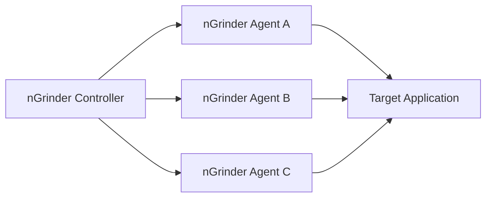
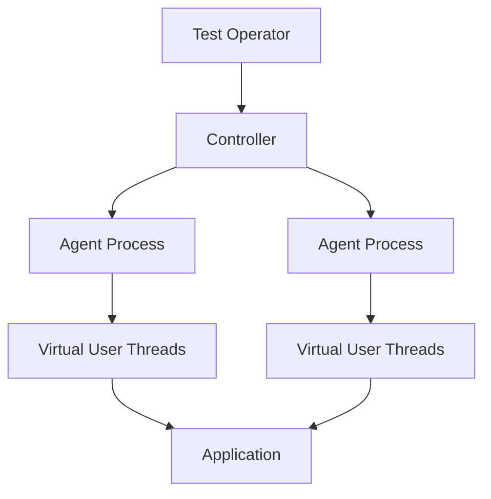
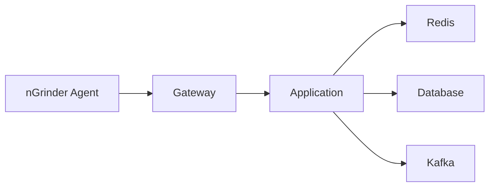
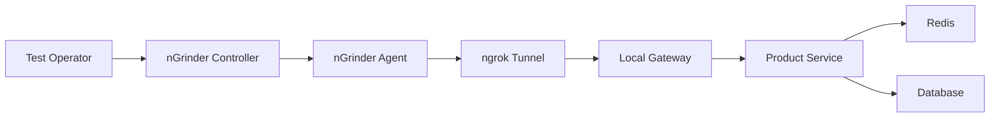
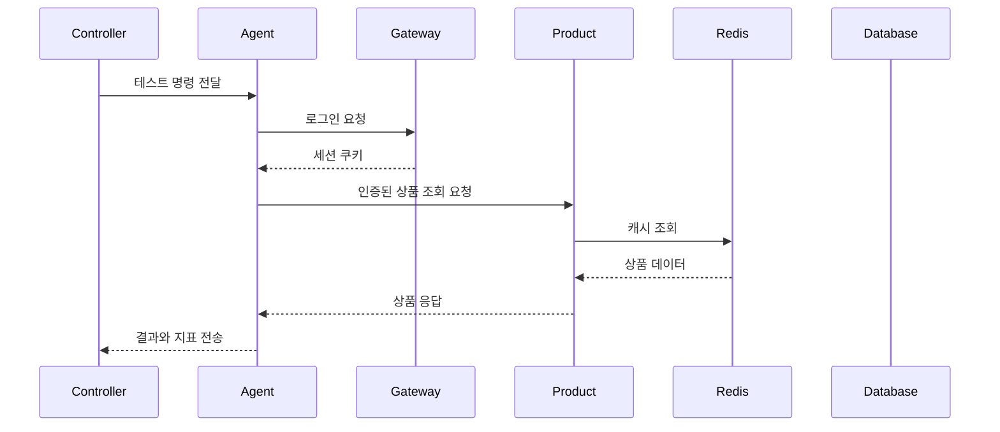
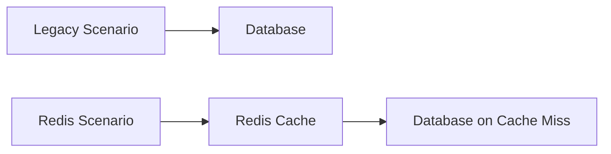

# nGrinder를 활용해 부하테스트 해보기

# nGrinder를 활용해 부하테스트 해보기

* toc
{:toc}

---

## nGrinder로 분산 부하 테스트하기

서비스가 정상적으로 동작한다고 해서 많은 사용자가 동시에 접근해도 안정적인 것은 아니다.

사용자가 적을 때는 응답 속도가 빠르지만, 트래픽이 증가하면 다음과 같은 문제가 발생할 수 있다.

- 응답 시간이 증가한다.
- 데이터베이스 커넥션이 부족해진다.
- Redis 연결이 지연된다.
- Kafka Consumer 처리가 밀린다.
- 일정 요청부터 오류가 발생한다.
- CPU와 메모리 사용량이 급격히 증가한다.

이런 문제를 미리 확인하려면 실제 요청을 반복적으로 발생시키는 부하 테스트가 필요하다.

nGrinder는 웹 기반 화면에서 테스트를 관리하고, 여러 Agent를 사용해 동시에 많은 요청을 발생시킬 수 있는 오픈소스 부하 테스트 플랫폼이다.



---

## 개념

### 부하 테스트란?

부하 테스트는 예상되는 사용량을 시스템에 발생시켜 성능과 안정성을 확인하는 테스트이다.

예를 들어 동시에 500명의 사용자가 상품 조회 API를 호출하는 상황을 만들어 다음 항목을 확인할 수 있다.

- 요청이 모두 처리되는가
- 평균 응답 시간은 얼마인가
- 초당 몇 건의 요청을 처리하는가
- 일정 요청부터 오류가 발생하는가
- 데이터베이스와 Redis의 부하는 어느 정도인가

### 성능 테스트 도구 비교

| 도구 | 특징 |
|---|---|
| Apache JMeter | GUI 기반, 다양한 프로토콜 지원 |
| nGrinder | 웹 UI, 분산 부하 테스트, Groovy 스크립트 |
| Gatling | 코드 기반, 높은 성능, 상세한 HTML 리포트 |

### nGrinder의 구성

nGrinder는 크게 Controller와 Agent로 구성된다.

| 구성 요소 | 역할 |
|---|---|
| Controller | 테스트 관리, 스크립트 관리, 실행 지시, 결과 수집 |
| Agent | 실제 부하 발생, 가상 사용자 실행 |
| Vuser | Agent에서 실행되는 가상 사용자 |
| Process | 테스트 실행 프로세스 |
| Thread | 하나의 Process 안에서 실행되는 요청 단위 |

전체 관계는 다음과 같다.



### Process와 Thread

nGrinder에서 생성되는 가상 사용자 수는 다음과 같이 계산할 수 있다.

```text
총 Vuser 수
=
Agent 수
×
Process 수
×
Thread 수
```

예를 들어 다음과 같이 설정하면 된다.

```text
Agent: 2개
Process: 2개
Thread: 5개

총 Vuser = 2 × 2 × 5 = 20명
```

한 번의 테스트에서 몇 개의 요청을 보낼지는 스크립트의 `requestCount`로 조절할 수 있다.

```text
Vuser 20명
×
requestCount 5회
=
총 100회 요청
```

### TPS

TPS는 `Transaction Per Second`의 약자이다.

1초 동안 처리한 트랜잭션 수를 의미한다.

```text
TPS
=
처리한 요청 수
/
소요 시간(초)
```

예를 들어 10초 동안 1,000건의 요청을 처리했다면 TPS는 다음과 같다.

```text
1,000 / 10 = 100 TPS
```

TPS가 높다고 항상 좋은 것은 아니다. 응답 실패율이 높거나 데이터가 잘못 처리되면 정상적인 성능이라고 할 수 없다.

---

## 왜 사용하는가?

### 실제 동시 요청 확인

테스트 코드에서 반복문으로 API를 호출하는 방식은 순차 요청에 가깝다.

```java
for (String productId : productIds) {
    productService.getProduct(productId);
}
```

실제 사용자 요청은 여러 명이 동시에 들어온다.

```text
사용자 A → 상품 조회
사용자 B → 상품 조회
사용자 C → 상품 조회
사용자 D → 상품 조회
```

nGrinder를 사용하면 여러 Agent와 Vuser를 이용해 동시 요청을 만들 수 있다.

### 병목 구간 확인

부하 테스트를 수행하면 시스템의 어느 부분이 먼저 한계에 도달하는지 확인할 수 있다.



각 구간에서 발생할 수 있는 병목은 다음과 같다.

| 구간 | 주요 병목 |
|---|---|
| Agent | 부하 생성 자원 부족 |
| Gateway | 커넥션과 라우팅 처리량 |
| Application | CPU, 스레드 풀, GC |
| Redis | 연결 수, 메모리, 네트워크 |
| Database | 커넥션 풀, 쿼리, 디스크 |
| Kafka | Producer 전송 지연, Consumer Lag |

### Redis 캐시 적용 효과 검증

캐시를 적용한 뒤에는 실제로 성능이 개선되었는지 확인해야 한다.

```text
캐시 미사용
→ 모든 요청이 데이터베이스 조회

Redis 캐시 사용
→ Cache Hit 요청은 Redis에서 처리
→ 데이터베이스 조회 감소
```

nGrinder로 동일한 요청을 캐시 미사용 환경과 캐시 사용 환경에 각각 보내면 다음 항목을 비교할 수 있다.

- 평균 응답 시간
- TPS
- 오류율
- 데이터베이스 CPU
- Redis 사용량
- 데이터베이스 쿼리 수

---

## 주요 특징

### 부하 테스트

정상적인 예상 트래픽을 발생시켜 시스템이 평상시 부하를 감당할 수 있는지 확인한다.

```text
동시 사용자 100명
→ 10분 동안 상품 조회
```

### 스트레스 테스트

시스템이 처리할 수 있는 범위를 넘어서는 부하를 발생시킨다.

```text
동시 사용자 100명
→ 500명
→ 1,000명
→ 오류가 발생할 때까지 증가
```

시스템의 한계점과 장애 발생 방식을 확인하는 데 사용한다.

### 스파이크 테스트

짧은 시간에 트래픽이 급격히 증가하는 상황을 테스트한다.

```text
평균 50 Vuser
→ 갑자기 1,000 Vuser
```

이벤트, 할인 행사, 알림 발송 직후와 같은 상황을 검증할 때 유용하다.

### 내구성 테스트

장시간 일정한 부하를 유지해 시스템이 안정적으로 동작하는지 확인한다.

```text
동시 사용자 100명
→ 1시간 또는 24시간 유지
```

다음 문제를 확인할 수 있다.

- 메모리 누수
- 커넥션 반환 누락
- Redis 메모리 증가
- Kafka Consumer 지연 누적
- 로그 파일 증가
- 스레드 고갈

### 볼륨 테스트

대량의 데이터를 대상으로 성능을 테스트한다.

```text
상품 1,000개
→ 상품 10,000개
→ 상품 1,000,000개
```

데이터의 양이 증가할 때 조회 시간과 메모리 사용량이 어떻게 변하는지 확인할 수 있다.

### 확장성 테스트

사용자 수나 서버 수를 늘렸을 때 성능이 어떻게 변하는지 확인한다.

```text
Application 1대
→ Application 2대
→ Application 4대
```

서버를 추가했을 때 TPS가 증가하는지, 특정 공유 자원에 병목이 발생하는지 확인할 수 있다.

---

## 예제

### Docker Compose 구성

nGrinder와 테스트 대상 인프라를 함께 실행하는 `compose.yml` 예시는 다음과 같다.

```yaml
services:
  kafka00:
    image: bitnami/kafka:3.7.0
    restart: unless-stopped
    container_name: kafka00
    ports:
      - "10000:9094"
    environment:
      KAFKA_CFG_AUTO_CREATE_TOPICS_ENABLE: "true"
      KAFKA_CFG_BROKER_ID: 0
      KAFKA_CFG_NODE_ID: 0
      KAFKA_KRAFT_CLUSTER_ID: "HsDBs9l6UUmQq7Y5E6bNlw"
      KAFKA_CFG_CONTROLLER_QUORUM_VOTERS: "0@kafka00:9093,1@kafka01:9093,2@kafka02:9093"
      KAFKA_CFG_PROCESS_ROLES: "controller,broker"
      KAFKA_CFG_LISTENERS: "INTERNAL://:9092,EXTERNAL://:9094,CONTROLLER://:9093"
      KAFKA_CFG_ADVERTISED_LISTENERS: "INTERNAL://kafka00:9092,EXTERNAL://localhost:10000"
      KAFKA_CFG_LISTENER_SECURITY_PROTOCOL_MAP: "INTERNAL:PLAINTEXT,EXTERNAL:PLAINTEXT,CONTROLLER:PLAINTEXT"
      KAFKA_CFG_CONTROLLER_LISTENER_NAMES: "CONTROLLER"
      KAFKA_CFG_INTER_BROKER_LISTENER_NAME: "INTERNAL"
      KAFKA_CFG_OFFSETS_TOPIC_REPLICATION_FACTOR: 3
      KAFKA_CFG_TRANSACTION_STATE_LOG_REPLICATION_FACTOR: 3
      KAFKA_CFG_TRANSACTION_STATE_LOG_MIN_ISR: 2
      ALLOW_PLAINTEXT_LISTENER: "yes"
    volumes:
      - ./volumes/data/kafka/kafka00:/bitnami/kafka
    networks:
      - my_network

  kafka01:
    image: bitnami/kafka:3.7.0
    restart: unless-stopped
    container_name: kafka01
    ports:
      - "10001:9094"
    environment:
      KAFKA_CFG_AUTO_CREATE_TOPICS_ENABLE: "true"
      KAFKA_CFG_BROKER_ID: 1
      KAFKA_CFG_NODE_ID: 1
      KAFKA_KRAFT_CLUSTER_ID: "HsDBs9l6UUmQq7Y5E6bNlw"
      KAFKA_CFG_CONTROLLER_QUORUM_VOTERS: "0@kafka00:9093,1@kafka01:9093,2@kafka02:9093"
      KAFKA_CFG_PROCESS_ROLES: "controller,broker"
      KAFKA_CFG_LISTENERS: "INTERNAL://:9092,EXTERNAL://:9094,CONTROLLER://:9093"
      KAFKA_CFG_ADVERTISED_LISTENERS: "INTERNAL://kafka01:9092,EXTERNAL://localhost:10001"
      KAFKA_CFG_LISTENER_SECURITY_PROTOCOL_MAP: "INTERNAL:PLAINTEXT,EXTERNAL:PLAINTEXT,CONTROLLER:PLAINTEXT"
      KAFKA_CFG_CONTROLLER_LISTENER_NAMES: "CONTROLLER"
      KAFKA_CFG_INTER_BROKER_LISTENER_NAME: "INTERNAL"
      KAFKA_CFG_OFFSETS_TOPIC_REPLICATION_FACTOR: 3
      KAFKA_CFG_TRANSACTION_STATE_LOG_REPLICATION_FACTOR: 3
      KAFKA_CFG_TRANSACTION_STATE_LOG_MIN_ISR: 2
      ALLOW_PLAINTEXT_LISTENER: "yes"
    volumes:
      - ./volumes/data/kafka/kafka01:/bitnami/kafka
    networks:
      - my_network

  kafka02:
    image: bitnami/kafka:3.7.0
    restart: unless-stopped
    container_name: kafka02
    ports:
      - "10002:9094"
    environment:
      KAFKA_CFG_AUTO_CREATE_TOPICS_ENABLE: "true"
      KAFKA_CFG_BROKER_ID: 2
      KAFKA_CFG_NODE_ID: 2
      KAFKA_KRAFT_CLUSTER_ID: "HsDBs9l6UUmQq7Y5E6bNlw"
      KAFKA_CFG_CONTROLLER_QUORUM_VOTERS: "0@kafka00:9093,1@kafka01:9093,2@kafka02:9093"
      KAFKA_CFG_PROCESS_ROLES: "controller,broker"
      KAFKA_CFG_LISTENERS: "INTERNAL://:9092,EXTERNAL://:9094,CONTROLLER://:9093"
      KAFKA_CFG_ADVERTISED_LISTENERS: "INTERNAL://kafka02:9092,EXTERNAL://localhost:10002"
      KAFKA_CFG_LISTENER_SECURITY_PROTOCOL_MAP: "INTERNAL:PLAINTEXT,EXTERNAL:PLAINTEXT,CONTROLLER:PLAINTEXT"
      KAFKA_CFG_CONTROLLER_LISTENER_NAMES: "CONTROLLER"
      KAFKA_CFG_INTER_BROKER_LISTENER_NAME: "INTERNAL"
      KAFKA_CFG_OFFSETS_TOPIC_REPLICATION_FACTOR: 3
      KAFKA_CFG_TRANSACTION_STATE_LOG_REPLICATION_FACTOR: 3
      KAFKA_CFG_TRANSACTION_STATE_LOG_MIN_ISR: 2
      ALLOW_PLAINTEXT_LISTENER: "yes"
    volumes:
      - ./volumes/data/kafka/kafka02:/bitnami/kafka
    networks:
      - my_network

  kafka-ui:
    image: provectuslabs/kafka-ui:latest
    restart: unless-stopped
    container_name: kafka-ui
    ports:
      - "9000:8080"
    environment:
      KAFKA_CLUSTERS_0_NAME: "Local-Kraft-Cluster"
      KAFKA_CLUSTERS_0_BOOTSTRAPSERVERS: "kafka00:9092,kafka01:9092,kafka02:9092"
      KAFKA_CLUSTERS_0_SCHEMAREGISTRY: "http://schema-registry:8081"
      DYNAMIC_CONFIG_ENABLED: "true"
      KAFKA_CLUSTERS_0_AUDIT_TOPICAUDITENABLED: "true"
      KAFKA_CLUSTERS_0_AUDIT_CONSOLEAUDITENABLED: "true"
    depends_on:
      - kafka00
      - kafka01
      - kafka02
      - schema-registry
    networks:
      - my_network

  schema-registry:
    image: confluentinc/cp-schema-registry:7.5.0
    restart: unless-stopped
    container_name: schema-registry
    ports:
      - "9001:8081"
    environment:
      SCHEMA_REGISTRY_KAFKASTORE_BOOTSTRAP_SERVERS: "kafka00:9092,kafka01:9092,kafka02:9092"
      SCHEMA_REGISTRY_HOST_NAME: "schema-registry"
      SCHEMA_REGISTRY_LISTENERS: "http://0.0.0.0:8081"
      SCHEMA_REGISTRY_KAFKASTORE_TOPIC_REPLICATION_FACTOR: 3
      SCHEMA_REGISTRY_KAFKASTORE_TOPIC_CONFIGS: "cleanup.policy=compact"
      SCHEMA_REGISTRY_CONFIG_DELETION: "true"
    depends_on:
      - kafka00
      - kafka01
      - kafka02
    networks:
      - my_network

  redis-cluster:
    image: grokzen/redis-cluster:7.0.15
    container_name: redis-cluster-6
    environment:
      IP: "0.0.0.0"
      BIND_ADDRESS: "0.0.0.0"
      INITIAL_PORT: 7001
      MASTERS: 3
      SLAVES_PER_MASTER: 1
    ports:
      - "7001-7006:7001-7006"
    volumes:
      - ./volumes/data/redis/1:/redis-data/7001
      - ./volumes/data/redis/2:/redis-data/7002
      - ./volumes/data/redis/3:/redis-data/7003
      - ./volumes/data/redis/4:/redis-data/7004
      - ./volumes/data/redis/5:/redis-data/7005
      - ./volumes/data/redis/6:/redis-data/7006
    networks:
      - my_network

  mysql:
    image: mysql:8
    container_name: mysql
    ports:
      - "3306:3306"
    environment:
      MYSQL_ROOT_PASSWORD: "test"
      MYSQL_DATABASE: "test"
      MYSQL_USER: "test"
      MYSQL_PASSWORD: "test"
    volumes:
      - ./volumes/data/mysql:/var/lib/mysql
    networks:
      - my_network

  controller:
    image: ngrinder/controller:3.5.5
    restart: always
    container_name: controller
    ports:
      - "8100:80"
      - "16001:16001"
      - "12000-12009:12000-12009"
    networks:
      - my_network

  agent:
    image: ngrinder/agent:3.5.5
    restart: always
    container_name: agent
    depends_on:
      - controller
    links:
      - controller
    networks:
      - my_network

networks:
  my_network:
    driver: bridge
```

### Docker Compose 주요 옵션

#### Kafka

```yaml
KAFKA_CFG_PROCESS_ROLES: "controller,broker"
```

Kafka를 KRaft 모드로 실행한다는 의미이다. 별도의 ZooKeeper 없이 Kafka 자체의 Controller 기능을 사용할 수 있다.

```yaml
KAFKA_CFG_CONTROLLER_QUORUM_VOTERS: "0@kafka00:9093,1@kafka01:9093,2@kafka02:9093"
```

Kafka Controller 노드의 목록이다.

```yaml
KAFKA_CFG_ADVERTISED_LISTENERS: "INTERNAL://kafka00:9092,EXTERNAL://localhost:10000"
```

컨테이너 내부에서 접근하는 주소와 호스트 운영체제에서 접근하는 주소를 분리한다.

| Listener | 접근 위치 |
|---|---|
| `INTERNAL` | Docker 네트워크 내부 |
| `EXTERNAL` | 호스트 운영체제 또는 외부 클라이언트 |

#### Redis Cluster

```yaml
MASTERS: 3
SLAVES_PER_MASTER: 1
```

마스터 3개와 마스터당 Replica 1개를 구성한다.

```text
Master 3대
Replica 3대
총 6개 Redis 노드
```

#### nGrinder Controller

```yaml
ports:
  - "8100:80"
```

호스트의 8100번 포트를 컨테이너의 80번 포트와 연결한다.

```text
http://localhost:8100
```

브라우저에서 위 주소로 접속하면 nGrinder 화면을 확인할 수 있다.

```yaml
ports:
  - "12000-12009:12000-12009"
```

nGrinder Agent가 테스트를 수행할 때 사용하는 포트 범위를 노출한다.

### 실행 방법

먼저 Compose 서비스를 실행한다.

```bash
docker compose up -d
```

실행 결과 예시는 다음과 같다.

```text
[+] Running 9/9
 ✔ Container kafka00          Started
 ✔ Container kafka01          Started
 ✔ Container kafka02          Started
 ✔ Container kafka-ui         Started
 ✔ Container schema-registry  Started
 ✔ Container redis-cluster-6  Started
 ✔ Container mysql            Started
 ✔ Container controller       Started
 ✔ Container agent            Started
```

실행 중인 컨테이너를 확인한다.

```bash
docker compose ps
```

실행 결과 예시는 다음과 같다.

```text
NAME              SERVICE          STATUS
kafka00           kafka00          running
kafka01           kafka01          running
kafka02           kafka02          running
kafka-ui          kafka-ui         running
schema-registry   schema-registry  running
redis-cluster-6   redis-cluster    running
mysql             mysql            running
controller        controller       running
agent             agent            running
```

nGrinder Controller 로그는 다음과 같이 확인할 수 있다.

```bash
docker compose logs -f controller
```

Agent 로그는 다음과 같이 확인한다.

```bash
docker compose logs -f agent
```

### nGrinder 접속

브라우저에서 다음 주소로 접속한다.

```text
http://localhost:8100
```

초기 로그인 정보는 다음과 같다.

```text
아이디: admin
비밀번호: admin
```

실제 운영 환경에서는 최초 로그인 후 반드시 비밀번호를 변경해야 한다.

### Agent 확인

nGrinder 화면에서 다음 메뉴를 확인한다.

```text
admin
→ Agent Management
```

Agent가 정상적으로 연결되면 테스트에 사용할 수 있는 Agent 목록이 표시된다.

Agent가 보이지 않거나 연결되지 않는 경우 로그를 확인한다.

```bash
docker exec -it agent sh
```

컨테이너 내부에서 Controller 주소를 확인한다.

```bash
ping controller
```

Windows 환경에서 `controller` 주소를 찾지 못하는 경우 다음 파일을 수정할 수 있다.

```text
C:\Windows\System32\drivers\etc\hosts
```

파일 마지막에 다음 내용을 추가한다.

```text
127.0.0.1 controller
```

관리자 권한으로 메모장을 실행해야 hosts 파일을 수정할 수 있다.

### ngrok을 이용한 외부 접근

nGrinder Controller와 Agent는 Docker에서 실행되고, 테스트 대상 애플리케이션은 로컬 운영체제에서 실행될 수 있다.

이 경우 Docker 내부에서 호스트의 `localhost:8080`에 접근하면 Docker 컨테이너 자신을 의미한다. 로컬 애플리케이션에 접근하려면 외부 터널이 필요할 수 있다.

ngrok은 로컬 포트를 외부 URL로 연결해 주는 터널링 도구이다.

Windows에서 실행한다.

```powershell
.\ngrok.exe http 8080
```

macOS나 Linux에서는 다음과 같이 실행한다.

```bash
ngrok http 8080
```

실행 결과 예시는 다음과 같다.

```text
Forwarding
https://example.ngrok-free.app -> http://localhost:8080
```

nGrinder 스크립트에서는 `Forwarding`에 표시된 주소를 사용한다.

```groovy
def baseUrl =
    "https://example.ngrok-free.app"
```

ngrok 프로세스를 종료하면 터널도 종료되므로 테스트가 진행되는 동안 터미널을 유지해야 한다.

무료 플랜은 요청 수, 연결 수, 실행 시간 등에 제한이 있을 수 있다. 제한에 도달하면 403 오류나 연결 실패가 발생할 수 있으므로 테스트 요청 수를 무리하게 늘리지 않는 것이 좋다.

---

## 구조

nGrinder 테스트 구조는 다음과 같다.



테스트 실행 과정은 다음과 같다.



### 테스트 스크립트

nGrinder는 Groovy 기반의 테스트 스크립트를 사용할 수 있다.

```groovy
import static net.grinder.script.Grinder.grinder
import static org.junit.Assert.assertEquals

import net.grinder.script.GTest
import net.grinder.script.Grinder
import net.grinder.scriptengine.groovy.junit.GrinderRunner
import net.grinder.scriptengine.groovy.junit.annotation.BeforeProcess
import net.grinder.scriptengine.groovy.junit.annotation.BeforeThread

import org.junit.Before
import org.junit.Test
import org.junit.runner.RunWith

import org.ngrinder.http.HTTPRequest
import org.ngrinder.http.HTTPRequestControl
import org.ngrinder.http.HTTPResponse
import org.ngrinder.http.cookie.Cookie
import org.ngrinder.http.cookie.CookieManager

@RunWith(GrinderRunner)
class TestRunner {

    public static GTest test

    public static HTTPRequest request

    public static Map<String, String> headers = [:]

    public static List<Cookie> cookies = []

    public static int requestCount = 1

    @BeforeProcess
    public static void beforeProcess() {
        HTTPRequestControl.setConnectionTimeout(
            300000
        )

        test = new GTest(
            1,
            "Product Read Test"
        )

        request = new HTTPRequest()

        def grinderProperties =
            grinder.properties

        if (
            grinderProperties.containsKey(
                "requestCount"
            )
        ) {
            requestCount =
                grinderProperties[
                    "requestCount"
                ] as int
        }

        grinder.logger.info(
            "before process"
        )
    }

    @BeforeThread
    public void beforeThread() {
        test.record(
            this,
            "test"
        )

        grinder.statistics.delayReports =
            true

        grinder.logger.info(
            "before thread"
        )
    }

    @Before
    public void before() {
        headers.clear()

        request.setHeaders(
            headers
        )

        CookieManager.addCookies(
            cookies
        )

        grinder.logger.info(
            "before request"
        )
    }

    @Test
    public void test() {
        def baseUrl =
            grinder.properties[
                "baseUrl"
            ] ?: "https://example.ngrok-free.app"

        def loginUrl =
            baseUrl + "/api/auth/login"

        headers[
            "Content-Type"
        ] =
            "application/x-www-form-urlencoded"

        request.setHeaders(
            headers
        )

        def loginParams = [
            username: "admin",
            password: "admin"
        ]

        HTTPResponse loginResponse =
            request.POST(
                loginUrl,
                loginParams
            )

        grinder.logger.info(
            "Login status: "
                + loginResponse.statusCode
        )

        assertEquals(
            200,
            loginResponse.statusCode
        )

        def receivedCookies =
            CookieManager.getCookies()

        if (
            receivedCookies.isEmpty()
        ) {
            grinder.logger.warn(
                "No cookies received after login"
            )
        } else {
            cookies.addAll(
                receivedCookies
            )

            CookieManager.addCookies(
                cookies
            )

            grinder.logger.info(
                "Cookies after login: "
                    + cookies
            )
        }

        headers.remove(
            "Content-Type"
        )

        request.setHeaders(
            headers
        )

        def productId =
            grinder.properties[
                "productId"
            ] ?: "product-1001"

        def productUrl =
            baseUrl
                + "/api/product/"
                + productId

        for (
            int index = 0;
            index < requestCount;
            index++
        ) {
            HTTPResponse response =
                request.GET(
                    productUrl
                )

            grinder.logger.info(
                "Request "
                    + (index + 1)
                    + " status: "
                    + response.statusCode
            )

            assertEquals(
                200,
                response.statusCode
            )
        }
    }
}
```

### 스크립트 주요 영역

#### `@BeforeProcess`

각 Process가 시작될 때 한 번 실행된다.

```groovy
@BeforeProcess
public static void beforeProcess() {
    request =
        new HTTPRequest()
}
```

Process 단위로 공통 설정을 초기화하는 데 사용한다.

```groovy
def grinderProperties =
    grinder.properties

if (
    grinderProperties.containsKey(
        "requestCount"
    )
) {
    requestCount =
        grinderProperties[
            "requestCount"
        ] as int
}
```

nGrinder 화면이나 실행 옵션에서 전달한 프로퍼티를 읽을 수 있다.

#### `@BeforeThread`

각 Thread가 시작될 때 실행된다.

```groovy
@BeforeThread
public void beforeThread() {
    test.record(
        this,
        "test"
    )

    grinder.statistics.delayReports =
        true
}
```

테스트 통계 기록과 Thread별 설정을 수행한다.

#### `@Before`

각 테스트 요청 전에 실행된다.

```groovy
@Before
public void before() {
    headers.clear()
    request.setHeaders(headers)
    CookieManager.addCookies(cookies)
}
```

헤더와 쿠키를 초기화하거나 공통 요청 조건을 설정할 수 있다.

#### `@Test`

실제로 부하를 발생시키는 메서드이다.

```groovy
@Test
public void test() {
    request.GET(productUrl)
}
```

하나의 Vuser가 실행할 시나리오를 작성한다.

### 로그인과 세션 쿠키

상품 API가 인증을 필요로 한다면 먼저 로그인해야 한다.

```groovy
def loginParams = [
    username: "admin",
    password: "admin"
]

def loginResponse =
    request.POST(
        loginUrl,
        loginParams
    )
```

로그인에 성공하면 세션 쿠키를 가져온다.

```groovy
def receivedCookies =
    CookieManager.getCookies()

cookies.addAll(
    receivedCookies
)

CookieManager.addCookies(
    cookies
)
```

이후 상품 조회 요청에 세션 쿠키가 포함된다.

```groovy
def response =
    request.GET(productUrl)
```

로그인 요청을 매번 포함하면 상품 조회 성능뿐 아니라 로그인 성능도 함께 측정된다. 상품 조회만 측정하려면 로그인은 `@BeforeThread`에서 한 번만 수행하고, `@Test`에서는 상품 조회만 반복하는 방식이 더 적합하다.

---

## 실무에서의 활용

### nGrinder Performance Test 설정

nGrinder 화면에서 `Performance Test`를 생성하고 다음 항목을 설정한다.

| 항목 | 의미 |
|---|---|
| Agent | 사용할 Agent 수 |
| Vuser per agent | Agent별 가상 사용자 수 |
| Process | Agent에서 실행할 Process 수 |
| Thread | Process별 Thread 수 |
| Enable Ramp-Up | 부하를 단계적으로 증가 |
| Interval | Ramp-Up 증가 간격 |
| Script | 실행할 Groovy 스크립트 |

예를 들어 다음과 같이 설정할 수 있다.

```text
Agent: 1
Vuser per agent: 10
Process: 2
Thread: 5
```

이 경우 총 Vuser 수는 다음과 같다.

```text
1 × 2 × 5 = 10 Vuser
```

`Vuser per agent`는 일반적으로 다음과 같이 계산한다.

```text
Process × Thread
```

### Ramp-Up

Ramp-Up은 테스트 시작부터 모든 부하를 한 번에 발생시키지 않고 단계적으로 증가시키는 기능이다.

```text
0 Vuser
→ 10 Vuser
→ 20 Vuser
→ 30 Vuser
```

갑자기 모든 요청을 보내는 것보다 실제 트래픽 증가 상황을 관찰하기 좋다.

Ramp-Up을 사용하면 다음 항목을 확인하기 쉽다.

- 어느 Vuser부터 응답 시간이 증가하는가
- 어느 시점부터 오류가 발생하는가
- Redis나 데이터베이스가 먼저 한계에 도달하는가
- 서버의 CPU와 메모리가 어떻게 증가하는가

### 테스트 시나리오 분리

하나의 스크립트에서 로그인, 상품 조회, 주문 생성을 모두 수행하면 어떤 API가 병목인지 파악하기 어렵다.

다음과 같이 테스트를 분리하는 것이 좋다.

| 테스트 | 목적 |
|---|---|
| 로그인 테스트 | 인증과 세션 처리량 확인 |
| 상품 조회 테스트 | Redis 캐시 성능 확인 |
| 상품 수정 테스트 | 캐시 갱신과 데이터베이스 부하 확인 |
| 재고 차감 테스트 | 분산 락과 동시성 확인 |
| 주문 생성 테스트 | Kafka 이벤트와 주문 처리 확인 |
| 혼합 시나리오 | 실제 사용자 행동과 유사한 부하 확인 |

### 상품 조회 테스트

상품 조회 테스트는 Redis 캐시 적용 전후를 비교할 수 있다.

```text
시나리오 A
→ Product Service
→ Database 직접 조회

시나리오 B
→ Product Service
→ Redis Cache 조회
```

확인할 지표는 다음과 같다.

- 평균 응답 시간
- p95 응답 시간
- TPS
- 데이터베이스 CPU
- Redis Hit Rate
- 오류율

캐시가 적용되어도 Cache Miss 비율이 높으면 기대한 성능 개선이 나타나지 않을 수 있다.

### 재고 차감 테스트

재고 차감은 동시에 같은 상품을 주문하도록 테스트해야 한다.

```text
초기 재고: 100
동시 요청: 200
요청 수량: 1
```

정상적인 결과는 다음과 같다.

```text
성공 요청: 100
실패 요청: 100
최종 재고: 0
```

분산 락이 정상적으로 동작하지 않으면 다음과 같은 문제가 발생할 수 있다.

```text
성공 요청: 200
최종 재고: 음수 또는 잘못된 수량
```

재고 테스트에서는 단순히 HTTP 응답 코드만 확인하면 안 된다. 테스트가 끝난 뒤 데이터베이스의 최종 재고와 성공 주문 수를 비교해야 한다.

### 부하 테스트 결과 해석

nGrinder에서 확인할 수 있는 대표적인 결과는 다음과 같다.

| 지표 | 설명 |
|---|---|
| TPS | 초당 처리한 요청 수 |
| Mean Test Time | 평균 응답 시간 |
| Errors | 실패한 요청 수 |
| Successful Tests | 성공한 요청 수 |
| Active Users | 현재 동작 중인 가상 사용자 |
| Peak TPS | 테스트 중 가장 높은 TPS |

예를 들어 다음과 같은 결과가 나왔다고 가정해 보자.

```text
전체 요청: 120
성공 요청: 54
실패 요청: 66
```

이 경우 성공률은 다음과 같다.

```text
54 / 120 × 100 = 45%
```

요청 절반 이상이 실패했기 때문에 TPS가 표시되더라도 안정적인 시스템이라고 볼 수 없다.

실패 원인을 확인해야 한다.

- ngrok 요청 제한
- 서버 응답 시간 초과
- 로그인 실패
- 세션 쿠키 전달 실패
- Redis 연결 실패
- 데이터베이스 커넥션 부족
- 애플리케이션 예외
- Gateway 라우팅 오류

### ngrok 사용 시 주의점

ngrok을 사용하면 nGrinder Agent가 외부 URL을 통해 로컬 애플리케이션에 접근할 수 있다.

```text
nGrinder Agent
→ ngrok URL
→ localhost:8080
```

하지만 무료 터널은 다음 제한이 있을 수 있다.

- 분당 요청 수 제한
- 동시 연결 제한
- 세션 시간 제한
- 터널 URL 변경
- 트래픽 제한

따라서 nGrinder 결과에서 403이나 429가 발생하면 애플리케이션이 아니라 ngrok 제한일 수 있다.

테스트 전에 직접 호출해 연결을 확인한다.

```bash
curl https://example.ngrok-free.app/actuator/health
```

실행 결과 예시는 다음과 같다.

```json
{
  "status": "UP"
}
```

이 응답이 정상적으로 반환된 뒤 nGrinder 테스트를 시작하는 것이 좋다.

### 단계별 테스트 계획

부하를 한 번에 크게 올리기보다 단계적으로 증가시킨다.

```text
1단계: 10 Vuser, 1분
2단계: 50 Vuser, 1분
3단계: 100 Vuser, 1분
4단계: 200 Vuser, 1분
```

각 단계에서 다음 값을 기록한다.

| 단계 | Vuser | TPS | 평균 응답 시간 | 오류율 |
|---|---:|---:|---:|---:|
| 1단계 | 10 | 측정값 | 측정값 | 측정값 |
| 2단계 | 50 | 측정값 | 측정값 | 측정값 |
| 3단계 | 100 | 측정값 | 측정값 | 측정값 |
| 4단계 | 200 | 측정값 | 측정값 | 측정값 |

응답 시간이 급격히 증가하거나 오류율이 올라가는 지점이 시스템의 현재 한계에 가까운 구간이다.

### Redis 캐시 성능 비교

캐시 미사용 환경과 캐시 사용 환경을 동일하게 테스트한다.



비교 예시는 다음과 같다.

| 항목 | 캐시 미사용 | Redis 캐시 |
|---|---:|---:|
| 평균 응답 시간 | 120ms | 25ms |
| TPS | 80 | 350 |
| DB QPS | 높음 | 낮음 |
| Redis 사용량 | 낮음 | 높음 |
| 오류율 | 측정값 | 측정값 |

Redis 캐시를 적용하면 데이터베이스 부하는 감소하지만 Redis의 메모리와 네트워크 사용량은 증가할 수 있다. 한쪽 지표만 보고 성능을 판단하면 안 된다.

---

## 정리

nGrinder는 Controller와 Agent로 구성된 분산 부하 테스트 플랫폼이다.

Controller는 테스트 스크립트와 실행 설정을 관리하고, Agent는 실제 요청을 발생시킨다. Process와 Thread 수를 조절해 가상 사용자 수를 늘릴 수 있으며, Ramp-Up을 사용하면 부하를 단계적으로 증가시킬 수 있다.

```text
총 Vuser
=
Agent 수
×
Process 수
×
Thread 수
```

부하 테스트를 진행할 때는 다음 순서가 적합하다.

1. Docker Compose로 nGrinder Controller와 Agent를 실행한다.
2. `http://localhost:8100`에서 Controller에 접속한다.
3. Agent가 정상적으로 연결되었는지 확인한다.
4. ngrok으로 로컬 Gateway를 외부에 연결한다.
5. Groovy 테스트 스크립트를 작성한다.
6. 로그인과 세션 쿠키 전달을 확인한다.
7. 상품 조회나 주문 API를 대상으로 테스트한다.
8. Vuser와 Ramp-Up 설정을 단계적으로 증가시킨다.
9. TPS, 응답 시간, 오류율을 확인한다.
10. 애플리케이션, Redis, 데이터베이스, Kafka 지표를 함께 분석한다.

부하 테스트는 단순히 TPS를 높이는 것이 목적이 아니다. 정상적인 요청이 처리되는지, 오류율이 증가하지 않는지, 데이터가 정확하게 저장되는지, 시스템의 병목 구간이 어디인지 확인하는 것이 핵심이다.

특히 Redis 캐시나 분산 락을 적용한 경우에는 캐시 적중률, 데이터베이스 부하, 최종 재고 수량, 중복 주문 여부까지 함께 확인해야 한다.

---

### 한 줄 요약

nGrinder는 여러 Agent와 가상 사용자를 이용해 실제 트래픽을 시뮬레이션하고, TPS·응답 시간·오류율·데이터 정합성을 함께 확인할 수 있는 분산 부하 테스트 도구이다.
