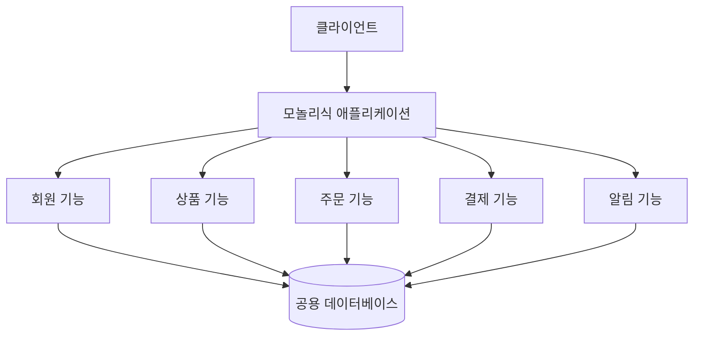
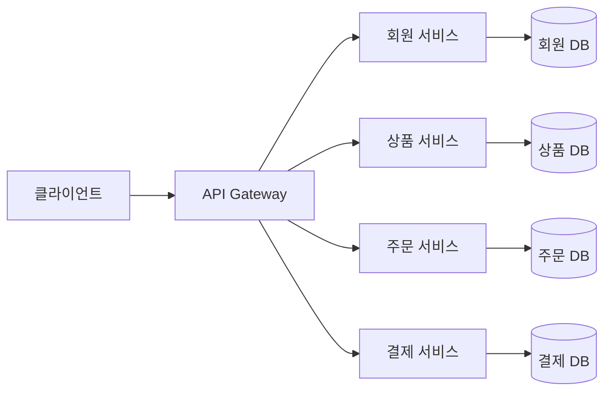
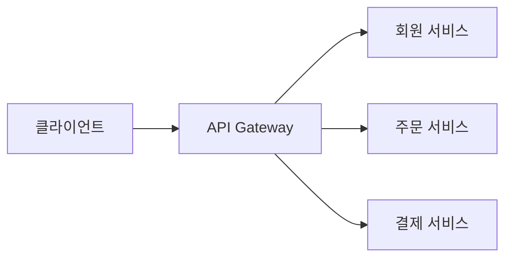
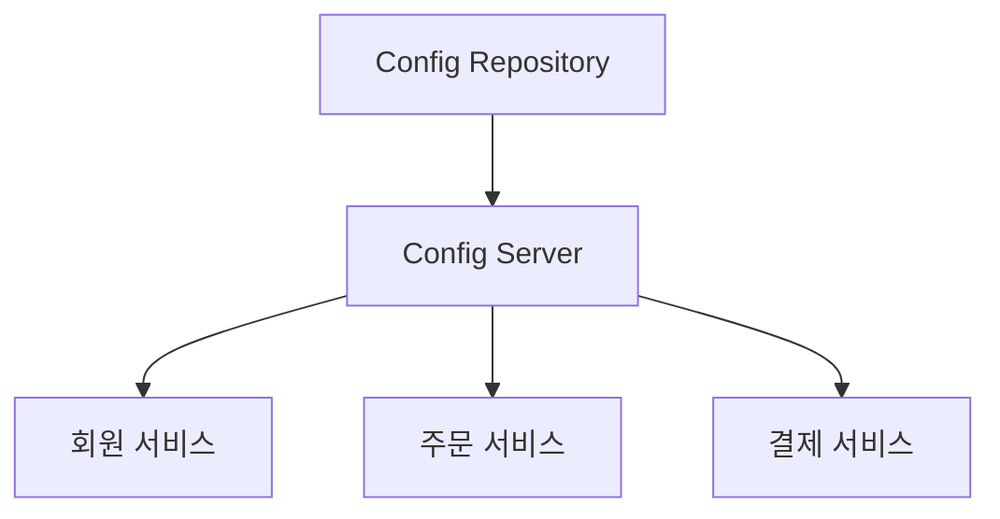
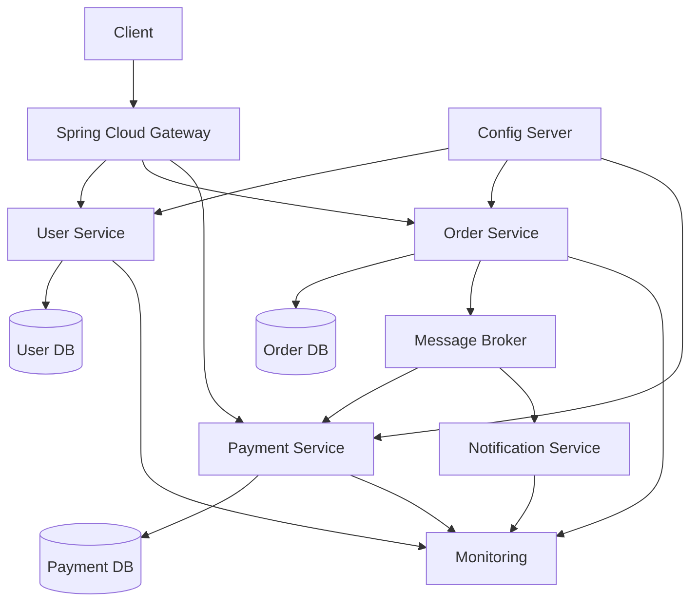

# 스프링 클라우드 MSA 1 - MSA란?
[https://youtu.be/O1un1Nf810Y?si=1gW2KBVOIVFWCDF9](https://youtu.be/O1un1Nf810Y?si=1gW2KBVOIVFWCDF9)

# 스프링 클라우드 MSA 1 - MSA란?
* toc
{:toc}

---

## MSA란 무엇인가? 모놀리식과 비교해 이해하는 마이크로서비스 아키텍처

MSA는 Microservices Architecture의 약자로, 하나의 거대한 애플리케이션을 여러 개의 작고 독립적인 서비스로 분리하여 개발하고 운영하는 아키텍처 방식이다.

각 서비스는 특정 비즈니스 기능을 담당하며, 독립적으로 개발·배포·확장될 수 있다.

예를 들어 하나의 쇼핑몰을 다음과 같이 분리할 수 있다.

```text
회원 서비스
상품 서비스
주문 서비스
결제 서비스
배송 서비스
알림 서비스
```

각 서비스는 서로 다른 애플리케이션으로 실행될 수 있으며, 필요에 따라 독립적인 데이터베이스를 가질 수 있다.

MSA의 핵심은 단순히 프로젝트를 여러 개로 나누는 것이 아니다.

> 비즈니스 책임, 배포 단위, 장애 범위, 데이터 소유권을 서비스 단위로 분리하는 것이 MSA의 본질이다.

---

## 서비스 아키텍처란 무엇인가?

서비스 아키텍처는 애플리케이션의 기능과 코드를 어떤 구조로 배치하고 실행할지를 결정하는 방식이다.

대표적인 구성 방식은 다음과 같다.

```text
모놀리식 아키텍처
마이크로서비스 아키텍처
```

모놀리식은 하나의 애플리케이션에 대부분의 기능을 모아 구성한다.

MSA는 기능을 여러 개의 독립적인 서비스로 나눈다.

두 방식 중 하나가 무조건 더 좋은 것은 아니다. 서비스 규모, 팀 구조, 배포 빈도, 운영 역량에 따라 적절한 방식이 달라진다.

---

## 모놀리식 아키텍처란?

모놀리식 아키텍처는 하나의 애플리케이션 안에 여러 비즈니스 기능을 함께 구현하는 방식이다.

예를 들어 하나의 Spring Boot 프로젝트 안에 다음 기능이 모두 포함될 수 있다.

```text
회원가입
로그인
게시글 작성
게시글 조회
주문
결제
마이페이지
관리자 기능
```

전체 구조는 다음과 같다.



모든 기능이 하나의 프로젝트와 배포 단위로 묶여 있다.

---

## 모놀리식의 장점

모놀리식은 구조가 단순하기 때문에 초기 개발에 유리하다.

### 개발 환경 구성이 단순하다

하나의 프로젝트만 실행하면 대부분의 기능을 테스트할 수 있다.

```text
Application 1개
Database 1개
배포 파일 1개
```

서비스 간 네트워크 통신이나 분산 트랜잭션을 고려할 필요도 적다.

### 트랜잭션 관리가 쉽다

하나의 데이터베이스를 사용한다면 여러 도메인의 작업을 하나의 로컬 트랜잭션으로 처리할 수 있다.

예를 들어 주문 생성과 재고 차감을 하나의 트랜잭션으로 묶을 수 있다.

```java
@Transactional
public void createOrder() {
    orderRepository.save(order);
    inventoryRepository.decreaseStock(productId);
}
```

중간에 오류가 발생하면 전체 작업을 함께 롤백할 수 있다.

### 디버깅이 상대적으로 쉽다

하나의 프로세스 안에서 요청이 처리되므로 호출 흐름을 추적하기 쉽다.

```text
Controller
→ Service
→ Repository
→ Database
```

분산 추적 시스템 없이도 로그와 디버거로 문제를 확인할 수 있다.

### 초기 운영 비용이 낮다

운영해야 할 애플리케이션 수가 적기 때문에 배포, 로그 수집, 모니터링, 장애 대응 체계도 단순하다.

---

## 모놀리식의 단점

서비스가 커질수록 하나의 애플리케이션에 많은 기능과 코드가 집중된다.

### 전체 애플리케이션을 함께 배포해야 한다

주문 기능만 수정했더라도 전체 애플리케이션을 다시 빌드하고 배포해야 할 수 있다.

```text
주문 코드 변경
→ 전체 애플리케이션 빌드
→ 전체 애플리케이션 배포
```

변경 영향 범위가 커지고 배포 위험도 증가한다.

### 특정 기능만 독립적으로 확장하기 어렵다

주문 요청이 급격히 증가했지만 마이페이지 요청은 거의 없다고 가정해보자.

모놀리식에서는 주문 기능만 확장하기 어렵기 때문에 전체 애플리케이션 인스턴스를 늘려야 한다.

```text
주문 부하 증가
→ 전체 애플리케이션 10대 확장
→ 사용량이 적은 기능도 함께 복제
```

필요하지 않은 기능까지 자원을 사용하게 된다.

### 장애 범위가 커질 수 있다

하나의 기능에서 메모리 누수나 치명적인 오류가 발생하면 전체 애플리케이션이 중단될 수 있다.

```text
마이페이지 기능 OOM
→ 애플리케이션 프로세스 종료
→ 주문, 결제, 회원 기능도 함께 중단
```

### 기술 스택 변경이 어렵다

하나의 프로젝트에서 모든 기능이 같은 프레임워크와 런타임을 공유하는 경우가 많다.

일부 기능만 다른 언어나 프레임워크로 전환하려면 높은 비용이 발생한다.

---

## MSA의 기본 구조

MSA에서는 각 비즈니스 기능을 별도의 서비스로 분리한다.



각 서비스는 독립적으로 동작한다.

```text
회원 서비스
- 회원가입
- 로그인
- 프로필 관리

상품 서비스
- 상품 등록
- 상품 조회
- 재고 정보

주문 서비스
- 주문 생성
- 주문 상태 변경

결제 서비스
- 결제 승인
- 결제 취소
- 결제 이력
```

---

## 서비스를 어떻게 나누어야 할까?

MSA에서 가장 어려운 문제 중 하나는 서비스 경계를 정하는 것이다.

단순히 Controller 개수나 URL 경로를 기준으로 서비스를 나누면 안 된다.

예를 들어 다음처럼 지나치게 잘게 나누는 구조는 적절하지 않을 수 있다.

```text
회원가입 서비스
회원 조회 서비스
회원 수정 서비스
회원 탈퇴 서비스
```

이렇게 CRUD 단위로 서비스를 분리하면 서비스 간 호출이 지나치게 많아지고 관리가 복잡해진다.

일반적으로는 비즈니스 역량과 데이터 소유권을 기준으로 나누는 것이 좋다.

```text
회원 도메인
주문 도메인
결제 도메인
배송 도메인
정산 도메인
```

DDD의 Bounded Context 개념을 서비스 경계를 설계할 때 활용할 수 있다.

---

## 서비스별 데이터베이스

MSA에서는 각 서비스가 자신의 데이터를 소유하는 구조가 권장된다.

```text
회원 서비스 → 회원 DB
주문 서비스 → 주문 DB
결제 서비스 → 결제 DB
```

다른 서비스가 해당 데이터베이스를 직접 조회하지 않고, 서비스가 제공하는 API나 이벤트를 통해 데이터를 사용한다.

잘못된 구조는 다음과 같다.

```text
주문 서비스 → 회원 DB 직접 조회
결제 서비스 → 주문 DB 직접 수정
배송 서비스 → 결제 DB 직접 조회
```

이 경우 서비스는 분리되어 있지만 데이터베이스 수준에서 강하게 결합된다.

권장 구조는 다음과 같다.

```text
주문 서비스
→ 회원 서비스 API 호출

배송 서비스
→ 주문 완료 이벤트 구독
```

이를 Database per Service 패턴이라고 한다.

---

## MSA의 장점

## 특정 서비스만 독립적으로 확장할 수 있다

주문 요청이 많아졌다면 주문 서비스만 인스턴스를 늘릴 수 있다.

```text
회원 서비스 2대
상품 서비스 3대
주문 서비스 15대
결제 서비스 5대
```

각 서비스의 트래픽 특성에 맞게 자원을 할당할 수 있다.

모놀리식과 비교하면 다음과 같다.

```text
모놀리식
주문 부하 증가
→ 전체 애플리케이션 확장

MSA
주문 부하 증가
→ 주문 서비스만 확장
```

---

## 서비스별 독립 배포가 가능하다

주문 서비스의 기능만 변경했다면 주문 서비스만 배포할 수 있다.

```text
주문 서비스 코드 변경
→ 주문 서비스 테스트
→ 주문 서비스 배포
```

다른 서비스의 재배포가 필요하지 않으므로 변경 속도를 높일 수 있다.

다만 독립 배포가 가능하려면 서비스 간 API와 이벤트의 하위 호환성을 유지해야 한다.

---

## 장애를 격리할 수 있다

알림 서비스에 장애가 발생하더라도 주문과 결제 서비스는 계속 동작하도록 설계할 수 있다.

```text
알림 서비스 장애
→ 주문 저장 성공
→ 알림 이벤트 재처리
```

하나의 서비스 장애가 전체 시스템 중단으로 이어지지 않도록 장애 범위를 제한할 수 있다.

하지만 서비스 분리만으로 장애 격리가 자동으로 완성되는 것은 아니다.

다음 패턴도 함께 적용해야 한다.

```text
Timeout
Retry
Circuit Breaker
Bulkhead
Fallback
```

---

## 서비스별 기술 선택이 가능하다

각 서비스의 특성에 따라 다른 기술을 선택할 수 있다.

```text
회원 서비스 → Java, Spring Boot, MySQL
추천 서비스 → Python, FastAPI, MongoDB
실시간 채팅 → Node.js, Redis
이미지 처리 → AWS Lambda
```

이를 Polyglot Architecture라고 볼 수 있다.

하지만 기술 다양성은 운영 복잡성을 증가시키므로 명확한 이유가 있을 때 선택해야 한다.

---

## 팀 단위 독립성이 높아진다

서비스별 담당 팀이 독립적으로 개발하고 배포할 수 있다.

```text
회원 팀 → 회원 서비스
주문 팀 → 주문 서비스
결제 팀 → 결제 서비스
```

큰 조직에서는 팀 간 병목을 줄이고 개발 속도를 높이는 데 도움이 된다.

---

## MSA의 단점

MSA는 확장성과 독립성을 얻는 대신 분산 시스템의 복잡성을 감수해야 한다.

## 초기 구성 난이도가 높다

모놀리식에서는 메소드 호출로 해결하던 작업이 MSA에서는 네트워크 호출이 된다.

모놀리식에서는 다음과 같이 호출할 수 있다.

```java
userService.findUser(userId);
```

MSA에서는 다음과 같은 방식이 필요하다.

```text
주문 서비스
→ HTTP/gRPC
→ 회원 서비스
```

네트워크 오류, 타임아웃, 재시도, 인증 등을 고려해야 한다.

---

## 데이터 일관성 관리가 어렵다

모놀리식에서는 하나의 DB 트랜잭션으로 처리하던 작업이 여러 DB로 분산된다.

예를 들어 주문 처리에는 다음 작업이 필요할 수 있다.

```text
주문 DB 저장
결제 승인
재고 차감
배송 요청
```

각 작업이 서로 다른 서비스에서 처리된다면 하나의 `@Transactional`로 묶을 수 없다.

실패 가능성은 다음과 같다.

```text
주문 저장 성공
결제 성공
재고 차감 실패
```

이 문제를 해결하기 위해 다음 패턴을 사용한다.

```text
Saga Pattern
Outbox Pattern
보상 트랜잭션
이벤트 기반 처리
멱등성
재시도와 DLQ
```

---

## 서비스 간 호출 비용이 발생한다

프로세스 내부 메소드 호출과 네트워크 호출은 비용 차이가 크다.

```text
메소드 호출
→ 메모리 내부 처리

서비스 호출
→ 직렬화
→ 네트워크 전송
→ 인증
→ 역직렬화
→ 원격 처리
```

서비스를 지나치게 세분화하면 호출 단계가 길어지고 응답 시간이 증가할 수 있다.

---

## 운영 대상이 많아진다

서비스가 50개라면 다음 대상도 수십 개 이상 관리해야 한다.

```text
배포 파이프라인
로그
메트릭
알람
설정값
보안 정책
API 버전
데이터베이스
```

MSA에서는 애플리케이션 코드뿐 아니라 운영 자동화 역량이 중요하다.

---

## 장애가 사용자에게 부분적으로 노출될 수 있다

MSA의 장점 중 하나는 전체 시스템이 한 번에 중단되지 않는다는 점이다.

그러나 사용자 입장에서는 일부 기능만 동작하지 않는 상태가 더 혼란스러울 수 있다.

예를 들어 로그인 서비스에 장애가 발생하면 다음과 같은 상황이 생길 수 있다.

```text
메인 페이지 조회 가능
상품 조회 가능
로그인 불가능
주문 불가능
```

따라서 서비스 장애 시 사용자 경험과 대체 동작도 함께 설계해야 한다.

---

## 테스트가 복잡해진다

한 서비스의 단위 테스트는 쉬울 수 있지만, 전체 비즈니스 흐름을 검증하려면 여러 서비스가 필요하다.

```text
단위 테스트
통합 테스트
Contract 테스트
E2E 테스트
장애 시나리오 테스트
```

서비스 간 API 변경을 안전하게 관리하기 위해 Consumer-Driven Contract Test를 사용할 수 있다.

---

## MSA의 핵심 구성 요소

MSA를 구현하려면 비즈니스 서비스 외에도 여러 인프라 요소가 필요하다.

대표적인 구성 요소는 다음과 같다.

```text
Microservice
API Gateway
Service Discovery
Config Server
Load Balancer
Message Broker
Monitoring
Distributed Tracing
Centralized Logging
```

---

## 마이크로서비스

마이크로서비스는 특정 비즈니스 기능을 담당하는 독립적인 애플리케이션이다.

```text
User Service
Order Service
Payment Service
Notification Service
```

각 서비스는 자체 API와 데이터 저장소를 가질 수 있다.

---

## API Gateway

API Gateway는 외부 요청을 적절한 내부 서비스로 전달하는 진입점이다.



주요 역할은 다음과 같다.

```text
라우팅
인증 및 인가
요청 제한
로깅
CORS 처리
응답 조합
```

Spring 환경에서는 Spring Cloud Gateway를 사용할 수 있다.

---

## Service Discovery

MSA에서는 서비스 인스턴스의 주소가 동적으로 변경될 수 있다.

```text
order-service-1: 10.0.1.10
order-service-2: 10.0.1.11
order-service-3: 10.0.1.12
```

Service Discovery는 서비스 이름으로 사용 가능한 인스턴스를 찾도록 도와준다.

```text
payment-service
→ 사용 가능한 인스턴스 주소 조회
```

과거에는 Eureka가 많이 사용되었고, Kubernetes 환경에서는 Kubernetes Service와 DNS가 이 역할을 수행한다.

---

## Config Server

MSA에서는 여러 서비스가 공통 설정을 가진다.

```text
DB 주소
외부 API 주소
로그 레벨
Feature Flag
Timeout
```

서비스가 100개라면 설정을 각각 수정하는 것은 비효율적이다.

Config Server는 설정을 중앙에서 관리하도록 도와준다.



Spring 환경에서는 Spring Cloud Config를 사용할 수 있다.

비밀번호와 API 키처럼 민감한 값은 Vault, AWS Secrets Manager, Kubernetes Secret 같은 별도 보안 저장소를 사용하는 것이 좋다.

---

## Load Balancer

하나의 서비스가 여러 인스턴스로 실행되면 요청을 적절히 분배해야 한다.

```text
주문 서비스 인스턴스 1
주문 서비스 인스턴스 2
주문 서비스 인스턴스 3
```

Load Balancer는 요청을 여러 인스턴스에 분배한다.

```text
Round Robin
Least Connections
가중치 기반 분배
```

---

## Message Broker

서비스 간 통신을 HTTP 요청으로만 구성하면 강한 동기 결합이 발생할 수 있다.

이벤트 기반 통신을 위해 Message Broker를 사용할 수 있다.

```text
Kafka
RabbitMQ
AWS SQS
Azure Service Bus
```

예를 들어 주문 서비스가 주문 완료 이벤트를 발행한다.

```text
OrderCreated
```

다른 서비스는 이 이벤트를 구독한다.

```text
결제 서비스
배송 서비스
알림 서비스
통계 서비스
```

주문 서비스는 각 서비스의 내부 구조를 알 필요가 없다.

---

## 모니터링

서비스가 많아지면 전체 상태를 한눈에 파악하기 어렵다.

필요한 지표는 다음과 같다.

```text
CPU
Memory
응답 시간
오류율
처리량
Connection Pool
Queue Lag
GC
```

대표적인 도구는 다음과 같다.

```text
Prometheus
Grafana
Spring Boot Actuator
Datadog
CloudWatch
```

---

## 중앙 로그 수집

각 서비스 인스턴스에 로그가 분산되기 때문에 중앙 로그 시스템이 필요하다.

```text
ELK Stack
OpenSearch
Loki
CloudWatch Logs
```

로그에는 요청을 추적할 수 있는 식별자를 포함하는 것이 좋다.

```text
traceId
spanId
requestId
userId
orderId
```

---

## 분산 추적

하나의 요청이 여러 서비스를 거치면 단순 로그만으로 병목을 찾기 어렵다.

```text
API Gateway
→ 주문 서비스
→ 회원 서비스
→ 결제 서비스
→ 알림 서비스
```

분산 추적은 요청이 각 서비스를 통과한 시간을 연결해서 보여준다.

대표적인 기술은 다음과 같다.

```text
OpenTelemetry
Zipkin
Jaeger
Tempo
```

---

## Spring Cloud란?

Spring Cloud는 Spring Boot 기반 분산 시스템을 구축할 때 필요한 기능을 제공하는 프로젝트 집합이다.

Spring Cloud 자체가 MSA는 아니다.

> MSA는 아키텍처 방식이고, Spring Cloud는 그 아키텍처를 구현하는 데 도움을 주는 도구다.

대표적인 Spring Cloud 구성 요소는 다음과 같다.

| 구성 요소                     | 역할              |
| ------------------------- | --------------- |
| Spring Cloud Gateway      | API Gateway     |
| Spring Cloud Config       | 중앙 설정 관리        |
| Spring Cloud LoadBalancer | 클라이언트 로드밸런싱     |
| OpenFeign                 | 선언형 HTTP Client |
| Circuit Breaker           | 장애 전파 차단        |
| Spring Cloud Stream       | 메시지 기반 통신 추상화   |

과거에는 Eureka, Hystrix, Ribbon 등이 많이 사용되었지만, 현재는 Kubernetes와 Resilience4j 등으로 대체되는 경우가 많다.

---

## Spring Cloud 기반 구조 예시



---

## MSA라고 해서 반드시 서비스마다 기술이 달라야 할까?

MSA에서는 서로 다른 언어나 프레임워크를 사용할 수 있다.

하지만 모든 서비스가 반드시 다른 기술을 사용할 필요는 없다.

오히려 특별한 이유가 없다면 기술 스택을 일정하게 유지하는 것이 운영에 유리하다.

```text
공통 Java 버전
공통 Spring Boot 버전
공통 로깅 규칙
공통 배포 방식
공통 모니터링
```

기술 다양성은 다음 비용을 증가시킨다.

```text
학습 비용
채용 비용
운영 비용
장애 대응 비용
라이브러리 관리 비용
```

특정 문제를 해결하는 데 분명한 이점이 있을 때만 다른 기술을 선택하는 것이 좋다.

---

## MSA를 도입하면 안 되는 경우

MSA는 대규모 서비스에 항상 필요한 정답이 아니다.

다음과 같은 환경에서는 모놀리식이 더 효율적일 수 있다.

```text
초기 스타트업
작은 개발팀
비즈니스 요구사항이 자주 변경됨
트래픽이 크지 않음
DevOps 역량이 부족함
서비스 경계가 아직 불명확함
```

이런 상황에서 MSA를 도입하면 비즈니스 개발보다 인프라 구축에 더 많은 시간을 쓰게 될 수 있다.

---

## 모듈러 모놀리스를 먼저 고려하기

MSA로 바로 분리하기 전에 모듈러 모놀리스를 고려할 수 있다.

모듈러 모놀리스는 하나의 애플리케이션으로 배포하지만 내부 도메인 경계를 명확하게 분리하는 방식이다.

```text
application
├── member
├── product
├── order
├── payment
└── notification
```

각 모듈은 다른 모듈의 내부 구현에 직접 접근하지 않도록 설계한다.

```text
하나의 배포 단위
+
명확한 도메인 경계
```

서비스가 성장하고 독립 배포나 확장이 필요한 영역이 명확해지면 해당 모듈을 마이크로서비스로 분리할 수 있다.

---

## MSA 전환 시 권장 접근

기존 모놀리식을 한 번에 모두 MSA로 바꾸는 것은 위험하다.

점진적으로 분리하는 Strangler Fig Pattern을 활용할 수 있다.

```text
기존 모놀리식 유지
→ 분리 가치가 높은 기능 선정
→ 신규 서비스 구축
→ Gateway에서 요청 전환
→ 기존 기능 제거
```

먼저 분리하기 적합한 영역은 다음과 같다.

```text
변경 빈도가 높은 기능
독립 확장이 필요한 기능
장애 격리가 필요한 기능
도메인 경계가 명확한 기능
외부 의존성이 많은 기능
```

---

## MSA 설계에서 중요한 기준

MSA 도입 여부는 기술 유행이 아니라 문제를 기준으로 판단해야 한다.

다음 질문에 답해볼 수 있다.

```text
특정 기능만 독립적으로 확장해야 하는가?
팀별 독립 배포가 필요한가?
모놀리식 배포 시간이 지나치게 긴가?
도메인별 변경 충돌이 자주 발생하는가?
장애 범위를 서비스 단위로 격리해야 하는가?
서비스별 데이터 소유권을 명확히 나눌 수 있는가?
운영 자동화와 모니터링 역량이 있는가?
```

이 질문의 답이 명확하지 않다면 MSA 도입을 서두르지 않는 것이 좋다.

---

## 정리

MSA는 하나의 애플리케이션을 단순히 여러 프로젝트로 나누는 방식이 아니다.

다음 요소를 서비스 단위로 독립시키는 아키텍처다.

```text
비즈니스 책임
코드베이스
배포
확장
장애 범위
데이터 소유권
기술 선택
담당 팀
```

MSA의 주요 장점은 다음과 같다.

```text
독립 배포
서비스별 확장
장애 격리
팀 자율성
기술 선택 유연성
```

반면 다음과 같은 비용도 발생한다.

```text
분산 트랜잭션
네트워크 오류
운영 복잡도
모니터링과 추적
데이터 일관성
테스트 복잡도
```

따라서 서비스 규모가 작거나 도메인 경계가 명확하지 않은 상황에서는 모놀리식 또는 모듈러 모놀리스가 더 좋은 선택일 수 있다.

MSA는 대규모 서비스를 만들기 위한 필수 기술이 아니라, 모놀리식 구조에서 발생한 구체적인 확장과 조직 문제를 해결하기 위한 아키텍처 선택지다.

### 한 줄 요약

MSA는 비즈니스 기능을 독립적인 서비스로 분리해 각각 배포·확장·운영하는 구조이며, 높은 유연성을 얻는 대신 분산 시스템의 복잡성을 감수해야 하는 아키텍처다.
